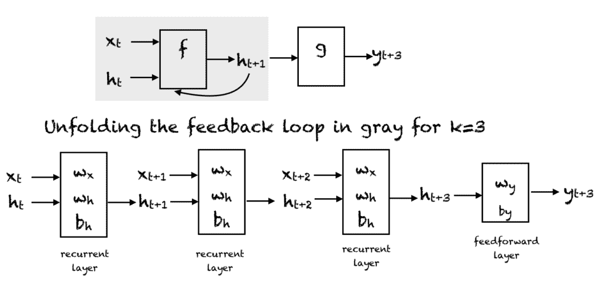

# 循环神经网络及其数学基础介绍

> 原文：[`machinelearningmastery.com/an-introduction-to-recurrent-neural-networks-and-the-math-that-powers-them/`](https://machinelearningmastery.com/an-introduction-to-recurrent-neural-networks-and-the-math-that-powers-them/)

对于序列或时间序列数据，传统的前馈网络无法用于学习和预测。需要一种机制来保留过去或历史信息，以预测未来的值。循环神经网络，简称 RNN，是一种变体的前馈人工神经网络，可以处理序列数据，并且可以被训练以保留有关过去的知识。

完成本教程后，你将了解：

+   循环神经网络

+   展开 RNN 是什么意思

+   RNN 中的权重如何更新

+   各种 RNN 架构

**启动你的项目**，请参阅我的书籍[构建具有注意力机制的变换器模型](https://machinelearningmastery.com/transformer-models-with-attention/)。它提供了**自学教程**和**可运行的代码**，引导你构建一个完全可工作的变换器模型。

*将句子从一种语言翻译成另一种语言*…

让我们开始吧。

循环神经网络及其数学基础介绍。照片由 Mehreen Saeed 提供，保留部分权利。

## 教程概述

本教程分为两部分；它们是：

1.  RNN 的工作原理

    1.  时间上的展开

    1.  反向传播时间算法

1.  不同的 RNN 架构和变体

## 先决条件

本教程假设你已经熟悉人工神经网络和反向传播算法。如果没有，你可以阅读 Stefania Cristina 的这篇非常好的教程，[Calculus in Action: Neural Networks](https://machinelearningmastery.com/calculus-in-action-neural-networks/)。该教程还解释了如何使用基于梯度的反向传播算法来训练神经网络。

## 什么是循环神经网络

循环神经网络（RNN）是一种特殊的人工神经网络，适用于时间序列数据或涉及序列的数据。普通的前馈神经网络仅适用于彼此独立的数据点。然而，如果我们有一个数据序列，其中一个数据点依赖于之前的数据点，我们需要修改神经网络以纳入这些数据点之间的依赖关系。RNN 具有“记忆”的概念，帮助它们存储先前输入的状态或信息，以生成序列的下一个输出。

### 想开始构建具有注意力机制的变换器模型吗？

立即领取我的免费 12 天电子邮件速成课程（含示例代码）。

点击注册并获取课程的免费 PDF 电子书版本。

## 循环神经网络的展开

递归神经网络。压缩表示（上），展开网络（下）。

简单的 RNN 有一个反馈回路，如上图的第一个图示所示。图中灰色矩形内的反馈回路可以展开为三个时间步，以产生上图中的第二个网络。当然，你可以改变架构，使得网络展开 $k$ 个时间步。在图中，使用了以下符号：

+   $x_t \in R$ 是时间步 $t$ 的输入。为了简化问题，我们假设 $x_t$ 是一个具有单一特征的标量值。你可以将这个概念扩展到一个 $d$ 维特征向量。

+   $y_t \in R$ 是网络在时间步 $t$ 的输出。我们可以在网络中产生多个输出，但在这个例子中，我们假设只有一个输出。

+   $h_t \in R^m$ 向量存储时间 $t$ 的隐藏单元/状态的值。这也称为当前上下文。$m$ 是隐藏单元的数量。$h_0$ 向量初始化为零。

+   $w_x \in R^{m}$ 是与递归层中的输入相关的权重

+   $w_h \in R^{mxm}$ 是与递归层中的隐藏单元相关的权重

+   $w_y \in R^m$ 是与隐藏单元到输出单元相关的权重

+   $b_h \in R^m$ 是与递归层相关的偏置

+   $b_y \in R$ 是与前馈层相关的偏置

在每个时间步，我们可以将网络展开 $k$ 个时间步，以获取时间步 $k+1$ 的输出。展开的网络非常类似于前馈神经网络。展开网络中的矩形表示一个操作。因此，例如，使用激活函数 f：

$$h_{t+1} = f(x_t, h_t, w_x, w_h, b_h) = f(w_{x} x_t + w_{h} h_t + b_h)$$

时间 $t$ 的输出 $y$ 计算如下：

$$

$y_{t} = f(h_t, w_y) = f(w_y \cdot h_t + b_y)$

$$

这里，$\cdot$ 是点积。

因此，在 RNN 的前馈过程中，网络在 $k$ 个时间步后计算隐藏单元和输出的值。与网络相关的权重是时间共享的。每个递归层有两组权重：一组用于输入，另一组用于隐藏单元。最后的前馈层，即计算第 $k$ 个时间步的最终输出的层，就像传统前馈网络中的普通层一样。

## 激活函数

我们可以在递归神经网络中使用任何我们喜欢的激活函数。常见的选择有：

+   Sigmoid 函数：$\frac{1}{1+e^{-x}}$

+   Tanh 函数：$\frac{e^{x}-e^{-x}}{e^{x}+e^{-x}}$

+   Relu 函数：max$(0,x)$

## 训练递归神经网络

人工神经网络的反向传播算法被修改以包括时间展开以训练网络的权重。该算法基于计算梯度向量，称为时间反向传播或简称为 BPTT 算法。下面给出了训练的伪代码。用户可以选择训练的 $k$ 值。在下面的伪代码中，$p_t$ 是时间步 t 的目标值：

1.  重复直到满足停止准则：

    1.  将所有的 $h$ 设置为零。

    1.  从 t = 0 到 n-k 重复

        1.  在展开的网络上向前传播网络 $k$ 个时间步以计算所有的 $h$ 和 $y$

        1.  计算误差为：$e = y_{t+k}-p_{t+k}$

        1.  在展开网络上反向传播错误并更新权重

## RNN 的类型

有不同类型的递归神经网络，具有不同的架构。一些示例包括：

### 一对一

这里有一个单一的 $(x_t, y_t)$ 对。传统的神经网络采用一对一的架构。

### 一对多

在一对多网络中，单个输入 $x_t$ 可以产生多个输出，例如 $(y_{t0}, y_{t1}, y_{t2})$。音乐生成是一对多网络应用的示例领域。

### 多对一

在这种情况下，来自不同时间步的多个输入产生单个输出。例如，$(x_t, x_{t+1}, x_{t+2})$ 可以产生单个输出 $y_t$。这样的网络用于情感分析或情绪检测，其中类别标签依赖于一系列单词。

### 多对多

有许多可能性适用于多对多。上面显示了一个例子，其中两个输入产生三个输出。多对多网络应用于机器翻译，例如英语到法语或其反向翻译系统。

## 循环神经网络（RNN）的优点和缺点

RNN 具有各种优点，例如：

+   能够处理序列数据

+   能够处理不同长度的输入

+   能够存储或“记忆”历史信息

缺点包括：

+   计算可能非常缓慢。

+   网络在做决策时不考虑未来的输入。

+   梯度消失问题，即用于计算权重更新的梯度可能非常接近零，阻止网络学习新的权重。网络越深，这个问题越显著。

## 不同的 RNN 架构

不同变体的 RNN 正在实际应用于机器学习问题中：

### 双向递归神经网络（BRNN）

在 BRNN 中，未来时间步的输入用于提高网络的准确性。这就像知道一句话的首尾词来预测中间的词。

### 门控递归单元（GRU）

这些网络旨在处理梯度消失问题。它们具有重置和更新门，这些门决定哪些信息将被保留用于未来的预测。

### 长短期记忆（LSTM）

[LSTM](https://machinelearningmastery.com/time-series-prediction-lstm-recurrent-neural-networks-python-keras/) 也旨在解决递归神经网络中的梯度消失问题。LSTM 使用三个门，分别是输入门、输出门和遗忘门。类似于 GRU，这些门决定保留哪些信息。

## 进一步阅读

本节提供了更多相关资源，如果你想深入了解这一主题。

### 书籍

+   [深度学习要点](https://www.amazon.com/Deep-Learning-Essentials-hands-fundamentals/dp/1785880365) 由魏迪、阿努拉格·巴尔德瓦杰和魏剑宁编著。

+   [深度学习](https://www.amazon.com/Deep-Learning-Adaptive-Computation-Machine/dp/0262035618/ref=as_li_ss_tl?dchild=1&keywords=deep+learning&qid=1606171954&s=books&sr=1-1&linkCode=sl1&tag=inspiredalgor-20&linkId=0a0c58945768a65548b639df6d1a98ed&language=en_US) 由伊恩·古德费洛、约书亚·本吉奥和亚伦·库维尔编著。

### 文章

+   [关于 BPTT 的维基百科文章](https://en.wikipedia.org/wiki/Backpropagation_through_time)

+   [递归神经网络算法概述](https://machinelearningmastery.com/recurrent-neural-network-algorithms-for-deep-learning/)

+   [回溯传播的温和介绍](https://machinelearningmastery.com/gentle-introduction-backpropagation-time/)

## 总结

在本教程中，你发现了递归神经网络及其各种架构。

具体来说，你学到了：

+   递归神经网络如何处理序列数据

+   在递归神经网络中随时间展开

+   什么是时间中的回溯传播

+   递归神经网络的优缺点

+   递归神经网络的各种架构和变体

你对本文讨论的递归神经网络有任何问题吗？请在下面的评论中提出问题，我会尽力回答。
