# 变换器模型与注意力机制速成课程。12 天内构建一个神经机器翻译器

> 原文：[`machinelearningmastery.com/building-transformer-models-with-attention-crash-course-build-a-neural-machine-translator-in-12-days/`](https://machinelearningmastery.com/building-transformer-models-with-attention-crash-course-build-a-neural-machine-translator-in-12-days/)

变换器是神经机器翻译中的一种最新突破。自然语言很复杂。一种语言中的一个词可以在另一种语言中翻译成多个词，具体取决于**上下文**。但上下文究竟是什么，如何教计算机理解上下文是一个大问题。注意力机制的发明解决了如何将上下文编码到一个词中的问题，换句话说，就是如何将一个词**和**它的上下文一起呈现为一个数值向量。变换器将这一点提升到了一个更高的层次，使我们可以仅使用注意力机制而没有递归结构来构建自然语言翻译的神经网络。这不仅使网络更简单、更容易训练、并且算法上可并行化，还允许构建更复杂的语言模型。因此，我们几乎可以看到计算机翻译的句子几乎完美无瑕。

确实，这样一个强大的深度学习模型并不难构建。在 TensorFlow 和 Keras 中，你几乎可以随时获取所有构建块，训练模型只需几个小时。看到变换器模型被构建和训练是很有趣的。看到一个训练好的模型将句子从一种语言翻译到另一种语言则更有趣。

在这个速成课程中，你将按照原始研究论文的类似设计构建一个变换器模型。

这是一个重要的帖子。你可能想要收藏它。

开始吧。


变换器模型与注意力机制（12 天迷你课程）。

图片由 [诺伯特·布劳恩](https://unsplash.com/photos/uU8n5LuzpTc) 提供，版权所有。

## 这个速成课程适合谁？

在开始之前，我们需要确保你在正确的位置。

这个课程适合那些已经熟悉 TensorFlow/Keras 的开发者。课程的内容假设你具备一些前提条件，例如：

+   你知道如何构建自定义模型，包括 Keras 函数式 API

+   你知道如何在 Keras 中训练深度学习模型

+   你知道如何使用训练好的模型进行推理

你不需要是：

+   自然语言处理专家

+   多语言使用者

这个速成课程可以帮助你更深入地理解什么是变换器模型及其功能。

本速成课程假设你已经安装了工作中的 TensorFlow 2.10 环境。如果你需要帮助，可以按照这里的逐步教程进行：

+   [如何使用 Anaconda 设置 Python 环境以进行机器学习](https://machinelearningmastery.com/setup-python-environment-machine-learning-deep-learning-anaconda/)

## 快速课程概述

这个速成课程分为 12 节课。

你可以每天完成一节课（推荐）或者在一天内完成所有课程（高强度）。这真的取决于你可用的时间和你的热情程度。

以下是 12 节课程的列表，它们将帮助你入门并了解 Transformer 模型的构建。

+   课程 01：获取数据

+   课程 02：文本规范化

+   课程 03：向量化和数据集创建

+   课程 04：位置编码矩阵

+   课程 05：位置编码层

+   课程 06：Transformer 构建模块

+   课程 07：Transformer 编码器和解码器

+   课程 08：构建 Transformer

+   课程 09：准备 Transformer 模型进行训练

+   课程 10：训练 Transformer

+   课程 11：Transformer 模型的推理

+   课程 12：改进模型

每节课可能需要你 15 到 60 分钟。花时间按照自己的节奏完成课程。提出问题，甚至在网上发布结果。

课程可能会期望你去查找如何做事的方法。本指南将给你提示，但即使你只是按照课程中的代码，你也可以完成一个效果相当不错的 Transformer 模型。

**在评论中发布你的结果**；我会为你加油！

坚持下去；不要放弃。

## 课程 01：获取数据

由于你正在构建一个神经机器翻译器，你需要用于训练和测试的数据。让我们构建一个基于句子的英法翻译器。网络上有许多资源。例如，用户贡献的 Anki 闪卡应用程序的数据。你可以在 [`ankiweb.net/shared/decks/french`](https://ankiweb.net/shared/decks/french) 下载一些数据文件。数据文件将是一个包含 SQLite 数据库文件的 ZIP 文件，你可以从中提取英法句对。

不过，你可能会发现拥有文本文件版本更为方便，你可以在 [`www.manythings.org/anki/`](https://www.manythings.org/anki/) 找到这个文件的镜像。Google 也托管了这个文件的镜像

好的，我们将使用这些数据。

以下代码将下载压缩的数据文件并解压它：

```py
import pathlib

import tensorflow as tf

# download dataset provided by Anki: https://www.manythings.org/anki/
text_file = tf.keras.utils.get_file(
    fname="fra-eng.zip",
    origin="http://storage.googleapis.com/download.tensorflow.org/data/fra-eng.zip",
    extract=True,
)
# show where the file is located now
text_file = pathlib.Path(text_file).parent / "fra.txt"
print(text_file)
```

数据文件将是一个名为 `fra.txt` 的纯文本文件。其格式将是：

```py
<English sentence><tab character><French sentence>
```

### 你的任务

尝试运行上述代码并打开提取的文件。你应该验证每一行的格式是否与上述一致。

在下一节课中，你将处理此文件并准备适合训练和测试的数据集。

## 课程 02：文本规范化

就像所有 NLP 任务一样，你需要在使用文本之前进行规范化。法语字母有重音符号，这些会以 Unicode 字符表示，但这种表示在 Unicode 中并不唯一。因此，你将把字符串转换为 NFKC（兼容性和组合规范形式）。

接下来，你将对句子进行标记化。每个单词和每个标点符号应该是一个独立的标记。然而，用于缩写形式的标点符号，如 *don’t*、*va-t-il* 或 *c’est*，不会与单词分开。此外，将所有内容转换为小写，期望这会减少词汇中的不同单词数量。

标准化和标记化可以更深入，例如子词标记化、词干提取和词形还原。但为了简化起见，你在这个项目中不会做这些。

从头开始，标准化文本的代码如下。你将使用 Python 模块 `unicodedata` 将 Unicode 字符串转换为 NFKC 标准形式。然后你将使用正则表达式在标点符号周围添加空格。之后，你将用哨兵 `[start]` 和 `[end]` 包裹法语句子（即目标语言）。你将在后续课程中看到哨兵的目的。

```py
import pathlib
import pickle
import random
import re
import unicodedata

import tensorflow as tf

# download dataset provided by Anki: https://www.manythings.org/anki/
text_file = tf.keras.utils.get_file(
    fname="fra-eng.zip",
    origin="http://storage.googleapis.com/download.tensorflow.org/data/fra-eng.zip",
    extract=True,
)
text_file = pathlib.Path(text_file).parent / "fra.txt"

def normalize(line):
    """Normalize a line of text and split into two at the tab character"""
    line = unicodedata.normalize("NFKC", line.strip().lower())
    line = re.sub(r"^([^ \w])(?!\s)", r"\1 ", line)
    line = re.sub(r"(\s[^ \w])(?!\s)", r"\1 ", line)
    line = re.sub(r"(?!\s)([^ \w])$", r" \1", line)
    line = re.sub(r"(?!\s)([^ \w]\s)", r" \1", line)
    eng, fra = line.split("\t")
    fra = "[start] " + fra + " [end]"
    return eng, fra

# normalize each line and separate into English and French
with open(text_file) as fp:
    text_pairs = [normalize(line) for line in fp]

# print some samples
for _ in range(5):
    print(random.choice(text_pairs))

with open("text_pairs.pickle", "wb") as fp:
    pickle.dump(text_pairs, fp)
```

当你运行这段代码时，你应该会看到一些样本的结果，如下所示：

```py
('where did you put your key ?', '[start] où est-ce tu as mis ta clé  ?  [end]')
('you missed a spot .', '[start] tu as loupé une tache . [end]')
("i think we're being followed .", '[start] je pense que nous sommes suivis . [end]')
('i bought a cactus .', "[start] j'ai acheté un cactus . [end]")
('i have more than enough .', "[start] j'en ai plus que marre . [end]")
```

我们将标准化的句子对保存在一个 pickle 文件中，因此可以在后续步骤中重复使用。

当你将它用于模型时，你希望了解一些关于此数据集的统计信息。特别是，你想看看每种语言中有多少个不同的标记（单词）以及句子的长度。你可以按以下方式找出这些信息：

```py
import pickle

with open("text_pairs.pickle", "rb") as fp:
    text_pairs = pickle.load(fp)

# count tokens
eng_tokens, fra_tokens = set(), set()
eng_maxlen, fra_maxlen = 0, 0
for eng, fra in text_pairs:
    eng_tok, fra_tok = eng.split(), fra.split()
    eng_maxlen = max(eng_maxlen, len(eng_tok))
    fra_maxlen = max(fra_maxlen, len(fra_tok))
    eng_tokens.update(eng_tok)
    fra_tokens.update(fra_tok)
print(f"Total English tokens: {len(eng_tokens)}")
print(f"Total French tokens: {len(fra_tokens)}")
print(f"Max English length: {eng_maxlen}")
print(f"Max French length: {fra_maxlen}")
print(f"{len(text_pairs)} total pairs")
```

### 你的任务

运行上述代码。查看不仅是样本句子，还有你收集的统计信息。记住这些输出，因为它们对你的下一节课非常有用。此外，了解句子的最大长度不如了解它们的分布有用。你应该为此绘制一个直方图。试着生成以下图表：

```py
import pickle

import matplotlib.pyplot as plt

with open("text_pairs.pickle", "rb") as fp:
    text_pairs = pickle.load(fp)

# histogram of sentence length in tokens
en_lengths = [len(eng.split()) for eng, fra in text_pairs]
fr_lengths = [len(fra.split()) for eng, fra in text_pairs]

plt.hist(en_lengths, label="en", color="red", alpha=0.33)
plt.hist(fr_lengths, label="fr", color="blue", alpha=0.33)
plt.yscale("log")     # sentence length fits Benford"s law
plt.ylim(plt.ylim())  # make y-axis consistent for both plots
plt.plot([max(en_lengths), max(en_lengths)], plt.ylim(), color="red")
plt.plot([max(fr_lengths), max(fr_lengths)], plt.ylim(), color="blue")
plt.legend()
plt.title("Examples count vs Token length")
plt.show()
```

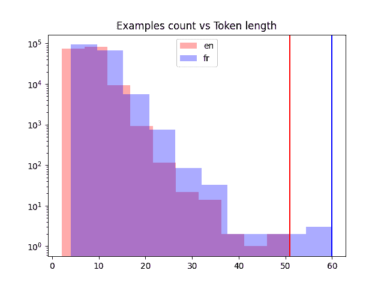

不同语言中的句子长度

在下一个课程中，你将对这些标准化的文本数据进行向量化并创建数据集。

## 课程 03：向量化和创建数据集

在前面的课程中，你清理了句子，但它们仍然是文本。神经网络只能处理数字。将文本转换为数字的一种方法是通过向量化。这意味着将文本中的标记转换为整数。因此，包含 $n$ 个标记（单词）的句子将变成一个 **向量**，包含 $n$ 个整数。

你可以构建自己的向量化器。简单地构建一个每个唯一标记到唯一整数的映射表。当使用时，你一个一个地查找表中的标记，并返回整数形式的向量。

在 Keras 中，你有 `TextVectorization` 层来节省构建向量化器的工作。它支持填充，即整数 0 被保留用于表示“空”。当你提供一个 $m < n$ 的标记句子时，但希望向量化器始终返回固定长度 $n$ 的向量时，这非常有用。

您将首先将句子对拆分为训练、验证和测试集，因为这些是模型训练所需的。然后，创建一个 `TextVectorization` 层并仅适应于训练集（因为在完成模型训练之前，您不应窥视验证或测试数据集）。

```py
import pickle
import random

from tensorflow.keras.layers import TextVectorization

# Load normalized sentence pairs
with open("text_pairs.pickle", "rb") as fp:
    text_pairs = pickle.load(fp)

# train-test-val split of randomized sentence pairs
random.shuffle(text_pairs)
n_val = int(0.15*len(text_pairs))
n_train = len(text_pairs) - 2*n_val
train_pairs = text_pairs[:n_train]
val_pairs = text_pairs[n_train:n_train+n_val]
test_pairs = text_pairs[n_train+n_val:]

# Parameter determined after analyzing the input data
vocab_size_en = 10000
vocab_size_fr = 20000
seq_length = 20

# Create vectorizer
eng_vectorizer = TextVectorization(
    max_tokens=vocab_size_en,
    standardize=None,
    split="whitespace",
    output_mode="int",
    output_sequence_length=seq_length,
)
fra_vectorizer = TextVectorization(
    max_tokens=vocab_size_fr,
    standardize=None,
    split="whitespace",
    output_mode="int",
    output_sequence_length=seq_length + 1
)

# train the vectorization layer using training dataset
train_eng_texts = [pair[0] for pair in train_pairs]
train_fra_texts = [pair[1] for pair in train_pairs]
eng_vectorizer.adapt(train_eng_texts)
fra_vectorizer.adapt(train_fra_texts)

# save for subsequent steps
with open("vectorize.pickle", "wb") as fp:
    data = {
        "train": train_pairs,
        "val":   val_pairs,
        "test":  test_pairs,
        "engvec_config":  eng_vectorizer.get_config(),
        "engvec_weights": eng_vectorizer.get_weights(),
        "fravec_config":  fra_vectorizer.get_config(),
        "fravec_weights": fra_vectorizer.get_weights(),
    }
    pickle.dump(data, fp)
```

注意，`TextVectorization` 对象的参数 `max_tokens` 可以省略以让向量化器自行处理。但是，如果将它们设置为一个比总词汇量更小的值（比如这种情况），则限制了向量化器仅学习更频繁的单词，并将罕见单词标记为**超出词汇表**（OOV）。这可能对跳过价值不大或拼写错误的单词很有用。您还要固定向量化器的输出长度。我们假设以上句子中的每个句子应不超过 20 个标记。

接下来，您需要使用向量化器并创建一个 TensorFlow 数据集对象。这将有助于您在后续步骤中训练我们的模型。

```py
import pickle

import tensorflow as tf
from tensorflow.keras.layers import TextVectorization

# load text data and vectorizer weights
with open("vectorize.pickle", "rb") as fp:
    data = pickle.load(fp)

train_pairs = data["train"]
val_pairs = data["val"]
test_pairs = data["test"]   # not used

eng_vectorizer = TextVectorization.from_config(data["engvec_config"])
eng_vectorizer.set_weights(data["engvec_weights"])
fra_vectorizer = TextVectorization.from_config(data["fravec_config"])
fra_vectorizer.set_weights(data["fravec_weights"])

# set up Dataset object
def format_dataset(eng, fra):
    """Take an English and a French sentence pair, convert into input and target.
    The input is a dict with keys `encoder_inputs` and `decoder_inputs`, each
    is a vector, corresponding to English and French sentences respectively.
    The target is also vector of the French sentence, advanced by 1 token. All
    vector are in the same length.

    The output will be used for training the transformer model. In the model we
    will create, the input tensors are named `encoder_inputs` and `decoder_inputs`
    which should be matched to the keys in the dictionary for the source part
    """
    eng = eng_vectorizer(eng)
    fra = fra_vectorizer(fra)
    source = {"encoder_inputs": eng,
              "decoder_inputs": fra[:, :-1]}
    target = fra[:, 1:]
    return (source, target)

def make_dataset(pairs, batch_size=64):
    """Create TensorFlow Dataset for the sentence pairs"""
    # aggregate sentences using zip(*pairs)
    eng_texts, fra_texts = zip(*pairs)
    # convert them into list, and then create tensors
    dataset = tf.data.Dataset.from_tensor_slices((list(eng_texts), list(fra_texts)))
    return dataset.shuffle(2048) \
                  .batch(batch_size).map(format_dataset) \
                  .prefetch(16).cache()

train_ds = make_dataset(train_pairs)
val_ds = make_dataset(val_pairs)

# test the dataset
for inputs, targets in train_ds.take(1):
    print(f'inputs["encoder_inputs"].shape: {inputs["encoder_inputs"].shape}')
    print(f'inputs["encoder_inputs"][0]: {inputs["encoder_inputs"][0]}')
    print(f'inputs["decoder_inputs"].shape: {inputs["decoder_inputs"].shape}')
    print(f'inputs["decoder_inputs"][0]: {inputs["decoder_inputs"][0]}')
    print(f"targets.shape: {targets.shape}")
    print(f"targets[0]: {targets[0]}")
```

稍后您将重复使用此代码以创建 `train_ds` 和 `val_ds` 数据集对象。

### 您的任务

运行上述代码。验证您是否能看到类似以下的输出：

```py
inputs["encoder_inputs"].shape: (64, 20)
inputs["encoder_inputs"][0]: [142   8 263 979   2   0   0   0   0   0   0   0   0
   0   0   0   0   0   0   0]
inputs["decoder_inputs"].shape: (64, 20)
inputs["decoder_inputs"][0]: [   2   15 2496  190    4    3    0    0    0    0
    0    0    0    0    0    0    0    0    0    0]
targets.shape: (64, 20)
targets[0]: [  15 2496  190    4    3    0    0    0    0    0    0    0    0    0
    0    0    0    0    0    0]
```

精确的向量可能不同，但您应该看到形状应该都是（*批次大小*，*序列长度*）。以上一些代码是从 François Chollet 的教程中借用的，[使用序列到序列 Transformer 进行英语到西班牙语翻译](https://keras.io/examples/nlp/neural_machine_translation_with_transformer/)。您可能还想看看他的 Transformer 实现与本小课程有何不同。

在下一课中，您将转到位置编码的主题。

## 第 04 课：位置编码矩阵

当一个句子被向量化时，您会得到一个整数向量，其中每个整数代表一个单词。这里的整数只是一个标签。我们不能假设两个整数彼此更接近意味着它们表示的单词相关。

为了理解单词的含义以及量化两个单词如何相互关联，您将使用**词嵌入**技术。但是为了理解上下文，您还需要知道每个单词在句子中的位置。这是通过**位置编码**来实现的。

在论文[Attention Is All You Need](https://arxiv.org/pdf/1706.03762.pdf)中，位置编码使用一个向量来表示每个令牌的位置。向量的元素是正弦波的不同相位和频率的值。具体来说，在位置 $k=0, 1, \cdots, L-1$ 处，位置编码向量（长度为 $d$）为

$$

[P(k,0), P(k,1), \cdots, P(k,d-2), P(k,d-1)]

$$

其中对于 $i=0, 1, \cdots, d/2$，

$$

\begin{aligned}

P(k, 2i) &= \sin\Big(\frac{k}{n^{2i/d}}\Big) \\

P(k, 2i+1) &= \cos\Big(\frac{k}{n^{2i/d}}\Big)

\end{aligned}

$$

在论文中，他们使用了 $n=10000$。

实现位置编码并不困难，特别是如果您可以使用 NumPy 中的向量函数。

```py
import pickle

import matplotlib.pyplot as plt
import numpy as np

def pos_enc_matrix(L, d, n=10000):
    """Create positional encoding matrix

    Args:
        L: Input dimension (length)
        d: Output dimension (depth), even only
        n: Constant for the sinusoidal functions

    Returns:
        numpy matrix of floats of dimension L-by-d. At element (k,2i) the value
        is sin(k/n^(2i/d)) while at element (k,2i+1) the value is cos(k/n^(2i/d))
    """
    assert d % 2 == 0, "Output dimension needs to be an even integer"
    d2 = d//2
    P = np.zeros((L, d))
    k = np.arange(L).reshape(-1, 1)     # L-column vector
    i = np.arange(d2).reshape(1, -1)    # d-row vector
    denom = np.power(n, -i/d2)          # n**(-2*i/d)
    args = k * denom                    # (L,d) matrix
    P[:, ::2] = np.sin(args)
    P[:, 1::2] = np.cos(args)
    return P

# Plot the positional encoding matrix
pos_matrix = pos_enc_matrix(L=2048, d=512)
assert pos_matrix.shape == (2048, 512)
plt.pcolormesh(pos_matrix, cmap='RdBu')
plt.xlabel('Depth')
plt.ylabel('Position')
plt.colorbar()
plt.show()

with open("posenc-2048-512.pickle", "wb") as fp:
    pickle.dump(pos_matrix, fp)
```

你可以看到，我们创建了一个函数来生成位置编码。我们使用$L=2048$和$d=512$进行了测试。输出将是一个$2048\times 512$的矩阵。我们还在热图中绘制了编码。这应该看起来像下面这样。

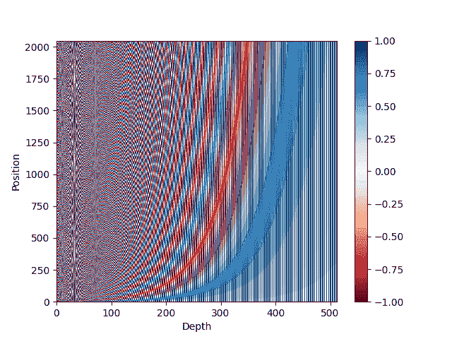

位置编码矩阵的热图表示

### 你的任务

上述热图可能对你来说不太吸引人。更好的可视化方法是将正弦曲线与余弦曲线分开。尝试下面的代码重新使用序列化的位置编码矩阵，并获得更清晰的可视化：

```py
import pickle

import matplotlib.pyplot as plt
import numpy as np

with open("posenc-2048-512.pickle", "rb") as fp:
    pos_matrix = pickle.load(fp)
assert pos_matrix.shape == (2048, 512)
# Plot the positional encoding matrix, alternative way
plt.pcolormesh(np.hstack([pos_matrix[:, ::2], pos_matrix[:, 1::2]]), cmap='RdBu')
plt.xlabel('Depth')
plt.ylabel('Position')
plt.colorbar()
plt.show()
```

如果你愿意，你可以检查矩阵中不同“深度”代表不同频率的正弦曲线。一个可视化它们的例子如下所示：

```py
...
plt.plot(pos_matrix[:, 155], label="high freq")
plt.plot(pos_matrix[:, 300], label="low freq")
plt.legend()
plt.show()
```

但是，如果你可视化矩阵的一个“位置”，你会看到一个有趣的曲线：

```py
import pickle
import matplotlib.pyplot as plt

with open("posenc-2048-512.pickle", "rb") as fp:
    pos_matrix = pickle.load(fp)
assert pos_matrix.shape == (2048, 512)
# Plot two curves from different position
plt.plot(pos_matrix[100], alpha=0.66, color="red", label="position 100")
plt.legend()
plt.show()
```

显示给你这个：

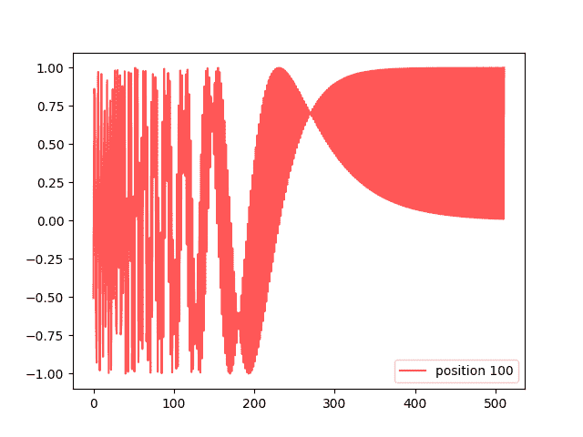

一个编码向量

编码矩阵在比较两个编码向量时很有用，可以告诉它们位置有多远。两个归一化向量的点积如果相同则为 1，当它们移动时迅速下降。这种关系可以在下面的可视化中看到：

```py
import pickle

import matplotlib.pyplot as plt
import numpy as np

with open("posenc-2048-512.pickle", "rb") as fp:
    pos_matrix = pickle.load(fp)
assert pos_matrix.shape == (2048, 512)
# Show the dot product between different normalized positional vectors
pos_matrix /= np.linalg.norm(pos_matrix, axis=1, keepdims=True)
p = pos_matrix[789]  # all vectors compare to vector at position 789
dots = pos_matrix @ p
plt.plot(dots)
plt.ylim([0, 1])
plt.show()
```

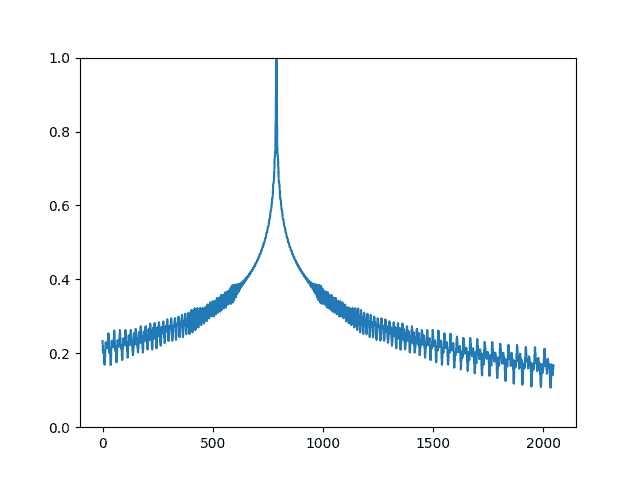

标准化位置编码向量的点积

在下一课中，你将利用位置编码矩阵在 Keras 中构建一个位置编码层。

## 第 05 课：位置编码层

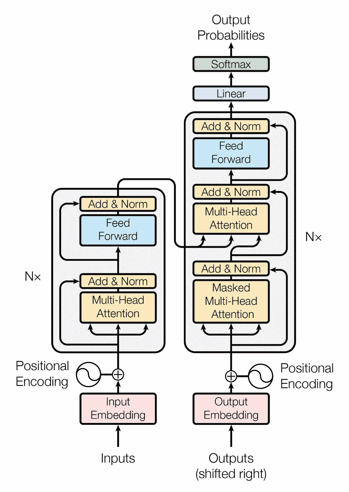

Transformer 模型

论文[注意力机制](https://arxiv.org/pdf/1706.03762.pdf)中的 Transformer 模型如下所示：

位置编码层位于 Transformer 模型的入口处。但是，Keras 库并未提供此功能。你可以创建一个自定义层来实现位置编码，如下所示。

```py
import numpy as np
import tensorflow as tf

def pos_enc_matrix(L, d, n=10000):
    """Create positional encoding matrix

    Args:
        L: Input dimension (length)
        d: Output dimension (depth), even only
        n: Constant for the sinusoidal functions

    Returns:
        numpy matrix of floats of dimension L-by-d. At element (k,2i) the value
        is sin(k/n^(2i/d)) while at element (k,2i+1) the value is cos(k/n^(2i/d))
    """
    assert d % 2 == 0, "Output dimension needs to be an even integer"
    d2 = d//2
    P = np.zeros((L, d))
    k = np.arange(L).reshape(-1, 1)     # L-column vector
    i = np.arange(d2).reshape(1, -1)    # d-row vector
    denom = np.power(n, -i/d2)          # n**(-2*i/d)
    args = k * denom                    # (L,d) matrix
    P[:, ::2] = np.sin(args)
    P[:, 1::2] = np.cos(args)
    return P

class PositionalEmbedding(tf.keras.layers.Layer):
    """Positional embedding layer. Assume tokenized input, transform into
    embedding and returns positional-encoded output."""
    def __init__(self, sequence_length, vocab_size, embed_dim, **kwargs):
        """
        Args:
            sequence_length: Input sequence length
            vocab_size: Input vocab size, for setting up embedding matrix
            embed_dim: Embedding vector size, for setting up embedding matrix
        """
        super().__init__(**kwargs)
        self.sequence_length = sequence_length
        self.vocab_size = vocab_size
        self.embed_dim = embed_dim     # d_model in paper
        # token embedding layer: Convert integer token to D-dim float vector
        self.token_embeddings = tf.keras.layers.Embedding(
            input_dim=vocab_size, output_dim=embed_dim, mask_zero=True
        )
        # positional embedding layer: a matrix of hard-coded sine values
        matrix = pos_enc_matrix(sequence_length, embed_dim)
        self.position_embeddings = tf.constant(matrix, dtype="float32")

    def call(self, inputs):
        """Input tokens convert into embedding vectors then superimposed
        with position vectors"""
        embedded_tokens = self.token_embeddings(inputs)
        return embedded_tokens + self.position_embeddings

    # this layer is using an Embedding layer, which can take a mask
    # see https://www.tensorflow.org/guide/keras/masking_and_padding#passing_mask_tensors_directly_to_layers
    def compute_mask(self, *args, **kwargs):
        return self.token_embeddings.compute_mask(*args, **kwargs)

    def get_config(self):
        # to make save and load a model using custom layer possible
        config = super().get_config()
        config.update({
            "sequence_length": self.sequence_length,
            "vocab_size": self.vocab_size,
            "embed_dim": self.embed_dim,
        })
        return config
```

这一层确实结合了嵌入层和位置编码。嵌入层创建词嵌入，即将向量化的句子中的整数标记标签转换为能够携带单词含义的向量。通过嵌入，你可以知道两个不同单词在含义上有多接近。

嵌入输出取决于标记化的输入句子。但是位置编码是一个常数矩阵，因为它仅依赖于位置。因此，你在创建此层时创建了一个常量张量。当你将嵌入输出添加到位置编码矩阵中时，TensorFlow 会智能地匹配维度，在`call()`函数中。

在上一层定义了两个额外的函数。`compute_mask()` 函数传递给了嵌入层。这是为了告诉输出的哪些位置是填充的。这将在 Keras 内部使用。`get_config()` 函数被定义为记住此层的所有配置参数。这是 Keras 中的标准实践，以便记住传递给构造函数的所有参数，并在 `get_config()` 中返回它们，以便可以保存和加载模型。

### 你的任务

将上述代码与第 03 课中创建的数据集 `train_ds` 以及下面的代码片段结合起来：

```py
# From Lesson 03:
# train_ds = make_dataset(train_pairs)

vocab_size_en = 10000
seq_length = 20

# test the dataset
for inputs, targets in train_ds.take(1):
    print(inputs["encoder_inputs"])
    embed_en = PositionalEmbedding(seq_length, vocab_size_en, embed_dim=512)
    en_emb = embed_en(inputs["encoder_inputs"])
    print(en_emb.shape)
    print(en_emb._keras_mask)
```

您应该看到类似以下的输出：

```py
tf.Tensor(
[[  10 4288  607 ...    0    0    0]
 [  28   14    4 ...    0    0    0]
 [  63   23  430 ...    2    0    0]
 ...
 [ 136  315  100 ...    0    0    0]
 [   3   20   19 ...    0    0    0]
 [  44   16    6 ...    0    0    0]], shape=(64, 20), dtype=int64)
(64, 20, 512)
tf.Tensor(
[[ True  True  True ... False False False]
 [ True  True  True ... False False False]
 [ True  True  True ...  True False False]
 ...
 [ True  True  True ... False False False]
 [ True  True  True ... False False False]
 [ True  True  True ... False False False]], shape=(64, 20), dtype=bool)
```

您可以看到上面打印的第一个张量是一个批次（64 个样本）的向量化输入句子，填充为长度 20。每个标记是一个整数，但将转换为 512 维的嵌入。因此，`en_emb` 的形状如上所示为 `(64, 20, 512)`。

上面打印的最后一个张量是使用的掩码。这实质上与输入匹配，其中位置不为零。当计算准确率时，必须记住不应计算填充位置。

在下一课中，您将完成 Transformer 模型的另一个构建模块。

## 第 06 课：Transformer 构建模块

回顾第 05 课中 Transformer 的图表，您将看到除了嵌入和位置编码之外，还有编码器（图表的左半部分）和解码器（图表的右半部分）。它们共享一些相似之处。特别是它们在开始处都有一个多头注意力块，并在末尾有一个前馈块。

如果您将每个构建模块单独创建为子模型，稍后再将它们组合成一个更大的模型将会更容易。

首先，您创建**自注意力模型**。它位于图中编码器和解码器的底部部分。一个多头注意力层将接受三个输入，即键、值和查询。如果三个输入都相同，我们称这个多头注意力层为自注意力。这个子模型将具有一个**加和标准化**层，其具有**跳跃连接**以归一化注意力层的输出。其实现如下：

```py
import tensorflow as tf

def self_attention(input_shape, prefix="att", mask=False, **kwargs):
    """Self-attention layers at transformer encoder and decoder. Assumes its
    input is the output from positional encoding layer.

    Args:
        prefix (str): The prefix added to the layer names
        masked (bool): whether to use causal mask. Should be False on encoder and
                       True on decoder. When True, a mask will be applied such that
                       each location only has access to the locations before it.
    """
    # create layers
    inputs = tf.keras.layers.Input(shape=input_shape, dtype='float32',
                                   name=f"{prefix}_in1")
    attention = tf.keras.layers.MultiHeadAttention(name=f"{prefix}_attn1", **kwargs)
    norm = tf.keras.layers.LayerNormalization(name=f"{prefix}_norm1")
    add = tf.keras.layers.Add(name=f"{prefix}_add1")
    # functional API to connect input to output
    attout = attention(query=inputs, value=inputs, key=inputs,
                       use_causal_mask=mask)
    outputs = norm(add([inputs, attout]))
    # create model and return
    model = tf.keras.Model(inputs=inputs, outputs=outputs, name=f"{prefix}_att")
    return model

seq_length = 20
key_dim = 128
num_heads = 8

model = self_attention(input_shape=(seq_length, key_dim),
                       num_heads=num_heads, key_dim=key_dim)
tf.keras.utils.plot_model(model, "self-attention.png",
                          show_shapes=True, show_dtype=True, show_layer_names=True,
                          rankdir='BT', show_layer_activations=True)
```

上面定义的函数对编码器和解码器都是通用的。解码器将设置选项 `mask=True` 来对输入应用**因果掩码**。

设置一些参数并创建一个模型。绘制的模型将如下所示：

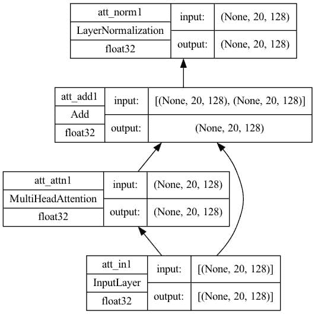

自注意力架构，关键维度=128

在解码器中，您有一个从自注意力模型和编码器输入的**交叉注意力模型**。在这种情况下，编码器的输出是值和键，而自注意力模型的输出是查询。在高层次上，它基于编码器对源句子上下文的理解，并将解码器输入的部分句子作为查询（可以为空），以预测如何完成句子。这与自注意力模型的唯一区别是，因此代码非常相似：

```py
import tensorflow as tf

def cross_attention(input_shape, context_shape, prefix="att", **kwargs):
    """Cross-attention layers at transformer decoder. Assumes its
    input is the output from positional encoding layer at decoder
    and context is the final output from encoder.

    Args:
        prefix (str): The prefix added to the layer names
    """
    # create layers
    context = tf.keras.layers.Input(shape=context_shape, dtype='float32',
                                    name=f"{prefix}_ctx2")
    inputs = tf.keras.layers.Input(shape=input_shape, dtype='float32',
                                   name=f"{prefix}_in2")
    attention = tf.keras.layers.MultiHeadAttention(name=f"{prefix}_attn2", **kwargs)
    norm = tf.keras.layers.LayerNormalization(name=f"{prefix}_norm2")
    add = tf.keras.layers.Add(name=f"{prefix}_add2")
    # functional API to connect input to output
    attout = attention(query=inputs, value=context, key=context)
    outputs = norm(add([attout, inputs]))
    # create model and return
    model = tf.keras.Model(inputs=[(context, inputs)], outputs=outputs,
                           name=f"{prefix}_cross")
    return model

seq_length = 20
key_dim = 128
num_heads = 8

model = cross_attention(input_shape=(seq_length, key_dim),
                        context_shape=(seq_length, key_dim),
                        num_heads=num_heads, key_dim=key_dim)
tf.keras.utils.plot_model(model, "cross-attention.png",
                          show_shapes=True, show_dtype=True, show_layer_names=True,
                          rankdir='BT', show_layer_activations=True)
```

绘制的模型将如下所示。请注意，该模型有两个输入，一个用于**上下文**，另一个用于自注意力的输入。

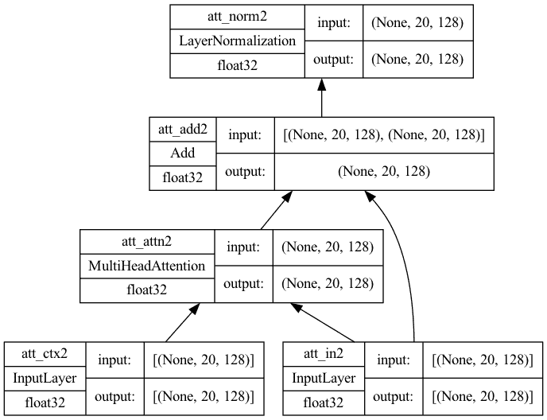

具有键维度为 128 的交叉注意力架构

最后，在编码器和解码器的输出处都有前馈模型。在 Keras 中，它实现为`Dense`层：

```py
import tensorflow as tf

def feed_forward(input_shape, model_dim, ff_dim, dropout=0.1, prefix="ff"):
    """Feed-forward layers at transformer encoder and decoder. Assumes its
    input is the output from an attention layer with add & norm, the output
    is the output of one encoder or decoder block

    Args:
        model_dim (int): Output dimension of the feed-forward layer, which
                         is also the output dimension of the encoder/decoder
                         block
        ff_dim (int): Internal dimension of the feed-forward layer
        dropout (float): Dropout rate
        prefix (str): The prefix added to the layer names
    """
    # create layers
    inputs = tf.keras.layers.Input(shape=input_shape, dtype='float32',
                                   name=f"{prefix}_in3")
    dense1 = tf.keras.layers.Dense(ff_dim, name=f"{prefix}_ff1", activation="relu")
    dense2 = tf.keras.layers.Dense(model_dim, name=f"{prefix}_ff2")
    drop = tf.keras.layers.Dropout(dropout, name=f"{prefix}_drop")
    add = tf.keras.layers.Add(name=f"{prefix}_add3")
    # functional API to connect input to output
    ffout = drop(dense2(dense1(inputs)))
    norm = tf.keras.layers.LayerNormalization(name=f"{prefix}_norm3")
    outputs = norm(add([inputs, ffout]))
    # create model and return
    model = tf.keras.Model(inputs=inputs, outputs=outputs, name=f"{prefix}_ff")
    return model

seq_length = 20
key_dim = 128
ff_dim = 512

model = feed_forward(input_shape=(seq_length, key_dim),
                     model_dim=key_dim, ff_dim=ff_dim)
tf.keras.utils.plot_model(model, "feedforward.png",
                          show_shapes=True, show_dtype=True, show_layer_names=True,
                          rankdir='BT', show_layer_activations=True)
```

绘制的模型将如下所示。请注意，第一个`Dense`层使用 ReLU 激活，第二个层没有激活。然后添加了一个 dropout 层以进行正则化。

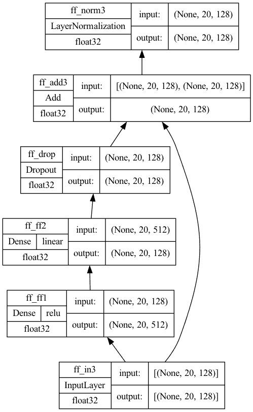

前馈子模型

### 您的任务

运行上述代码并验证您看到相同的模型图。重要的是您与布局相匹配，因为最终的变压器模型取决于它们。

在上面的代码中，使用了 Keras 的函数式 API。在 Keras 中，您可以使用顺序 API、函数式 API 或者子类化`Model`类来构建模型。子类化也可以在这里使用，但顺序 API 不行。您能告诉为什么吗？

在下一节课中，您将利用这些构建块来创建编码器和解码器。

## 第 07 课：变压器编码器和解码器

再次查看第 05 课中变压器的图表。您会看到编码器是自注意力子模型连接到前馈子模型。另一方面，解码器是一个自注意力子模型，一个交叉注意力子模型，以及一个串联的前馈子模型。

一旦有了这些子模型作为构建块，创建编码器和解码器就不难了。首先，您有编码器。它足够简单，可以使用 Keras 顺序 API 构建编码器模型。

```py
import tensorflow as tf

# the building block functions from Lesson 06
from lesson_06 import self_attention, feed_forward

def encoder(input_shape, key_dim, ff_dim, dropout=0.1, prefix="enc", **kwargs):
    """One encoder unit. The input and output are in the same shape so we can
    daisy chain multiple encoder units into one larger encoder"""
    model = tf.keras.models.Sequential([
        tf.keras.layers.Input(shape=input_shape, dtype='float32', name=f"{prefix}_in0"),
        self_attention(input_shape, prefix=prefix, key_dim=key_dim, mask=False, **kwargs),
        feed_forward(input_shape, key_dim, ff_dim, dropout, prefix),
    ], name=prefix)
    return model

seq_length = 20
key_dim = 128
ff_dim = 512
num_heads = 8

model = encoder(input_shape=(seq_length, key_dim), key_dim=key_dim, ff_dim=ff_dim,
                num_heads=num_heads)
tf.keras.utils.plot_model(model, "encoder.png",
                          show_shapes=True, show_dtype=True, show_layer_names=True,
                          rankdir='BT', show_layer_activations=True)
```

绘制模型会看到它就像下面一样简单：

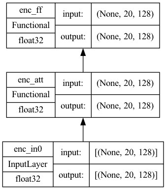

编码器子模型

解码器有些复杂，因为交叉注意力块还从编码器那里获取输入；因此，这是一个接受两个输入的模型。它实现如下：

```py
import tensorflow as tf

# the three building block functions from Lesson 06
from lesson_06 import self_attention, cross_attention, feed_forward

def decoder(input_shape, key_dim, ff_dim, dropout=0.1, prefix="dec", **kwargs):
    """One decoder unit. The input and output are in the same shape so we can
    daisy chain multiple decoder units into one larger decoder. The context
    vector is also assumed to be the same shape for convenience"""
    inputs = tf.keras.layers.Input(shape=input_shape, dtype='float32',
                                   name=f"{prefix}_in0")
    context = tf.keras.layers.Input(shape=input_shape, dtype='float32',
                                    name=f"{prefix}_ctx0")
    attmodel = self_attention(input_shape, key_dim=key_dim, mask=True,
                              prefix=prefix, **kwargs)
    crossmodel = cross_attention(input_shape, input_shape, key_dim=key_dim,
                                 prefix=prefix, **kwargs)
    ffmodel = feed_forward(input_shape, key_dim, ff_dim, dropout, prefix)
    x = attmodel(inputs)
    x = crossmodel([(context, x)])
    output = ffmodel(x)
    model = tf.keras.Model(inputs=[(inputs, context)], outputs=output, name=prefix)
    return model

seq_length = 20
key_dim = 128
ff_dim = 512
num_heads = 8

model = decoder(input_shape=(seq_length, key_dim), key_dim=key_dim, ff_dim=ff_dim,
                num_heads=num_heads)
tf.keras.utils.plot_model(model, "decoder.png",
                          show_shapes=True, show_dtype=True, show_layer_names=True,
                          rankdir='BT', show_layer_activations=True)
```

模型将如下所示：

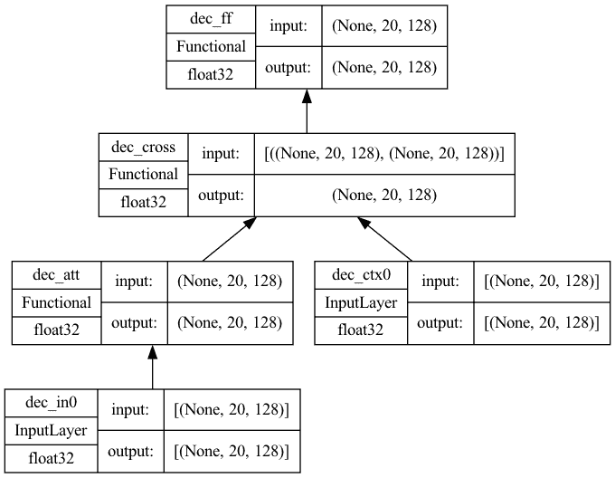

解码器子模型

### 您的任务

从第 06 课中复制三个构建块函数，并运行上述代码以确保您看到与编码器和解码器中所示的相同布局。

在下一节课中，您将使用到目前为止创建的构建块来完成变压器模型。

## 第 08 课：构建变压器

的确，一个变压器有编码器和解码器部分，每部分不仅仅是一个，而是一系列的编码器或解码器。听起来复杂，但如果你有构建块子模型来隐藏细节，就不那么复杂了。

参见第 05 课的图示，你会看到编码器和解码器部分只是编码器和解码器块的链。只有最后一个编码器块的输出被用作解码器块的输入。

因此，完整的变压器模型可以按如下方式构建：

```py
import tensorflow as tf

# the positional embedding layer from Lesson 05
from lesson_05 import PositionalEmbedding
# the building block functions from Lesson 07
from lesson_07 import encoder, decoder

def transformer(num_layers, num_heads, seq_len, key_dim, ff_dim, vocab_size_src,
                vocab_size_tgt, dropout=0.1, name="transformer"):
    embed_shape = (seq_len, key_dim)  # output shape of the positional embedding layer
    # set up layers
    input_enc = tf.keras.layers.Input(shape=(seq_len,), dtype="int32",
                                      name="encoder_inputs")
    input_dec = tf.keras.layers.Input(shape=(seq_len,), dtype="int32",
                                      name="decoder_inputs")
    embed_enc = PositionalEmbedding(seq_len, vocab_size_src, key_dim, name="embed_enc")
    embed_dec = PositionalEmbedding(seq_len, vocab_size_tgt, key_dim, name="embed_dec")
    encoders = [encoder(input_shape=embed_shape, key_dim=key_dim,
                        ff_dim=ff_dim, dropout=dropout, prefix=f"enc{i}",
                        num_heads=num_heads)
                for i in range(num_layers)]
    decoders = [decoder(input_shape=embed_shape, key_dim=key_dim,
                        ff_dim=ff_dim, dropout=dropout, prefix=f"dec{i}",
                        num_heads=num_heads)
                for i in range(num_layers)]
    final = tf.keras.layers.Dense(vocab_size_tgt, name="linear")
    # build output
    x1 = embed_enc(input_enc)
    x2 = embed_dec(input_dec)
    for layer in encoders:
        x1 = layer(x1)
    for layer in decoders:
        x2 = layer([x2, x1])
    output = final(x2)
    # XXX keep this try-except block
    try:
        del output._keras_mask
    except AttributeError:
        pass
    model = tf.keras.Model(inputs=[input_enc, input_dec], outputs=output, name=name)
    return model

seq_len = 20
num_layers = 4
num_heads = 8
key_dim = 128
ff_dim = 512
dropout = 0.1
vocab_size_en = 10000
vocab_size_fr = 20000
model = transformer(num_layers, num_heads, seq_len, key_dim, ff_dim,
                    vocab_size_en, vocab_size_fr, dropout)
tf.keras.utils.plot_model(model, "transformer.png",
                          show_shapes=True, show_dtype=True, show_layer_names=True,
                          rankdir='BT', show_layer_activations=True)
```

代码中的 `try`–`except` 块用于处理某些版本的 TensorFlow 中可能导致训练错误计算不正确的 bug。上面绘制的模型将如下所示。虽然不简单，但架构仍然是可处理的。

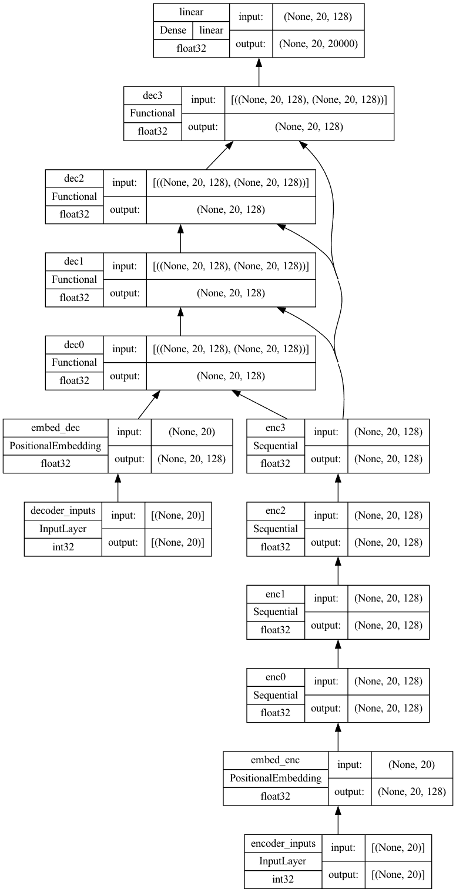

编码器中有 4 层，解码器中有 4 层的变压器

### 你的任务

从第 05、06 和 07 课中复制三个构建块函数，以便你可以运行上述代码并生成相同的图示。你将在后续课程中重用此模型。

在下一课中，你将为此模型设置其他训练参数。

## 第 09 课：准备变压器模型进行训练

在你可以训练你的变压器之前，你需要决定如何训练它。

根据论文 [Attention Is All You Need](https://arxiv.org/pdf/1706.03762.pdf)，你正在使用 Adam 作为优化器，但使用了自定义学习率调度，

$$\text{LR} = \frac{1}{\sqrt{d_{\text{model}}}} \min\big(\frac{1}{\sqrt{n}}, \frac{n}{\sqrt{m³}}\big)$$

实现如下：

```py
import matplotlib.pyplot as plt
import tensorflow as tf

class CustomSchedule(tf.keras.optimizers.schedules.LearningRateSchedule):
    "Custom learning rate for Adam optimizer"
    def __init__(self, key_dim, warmup_steps=4000):
        super().__init__()
        self.key_dim = key_dim
        self.warmup_steps = warmup_steps
        self.d = tf.cast(self.key_dim, tf.float32)

    def __call__(self, step):
        step = tf.cast(step, dtype=tf.float32)
        arg1 = tf.math.rsqrt(step)
        arg2 = step * (self.warmup_steps ** -1.5)
        return tf.math.rsqrt(self.d) * tf.math.minimum(arg1, arg2)

    def get_config(self):
        # to make save and load a model using custom layer possible0
        config = {
            "key_dim": self.key_dim,
            "warmup_steps": self.warmup_steps,
        }
        return config

key_dim = 128
lr = CustomSchedule(key_dim)
optimizer = tf.keras.optimizers.Adam(lr, beta_1=0.9, beta_2=0.98, epsilon=1e-9)

plt.plot(lr(tf.range(50000, dtype=tf.float32)))
plt.ylabel('Learning Rate')
plt.xlabel('Train Step')
plt.show()
```

学习率调度的设计方式是，开始时学习较慢，但随着学习加速。这有助于因为模型在开始时完全是随机的，你甚至无法过多信任输出。但随着你足够训练模型，结果应该足够合理，因此你可以更快地学习以帮助收敛。绘制的学习率看起来如下：

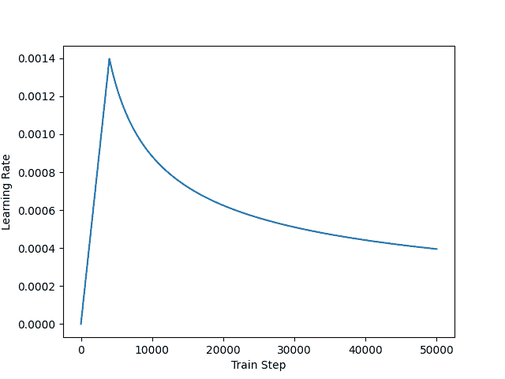

自定义学习率调度

接下来，你还需要定义用于训练的损失度量和准确度量。这个模型很特别，因为你需要对输出应用掩码，仅在非填充元素上计算损失和准确度。从 TensorFlow 的教程 [使用 Transformer 和 Keras 进行神经机器翻译](https://www.tensorflow.org/text/tutorials/transformer) 中借用实现：

```py
def masked_loss(label, pred):
    mask = label != 0

    loss_object = tf.keras.losses.SparseCategoricalCrossentropy(
        from_logits=True, reduction='none')
    loss = loss_object(label, pred)

    mask = tf.cast(mask, dtype=loss.dtype)
    loss *= mask
    loss = tf.reduce_sum(loss)/tf.reduce_sum(mask)
    return loss

def masked_accuracy(label, pred):
    pred = tf.argmax(pred, axis=2)
    label = tf.cast(label, pred.dtype)
    match = label == pred

    mask = label != 0

    match = match & mask

    match = tf.cast(match, dtype=tf.float32)
    mask = tf.cast(mask, dtype=tf.float32)
    return tf.reduce_sum(match)/tf.reduce_sum(mask)
```

有了这些，你现在可以如以下方式**编译**你的 Keras 模型：

```py
vocab_size_en = 10000
vocab_size_fr = 20000
seq_len = 20
num_layers = 4
num_heads = 8
key_dim = 128
ff_dim = 512
dropout = 0.1
model = transformer(num_layers, num_heads, seq_len, key_dim, ff_dim,
                    vocab_size_en, vocab_size_fr, dropout)
lr = CustomSchedule(key_dim)
optimizer = tf.keras.optimizers.Adam(lr, beta_1=0.9, beta_2=0.98, epsilon=1e-9)
model.compile(loss=masked_loss, optimizer=optimizer, metrics=[masked_accuracy])
model.summary()
```

### 你的任务

如果你已正确实现所有功能，你应该能够提供所有构建块函数以使上述代码运行。尽量将到目前为止所做的所有内容保留在一个 Python 脚本或一个 Jupyter 笔记本中，并运行一次以确保没有错误产生且没有引发异常。

如果一切顺利运行，你应该看到 `summary()` 输出如下：

```py
Model: "transformer"
__________________________________________________________________________________________________
 Layer (type)                   Output Shape         Param #     Connected to
==================================================================================================
 encoder_inputs (InputLayer)    [(None, 20)]         0           []

 embed_enc (PositionalEmbedding  (None, 20, 128)     1280000     ['encoder_inputs[0][0]']
 )

 enc0 (Sequential)              (None, 20, 128)      659712      ['embed_enc[0][0]']

 enc1 (Sequential)              (None, 20, 128)      659712      ['enc0[0][0]']

 decoder_inputs (InputLayer)    [(None, 20)]         0           []

 enc2 (Sequential)              (None, 20, 128)      659712      ['enc1[0][0]']

 embed_dec (PositionalEmbedding  (None, 20, 128)     2560000     ['decoder_inputs[0][0]']
 )

 enc3 (Sequential)              (None, 20, 128)      659712      ['enc2[0][0]']

 dec0 (Functional)              (None, 20, 128)      1187456     ['embed_dec[0][0]',
                                                                  'enc3[0][0]']

 dec1 (Functional)              (None, 20, 128)      1187456     ['dec0[0][0]',
                                                                  'enc3[0][0]']

 dec2 (Functional)              (None, 20, 128)      1187456     ['dec1[0][0]',
                                                                  'enc3[0][0]']

 dec3 (Functional)              (None, 20, 128)      1187456     ['dec2[0][0]',
                                                                  'enc3[0][0]']

 linear (Dense)                 (None, 20, 20000)    2580000     ['dec3[0][0]']

==================================================================================================
Total params: 13,808,672
Trainable params: 13,808,672
Non-trainable params: 0
__________________________________________________________________________________________________
```

此外，当您查看 Transformer 模型的图表及其在此处的实现时，您应该注意到图表显示了一个 softmax 层作为输出，但我们省略了它。在本课程中确实添加了 softmax。你看到它在哪里了吗？

在下一课中，您将训练此编译模型，该模型有 1400 万个参数，正如我们在上面的摘要中所看到的。

## 第 10 课：训练 Transformer

训练 Transformer 取决于您在所有先前课程中创建的一切。最重要的是，从第 03 课中的向量化器和数据集必须保存下来，因为它们将在本课程和接下来的课程中重复使用。

```py
import matplotlib.pyplot as plt
import tensorflow as tf

# the dataset objects from Lesson 03
from lesson_03 import train_ds, val_ds
# the building block functions from Lesson 08
from lesson_08 import transformer
# the learning rate schedule, loss, and accuracy functions from Lesson 09
from lesson_09 import CustomSchedule, masked_loss, masked_accuracy

# Create and train the model
seq_len = 20
num_layers = 4
num_heads = 8
key_dim = 128
ff_dim = 512
dropout = 0.1
vocab_size_en = 10000
vocab_size_fr = 20000
model = transformer(num_layers, num_heads, seq_len, key_dim, ff_dim,
                    vocab_size_en, vocab_size_fr, dropout)
lr = CustomSchedule(key_dim)
optimizer = tf.keras.optimizers.Adam(lr, beta_1=0.9, beta_2=0.98, epsilon=1e-9)
model.compile(loss=masked_loss, optimizer=optimizer, metrics=[masked_accuracy])
epochs = 20
history = model.fit(train_ds, epochs=epochs, validation_data=val_ds)

# Save the trained model
model.save("eng-fra-transformer.h5")

# Plot the loss and accuracy history
fig, axs = plt.subplots(2, figsize=(6, 8), sharex=True)
fig.suptitle('Traininig history')
x = list(range(1, epochs+1))
axs[0].plot(x, history.history["loss"], alpha=0.5, label="loss")
axs[0].plot(x, history.history["val_loss"], alpha=0.5, label="val_loss")
axs[0].set_ylabel("Loss")
axs[0].legend(loc="upper right")
axs[1].plot(x, history.history["masked_accuracy"], alpha=0.5, label="acc")
axs[1].plot(x, history.history["val_masked_accuracy"], alpha=0.5, label="val_acc")
axs[1].set_ylabel("Accuracy")
axs[1].set_xlabel("epoch")
axs[1].legend(loc="lower right")
plt.show()
```

就是这样！

运行此脚本将需要几个小时，但一旦完成，您将保存模型和损失与准确率绘图。它应该看起来像下面这样：

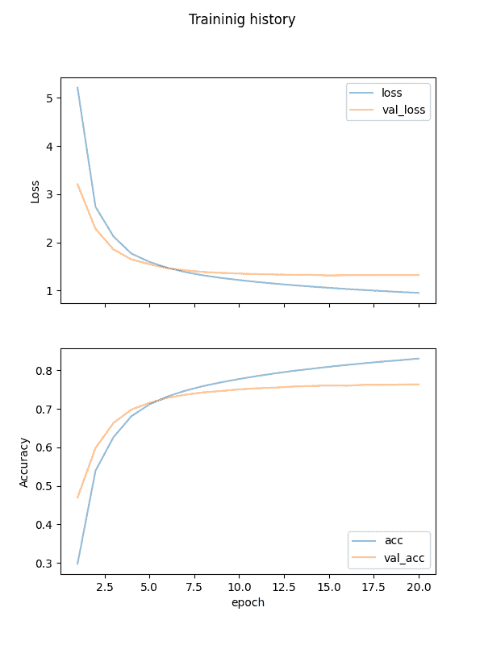

训练过程中的损失和准确率历史记录

### 你的任务

在上述的训练设置中，我们没有使用 Keras 中的提前停止和检查点回调功能。在运行之前，请尝试修改上述代码以添加这些回调。

提前停止回调可以在没有进展时中断训练。检查点回调可以帮助您保存最佳分数的模型，而不是仅返回最后一个 epoch 的最终模型。

在下一课中，您将加载这个训练好的模型并进行测试。

## 第 11 课：从 Transformer 模型进行推断

在第 03 课中，您将原始数据集按 70%-15%-15% 的比例分割为训练、验证和测试集。您在第 10 课的 Transformer 模型训练中使用了训练和验证数据集。而在本课程中，您将使用测试集来查看您训练好的模型表现如何。

您在前一课中保存了您的 Transformer 模型。由于模型中有一些自定义层和函数，您需要创建一个 **自定义对象作用域** 来加载您保存的模型。

Transformer 模型可以给您一个标记索引。您需要使用向量化器查找此索引代表的单词。为了保持一致性，您必须重用与创建数据集时使用的相同向量化器。

创建一个循环以扫描生成的标记。换句话说，不要使用模型生成整个翻译的句子，而是只考虑直到看到结束标志的下一个生成词。第一个生成的词将是由起始标志生成的词。这也是您在第 02 课中处理目标句子的方式的原因。

以下是代码：

```py
import pickle
import random

import numpy as np
import tensorflow as tf

# the dataset objects from Lesson 03
from lesson_03 import test_pairs, eng_vectorizer, fra_vectorizer
# the positional embedding layer from Lesson 05
from lesson_05 import PositionalEmbedding
# the learning rate schedule, loss, and accuracy functions from Lesson 09
from lesson_09 import CustomSchedule, masked_loss, masked_accuracy

# Load the trained model
custom_objects = {"PositionalEmbedding": PositionalEmbedding,
                  "CustomSchedule": CustomSchedule,
                  "masked_loss": masked_loss,
                  "masked_accuracy": masked_accuracy}
with tf.keras.utils.custom_object_scope(custom_objects):
    model = tf.keras.models.load_model("eng-fra-transformer.h5")

# training parameters used
seq_len = 20
vocab_size_en = 10000
vocab_size_fr = 20000

def translate(sentence):
    """Create the translated sentence"""
    enc_tokens = eng_vectorizer([sentence])
    lookup = list(fra_vectorizer.get_vocabulary())
    start_sentinel, end_sentinel = "[start]", "[end]"
    output_sentence = [start_sentinel]
    # generate the translated sentence word by word
    for i in range(seq_len):
        vector = fra_vectorizer([" ".join(output_sentence)])
        assert vector.shape == (1, seq_len+1)
        dec_tokens = vector[:, :-1]
        assert dec_tokens.shape == (1, seq_len)
        pred = model([enc_tokens, dec_tokens])
        assert pred.shape == (1, seq_len, vocab_size_fr)
        word = lookup[np.argmax(pred[0, i, :])]
        output_sentence.append(word)
        if word == end_sentinel:
            break
    return output_sentence

test_count = 20
for n in range(test_count):
    english_sentence, french_sentence = random.choice(test_pairs)
    translated = translate(english_sentence)
    print(f"Test {n}:")
    print(f"{english_sentence}")
    print(f"== {french_sentence}")
    print(f"-> {' '.join(translated)}")
    print()
```

### 你的任务

首先，尝试运行此代码并观察推断结果。下面是一些示例：

```py
Test 2:
it rained for three days .
== [start] il a plu pendant trois jours . [end]
-> [start] il a plu pendant trois jours . [end]

Test 3:
two people say they heard a gunshot .
== [start] deux personnes disent qu'elles ont entendu une détonation . [end]
-> [start] deux personnes disent qu'ils ont entendu un coup de feu . [end]

Test 4:
i'm not dead yet .
== [start] je ne suis pas encore mort . [end]
-> [start] je ne suis pas encore mort . [end]

Test 5:
i want us to get back together .
== [start] je veux que nous nous remettions ensemble . [end]
-> [start] je veux que nous nous [UNK] ensemble . [end]
```

每个测试的第二行是预期输出，而第三行是 Transformer 的输出。

标记`[UNK]`表示“未知”或超出词汇范围，这种情况应该很少出现。对比输出，你会看到结果相当准确，但不会完美。例如，英语中的*they*在法语中可以映射为*ils*或*elles*，这取决于性别，而变压器模型并不总能区分这一点。

你逐词生成了翻译句子，但实际上变压器一次性输出整个句子。你应该尝试修改程序，以在 for 循环中解码整个变压器输出`pred`，看看当你提供更多的前导词`dec_tokens`时，变压器如何为你生成更好的句子。

在下一课中，你将回顾到目前为止的工作，并查看是否可以进行改进。

## 课程 12：改进模型

你做到了！

让我们回顾一下你做了什么以及可以改进的地方。你创建了一个变压器模型，该模型接受整个英语句子和一个部分法语句子（最多到第$k$个标记）以预测下一个（第$(k+1)$个）标记。

在训练中，你观察到最佳准确率为 70%到 80%。你如何改进它？这里有一些想法，但肯定不是详尽无遗的：

+   你为文本输入使用了一个简单的标记器。像 NLTK 这样的库可以提供更好的标记器。此外，你没有使用子词标记化。对于英语，这不是大问题，但对于法语则比较棘手。这就是为什么在你的模型中法语词汇量大得多（例如，*l’air*（空气）和*d’air*（的空气）将成为不同的标记）。

+   你用嵌入层训练了自己的词嵌入。已经有现成的预训练嵌入（如 GloVe），它们通常提供更好的质量的嵌入。这可能有助于你的模型更好地理解**上下文**。

+   你为变压器设计了一些参数。你使用了 8 个头的多头注意力，输出向量维度为 128，句子长度限制为 20 个标记，丢弃率为 0.1，等等。调整这些参数肯定会对变压器产生影响。训练参数同样重要，如轮次数量、学习率调度和损失函数。

### 你的任务

找出如何更改代码以适应上述变化。但如果我们测试一下，你知道如何判断一个模型是否优于另一个模型吗？

在下面的评论中发布你的答案。我很想看看你提出了什么。

这就是最后一课。

## 结束！(*看看你走了多远*)

你做到了。干得好！

花点时间回顾一下你取得的进展。

+   你学会了如何处理一个纯文本句子并将其向量化

+   你根据论文[Attention Is All You Need](https://arxiv.org/pdf/1706.03762.pdf)分析了变压器模型的构建块，并使用 Keras 实现了每个构建块。

+   你将构建块连接成一个完整的变压器模型，并进行了训练。

+   最后，你可以见证经过训练的模型以高精度将英语句子翻译成法语。

## 总结

**你在这个迷你课程中表现如何？**

你喜欢这个速成课程吗？

**你有任何问题吗？是否有遇到难点？**

告诉我。请在下面留下评论。
