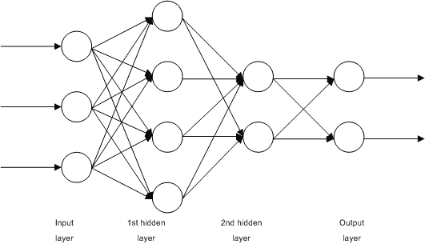
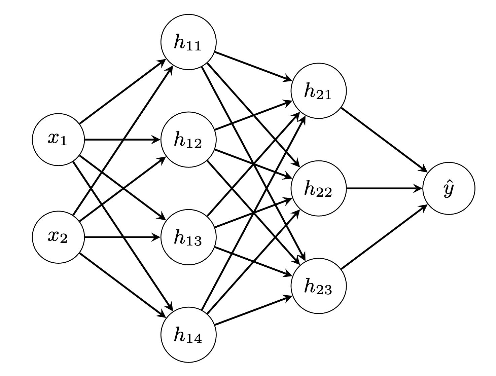

# 神经网络中的微分应用

> 原文：[`machinelearningmastery.com/application-of-differentiations-in-neural-networks/`](https://machinelearningmastery.com/application-of-differentiations-in-neural-networks/)

微分学是机器学习算法中的一个重要工具。特别是在神经网络中，梯度下降算法依赖于梯度，这是通过微分计算得到的量。

在本教程中，我们将探讨反向传播技术如何用于计算神经网络中的梯度。

完成本教程后，你将了解

+   什么是全微分和总导数

+   如何计算神经网络中的总导数

+   反向传播如何帮助计算总导数

让我们开始吧


神经网络中的微分应用

照片由[Freeman Zhou](https://unsplash.com/photos/plX7xeNb3Yo)提供，部分权利保留。

## 教程概览

本教程分为 5 部分，它们是：

1.  总微分和总导数

1.  多层感知器模型的代数表示

1.  通过反向传播找出梯度

1.  梯度方程的矩阵形式

1.  实现反向传播

## 总微分和总导数

对于函数如$f(x)$，我们将其导数表示为$f'(x)$或$\frac{df}{dx}$。但对于多变量函数，如$f(u,v)$，我们有相对于$u$的偏导数$\frac{\partial f}{\partial u}$，有时写作$f_u$。偏导数是通过对$f$进行相对于$u$的微分得到的，同时假设另一个变量$v$为常数。因此，我们用$\partial$代替$d$作为微分符号，以表示不同。

不过，如果$f(u,v)$中的$u$和$v$都依赖于$x$呢？换句话说，我们可以写成$u(x)$和$v(x)$以及$f(u(x), v(x))$。所以$x$决定了$u$和$v$的值，从而决定了$f(u,v)$。在这种情况下，问$\frac{df}{dx}$是完全合理的，因为$f$最终由$x$决定。

这就是总导数的概念。事实上，对于多变量函数$f(t,u,v)=f(t(x),u(x),v(x))$，我们总是有

$$

\frac{df}{dx} = \frac{\partial f}{\partial t}\frac{dt}{dx} + \frac{\partial f}{\partial u}\frac{du}{dx} + \frac{\partial f}{\partial v}\frac{dv}{dx}

$$

上述符号被称为总导数，因为它是偏导数的和。本质上，它是应用链式法则来求导。

如果我们去掉上述方程中的$dx$部分，得到的是$f$相对于$x$的近似变化，即，

$$

df = \frac{\partial f}{\partial t}dt + \frac{\partial f}{\partial u}du + \frac{\partial f}{\partial v}dv

$$

我们称这种符号为总微分。

## 多层感知器模型的代数表示

考虑网络：



神经网络示例。来源: [`commons.wikimedia.org/wiki/File:Multilayer_Neural_Network.png`](https://commons.wikimedia.org/wiki/File:Multilayer_Neural_Network.png)

这是一个简单的全连接 4 层神经网络。我们将输入层称为第 0 层，两个隐藏层称为第 1 层和第 2 层，输出层称为第 3 层。在这个图中，我们可以看到有$n_0=3$个输入单元，第一个隐藏层有$n_1=4$个单元，第二个隐藏层有$n_2=2$个单元。输出层有$n_3=2$个单元。

如果我们将网络的输入记作 $x_i$，其中$i=1,\cdots,n_0$，网络的输出记作 $\hat{y}_i$，其中$i=1,\cdots,n_3$。那么我们可以写成

$$

\begin{aligned}

h_{1i} &= f_1(\sum_{j=1}^{n_0} w^{(1)}_{ij} x_j + b^{(1)}_i) & \text{for } i &= 1,\cdots,n_1\\

h_{2i} &= f_2(\sum_{j=1}^{n_1} w^{(2)}_{ij} h_{1j} + b^{(2)}_i) & i &= 1,\cdots,n_2\\

\hat{y}_i &= f_3(\sum_{j=1}^{n_2} w^{(3)}_{ij} h_{2j} + b^{(3)}_i) & i &= 1,\cdots,n_3

\end{aligned}

$$

这里，第$i$层的激活函数记作 $f_i$。第一隐含层的输出记作 $h_{1i}$，第二隐含层的输出记作 $h_{2i}$。第$i$单元在第$k$层的权重和偏置分别记作 $w^{(k)}_{ij}$ 和 $b^{(k)}_i$。

在上图中，我们可以看到第$k-1$层的输出将输入到第$k$层。因此，虽然 $\hat{y}_i$ 被表示为 $h_{2j}$ 的函数，但 $h_{2i}$ 也依赖于 $h_{1j}$，而 $h_{1j}$ 又依赖于 $x_j$。

上述内容描述了神经网络在代数方程中的构建。训练神经网络时，需要指定一个*损失函数*，以便我们可以在训练过程中最小化它。根据应用的不同，我们通常使用交叉熵处理分类问题，或均方误差处理回归问题。目标变量为$y_i$，均方误差损失函数被指定为

$$

L = \sum_{i=1}^{n_3} (y_i-\hat{y}_i)²

$$

### 想要开始学习机器学习的微积分吗？

现在就参加我的免费 7 天电子邮件速成课程吧（包含示例代码）。

点击注册，还可以获得免费的课程 PDF 电子书版本。

## 通过反向传播寻找梯度

在上述构造中，$x_i$ 和 $y_i$ 来自数据集。神经网络的参数是$w$ 和 $b$。而激活函数 $f_i$ 是通过设计得出的输出，每一层的 $h_{1i}$、$h_{2i}$ 和 $\hat{y}_i$ 是依赖变量。在训练神经网络时，我们的目标是通过梯度下降更新 $w$ 和 $b$，即通过梯度下降更新规则：

$$

\begin{aligned}

w^{(k)}_{ij} &= w^{(k)}_{ij} – \eta \frac{\partial L}{\partial w^{(k)}_{ij}} \\

b^{(k)}_{i} &= b^{(k)}_{i} – \eta \frac{\partial L}{\partial b^{(k)}_{i}}

\end{aligned}

$$

其中 $\eta$ 是梯度下降的学习率参数。

从$L$的方程我们知道$L$不依赖于$w^{(k)}_{ij}$或$b^{(k)}_i$，而是依赖于$\hat{y}_i$。然而，$\hat{y}_i$最终可以表示为$w^{(k)}_{ij}$或$b^{(k)}_i$的函数。让我们逐一看看第$k$层的权重和偏置是如何与输出层的$\hat{y}_i$相关联的。

我们从损失指标开始。如果考虑单个数据点的损失，我们有

$$

\begin{aligned}

L &= \sum_{i=1}^{n_3} (y_i-\hat{y}_i)²\\

\frac{\partial L}{\partial \hat{y}_i} &= 2(y_i – \hat{y}_i) & \text{for } i &= 1,\cdots,n_3

\end{aligned}

$$

在这里我们看到损失函数依赖于所有输出$\hat{y}_i$，因此我们可以找到偏导数$\frac{\partial L}{\partial \hat{y}_i}$。

现在我们来看输出层：

$$

\begin{aligned}

\hat{y}_i &= f_3(\sum_{j=1}^{n_2} w^{(3)}_{ij} h_{2j} + b^{(3)}_i) & \text{for }i &= 1,\cdots,n_3 \\

\frac{\partial L}{\partial w^{(3)}_{ij}} &= \frac{\partial L}{\partial \hat{y}_i}\frac{\partial \hat{y}_i}{\partial w^{(3)}_{ij}} & i &= 1,\cdots,n_3;\ j=1,\cdots,n_2 \\

&= \frac{\partial L}{\partial \hat{y}_i} f’_3(\sum_{j=1}^{n_2} w^{(3)}_{ij} h_{2j} + b^{(3)}_i)h_{2j} \\

\frac{\partial L}{\partial b^{(3)}_i} &= \frac{\partial L}{\partial \hat{y}_i}\frac{\partial \hat{y}_i}{\partial b^{(3)}_i} & i &= 1,\cdots,n_3 \\

&= \frac{\partial L}{\partial \hat{y}_i}f’_3(\sum_{j=1}^{n_2} w^{(3)}_{ij} h_{2j} + b^{(3)}_i)

\end{aligned}

$$

因为第 3 层的权重$w^{(3)}_{ij}$作用于输入$h_{2j}$并仅影响输出$\hat{y}_i$。因此，我们可以将偏导数$\frac{\partial L}{\partial w^{(3)}_{ij}}$写作两个偏导数的乘积$\frac{\partial L}{\partial \hat{y}_i}\frac{\partial \hat{y}_i}{\partial w^{(3)}_{ij}}$。偏置$b^{(3)}_i$也是类似的情况。在上述过程中，我们使用了之前已经推导出的$\frac{\partial L}{\partial \hat{y}_i}$。

但实际上，我们也可以写出$L$对第二层输出$h_{2j}$的偏导数。它不会用于第 3 层权重和偏置的更新，但我们稍后会看到它的重要性：

$$

\begin{aligned}

\frac{\partial L}{\partial h_{2j}} &= \sum_{i=1}^{n_3}\frac{\partial L}{\partial \hat{y}_i}\frac{\partial \hat{y}_i}{\partial h_{2j}} & \text{for }j &= 1,\cdots,n_2 \\

&= \sum_{i=1}^{n_3}\frac{\partial L}{\partial \hat{y}_i}f’_3(\sum_{j=1}^{n_2} w^{(3)}_{ij} h_{2j} + b^{(3)}_i)w^{(3)}_{ij}

\end{aligned}

$$

这个导数是有趣的，并且与之前的部分导数不同。注意到 $h_{2j}$ 是第 2 层的输出。第 2 层的每一个输出都会影响第 3 层的输出 $\hat{y}_i$。因此，为了找到 $\frac{\partial L}{\partial h_{2j}}$，我们需要将第 3 层的每个输出加起来。因此，上述方程中使用了求和符号。我们可以将 $\frac{\partial L}{\partial h_{2j}}$ 视为总导数，其中我们对每个输出 $i$ 应用了链式法则 $\frac{\partial L}{\partial \hat{y}_i}\frac{\partial \hat{y}_i}{\partial h_{2j}}$，然后将它们加起来。

如果我们回到第 2 层，我们可以类似地推导导数：

$$

\begin{aligned}

h_{2i} &= f_2(\sum_{j=1}^{n_1} w^{(2)}_{ij} h_{1j} + b^{(2)}_i) & \text{对于 }i &= 1,\cdots,n_2\\

\frac{\partial L}{\partial w^{(2)}_{ij}} &= \frac{\partial L}{\partial h_{2i}}\frac{\partial h_{2i}}{\partial w^{(2)}_{ij}} & i&=1,\cdots,n_2;\ j=1,\cdots,n_1 \\

&= \frac{\partial L}{\partial h_{2i}}f’_2(\sum_{j=1}^{n_1} w^{(2)}_{ij} h_{1j} + b^{(2)}_i)h_{1j} \\

\frac{\partial L}{\partial b^{(2)}_i} &= \frac{\partial L}{\partial h_{2i}}\frac{\partial h_{2i}}{\partial b^{(2)}_i} & i &= 1,\cdots,n_2 \\

&= \frac{\partial L}{\partial h_{2i}}f’_2(\sum_{j=1}^{n_1} w^{(2)}_{ij} h_{1j} + b^{(2)}_i) \\

\frac{\partial L}{\partial h_{1j}} &= \sum_{i=1}^{n_2}\frac{\partial L}{\partial h_{2i}}\frac{\partial h_{2i}}{\partial h_{1j}} & j&= 1,\cdots,n_1 \\

&= \sum_{i=1}^{n_2}\frac{\partial L}{\partial h_{2i}}f’_2(\sum_{j=1}^{n_1} w^{(2)}_{ij} h_{1j} + b^{(2)}_i) w^{(2)}_{ij}

\end{aligned}

$$

在上述方程中，我们重新使用了之前推导的 $\frac{\partial L}{\partial h_{2i}}$。同样，这个导数是作为链式法则中几个乘积的总和来计算的。与之前类似，我们也推导了 $\frac{\partial L}{\partial h_{1j}}$。它不会用于训练 $w^{(2)}_{ij}$ 或 $b^{(2)}_i$，但会用于前一层。因此，对于第 1 层，我们有

$$

\begin{aligned}

h_{1i} &= f_1(\sum_{j=1}^{n_0} w^{(1)}_{ij} x_j + b^{(1)}_i) & \text{对于 } i &= 1,\cdots,n_1\\

\frac{\partial L}{\partial w^{(1)}_{ij}} &= \frac{\partial L}{\partial h_{1i}}\frac{\partial h_{1i}}{\partial w^{(1)}_{ij}} & i&=1,\cdots,n_1;\ j=1,\cdots,n_0 \\

&= \frac{\partial L}{\partial h_{1i}}f’_1(\sum_{j=1}^{n_0} w^{(1)}_{ij} x_j + b^{(1)}_i)x_j \\

\frac{\partial L}{\partial b^{(1)}_i} &= \frac{\partial L}{\partial h_{1i}}\frac{\partial h_{1i}}{\partial b^{(1)}_i} & i&=1,\cdots,n_1 \\

&= \frac{\partial L}{\partial h_{1i}}f’_1(\sum_{j=1}^{n_0} w^{(1)}_{ij} x_j + b^{(1)}_i)

\end{aligned}

$$

这完成了使用梯度下降算法进行神经网络训练所需的所有导数。

回顾我们如何推导上述内容：我们首先从损失函数 $L$ 开始，按照层的反向顺序逐一求导。我们写下第 $k$ 层的导数，并将其用于第 $k-1$ 层的导数。计算从输入 $x_i$ 到输出 $\hat{y}_i$ 是从第 0 层向前进行的，而计算梯度则是按反向顺序进行的。因此称之为“反向传播”。

## 梯度方程的矩阵形式

虽然我们在上面没有使用它，但以向量和矩阵的形式书写方程会更简洁。我们可以将层和输出重写为：

$$

\mathbf{a}_k = f_k(\mathbf{z}_k) = f_k(\mathbf{W}_k\mathbf{a}_{k-1}+\mathbf{b}_k)

$$

其中 $\mathbf{a}_k$ 是第 $k$ 层的输出向量，假设 $\mathbf{a}_0=\mathbf{x}$ 是输入向量，$\mathbf{a}_3=\hat{\mathbf{y}}$ 是输出向量。为了便于记号表示，也表示 $\mathbf{z}_k = \mathbf{W}_k\mathbf{a}_{k-1}+\mathbf{b}_k$。

在这样的记号下，我们可以将 $\frac{\partial L}{\partial\mathbf{a}_k}$ 表示为一个向量（同样适用于 $\mathbf{z}_k$ 和 $\mathbf{b}_k$），而将 $\frac{\partial L}{\partial\mathbf{W}_k}$ 表示为一个矩阵。然后，如果已知 $\frac{\partial L}{\partial\mathbf{a}_k}$，我们有

$$

\begin{aligned

\frac{\partial L}{\partial\mathbf{z}_k} &= \frac{\partial L}{\partial\mathbf{a}_k}\odot f_k'(\mathbf{z}_k) \\

\frac{\partial L}{\partial\mathbf{W}_k} &= \left(\frac{\partial L}{\partial\mathbf{z}_k}\right)^\top \cdot \mathbf{a}_k \\

\frac{\partial L}{\partial\mathbf{b}_k} &= \frac{\partial L}{\partial\mathbf{z}_k} \\

\frac{\partial L}{\partial\mathbf{a}_{k-1}} &= \left(\frac{\partial\mathbf{z}_k}{\partial\mathbf{a}_{k-1}}\right)^\top\cdot\frac{\partial L}{\partial\mathbf{z}_k} = \mathbf{W}_k^\top\cdot\frac{\partial L}{\partial\mathbf{z}_k}

\end{aligned}

$$

其中 $\frac{\partial\mathbf{z}_k}{\partial\mathbf{a}_{k-1}}$ 是雅可比矩阵，因为 $\mathbf{z}_k$ 和 $\mathbf{a}_{k-1}$ 都是向量，这个雅可比矩阵恰好是 $\mathbf{W}_k$。

## 实现反向传播

我们需要矩阵形式的方程，因为这将使我们的代码更简洁，避免了很多循环。让我们看看如何将这些方程转换为代码，并从零开始使用 numpy 构建一个用于分类的多层感知机模型。

首先，我们需要实现激活函数和损失函数。两者都需要是可微分的函数，否则我们的梯度下降过程将无法进行。现在，隐藏层中常用 ReLU 激活函数，输出层中常用 sigmoid 激活函数。我们将它们定义为一个函数（假设输入为 numpy 数组）以及它们的导数：

```py
import numpy as np

# Find a small float to avoid division by zero
epsilon = np.finfo(float).eps

# Sigmoid function and its differentiation
def sigmoid(z):
    return 1/(1+np.exp(-z.clip(-500, 500)))
def dsigmoid(z):
    s = sigmoid(z)
    return 2 * s * (1-s)

# ReLU function and its differentiation
def relu(z):
    return np.maximum(0, z)
def drelu(z):
    return (z > 0).astype(float)
```

我们故意将 sigmoid 函数的输入限制在 -500 到 +500 之间以避免溢出。否则，这些函数都是微不足道的。然后，对于分类问题，我们关注准确性，但准确性函数是不可微分的。因此，我们使用交叉熵函数作为训练的损失函数：

```py
# Loss function L(y, yhat) and its differentiation
def cross_entropy(y, yhat):
    """Binary cross entropy function
        L = - y log yhat - (1-y) log (1-yhat)

    Args:
        y, yhat (np.array): 1xn matrices which n are the number of data instances
    Returns:
        average cross entropy value of shape 1x1, averaging over the n instances
    """
    return -(y.T @ np.log(yhat.clip(epsilon)) + (1-y.T) @ np.log((1-yhat).clip(epsilon))) / y.shape[1]

def d_cross_entropy(y, yhat):
    """ dL/dyhat """
    return - np.divide(y, yhat.clip(epsilon)) + np.divide(1-y, (1-yhat).clip(epsilon))
```

上述内容中，我们假设输出和目标变量是 numpy 中的行矩阵。因此，我们使用点积运算符`@`来计算总和，并除以输出中的元素个数。请注意，这种设计是为了计算**一个批次**样本的**平均交叉熵**。

然后我们可以实现我们的多层感知器模型。为了使其更易读，我们希望通过提供每一层的神经元数量以及层中的激活函数来创建模型。同时，我们还需要激活函数的导数以及训练所需的损失函数的导数。然而，损失函数本身不是必需的，但对于我们跟踪进度非常有用。我们创建了一个类来封装整个模型，并根据公式定义每一层$k$：

$$

\mathbf{a}_k = f_k(\mathbf{z}_k) = f_k(\mathbf{a}_{k-1}\mathbf{W}_k+\mathbf{b}_k)

$

```py
class mlp:
    '''Multilayer perceptron using numpy
    '''
    def __init__(self, layersizes, activations, derivatives, lossderiv):
        """remember config, then initialize array to hold NN parameters without init"""
        # hold NN config
        self.layersizes = layersizes
        self.activations = activations
        self.derivatives = derivatives
        self.lossderiv = lossderiv
        # parameters, each is a 2D numpy array
        L = len(self.layersizes)
        self.z = [None] * L
        self.W = [None] * L
        self.b = [None] * L
        self.a = [None] * L
        self.dz = [None] * L
        self.dW = [None] * L
        self.db = [None] * L
        self.da = [None] * L

    def initialize(self, seed=42):
        np.random.seed(seed)
        sigma = 0.1
        for l, (insize, outsize) in enumerate(zip(self.layersizes, self.layersizes[1:]), 1):
            self.W[l] = np.random.randn(insize, outsize) * sigma
            self.b[l] = np.random.randn(1, outsize) * sigma

    def forward(self, x):
        self.a[0] = x
        for l, func in enumerate(self.activations, 1):
            # z = W a + b, with `a` as output from previous layer
            # `W` is of size rxs and `a` the size sxn with n the number of data instances, `z` the size rxn
            # `b` is rx1 and broadcast to each column of `z`
            self.z[l] = (self.a[l-1] @ self.W[l]) + self.b[l]
            # a = g(z), with `a` as output of this layer, of size rxn
            self.a[l] = func(self.z[l])
        return self.a[-1]
```

在这个类中的变量`z`、`W`、`b`和`a`用于前向传递，而变量`dz`、`dW`、`db`和`da`是它们各自的梯度，这些梯度将在反向传播中计算。所有这些变量都以 numpy 数组的形式呈现。

正如我们稍后将看到的，我们将使用 scikit-learn 生成的数据来测试我们的模型。因此，我们会看到数据是形状为“（样本数量，特征数量）”的 numpy 数组。因此，每个样本作为矩阵的一行呈现，在函数`forward()`中，权重矩阵会右乘到每个输入`a`上。虽然每层的激活函数和维度可能不同，但过程是一样的。因此，我们通过`forward()`函数中的循环将神经网络的输入`x`转换为其输出。网络的输出只是最后一层的输出。

为了训练网络，我们需要在每次前向传递后运行反向传播。反向传播是计算每一层的权重和偏置的梯度，从输出层开始到输入层。根据我们上面推导的方程，反向传播函数实现如下：

```py
class mlp:
    ...

    def backward(self, y, yhat):
        # first `da`, at the output
        self.da[-1] = self.lossderiv(y, yhat)
        for l, func in reversed(list(enumerate(self.derivatives, 1))):
            # compute the differentials at this layer
            self.dz[l] = self.da[l] * func(self.z[l])
            self.dW[l] = self.a[l-1].T @ self.dz[l]
            self.db[l] = np.mean(self.dz[l], axis=0, keepdims=True)
            self.da[l-1] = self.dz[l] @ self.W[l].T

    def update(self, eta):
        for l in range(1, len(self.W)):
            self.W[l] -= eta * self.dW[l]
            self.b[l] -= eta * self.db[l]
```

唯一的区别在于，我们计算`db`时不是针对一个训练样本，而是针对整个批次。由于损失函数是跨批次的平均交叉熵，因此我们也通过跨样本平均来计算`db`。

到这里，我们完成了我们的模型。`update()`函数简单地将反向传播找到的梯度应用到参数`W`和`b`上，使用梯度下降更新规则。

为了测试我们的模型，我们利用 scikit-learn 生成一个分类数据集：

```py
from sklearn.datasets import make_circles
from sklearn.metrics import accuracy_score

# Make data: Two circles on x-y plane as a classification problem
X, y = make_circles(n_samples=1000, factor=0.5, noise=0.1)
y = y.reshape(-1,1) # our model expects a 2D array of (n_sample, n_dim)
```

然后我们构建了我们的模型：输入是二维的，输出是一维的（逻辑回归）。我们设立了两个隐藏层，分别有 4 个和 3 个神经元：



```py
# Build a model
model = mlp(layersizes=[2, 4, 3, 1],
            activations=[relu, relu, sigmoid],
            derivatives=[drelu, drelu, dsigmoid],
            lossderiv=d_cross_entropy)
model.initialize()
yhat = model.forward(X)
loss = cross_entropy(y, yhat)
print("Before training - loss value {} accuracy {}".format(loss, accuracy_score(y, (yhat > 0.5))))
```

我们看到，在随机权重下，准确率是 50%。

```py
Before training - loss value [[693.62972747]] accuracy 0.5
```

现在我们训练我们的网络。为了简化，我们执行全批次梯度下降，并使用固定的学习率：

```py
# train for each epoch
n_epochs = 150
learning_rate = 0.005
for n in range(n_epochs):
    model.forward(X)
    yhat = model.a[-1]
    model.backward(y, yhat)
    model.update(learning_rate)
    loss = cross_entropy(y, yhat)
    print("Iteration {} - loss value {} accuracy {}".format(n, loss, accuracy_score(y, (yhat > 0.5))))
```

输出为：

```py
Iteration 0 - loss value [[693.62972747]] accuracy 0.5
Iteration 1 - loss value [[693.62166655]] accuracy 0.5
Iteration 2 - loss value [[693.61534159]] accuracy 0.5
Iteration 3 - loss value [[693.60994018]] accuracy 0.5
...
Iteration 145 - loss value [[664.60120828]] accuracy 0.818
Iteration 146 - loss value [[697.97739669]] accuracy 0.58
Iteration 147 - loss value [[681.08653776]] accuracy 0.642
Iteration 148 - loss value [[665.06165774]] accuracy 0.71
Iteration 149 - loss value [[683.6170298]] accuracy 0.614
```

尽管不完美，我们通过训练看到了改进。至少在上述示例中，我们可以看到在第 145 次迭代时准确率超过了 80%，但随后我们发现模型发散。这可以通过减少学习率来改善，而我们在上述实现中并未做此调整。不过，这展示了我们如何通过反向传播和链式法则计算梯度。

完整代码如下：

```py
from sklearn.datasets import make_circles
from sklearn.metrics import accuracy_score
import numpy as np
np.random.seed(0)

# Find a small float to avoid division by zero
epsilon = np.finfo(float).eps

# Sigmoid function and its differentiation
def sigmoid(z):
    return 1/(1+np.exp(-z.clip(-500, 500)))
def dsigmoid(z):
    s = sigmoid(z)
    return 2 * s * (1-s)

# ReLU function and its differentiation
def relu(z):
    return np.maximum(0, z)
def drelu(z):
    return (z > 0).astype(float)

# Loss function L(y, yhat) and its differentiation
def cross_entropy(y, yhat):
    """Binary cross entropy function
        L = - y log yhat - (1-y) log (1-yhat)

    Args:
        y, yhat (np.array): nx1 matrices which n are the number of data instances
    Returns:
        average cross entropy value of shape 1x1, averaging over the n instances
    """
    return -(y.T @ np.log(yhat.clip(epsilon)) + (1-y.T) @ np.log((1-yhat).clip(epsilon))) / y.shape[1]

def d_cross_entropy(y, yhat):
    """ dL/dyhat """
    return - np.divide(y, yhat.clip(epsilon)) + np.divide(1-y, (1-yhat).clip(epsilon))

class mlp:
    '''Multilayer perceptron using numpy
    '''
    def __init__(self, layersizes, activations, derivatives, lossderiv):
        """remember config, then initialize array to hold NN parameters without init"""
        # hold NN config
        self.layersizes = tuple(layersizes)
        self.activations = tuple(activations)
        self.derivatives = tuple(derivatives)
        self.lossderiv = lossderiv
        assert len(self.layersizes)-1 == len(self.activations), \
            "number of layers and the number of activation functions does not match"
        assert len(self.activations) == len(self.derivatives), \
            "number of activation functions and number of derivatives does not match"
        assert all(isinstance(n, int) and n >= 1 for n in layersizes), \
            "Only positive integral number of perceptons is allowed in each layer"
        # parameters, each is a 2D numpy array
        L = len(self.layersizes)
        self.z = [None] * L
        self.W = [None] * L
        self.b = [None] * L
        self.a = [None] * L
        self.dz = [None] * L
        self.dW = [None] * L
        self.db = [None] * L
        self.da = [None] * L

    def initialize(self, seed=42):
        """initialize the value of weight matrices and bias vectors with small random numbers."""
        np.random.seed(seed)
        sigma = 0.1
        for l, (insize, outsize) in enumerate(zip(self.layersizes, self.layersizes[1:]), 1):
            self.W[l] = np.random.randn(insize, outsize) * sigma
            self.b[l] = np.random.randn(1, outsize) * sigma

    def forward(self, x):
        """Feed forward using existing `W` and `b`, and overwrite the result variables `a` and `z`

        Args:
            x (numpy.ndarray): Input data to feed forward
        """
        self.a[0] = x
        for l, func in enumerate(self.activations, 1):
            # z = W a + b, with `a` as output from previous layer
            # `W` is of size rxs and `a` the size sxn with n the number of data instances, `z` the size rxn
            # `b` is rx1 and broadcast to each column of `z`
            self.z[l] = (self.a[l-1] @ self.W[l]) + self.b[l]
            # a = g(z), with `a` as output of this layer, of size rxn
            self.a[l] = func(self.z[l])
        return self.a[-1]

    def backward(self, y, yhat):
        """back propagation using NN output yhat and the reference output y, generates dW, dz, db,
        da
        """
        assert y.shape[1] == self.layersizes[-1], "Output size doesn't match network output size"
        assert y.shape == yhat.shape, "Output size doesn't match reference"
        # first `da`, at the output
        self.da[-1] = self.lossderiv(y, yhat)
        for l, func in reversed(list(enumerate(self.derivatives, 1))):
            # compute the differentials at this layer
            self.dz[l] = self.da[l] * func(self.z[l])
            self.dW[l] = self.a[l-1].T @ self.dz[l]
            self.db[l] = np.mean(self.dz[l], axis=0, keepdims=True)
            self.da[l-1] = self.dz[l] @ self.W[l].T
            assert self.z[l].shape == self.dz[l].shape
            assert self.W[l].shape == self.dW[l].shape
            assert self.b[l].shape == self.db[l].shape
            assert self.a[l].shape == self.da[l].shape

    def update(self, eta):
        """Updates W and b

        Args:
            eta (float): Learning rate
        """
        for l in range(1, len(self.W)):
            self.W[l] -= eta * self.dW[l]
            self.b[l] -= eta * self.db[l]

# Make data: Two circles on x-y plane as a classification problem
X, y = make_circles(n_samples=1000, factor=0.5, noise=0.1)
y = y.reshape(-1,1) # our model expects a 2D array of (n_sample, n_dim)
print(X.shape)
print(y.shape)

# Build a model
model = mlp(layersizes=[2, 4, 3, 1],
            activations=[relu, relu, sigmoid],
            derivatives=[drelu, drelu, dsigmoid],
            lossderiv=d_cross_entropy)
model.initialize()
yhat = model.forward(X)
loss = cross_entropy(y, yhat)
print("Before training - loss value {} accuracy {}".format(loss, accuracy_score(y, (yhat > 0.5))))

# train for each epoch
n_epochs = 150
learning_rate = 0.005
for n in range(n_epochs):
    model.forward(X)
    yhat = model.a[-1]
    model.backward(y, yhat)
    model.update(learning_rate)
    loss = cross_entropy(y, yhat)
    print("Iteration {} - loss value {} accuracy {}".format(n, loss, accuracy_score(y, (yhat > 0.5))))
```

## 进一步阅读

反向传播算法是所有神经网络训练的核心，无论你使用了什么变种的梯度下降算法。这本教科书涵盖了这一点：

+   **《深度学习》**，作者：Ian Goodfellow, Yoshua Bengio 和 Aaron Courville，2016 年。

    ([`www.amazon.com/dp/0262035618`](https://www.amazon.com/dp/0262035618))

之前也实现了神经网络的基础版本，但没有讨论数学部分，它详细解释了这些步骤：

+   [如何用 Python 从头实现反向传播神经网络](https://machinelearningmastery.com/implement-backpropagation-algorithm-scratch-python/)

## 总结

在本教程中，你学习了如何将微分应用于神经网络的训练。

具体来说，你学习了：

+   什么是全微分以及它如何表示为偏微分的总和

+   如何将神经网络表示为方程式，并通过微分推导梯度

+   反向传播如何帮助我们表达神经网络中每一层的梯度

+   如何将梯度转换为代码以构建神经网络模型
