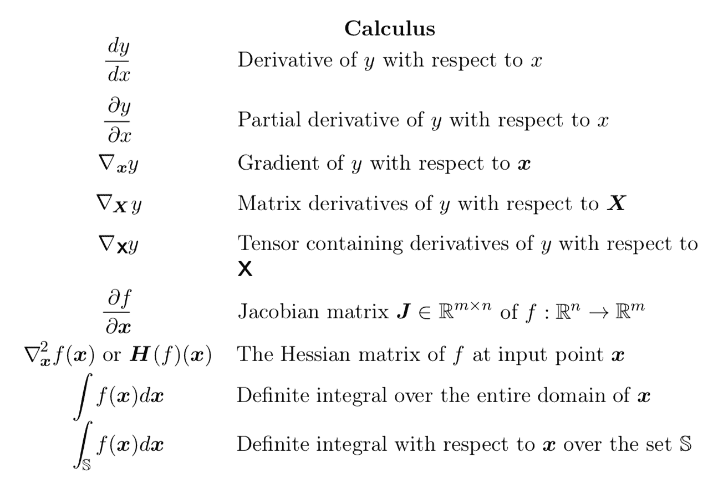
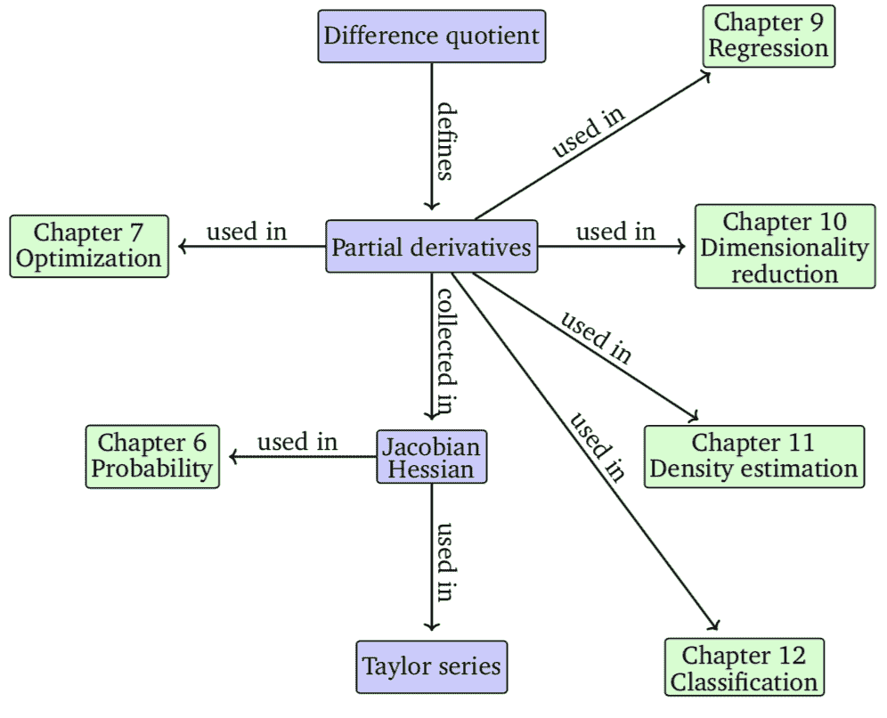

# 机器学习的微积分书籍

> 原文：[`machinelearningmastery.com/calculus-books-for-machine-learning/`](https://machinelearningmastery.com/calculus-books-for-machine-learning/)

知识**微积分**对于在机器学习或深度学习中获得结果和解决问题不是必须的。

然而，了解一些微积分将对你有许多帮助，比如在阅读书籍和论文中的数学符号时，理解描述拟合模型的术语如“*梯度*”，以及理解通过优化拟合模型（如神经网络）的学习动态。

微积分作为大学水平教授的主题是具有挑战性的，但你不需要了解所有的微积分，只需要掌握与数值函数优化相关的几个术语和方法，这对于像神经网络这样的拟合算法至关重要。掌握微积分的最佳方式是通过书籍。

在本教程中，你将发现关于机器学习的微积分书籍。

完成本教程后，你将会了解：

+   哪些关于机器学习的书籍对相关的微积分主题提供了温和的介绍。

+   你可以用来学习微积分的直觉、历史和技术的书籍。

+   你可以用来参考或深入学习微积分技术及其证明的教科书。

让我们开始吧。

机器学习的微积分书籍

照片由[Roanish](https://www.flickr.com/photos/roanish/26718626464/)提供，部分权利保留。

## 教程概述

本教程分为三个部分；它们是：

1.  机器学习书中的微积分

1.  入门微积分书籍

1.  微积分教科书

## 机器学习书中的微积分

从涵盖微积分基础的机器学习书籍开始。

如果你很久以前在学校学过微积分，需要复习，或者需要快速了解术语和方法，这将非常合适。

许多顶级的机器学习和深度学习教科书会涵盖基础内容，这对于大多数情况来说通常是足够的，例如当你专注于通过机器学习算法获得结果时。

如果你已经拥有一本涵盖一些微积分内容的机器学习教科书，那将会很有帮助，因为你不需要再买另一本书。

两本很好的教科书涵盖了一些微积分内容，包括：

+   [深度学习](https://amzn.to/2J6oGHA)，2016 年。

+   [模式识别与机器学习](https://amzn.to/3nRmjY1)，2006 年。

“[深度学习](https://amzn.to/2J6oGHA)”教科书中的微积分内容比较简略。

深度学习

微积分是在优化的背景下引入的，首先是线性回归，然后更一般地用于多变量优化——在拟合神经网络时会看到。

包括以下主题：

+   导数

+   偏导数

+   二阶导数

+   Hessian 矩阵

+   梯度

+   梯度下降

+   临界点

+   静态点

+   局部最大值

+   全局最小值

+   鞍点

+   雅可比矩阵

以及更多内容。

微积分术语。

取自《深度学习》第 xiii 页，2016 年。

书籍“[模式识别与机器学习](https://amzn.to/3nRmjY1)”提供了更深入的覆盖。

具体而言：

+   第十章：近似推断

+   附录 D：变分法

模式识别与机器学习

附录 D 介绍了“[变分法](https://en.wikipedia.org/wiki/Calculus_of_variations)”这一主题，第十章使用了这种技术。该主题在深度学习书籍中也有涵盖。

如果一个典型的微积分问题涉及寻找一个优化函数的变量值，那么变分法是关于寻找一个优化另一个函数的函数。我们可以看到这在机器学习中，特别是在神经网络中是相关的，因为神经网络模型（电路）在损失函数下学习任意函数。

> 在常规微积分中，一个常见的问题是找到一个使函数 y(x)最大化（或最小化）的 x 值。同样，在变分法中，我们寻求一个使泛函 F[y]最大化（或最小化）的函数 y(x)。也就是说，在所有可能的函数 y(x)中，我们希望找到使泛函 F[y]达到最大（或最小）的特定函数。

— 第 703 页，[模式识别与机器学习](https://amzn.to/3nRmjY1)，2006 年。

虽然变分法并不是拟合神经网络所必需的，但它提供了一个有用的工具，以更好地理解我们在拟合神经网络时所解决的问题以及实际中可能遇到的学习动态。

最终，我们开始看到专门讲解机器学习底层数学理解的书籍。

一个例子是“[机器学习中的数学](https://amzn.to/371u4E2)”。

机器学习中的数学

这本书涵盖了机器学习所需的大量微积分，并提供了展示其在模型优化（训练/学习）中的适用性。

微积分及其与机器学习的联系。

取自《机器学习中的数学》，第 140 页。

微积分的讨论限于**第五章：向量微积分**，该章涵盖以下主题：

+   第 5.1 节 单变量函数的微分

+   第 5.2 节 偏导数和梯度

+   第 5.3 节 向量值函数的梯度

+   第 5.4 节 矩阵的梯度

+   第 5.5 节 用于计算梯度的有用公式

+   第 5.6 节 反向传播和自动微分

+   第 5.7 节 高阶导数

+   第 5.8 节 线性化和多变量泰勒级数

这本书是填补或刷新你对机器学习微积分知识的绝佳起点。

## 入门微积分书籍

了解术语的名称是一回事，但如果你想更全面地了解一些方法呢？

为此，我推荐一本好的初学者书籍，例如：

+   [微积分指南](https://amzn.to/3fDLg6B)，2019 年。

+   [傻瓜微积分](https://amzn.to/3kZMtpN)，2016 年。

这些书不是教科书；相反，它们假设几乎没有背景知识（例如，微积分前知识），并将引导你理解直觉、技术及其在简单练习中的应用。

**直觉是关键！我们不是在做数学学位，我们是在解决机器学习问题。**

一本教科书会教你方法和证明，但很少告诉你这个方法最初是为了解决什么问题，以及一些历史背景。我认为背景知识至关重要。

《傻瓜微积分》

我拥有这两本书。我喜欢《[傻瓜微积分](https://amzn.to/3kZMtpN)》，如果你能不介意名字和风格，我会推荐它。

> 很多人认为微积分是所有智力历史上的一项伟大成就。因此，它值得付出努力。阅读这本没有术语的书，掌握微积分，加入那些可以自豪地说“微积分？哦，当然，我知道微积分。这没什么大不了的”的快乐少数。

— 第 1 页，[傻瓜微积分](https://amzn.to/3kZMtpN)，2016 年。

目录如下：

+   引言

+   第一部分：微积分概述

    +   第一章：什么是微积分？

    +   第二章：微积分的两个重要概念：微分与积分——加上无限级数

    +   第三章：微积分为何有效

+   第二部分：微积分前提知识的热身

    +   第四章：初代代数与代数复习

    +   第五章：奇特函数及其有趣的图形

    +   第六章：三角函数探戈

+   第三部分：极限

    +   第七章：极限与连续性

    +   第八章：评估极限

+   第四部分：微分

    +   第九章：微分方向

    +   第十章：微分规则——是的，伙计，它确实很棒

    +   第十一章：微分与曲线形状

    +   第十二章：你的问题解决了：微分来救援！

    +   第十三章：更多微分问题：偏离正题

+   第五部分：积分与无限级数

    +   第十四章：积分导论与面积逼近

    +   第十五章：积分：它是倒向微分

    +   第十六章：专家的积分技术

    +   第十七章：忘记菲尔博士：用积分解决问题

    +   第十八章：用不适定积分驯服无限

    +   第十九章：无限级数

+   第六部分：十件事部分

    +   第二十章：十个要记住的事项

    +   第二十一章：十个要忘记的事项

    +   第二十二章：你不能逃避的十件事

微积分指南

我发现“[微积分的指南](https://amzn.to/3fDLg6B)”不错，但简洁明了。它直击每种方法的要点。

这本书最棒的地方在于它专注于让你进行计算。通过计算来学习。这就是我学习的方式。

> … 微积分需要理解一整套全新的概念，这些概念非常有趣且相当美妙，但确实有点难以掌握。然而，尽管涉及了所有这些新想法，微积分仍然是一种计算方法，因此在你的微积分课程中，你将进行大量的计算，无数的计算，看似无尽的计算！

— 页码 1-2, [微积分的指南](https://amzn.to/3fDLg6B), 2019 年。

我强烈推荐的另一本书是一本科普读物：

+   [无限的力量：微积分如何揭示宇宙的秘密](https://amzn.to/2Hzqd8A), 2020 年。

无限的力量

这本书将让你对微积分充满兴趣。

它涵盖了历史，并将让你了解微积分工具为何被发明，以及它们为何如此强大。

> 没有微积分，我们不会有手机、计算机或微波炉。我们不会有广播、电视、孕妇超声波或迷路者的 GPS。我们不会分裂原子、解开人类基因组，或者把宇航员送上月球。我们甚至可能没有《独立宣言》。

— 页码 vii, [无限的力量](https://amzn.to/2Hzqd8A), 2020 年。

历史很重要。你需要有人阐述几何和代数无法解决的难题、尝试过的破解方法，以及那些效果良好的新方法。

> 微积分起源于几何学。大约公元前 250 年，在古希腊，它是一个致力于曲线奥秘的小数学新兴领域。

— 页码 3, [无限的力量](https://amzn.to/2Hzqd8A), 2020 年。

它强调了微积分不是魔法和咒语，而是解决问题的工具。并且，如果你愿意，这一切都是可以学习的。

## 微积分教科书

也许你想更深入地了解。

你想查看和理解每种方法的证明，完成本科水平的练习，深入探索。

这不是在机器学习中必需的，但有时我们想全身心投入。我理解。在这种情况下，我推荐一本教科书，比如用于本科课程的教科书。

使用高级/简化材料时，备一本教科书以便随时深入了解具体术语和方法也是个好主意。例如，深入研究海森矩阵。

关于微积分的教科书数量庞大，而且似乎每隔几年就有新版本出现。

然而，一些大学水平的顶级教科书包括以下几本：

+   [微积分](https://amzn.to/3fqNSEB), 第 3 版, 2017 年。（吉尔伯特·斯特朗）

+   [微积分](https://amzn.to/3kS9I52)，第 8 版，2015 年。（詹姆斯·斯图尔特）

+   [微积分](https://amzn.to/39boa66)，第 4 版，2008 年。（迈克尔·斯皮瓦克）

+   [微积分](https://amzn.to/36V8EYY)，第 11 版，2017 年。（罗恩·拉尔森，布鲁斯·爱德华兹）

+   [托马斯微积分](https://amzn.to/35Yeolv)，第 14 版，2017 年。（乔尔·哈斯，克里斯托弗·海尔，莫里斯·威尔）

我喜欢斯图尔特的书，但它们都差不多。都需要大量的工作。

微积分

你将需要做大量的习题，没有办法绕开这一点。

也许可以浏览几个，并选择一个适合你学习风格的。

## 总结

在本教程中，你发现了用于机器学习的微积分书籍。

**你读过这些书中的任何一本，还是打算买一本？**

请在下面的评论中告诉我。

**你知道其他优秀的微积分书籍吗？**

请在评论中告诉我。
