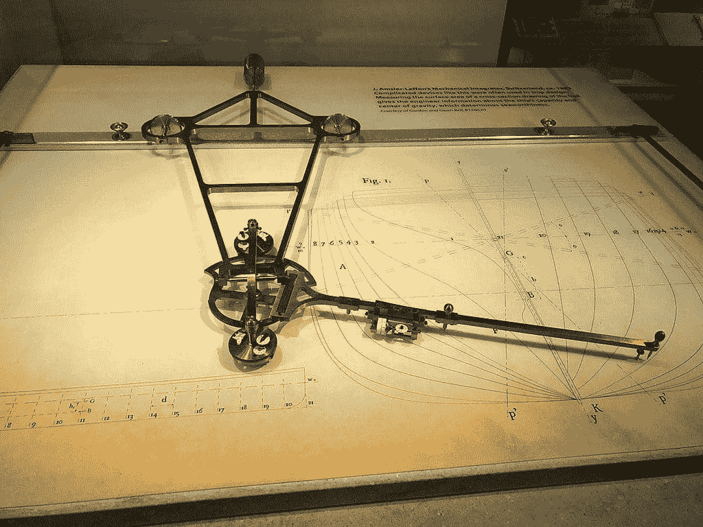
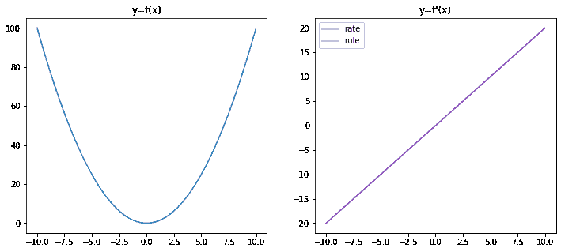
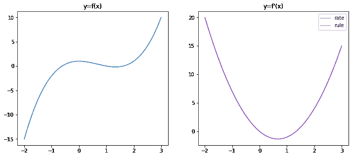
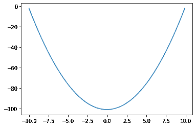
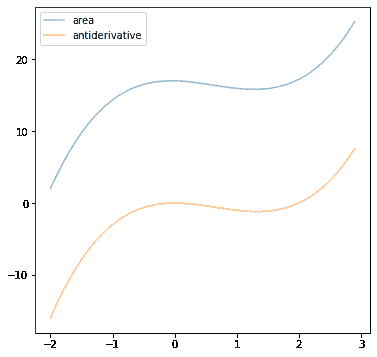
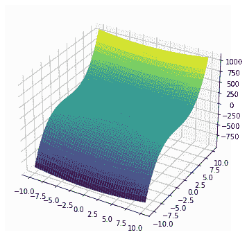
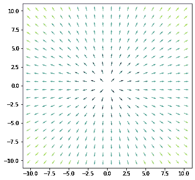

# 机器学习微积分（7 天迷你课程）

> 原文：[`machinelearningmastery.com/calculus-for-machine-learning-7-day-mini-course/`](https://machinelearningmastery.com/calculus-for-machine-learning-7-day-mini-course/)

#### 机器学习微积分速成课程。

在 7 天内熟悉机器学习中的微积分技术。

微积分是许多机器学习算法背后的重要数学技巧。你不一定需要知道它才能使用这些算法。当你深入了解时，你会发现它在每一个有关机器学习模型理论的讨论中都是无处不在的。

作为从业者，我们很可能不会遇到非常复杂的微积分问题。如果需要解决，我们可以使用计算机代数系统等工具来帮助，或至少验证我们的解决方案。然而，更重要的是理解微积分背后的思想，并将微积分术语与我们机器学习算法中的应用联系起来。

在此速成课程中，你将发现机器学习中使用的一些常见微积分思想。你将通过 Python 中的练习在七天内进行学习。

这是一个重要且重大的帖子。你可能想要收藏它。

让我们开始吧。



机器学习微积分（7 天迷你课程）

图片由[ArnoldReinhold](https://commons.wikimedia.org/wiki/File:Mechanical_integrator_CHM.agr.jpg)提供，保留部分权利。

## 这个速成课程适合谁？

在我们开始之前，让我们确保你处于正确的地方。

本课程适合那些可能了解一些应用机器学习的开发者。也许你知道如何完整解决一个预测建模问题，或者至少了解大部分主要步骤，并使用流行工具。

本课程中的课程假设你具备以下几项条件：

+   你对基本 Python 编程有一定了解。

+   你可能了解一些基本的线性代数。

+   你可能了解一些基本的机器学习模型。

你不需要是：

+   数学天才！

+   机器学习专家！

此速成课程将把你从一个了解一点机器学习的开发者，提升为一个能够有效讨论机器学习算法中微积分概念的开发者。

注意：此速成课程假设你已经拥有一个正常运行的 Python 3.7 环境，并安装了一些库，如 SciPy 和 SymPy。如果你需要帮助设置环境，你可以按照此处的逐步教程：

+   [如何使用 Anaconda 设置你的 Python 环境以进行机器学习](https://machinelearningmastery.com/setup-python-environment-machine-learning-deep-learning-anaconda/)

## 速成课程概述

此速成课程分为七节课。

你可以每天完成一节课（推荐）或一天内完成所有课程（硬核）。这真的取决于你有多少时间和你的热情程度。

以下是七节课程的列表，这些课程将帮助你入门并高效进行 Python 数据准备：

+   **课程 01**: 微分学

+   **课程 02**: 积分

+   **课程 03**: 向量函数的梯度

+   **课程 04**: 雅可比矩阵

+   **课程 05**: 反向传播

+   **课程 06**: 优化

+   **课程 07**: 支持向量机

每节课可能花费你 5 分钟到 1 小时。慢慢来，根据自己的节奏完成课程。提出问题，甚至在下面的评论中发布结果。

这些课程可能会期望你去查找如何做的相关信息。我会给你提示，但每节课的部分目的就是迫使你学习如何寻找有关算法和 Python 中最佳工具的帮助。（**提示**: *我在这个博客上有所有的答案；使用搜索框*。）

**在评论中发布你的结果**；我会为你加油！

坚持住；不要放弃。

## 课程 01: 微分学

在这节课中，你将发现什么是微分学或微分。

微分是将一个数学函数转化为另一个称为导数的函数的操作。导数表示原始函数的斜率或变化率。

例如，如果我们有一个函数 $f(x)=x²$，它的导数是一个告诉我们在 $x$ 处该函数变化率的函数。变化率定义为： $$f'(x) = \frac{f(x+\delta x)-f(x)}{\delta x}$$ 对于一个小量 $\delta x$。

通常我们将以上定义为极限形式，即，

$$f'(x) = \lim_{\delta x\to 0} \frac{f(x+\delta x)-f(x)}{\delta x}$$

意味着 $\delta x$ 应尽可能接近零。

有几种微分规则可以帮助我们更容易地找到导数。适用于上述例子的规则是 $\frac{d}{dx} x^n = nx^{n-1}$。因此对于 $f(x)=x²$，我们有导数 $f'(x)=2x$。

我们可以通过绘制根据变化率计算的函数 $f'(x)$ 与根据微分规则计算的函数来确认这一点。以下使用 Python 的 NumPy 和 matplotlib：

```py
import numpy as np
import matplotlib.pyplot as plt

# Define function f(x)
def f(x):
    return x**2

# compute f(x) = x² for x=-10 to x=10
x = np.linspace(-10,10,500)
y = f(x)
# Plot f(x) on left half of the figure
fig = plt.figure(figsize=(12,5))
ax = fig.add_subplot(121)
ax.plot(x, y)
ax.set_title("y=f(x)")

# f'(x) using the rate of change
delta_x = 0.0001
y1 = (f(x+delta_x) - f(x))/delta_x
# f'(x) using the rule
y2 = 2 * x
# Plot f'(x) on right half of the figure
ax = fig.add_subplot(122)
ax.plot(x, y1, c="r", alpha=0.5, label="rate")
ax.plot(x, y2, c="b", alpha=0.5, label="rule")
ax.set_title("y=f'(x)")
ax.legend()

plt.show()
```



在上面的图中，我们可以看到使用变化率找到的导数函数和使用微分规则找到的导数函数完全一致。

### 你的任务

我们也可以对其他函数进行类似的微分。例如，$f(x)=x³ – 2x² + 1$。使用微分规则找到这个函数的导数，并将你的结果与使用极限率找到的结果进行比较。用上面的图验证你的结果。如果你做得正确，你应该看到以下图形：



在下一节课中，你将发现积分是微分的逆操作。

## 课程 02: 积分

在这节课中，你将发现积分是微分的逆操作。

如果我们考虑一个函数 $f(x)=2x$ 并且在 $\delta x$ 的间隔内每一步（例如，$\delta x = 0.1$），我们可以计算，从 $x=-10$ 到 $x=10$ 如下：

$$

f(-10), f(-9.9), f(-9.8), \cdots, f(9.8), f(9.9), f(10)

$$

显然，如果我们有一个更小的步长$\delta x$，上面会有更多的项。

如果我们将上述每一个乘以步长，然后将它们加起来，即，

$$

f(-10)\times 0.1 + f(-9.9)\times 0.1 + \cdots + f(9.8)\times 0.1 + f(9.9)\times 0.1

$$

这个总和被称为$f(x)$的积分。实质上，这个总和是$f(x)$的**曲线下的面积**，从$x=-10$到$x=10$。微积分中的一个定理表明，如果我们将曲线下的面积作为一个函数，它的导数是$f(x)$。因此，我们可以将积分视为微分的反操作。

正如我们在课程 01 中看到的，$f(x)=x²$的微分是$f'(x)=2x$。这意味着对于$f(x)=2x$，我们可以写作$\int f(x) dx = x²$，或者我们可以说$f(x)=x$的反导数是$x²$。我们可以通过直接计算面积在 Python 中确认这一点。

```py
import numpy as np
import matplotlib.pyplot as plt

def f(x):
    return 2*x

# Set up x from -10 to 10 with small steps
delta_x = 0.1
x = np.arange(-10, 10, delta_x)
# Find f(x) * delta_x
fx = f(x) * delta_x
# Compute the running sum
y = fx.cumsum()
# Plot
plt.plot(x, y)
plt.show()
```



这个图与课程 01 中的$f(x)$具有相同的形状。事实上，所有通过常数（例如$f(x)$和$f(x)+5$）不同的函数具有相同的导数。因此，计算得到的反导数的图形将是原始函数在垂直方向上移动。

### 你的任务

考虑$f(x)=3x²-4x$，找出该函数的反导数并绘制它。此外，尝试将上述 Python 代码替换为此函数。如果你将两者一起绘制，你应该会看到以下内容：

### 

在下面的评论中发布你的答案。我很想看看你会得到什么结果。

这两节课讲的是具有一个变量的函数。在下一节课中，你将发现如何将微分应用于多个变量的函数。

## 课程 03：向量函数的梯度

在本课程中，你将学习多变量函数的梯度概念。

如果我们有一个不仅仅是一个变量而是两个或更多变量的函数，微分自然地扩展为对每个变量的微分。例如，如果我们有函数$f(x,y) = x² + y³$，我们可以将每个变量的微分写作：

$$

\begin{aligned}

\frac{\partial f}{\partial x} &= 2x \\

\frac{\partial f}{\partial y} &= 3y²

\end{aligned}

$$

在这里，我们引入了偏导数的符号，表示在假设其他变量为常数的情况下，对一个变量的函数进行微分。因此，在上述计算$\frac{\partial f}{\partial x}$时，我们忽略了函数$f(x,y)$中的$y³$部分。

一个具有两个变量的函数可以被视为平面上的一个表面。上述函数$f(x,y)$可以使用 matplotlib 进行可视化：

```py
import numpy as np
import matplotlib.pyplot as plt

# Define the range for x and y
x = np.linspace(-10,10,1000)
xv, yv = np.meshgrid(x, x, indexing='ij')

# Compute f(x,y) = x² + y³
zv = xv**2 + yv**3

# Plot the surface
fig = plt.figure(figsize=(6,6))
ax = fig.add_subplot(projection='3d')
ax.plot_surface(xv, yv, zv, cmap="viridis")
plt.show()
```



这个函数的梯度表示为：

$$\nabla f(x,y) = \Big(\frac{\partial f}{\partial x},\; \frac{\partial f}{\partial y}\Big) = (2x,\;3y²)$$

因此，在每个坐标$(x,y)$处，梯度$\nabla f(x,y)$是一个向量。这个向量告诉我们两件事：

+   向量的方向指向函数 $f(x,y)$ 增长最快的地方

+   向量的大小是函数 $f(x,y)$ 在这个方向上的变化率

可视化梯度的一种方式是将其视为**矢量场**：

```py
import numpy as np
import matplotlib.pyplot as plt

# Define the range for x and y
x = np.linspace(-10,10,20)
xv, yv = np.meshgrid(x, x, indexing='ij')

# Compute the gradient of f(x,y)
fx = 2*xv
fy = 2*yv

# Convert the vector (fx,fy) into size and direction
size = np.sqrt(fx**2 + fy**2)
dir_x = fx/size
dir_y = fy/size

# Plot the surface
plt.figure(figsize=(6,6))
plt.quiver(xv, yv, dir_x, dir_y, size, cmap="viridis")
plt.show()
```



matplotlib 中的 viridis 色图将用黄色显示较大的值，用紫色显示较小的值。因此，我们在上图中看到梯度在边缘“更陡”而不是中心。

如果我们考虑坐标(2,3)，可以使用以下方式检查 $f(x,y)$ 将在哪个方向上最快增加：

```py
import numpy as np

def f(x, y):
    return x**2 + y**3

# 0 to 360 degrees at 0.1-degree steps
angles = np.arange(0, 360, 0.1)

# coordinate to check
x, y = 2, 3
# step size for differentiation
step = 0.0001

# To keep the size and direction of maximum rate of change
maxdf, maxangle = -np.inf, 0
for angle in angles:
    # convert degree to radian
    rad = angle * np.pi / 180
    # delta x and delta y for a fixed step size
    dx, dy = np.sin(rad)*step, np.cos(rad)*step
    # rate of change at a small step
    df = (f(x+dx, y+dy) - f(x,y))/step
    # keep the maximum rate of change
    if df > maxdf:
        maxdf, maxangle = df, angle

# Report the result
dx, dy = np.sin(maxangle*np.pi/180), np.cos(maxangle*np.pi/180)
gradx, grady = dx*maxdf, dy*maxdf
print(f"Max rate of change at {maxangle} degrees")
print(f"Gradient vector at ({x},{y}) is ({dx*maxdf},{dy*maxdf})")
```

它的输出是：

```py
Max rate of change at 8.4 degrees
Gradient vector at (2,3) is (3.987419245872443,27.002750276227097)
```

根据公式，梯度向量为(4,27)，数值结果足够接近。

### 你的任务

考虑函数 $f(x,y)=x²+y²$，在(1,1)点的梯度向量是什么？如果你通过偏导数得到答案，能否修改上述 Python 代码，通过检查不同方向上的变化率来确认？

在下面的评论中发布你的答案。我很想看看你得到的结果。

在下一课中，你将发现一个以向量输入并产生向量输出的函数的微分。

## 课程 04：雅可比矩阵

在本课中，你将学习雅可比矩阵。

函数 $f(x,y)=(p(x,y), q(x,y))=(2xy, x²y)$ 是一个有两个输入和两个输出的函数。有时我们称这个函数为接收向量参数并返回向量值的函数。这个函数的微分是一个叫做雅可比矩阵的矩阵。上述函数的雅可比矩阵是：

$$

\mathbf{J} =

\begin{bmatrix}

\frac{\partial p}{\partial x} & \frac{\partial p}{\partial y} \\

\frac{\partial q}{\partial x} & \frac{\partial q}{\partial y}

\end{bmatrix}

=

\begin{bmatrix}

2y & 2x \\

2xy & x²

\end{bmatrix}

$$

在雅可比矩阵中，每一行包含输出向量中每个元素的偏导数，而每一列包含对输入向量中每个元素的偏导数。

我们稍后将看到雅可比矩阵的应用。由于计算雅可比矩阵涉及大量的偏导数，如果我们能让计算机检查我们的数学计算将会很好。在 Python 中，我们可以使用 SymPy 验证上述结果：

```py
from sympy.abc import x, y
from sympy import Matrix, pprint

f = Matrix([2*x*y, x**2*y])
variables = Matrix([x,y])
pprint(f.jacobian(variables))
```

它的输出是：

```py
⎡ 2⋅y   2⋅x⎤
⎢          ⎥
⎢        2 ⎥
⎣2⋅x⋅y  x  ⎦
```

我们要求 SymPy 定义符号`x`和`y`，然后定义了向量函数`f`。之后，可以通过调用`jacobian()`函数来找到雅可比矩阵。

### 你的任务

考虑函数

$$

f(x,y) = \begin{bmatrix}

\frac{1}{1+e^{-(px+qy)}} & \frac{1}{1+e^{-(rx+sy)}} & \frac{1}{1+e^{-(tx+uy)}}

\end{bmatrix}

$$

其中 $p,q,r,s,t,u$ 是常数。$f(x,y)$ 的雅可比矩阵是什么？你能用 SymPy 验证吗？

在下一课中，你将发现雅可比矩阵在神经网络反向传播算法中的应用。

## 课程 05：反向传播

在本课中，你将了解反向传播算法如何使用雅可比矩阵。

如果我们考虑一个具有一个隐藏层的神经网络，我们可以将其表示为一个函数：

$$

y = g\Big(\sum_{k=1}^M u_k f_k\big(\sum_{i=1}^N w_{ik}x_i\big)\Big)

$$

神经网络的输入是一个向量 $\mathbf{x}=(x_1, x_2, \cdots, x_N)$，每个 $x_i$ 会与权重 $w_{ik}$ 相乘并输入到隐藏层中。隐藏层中神经元 $k$ 的输出将与权重 $u_k$ 相乘并输入到输出层中。隐藏层和输出层的激活函数分别是 $f$ 和 $g$。

如果我们考虑

$$z_k = f_k\big(\sum_{i=1}^N w_{ik}x_i\big)$$

然后

$$

\frac{\partial y}{\partial x_i} = \sum_{k=1}^M \frac{\partial y}{\partial z_k}\frac{\partial z_k}{\partial x_i}

$$

如果我们一次考虑整个层，我们有 $\mathbf{z}=(z_1, z_2, \cdots, z_M)$ 然后

$$

\frac{\partial y}{\partial \mathbf{x}} = \mathbf{W}^\top\frac{\partial y}{\partial \mathbf{z}}

$$

其中 $\mathbf{W}$ 是 $M\times N$ 的雅可比矩阵，其中第 $k$ 行第 $i$ 列的元素是 $\frac{\partial z_k}{\partial x_i}$。

这就是反向传播算法在训练神经网络中的工作原理！对于具有多个隐藏层的网络，我们需要计算每一层的雅可比矩阵。

### 你的任务

下面的代码实现了一个神经网络模型，你可以自己尝试。它有两个隐藏层和一个分类网络，用于将二维点分为两类。尝试查看函数 `backward()` 并识别哪个是雅可比矩阵。

如果你玩这个代码，`mlp` 类不应该被修改，但你可以改变模型创建时的参数。

```py
from sklearn.datasets import make_circles
from sklearn.metrics import accuracy_score
import numpy as np
np.random.seed(0)

# Find a small float to avoid division by zero
epsilon = np.finfo(float).eps

# Sigmoid function and its differentiation
def sigmoid(z):
    return 1/(1+np.exp(-z.clip(-500, 500)))
def dsigmoid(z):
    s = sigmoid(z)
    return 2 * s * (1-s)

# ReLU function and its differentiation
def relu(z):
    return np.maximum(0, z)
def drelu(z):
    return (z > 0).astype(float)

# Loss function L(y, yhat) and its differentiation
def cross_entropy(y, yhat):
    """Binary cross entropy function
        L = - y log yhat - (1-y) log (1-yhat)

    Args:
        y, yhat (np.array): nx1 matrices which n are the number of data instances
    Returns:
        average cross entropy value of shape 1x1, averaging over the n instances
    """
    return ( -(y.T @ np.log(yhat.clip(epsilon)) +
               (1-y.T) @ np.log((1-yhat).clip(epsilon))
              ) / y.shape[1] )

def d_cross_entropy(y, yhat):
    """ dL/dyhat """
    return ( - np.divide(y, yhat.clip(epsilon))
             + np.divide(1-y, (1-yhat).clip(epsilon)) )

class mlp:
    '''Multilayer perceptron using numpy
    '''
    def __init__(self, layersizes, activations, derivatives, lossderiv):
        """remember config, then initialize array to hold NN parameters
        without init"""
        # hold NN config
        self.layersizes = tuple(layersizes)
        self.activations = tuple(activations)
        self.derivatives = tuple(derivatives)
        self.lossderiv = lossderiv
        # parameters, each is a 2D numpy array
        L = len(self.layersizes)
        self.z = [None] * L
        self.W = [None] * L
        self.b = [None] * L
        self.a = [None] * L
        self.dz = [None] * L
        self.dW = [None] * L
        self.db = [None] * L
        self.da = [None] * L

    def initialize(self, seed=42):
        """initialize the value of weight matrices and bias vectors with small
        random numbers."""
        np.random.seed(seed)
        sigma = 0.1
        for l, (n_in, n_out) in enumerate(zip(self.layersizes, self.layersizes[1:]), 1):
            self.W[l] = np.random.randn(n_in, n_out) * sigma
            self.b[l] = np.random.randn(1, n_out) * sigma

    def forward(self, x):
        """Feed forward using existing `W` and `b`, and overwrite the result
        variables `a` and `z`

        Args:
            x (numpy.ndarray): Input data to feed forward
        """
        self.a[0] = x
        for l, func in enumerate(self.activations, 1):
            # z = W a + b, with `a` as output from previous layer
            # `W` is of size rxs and `a` the size sxn with n the number of data
            # instances, `z` the size rxn, `b` is rx1 and broadcast to each
            # column of `z`
            self.z[l] = (self.a[l-1] @ self.W[l]) + self.b[l]
            # a = g(z), with `a` as output of this layer, of size rxn
            self.a[l] = func(self.z[l])
        return self.a[-1]

    def backward(self, y, yhat):
        """back propagation using NN output yhat and the reference output y,
        generates dW, dz, db, da
        """
        # first `da`, at the output
        self.da[-1] = self.lossderiv(y, yhat)
        for l, func in reversed(list(enumerate(self.derivatives, 1))):
            # compute the differentials at this layer
            self.dz[l] = self.da[l] * func(self.z[l])
            self.dW[l] = self.a[l-1].T @ self.dz[l]
            self.db[l] = np.mean(self.dz[l], axis=0, keepdims=True)
            self.da[l-1] = self.dz[l] @ self.W[l].T

    def update(self, eta):
        """Updates W and b

        Args:
            eta (float): Learning rate
        """
        for l in range(1, len(self.W)):
            self.W[l] -= eta * self.dW[l]
            self.b[l] -= eta * self.db[l]

# Make data: Two circles on x-y plane as a classification problem
X, y = make_circles(n_samples=1000, factor=0.5, noise=0.1)
y = y.reshape(-1,1) # our model expects a 2D array of (n_sample, n_dim)

# Build a model
model = mlp(layersizes=[2, 4, 3, 1],
            activations=[relu, relu, sigmoid],
            derivatives=[drelu, drelu, dsigmoid],
            lossderiv=d_cross_entropy)
model.initialize()
yhat = model.forward(X)
loss = cross_entropy(y, yhat)
score = accuracy_score(y, (yhat > 0.5))
print(f"Before training - loss value {loss} accuracy {score}")

# train for each epoch
n_epochs = 150
learning_rate = 0.005
for n in range(n_epochs):
    model.forward(X)
    yhat = model.a[-1]
    model.backward(y, yhat)
    model.update(learning_rate)
    loss = cross_entropy(y, yhat)
    score = accuracy_score(y, (yhat > 0.5))
    print(f"Iteration {n} - loss value {loss} accuracy {score}")
```

在下一节课中，你将发现利用微分找到函数的最优值。

## 第 06 课：优化

在本节课中，你将学习微分的重要应用。

由于函数的微分是变化率，我们可以利用微分来找到函数的最优点。

如果一个函数达到了最大值，我们会期望它从一个较低的点移动到最大值，并且如果我们进一步移动，它会下降到另一个较低的点。因此，在最大点上，函数的变化率为零。最小值的情况则相反。

举个例子，考虑 $f(x)=x³-2x²+1$。导数为 $f'(x) = 3x²-4x$，在 $x=0$ 和 $x=4/3$ 时 $f'(x)=0$。因此这些 $x$ 的位置是 $f(x)$ 达到最大值或最小值的位置。我们可以通过绘制 $f(x)$ 来直观地确认（参见第一部分的图）。

### 你的任务

考虑函数 $f(x)=\log x$ 并求其导数。当 $f'(x)=0$ 时 $x$ 的值是多少？这告诉你关于对数函数的最大值或最小值的什么信息？尝试绘制 $\log x$ 的函数图像以直观确认你的答案。

在下一节课中，你将发现这一技术在寻找支持向量中的应用。

## 第 07 课：支持向量机

在本节课中，你将学习如何将支持向量机转换为优化问题。

在二维平面中，任何直线都可以通过以下方程表示：

$$ax+by+c=0$$

在$xy$坐标系中。从坐标几何学的研究结果表明，对于任意点$(x_0,y_0)$，它到直线$ax+by+c=0$的**距离**是：

$$

\frac{\vert ax_0+by_0+c \vert}{\sqrt{a²+b²}}

$$

在$xy$平面中考虑点(0,0)，(1,2)和(2,1)，其中第一个点和后两个点属于不同的类。什么是最好分离这两类的线？这是支持向量机分类器的基础。支持向量是这种情况下最大分离的线。

要找到这样一条线，我们正在寻找：

$$

\begin{aligned}

\text{minimize} && a² + b² \\

\text{subject to} && -1(0a+0b+c) &\ge 1 \\

&& +1(1a+2b+c) &\ge 1 \\

&& +1(2a+1b+c) &\ge 1

\end{aligned}

$$

目标$a²+b²$是为了最小化，以使每个数据点到直线的距离最大化。条件$-1(0a+0b+c)\ge 1$意味着点(0,0)属于类$-1$；对于其他两点也是如此，它们属于类$+1$。直线应该将这两类放在平面的不同侧。

这是一个**受约束的优化**问题，解决它的方法是使用拉格朗日乘数法。使用拉格朗日乘数法的第一步是找到以下拉格朗日函数的偏导数：

$$

L = a²+b² + \lambda_1(-c-1) + \lambda_2 (a+2b+c-1) + \lambda_3 (2a+b+c-1)

$$

并设置偏微分为零，然后解出$a$，$b$和$c$。在这里展示将会太冗长，但我们可以使用 SciPy 在数值上找到解决方案：

```py
import numpy as np
from scipy.optimize import minimize

def objective(w):
    return w[0]**2 + w[1]**2

def constraint1(w):
    "Inequality for point (0,0)"
    return -1*w[2] - 1

def constraint2(w):
    "Inequality for point (1,2)"
    return w[0] + 2*w[1] + w[2] - 1

def constraint3(w):
    "Inequality for point (2,1)"
    return 2*w[0] + w[1] + w[2] - 1

# initial guess
w0 = np.array([1, 1, 1])

# optimize
bounds = ((-10,10), (-10,10), (-10,10))
constraints = [
    {"type":"ineq", "fun":constraint1},
    {"type":"ineq", "fun":constraint2},
    {"type":"ineq", "fun":constraint3},
]
solution = minimize(objective, w0, method="SLSQP", bounds=bounds, constraints=constraints)
w = solution.x
print("Objective:", objective(w))
print("Solution:", w)
```

它将打印：

```py
Objective: 0.8888888888888942
Solution: [ 0.66666667  0.66666667 -1\.        ]
```

上述意味着分离这三点的线是$0.67x + 0.67y – 1 = 0$。请注意，如果你提供了$N$个数据点，就会有$N$个定义的约束条件。

### 你的任务

让我们考虑点（-1，-1）和（-3，-1）作为第一类，以及点（0，0）和点（3，3）作为第二类，还有点（1，2）和（2，1）。在这个有六个点的问题中，你能修改上述程序并找到分离这两类的直线吗？看到解决方案保持不变可能会感到惊讶。这是有原因的。你能说出来吗？

在下面的评论中发表你的答案。我很想看看你们的成果。

这是最后的课程。

## 结束！

（*看看你已经走了多远*）

你成功了。干得漂亮！

请花一点时间回顾你已经走了多远。

你发现：

+   什么是微分，以及它对一个函数意味着什么

+   什么是积分

+   如何将微分扩展到向量参数函数

+   如何对向量值函数进行微分

+   在神经网络的反向传播算法中雅可比矩阵的作用

+   如何使用微分找到函数的最优点

+   支持向量机是一个受约束的优化问题，需要微分来解决

## 总结

**你对迷你课程的进展如何？**

你喜欢这个速成课程吗？

**你有任何问题吗？有什么困难吗？**

请告诉我。请在下方留言。
