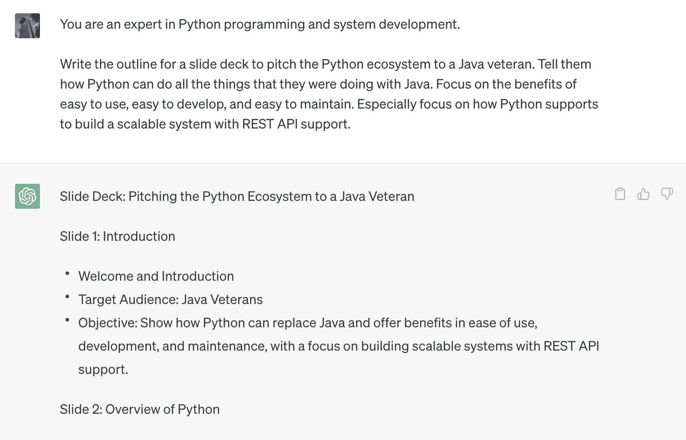
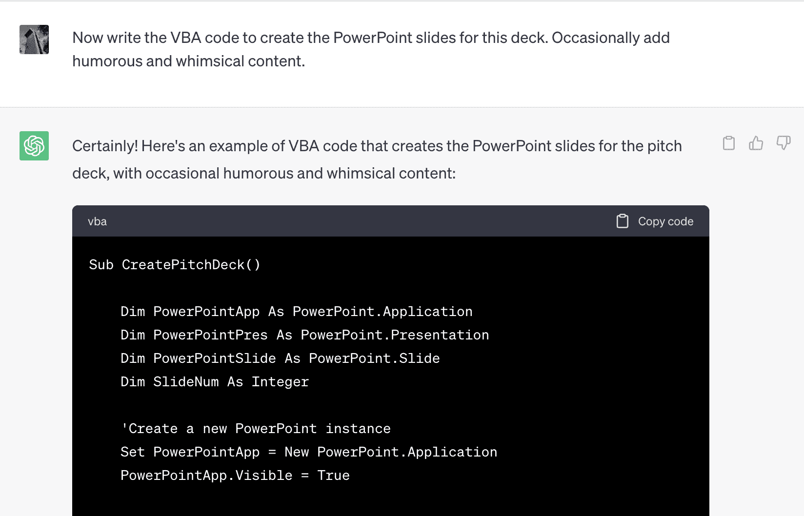
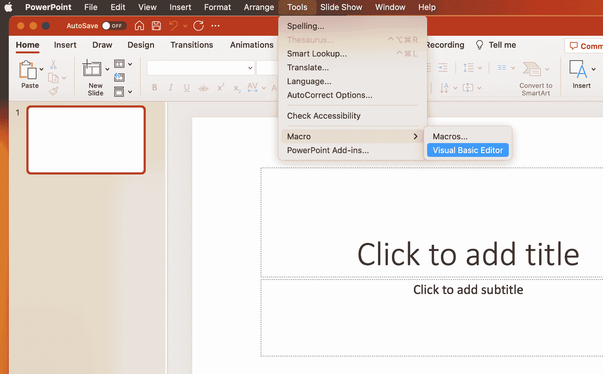
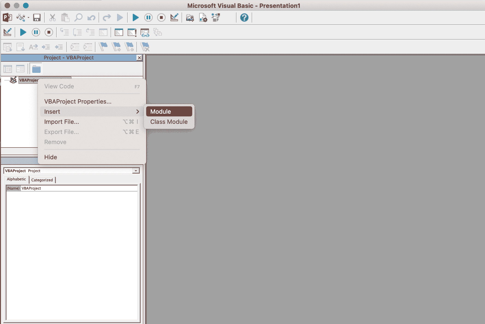
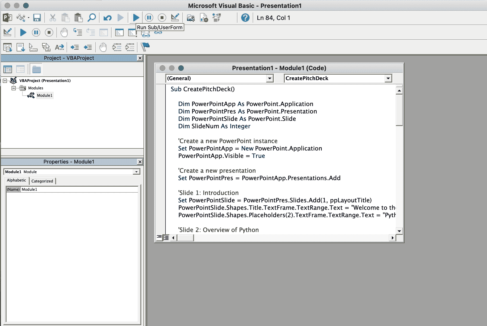
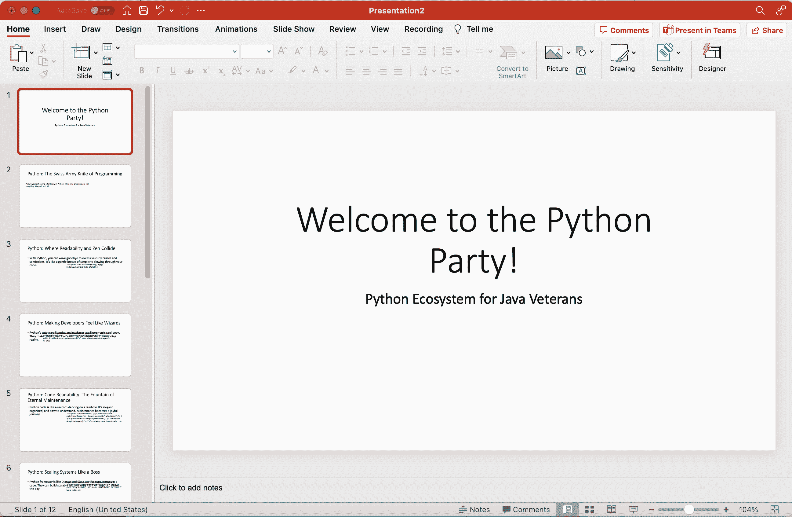

# 使用 ChatGPT 创建 PowerPoint 演示文稿

> 原文：[`machinelearningmastery.com/creating-a-powerpoint-presentation-using-chatgpt/`](https://machinelearningmastery.com/creating-a-powerpoint-presentation-using-chatgpt/)

让 ChatGPT 成为你的助手来帮助你写电子邮件是微不足道的，因为它被广泛认为非常擅长生成文本。显然，ChatGPT 无法帮助你做晚餐。但你可能想知道它是否可以生成文本之外的内容。在之前的帖子中，你学到 ChatGPT 只能通过中间语言生成图形。在本帖中，你将学习使用另一种中间语言的例子，即 VBA for PowerPoint。具体来说，你将学习：

+   如何让 ChatGPT 生成幻灯片大纲

+   如何将幻灯片大纲转换为实际的 PowerPoint 文件

**开始并应用 ChatGPT**，参考我的书籍 [《用 ChatGPT 最大化生产力》](https://machinelearningmastery.com/productivity-with-chatgpt/)。它提供了 **实际应用案例** 和 **提示示例**，旨在帮助你快速使用 ChatGPT。

让我们开始吧。

使用 ChatGPT 创建 PowerPoint 演示文稿

图片由作者使用 Stable Diffusion 生成。保留部分权利。

## 概述

本文分为三个部分，它们是

+   演示文稿提案大纲

+   运行 VBA 并获取 PowerPoint 文件

+   生成其他文件格式

## 演示文稿提案大纲

让我们考虑一个场景：你被要求向软件团队解释并说服他们从 Java 切换到 Python。你知道 Python 很强大，尤其是得益于它的生态系统、社区支持和在线软件库。但是，构建一个故事提案需要一些思考。

你可以利用 ChatGPT 创建故事提案。你的提示应包括：

+   **角色**：ChatGPT 应该听起来像是专家

+   **目标**：你需要一个可以用来构建幻灯片的提纲

+   **细节**：你的故事情节应该是 Python 能够比 Java 更好地工作。根据具体应用，你可能需要详细说明某个特定应用程序，例如 REST API 系统

因此，你可以尝试以下提示：

> 你是 Python 编程和系统开发方面的专家。
> 
> 编写一个幻灯片提纲，以向 Java 资深人士推销 Python 生态系统。告诉他们 Python 可以做所有他们用 Java 做的事情。重点介绍易于使用、开发和维护的好处。特别是强调 Python 如何支持构建具有 REST API 支持的可扩展系统。

正如预期，ChatGPT 可以给出如下大纲：

> 幻灯片：向 Java 资深人士推销 Python 生态系统
> 
> 幻灯片 1：介绍
> 
> +   欢迎和介绍
> +   
> +   目标受众：Java 资深人士
> +   
> +   目标：展示 Python 如何取代 Java，并在易用性、开发和维护方面提供优势，重点关注构建具有 REST API 支持的可扩展系统。
> +   
> 幻灯片 2：Python 概述
> 
> +   简要介绍 Python 作为一种高级编程语言
> +   
> +   Python 的受欢迎程度及其广泛的生态系统
> +   
> 幻灯片 3：易于使用
> 
> +   与 Java 相比，Python 的简单性和可读性
> +   
> +   简洁且富有表现力的语法
> +   
> +   减少样板代码
> +   
> 幻灯片 4：易于开发
> 
> +   快速原型开发和更短的开发周期
> +   
> +   广泛的内置库和包
> +   
> +   大量社区支持和广泛的文档
> +   
> 幻灯片 5：易于维护
> 
> +   Python 强调代码的可读性和可维护性
> +   
> +   清晰且有组织的代码结构
> +   
> +   自动化测试框架以提高代码质量
> +   
> 幻灯片 6：可扩展系统
> 
> +   Python 能够构建具有 REST API 支持的可扩展系统
> +   
> +   概述像 Django 和 Flask 等 Python 框架
> +   
> +   支持微服务架构
> +   
> 幻灯片 7：REST API 支持
> 
> +   Python 强大的 REST API 开发库
> +   
> +   介绍像 Flask-RESTful 和 Django REST framework 等流行库
> +   
> +   轻松构建 RESTful APIs
> +   
> 幻灯片 8：案例研究
> 
> +   突出成功使用 Python 进行系统开发的公司和项目
> +   
> +   展示 Python 在实际场景中的可扩展性和性能
> +   
> 幻灯片 9：从 Java 迁移到 Python
> 
> +   讨论将 Java 代码迁移到 Python 的策略
> +   
> +   常见挑战及解决方案
> +   
> +   平稳过渡的工具和资源
> +   
> 幻灯片 10：总结
> 
> +   回顾 Python 相对于 Java 在易用性、开发和维护方面的优势
> +   
> +   强调 Python 能够构建具有 REST API 支持的可扩展系统
> +   
> +   鼓励 Java 资深人士探索 Python 生态系统
> +   
> 幻灯片 11：问题与讨论
> 
> +   开放提问、评论和讨论
> +   
> 幻灯片 12：谢谢
> 
> +   对他们的时间和关注表示感谢
> +   
> +   提供进一步协助或咨询的联系信息

ChatGPT 为演示文稿生成大纲

你应该审查 ChatGPT 提供的内容。你也可以使用后续提示请求 ChatGPT 修改某些幻灯片或添加一些内容。然而，一旦你对大纲感到满意，你可以要求 ChatGPT 创建 PowerPoint 幻灯片。

由于 ChatGPT 不会返回 PowerPoint 文件，你需要寻找可以生成 PowerPoint 的工具。就像你在上一篇文章中了解到的 Mermaid 语法用于呈现序列图一样，PowerPoint 配备了可通过代码生成幻灯片的 Visual Basic for Application (VBA)。

例如，你可以使用此后续提示生成创建幻灯片的 VBA 代码：

> 现在编写 VBA 代码以创建该演示文稿的 PowerPoint 幻灯片。偶尔添加幽默和富有奇趣的内容。

ChatGPT 的输出如下：

> 当然！以下是一个创建 PowerPoint 幻灯片的 VBA 代码示例，其中包含偶尔的幽默和富有奇趣的内容：

ChatGPT 生成用于演示文稿的 VBA

## 运行 VBA 并获取 PowerPoint 文件

VBA 是 PowerPoint 内置支持的语言。你可以按照以下步骤运行代码并获取 PowerPoint 文件。

首先，打开你的 PowerPoint 应用程序并创建一个新的演示文稿。然后，你应该在“工具”菜单下的“宏”子菜单中找到“Visual Basic 编辑器”。

启动 Visual Basic 编辑器

你应该在 Visual Basic 编辑器中看到一个“VBAProject”窗口。右键点击它以插入一个新模块。

在 Visual Basic 编辑器中插入一个新模块

然后你可以将 ChatGPT 生成的 VBA 代码复制并粘贴到模块窗口中，如下图所示。

然后，你可以运行这个 VBA 代码以生成 PowerPoint 文件。你只需点击工具栏上的“运行”按钮即可。

粘贴 VBA 代码并运行

运行这段代码将创建另一个由 ChatGPT 生成内容的 PowerPoint 演示文稿。你可以丢弃第一个演示文稿，因为它是空的，改为在这个新的演示文稿上工作。

生成的 PowerPoint 演示文稿

请注意，幻灯片是空白的，你可能想要应用模板以使其更有色彩。有关如何将模板应用到现有演示文稿的说明可以在网上轻松找到。还要注意，生成的幻灯片并不完美，例如可能存在一些格式问题。ChatGPT 只是帮助你入门，你的工作是进一步润色它。

## 生成其他文件格式

你可以看到，上述内容提供了使用 ChatGPT 生成任何文件格式的一般工作流程。

首先，你需要了解对于特定的文件格式可以使用什么编程语言或标记语言。例如，如果不是 Microsoft PowerPoint 而是 Google Slides，那么有 Google Slides API 可用。

然后，你应该对文件中应放置的内容有一个具体的想法。在上述内容中，你提到了 PowerPoint 演示文稿中应包含的目的和内容。这有助于 ChatGPT 为你生成内容。当然，你可以使用后续提示如“删除最后一张幻灯片”或“在开头添加议程幻灯片”来润色 ChatGPT 提供的结果。

一旦你准备好内容，你应该让 ChatGPT 生成可以生成最终输出的代码。根据实际文件格式，你可能需要适当地运行代码。在上面的示例中，你启动了 PowerPoint 并运行了 VBA。如果你要求生成 PDF 并让 ChatGPT 为你生成 LaTeX 代码，你需要运行 LaTeX 编译器以生成最终输出。

## 总结

在这篇文章中，你学会了如何创建 PowerPoint 文件。特别是，你学到了

+   如何让 ChatGPT 为你的演示文稿创建大纲

+   如何将大纲转换为可以生成实际演示文稿的 VBA 代码

+   如何执行 VBA 以获得最终输出

该工作流程可以用于其他文件格式。
