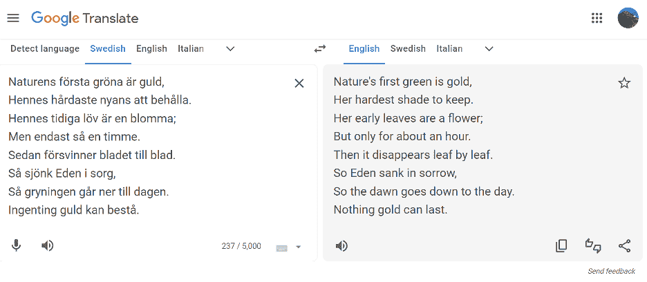
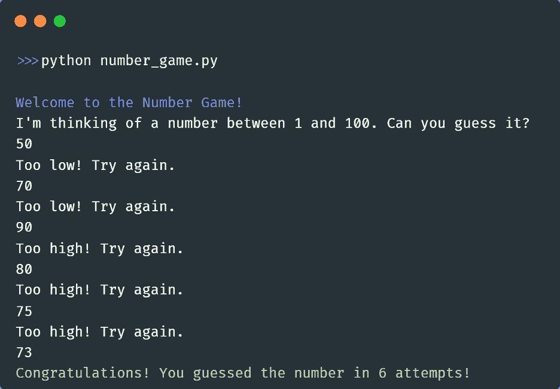

# 使用 ChatGPT 进行有效翻译

> 原文：[`machinelearningmastery.com/using-chatgpt-for-translation-effectively/`](https://machinelearningmastery.com/using-chatgpt-for-translation-effectively/)

ChatGPT 已展示出惊人的高准确度处理翻译任务的能力。虽然谷歌翻译多年来一直是多语言翻译的首选工具，但最近的研究显示，ChatGPT 在高资源的欧洲语言中表现与商业翻译产品竞争力相当 ([Is ChatGPT A Good Translator?](https://arxiv.org/pdf/2301.08745.pdf)).

ChatGPT 作为翻译者的优势不仅仅在于自然语言文本。你还可以翻译不同编程语言之间的代码。只需提供描述你想要的翻译的初始化提示，ChatGPT 通常可以在几秒钟内生成高准确度的转换代码。

在这篇文章中，你将学习如何使用 ChatGPT 提示来了解 ChatGPT 的翻译能力。具体来说，你将学会：

+   将诗歌从英文翻译成瑞典语。

+   将代码从 Julia 翻译成 Python。

+   提升翻译结果。

使用 ChatGPT 进行有效翻译 图片由 Adrian Tam 使用 Stable Diffusion 生成。保留了一些权利。

**开始并应用 ChatGPT**，参考我的书籍 [《用 ChatGPT 最大化生产力》](https://machinelearningmastery.com/productivity-with-chatgpt/)。书中提供了**实际案例**和**提示示例**，旨在帮助你快速使用 ChatGPT。

让我们开始吧。

## 概述

本帖分为三个部分；它们是

+   语言翻译

+   代码翻译

+   有效翻译的技巧

## 语言翻译

在制作翻译提示之前，你必须建立一个初始化提示，提供翻译所需的上下文和文本风格。对于当前任务，你正在翻译罗伯特·弗罗斯特的诗歌，并将把这些信息融入初始化提示中：

> 你是一个将英文诗歌翻译成瑞典语的翻译助手。

如果没有提供诗歌，ChatGPT 只是确认你的意图：

> 当然！我可以帮助你将英文诗歌翻译成瑞典语。请提供你想翻译的英文诗歌，我会尽力帮助你。

你的翻译机器人现在已经完全准备好，并对上下文有了全面的理解。你可以通过请求它将诗歌翻译成瑞典语来继续。你在第二个提示中提供诗歌：

> 请将以下诗歌从英文翻译成瑞典语：
> 
> Naturens första gröna är guld,
> 
> Hennes svåraste nyans att hålla.
> 
> Hennes tidiga blad är en blomma;
> 
> 但只有一个小时。
> 
> Sedan bladet övergår till blad.
> 
> 所以伊甸园沉入悲伤，
> 
> Så gryning blir dag.
> 
> 什么也无法保持金色。

以下是 ChatGPT 的回应：

> 当然！以下是罗伯特·弗罗斯特的《Nothing Gold Can Stay》的瑞典语翻译：
> 
> Naturens första gröna är guld,
> 
> Hennes hårdaste nyans att behålla.
> 
> Hennes tidiga löv är en blomma;
> 
> Men endast så en timme.
> 
> Sedan försvinner bladet till blad.
> 
> Så sjönk Eden i sorg,
> 
> Så gryningen går ner till dagen.
> 
> Ingenting guld kan bestå.
> 
> 我希望这个翻译能够捕捉到原诗的精髓。如果你还有其他需要帮助的地方，请告诉我！

### 验证

为了确认翻译的准确性，你可以将翻译后的诗歌粘贴到 Google 翻译中，获取英文版。在这种情况下，翻译几乎是完美的，考虑到翻译诗歌的难度，这很令人印象深刻。它成功捕捉了原诗的精髓和意义。

## 代码翻译

在本节中，你将要求 ChatGPT 将一个简单的数字猜谜游戏从 Julia 翻译成 Python。

许多编程语言看起来彼此相似。为了确保代码翻译的成功，你必须通过初始化提示提供上下文。这个提示将介绍代码翻译器并指定正在翻译的代码类型：

> 你是一位精通 Julia 和 Python 编程语言的专业软件工程师。在这种情况下，你将帮助我将一个简单的 Julia 游戏翻译成 Python。

与之前的示例类似，ChatGPT 会确认你的指示并等待你提供代码：

> 当然！我很乐意帮助你将你的 Julia 游戏翻译成 Python。请提供 Julia 中的游戏代码，我会协助你将其转换为 Python。

现在，请求 ChatGPT 将以下代码转换为 Python，使用以下提示：

> 请将以下 Julia 代码转换为 Python：

上面的代码故意使用三个反引号进行引用，遵循 Markdown 格式中的代码引用惯例。你将看到 ChatGPT 对代码的翻译回应：

> 当然！这是给定的 Julia 代码的等效 Python 代码：

### 验证

作为一个语言模型，ChatGPT 可能会在代码中产生一些错误。为了验证翻译的准确性，你应该创建一个名为 `number_game.py` 的 Python 文件，将转换后的代码粘贴进去，并在终端中执行该文件，以便让真实的 Python 解释器告诉你代码是否按预期工作。

在这种情况下，ChatGPT 仅凭一个简单的提示就完美地将 Julia 代码翻译成了 Python。

## 有效翻译的提示

虽然可以编写一个简单的翻译提示并获得结果，但有几个提示可以帮助提升翻译输出的质量：

+   在编写翻译请求之前，请从初始化提示开始。

+   提供额外的上下文以帮助模型理解文本的含义。例如，指定文本是诗歌还是技术文档。

+   清楚地在提示中说明源语言和目标语言。

+   在任何后续提示中使用简单明了的句子。

+   始终校对并验证翻译的准确性。

+   确保你的输入文本有正确的标点，并遵循适当的格式指南，以获得更好的翻译结果。

## 进一步阅读

温向娇、王文轩、黄振泽、王兴、涂兆鹏。“[ChatGPT 是一个好的翻译器吗？是的，GPT-4 作为引擎](https://arxiv.org/pdf/2301.08745.pdf)”，arXiv 2301.08745，2023。

## 摘要

在这篇文章中，我们探讨了 ChatGPT 在机器翻译中的不同应用场景，强调了实现准确翻译的有效策略。具体来说，我们讨论了以下主题：

+   为语言翻译编写有效的初始化和翻译提示。

+   为技术任务编写翻译提示，例如将 Julia 代码转换为 Python。

+   通过上下文意识、注意标点、验证技术以及优化 ChatGPT 来提升翻译结果。

+   提示。

通过实施这些技术，你可以充分发挥 ChatGPT 的翻译能力，并获得高质量的翻译结果以满足各种应用需求。
