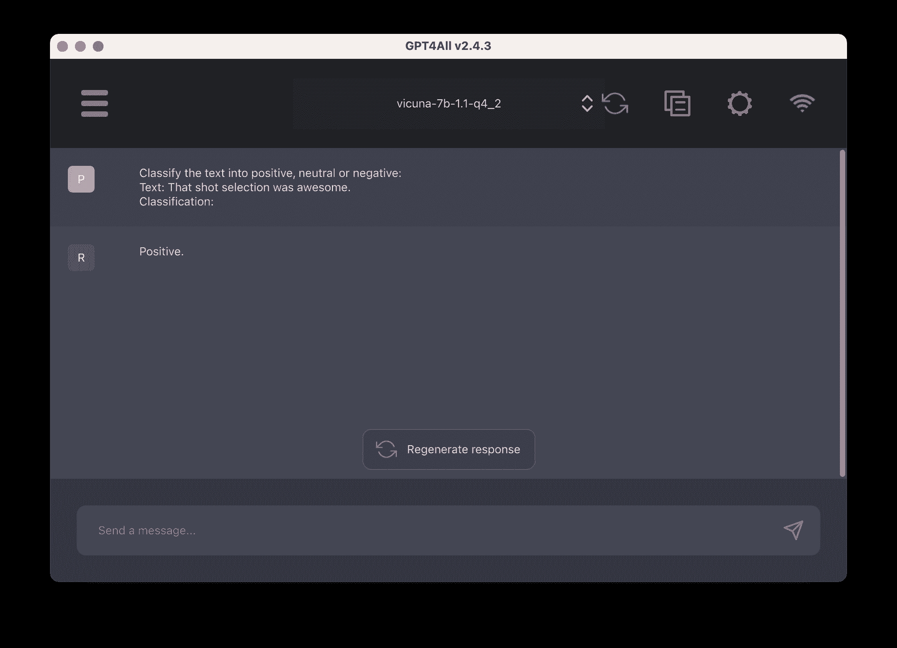
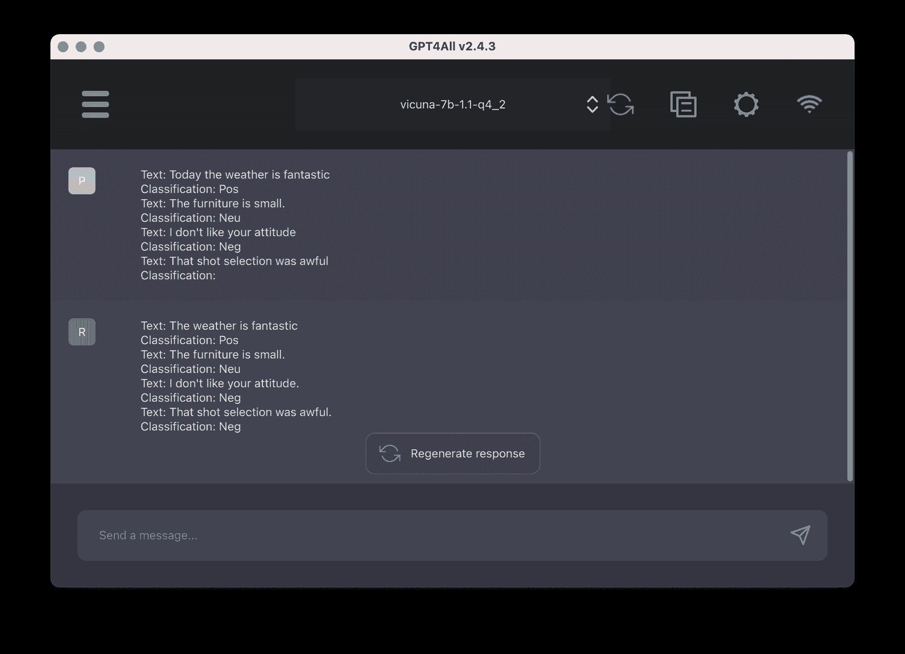

# 什么是零-shot 提示和少量示例提示

> 原文：[`machinelearningmastery.com/what-are-zero-shot-prompting-and-few-shot-prompting/`](https://machinelearningmastery.com/what-are-zero-shot-prompting-and-few-shot-prompting/)

在语言模型的文献中，你会经常遇到“零-shot 提示”和“少量示例提示”这两个术语。了解大型语言模型如何生成输出是很重要的。在本文中，你将学习：

+   什么是零-shot 和少量示例提示？

+   如何在 GPT4All 中进行实验


什么是零-shot 提示和少量示例提示

作者使用稳定扩散生成的图片。版权所有。

**开始使用并应用 ChatGPT**，请参考我的书籍[《最大化 ChatGPT 生产力》](https://machinelearningmastery.com/productivity-with-chatgpt/)。它提供了**实际应用案例**和**提示示例**，旨在帮助你迅速使用 ChatGPT。

让我们开始吧。

## 概述

本文分为三部分；它们是：

+   大型语言模型如何生成输出？

+   零-shot 提示

+   少量示例提示

## 大型语言模型如何生成输出？

大型语言模型经过大量文本数据的训练。它们被训练来预测输入的下一个单词。研究发现，只要模型足够大，不仅可以学习人类语言的语法，还可以学习单词的意义、常识和原始逻辑。

因此，如果你将断裂的句子“My neighbor’s dog is”作为输入（也称为**提示**）提供给模型，它可能会预测“smart”或“small”，但不太可能是“sequential”，尽管这些都是形容词。同样，如果你向模型提供一个完整的句子，你可以期望模型的输出是自然跟随的句子。反复将模型的输出附加到原始输入上，并再次调用模型，可以让模型生成较长的回应。

## 零-shot 提示

在自然语言处理模型中，零-shot 提示意味着向模型提供一个不属于训练数据的提示，但模型可以生成你所期望的结果。这种有前景的技术使大型语言模型在许多任务中变得有用。

为了理解这为何有用，想象一下情感分析的情况：你可以将不同意见的段落进行标记，然后用情感分类对其进行标注。然后，你可以训练一个机器学习模型（例如，对文本数据进行 RNN 训练），将段落作为输入，生成分类作为输出。但你会发现这样的模型并不适应。如果你为分类添加了新的类别，或要求不是对段落进行分类而是总结，这个模型必须进行修改和重新训练。

然而，大型语言模型不需要重新训练。如果你知道如何正确提问，你可以让模型对一段文字进行分类或总结。这意味着模型可能无法将一段文字分类为 A 类或 B 类，因为“A”和“B”的含义不明确。然而，它可以将其分类为“积极情感”或“消极情感”，因为模型知道什么是“积极”和“消极”。之所以有效，是因为在训练过程中，模型学会了这些词的含义，并获得了遵循简单指令的能力。以下是一个例子，使用 GPT4All 的 Vicuna-7B 模型演示：



提供的提示是：

```py
Classify the text into positive, neutral or negative:
Text: That shot selection was awesome.
Classification:
```

回应是一个单词，“积极”。这是正确且简洁的。模型显然可以理解“awesome”是一种积极的感觉，但能够识别这种感觉是因为最开始的指示：“将文本分类为积极、中性或消极。”

在这个例子中，你发现模型做出了回应，因为它理解了你的指示。

## 少量提示

如果你不能描述你想要什么，但仍希望语言模型给出答案，你可以提供一些示例。以下例子更容易演示：



仍然使用 GPT4All 中的 Vicuna-7B 模型，但这次我们提供的提示是：

```py
Text: Today the weather is fantastic
Classification: Pos
Text: The furniture is small.
Classification: Neu
Text: I don't like your attitude
Classification: Neg
Text: That shot selection was awful
Classification:
```

这里你可以看到没有提供如何做的指示，但通过一些示例，模型可以搞清楚如何响应。还要注意，模型回应“Neg”而不是“Negative”，因为这是示例中提供的内容。

**注意**：由于模型的随机性，你可能无法重现完全相同的结果。你可能还会发现每次运行模型时产生不同的输出。

指导模型使用示例进行响应称为少量提示（few-shot prompting）。

## 摘要

在这篇文章中，你学习了一些提示的示例。具体来说，你学到了：

+   一次性提示（one-shot prompting）和少量提示（few-shot prompting）是什么？

+   模型如何处理一次性和少量提示

+   如何使用 GPT4All 测试这些提示技术
