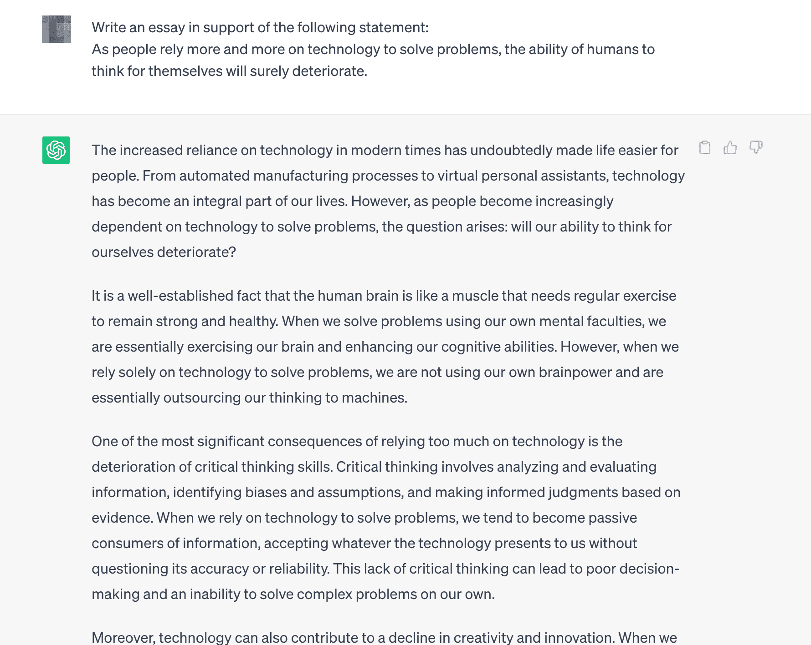
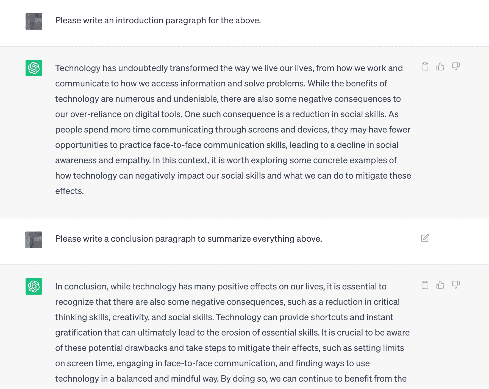

# 使用 ChatGPT 写作

> 原文：[`machinelearningmastery.com/writing-an-essay-with-chatgpt/`](https://machinelearningmastery.com/writing-an-essay-with-chatgpt/)

ChatGPT 是一个语言模型，你可以通过与它对话来使用它。如此规模的语言模型自然可以生成流畅的文本，难以与人类创作的作品区分开来。如果你想用它来完成某项任务，你可能仍然需要提供详细的指示。此外，你也不应指望它完全取代人类。你很可能需要做最后的润色。

在接下来的内容中，你将使用 ChatGPT 来写一篇文章。具体来说，你将学习

+   如何指导将你的任务分解为步骤以便使用 ChatGPT

+   如何一步一步指导 ChatGPT 写文章

**开始使用并应用 ChatGPT**，参阅我的书籍[《最大化 ChatGPT 的生产力》](https://machinelearningmastery.com/productivity-with-chatgpt/)。它提供了**现实世界的使用案例**和**提示示例**，旨在让你快速上手使用 ChatGPT。

让我们开始吧。

使用 ChatGPT 写作

图片由作者使用 Stable Diffusion 生成。部分权利保留。

## 概述

本文分为四部分，它们是：

+   文章主题

+   直接指示

+   一步一步指导 ChatGPT

+   工作原理

## 文章主题

例如，考虑一下[GRE 分析写作样题](https://www.ets.org/pdfs/gre/sample-issue-task.pdf)。它是研究生入学考试的一部分，旨在展示你在陈述中解释理由的能力。一篇高分的文章应该提供相关理由来支持你的观点，但要避免没有扩展的过于笼统的例子。

考虑 GRE 样题中的声明：

> 随着人们越来越依赖技术来解决问题，人类自主思考的能力必然会退化。

让我们看看如果你要求 ChatGPT 写这样一篇文章，它会有什么反应。

## 直接指示

使用 ChatGPT 最简单的方法是通过以下提示直接要求它给你一篇文章：

> 写一篇支持以下声明的文章：
> 
> 随着人们越来越依赖技术来解决问题，人类自主思考的能力必然会退化。

指示 ChatGPT 写整篇文章

结果会因系统的随机性而每次运行时有所不同。以下是其中一个结果：

> 现代社会对技术的依赖无疑使人们的生活变得更加便捷。从自动化生产过程到虚拟个人助手，技术已经成为我们生活中的一个不可或缺的部分。然而，随着人们越来越依赖技术来解决问题，问题随之而来：我们自主思考的能力会不会退化？
> 
> 众所周知，人脑像肌肉一样，需要定期锻炼才能保持强壮和健康。当我们利用自己的思维能力解决问题时，实质上是在锻炼我们的大脑，增强我们的认知能力。然而，当我们完全依赖技术来解决问题时，我们并没有利用自己的大脑力量，而是把我们的思维外包给了机器。
> 
> 过度依赖技术的最重要后果之一是批判性思维能力的退化。批判性思维涉及分析和评估信息，识别偏见和假设，并根据证据做出明智的判断。当我们依赖技术解决问题时，我们往往成为信息的被动消费者，接受技术呈现给我们的一切而不质疑其准确性或可靠性。这种缺乏批判性思维可能导致决策不当，并且无法独立解决复杂问题。
> 
> 此外，技术也可能导致创造力和创新能力的下降。当我们使用技术解决问题时，我们受到其能力和功能的限制。相反，当我们自己思考时，我们可以自由探索新颖和非传统的想法，并提出创造性的解决方案。过度依赖技术可能抑制我们的创造力，并阻止我们发现面临挑战时的新颖和创新的解决方案。
> 
> 过度依赖技术的另一个负面后果是社交技能的流失。社交互动对于发展人际交往技能，如沟通、移情和冲突解决至关重要。当我们依赖技术进行交流时，我们会错过面对面互动的微妙细节，而这些细节对于建立有意义的人际关系至关重要。这可能导致社交技能的缺失，并且在与他人建立和维护关系方面遇到困难。
> 
> 总之，虽然技术无疑使我们的生活更加便利和舒适，但重视技术过度依赖可能带来潜在的负面后果是很重要的。随着技术的融入，我们必须确保不过度依赖技术来解决问题。我们必须继续锻炼我们的批判性思维能力，培养创造力，并保持社交技能，以确保我们保持能力强大且独立的问题解决者。

这篇文章看起来非常自然，作为一篇文章也不错。但事实上，它并不是顶尖水平的。如果你知道如何更好地提问，你可以得到一篇更好的文章。

## 引导 ChatGPT 逐步撰写

语言模型可以根据上下文生成文本。在 ChatGPT 的例子中，上下文是您和系统之间最近的对话。此外，ChatGPT 的响应不是一次性生成的，而是一个令牌一个令牌地生成。因此，它记住了先前句子中说过的内容。

因此，如果给出一大段文字，很难对答案进行“微调”。将大写作任务拆分成更小的部分更为容易。

对于上述相同的话题，你可以这样做：

> 给我三段支持以下陈述的段落，每段一个论点。
> 
> 随着人们越来越依赖技术解决问题，人类独立思考的能力肯定会退化。

现在产生了以下内容：

> 第一段：随着技术的不断进步，人们更容易依赖它来解决问题。这可能导致批判性思维能力的缺乏，因为人们可能不会被挑战去独立解决问题。例如，使用 GPS 导航的人可能不会培养空间感知或地图阅读技能，而这些技能在生活的许多领域中都很重要。此外，依赖计算器或计算机程序进行数学计算的人可能不会发展出强大的心理数学技能或对数学概念的理解。因此，他们独立思考和解决问题的能力可能会退化。
> 
> 第二段：除了减少批判性思维能力，技术还可能对创造力产生负面影响。当人们依赖技术解决问题时，他们可能更不容易跳出框架，提出创造性的解决方案。这是因为他们习惯于遵循技术提供的预设算法或解决方案。这在艺术领域尤为明显，数字工具可以用来快速轻松地创作艺术作品。虽然这些工具很有用，但它们也可能通过使创作常规或衍生作品变得更容易来限制创造力。
> 
> 第三段：最后，对技术的过度依赖可能导致社交技能的减少。随着人们花更多时间通过屏幕和设备进行交流，他们与他人面对面互动的机会可能减少。这会使他们更难理解社交线索、对他人产生共情，并建立牢固的关系。此外，依赖技术进行社交互动的人可能更容易感到孤独和隔离。这可能对心理健康产生负面影响，从而影响整体的认知功能和解决问题的能力。

这看起来更好。尤其是第一段有了具体的例子。但其他两段没有给出例子。让我们继续聊天，询问更多例子：

> 你能给出一些具体的例子，说明技术如何对创造力产生负面影响吗？

它回答了：

> 当然！以下是技术如何对创造力产生负面影响的几个例子：
> 
> 模板驱动的设计：许多数字工具，如网站构建器，提供了可以用自己的内容进行自定义的预设计模板。虽然这些模板对初学者有帮助，但它们也可能通过限制设计选项和鼓励顺从来扼杀创造力。
> 
> 对滤镜的依赖：社交媒体平台如 Instagram 提供了多种滤镜，用户可以将其应用于照片中以提升外观。虽然这些滤镜使用起来很有趣，但也可能会抑制创造力，使得制作出相似的、过于风格化的图片变得容易。
> 
> 自动纠错和预测文本：虽然这些功能可以帮助避免拼写错误和加快写作过程，但它们也可能导致写作中的创造力缺乏。例如，如果有人过度依赖自动纠错，他们可能不会花时间学习正确的拼写或语法，这可能限制他们通过写作进行创造性表达的能力。
> 
> 算法推荐：流媒体服务如 Netflix 和 Spotify 使用算法根据用户的观看或收听历史推荐内容。虽然这对发现新内容有帮助，但它也可能通过推广相似的内容限制创造力，并抑制用户探索新类型或艺术家的兴趣。
> 
> 总的来说，虽然技术可以是增强创造力的强大工具，但必须意识到它的潜在局限性，并积极避免陷入创造性困境或过度依赖数字工具。

由于 GRE 分析写作的字数大约为 500 到 600 字，因此需要更简洁。然而，这些例子是有帮助的。你可以进一步询问有关原先生成的第三段的例子：

> 能否给出一些具体的例子说明技术如何导致社交技能的减少？请简要说明。

现在它的回答是：

> 当然，以下是一些技术如何导致社交技能减少的例子：
> 
> 过度依赖短信和社交媒体可能导致面对面交流技能的缺乏，使得更难察觉社交线索。
> 
> 过度花费时间在屏幕上可能会导致社交孤立和孤独感。
> 
> 网络交流的匿名性可能导致缺乏同理心和网络欺凌的增加。
> 
> 在线约会和社交网络应用程序可能会减少面对面社交互动的机会，使得建立深层、有意义的关系变得更加困难。
> 
> 对技术的持续依赖可能会分散对现实社交情况的注意力，导致面对面交流时缺乏参与感和注意力。

好的，请注意这些例子不是段落形式，因为你需要指定 ChatGPT 如何回答。但你可以很容易将这些例子整合到你的文章段落中。

现在我们还需要一个引言和结论来完成这篇文章。让我们请 ChatGPT 来完成这些部分。

> 请为上述内容写一个引言段落。

这是它生成的内容：

> 技术无疑改变了我们生活的方式，从工作和沟通到获取信息和解决问题。尽管技术的好处多种多样且不可否认，但我们对数字工具的过度依赖也带来了一些负面影响。其中一个后果是社交技能的下降。随着人们花更多时间通过屏幕和设备进行沟通，他们可能会有更少的机会练习面对面的沟通技能，从而导致社交意识和同理心的下降。在这种情况下，探讨技术如何负面影响我们的社交技能及我们可以采取什么措施来减轻这些影响是值得的。

对于结论，你需要参考你文章的主要内容。你不必担心，因为 ChatGPT 会记住对话。你可以问：

> 请写一个结论段落，总结以上所有内容。

它回答了：

> 总结来说，尽管技术对我们的生活有许多积极的影响，但也必须认识到它存在一些负面后果，如批判性思维、创造力和社交技能的下降。技术可以提供捷径和即时满足，这可能会导致基本技能的侵蚀。意识到这些潜在的缺陷并采取措施减轻它们的影响至关重要，例如限制屏幕时间、参与面对面的交流，并找到以平衡和有意识的方式使用技术的方法。这样，我们可以继续享受技术的众多优势，同时确保保持使我们成为人类的技能和联系。

经过一些重新排序和润色，你现在就有了一篇完整的文章。

指导 ChatGPT 分步写作文章

## 如何运作

ChatGPT 能够很好地完成这项任务，因为它经过大量数据集的训练。因此，模型记住了许多“事实”，这有助于撰写这篇文章。如果你尝试使用较小的模型，如在你的计算机上运行的 GPT4All，你可能会发现结果不那么详尽。

然而，根据其架构背后的原理，词语是基于与您提供的提示和它之前生成的内容之间的最高相关性来选择的。因此，你设置的提示越准确，模型生成更好的响应的可能性就越大。

尽管如此，你不应期望这会完美。首先，提示有大小限制，因此你无法完全概述你的意图。其次，即使没有限制，由于你的认知偏差，也很难在提示中包含所有细节。最后，由于对它的训练，这样的模型更倾向于选择最常见的词而不是最适合上下文的词。这也是为什么我们发现 ChatGPT 生成的作品可能获得及格，但从未达到优秀水平的原因。

## 总结

在这篇文章中，你了解了 ChatGPT 如何帮助你写作。特别是，你学到了：

+   ChatGPT 可以在简单的指导下，快速为你写出一篇文章。

+   你可以将任务拆分成多个步骤，以便 ChatGPT 生成更详细的回应。

+   ChatGPT 在创建新回应时可以参考与您的对话。
