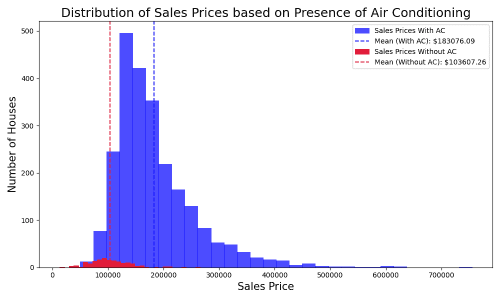

# 房地产中的假设检验：深入研究使用 Ames 房屋数据集的假设检验

> 原文：[`machinelearningmastery.com/a-dive-into-hypothesis-testing/`](https://machinelearningmastery.com/a-dive-into-hypothesis-testing/)

在进行推断统计时，你通常需要测试你的假设。确实，有一种定量测试你想到的假设的方法。通过使用 Ames 房屋数据集，你将深入探讨假设检验的概念，并探索空调的存在是否影响房屋的销售价格。

让我们开始吧。


房地产中的假设检验：深入研究使用 Ames 房屋数据集的假设检验

图片由[亚历克斯·斯陶丁格](https://www.pexels.com/photo/sun-piercing-of-brown-concrete-house-near-sea-1732414/)提供。保留部分权利。

## 概述

本文通过以下几个部分展开：

+   假设检验在推断统计中的作用。

+   假设检验是如何工作的？

+   空调是否影响销售价格？

## 假设检验在推断统计中的作用

推断统计使用数据样本来对所抽取的总体做出推断。假设检验是推断统计的一个基本组成部分，当基于样本数据对总体做出有根据的决策时，特别是在研究整个总体不可行的情况下，假设检验是至关重要的。假设检验是一种关于数据的陈述方法。

想象一下你发现了一个声明，称有空调的房子比没有空调的房子售价更高。为了验证这一声明，你会收集房屋销售数据，并分析是否存在基于空调存在与否的价格显著差异。这一过程即是通过样本数据测试关于总体的声明或假设，称为假设检验。从本质上讲，假设检验允许我们基于样本的证据以及观察到的效果是否是偶然发生的可能性，做出有根据的决定（即拒绝或不拒绝一个初始假设）。

**启动你的项目**，请参阅我的书籍[数据科学入门指南](https://machinelearning.samcart.com/products/beginners-guide-data-science/)。它提供了**自学教程**和**可运行的代码**。

## 假设检验是如何工作的？

假设检验是一种推断统计的方法论，你从关于总体参数的初始声明（假设）开始。然后，你使用样本数据来确定是否有足够的证据来拒绝这个初始声明。假设检验的组成部分包括：

+   **原假设 ($H_0$):** **默认状态**为没有效果或没有差异。你要测试的陈述。

+   **替代假设 ($H_a$):** 你想要证明的内容。它是当原假设错误时你所相信的内容。

+   **检验统计量：** 从样本数据中计算出的一个值，用于检验原假设。

+   **p 值：** 在原假设情况下，样本中观察到的效应发生的概率。

进行假设检验就像侦探工作：通常，你假设某事应该发生（$H_0$），但你怀疑实际上发生了其他事情（$H_1$）。然后你收集证据（检验统计量）来论证为何 $H_0$ 不合理；因此 $H_1$ 应该是事实。

在典型的假设检验中：

1.  你陈述原假设和替代假设。你应该仔细设计这些假设，以反映对现实的合理假设。

1.  你选择一个显著性水平（$\alpha$）；在统计假设检验中，通常使用 $\alpha=0.05$。

1.  你收集并分析数据，以获得我们的检验统计量和 p 值，基于 $H_0$ 的情况。

1.  你基于 p 值做出决定：当且仅当 p 值小于 $\alpha$ 时，你才会拒绝原假设并接受替代假设。

让我们来看一个示例，展示这些步骤是如何执行的。

## 空调是否影响销售价格？

基于 [Ames 数据集](https://raw.githubusercontent.com/Padre-Media/dataset/main/Ames.csv)，我们想知道空调的存在是否会影响价格。

为了探讨空调对销售价格的影响，你将设定我们的假设为：

+   $H_0$：带有空调的房屋的平均销售价格与没有空调的房屋相同。

+   $H_a$：带有空调的房屋的平均销售价格与没有空调的房屋不同。

在进行假设检验之前，我们先可视化数据，以获得初步了解。

```py
# Loading the dataset and essential libraries
import pandas as pd
import numpy as np
import matplotlib.pyplot as plt
Ames = pd.read_csv('Ames.csv')

# Data separation
ac_prices = Ames[Ames['CentralAir'] == 'Y']['SalePrice']
no_ac_prices = Ames[Ames['CentralAir'] == 'N']['SalePrice']

# Setting up the visualization
plt.figure(figsize=(10, 6))

# Histograms for sale prices based on air conditioning
# Plotting 'With AC' first for the desired order in the legend
plt.hist(ac_prices, bins=30, alpha=0.7, color='blue', edgecolor='blue', lw=0.5,
         label='Sales Prices With AC')
mean_ac = np.mean(ac_prices)
plt.axvline(mean_ac, color='blue', linestyle='dashed', linewidth=1.5,
            label=f'Mean (With AC): ${mean_ac:.2f}')

plt.hist(no_ac_prices, bins=30, alpha=0.7, color='red', edgecolor='red', lw=0.5,
         label='Sales Prices Without AC')
mean_no_ac = np.mean(no_ac_prices)
plt.axvline(mean_no_ac, color='red', linestyle='dashed', linewidth=1.5,
            label=f'Mean (Without AC): ${mean_no_ac:.2f}')

plt.title('Distribution of Sales Prices based on Presence of Air Conditioning', fontsize=18)
plt.xlabel('Sales Price', fontsize=15)
plt.ylabel('Number of Houses', fontsize=15)
plt.legend(loc='upper right')
plt.tight_layout()
plt.show()
```



重叠直方图比较销售价格

上述代码调用了 `plt.hist()` 两次，使用不同的数据来显示两个重叠的直方图，一个用于带空调的销售价格分布，另一个用于没有空调的分布。根据这些视觉效果，可以做出以下几个观察：

+   **明显的峰值：** 两个分布都展示了**明显的**峰值，这表明了各自类别中最频繁的销售价格。

+   **平均销售价格：** 带有空调的房屋的平均销售价格高于没有空调的房屋，如垂直虚线所示。

+   **分布和偏态：** 带有空调的房屋销售价格分布呈现出轻微的右偏，这表明尽管大多数房屋以较低价格出售，但也有一些房产的价格显著较高。相比之下，没有空调的房屋价格分布更为紧凑，价格范围较小。

+   **重叠：** 尽管均值有所不同，但有空调和没有空调的房屋在价格范围上存在重叠。这表明，虽然空调可能会影响价格，但其他因素也在决定房屋价值方面发挥作用。

基于这些见解，有空调的房子似乎与更高的销售价格相关。下一步将是执行假设检验，以数字方式确定这种差异是否显著。

```py
# Import an additional library
import scipy.stats as stats

# Performing a two-sample t-test
t_stat, p_value = stats.ttest_ind(ac_prices, no_ac_prices, equal_var=False)

# Printing the results
if p_value < 0.05:
    result = "reject the null hypothesis"
else:
    result = "fail to reject the null hypothesis"
print(f"With a p-value of {p_value:.5f}, we {result}.")
```

这表明：

```py
With a p-value of 0.00000, we reject the null hypothesis.
```

p 值小于 $\alpha$。p 值表明，在 $H_0$ 下，价格差异很可能不是偶然的。这表明有空调的房子的平均销售价格与没有空调的房子之间存在统计学上显著的差异。这与我们从直方图中的视觉观察一致。因此，空调的存在似乎确实对 Ames 数据集中的房子销售价格产生了显著影响。

这个 p 值是使用 t 检验计算的。它是一种统计量，旨在比较**两个组的均值**。有许多统计方法可用，t 检验在这里是合适的，因为我们的假设 $H_0$、$H_a$ 关注的是平均销售价格。

请注意，上述定义的备择假设 $H_a$ 可以更改。你可以将其设为“有空调的房子的平均销售价格**低于**没有空调的房子”；然而，这与现实情况相悖。你也可以将其设为“有空调的房子的平均销售价格**高于**没有空调的房子”；在这种情况下，你应当将代码中的 t 检验修改为包括额外的参数 `alternative='greater'`：

```py
# Performing a one-sided t-test
t_stat, p_value = stats.ttest_ind(ac_prices, no_ac_prices, equal_var=False, alternative='greater')

# Printing the results
if p_value < 0.05:
    result = "reject the null hypothesis"
else:
    result = "fail to reject the null hypothesis"
print(f"With a p-value of {p_value:.5f}, we {result}.")
```

```py
With a p-value of 0.00000, we reject the null hypothesis.
```

这将双侧 t 检验更改为单侧 t 检验，但结果是相同的。从双侧 t 检验转换为单侧 t 检验但得出相同的结论，意味着我们从一开始就对差异的方向有明确的预期，或者数据强烈支持某一方向的差异，使得两种检验类型的结果一致。

原假设 ($H_0$) 和备择假设 ($H_a$) 的设定是统计检验设计的基础，它影响检验的方向性（单侧与双侧）、结果的解释（我们如何理解 p 值和证据）以及决策过程（尤其是在 p 值接近显著性水平 $\alpha$ 时）。这一框架不仅决定了我们测试的内容，还决定了我们如何解释和采取统计证据。

### 想要开始学习数据科学的初学者指南吗？

立即参加我的免费电子邮件速成课程（包含示例代码）。

点击注册并获得课程的免费 PDF 电子书版本。

## 进一步阅读

#### 在线

+   [假设检验教程](https://www.khanacademy.org/math/statistics-probability/significance-tests-one-sample)

+   [scipy.stats.ttest_ind](https://docs.scipy.org/doc/scipy/reference/generated/scipy.stats.ttest_ind.html) API

+   [学生 t 检验](https://en.wikipedia.org/wiki/Student%27s_t-test) 维基百科

#### 资源

+   [Ames 数据集](https://raw.githubusercontent.com/Padre-Media/dataset/main/Ames.csv)

+   [Ames 数据字典](https://github.com/Padre-Media/dataset/blob/main/Ames%20Data%20Dictionary.txt)

## **总结**

在这次探索中，你**深入**了解了使用 Ames Housing 数据集进行假设检验的世界。你研究了空调的存在如何影响房屋的售价。通过严格的统计检验，你发现有空调的房屋售价往往高于没有空调的房屋，这一结果具有统计学意义。这不仅突显了像空调这样的设施在房地产市场中的重要性，还展示了基于数据做出明智决策的假设检验的**力量**。

具体来说，你学到了：

+   假设检验在推断统计中的重要性。

+   如何通过详细的假设检验方法设置和评估原假设与备择假设。

+   假设检验在现实世界情境中的实际应用，以 Ames 住房市场中空调对房产价值的影响为例。

你有什么问题吗？请在下面的评论中提问，我会尽力回答。
