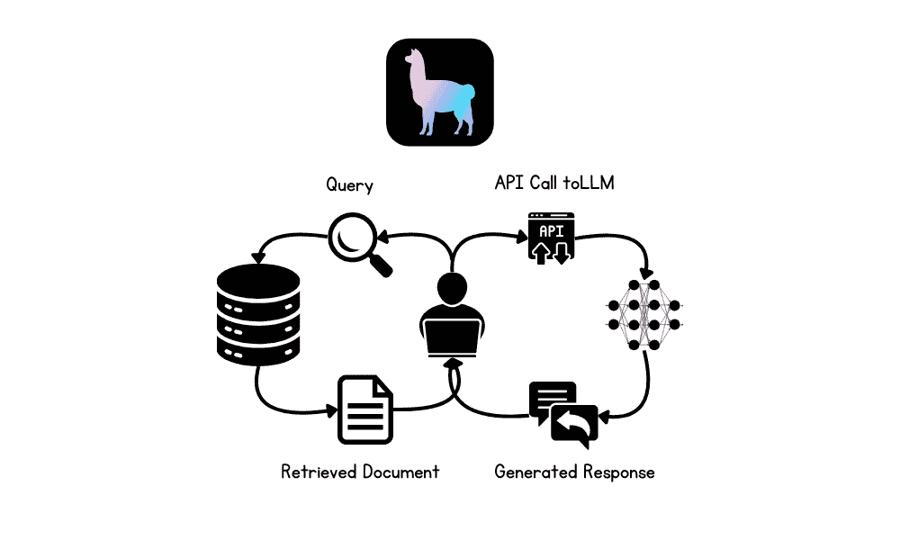

# 使用 LlamaIndex 构建简单的 RAG 应用程序

> 原文：[`machinelearningmastery.com/building-a-simple-rag-application-using-llamaindex/`](https://machinelearningmastery.com/building-a-simple-rag-application-using-llamaindex/)



作者提供的图片

在本教程中，我们将深入探讨检索增强生成（RAG）和 LlamaIndex AI 框架。我们将学习如何使用 LlamaIndex 构建一个基于 RAG 的 Q&A 应用程序，该应用程序可以处理私有文档，并通过加入内存缓冲区来增强应用程序。这将使 LLM 能够使用文档和先前交互的上下文生成响应。

## 在 LLM 中什么是 RAG？

检索增强生成（RAG）是一种先进的方法，旨在通过将外部知识源整合到生成过程中来提高大语言模型（LLM）的性能。

RAG 涉及两个主要阶段：检索和内容生成。最初，从外部数据库中检索相关文档或数据，然后用于提供 LLM 的上下文，确保响应基于最当前和领域特定的信息。

## 什么是 LlamaIndex？

LlamaIndex 是一个先进的 AI 框架，旨在通过促进与多种数据源的无缝集成来增强大语言模型（LLM）的能力。它支持从超过 160 种不同格式的数据中检索数据，包括 API、PDF 和 SQL 数据库，使其在构建先进的 AI 应用程序时具有高度的灵活性。

我们甚至可以构建一个完整的多模态和多步骤 AI 应用程序，然后将其部署到服务器上，以提供高精度、特定领域的响应。与 LangChain 等其他框架相比，LlamaIndex 提供了一个更简单的解决方案，内置了适用于各种 LLM 应用程序的功能。

## 使用 LlamaIndex 构建 RAG 应用程序

在本节中，我们将构建一个 AI 应用程序，该应用程序从文件夹加载 Microsoft Word 文件，将它们转换为嵌入，将它们索引到向量存储中，并构建一个简单的查询引擎。之后，我们将使用向量存储作为检索器、LLM 和内存缓冲区，构建一个带有历史记录的 RAG 聊天机器人。

### 设置

安装所有必要的 Python 包，以加载数据和使用 OpenAI API。

```py
!pip install llama-index
!pip install llama-index-embeddings-openai
!pip install llama-index-llms-openai
!pip install llama-index-readers-file
!pip install docx2txt
```

使用 OpenAI 函数初始化 LLM 和嵌入模型。我们将使用最新的“GPT-4o”和“text-embedding-3-small”模型。

```py
from llama_index.llms.openai import OpenAI
from llama_index.embeddings.openai import OpenAIEmbedding

# initialize the LLM
llm = OpenAI(model="gpt-4o")

# initialize the embedding
embed_model = OpenAIEmbedding(model="text-embedding-3-small")
```

将 LLM 和嵌入模型都设置为全局，以便在调用需要 LLM 或嵌入的函数时，它将自动使用这些设置。

```py
from llama_index.core import Settings

# global settings
Settings.llm = llm
Settings.embed_model = embed_model
```

### 加载和索引文档

从文件夹加载数据，将其转换为嵌入，并存储到向量存储中。

```py
from llama_index.core import VectorStoreIndex, SimpleDirectoryReader

# load documents
data = SimpleDirectoryReader(input_dir="/work/data/",required_exts=[".docx"]).load_data()

# indexing documents using vector store
index = VectorStoreIndex.from_documents(data)
```

### 构建查询引擎

请将向量存储转换为查询引擎，并开始询问有关文档的问题。文档包括作者 Abid Ali Awan 于 6 月在 Machine Learning Mastery 发布的博客。

```py
from llama_index.core <b>import</b> VectorStoreIndex

# converting vector store to query engine
query_engine = index.as_query_engine(similarity_top_k=3)

# generating query response
response = query_engine.query("What are the common themes of the blogs?")
print(response)
```

答案是准确的。

> 博客的共同主题围绕提升**和**技能**在**机器学习领域展开。它们专注于提供资源，例如**免费的**书籍、协作**的平台**，**和**数据集，以帮助个人深入了解机器学习算法，有效协作项目，并通过实际数据获得实践经验。这些资源旨在帮助初学者**和**专业人士建立坚实的基础**和**推动其在机器学习领域的职业发展。

### 使用记忆缓冲区构建 RAG 应用程序

之前的应用程序很简单；让我们创建一个更先进的聊天机器人，具有历史记录功能。

我们将使用检索器、聊天记忆缓冲区和 GPT-4o 模型来构建聊天机器人。

然后，我们将通过询问关于其中一篇博客文章的问题来测试我们的聊天机器人。

```py
from llama_index.core.memory import ChatMemoryBuffer
from llama_index.core.chat_engine import CondensePlusContextChatEngine

# creating chat memory buffer
memory = ChatMemoryBuffer.from_defaults(token_limit=4500)

# creating chat engine
chat_engine = CondensePlusContextChatEngine.from_defaults(    
   index.as_retriever(),    
   memory=memory,    
   llm=llm
)

# generating chat response
response = chat_engine.chat(    
   "What is the one best course for mastering Reinforcement Learning?"
)
print(str(response))
```

它非常准确且切中要点。

> 根据提供的文档，Hugging Face 的“Deep RL 课程”**是**掌握强化学习的强烈推荐。该课程**特别适合**初学者**和**涵盖了强化学习的基础知识**和**高级技术。它包括诸如 Q-learning、深度 Q-learning、策略梯度、ML 代理、演员-评论家方法、多智能体系统**和**高级主题如 RLHF（从人类反馈中学习的强化学习）、决策变换器**和**MineRL。课程设计为一个月内完成，并提供实践实验，包括模型、提升分数的策略**和**一个跟踪进度的排行榜。

让我们提出后续问题，进一步了解课程内容。

```py
response = chat_engine.chat(
    "Tell me more about the course"
)
print(str(response))
```

如果你在运行上述代码时遇到问题，请参考 Deepnote 笔记本：[使用 LlamaIndex 构建 RAG 应用程序](https://deepnote.com/workspace/abid-5efa63e7-7029-4c3e-996f-40e8f1acba6f/project/Building-a-Simple-RAG-Application-using-LlamaIndex-5ef68174-c5cd-435e-882d-c0e112257391/notebook/Notebook%201-2912a70b918b49549f1b333b8778212c)。

## 结论

LlamaIndex 使得构建和部署 AI 应用程序变得简单。你只需写几行代码即可完成。

你学习旅程的下一步是使用 Gradio 构建一个合适的聊天机器人应用程序并将其部署到服务器上。为了进一步简化你的生活，你还可以查看 Llama Cloud。

在本教程中，我们了解了 LlamaIndex 以及如何构建一个 RAG 应用程序，以便从私人文档中提出问题。然后，我们构建了一个适当的 RAG 聊天机器人，该机器人使用私人文档和之前的聊天记录生成响应。
