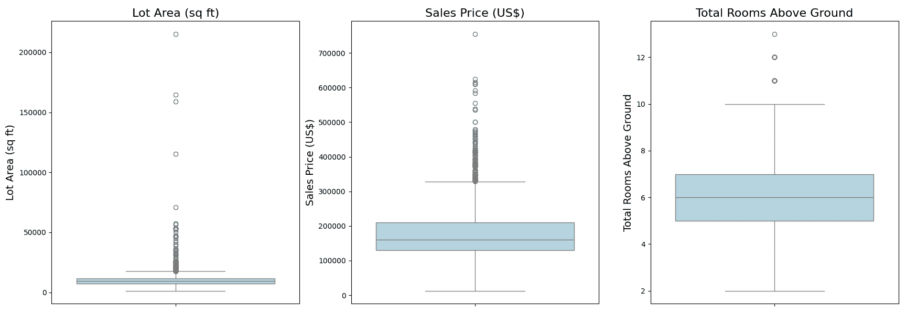
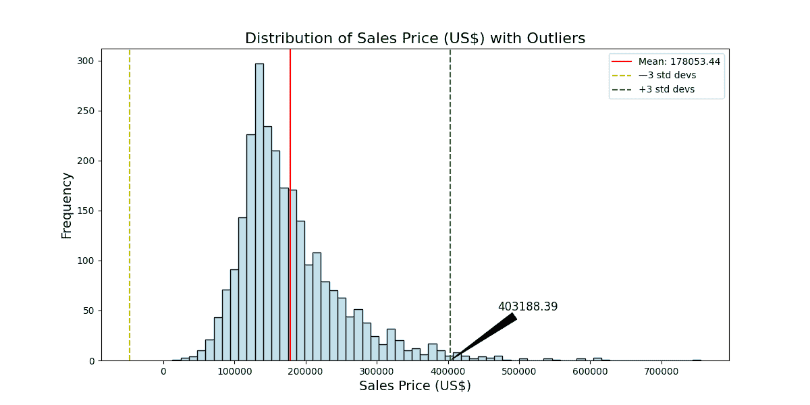

# 发现异常：数据科学中的经典异常值检测方法

> 原文：[`machinelearningmastery.com/spotting-the-exception-classical-methods-for-outlier-detection-in-data-science/`](https://machinelearningmastery.com/spotting-the-exception-classical-methods-for-outlier-detection-in-data-science/)

异常值的独特之处在于它们常常不按常规来处理。这些与其余数据点有显著差异的数据点可能会扭曲你的分析，并使你的预测模型不够准确。尽管检测异常值至关重要，但目前尚无公认的普遍方法来进行检测。虽然一些先进技术如机器学习提供了解决方案，但在本章中，你将重点关注那些使用了几十年的基础数据科学方法。

让我们开始吧。


发现异常：数据科学中的经典异常值检测方法

照片由[Haley Truong](https://unsplash.com/photos/white-and-black-polka-dot-ceramic-mug-YQEj2rYbQ8Y)提供。版权所有。

## 概述

本文分为三部分；它们是：

+   理解异常值及其影响

+   异常值检测的传统方法

+   在 Ames 数据集中检测异常值

## 理解异常值及其影响

异常值可能由于多种原因出现，从数据录入错误到真正的异常现象。这些异常值的存在可能归因于如下因素：

+   测量误差

+   数据处理错误

+   真实的极端观察值

理解异常值的来源对于决定是否保留、修改或丢弃它至关重要。异常值对统计分析的影响可能是深远的。它们可以改变数据可视化、集中趋势测量和其他统计测试的结果。异常值还可能影响数据集中的正态性、线性和同方差性的假设，从而导致不可靠和虚假的结论。

**启动你的项目**，可以参考我的书籍[《数据科学初学者指南》](https://machinelearning.samcart.com/products/beginners-guide-data-science/)。它提供了**自学教程**和**可运行的代码**。

## 异常值检测的传统方法

在数据科学领域，有几种经典的方法用于检测异常值。这些方法可以大致分为：

+   **视觉方法：** 绘图和图表，如散点图、箱形图和直方图，提供了对数据分布和任何极端值的直观了解。

+   **统计方法：** 技术如 Z 分数、IQR（四分位数间距）和修正后的 Z 分数是用于基于数据分布定义异常值的数学方法。

+   **概率和统计模型：** 这些方法利用数据的概率分布，例如高斯分布，来检测不太可能的观察值。

需要了解的是，选择的方法通常取决于你的数据集的性质和具体的问题。

## 在 Ames 数据集中检测异常值

在本节中，你将深入探讨使用[Ames Housing 数据集](https://raw.githubusercontent.com/Padre-Media/dataset/main/Ames.csv)来检测异常值的实际应用。具体来说，你将探索三个特征：地块面积、销售价格和地上房间总数。

### **视觉检查**

视觉方法是快速而直观的识别异常值的方式。让我们从为你选择的特征开始使用箱型图。

```py
# Import the necessary libraries & load the dataset
import pandas as pd
import seaborn as sns
import matplotlib.pyplot as plt

Ames = pd.read_csv('Ames.csv')

# Define feature names in full form for titles and axis
feature_names_full = {
    'LotArea': 'Lot Area (sq ft)',
    'SalePrice': 'Sales Price (US$)',
    'TotRmsAbvGrd': 'Total Rooms Above Ground'
}

plt.figure(figsize=(18, 6))
features = ['LotArea', 'SalePrice', 'TotRmsAbvGrd']

for i, feature in enumerate(features, 1):
    plt.subplot(1, 3, i)
    sns.boxplot(y=Ames[feature], color="lightblue")
    plt.title(feature_names_full[feature], fontsize=16)
    plt.ylabel(feature_names_full[feature], fontsize=14)
    plt.xlabel('')  # Removing the x-axis label as it's not needed

plt.tight_layout()
plt.show()
```



这些图提供了有关数据中潜在异常值的即时见解。你在胡须之外看到的点表示被视为异常值的数据点，位于第一和第三四分位数 1.5 倍的四分位距（IQR）之外。例如，你可能会注意到一些具有异常大地块面积或地上房间数量异常多的属性。

### **统计方法：IQR**

上述箱型图中的点超出了第三四分位数 1.5 倍的四分位距（IQR）。这是一种定量识别异常值的稳健方法。你可以通过 pandas DataFrame 精确找到和计算这些点，而无需箱型图：

```py
def detect_outliers_iqr_summary(dataframe, features):
    outliers_summary = {}

    for feature in features:
        data = dataframe[feature]
        Q1 = data.quantile(0.25)
        Q3 = data.quantile(0.75)
        IQR = Q3 - Q1
        lower_bound = Q1 - 1.5 * IQR
        upper_bound = Q3 + 1.5 * IQR
        outliers = data[(data < lower_bound) | (data > upper_bound)]
        outliers_summary[feature] = len(outliers)

    return outliers_summary

outliers_summary = detect_outliers_iqr_summary(Ames, features)
print(outliers_summary)
```

这打印出：

```py
{'LotArea': 113, 'SalePrice': 116, 'TotRmsAbvGrd': 35}
```

在你使用四分位距（IQR）方法分析 Ames Housing 数据集时，你在“Lot Area”特征中识别了 113 个异常值，在“Sales Price”特征中识别了 116 个异常值，在“Total Rooms Above Ground”特征中识别了 35 个异常值。这些异常值在箱型图中以超出胡须的点来表示。箱型图的胡须通常延伸到第一和第三四分位数 1.5 倍的 IQR，超出这些胡须的数据点被认为是异常值。这只是异常值的一种定义。此类值应在后续分析中进一步调查或适当处理。

### **概率和统计模型**

数据的自然分布有时可以帮助你识别异常值。关于数据分布的一个常见假设是它遵循高斯（或正态）分布。在一个完美的高斯分布中，大约 68%的数据位于均值的一个标准差内，95%位于两个标准差内，99.7%位于三个标准差内。远离均值的数据点（通常超出三个标准差）可以被认为是异常值。

当数据集较大且被认为是正态分布时，此方法特别有效。让我们将这一技术应用于你的 Ames Housing 数据集，看看你发现了什么。

```py
# Define a function to detect outliers using the Gaussian model
def detect_outliers_gaussian(dataframe, features, threshold=3):
    outliers_summary = {}

    for feature in features:
        data = dataframe[feature]
        mean = data.mean()
        std_dev = data.std()
        outliers = data[(data < mean - threshold * std_dev) | (data > mean + threshold * std_dev)]
        outliers_summary[feature] = len(outliers)

        # Visualization
        plt.figure(figsize=(12, 6))
        sns.histplot(data, color="lightblue")
        plt.axvline(mean, color='r', linestyle='-', label=f'Mean: {mean:.2f}')
        plt.axvline(mean - threshold * std_dev, color='y', linestyle='--', label=f'—{threshold} std devs')
        plt.axvline(mean + threshold * std_dev, color='g', linestyle='--', label=f'+{threshold} std devs')

        # Annotate upper 3rd std dev value
        annotate_text = f'{mean + threshold * std_dev:.2f}'
        plt.annotate(annotate_text, xy=(mean + threshold * std_dev, 0),
                     xytext=(mean + (threshold + 1.45) * std_dev, 50),
                     arrowprops=dict(facecolor='black', arrowstyle='wedge,tail_width=0.7'),
                     fontsize=12, ha='center')

        plt.title(f'Distribution of {feature_names_full[feature]} with Outliers', fontsize=16)
        plt.xlabel(feature_names_full[feature], fontsize=14)
        plt.ylabel('Frequency', fontsize=14)
        plt.legend()
        plt.show()

    return outliers_summary

outliers_gaussian_summary = detect_outliers_gaussian(Ames, features)
print(outliers_gaussian_summary)
```

这展示了这些分布图：



然后它打印出以下内容：

```py
{'LotArea': 24, 'SalePrice': 42, 'TotRmsAbvGrd': 35}
```

在应用高斯模型进行离群值检测时，您观察到在“地块面积”、“销售价格”和“地上总房间数”特征中存在离群值。这些离群值是基于从均值出发的三个标准差的上限来识别的：

+   **地块面积：** 任何地块面积大于 34,505.44 平方英尺的观察值被视为离群值。您在数据集中发现了 24 个这样的离群值。

+   **销售价格：** 任何高于 403,188.39 美元的观察值都被视为离群值。您的分析揭示了在“销售价格”特征中有 42 个离群值。

+   **地上总房间数：** 超过 10.99 个地上房间的观察值被视为离群值。您根据这一标准识别出了 35 个离群值。

离群值的数量不同是因为离群值的定义不同。这些数据与您之前的 IQR 方法不同，强调了利用多种技术以获得更全面理解的重要性。可视化图表突出了这些离群值，使其与数据的主要分布清晰区分。这些差异突显了在决定离群值管理最佳方法时需要领域专业知识和上下文的必要性。

为了增强您的理解并促进进一步分析，编制一个已识别离群值的综合列表非常有价值。这个列表提供了一个清晰的概述，显示了显著偏离常规的数据点。在接下来的部分中，您将展示如何系统地将这些离群值整理并列入每个特征的 DataFrame 中： “地块面积”、“销售价格”和“地上总房间数”。这种表格化格式便于检查和采取潜在措施，如进一步调查或有针对性的数据处理。

让我们探索完成这一任务的方法。

```py
# Define a function to tabulate outliers into a DataFrame
def create_outliers_dataframes_gaussian(dataframe, features, threshold=3, num_rows=None):
    outliers_dataframes = {}

    for feature in features:
        data = dataframe[feature]
        mean = data.mean()
        std_dev = data.std()
        outliers = data[(data < mean - threshold * std_dev) | (data > mean + threshold * std_dev)]

        # Create a new DataFrame for outliers of the current feature
        outliers_df = dataframe.loc[outliers.index, [feature]].copy()
        outliers_df.rename(columns={feature: 'Outlier Value'}, inplace=True)
        outliers_df['Feature'] = feature
        outliers_df.reset_index(inplace=True)

        # Display specified number of rows (default: full dataframe)
        outliers_df = outliers_df.head(num_rows) if num_rows is not None else outliers_df

        outliers_dataframes[feature] = outliers_df

    return outliers_dataframes

# Example usage with user-defined number of rows = 7
outliers_gaussian_dataframes = create_outliers_dataframes_gaussian(Ames, features, num_rows=7)

# Print each DataFrame with the original format and capitalized 'index'
for feature, df in outliers_gaussian_dataframes.items():
    df_reset = df.reset_index().rename(columns={'index': 'Index'})
    print(f"Outliers for {feature}:\n", df_reset[['Index', 'Feature', 'Outlier Value']])
    print()
```

现在，在揭示结果之前，需要注意的是代码片段允许用户自定义。通过调整参数 `num_rows`，您可以灵活定义希望在每个 DataFrame 中看到的行数。在之前共享的示例中，您使用了 `num_rows=7` 进行简洁显示，但默认设置是 `num_rows=None`，这将打印整个 DataFrame。请随意调整此参数以适应您的偏好和分析的具体要求。

```py
Outliers for LotArea:
    Index  Feature  Outlier Value
0    104  LotArea          53107
1    195  LotArea          53227
2    249  LotArea         159000
3    309  LotArea          40094
4    329  LotArea          45600
5    347  LotArea          50271
6    355  LotArea         215245

Outliers for SalePrice:
    Index    Feature  Outlier Value
0     29  SalePrice         450000
1     65  SalePrice         615000
2    103  SalePrice         468000
3    108  SalePrice         500067
4    124  SalePrice         475000
5    173  SalePrice         423000
6    214  SalePrice         500000

Outliers for TotRmsAbvGrd:
    Index       Feature  Outlier Value
0     50  TotRmsAbvGrd             12
1    165  TotRmsAbvGrd             11
2    244  TotRmsAbvGrd             11
3    309  TotRmsAbvGrd             11
4    407  TotRmsAbvGrd             11
5    424  TotRmsAbvGrd             13
6    524  TotRmsAbvGrd             11
```

在对离群值检测的概率和统计模型进行探索时，您重点关注了应用于 Ames Housing 数据集的高斯模型，特别是利用了三个标准差的阈值。通过利用可视化和统计方法提供的见解，您识别了离群值并展示了它们在可定制的 DataFrame 中的列出。

### 想开始学习数据科学初学者指南吗？

现在立即参加我的免费电子邮件速成课程（附有示例代码）。

点击注册并获取免费的 PDF 电子书版本课程。

## **进一步阅读**

#### **资源**

+   [Ames 数据集](https://raw.githubusercontent.com/Padre-Media/dataset/main/Ames.csv)

+   [Ames 数据字典](https://github.com/Padre-Media/dataset/blob/main/Ames%20Data%20Dictionary.txt)

## **总结**

异常值来源多样，对统计分析有显著影响。识别其来源至关重要，因为它们可能扭曲可视化、集中趋势度量和统计检验。经典的数据科学异常值检测方法包括可视化、统计和概率方法，选择取决于数据集的性质和具体问题。

在 Ames 房屋数据集上应用这些方法，重点关注地块面积、销售价格和地面以上总房间数，揭示了一些见解。诸如箱形图这样的可视化方法提供了快速的异常值识别。四分位距（IQR）方法量化了异常值，分别揭示了地块面积、销售价格和地面以上总房间数的 113、116 和 35 个异常值。概率模型，特别是三个标准差的高斯模型，在相应特征中发现了 24、42 和 35 个异常值。

这些结果强调了异常值检测需要多方面的方法。除了识别之外，将异常值系统地组织和列入数据框中，有助于深入检查。通过`num_rows`参数展示的自定义性，确保了在呈现定制结果时的灵活性。总之，这一探索提升了理解，并提供了实际指导，用于管理现实世界数据集中的异常值。

具体来说，你学到了：

+   异常值的重要性及其对数据分析的潜在影响。

+   数据科学中有多种传统方法用于异常值检测。

+   如何在实际数据集中应用这些方法，以 Ames 房屋数据集为例。

+   系统地组织和列出识别出的异常值到可自定义的数据框中，以便进行详细检查和进一步分析。

你有任何问题吗？请在下面的评论中提问，我会尽力回答。
