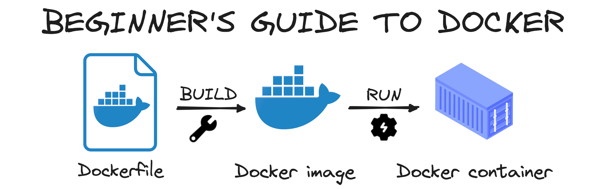
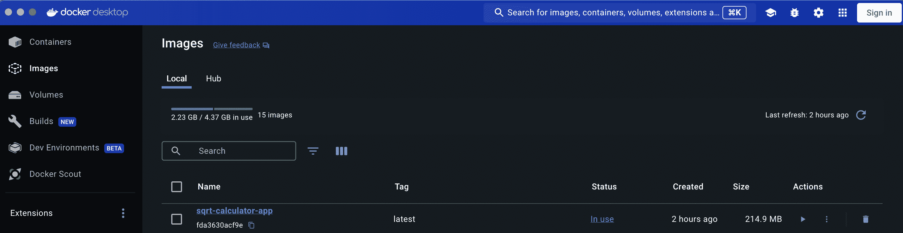

# **Docker 初学者终极指南**

> 原文：[`machinelearningmastery.com/the-ultimate-beginners-guide-to-docker/`](https://machinelearningmastery.com/the-ultimate-beginners-guide-to-docker/)


编辑器使用 Midjourney 创建的图片

当今的数字化环境从未如此多样化。每个人和公司选择自己喜欢的工具和操作系统，创造了一个多样化的技术系统。然而，这种多样性往往导致兼容性问题，使得在不同环境中确保应用程序性能变得困难。

在这里，Docker 作为应用程序开发和部署中不可或缺的工具发挥了关键作用。Docker 使我们能够将任何应用程序打包在一个容器中，构建所有依赖项，并将它们与主机操作系统隔离开来。这种隔离正是它最好的特性——它确保应用程序的一致性运行，无论部署在哪里。

这篇文章旨在成为 Docker 世界的初学者指南。让我们一起探索它吧。

## 为什么使用 Docker？

Docker 的优势在于其能够在任何硬件上一致地运行应用程序。通过将应用程序容器化，你创建了一个可移植且可重复的环境，可以在任何地方部署，从而消除了经典的“在我的机器上有效”问题。

要理解 Docker，有三个基本概念：



作者提供的图片

+   Docker 文件：这是一个包含一组构建镜像指令的脚本。

+   Docker 镜像：这是一个从 Docker 文件创建的用于运行应用程序的模板。它用于启动容器。

+   Docker 容器：Docker 镜像的一个运行实例。它是一个轻量级、独立且可执行的软件包，包含运行应用程序所需的一切。

简单来说，Dockerfile 定义了创建 Docker 镜像的步骤，Docker 镜像作为启动被称为容器的进程的模板。

很简单，对吧？

现在让我们学习如何在自己的应用程序中执行这个过程。

## 安装 Docker

要开始使用 Docker，你需要在机器上安装它。Docker 提供了不同操作系统的安装包，包括 Windows、macOS 和各种 Linux 发行版。

你可以按照 [Docker 网站上的安装指南来设置 Docker，安装起来非常简单。](https://www.docker.com/) 安装完成后，你的本地机器上将有 Docker Hub。

## Docker 基础

要将应用程序 Docker 化，我们总是从环境中的 Dockerfile 开始。这个文件描述了你的应用程序运行的环境以及构建它的步骤。

让我们假设我们有一个简单的应用程序，它首先要求用户输入一个数字，然后返回其平方值。我知道这个应用程序很简单，但它非常适合理解 Docker 的工作原理。

```py
import numpy as np

def calculate_square_root(number):
   return np.sqrt(number)

if __name__ == "__main__":
   number = float(input("Enter a number to calculate its square root: "))
   print(f"The square root of {number} is {calculate_square_root(number)}")
```

在设置此应用程序时，我们首先需要知道它运行在 Python 上。因此，无论我们将其部署到哪里，Python 必须是我们的基础镜像。

此外，这个应用程序还依赖于 NumPy。由于 NumPy 不是默认的 Python 库，我们需要确保它在应用程序运行时可用。总之，主要有两个依赖项：

1.  基础镜像：Python

1.  依赖项：NumPy

尽管不是必要的，但始终拥有一个包含脚本所需所有库的 requirements.txt 是一种良好的实践。在这种情况下，我们只需添加 numpy 库。

所以现在，让我们了解如何将这个脚本容器化：

## 步骤 1 – 定义 dockerfile

定义 Dockerfile 时，了解应用程序的结构很重要。通常，我会将 Dockerfile 放在与我的主脚本和 requirements.txt 文件相同的级别。然而，对于更复杂的应用程序，您可能需要将文件组织到不同的目录中。在这种情况下，指定 Dockerfile 中文件位置时，考虑这些目录级别是至关重要的。

```py
# Use the official Python image from the Docker Hub
FROM python:3.9-slim

# Set the working directory
WORKDIR /app

# Copy the requirements and main script into the container
COPY requirements.txt main.py ./

# Install the dependencies
RUN pip install --no-cache-dir -r requirements.txt

# Set the entry point to run the Python script
ENTRYPOINT ["python", "main.py"]
```

在这个 Dockerfile 中：

+   “FROM python:3.9-slim”：这一行指定了基础镜像，此处为 Python 3.9，Docker 从 Docker Hub 拉取它。

+   “ADD requirements.txt and main.py .”：此命令将 main.py 文件添加到容器中。

+   “RUN pip install requests”：这会在容器中安装 requests 库。

+   “ENTRYPOINT [“python”, “./main.py”]”：此命令运行应用程序。

Dockerfile 中的每一行代表一个层，为了优化处理，Docker 缓存那些未更改的层。这意味着为了利用这种缓存机制，最好将不常更改的层放在 Dockerfile 的开头。

这样，Docker 可以重用这些缓存层，加快构建过程。

现在我们已经有了 Dockerfile，我们需要运行本地 Docker hub 并进入第二步。

## 步骤 2 – 构建和运行 Docker 镜像

一旦你的 Dockerfile 准备好，你可以通过在终端中执行以下命令来构建和运行你的 Docker 镜像。

```py
docker build -t app-name .
```

在此命令中：

+   “-t my-python-app”：用名称 my-python-app 标记镜像。

+   “.”：表示当前目录作为构建上下文。

如果你检查你的 docker hub，一个新镜像将会在你在之前命令中使用的名称下出现。在我的例子中，我称它为 sqrt-calculator。



Docker Desktop 界面的截图

## 步骤 3 – 运行 Docker 容器

要运行刚刚创建的 Docker 镜像，请在终端中使用以下命令：

```py
docker run app-name
```

这个命令从 my-python-app 镜像启动一个容器并运行应用程序。尽管所需的库没有安装在你的本地环境中，但你仍然可以在 Docker 容器内执行代码，因为它包含了应用程序所需的所有依赖项。

## 简而言之

+   Docker 的作用和重要性：Docker 通过将应用程序容器化并确保在不同系统间的一致性能，解决了多样化技术环境中的兼容性问题。

+   核心组件：一个 Dockerfile 包含构建 Docker 镜像的指令，镜像作为运行容器的模板。容器是打包了运行应用程序所需一切的实例。

+   构建和运行容器：要使用 Docker，请创建一个 Dockerfile 来定义应用程序的环境和依赖项，使用 docker build -t app-name . 构建 Docker 镜像，并使用 docker run app-name 运行容器，从而使你的应用程序能够在不同的本地库安装环境中一致运行。

如果你想查看我的代码，你可以在[以下 GitHub 仓库中找到它。](https://github.com/rfeers/Articles/tree/main/Docker-beginner-guide)
