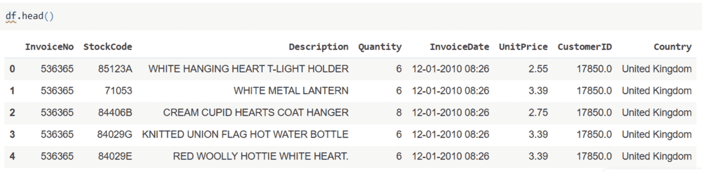
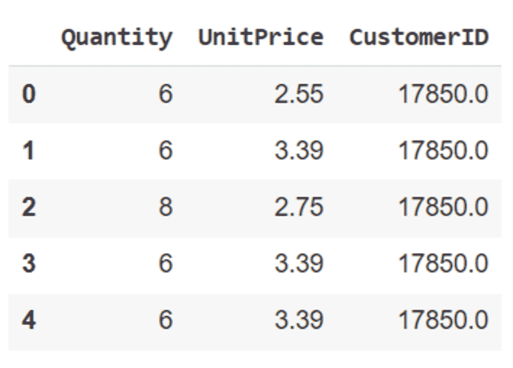
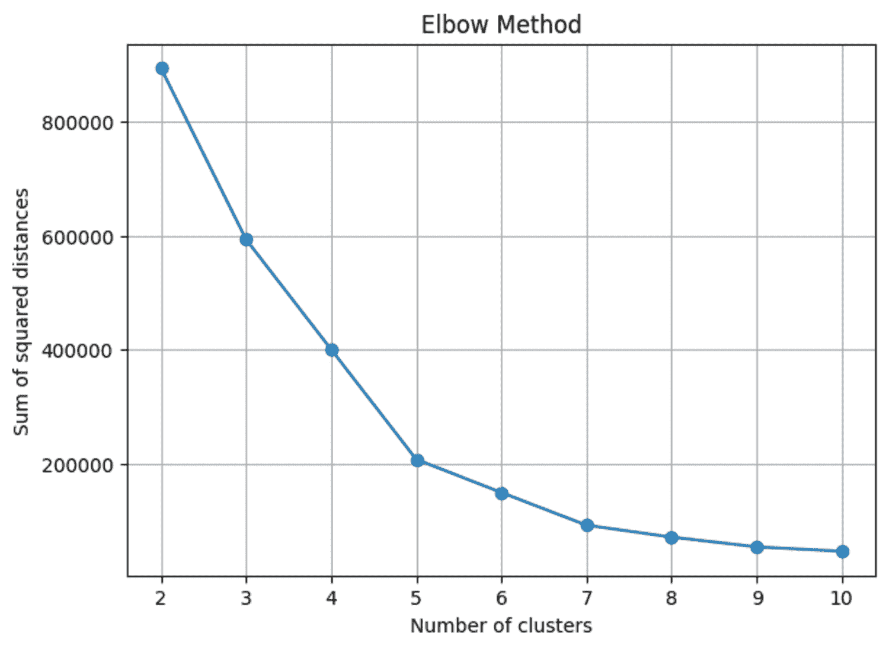
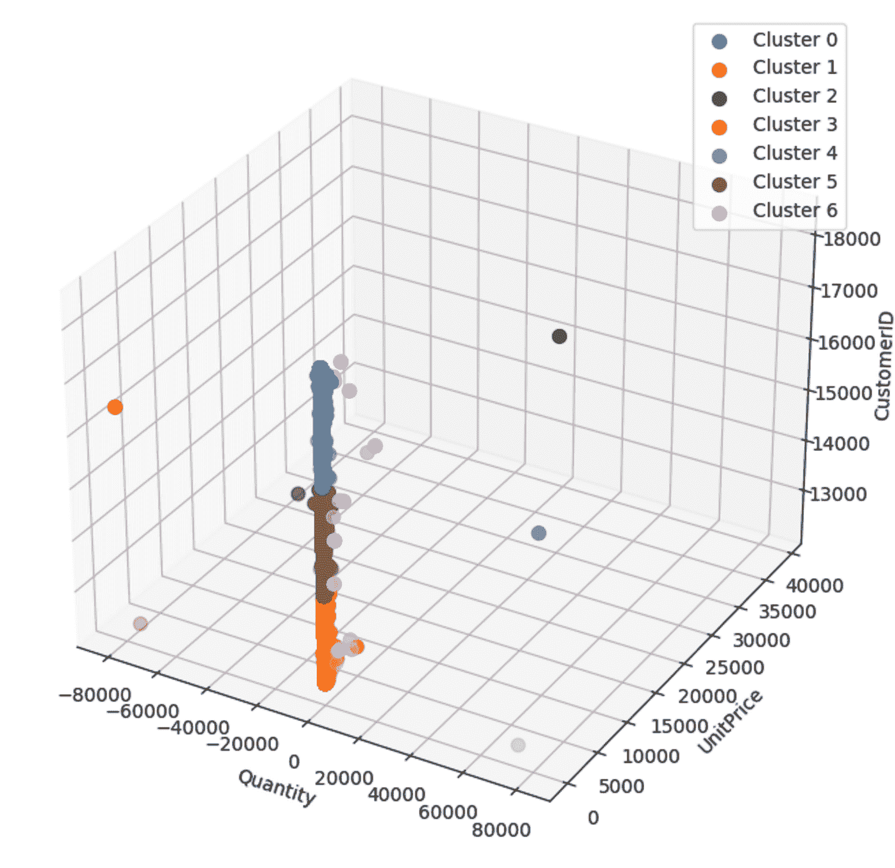

# 使用机器学习进行客户细分

> 原文：[`machinelearningmastery.com/using-machine-learning-in-customer-segmentation/`](https://machinelearningmastery.com/using-machine-learning-in-customer-segmentation/)


编辑 | Midjourney 提供的图片

过去，企业根据年龄或性别等简单标准对客户进行分组。现在，机器学习改变了这一过程。机器学习算法可以分析大量数据。在这篇文章中，我们将探讨机器学习如何改进客户细分。

## 客户细分简介

客户细分将客户划分为不同的组。这些组基于相似的特征或行为。主要目标是更好地理解每个组。这有助于企业制定适合每个组特定需求的营销策略和产品。

客户可以根据多个标准划分为不同的组：

1.  **人口统计学细分**：基于年龄、性别和职业等因素。

1.  **心理图像细分**：关注客户的生活方式和兴趣。

1.  **行为细分**：分析客户的行为，如品牌忠诚度和使用频率。

1.  **地理细分**：根据客户的地理位置进行划分。

客户细分为企业带来了几个优势：

+   **个性化营销**：企业可以向每个客户组发送特定的信息。

+   **改善客户留存**：组织可以识别客户的偏好并使其成为忠实客户。

+   **增强产品开发**：细分帮助了解客户希望得到哪些产品。

## 机器学习算法在客户细分中的应用

机器学习使用多种算法根据客户的特征进行分类。一些常用的算法包括：

1.  **K-means 聚类**：根据相似特征将客户划分为不同的簇。

1.  **层次聚类**：将客户组织成树状的簇层次结构。

1.  **DBSCAN**：根据数据空间中点的密度识别簇。

1.  **主成分分析（PCA）**：减少数据的维度并保留重要信息。

1.  **决策树**：根据一系列层次决策将客户划分。

1.  **神经网络**：通过互连的节点层学习数据中的复杂模式。

我们将使用 K-means 算法将客户细分为不同的组。

## 实施 K-means 聚类算法

K-means 聚类是一种无监督算法。它在没有任何预定义标签或训练示例的情况下运行。该算法用于将数据集中相似的数据点分组。目标是将数据分成若干个簇。每个簇包含相似的数据点。让我们看看这个算法如何工作。

1.  **初始化**：选择簇的数量（k）。随机初始化 k 个点作为质心。

1.  **任务**：将每个数据点分配到最近的质心，并形成簇。

1.  **更新质心**：计算分配给每个质心的所有数据点的均值。将质心移动到这个均值位置。

重复步骤 2 和 3 直到收敛。

在接下来的部分中，我们将实现 K 均值聚类算法，根据不同的特征将客户分组。

## 数据准备

让我们来探索客户数据集。我们的数据集大约有 500,000 个数据点。



客户数据集

删除了缺失值和重复项，并选择了三个特征（‘Quantity’，‘UnitPrice’，‘CustomerID’）用于聚类。

```py
import pandas as pd
from sklearn.preprocessing import StandardScaler

# Load the dataset (replace 'data.csv' with your actual file path)
df = pd.read_csv('userdata.csv')

# Data cleaning: remove duplicates and handle missing values
df = df.drop_duplicates()
df = df.dropna()

# Feature selection: selecting relevant features for clustering
selected_features = ['Quantity', 'UnitPrice', 'CustomerID']
X = df[selected_features]

# Normalization (standardization)
scaler = StandardScaler()
X_scaled = scaler.fit_transform(X)
```



预处理数据集

## 超参数调整

K 均值聚类中的一个挑战是找出最佳的簇数量。肘部法则可以帮助我们做到这一点。它绘制了每个点到其分配的簇质心的平方距离之和（惯性）与 K 的关系图。寻找惯性随着 K 的增加不再显著减少的点。这个点被称为聚类模型的肘部。它建议了一个合适的 K 值。

```py
# Determine the optimal number of clusters using the Elbow Method
def determine_optimal_clusters(X_scaled, max_clusters=10):
    distances = []

    for n in range(2, max_clusters+1):
        kmeans = KMeans(n_clusters=n, random_state=42)
        kmeans.fit(X_scaled)
        distances.append(kmeans.inertia_)

    plt.figure(figsize=(7, 5))
    plt.plot(range(2, max_clusters+1), distances, marker='o')
    plt.title('Elbow Method')
    plt.xlabel('Number of clusters')
    plt.ylabel('Sum of squared distances')
    plt.xticks(range(2, max_clusters+1))
    plt.grid(True)
    plt.show()

    return distances

distances = determine_optimal_clusters(X_scaled)
```

我们可以使用上述代码生成惯性与簇数量的图。



肘部法则

在 K=1 时，惯性达到最高。从 K=1 到 K=5，惯性急剧下降。K=5 到 K=7 之间，曲线逐渐下降。最后，在 K=7 时，它变得稳定，因此 K 的最佳值是 7\。

## 可视化细分结果

让我们实现 K 均值聚类算法并可视化结果。

```py
# Apply K-means clustering with the chosen number of clusters
chosen_clusters = 7  
kmeans = KMeans(n_clusters=chosen_clusters, random_state=42)
kmeans.fit(X_scaled)

# Get cluster labels
cluster_labels = kmeans.labels_

# Add the cluster labels to the original dataframe
df['Cluster'] = cluster_labels

# Visualize the clusters in 3D
fig = plt.figure(figsize=(12, 8))
ax = fig.add_subplot(111, projection='3d')

# Scatter plot for each cluster
for cluster in range(chosen_clusters):
    cluster_data = df[df['Cluster'] == cluster]
    ax.scatter(cluster_data['Quantity'], cluster_data['UnitPrice'], cluster_data['CustomerID'],
               label=f'Cluster {cluster}', s=50)

ax.set_xlabel('Quantity')
ax.set_ylabel('UnitPrice')
ax.set_zlabel('CustomerID')

# Add a legend
ax.legend()
plt.show()
```



散点图

3D 散点图根据‘Quantity’，‘UnitPrice’和‘CustomerID’可视化了簇。每个簇通过颜色区分，并相应地标记。

## 结论

我们讨论了使用机器学习进行客户细分及其好处。此外，我们展示了如何实现 K 均值算法将客户细分为不同的组。首先，我们使用肘部法则找到了适合的簇数量。然后，我们实现了 K 均值算法，并使用散点图可视化结果。通过这些步骤，公司可以高效地将客户分组。
