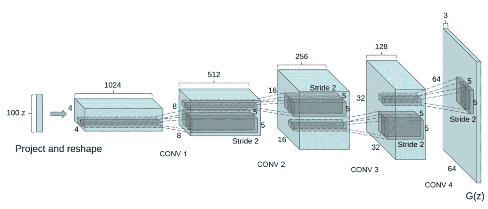

# 训练稳定生成对抗网络的技巧

> 原文：<https://machinelearningmastery.com/how-to-train-stable-generative-adversarial-networks/>

最后更新于 2019 年 9 月 12 日

#### 训练稳定的生成对抗网络需要了解的经验启发、技巧和诀窍。

[生成对抗网络](https://machinelearningmastery.com/what-are-generative-adversarial-networks-gans/)，简称 GANs，是一种使用深度学习方法(如深度卷积神经网络)进行生成性建模的方法。

虽然 GANs 产生的结果可能是显著的，但是训练一个稳定的模型可能是具有挑战性的。原因是训练过程本身就不稳定，导致两个竞品模型同时动态训练。

然而，给定大量的经验尝试和错误，但是许多实践者和研究人员，已经发现并报告了少量的模型架构和训练配置，其导致稳定 GAN 模型的可靠训练。

在这篇文章中，你将发现稳定的一般对抗性网络模型的配置和训练的经验启发。

看完这篇文章，你会知道:

*   GANs 中生成器和鉴别器模型的同时训练本质上是不稳定的。
*   来之不易的经验发现的配置为大多数 GAN 应用提供了一个坚实的起点。
*   GANs 的稳定训练仍然是一个悬而未决的问题，已经提出了许多其他经验发现的技巧和诀窍，可以立即采用。

**用我的新书[Python 生成对抗网络](https://machinelearningmastery.com/generative_adversarial_networks/)启动你的项目**，包括*分步教程*和所有示例的 *Python 源代码*文件。

我们开始吧。

如何训练稳定的生成对抗网络
[克里斯·斯特恩-约翰逊](https://www.flickr.com/photos/ceejayoz/22181933/)摄，版权所有。

## 概观

本教程分为三个部分；它们是:

1.  培训 GANs 的挑战
2.  深度卷积 GAN
3.  其他提示和技巧

## 生成对抗网络训练的挑战

GANs 很难训练。

它们难以训练的原因是生成器模型和鉴别器模型都是在一个游戏中同时训练的。这意味着一个模型的改进是以另一个模型为代价的。

训练两个模型的目标包括在两个相互竞争的关注点之间找到平衡点。

> 训练 GANs 在于找到两人非合作博弈的纳什均衡。[……]不幸的是，找到纳什均衡是一个非常困难的问题。算法存在于专门的情况下，但我们不知道有任何可行的应用于 GAN 游戏，其中成本函数是非凸的，参数是连续的，并且参数空间是极其高维的

——[训练 GANs 的改进技术](https://arxiv.org/abs/1606.03498)，2016 年。

这也意味着，每次更新其中一个模型的参数时，正在解决的优化问题的性质都会发生变化。

这具有创建动态系统的效果。

> 但是有了 GAN，下山的每一步都会稍微改变整个景观。这是一个动态系统，其中优化过程不是寻求最小值，而是两个力之间的平衡。

—第 306 页，[Python 深度学习](https://amzn.to/2U2bHuP)，2017。

用神经网络术语来说，同时训练两个竞争神经网络的技术挑战是它们可能无法收敛。

> 研究人员应该努力解决的 GANs 面临的最大问题是不收敛问题。

——[NIPS 2016 教程:生成对抗网络](https://arxiv.org/abs/1701.00160)，2016。

GANs 可能会遭受少量故障模式中的一种，而不是收敛。

一种常见的故障模式是，发电机不是找到平衡点，而是在域中生成特定示例之间振荡。

> 在实践中，GANs 似乎经常振荡，这意味着它们从产生一种样本发展到产生另一种样本，但最终没有达到平衡。

——[NIPS 2016 教程:生成对抗网络](https://arxiv.org/abs/1701.00160)，2016。

也许最具挑战性的模型故障是发电机的多个输入导致产生相同输出的情况。

这被称为“T0”模式崩溃，可能是训练 GANs 时最具挑战性的问题之一。

> 模式崩溃，也称为场景，是发生在生成器学习将几个不同的输入 z 值映射到同一个输出点时的问题。

——[NIPS 2016 教程:生成对抗网络](https://arxiv.org/abs/1701.00160)，2016。

最后，没有好的客观标准来评估一个 GAN 在训练中是否表现良好。审查损失是不够的。

相反，最好的方法是直观地检查生成的示例，并使用主观评估。

> 生成对抗网络缺乏目标函数，使得不同模型的表现难以比较。一个直观的表现度量可以通过让人类注释者判断样本的视觉质量来获得。

——[训练 GANs 的改进技术](https://arxiv.org/abs/1606.03498)，2016 年。

在撰写本文时，关于如何设计和训练 GAN 模型，还没有很好的理论基础，但是已经有了启发式的既定文献，或者“T0”黑客，它们已经被经验证明在实践中运行良好。

## 深度卷积生成对抗网络

在设计和训练稳定的 GAN 模型方面，最重要的一步可能是亚历克·拉德福德等人在 2015 年发表的论文，题为“利用深度卷积生成对抗网络的[无监督表示学习](https://arxiv.org/abs/1511.06434)”

在论文中，他们描述了深度卷积 GAN，或 DCGAN，这种 GAN 开发方法已经成为事实上的标准。

> GAN 学习的稳定性仍然是一个开放的问题。幸运的是，当仔细选择模型架构和超参数时，GAN 学习表现良好。拉德福德等人(2015 年)精心制作了一个深度卷积 GAN(DCGAN)，表现非常好的图像合成任务…

—第 701 页，[深度学习](https://amzn.to/2YuwVjL)，2016。

DCGAN 的生成器模型架构示例。
摘自《深度卷积生成对抗网络的无监督表示学习》，2015 年。

本文中的发现来之不易，是在对不同的模型架构、配置和训练方案进行大量的经验试错后得出的。他们的方法仍然被强烈推荐作为开发新 GANs 的起点，至少对于基于图像合成的任务是如此。

> …经过广泛的模型探索，我们确定了一系列架构，这些架构能够在一系列数据集上实现稳定的训练，并允许训练更高分辨率和更深层的生成模型。

——[深度卷积生成对抗网络的无监督表示学习](https://arxiv.org/abs/1511.06434)，2015

下面提供了论文中 GAN 架构建议的摘要。

训练稳定的深度卷积生成对抗网络的体系结构指南概要。
摘自《深度卷积生成对抗网络的无监督表示学习》，2015 年。

让我们仔细看看。

### 1.使用条纹卷积

在卷积神经网络中，通常使用池化层(如最大池化层)进行下采样。

在 GANs 中，建议不要使用池层，而是使用卷积层中的步长在鉴别器模型中执行下采样。

类似地，分数步幅(反卷积层)可用于发生器的上采样。

> [替换]具有交错卷积的确定性空间池功能(如最大池),允许网络学习自己的空间下采样。我们在生成器中使用这种方法，允许它学习自己的空间上采样和鉴别器。

——[深度卷积生成对抗网络的无监督表示学习](https://arxiv.org/abs/1511.06434)，2015

### 2.移除完全连接的层

通常在卷积层的特征提取层之后使用全连接层，作为模型输出层之前提取特征的解释。

相反，在 GANs 中，不使用全连接层，在鉴别器中，卷积层被展平并直接传递到输出层。

此外，传递到生成器模型的随机高斯输入向量被直接整形为多维张量，该多维张量可以被传递到第一卷积层以准备放大。

> GAN 的第一层以均匀的噪声分布 Z 作为输入，可以称为完全连接，因为它只是一个矩阵乘法，但结果被重新整形为 4 维张量，并用作卷积堆栈的开始。对于鉴频器，最后一个卷积层被平坦化，然后馈入单个 sigmoid 输出。

——[深度卷积生成对抗网络的无监督表示学习](https://arxiv.org/abs/1511.06434)，2015

### 3.使用批处理规范化

[批量标准化](https://machinelearningmastery.com/how-to-accelerate-learning-of-deep-neural-networks-with-batch-normalization/)标准化前一层的激活，使其均值和单位方差为零。这具有稳定训练过程的效果。

批量归一化已经成为训练深度卷积神经网络时的一项主要任务，GANs 也不例外。除了发生器的输出和鉴别器的输入之外，鉴别器和发生器模型都推荐使用批量范数层。

> 然而，将 batchnorm 直接应用于所有层会导致样本振荡和模型不稳定。这是通过不对生成器输出层和鉴别器输入层应用 batchnorm 来避免的。

——[深度卷积生成对抗网络的无监督表示学习](https://arxiv.org/abs/1511.06434)，2015。

### 4.使用继电器，leaky relu，和 Tanh

激活函数如 [ReLU](https://machinelearningmastery.com/how-to-fix-vanishing-gradients-using-the-rectified-linear-activation-function/) 用于解决深度卷积神经网络中的梯度消失问题，并促进稀疏激活(如大量零值)。

建议生成器使用 ReLU，但鉴别器模型不建议使用。相反，允许小于零的值的 ReLU 的变体，称为泄漏 ReLU，在鉴别器中是优选的。

> 除了使用 Tanh 函数的输出层之外，ReLU 激活在生成器中使用。[……]在鉴别器中，我们发现泄漏整流激活工作良好…

——[深度卷积生成对抗网络的无监督表示学习](https://arxiv.org/abs/1511.06434)，2015。

此外，发生器在输出层使用双曲正切(tanh)激活函数，发生器和鉴别器的输入被缩放到范围[-1，1]。

> 除了缩放到 tanh 激活函数[-1，1]的范围之外，没有对训练图像进行预处理。

——[深度卷积生成对抗网络的无监督表示学习](https://arxiv.org/abs/1511.06434)，2015

模型权重被初始化为小的[高斯随机值](https://machinelearningmastery.com/how-to-generate-random-numbers-in-python/)，鉴别器中漏 ReLU 的斜率被初始化为 0.2。

> 所有权重都是从标准偏差为 0.02 的以零为中心的正态分布初始化的。在泄漏率中，所有模型中的泄漏斜率都设置为 0.2。

——[深度卷积生成对抗网络的无监督表示学习](https://arxiv.org/abs/1511.06434)，2015。

### 5.使用亚当优化

生成器和鉴别器都是用随机梯度下降训练的，具有 128 幅图像的适度批量。

> 所有模型都用小批量随机梯度下降(SGD)训练，小批量大小为 128

——[深度卷积生成对抗网络的无监督表示学习](https://arxiv.org/abs/1511.06434)，2015。

具体来说， [Adam 版随机梯度下降](https://machinelearningmastery.com/adam-optimization-algorithm-for-deep-learning/)用于训练学习率为 0.0002、动量(β1)为 0.5 的模型。

> 我们将 Adam 优化器用于调整后的超参数。我们发现建议的学习率 0.001 太高了，用 0.0002 代替。此外，我们发现将动量项β1 保留在建议值 0.9 会导致训练振荡和不稳定性，而将其降低到 0.5 有助于稳定训练。

——[深度卷积生成对抗网络的无监督表示学习](https://arxiv.org/abs/1511.06434)，2015。

## 其他提示和技巧

DCGAN 论文为配置和训练生成器和鉴别器模型提供了一个很好的起点。

此外，已经编写了大量的回顾演示和论文来总结这些以及配置和培训 GANs 的其他启发。

在本节中，我们将研究其中的一些，并强调一些需要考虑的额外提示和技巧。

来自 OpenAI 的 Tim Salimans 等人在 2016 年发表的题为“训练 GANs 的[改进技术”](https://arxiv.org/abs/1606.03498)的论文中列出了五种被认为在训练 GANs 时可以提高收敛性的技术。

它们是:

*   **特征匹配**。使用半监督学习开发一个 GAN。
*   **迷你批次判别**。在一个小批次中开发多个样品的特性。
*   **历史平均**。更新损失函数以纳入历史记录。
*   **单面标签平滑**。将鉴别器的目标值从 1.0 缩小。
*   **虚拟批量归一化**。使用真实图像的参考批次计算批次定额统计。

在 2016 年 NIPS 会议上关于 GANs 的教程中，伊恩·古德费勒详细阐述了其中一些更成功的建议，这些建议写在随附的题为《[教程:生成对抗网络](https://arxiv.org/abs/1701.00160)》的论文中具体来说，第四部分标题为“*提示和技巧*”，其中描述了四种技巧。

它们是:

**1。带标签的火车。**在 GANs 中使用标签可以提高图像质量。

> 以任何方式、形状或形式使用标签几乎总是会显著提高模型生成的样本的主观质量。

——[NIPS 2016 教程:生成对抗网络](https://arxiv.org/abs/1701.00160)，2016。

**2。单面标签平滑**。在鉴别器中使用真实例子的目标值为 0.9 或随机范围的目标会产生更好的结果。

> 单侧标签平滑的思想是将真实示例的目标替换为略小于 1 的值，例如. 9【…】。这防止了鉴别器中的极端外推行为…

——[NIPS 2016 教程:生成对抗网络](https://arxiv.org/abs/1701.00160)，2016。

**3。虚拟批量归一化**。对真实图像或具有一个生成图像的真实图像计算批量统计更好。

> ……可以改为使用虚拟批处理规范化，其中每个示例的规范化统计数据是使用该示例和参考批处理的并集来计算的

——[NIPS 2016 教程:生成对抗网络](https://arxiv.org/abs/1701.00160)，2016。

**4。一个人能平衡 G 和 D 吗？**基于损耗的相对变化在发生器或鉴别器中安排或多或少的训练是直观的，但不可靠。

> 实际上，鉴别器通常更深，有时每层比发生器有更多的过滤器。

——[NIPS 2016 教程:生成对抗网络](https://arxiv.org/abs/1701.00160)，2016。

[DCGAN 论文的合著者之一 sousmith Chintala](https://www.linkedin.com/in/soumith/)在 NIPS 2016 上做了题为“如何训练 GAN？”总结了许多技巧和诀窍。

该视频可在 YouTube 上获得，强烈推荐。这些技巧的总结也可以作为 GitHub 资源库获得，标题为“如何训练 GAN？让 GANs 发挥作用的提示和技巧。”

*   [苏史密斯·钦塔拉，如何训练一个 GAN，NIPS 2016 对抗训练研讨会](https://www.youtube.com/watch?v=X1mUN6dD8uE)。

<iframe loading="lazy" title="NIPS 2016 Workshop on Adversarial Training - Soumith Chintala - How to train a GAN" width="500" height="281" src="about:blank" frameborder="0" allow="accelerometer; autoplay; encrypted-media; gyroscope; picture-in-picture" allowfullscreen="" data-rocket-lazyload="fitvidscompatible" data-lazy-src="https://www.youtube.com/embed/X1mUN6dD8uE?feature=oembed"><iframe title="NIPS 2016 Workshop on Adversarial Training - Soumith Chintala - How to train a GAN" width="500" height="281" src="https://www.youtube.com/embed/X1mUN6dD8uE?feature=oembed" frameborder="0" allow="accelerometer; autoplay; encrypted-media; gyroscope; picture-in-picture" allowfullscreen=""/>
 
 
这些提示借鉴了 DCGAN 论文以及其他地方的建议。
 
下面提供了一些更可行的提示的摘要。
 <ul> <li>将输入标准化至范围[-1，1]，并在发电机输出中使用 tanh。</li> <li>训练发电机时，翻转标签和损耗函数。</li> <li>采样高斯随机数作为生成器的输入。</li> <li>使用全真或全假的小批量来计算批量定额统计。</li> <li>在发生器和鉴别器中使用泄漏 ReLU。</li> <li>使用平均池和步长进行下采样；使用转换 2D 和步幅进行上采样。</li> <li>在鉴别器中使用标签平滑，随机噪声小。</li> <li>向鉴别器中的标签添加随机噪声。</li> <li>使用 DCGAN 架构，除非你有很好的理由不这样做。</li> <li>鉴别器损失 0.0 是一种故障模式。</li> <li>如果发生器的损耗稳步下降，很可能会用垃圾图像欺骗鉴别器。</li> <li>使用标签，如果你有。</li> <li>向鉴频器的输入添加噪声，并随时间衰减噪声。</li> <li>在培训和生成期间使用 50%的丢弃率。</li> </ul> 
最后，关于 Keras 的《Python 深度学习》一书提供了许多实用技巧，供您在培训 GANs 时参考，主要基于 DCAN 论文中的建议。
 
一个额外的提示建议在生成器模型中使用可被步长整除的内核大小，以避免所谓的“<em>棋盘</em>”假象(<a href="https://en.wikipedia.org/wiki/Artifact_(error)">错误</a>)。
 <blockquote>
…通常会看到由生成器中像素空间的不均匀覆盖引起的棋盘状伪像。为了解决这个问题，每当我们在生成器和鉴别器中使用跨步的 Conv2DTranpose 或 Conv2D 时，我们都使用一个可被跨步大小整除的内核大小。
</blockquote> 
—第 308 页，<a href="https://amzn.to/2U2bHuP">Python 深度学习</a>，2017。
 
这与 2016 年关于蒸馏的文章<a href="https://distill.pub/2016/deconv-checkerboard/">反卷积和棋盘伪影</a>中提供的建议相同
 <h2>进一步阅读</h2> 
如果您想更深入地了解这个主题，本节将提供更多资源。
 <h3>书</h3> <ul> <li>第二十章。深度生成模型，<a href="https://amzn.to/2YuwVjL">深度学习</a>，2016。</li> <li>第八章。生成式深度学习，<a href="https://amzn.to/2U2bHuP">Python 深度学习</a>，2017。</li> </ul> <h3>报纸</h3> <ul> <li><a href="https://arxiv.org/abs/1406.2661">生成对抗网络</a>，2014。</li> <li><a href="https://arxiv.org/abs/1701.00160">教程:生成对抗网络，NIPS </a>，2016。</li> <li><a href="https://arxiv.org/abs/1511.06434">深度卷积生成对抗网络的无监督表示学习</a>，2015</li> <li><a href="https://arxiv.org/abs/1606.03498">训练 GANs 的改进技术</a>，2016。</li> </ul> <h3>文章</h3> <ul> <li><a href="https://github.com/soumith/ganhacks">如何训练一个 GAN？让 GANs 发挥作用的提示和技巧</a></li> <li><a href="https://distill.pub/2016/deconv-checkerboard/">反卷积和棋盘格伪影</a>，2016。</li> </ul> <h3>录像</h3> <ul> <li><a href="https://www.youtube.com/watch?v=9JpdAg6uMXs"> Ian Goodfellow，GANs 入门，NIPS 2016 </a>。</li> <li><a href="https://www.youtube.com/watch?v=X1mUN6dD8uE">苏史密斯·钦塔拉，如何训练一个 GAN，NIPS 2016 对抗训练研讨会</a>。</li> </ul> <h2>摘要</h2> 
在这篇文章中，你发现了配置和训练稳定的一般对抗性网络模型的经验启发法。
 
具体来说，您了解到:
 <ul> <li>GANs 中生成器和鉴别器模型的同时训练本质上是不稳定的。</li> <li>来之不易的经验发现的配置为大多数 GAN 应用提供了一个坚实的起点。</li> <li>GANs 的稳定训练仍然是一个悬而未决的问题，已经提出了许多其他经验发现的技巧和诀窍，可以立即采用。</li> </ul> 
你有什么问题吗？ 在下面的评论中提问，我会尽力回答。
 
 </body></html></iframe>