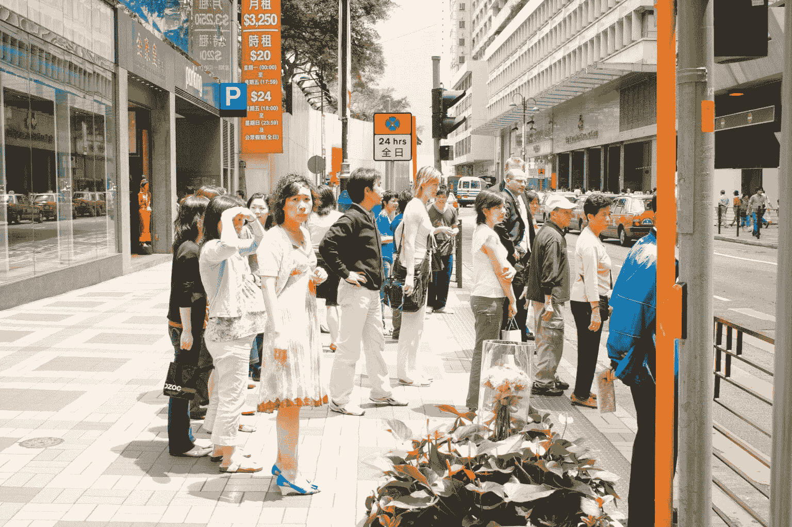
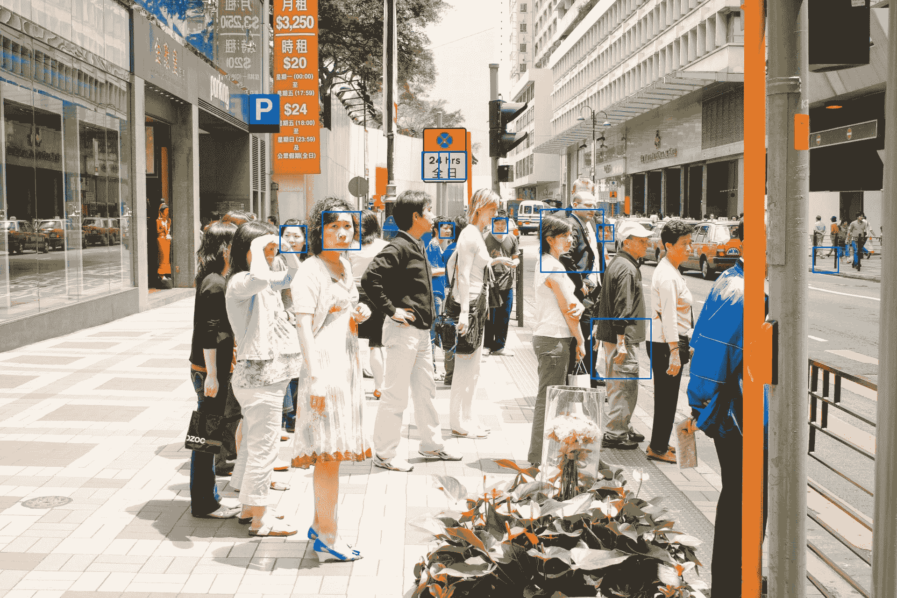

# 使用 Haar 级联进行对象检测

> 译文：[`machinelearningmastery.com/using-haar-cascade-for-object-detection/`](https://machinelearningmastery.com/using-haar-cascade-for-object-detection/)

在深度学习革命重新定义计算机视觉之前，Haar 特征和 Haar 级联是你必须了解的对象检测工具。即便在今天，它们仍然是非常有用的对象检测器，因为它们轻量化。在这篇文章中，你将了解 Haar 级联及其如何检测物体。完成本篇文章后，你将会知道：

+   什么是 Haar 特征

+   Haar 级联如何利用 Haar 特征来检测物体

+   OpenCV 中的一些预定义 Haar 级联对象检测器

**启动你的项目**，请参考我的书籍[《OpenCV 中的机器学习》](https://machinelearning.samcart.com/products/machine-learning-opencv/)。它提供了**自学教程**和**工作代码**。

让我们开始吧！[](../Images/404249c392c97438aa42b0feed32889f.png)

使用 Haar 级联进行对象检测

图片由[亚历山大·希普](https://unsplash.com/photos/time-lapse-photo-of-waterfalls-5tIuYKRRHj8)提供。保留部分权利。

## 概述

本教程分为两个部分，它们是：

+   什么是 Haar 特征和 Haar 级联？

+   OpenCV 中的 Haar 级联

## 什么是 Haar 特征和 Haar 级联？

自 2001 年保罗·维奥拉和迈克尔·琼斯开发了这一技术以来，Haar 特征和 Haar 级联已经彻底改变了对象检测。它们已成为各种应用中的重要组成部分，从面部识别到实时对象检测。

Haar 特征从图像中的矩形区域提取。特征值基于像素强度。通常，它是通过滑动窗口计算的，窗口中的区域被划分为两个或更多矩形区域。Haar 特征是这些区域之间像素强度总和的差异。

认为物体的存在会扭曲像素强度的变化。例如，背景通常是均匀的模式，而前景物体将不适合这种背景。通过检查相邻矩形区域之间的像素强度，应该能注意到差异。因此，它表明了物体的存在。

为了提高计算效率，Haar 特征中的矩形区域通常与图像的边缘平行，而不是倾斜的。然而，我们可以使用多种尺寸和形状的矩形来捕捉物体的不同特征和尺度变化。因此，Haar 特征的关键优势在于它们能够表示三种模式：

1.  **边缘**：由于我们如何定向矩形区域而呈现的垂直或水平边缘。它们对于识别不同图像区域之间的边界非常有用。

1.  **线条**：图像中的对角边缘。它们对于识别物体中的线条和轮廓非常有用。

1.  **中心环绕特征**：这检测矩形区域中心与周围区域之间的强度变化。这对于识别具有明显形状或模式的对象很有用。

Haar 级联通过层次结构组合多个 Haar 特征来构建分类器。级联将检测过程分解为多个阶段，每个阶段包含一组特征，而不是用每个 Haar 特征分析整个图像。

Haar 级联的关键思想是，整个图像中只有少量像素与关注的对象相关。因此，尽快丢弃图像中无关的部分至关重要。在检测过程中，Haar 级联以不同的尺度和位置扫描图像，以消除无关区域。使用 AdaBoost 算法训练的级联结构实现了高效的分层特征评估，减少了计算负担并加快了检测速度。

## OpenCV 中的 Haar Cascade

Haar 级联是一种算法，但首先，你需要训练一个 Haar 级联分类器，然后才能将其用作对象检测器。

在 OpenCV 中，以下是预训练的 Haar 级联分类器（你可以从 [`github.com/opencv/opencv/tree/4.x/data/haarcascades`](https://github.com/opencv/opencv/tree/4.x/data/haarcascades) 下载模型文件）：

+   人脸

+   眼睛检测

+   人体的全身、上半身或下半身

+   车辆牌照

预训练分类器以 XML 文件的形式存储。你可以从 [GitHub 链接](https://github.com/opencv/opencv/tree/4.x/data/haarcascades) 找到内置分类器的文件名。要创建分类器，你必须提供此 XML 文件的路径。如果你使用的是 OpenCV 自带的分类器，可以使用以下语法：

```py
# Load the Haar cascade for face detection
face_cascade = cv2.CascadeClassifier(cv2.data.haarcascades + 'haarcascade_frontalface_default.xml')
```

通常，照片有多个颜色通道（如红色、绿色和蓝色）。Haar 级联仅依赖于像素强度。因此，你应该提供单通道图像，如灰度图像。

### 想要开始使用 OpenCV 进行机器学习吗？

现在就参加我的免费电子邮件速成课程（含示例代码）。

点击注册并获得免费的 PDF 电子书版本课程。

使用 Haar 级联分类器来检测对象就是使用 `detectMultiScale()` 方法。它接受以下参数：

1.  `image`：这是你想要进行对象检测的输入图像。它应该是灰度格式，或者对于 HSV 通道格式的图像是“V”通道。

1.  `scaleFactor`：此参数弥补了不同距离的对象在摄像头中出现不同尺寸的事实。它控制每个图像尺度下图像大小的缩小程度。它必须严格大于 1\. 较低的 `scaleFactor` 增加检测时间，但也增加了检测的可能性。典型值范围从 1.01 到 1.3。

1.  `minNeighbors`：这个参数指定了每个候选对象应拥有多少个邻居以保留它。较高的值会导致检测到的对象较少，但质量较高。较低的值可能会导致更多的检测结果，但可能会有误检。这是精准度与召回率之间的权衡。

1.  `minSize`：这个参数设置了对象的最小尺寸。小于此尺寸的对象将被忽略。它是一个形式为`(width, height)`的元组。

让我们通过一个例子来试试。你可以在以下网址下载一张街景照片：

+   [`unsplash.com/photos/people-walking-on-sidewalk-during-daytime-GBkAx9qUeus`](https://unsplash.com/photos/people-walking-on-sidewalk-during-daytime-GBkAx9qUeus)



一张用于面部检测的 Haar 级联照片。

照片由[JACQUELINE BRANDWAYN](https://unsplash.com/photos/people-walking-on-sidewalk-during-daytime-GBkAx9qUeus)提供。保留部分权利。

本示例使用了分辨率为 1920×1080 的中等尺寸。如果你的分辨率不同，你可能需要特别调整`detectMultiScale()`中的参数，尤其是`minSize`。

让我们创建一个面部检测器，并找到行人面部的位置。分类器是使用与 OpenCV 一起提供的预训练模型`haarcascade_frontalface_default.xml`创建的。模型文件位于`cv2.data.haarcascades`指向的路径中。然后我们可以用它来将面部检测为边界框：

```py
face_cascade = cv2.CascadeClassifier(cv2.data.haarcascades + 'haarcascade_frontalface_default.xml')
faces = face_cascade.detectMultiScale(gray, scaleFactor=1.1, minNeighbors=4, minSize=(20, 20))
```

随意调整你的参数。为了说明结果，你可以使用 OpenCV 的函数在**原始**图像上绘制。

```py
for (x, y, w, h) in faces:
    cv2.rectangle(img, (x, y), (x+w, y+h), (255, 0, 0), 2)
```

请注意，`cv2.rectangle()`函数要求提供矩形框对角线的坐标，而`detectMultiScale()`的输出提供的是左上角的坐标以及宽度和高度。上述函数在每个检测到的面部上绘制了两像素宽的蓝色框。请注意，在 OpenCV 中，图像以 BGR 通道顺序呈现。因此，像素颜色`(255, 0, 0)`代表蓝色。

结果如下：



Haar 级联检测到的面部

你可以看到有一些误检，但总体来说，结果还是相当不错的。你可以调整上述参数，查看结果的变化。使用 Haar 级联的对象检测器的质量取决于它训练得如何，以生成你从 XML 文件中读取的模型。

完整代码如下：

```py
import cv2
import sys

# Photo https://unsplash.com/photos/people-walking-on-sidewalk-during-daytime-GBkAx9qUeus
# Jacqueline Brandwayn

filename = 'jacqueline-brandwayn-GBkAx9qUeus-unsplash.jpg'
#filename = 'people2.jpg'

# Load the Haar cascade for face detection
face_cascade = cv2.CascadeClassifier(cv2.data.haarcascades + 'haarcascade_frontalface_default.xml')

# Read the input image
img = cv2.imread(filename)

# Convert the image to grayscale
gray = cv2.cvtColor(img, cv2.COLOR_BGR2GRAY)

# Perform face detection
faces = face_cascade.detectMultiScale(gray, scaleFactor=1.1, minNeighbors=4, minSize=(20, 20))

# Draw rectangles around the detected faces
for (x, y, w, h) in faces:
    cv2.rectangle(img, (x, y), (x+w, y+h), (255, 0, 0), 2)

# Display the result
cv2.imshow('Face Detection', img)
cv2.waitKey(0)
cv2.destroyAllWindows()
```

## 进一步阅读

本节提供了更多相关资源，供你深入了解。

#### 书籍

+   [精通 OpenCV 4 与 Python](https://www.amazon.com/Mastering-OpenCV-Python-practical-processing/dp/1789344913)，2019。

+   [数字图像处理](https://www.amazon.com/Digital-Image-Processing-Rafael-Gonzalez/dp/0133356728)，2017

#### 论文

+   Paul Viola 和 Michael J. Jones. [稳健的实时人脸检测](https://www.cs.cmu.edu/~efros/courses/LBMV07/Papers/viola-cvpr-01.pdf)。《计算机视觉国际期刊》，57(2):137–154，2004 年。

+   Rainer Lienhart 和 Jochen Maydt. 一组扩展的 Haar-like 特征用于快速对象检测。见于《国际图像处理会议论文集》，2002 年，第 1 卷，第 1-900 页。IEEE，2002 年。

#### 网站

+   维基百科上的 Haar 特征：[`en.wikipedia.org/wiki/Haar-like_feature`](https://en.wikipedia.org/wiki/Haar-like_feature)

+   OpenCV，[`opencv.org/`](https://opencv.org/)

+   OpenCV Cascade Classifier，[`docs.opencv.org/4.x/db/d28/tutorial_cascade_classifier.html`](https://docs.opencv.org/4.x/db/d28/tutorial_cascade_classifier.html)

## 总结

在本教程中，你学习了如何使用 OpenCV 的 Haar 级联分类器。

具体来说，你学到了：

+   什么是 Haar 特征和 Haar 级联，它如何识别对象

+   如何使用内置的 Haar 级联分类器通过 OpenCV 检测照片中的对象
