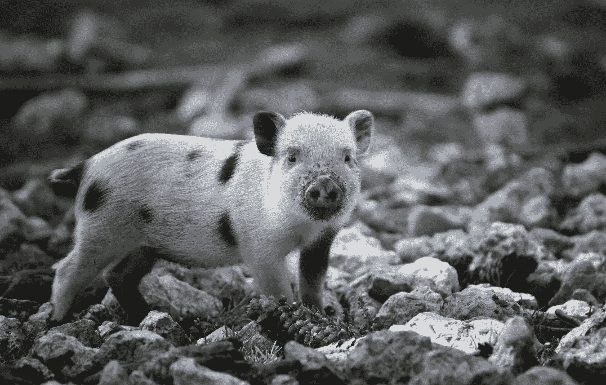
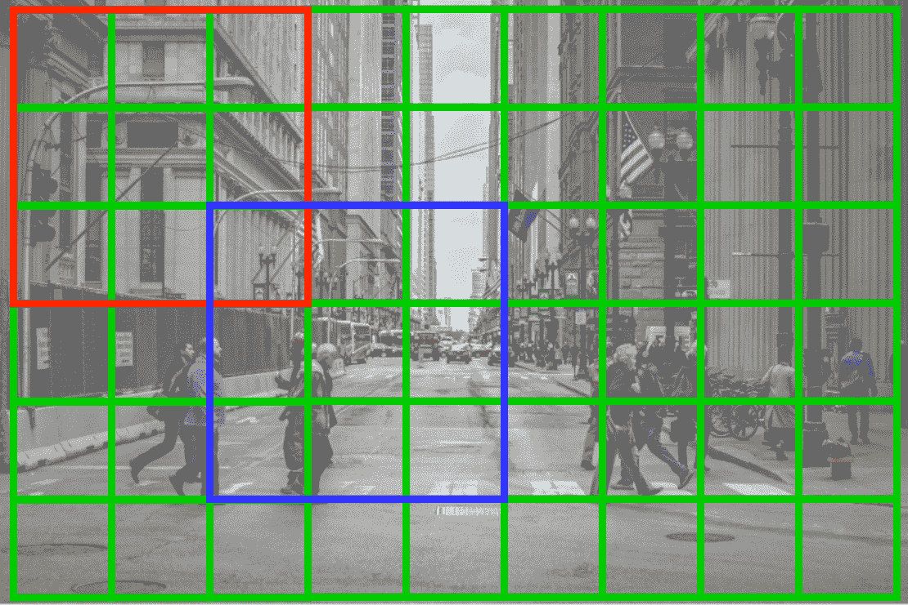
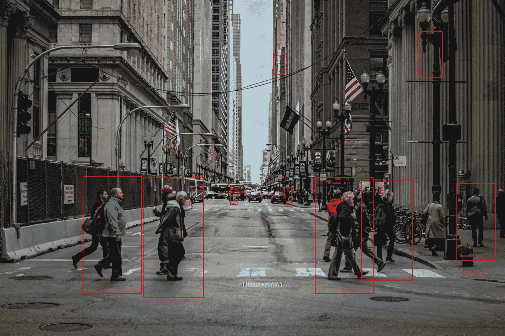

# 使用 OpenCV 提取梯度直方图

> 原文：[`machinelearningmastery.com/opencv_hog/`](https://machinelearningmastery.com/opencv_hog/)

除了由 SIFT、SURF 和 ORB 生成的特征描述符外，如在[之前的帖子](https://machinelearningmastery.com/opencv_sift_surf_orb_keypoints/)中所示，方向梯度直方图（HOG）是另一种使用 OpenCV 可以获取的特征描述符。HOG 是计算机视觉和图像处理中广泛使用的强大特征描述符，用于对象检测和识别任务。它捕捉图像中梯度方向的分布，并提供了一个强大的表示，不受光照和阴影变化的影响。

在本帖子中，您将学习关于 HOG 的内容。具体来说，您将了解：

+   HOG 是什么，它与图像有何关系

+   如何在 OpenCV 中计算它

用我的书[OpenCV 中的机器学习](https://machinelearning.samcart.com/products/machine-learning-opencv/)**开启您的项目**。它提供了**自学教程**和**可运行的代码**。

让我们开始吧！

使用 OpenCV 提取梯度直方图

照片由[Alexas_Fotos](https://unsplash.com/photos/white-and-black-piglet-on-gray-rocky-ground-during-daytime-A0qtF_zwx_M)提供。部分权利保留。

## **概述**

本帖子分为两部分；它们是：

+   理解 HOG

+   在 OpenCV 中计算 HOG

+   使用 HOG 进行人员检测

## 理解 HOG

HOG 算法背后的概念是计算图像局部区域中梯度方向的分布。HOG 在图像上操作一个**窗口**，即图像上固定像素大小的区域。一个窗口被分为小的空间区域，称为**块**，而块进一步被划分为多个**单元**。HOG 计算每个单元内的梯度幅度和方向，并创建梯度方向的直方图。然后将同一块内的直方图串联起来。

梯度衡量像素的颜色强度与其邻域的比较。它的变化越剧烈，幅度越高。方向告诉我们哪个方向是最陡的梯度。通常，这适用于单通道图像（即灰度图像），每个像素可以有自己的梯度。HOG 收集一个块内的所有梯度，并将它们放入一个直方图中。

HOG 制作直方图的巧妙之处在于，直方图中的箱由角度决定，但值在最接近的箱之间插值。例如，如果箱分配值为 0、20、40，而梯度角度为 30 时，值为 10，则在 20 和 40 的箱中添加了值 5。这样，HOG 能够有效地捕捉图像中物体的纹理和形状。

HOG 特别适用于检测具有明显纹理和模式的对象，使其成为行人检测和其他形式对象识别任务的热门选择。凭借捕捉梯度方向分布的能力，HOG 提供了对光照条件和阴影变化不敏感的强大表示。

## 在 OpenCV 中计算 HOG

OpenCV 提供了一种直接的方法来计算 HOG 描述符，使得开发人员和研究人员都能轻松访问。让我们来看一个在 OpenCV 中计算 HOG 的基本示例：

```py
import cv2

# Load the image and convert to grayscale
img = cv2.imread('image.jpg')
gray = cv2.cvtColor(img, cv2.COLOR_BGR2GRAY)

# define each block as 4x4 cells of 64x64 pixels each
cell_size = (128, 128)      # h x w in pixels
block_size = (4, 4)         # h x w in cells
win_size = (8, 6)           # h x w in cells

nbins = 9  # number of orientation bins
img_size = img.shape[:2]  # h x w in pixels

# create a HOG object
hog = cv2.HOGDescriptor(
    _winSize=(win_size[1] * cell_size[1],
              win_size[0] * cell_size[0]),
    _blockSize=(block_size[1] * cell_size[1],
                block_size[0] * cell_size[0]),
    _blockStride=(cell_size[1], cell_size[0]),
    _cellSize=(cell_size[1], cell_size[0]),
    _nbins=nbins
)
n_cells = (img_size[0] // cell_size[0], img_size[1] // cell_size[1])

# find features as a 1xN vector, then reshape into spatial hierarchy
hog_feats = hog.compute(img)
hog_feats = hog_feats.reshape(
    n_cells[1] - win_size[1] + 1,
    n_cells[0] - win_size[0] + 1,
    win_size[1] - block_size[1] + 1,
    win_size[0] - block_size[0] + 1,
    block_size[1],
    block_size[0],
    nbins)
print(hog_feats.shape)
```

HOG 一次计算一个窗口的特征。一个窗口中有多个块。在一个块中，有多个“单元格”。见下图：



假设整个图像是一个窗口。一个窗口被划分为多个单元格（绿色网格），几个单元格组合成一个块（红色和蓝色框）。一个窗口中有许多重叠的块，但所有块的大小相同。

每个单元格的大小是固定的。在上面的示例中，你使用了 64×64 像素的单元格。每个块有相同数量的单元格。在上面的示例中，你使用了 4×4 单元格的块。此外，窗口中的单元格数量也是相等的；你使用了 8×6 单元格。然而，在计算 HOG 时，我们并没有将图像划分为块或窗口。相反，

1.  视窗口为图像上的滑动窗口，其中滑动窗口的步幅大小是一个单元格的大小，即每次滑动一个单元格

1.  我们将窗口划分为固定大小的单元格

1.  我们设置第二个滑动窗口以匹配块大小并扫描窗口。它每次滑动一个单元格

1.  在一个块内，HOG 是从每个单元格中计算的

返回的 HOG 是整个图像的一个向量。在上述代码中，你重新塑造它以清晰地显示窗口、块、单元格和直方图箱的层次结构。例如，`hog_feats[i][j]`对应于窗口（以 numpy 切片语法表示）：

```py
img[n_cells[1]*i : n_cells[1]*i+(n_cells[1]*win_size[1]),
    n_cells[0]*j : n_cells[0]*j+(n_cells[0]*win_size[0])]
```

或者，相当于窗口的左上角是单元格（i,j）。

滑动窗口是一种在目标检测中常用的技术，因为你不能确定一个特定对象是否完全位于一个网格单元中。将单元格做得更小，但窗口更大，是捕捉对象的比仅看到部分对象更好的方法。然而，有一个限制：窗口较大的对象会被遗漏。此外，过小的对象可能会被窗口中的其他元素所掩盖。

通常，你会有一些与 HOG 相关的下游任务，例如在 HOG 特征上运行 SVM 分类器进行对象检测。在这种情况下，你可能想将 HOG 输出重新塑造成整个块的向量，而不是像上面那样按单元格的层次结构。

## 使用 HOG 进行人群检测

上述代码中的特征提取技术对于您想要获取其他用途的原始特征向量很有用。但对于一些常见任务，OpenCV 提供了预训练的机器学习模型，您可以轻松使用它们。

我们来考虑以下 URL 的照片（保存为 `people.jpg`）：

+   [`unsplash.com/photos/people-crossing-on-pedestrian-lane-near-buildings-during-daytime-JfBj_rVOhKY`](https://unsplash.com/photos/people-crossing-on-pedestrian-lane-near-buildings-during-daytime-JfBj_rVOhKY)


使用 HOG 检测人的示例照片。

图片由 [Chris Dickens](https://unsplash.com/photos/people-crossing-on-pedestrian-lane-near-buildings-during-daytime-JfBj_rVOhKY) 提供。保留所有权利。

这是一个人们过马路的照片。OpenCV 中的 HOG 有一个经过训练的“人检测器”，其窗口大小为 64×128 像素。用它来检测照片中的人非常简单：

```py
import cv2

# Load the image and convert it to grayscale
img = cv2.imread('people.jpg')

hog = cv2.HOGDescriptor()
hog.setSVMDetector(cv2.HOGDescriptor_getDefaultPeopleDetector())

# Detect people in the image
locations, confidence = hog.detectMultiScale(img)

# Draw rectangles around the detected people
for (x, y, w, h) in locations:
    cv2.rectangle(img, (x, y), (x + w, y + h), (0, 0, 255), 5)

# Display the image with detected people
cv2.imshow('People', img)
cv2.waitKey(0)
cv2.destroyAllWindows()
```

在上面，您使用了`cv2.HOGDescriptor_getDefaultPeopleDetector()`的参数创建了一个 HOG 描述符，它将初始化一个 SVM 分类器来检测特定对象，在这种情况下是人。

您可以在图像上调用描述符并使用`hog.detectMultiScale(img)`运行 SVM，该函数返回每个检测到的对象的**边界框**。虽然窗口大小是固定的，但此检测函数会在多个尺度下调整图像大小，以找到最佳检测结果。即便如此，返回的边界框仍然不够紧凑。上面的代码还通过在图像上标记边界框来标注检测到的人。您可以通过检测器报告的置信度分数进一步过滤结果。一些过滤算法，如非极大值抑制，可能适用，但这里不予讨论。以下是输出：



使用 OpenCV 中的 HOG 生成的边界框

您可以看到这些检测器只能在全身可见的情况下找到人。输出中包含假阳性（未检测到的人）和假阴性（未检测到的人）。在拥挤的场景中计算所有人可能会很具有挑战性。但这是一个很好的开始，展示了如何使用 OpenCV 轻松完成任务。

不幸的是，OpenCV 除了人脸检测器之外，没有其他检测器。但您可以使用 HOG 作为特征向量来训练自己的 SVM 或其他模型。使机器学习模型更为便捷是从图像中提取特征向量的关键点。

### 想要开始使用 OpenCV 进行机器学习吗？

立即参加我的免费电子邮件速成课程（包含示例代码）。

点击注册并获取课程的免费 PDF 电子书版本。

## **进一步阅读**

本节提供了更多关于该主题的资源，供您深入了解。

### **书籍**

+   [精通 OpenCV 4 与 Python](https://www.amazon.com/Mastering-OpenCV-Python-practical-processing/dp/1789344913)，2019 年。

### **网站**

+   OpenCV, [`opencv.org/`](https://opencv.org/)

+   StackOverflow: OpenCV HOG 特征解释: [`stackoverflow.com/questions/44972099/opencv-hog-features-explanation`](https://stackoverflow.com/questions/44972099/opencv-hog-features-explanation)

## **总结**

在本教程中，你学习了如何在 OpenCV 中使用 HOG 来基于滑动窗口提取特征向量。这是一种有效的特征检测方法，有助于对象检测。

具体来说，你学会了：

+   如何从图像中提取 HOG 特征

+   如何使用 OpenCV 内置的 HOG 人物检测器

如果你有任何问题，请在下方留言。
