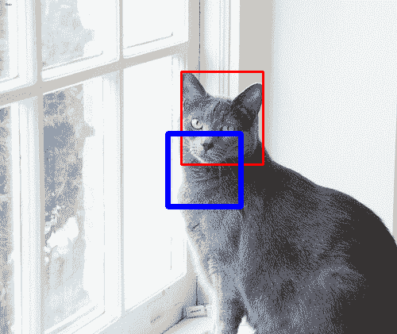

# 如何在 OpenCV 中使用 HOG 训练一个对象检测引擎

> 原文：[`machinelearningmastery.com/opencv_object_detection/`](https://machinelearningmastery.com/opencv_object_detection/)

在[上一篇文章](https://machinelearningmastery.com/opencv_hog/)中，你看到 OpenCV 可以使用称为方向梯度直方图（HOG）的技术从图像中提取特征。简而言之，这就是将图像的一个“补丁”转换为数值向量。如果设置得当，这个向量可以识别该补丁中的关键特征。虽然你可以使用 HOG 比较图像的相似性，但一个实际的应用是将其作为分类器的输入，从而在图像中检测对象。

在这篇文章中，你将学习如何使用 HOG 创建一个分类器。具体来说，你将学习：

+   如何为分类器训练准备输入数据

+   如何运行训练并保存模型以便在 OpenCV 中重复使用

用我的书[《OpenCV 中的机器学习》](https://machinelearning.samcart.com/products/machine-learning-opencv/)来**启动你的项目**。它提供了**自学教程**和**有效代码**。

让我们开始吧！[](../Images/5e0744e8e7762c03ae4132433fcb9aed.png)

如何在 OpenCV 中使用 HOG 训练一个对象检测引擎

图片由[Neil Thomas](https://unsplash.com/photos/brown-tree-SIU1Glk6v5k)拍摄。保留某些权利。

## 概述

本文分为三个部分；它们是：

+   HOG 用于分类

+   准备数据

+   使用 HOG 特征训练分类器

## HOG 用于分类

在[上一篇文章](https://machinelearningmastery.com/opencv_hog/)中，你了解到 HOG 是一种从图像区域生成特征向量的技术。很可能，这个区域中的对象决定了特征向量的大部分。

对象检测是找出较大图像中某个特定对象的位置。通常，目标是找到一个矩形**边界框**，使得对象紧紧地位于该框内。

使用 HOG 进行对象检测并不困难：你只需从图像中随机绘制多个边界框。然后，你可以使用 HOG 查找边界框的特征向量，并将其与目标对象预期的特征向量进行比较。

然而，你需要注意多个细节：首先，HOG 有多个参数，包括窗口、块和单元的大小。这也决定了边界框的大小和长宽比。如果你的边界框有不同的大小，可能需要调整大小。其次，HOG 对旋转敏感。因此，如果图像倾斜，从 HOG 获得的特征向量可能对对象检测没有用。

最后，即使所有边界框都识别了相同的对象，每个边界框生成的 HOG 向量也会有所不同。你需要一种聪明的方法来判断对象是否被检测到，这通常是一个机器学习模型。

有几种模型可以用来比较候选边界框的 HOG。在这篇文章中，你将使用支持向量机 (SVM)。OpenCV 有一个内置的人员检测器，它也是作为 SVM 实现的。

## 准备数据

让我们考虑**猫检测**的任务。对于一张有猫的图像，你需要在猫的脸周围绘制一个方框。你将使用 OpenCV 构建一个 SVM 来完成这个任务。

和所有机器学习项目一样，第一步是获取数据集。你可以从 Oxford-IIIT Pet Dataset 获得包含猫图像的数据集，地址为：

+   [`www.robots.ox.ac.uk/~vgg/data/pets/`](https://www.robots.ox.ac.uk/~vgg/data/pets/)

这是一个 800MB 的数据集，在计算机视觉数据集的标准下属于小型数据集。图像以 Pascal VOC 格式进行标注。简而言之，每张图像都有一个对应的 XML 文件，格式如下：

XHTML

```py
<?xml version="1.0"?>
<annotation>
  <folder>OXIIIT</folder>
  <filename>Abyssinian_100.jpg</filename>
  <source>
    <database>OXFORD-IIIT Pet Dataset</database>
    <annotation>OXIIIT</annotation>
    <image>flickr</image>
  </source>
  <size>
    <width>394</width>
    <height>500</height>
    <depth>3</depth>
  </size>
  <segmented>0</segmented>
  <object>
    <name>cat</name>
    <pose>Frontal</pose>
    <truncated>0</truncated>
    <occluded>0</occluded>
    <bndbox>
      <xmin>151</xmin>
      <ymin>71</ymin>
      <xmax>335</xmax>
      <ymax>267</ymax>
    </bndbox>
    <difficult>0</difficult>
  </object>
</annotation>
```

XML 文件告诉你它所指的图像文件，以及它包含的对象，边界框在 `<bndbox></bndbox>` 标签之间。

有一些 Python 库可以用来处理 Pascal VOC XML 文件。但对于像这样的简单情况，你可以直接使用 Python 的内置 XML 解析器。下面是一个函数，给定 XML 文件名，它读取内容并返回一个 Python 字典，告诉你所有包含的对象以及相应的边界框：

```py
import xml.etree.ElementTree as ET

def read_voc_xml(xmlfile: str) -> dict:
    root = ET.parse(xmlfile).getroot()
    boxes = {"filename": root.find("filename").text,
             "objects": []}
    for box in root.iter('object'):
        bb = box.find('bndbox')
        obj = {
            "name": box.find('name').text,
            "xmin": int(bb.find("xmin").text),
            "ymin": int(bb.find("ymin").text),
            "xmax": int(bb.find("xmax").text),
            "ymax": int(bb.find("ymax").text),
        }
        boxes["objects"].append(obj)

    return boxes
```

上述函数返回的字典示例如下：

```py
{'filename': 'yorkshire_terrier_160.jpg',
'objects': [{'name': 'dog', 'xmax': 290, 'xmin': 97, 'ymax': 245, 'ymin': 18}]}
```

在这个数据集中，每张图像中只有一个对象（猫或狗）。边界框以像素坐标指定。使用你上面获得的文件名，你可以使用 OpenCV 读取图像。图像是一个 numpy 数组，因此你可以使用数组切片提取部分内容。如下所示：

```py
img = cv2.imread(path)
portion = img[ymin:ymax, xmin:xmax]
```

让我们专注于训练分类器的目标。首先，你需要设计 HOG 计算的参数。我们考虑一个长度适中的向量，即，

+   窗口大小： (64,64)

+   块大小： (32, 32)

+   块步幅： (16, 16)

+   单元格大小： (16, 16)

+   直方图箱数： 9

换句话说，你将考虑图像上一个 64×64 像素的方形窗口，单元格大小为 16×16 像素。每个块有 2×2 个单元格。

因为窗口是方形的，你不想改变图像的宽高比，所以你需要将数据集中的边界框调整为方形大小。之后，你应该裁剪调整后的边界框，将其调整为 64×64 像素，并将其保存为**正样本**。你还需要负样本用于训练。既然你想做一个猫检测器，你可以使用狗的图像作为负样本。你希望负样本覆盖图像的背景。你可以简单地随机裁剪这些图像中的一个方形区域，并调整为 64×64 像素作为负样本，而不是遵循边界框。

下面是如何从数据集中收集 1000 个正样本和负样本的代码。假设你已经下载了数据集并将两个 tar 文件解压到 `oxford-iiit-pet` 目录中：

```py
def make_square(xmin, xmax, ymin, ymax):
    """Shrink the bounding box to square shape"""
    xcenter = (xmax + xmin) // 2
    ycenter = (ymax + ymin) // 2
    halfdim = min(xmax-xmin, ymax-ymin) // 2
    xmin, xmax = xcenter-halfdim, xcenter+halfdim
    ymin, ymax = ycenter-halfdim, ycenter+halfdim
    return xmin, xmax, ymin, ymax

# Define HOG parameters
winSize = (64, 64)
blockSize = (32, 32)
blockStride = (16, 16)
cellSize = (16, 16)
nbins = 9

num_samples = 1000

base_path = pathlib.Path("oxford-iiit-pet")
img_src = base_path / "images"
ann_src = base_path / "annotations" / "xmls"

# collect samples by cropping the images from dataset
positive = []
negative = []

# collect positive samples
for xmlfile in ann_src.glob("*.xml"):
    # load xml
    ann = read_voc_xml(str(xmlfile))
    # use only cat photos
    if ann["objects"][0]["name"] != "cat":
        continue
    # adjust the bounding box to square
    box = ann["objects"][0]
    xmin, xmax, ymin, ymax = box["xmin"], box["xmax"], box["ymin"], box["ymax"]
    xmin, xmax, ymin, ymax = make_square(xmin, xmax, ymin, ymax)
    # crop a positive sample
    img = cv2.imread(str(img_src / ann["filename"]))
    sample = img[ymin:ymax, xmin:xmax]
    sample = cv2.resize(sample, winSize)
    positive.append(sample)
    if len(positive) > num_samples:
        break

# collect negative samples
for xmlfile in ann_src.glob("*.xml"):
    # load xml
    ann = read_voc_xml(str(xmlfile))
    # use only dog photos
    if ann["objects"][0]["name"] == "cat":
        continue
    # random bounding box: at least the target size to avoid scaling up
    height, width = img.shape[:2]
    boxsize = random.randint(winSize[0], min(height, width))
    x = random.randint(0, width-boxsize)
    y = random.randint(0, height-boxsize)
    sample = img[y:y+boxsize, x:x+boxsize]
    sample = cv2.resize(sample, winSize)
    negative.append(sample)
    if len(negative) > num_samples:
        break
```

## 使用 HOG 特征训练分类器

OpenCV 在 cv2.ml 中提供了一个 SVM 模块，它的工作方式类似于 scikit-learn。实质上，你只需做以下操作来进行训练：

```py
svm = cv2.ml.SVM_create()
svm.setType(cv2.ml.SVM_C_SVC)
svm.setKernel(cv2.ml.SVM_RBF)
svm.setTermCriteria((cv2.TERM_CRITERIA_MAX_ITER + cv2.TERM_CRITERIA_EPS, 10000, 1e-8))
svm.train(data, cv2.ml.ROW_SAMPLE, labels)
svm.save('svm_model.yml')
```

你首先用 `cv2.ml.SVM_create()` 创建一个 SVM 对象。然后你配置 SVM，因为它有许多变体。在上面的代码中，你使用了 `SVM_C_SVC` 作为类型，因为它是一个 C-Support Vector Classifier（允许不完美分离的 SVM 分类器）。你使用了径向基函数核（`SVM_RBF`），因为它通常效果较好。如果任务比较简单，你也可以选择使用更简单的线性核（`SVM_LINEAR`）。SVM 还有许多其他参数。例如，如果使用 RBF 核，你可以使用 `svm.setGamma()` 设置 gamma 值，既然你使用了 C-SVC，你可以使用 `svm.setC()` 设置参数 C 的值。在上面的代码中，你将所有参数留给了 OpenCV 的默认设置。

SVM 的训练需要一个终止条件。在上面的代码中，你使用了 `svm.setTermCritera()` 来使训练在 10000 次迭代或损失函数低于 $10^{-8}$ 时停止，以较早出现者为准。所有操作完成后，你只需将数据和标签传递给训练程序。

训练数据以 numpy 数组的形式呈现。你将其设置为数组中的每一行代表一个样本。所需的标签仅是整数标签，0 或 1。由于你正在用 SVM 训练一个 HOG 分类器，你需要将样本转换为 HOG 特征。使用 OpenCV 进行这一操作并不困难。以下是如何创建 numpy 数组的步骤，基于你收集的正负样本：

```py
images = positive + negative
labels = ([1] * len(positive)) + ([0] * len(negative))
hog = cv2.HOGDescriptor(winSize, blockSize, blockStride, cellSize, nbins)
data = []
for img in images:
    features = hog.compute(img)
    data.append(features.flatten())

data = np.array(data, dtype=np.float32)
labels = np.array(labels, dtype=np.int32)
```

从数据收集到训练的完整代码如下：

```py
import pathlib
import random
import xml.etree.ElementTree as ET

import cv2
import numpy as np

def read_voc_xml(xmlfile):
    """read the Pascal VOC XML"""
    root = ET.parse(xmlfile).getroot()
    boxes = {"filename": root.find("filename").text,
             "objects": []}
    for box in root.iter('object'):
        bb = box.find('bndbox')
        obj = {
            "name": box.find('name').text,
            "xmin": int(bb.find("xmin").text),
            "ymin": int(bb.find("ymin").text),
            "xmax": int(bb.find("xmax").text),
            "ymax": int(bb.find("ymax").text),
        }
        boxes["objects"].append(obj)

    return boxes

def make_square(xmin, xmax, ymin, ymax):
    """Shrink the bounding box to square shape"""
    xcenter = (xmax + xmin) // 2
    ycenter = (ymax + ymin) // 2
    halfdim = min(xmax-xmin, ymax-ymin) // 2
    xmin, xmax = xcenter-halfdim, xcenter+halfdim
    ymin, ymax = ycenter-halfdim, ycenter+halfdim
    return xmin, xmax, ymin, ymax

# Define HOG parameters
winSize = (64, 64)
blockSize = (32, 32)
blockStride = (16, 16)
cellSize = (16, 16)
nbins = 9

num_samples = 1000

# Load your dataset and corresponding bounding box annotations
base_path = pathlib.Path("oxford-iiit-pet")
img_src = base_path / "images"
ann_src = base_path / "annotations" / "xmls"

# collect samples by cropping the images from dataset
positive = []
negative = []

# collect positive samples
for xmlfile in ann_src.glob("*.xml"):
    # load xml
    ann = read_voc_xml(str(xmlfile))
    # use only cat photos
    if ann["objects"][0]["name"] != "cat":
        continue
    # adjust the bounding box to square
    box = ann["objects"][0]
    xmin, xmax, ymin, ymax = box["xmin"], box["xmax"], box["ymin"], box["ymax"]
    xmin, xmax, ymin, ymax = make_square(xmin, xmax, ymin, ymax)
    # crop a positive sample
    img = cv2.imread(str(img_src / ann["filename"]))
    sample = img[ymin:ymax, xmin:xmax]
    sample = cv2.resize(sample, winSize)
    positive.append(sample)
    if len(positive) > num_samples:
        break

# collect negative samples
for xmlfile in ann_src.glob("*.xml"):
    # load xml
    ann = read_voc_xml(str(xmlfile))
    # use only dog photos
    if ann["objects"][0]["name"] == "cat":
        continue
    # random bounding box: at least the target size to avoid scaling up
    height, width = img.shape[:2]
    boxsize = random.randint(winSize[0], min(height, width))
    x = random.randint(0, width-boxsize)
    y = random.randint(0, height-boxsize)
    sample = img[y:y+boxsize, x:x+boxsize]
    assert tuple(sample.shape[:2]) == (boxsize, boxsize)
    sample = cv2.resize(sample, winSize)
    negative.append(sample)
    if len(negative) > num_samples:
        break

images = positive + negative
labels = ([1] * len(positive)) + ([0] * len(negative))

# Create the HOG descriptor and the HOG from each image
hog = cv2.HOGDescriptor(winSize, blockSize, blockStride, cellSize, nbins)
data = []
for img in images:
    features = hog.compute(img)
    data.append(features.flatten())

# Convert data and labels to numpy arrays
data = np.array(data, dtype=np.float32)
labels = np.array(labels, dtype=np.int32)

# Train the SVM
svm = cv2.ml.SVM_create()
svm.setType(cv2.ml.SVM_C_SVC)
svm.setKernel(cv2.ml.SVM_RBF)
svm.setTermCriteria((cv2.TERM_CRITERIA_MAX_ITER + cv2.TERM_CRITERIA_EPS,
                     100000,
                     1e-8))

svm.train(data, cv2.ml.ROW_SAMPLE, labels)

# Save the SVM model
svm.save('svm_model.yml')
print(svm.getSupportVectors())
```

上面代码的最后一行是打印训练好的 SVM 的支持向量。这个操作是可选的，因为你已经将模型保存到 `svm_model.yml` 文件中。

下面是如何使用训练好的模型：首先，你创建一个 HOG 对象，一个 SVM 对象，然后将 SVM 对象分配给 HOG 作为检测器。当你有一张图像时，你使用 HOG 的 `detectMultiScale()` 方法来寻找检测到的对象的位置。这个函数会多次重新缩放图像，使得你为 HOG 设置的窗口大小不需要完全匹配对象的大小。这非常有用，因为你无法知道图像中目标对象的大小。由于 SVM 是在特定的 HOG 特征配置上训练的，你必须使用与训练中相同的参数（窗口、块、单元和直方图）来创建 HOG 对象。检测函数的输出将是多个边界框，但你可以根据评分简单地选择最佳匹配的框。

代码如下：

```py
winSize = (64, 64)
blockSize = (32, 32)
blockStride = (16, 16)
cellSize = (16, 16)
nbins = 9

svm = cv2.ml.SVM_load('svm_model.yml')
hog = cv2.HOGDescriptor(winSize, blockSize, blockStride, cellSize, nbins)
hog.setSVMDetector(svm.getSupportVectors()[0])

locations, scores = hog.detectMultiScale(img)
x, y, w, h = locations[np.argmax(scores.flatten())]
cv2.rectangle(img, (x, y), (x + w, y + h), (255,0,0), 5)
```

假设训练好的 SVM 已经保存到文件 `svm_model.yml` 中。你可以直接使用保存的文件创建 SVM 对象。`hog.detectMultiScale()` 的输出 `scores` 是一个 N×1 的 numpy 数组。因此，你应该将其展平成一个向量并找到最大值。数组 `locations` 中的对应边界框是匹配度最高的。该函数返回的边界框是以左上角的坐标以及宽度和高度表示的。上述代码中的最后一行是直接在图像上标注这样的框。

你确实可以在相同的数据集上运行此代码。完整代码如下，其中原始边界框和 SVM 检测到的边界框都绘制在图像上并通过 OpenCV 显示：

```py
import pathlib
import xml.etree.ElementTree as ET

import cv2
import numpy as np

def read_voc_xml(xmlfile: str) -> dict:
    """read the Pascal VOC XML and return (filename, object name, bounding box)
    where bounding box is a vector of (xmin, ymin, xmax, ymax). The pixel
    coordinates are 1-based.
    """
    root = ET.parse(xmlfile).getroot()
    boxes = {"filename": root.find("filename").text,
             "objects": []
            }
    for box in root.iter('object'):
        bb = box.find('bndbox')
        obj = {
            "name": box.find('name').text,
            "xmin": int(bb.find("xmin").text),
            "ymin": int(bb.find("ymin").text),
            "xmax": int(bb.find("xmax").text),
            "ymax": int(bb.find("ymax").text),
        }
        boxes["objects"].append(obj)

    return boxes

# load the SVM
winSize = (64, 64)
blockSize = (32, 32)
blockStride = (16, 16)
cellSize = (16, 16)
nbins = 9

svm = cv2.ml.SVM_load('svm_model.yml')
hog = cv2.HOGDescriptor(winSize, blockSize, blockStride, cellSize, nbins)
hog.setSVMDetector(svm.getSupportVectors()[0])

base_path = pathlib.Path("oxford-iiit-pet")
img_src = base_path / "images"
ann_src = base_path / "annotations" / "xmls"

for xmlfile in ann_src.glob("*.xml"):
    # load xml
    ann = read_voc_xml(str(xmlfile))
    # annotate
    img = cv2.imread(str(img_src / ann["filename"]))
    bbox = ann["objects"][0]
    start_point = (bbox["xmin"], bbox["ymin"])
    end_point = (bbox["xmax"], bbox["ymax"])
    annotated_img = cv2.rectangle(img, start_point, end_point, (0,0,255), 2)
    # detect and draw
    locations, scores = hog.detectMultiScale(img)
    x, y, w, h = locations[np.argmax(scores.flatten())]
    cv2.rectangle(img, (x, y), (x + w, y + h), (255,0,0), 5)
    cv2.imshow(f"{ann['filename']}: {ann['objects'][0]['name']}", annotated_img)
    key = cv2.waitKey(0)
    cv2.destroyAllWindows()
    if key == ord('q'):
        break
```

OpenCV 将从数据集中逐个显示带注释的图像。数据集中的边界框为红色，而 SVM 报告的边界框为蓝色。请注意，这是一个猫检测器，因此如果是狗的图像，理想情况下不应检测到任何东西。然而，带有 HOG 特征的 SVM 在这方面表现不是很好。



数据集中的边界框（红色）与训练模型的检测输出（蓝色）相比。

实际上，这个检测器的准确性不是很高。上面的例子中，检测到的边界框与猫的脸相差很大。尽管如此，这仍然不是一个糟糕的模型。你可以通过调整模型参数（如 C 和 gamma）以及提供更好的训练数据来提高 SVM 的质量。

### 想要开始使用 OpenCV 进行机器学习吗？

立即领取我的免费电子邮件速成课程（附带示例代码）。

点击注册并获取课程的免费 PDF 电子书版本。

## 进一步阅读

本节提供了更多有关此主题的资源，如果你想深入了解。

#### 书籍

+   [掌握 OpenCV 4 和 Python](https://www.amazon.com/Mastering-OpenCV-Python-practical-processing/dp/1789344913)，2019 年。

#### 网站

+   [OpenCV](https://opencv.org/)

+   StackOverflow: [OpenCV HOG 特征解释](https://stackoverflow.com/questions/44972099/opencv-hog-features-explanation)

+   OpenCV: [支持向量机简介](https://docs.opencv.org/4.8.0/d1/d73/tutorial_introduction_to_svm.html)

## 摘要

在这篇文章中，你学习了如何使用 OpenCV 库完全训练一个带有 HOG 特征的 SVM 进行物体检测。特别是，你学到了：

+   如何为训练准备数据，因为 SVM 只接受特征作为 numpy 数组

+   如何在 OpenCV 中保存和加载 SVM

+   如何将 SVM 对象附加到 OpenCV 中的 HOG 对象以进行多尺度检测
