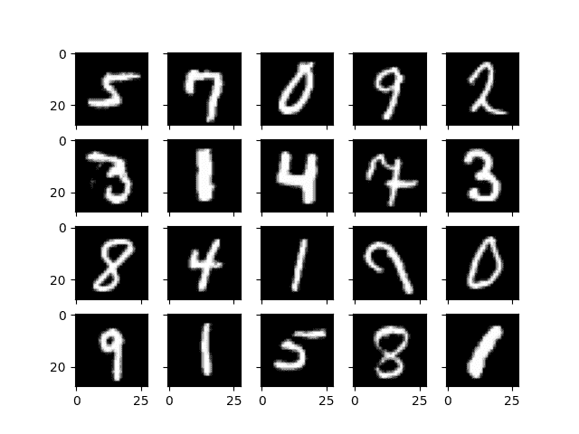

# 在 OpenCV 中运行神经网络模型

> 原文：[`machinelearningmastery.com/running-a-neural-network-model-in-opencv/`](https://machinelearningmastery.com/running-a-neural-network-model-in-opencv/)

许多机器学习模型已经被开发出来，每种模型都有其优缺点。没有神经网络模型，这个目录是不完整的。在 OpenCV 中，你可以使用通过其他框架开发的神经网络模型。在这篇文章中，你将学习在 OpenCV 中应用神经网络的工作流程。具体来说，你将学习：

+   OpenCV 在其神经网络模型中可以使用的内容

+   如何为 OpenCV 准备神经网络模型

**启动你的项目**，请参考我的书籍 [《OpenCV 中的机器学习》](https://machinelearning.samcart.com/products/machine-learning-opencv/)。它提供了**自学教程**和**有效代码**。

让我们开始吧！[](../Images/13d1d5548b6ce1712b519e48bfd98d5c.png)

在 OpenCV 中运行神经网络模型

图片由 [Nastya Dulhiier](https://unsplash.com/photos/lighted-city-at-night-aerial-photo-OKOOGO578eo) 提供。版权所有。

## 神经网络模型概述

神经网络的另一个名称是多层感知器。它的灵感来自于人脑的结构和功能。想象一下一个由互联节点组成的网络，每个节点对通过它的数据执行简单的计算。这些节点，或称为“感知器”，相互通信，根据接收到的信息调整它们的连接。这些感知器组织在一个有向图中，计算从输入到输出具有确定的顺序。它们的组织通常用顺序**层**来描述。学习过程使网络能够识别模式并对未见过的数据进行预测。

在计算机视觉中，神经网络处理图像识别、对象检测和图像分割等任务。通常，在模型内部，会执行三种高级操作：

1.  **特征提取**：网络接收图像作为输入。第一层然后分析像素，寻找基本特征，如边缘、曲线和纹理。这些特征就像积木一样，给予网络对图像内容的初步理解。

1.  **特征学习**：更深的层次在这些特征的基础上构建，结合和转化它们，以发现更高层次、更复杂的模式。这可能涉及到识别形状或对象。

1.  **输出生成**：最后，网络的最后几层使用学习到的模式来进行预测。根据任务的不同，它可以对图像进行分类（例如，猫与狗）或识别其包含的对象。

这些操作是通过学习获得的，而不是手工制作的。神经网络的强大在于其灵活性和适应性。通过微调神经元之间的连接并提供大量标记数据，我们可以训练它们以卓越的准确性解决复杂的视觉问题。但由于其灵活性和适应性，神经网络通常在内存和计算复杂性方面不是最有效的模型。

## 训练神经网络

由于模型的性质，训练一个通用的神经网络并不简单。OpenCV 中没有训练功能。因此，你必须使用其他框架训练模型并在 OpenCV 中加载它。你希望在这种情况下使用 OpenCV，因为你已经在使用 OpenCV 进行其他图像处理任务，不想给项目引入另一个依赖，或者因为 OpenCV 是一个更轻量的库。

例如，考虑经典的 MNIST 手写数字识别问题。为了简化，我们使用 Keras 和 TensorFlow 来构建和训练模型。数据集可以从 TensorFlow 获得。

Python

```py
import matplotlib.pyplot as plt
import numpy as np
from tensorflow.keras.datasets import mnist

# Load MNIST data
(X_train, y_train), (X_test, y_test) = mnist.load_data()
print(X_train.shape)
print(y_train.shape)

# Check visually
fig, ax = plt.subplots(4, 5, sharex=True, sharey=True)
idx = np.random.randint(len(X_train), size=4*5).reshape(4,5)
for i in range(4):
    for j in range(5):
        ax[i][j].imshow(X_train[idx[i][j]], cmap="gray")
plt.show()
```

这两个打印语句给出的结果是：

```py
(60000, 28, 28)
(60000,)
```

你可以看到数据集以 28×28 的灰度格式提供数字。训练集有 60,000 个样本。你可以使用 matplotlib 展示一些随机样本，看到类似如下的图像：



这个数据集标记为 0 到 9，表示图像上的数字。你可以使用许多模型来解决这个分类问题。著名的 LeNet5 模型就是其中之一。让我们使用 Keras 语法创建一个：

Python

```py
from tensorflow.keras.models import Sequential
from tensorflow.keras.layers import Conv2D, Dense, AveragePooling2D, Flatten

# LeNet5 model
model = Sequential([
    Conv2D(6, (5,5), input_shape=(28,28,1), padding="same", activation="tanh"),
    AveragePooling2D((2,2), strides=2),
    Conv2D(16, (5,5), activation="tanh"),
    AveragePooling2D((2,2), strides=2),
    Conv2D(120, (5,5), activation="tanh"),
    Flatten(),
    Dense(84, activation="tanh"),
    Dense(10, activation="softmax")
])
model.summary()
```

最后一行显示了神经网络架构如下：

```py
Model: "sequential"
________________________________________________________________________________
 Layer (type)                            Output Shape           Param
                                                                 #
================================================================================
 conv2d (Conv2D)                         (None, 28, 28, 6)      156

 average_pooling2d (AveragePooling2D)    (None, 14, 14, 6)      0

 conv2d_1 (Conv2D)                       (None, 10, 10, 16)     2416

 average_pooling2d_1 (AveragePooling2D)  (None, 5, 5, 16)       0

 conv2d_2 (Conv2D)                       (None, 1, 1, 120)      48120

 flatten (Flatten)                       (None, 120)            0

 dense (Dense)                           (None, 84)             10164

 dense_1 (Dense)                         (None, 10)             850

================================================================================
Total params: 61706 (241.04 KB)
Trainable params: 61706 (241.04 KB)
Non-trainable params: 0 (0.00 Byte)
________________________________________________________________________________
```

这个网络有三个卷积层，接着是两个全连接层。最终的全连接层输出一个 10 维向量，表示输入图像对应于 10 个数字中的一个的概率。

在 Keras 中训练这样的网络并不困难。

首先，你需要将输入从 28×28 图像像素重新格式化为 28×28×1 的张量，以便卷积层可以接受额外的维度。然后，标签应转换为一个独热向量，以匹配网络输出的格式。

然后，你可以通过提供超参数来启动训练：损失函数应该是交叉熵，因为这是一个多类分类问题。Adam 被用作优化器，因为它是常用的选择。在训练期间，你要观察预测准确率。训练应该很快。因此，决定运行 100 个周期，但如果你发现模型在验证集上的损失指标连续四个周期没有改进，就让它提前停止。

### 想要开始使用 OpenCV 进行机器学习吗？

立即获取我的免费电子邮件速成课程（包括示例代码）。

点击注册并获得课程的免费 PDF 电子书版本。

代码如下：

Python

```py
import numpy as np
from tensorflow.keras.utils import to_categorical
from tensorflow.keras.callbacks import EarlyStopping

# Reshape data to shape of (n_sample, height, width, n_channel)
X_train = np.expand_dims(X_train, axis=3).astype('float32')
X_test = np.expand_dims(X_test, axis=3).astype('float32')
print(X_train.shape)

# One-hot encode the output
y_train = to_categorical(y_train)
y_test = to_categorical(y_test)

model.compile(loss="categorical_crossentropy", optimizer="adam", metrics=["accuracy"])
earlystopping = EarlyStopping(monitor="val_loss", patience=4, restore_best_weights=True)
model.fit(X_train, y_train, validation_data=(X_test, y_test), epochs=100, batch_size=32, callbacks=[earlystopping])
```

运行这个模型会打印出如下进度：

```py
Epoch 1/100
1875/1875 [==============================] - 7s 4ms/step - loss: 0.1567 - accuracy: 0.9528 - val_loss: 0.0795 - val_accuracy: 0.9739
Epoch 2/100
1875/1875 [==============================] - 7s 4ms/step - loss: 0.0683 - accuracy: 0.9794 - val_loss: 0.0677 - val_accuracy: 0.9791
Epoch 3/100
1875/1875 [==============================] - 7s 4ms/step - loss: 0.0513 - accuracy: 0.9838 - val_loss: 0.0446 - val_accuracy: 0.9865
Epoch 4/100
1875/1875 [==============================] - 7s 4ms/step - loss: 0.0416 - accuracy: 0.9869 - val_loss: 0.0438 - val_accuracy: 0.9863
Epoch 5/100
1875/1875 [==============================] - 7s 4ms/step - loss: 0.0349 - accuracy: 0.9891 - val_loss: 0.0389 - val_accuracy: 0.9869
Epoch 6/100
1875/1875 [==============================] - 7s 4ms/step - loss: 0.0300 - accuracy: 0.9903 - val_loss: 0.0435 - val_accuracy: 0.9864
Epoch 7/100
1875/1875 [==============================] - 7s 4ms/step - loss: 0.0259 - accuracy: 0.9914 - val_loss: 0.0469 - val_accuracy: 0.9864
Epoch 8/100
1875/1875 [==============================] - 7s 4ms/step - loss: 0.0254 - accuracy: 0.9918 - val_loss: 0.0375 - val_accuracy: 0.9891
Epoch 9/100
1875/1875 [==============================] - 7s 4ms/step - loss: 0.0209 - accuracy: 0.9929 - val_loss: 0.0479 - val_accuracy: 0.9853
Epoch 10/100
1875/1875 [==============================] - 7s 4ms/step - loss: 0.0178 - accuracy: 0.9942 - val_loss: 0.0396 - val_accuracy: 0.9882
Epoch 11/100
1875/1875 [==============================] - 7s 4ms/step - loss: 0.0182 - accuracy: 0.9938 - val_loss: 0.0359 - val_accuracy: 0.9891
Epoch 12/100
1875/1875 [==============================] - 7s 4ms/step - loss: 0.0150 - accuracy: 0.9952 - val_loss: 0.0445 - val_accuracy: 0.9876
Epoch 13/100
1875/1875 [==============================] - 7s 4ms/step - loss: 0.0146 - accuracy: 0.9950 - val_loss: 0.0427 - val_accuracy: 0.9876
Epoch 14/100
1875/1875 [==============================] - 7s 4ms/step - loss: 0.0141 - accuracy: 0.9954 - val_loss: 0.0453 - val_accuracy: 0.9871
Epoch 15/100
1875/1875 [==============================] - 7s 4ms/step - loss: 0.0147 - accuracy: 0.9951 - val_loss: 0.0404 - val_accuracy: 0.9890
```

由于早期停止规则，这次训练在第 15 个 epoch 时停止了。

一旦你完成模型训练，你可以将 Keras 模型保存为 HDF5 格式，这将包括模型结构和层权重：

Python

```py
model.save("lenet5.h5")
```

构建模型的完整代码如下：

Python

```py
#!/usr/bin/env python

import numpy as np
from tensorflow.keras.datasets import mnist
from tensorflow.keras.callbacks import EarlyStopping
from tensorflow.keras.layers import Conv2D, Dense, AveragePooling2D, Flatten
from tensorflow.keras.models import Sequential
from tensorflow.keras.utils import to_categorical

# Load MNIST data
(X_train, y_train), (X_test, y_test) = mnist.load_data()
print(X_train.shape)
print(y_train.shape)

# LeNet5 model
model = Sequential([
    Conv2D(6, (5,5), input_shape=(28,28,1), padding="same", activation="tanh"),
    AveragePooling2D((2,2), strides=2),
    Conv2D(16, (5,5), activation="tanh"),
    AveragePooling2D((2,2), strides=2),
    Conv2D(120, (5,5), activation="tanh"),
    Flatten(),
    Dense(84, activation="tanh"),
    Dense(10, activation="softmax")
])

# Reshape data to shape of (n_sample, height, width, n_channel)
X_train = np.expand_dims(X_train, axis=3).astype('float32')
X_test = np.expand_dims(X_test, axis=3).astype('float32')

# One-hot encode the output
y_train = to_categorical(y_train)
y_test = to_categorical(y_test)

# Training
model.compile(loss="categorical_crossentropy", optimizer="adam", metrics=["accuracy"])
earlystopping = EarlyStopping(monitor="val_loss", patience=4, restore_best_weights=True)
model.fit(X_train, y_train, validation_data=(X_test, y_test), epochs=100, batch_size=32, callbacks=[earlystopping])

model.save("lenet5.h5")
```

## 将模型转换为 OpenCV 格式

OpenCV 在其 `dnn` 模块中支持神经网络。它可以处理由多个框架（包括 TensorFlow 1.x）保存的模型。但是，对于上述保存的 Keras 模型，最好先转换为 ONNX 格式。

用于将 Keras 模型（HDF5 格式）或通用 TensorFlow 模型（Protocol Buffer 格式）转换的工具是 Python 模块 `tf2onnx`。你可以使用以下命令在你的环境中安装它：

Shell

```py
pip install tf2onnx
```

之后，你可以使用模块中的转换命令。例如，由于你将 Keras 模型保存为 HDF5 格式，你可以使用以下命令将其转换为 ONNX 格式：

Shell

```py
python -m tf2onnx.convert --keras lenet5.h5 --output lenet5.onnx
```

然后，会创建一个文件 `lenet5.onnx`。

要在 OpenCV 中使用它，你需要将模型作为网络对象加载到 OpenCV 中。如果是 TensorFlow Protocol Buffer 文件，可以使用函数 `cv2.dnn.readNetFromTensorflow('frozen_graph.pb')`。在这篇文章中，你使用的是 ONNX 文件。因此，它应该是 `cv2.dnn.readNetFromONNX('model.onnx')`

这个模型假设输入是一个“blob”，你应该使用以下方式调用模型：

```py
net = cv2.dnn.readNetFromONNX('model.onnx')
blob = cv2.dnn.blobFromImage(numpyarray, scale, size, mean)
net.setInput(blob)
output = net.forward()
```

Blob 也是一个 numpy 数组，但进行了重新格式化以添加批次维度。

在 OpenCV 中使用模型只需几行代码。例如，我们再次从 TensorFlow 数据集中获取图像，并检查所有测试集样本以计算模型的准确性：

Python

```py
import numpy as np
import cv2
from tensorflow.keras.datasets import mnist

# Load the frozen model in OpenCV
net = cv2.dnn.readNetFromONNX('lenet5.onnx')

# Prepare input image
(X_train, y_train), (X_test, y_test) = mnist.load_data()
correct = 0
wrong = 0
for i in range(len(X_test)):
    img = X_test[i]
    label = y_test[i]

    blob = cv2.dnn.blobFromImage(img, 1.0, (28, 28))

    # Run inference
    net.setInput(blob)
    output = net.forward()
    prediction = np.argmax(output)
    if prediction == label:
        correct += 1
    else:
        wrong += 1

print("count of test samples:", len(X_test))
print("accuracy:", (correct/(correct+wrong)))
```

在 OpenCV 中运行神经网络模型略有不同于在 TensorFlow 中运行模型，你需要将输入和输出分别处理为两个步骤。

在上面的代码中，你将输出转换为“blob”，没有进行缩放和移位，因为模型就是这样训练的。你设置单张图像的输入，输出将是一个 1×10 的数组。作为 softmax 输出，你使用 `argmax` 函数获取模型的预测。随后计算测试集上的平均准确性非常简单。上述代码打印：

```py
count of test samples: 10000
accuracy: 0.9889
```

## 摘要

在这篇文章中，你学会了如何通过 `dnn` 模块在 OpenCV 中使用神经网络。具体来说，你学会了

+   如何训练神经网络模型并将其转换为 ONNX 格式，以供 OpenCV 使用

+   如何在 OpenCV 中加载和运行模型
