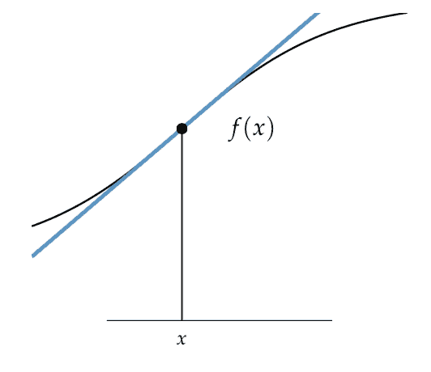
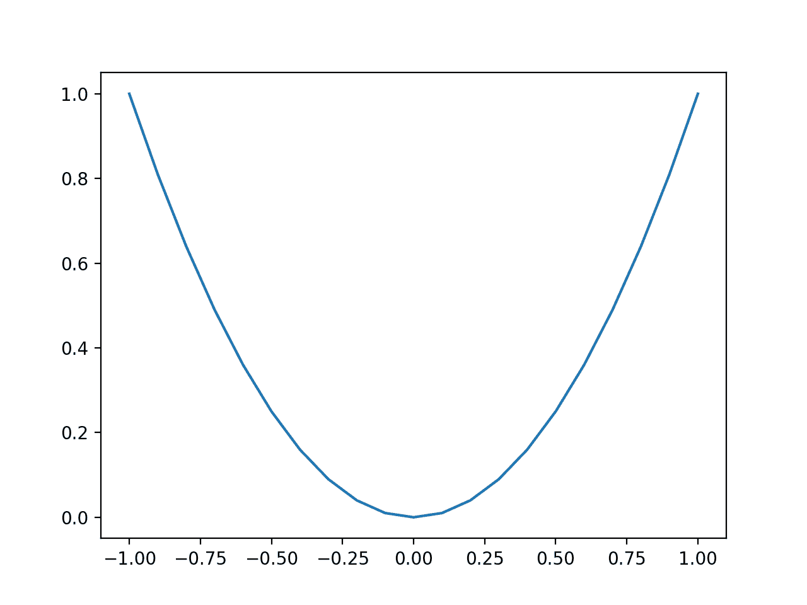

# 什么是机器学习中的梯度？

> 原文：<https://machinelearningmastery.com/gradient-in-machine-learning/>

最后更新于 2021 年 10 月 12 日

**梯度**是优化和机器学习中常用的术语。

例如，深度学习神经网络使用随机梯度下降进行拟合，许多用于拟合机器学习算法的标准优化算法使用梯度信息。

为了理解什么是梯度，你需要从微积分领域理解什么是导数。这包括如何计算导数和解释值。对导数的理解直接适用于理解如何计算和解释优化和机器学习中使用的梯度。

在本教程中，您将发现机器学习中导数和梯度的温和介绍。

完成本教程后，您将知道:

*   函数的导数是给定输入下函数的变化。
*   梯度只是多元函数的导数向量。
*   如何计算和解释简单函数的导数？

**用我的新书[机器学习优化](https://machinelearningmastery.com/optimization-for-machine-learning/)启动你的项目**，包括*分步教程*和所有示例的 *Python 源代码*文件。

Let’s get started.

什么是机器学习中的梯度？
图片由[roanesh](https://www.flickr.com/photos/roanish/26718626464/)提供，保留部分权利。

## 教程概述

本教程分为五个部分；它们是:

1.  什么是导数？
2.  什么是梯度？
3.  计算导数的实例
4.  如何解读导数
5.  如何计算函数的导数

## 什么是导数？

在微积分中，[导数](https://en.wikipedia.org/wiki/Derivative)是实值函数中给定点的变化率。

例如，函数 *f()* 对于变量 x 的导数 *f'(x)* 是函数 *f()* 在点 *x* 处变化的速率。

它可能变化很大，例如非常弯曲，或者可能变化很小，例如轻微弯曲，或者它可能根本不变，例如平坦或静止。

如果我们可以计算函数变量在所有输入点的导数，那么一个[函数是可微的](https://en.wikipedia.org/wiki/Differentiable_function)。不是所有的函数都是可微的。

一旦我们计算了导数，我们可以用很多方法来使用它。

例如，给定一个输入值 *x* 和在该点*f’(x)*的导数，我们可以使用导数估计函数 *f(x)* 在附近点*δ_ x*(在 *x* 中的变化)的值，如下所示:

*   f(x+δ_ x)= f(x)+f '(x)*δ_ x

在这里，我们可以看到 *f'(x)* 是一条线，我们通过*δx*沿着这条线移动来估计附近点的函数值。

我们可以在优化问题中使用导数，因为它们告诉我们如何以增加或减少函数输出的方式改变目标函数的输入，因此我们可以更接近函数的最小值或最大值。

> 导数在优化中很有用，因为它们提供了如何改变给定点以改进目标函数的信息。

—第 32 页，[优化算法](https://amzn.to/39KZSQn)，2019。

找到可以用来逼近附近值的线是分化最初发展的主要原因。这条线被称为切线或函数在给定点的斜率。

> 寻找曲线的切线的问题涉及到寻找相同类型的极限………。这种特殊类型的极限被称为导数，我们将看到它可以被解释为任何科学或工程中的变化率。

—第 104 页，[微积分](https://amzn.to/3kS9I52)，2015 年第 8 版。

下面提供了一个函数点切线的例子，摘自“优化算法”第 19 页



函数在给定点的切线
取自优化算法。

从技术上讲，到目前为止描述的导数被称为一阶导数或一阶导数。

[二阶导数](https://en.wikipedia.org/wiki/Second_derivative)(或二阶导数)是导数函数的导数。即变化率的变化率或函数的变化量。

*   **一阶导数**:目标函数的变化率。
*   **二阶导数**:一阶导数函数的变化率。

二阶导数的一个自然用法是在一个邻近点近似一阶导数，就像我们可以用一阶导数来估计目标函数在一个邻近点的值一样。

现在我们知道导数是什么了，让我们来看看梯度。

## 什么是梯度？

一个[梯度](https://en.wikipedia.org/wiki/Gradient)是一个有多个输入变量的函数的导数。

从线性代数领域的角度来看，这是一个用来指函数导数的术语。特别是线性代数遇到微积分的时候，叫做向量微积分。

> 梯度是多元函数导数的推广。它捕捉了函数的局部斜率，使我们能够预测从一个点向任何方向迈出一小步的效果。

—第 21 页，[优化算法](https://amzn.to/39KZSQn)，2019。

多个输入变量一起定义了一个值向量，例如输入空间中可以提供给目标函数的一个点。

目标函数与输入变量向量的导数同样是向量。每个输入变量的导数向量就是梯度。

*   **梯度(向量演算)**:取输入变量向量的函数的导数向量。

你可能还记得高中代数或微积分前，梯度也通常指二维图上一条线的斜率。

它的计算方法是函数的上升(y 轴上的变化)除以函数的运行(x 轴上的变化)，简化为以下规则:*上升超过运行*:

*   **斜率(代数):**直线的斜率，计算为上升超过运行。

我们可以看到，这是一个简单而粗略的一元函数导数的近似。微积分中的导数函数更精确，因为它使用极限来找到函数在某一点的精确斜率。这种来自代数的梯度思想与最优化和机器学习中使用的梯度思想相关，但并不直接有用。

采用多个输入变量的函数，例如输入变量的向量，可以被称为多元函数。

> 一个函数相对于一个变量的偏导数是假设所有其他输入变量保持不变的导数。

—第 21 页，[优化算法](https://amzn.to/39KZSQn)，2019。

梯度(导数向量)中的每个分量称为目标函数的偏导数。

偏导数假设函数的所有其他变量保持不变。

*   **偏导数**:多元函数的一个变量的导数。

线性代数中处理方阵是很有用的，二阶导数的方阵称为[黑森矩阵](https://en.wikipedia.org/wiki/Hessian_matrix)。

> 多元函数的 Hessian 是包含关于输入的所有二阶导数的矩阵

—第 21 页，[优化算法](https://amzn.to/39KZSQn)，2019。

我们可以互换使用梯度和导数，尽管在优化和机器学习领域，我们通常使用“*梯度*”，因为我们通常关注多元函数。

导数的直觉直接转化为梯度，只是维数更多。

现在我们已经熟悉了导数和梯度的概念，让我们来看一个计算导数的工作示例。

## 计算导数的实例

让我们用一个工作实例来具体说明这个导数。

首先，让我们定义一个简单的一维函数，它对输入进行平方，并定义从-1.0 到 1.0 的有效输入范围。

*   f(x) = x²

以下示例以 0.1 的增量对此函数的输入进行采样，计算每个输入的函数值，并绘制结果图。

```py
# plot of simple function
from numpy import arange
from matplotlib import pyplot

# objective function
def objective(x):
	return x**2.0

# define range for input
r_min, r_max = -1.0, 1.0
# sample input range uniformly at 0.1 increments
inputs = arange(r_min, r_max+0.1, 0.1)
# compute targets
results = objective(inputs)
# create a line plot of input vs result
pyplot.plot(inputs, results)
# show the plot
pyplot.show()
```

运行该示例会创建函数输入(x 轴)和函数计算输出(y 轴)的线图。

我们可以看到熟悉的 U 型叫抛物线。



简单一维函数的线图

我们可以在形状的边上看到一个很大的变化或陡峭的曲线，在函数的中间看到一个平坦的区域，在那里我们可以看到一个很小的导数。

让我们通过计算-0.5 和 0.5(陡峭)和 0.0(平坦)的导数来确认这些预期。

函数的导数计算如下:

*   f'(x) = x * 2

下面的例子为我们的目标函数计算了特定输入点的导数。

```py
# calculate the derivative of the objective function

# derivative of objective function
def derivative(x):
	return x * 2.0

# calculate derivatives
d1 = derivative(-0.5)
print('f\'(-0.5) = %.3f' % d1)
d2 = derivative(0.5)
print('f\'(0.5) = %.3f' % d2)
d3 = derivative(0.0)
print('f\'(0.0) = %.3f' % d3)
```

运行该示例将打印特定输入值的导数值。

我们可以看到，函数陡点处的导数为-1 和 1，函数平坦部分的导数为 0.0。

```py
f'(-0.5) = -1.000
f'(0.5) = 1.000
f'(0.0) = 0.000
```

既然我们知道了如何计算一个函数的导数，我们就来看看如何解释导数的值。

## 如何解读导数

导数的值可以解释为变化率(大小)和方向(符号)。

*   **导数的大小**:变化有多大。
*   **导数符号**:变化方向。

0.0 的导数表示目标函数没有变化，称为静止点。

函数可以有一个或多个静止点，函数的局部或全局最小值(谷底)或最大值(山峰)就是静止点的例子。

> 梯度指向切线超平面的最陡上升方向…

—第 21 页，[优化算法](https://amzn.to/39KZSQn)，2019。

导数的符号告诉你目标函数在那个点是增加还是减少。

*   **正导数**:在那个点上函数在增加。
*   **负导数**:函数在该点递减

这可能会令人困惑，因为从上一节的图来看，函数 f(x)的值在 y 轴上增加了-0.5 和 0.5。

这里的技巧是始终从左到右读取函数的曲线，例如，从左到右跟随 y 轴上的值输入 x 值。

实际上，如果从左向右读，x=-0.5 附近的值会减少，因此会有负导数，x=0.5 附近的值会增加，因此会有正导数。

我们可以想象，如果我们想仅使用梯度信息来找到上一节中函数的最小值，那么如果梯度为负则增加 x 输入值以走下坡路，或者如果梯度为正则减少 x 输入值以走下坡路。

这是可以访问函数梯度信息的梯度下降(和梯度上升)类优化算法的基础。

现在我们知道如何解释导数值，让我们看看如何找到函数的导数。

## 如何计算函数的导数

求输出目标函数 *f()* 变化率的导数函数 *f'()* 称为微分。

有许多计算函数导数的方法(算法)。

在某些情况下，我们可以使用微积分工具来计算函数的导数，手动或使用自动求解器。

计算函数导数的一般技术包括:

*   [有限差分法](https://en.wikipedia.org/wiki/Finite_differences)
*   [符号分化](https://en.wikipedia.org/wiki/Computer_algebra)
*   [自动分化](https://en.wikipedia.org/wiki/Automatic_differentiation)

[SymPy Python 库](https://www.sympy.org/en/index.html)可用于符号微分。

计算库如*和*张量流*可用于自动微分。*

 *如果您的功能易于以纯文本形式指定，也可以使用在线服务。

一个例子是 Wolfram Alpha 网站，它将为您计算函数的导数；例如:

*   [计算 x² 导数](https://www.wolframalpha.com/input/?i=x%5E2)

并不是所有的函数都是可微的，一些可微的函数可能会使某些方法很难求导数。

计算函数的导数超出了本教程的范围。查阅一本好的微积分教科书，比如在进一步阅读部分的那些。

## 进一步阅读

如果您想更深入地了解这个主题，本节将提供更多资源。

### 书

*   [优化算法](https://amzn.to/39KZSQn)，2019。
*   [微积分](https://amzn.to/3fqNSEB)，2017 年第 3 版。(吉尔伯特·斯特朗)
*   [微积分](https://amzn.to/3kS9I52)，第 8 版，2015。(詹姆斯·斯图尔特)

### 文章

*   [衍生，维基百科](https://en.wikipedia.org/wiki/Derivative)。
*   [二阶导数，维基百科](https://en.wikipedia.org/wiki/Second_derivative)。
*   [偏导数，维基百科](https://en.wikipedia.org/wiki/Partial_derivative)。
*   [梯度，维基百科](https://en.wikipedia.org/wiki/Gradient)。
*   [可微函数，维基百科](https://en.wikipedia.org/wiki/Differentiable_function)。
*   [雅可比矩阵与行列式，维基百科](https://en.wikipedia.org/wiki/Jacobian_matrix_and_determinant)。
*   [黑森矩阵，维基百科](https://en.wikipedia.org/wiki/Hessian_matrix)。

## 摘要

在本教程中，您发现了机器学习中导数和梯度的温和介绍。

具体来说，您了解到:

*   函数的导数是给定输入下函数的变化。
*   梯度只是多元函数的导数向量。
*   如何计算和解释简单函数的导数？

**你有什么问题吗？**
在下面的评论中提问，我会尽力回答。*