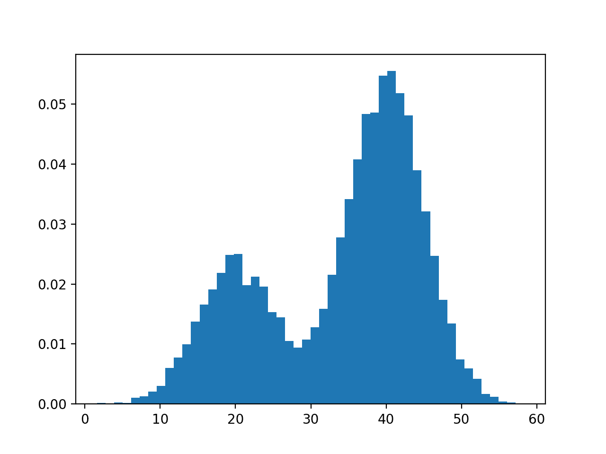

# 期望最大化算法的温和介绍

> 原文：<https://machinelearningmastery.com/expectation-maximization-em-algorithm/>

最后更新于 2020 年 8 月 28 日

最大似然估计是一种通过搜索概率分布及其参数来估计数据集密度的方法。

这是一种通用且有效的方法，是许多机器学习算法的基础，尽管它要求训练数据集是完整的，例如所有相关的交互随机变量都存在。如果存在与数据集中的变量相互作用但被隐藏或未被观察到的变量，即所谓的潜在变量，则最大似然变得难以处理。

期望最大化算法是一种在潜在变量存在的情况下进行最大似然估计的方法。它通过首先估计潜在变量的值，然后优化模型，然后重复这两个步骤，直到收敛。这是一种有效且通用的方法，最常用于缺失数据的密度估计，如高斯混合模型等聚类算法。

在这篇文章中，你将发现期望最大化算法。

看完这篇文章，你会知道:

*   在存在潜在变量的情况下，最大似然估计对数据具有挑战性。
*   期望最大化为具有潜在变量的最大似然估计提供了迭代解。
*   高斯混合模型是一种密度估计方法，其中使用期望最大化算法拟合分布的参数。

**用我的新书[机器学习概率](https://machinelearningmastery.com/probability-for-machine-learning/)启动你的项目**，包括*分步教程*和所有示例的 *Python 源代码*文件。

我们开始吧。

*   **2019 年 11 月更新**:修正代码评论错别字(感谢大牛)


期望最大化(EM 算法)
温和介绍[瓦尔克](https://www.flickr.com/photos/valcker/36015631850/)摄，保留部分权利。

## 概观

本教程分为四个部分；它们是:

1.  最大似然潜变量问题
2.  期望最大化算法
3.  高斯混合模型与电磁算法
4.  高斯混合模型示例

## 最大似然潜变量问题

一个常见的建模问题涉及如何估计数据集的联合概率分布。

[密度估计](https://machinelearningmastery.com/probability-density-estimation/)包括选择一个概率分布函数和该分布的参数，以最好地解释观测数据的联合概率分布。

有许多技术可以解决这个问题，尽管一种常见的方法被称为最大似然估计，或简称为“*最大似然*”

[最大似然估计](https://machinelearningmastery.com/what-is-maximum-likelihood-estimation-in-machine-learning/)涉及到将问题作为一个优化或搜索问题来处理，在这个问题中，我们寻找一组参数，这些参数对数据样本的联合概率产生最佳拟合。

最大似然估计的一个限制是，它假设数据集是完整的，或完全观察到的。这并不意味着模型可以访问所有数据；相反，它假设与问题相关的所有变量都存在。

情况并非总是如此。可能有一些数据集，其中只有一些相关变量可以被观察到，而一些不能，尽管它们影响数据集中的其他随机变量，但它们仍然是隐藏的。

更一般地，这些未观察到或隐藏的变量被称为[潜在变量](https://en.wikipedia.org/wiki/Latent_variable)。

> 许多现实世界的问题都有隐藏变量(有时称为潜变量)，这些变量在可用于学习的数据中是不可观察的。

—第 816 页，[人工智能:现代方法](https://amzn.to/2Y7yCpO)，第 3 版，2009 年。

传统的最大似然估计在存在潜在变量的情况下效果不佳。

> …如果我们有缺失的数据和/或潜在的变量，那么计算[最大似然]估计就变得困难了。

—第 349 页，[机器学习:概率视角](https://amzn.to/2xKSTCP)，2012。

相反，在存在潜在变量的情况下，需要最大似然的替代公式来搜索适当的模型参数。

期望最大化算法就是这样一种方法。

## 期望最大化算法

期望最大化算法，简称 EM 算法，是一种在潜在变量存在的情况下进行最大似然估计的方法。

> 在潜在变量模型中寻找最大似然估计量的一般技术是期望最大化算法。

—第 424 页，[模式识别与机器学习](https://amzn.to/2JwHE7I)，2006。

EM 算法是在两种模式之间循环的迭代方法。第一种模式试图估计缺失或潜在的变量，称为估计步骤或 E 步骤。第二种模式试图优化模型的参数，以最好地解释数据，称为最大化步骤或 M 步骤。

*   **电子步**。估计数据集中缺失的变量。
*   **M 步**。在有数据的情况下最大化模型的参数。

EM 算法可以被非常广泛地应用，尽管它可能在机器学习中最广为人知，用于无监督学习问题，例如密度估计和聚类。

也许讨论最多的 EM 算法的应用是用混合模型进行聚类。

## 高斯混合模型与电磁算法

[混合模型](https://en.wikipedia.org/wiki/Mixture_model)是由多个概率分布函数的未指定组合组成的模型。

使用统计过程或学习算法来估计概率分布的参数，以最佳地拟合给定训练数据集的密度。

高斯混合模型，简称 GMM，是一种混合模型，它使用高斯(正态)概率分布的组合，并要求估计每个概率分布的均值和标准差参数。

虽然最大似然估计可能是最常见的，但是有许多技术可以用来估计 GMM 的参数。

考虑这样一种情况，即一个数据集由许多恰好由两个不同过程生成的点组成。每个过程的点具有高斯概率分布，但是数据被组合，并且分布足够相似，以至于给定点可能属于哪个分布并不明显。

用于生成数据点的过程代表潜在变量，例如过程 0 和过程 1。它影响数据，但不可见。因此，电磁算法是估计分布参数的合适方法。

在 EM 算法中，估计步骤将估计每个数据点的过程潜变量的值，最大化步骤将优化概率分布的参数，以试图最好地捕获数据的密度。重复该过程，直到获得一组良好的潜在值，并获得符合数据的最大似然值。

*   **电子步**。估计每个潜在变量的期望值。
*   **M 步**。使用最大似然法优化分布参数。

我们可以想象这个优化过程如何被约束到仅仅是分布均值，或者被推广到许多不同高斯分布的混合。

## 高斯混合模型示例

我们可以通过一个实例来具体说明 EM 算法在高斯混合模型中的应用。

首先，让我们设计一个问题，我们有一个数据集，其中点是从两个高斯过程之一生成的。这些点是一维的，第一个分布的平均值是 20，第二个分布的平均值是 40，两个分布的标准偏差都是 5。

我们将从第一个过程中抽取 3000 点，从第二个过程中抽取 7000 点，并将其混合在一起。

```py
...
# generate a sample
X1 = normal(loc=20, scale=5, size=3000)
X2 = normal(loc=40, scale=5, size=7000)
X = hstack((X1, X2))
```

然后，我们可以绘制点的直方图，为数据集提供直觉。我们期望看到双峰分布，两种分布的平均值各有一个峰值。

下面列出了完整的示例。

```py
# example of a bimodal constructed from two gaussian processes
from numpy import hstack
from numpy.random import normal
from matplotlib import pyplot
# generate a sample
X1 = normal(loc=20, scale=5, size=3000)
X2 = normal(loc=40, scale=5, size=7000)
X = hstack((X1, X2))
# plot the histogram
pyplot.hist(X, bins=50, density=True)
pyplot.show()
```

运行该示例会创建数据集，然后为数据点创建直方图。

该图清楚地显示了预期的双峰分布，第一过程的峰值在 20 左右，第二过程的峰值在 40 左右。

我们可以看到，对于两个峰值中间的许多点，它们来自哪个分布是不明确的。



由两种不同高斯过程构造的数据集直方图

我们可以使用高斯混合模型来模拟估计该数据集密度的问题。

可以使用[高斯混合](https://Sklearn.org/stable/modules/generated/sklearn.mixture.GaussianMixture.html) Sklearn 类来建模这个问题，并使用期望最大化算法来估计分布的参数。

该类允许我们在定义模型时通过 *n_components* 参数指定用于生成数据的底层进程的可疑数量。对于这两个过程或分布，我们将把它设置为 2。

如果过程的数量未知，可以测试一系列不同数量的组件，并选择最适合的模型，其中可以使用诸如阿卡克或贝叶斯信息标准(AIC 或 BIC)的分数来评估模型。

我们也有许多方法可以配置模型，以包含我们可能知道的关于数据的其他信息，例如如何估计分布的初始值。在这种情况下，我们将通过将 *init_params* 参数设置为“随机”来随机猜测初始参数。

```py
...
# fit model
model = GaussianMixture(n_components=2, init_params='random')
model.fit(X)
```

一旦模型合适，我们就可以通过模型上的参数来访问学习到的参数，例如平均值、协方差、混合权重等等。

更有用的是，我们可以使用拟合模型来估计现有和新数据点的潜在参数。

例如，我们可以为训练数据集中的点估计潜在变量，并且我们期望前 3，000 个点属于一个过程(例如*值=1* )，而接下来的 7，000 个数据点属于不同的过程(例如*值=0* )。

```py
...
# predict latent values
yhat = model.predict(X)
# check latent value for first few points
print(yhat[:100])
# check latent value for last few points
print(yhat[-100:])
```

将所有这些结合在一起，下面列出了完整的示例。

```py
# example of fitting a gaussian mixture model with expectation maximization
from numpy import hstack
from numpy.random import normal
from sklearn.mixture import GaussianMixture
# generate a sample
X1 = normal(loc=20, scale=5, size=3000)
X2 = normal(loc=40, scale=5, size=7000)
X = hstack((X1, X2))
# reshape into a table with one column
X = X.reshape((len(X), 1))
# fit model
model = GaussianMixture(n_components=2, init_params='random')
model.fit(X)
# predict latent values
yhat = model.predict(X)
# check latent value for first few points
print(yhat[:100])
# check latent value for last few points
print(yhat[-100:])
```

运行该示例使用 EM 算法在准备好的数据集上拟合高斯混合模型。拟合后，该模型用于预测训练数据集中示例的潜在变量值。

**注**:考虑到算法或评估程序的随机性，或数值准确率的差异，您的[结果可能会有所不同](https://machinelearningmastery.com/different-results-each-time-in-machine-learning/)。考虑运行该示例几次，并比较平均结果。

在这种情况下，我们可以看到，至少在数据集中的前几个和最后几个示例中，模型主要预测潜在变量的正确值。这通常是一个具有挑战性的问题，预计分布峰值之间的点将保持不明确，并整体分配给一个或另一个过程。

```py
[1 1 1 1 1 1 1 1 1 1 1 1 1 1 1 1 1 1 1 1 1 1 1 1 1 1 1 1 1 1 1 1 1 1 1 1 1
 1 1 1 1 1 1 1 1 1 1 1 1 1 1 1 1 1 1 1 1 1 1 1 1 1 1 1 1 1 1 1 1 1 1 1 1 1
 1 1 1 1 1 1 1 1 1 1 1 1 1 1 1 1 1 1 1 1 1 1 1 1 1 1]
[0 0 0 1 0 0 0 0 0 0 0 0 1 0 0 0 0 1 0 0 0 0 0 0 0 1 0 0 0 0 0 0 0 0 0 1 1
 1 0 0 0 0 0 1 0 0 0 0 0 0 0 1 0 0 0 1 0 1 1 1 0 0 0 0 0 0 0 0 0 0 0 0 0 0
 0 0 0 0 0 0 0 0 0 0 0 0 0 0 0 0 0 0 0 0 0 0 0 0 0 0]
```

## 进一步阅读

如果您想更深入地了解这个主题，本节将提供更多资源。

### 书

*   第 8.5 节 EM 算法，[统计学习的要素](https://amzn.to/2YVqu8s)，2016。
*   第九章混合模型与 EM，[模式识别与机器学习](https://amzn.to/2JwHE7I)，2006。
*   第 6.12 节 EM 算法，[机器学习](https://amzn.to/2jWd51p)，1997。
*   第十一章混合模型和 EM 算法，[机器学习:概率观点](https://amzn.to/2xKSTCP)，2012。
*   第 9.3 节聚类和概率密度估计，[数据挖掘:实用机器学习工具和技术](https://amzn.to/2lnW5S7)，第 4 版，2016。
*   第 20.3 节带隐藏变量的学习:EM 算法，[人工智能:现代方法](https://amzn.to/2Y7yCpO)，第 3 版，2009。

### 应用程序接口

*   [高斯混合模型，Sklearn API](https://Sklearn.org/stable/modules/mixture.html) 。
*   [sklearn . mixture . Gaussian mixture API](https://Sklearn.org/stable/modules/generated/sklearn.mixture.GaussianMixture.html)。

### 文章

*   [最大似然估计，维基百科](https://en.wikipedia.org/wiki/Maximum_likelihood_estimation)。
*   [期望最大化算法，维基百科](https://en.wikipedia.org/wiki/Expectation%E2%80%93maximization_algorithm)。
*   [混合模型，维基百科](https://en.wikipedia.org/wiki/Mixture_model)。

## 摘要

在这篇文章中，你发现了期望最大化算法。

具体来说，您了解到:

*   在存在潜在变量的情况下，最大似然估计对数据具有挑战性。
*   期望最大化为具有潜在变量的最大似然估计提供了迭代解。
*   高斯混合模型是一种密度估计方法，其中使用期望最大化算法拟合分布的参数。

你有什么问题吗？
在下面的评论中提问，我会尽力回答。