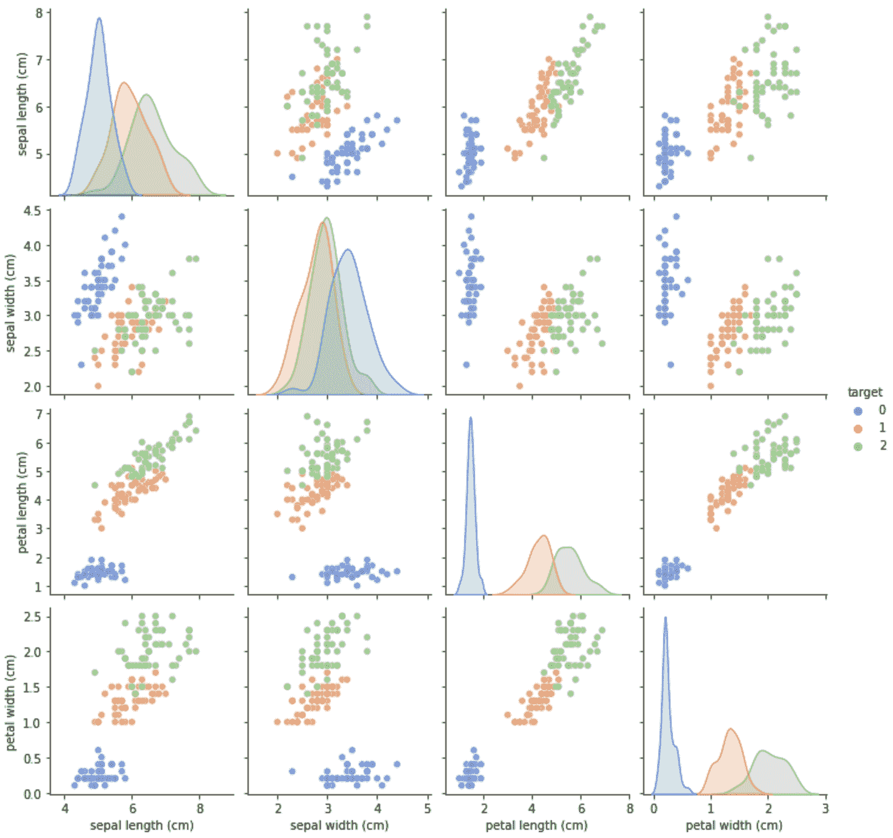
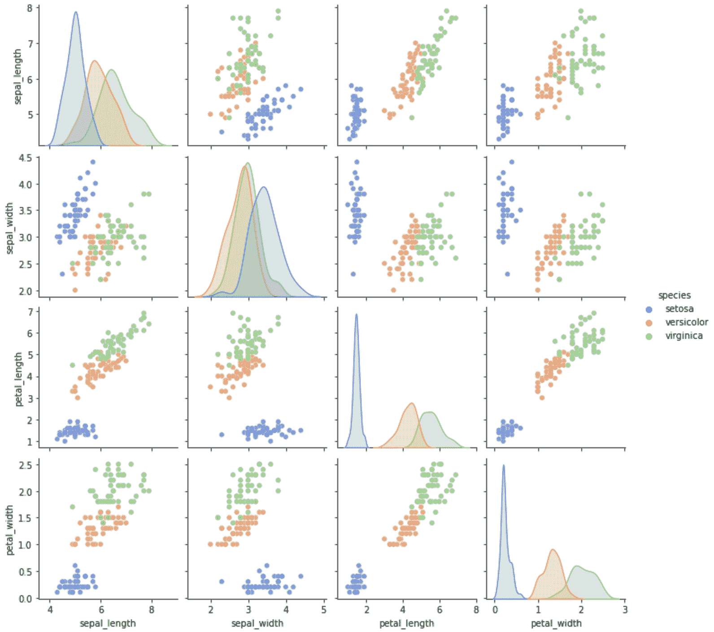
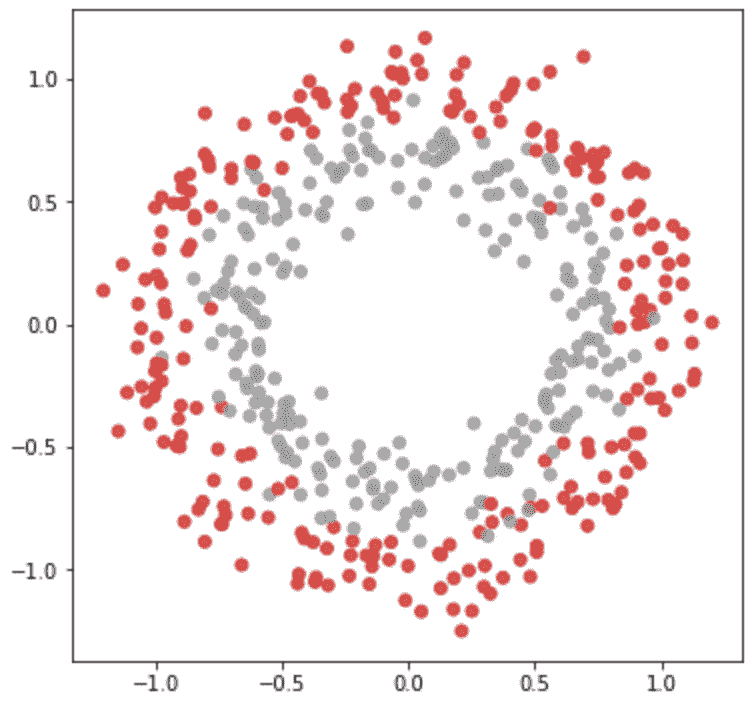
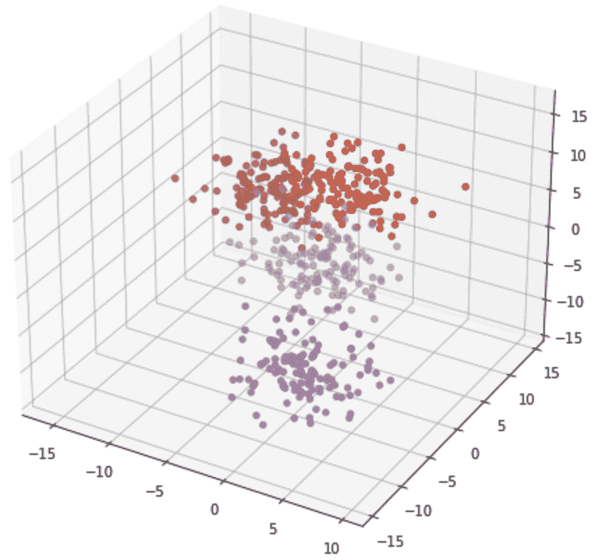
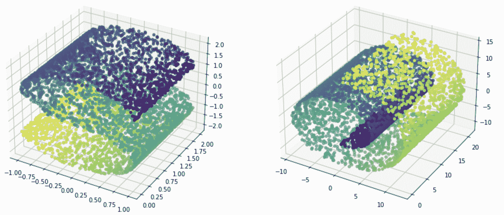

# 《获取机器学习数据集的指南》

> 原文：[`machinelearningmastery.com/a-guide-to-getting-datasets-for-machine-learning-in-python/`](https://machinelearningmastery.com/a-guide-to-getting-datasets-for-machine-learning-in-python/)

与其他编程练习相比，机器学习项目是代码和数据的结合。你需要两者才能实现结果并做些有用的事情。多年来，许多著名的数据集被创建，许多已经成为标准或基准。在本教程中，我们将学习如何轻松获取这些著名的公共数据集。如果现有的数据集都不符合我们的需求，我们还将学习如何生成合成数据集。

完成本教程后，你将知道：

+   如何寻找适合机器学习项目的免费数据集

+   如何使用 Python 中的库下载数据集

+   如何使用 scikit-learn 生成合成数据集

**启动你的项目**，阅读我的新书 [Python for Machine Learning](https://machinelearningmastery.com/python-for-machine-learning/)，包括 *逐步教程* 和 *所有示例的 Python 源代码* 文件。

让我们开始吧。

《获取机器学习数据集的指南》

图片由 [Olha Ruskykh](https://www.pexels.com/photo/close-up-shot-of-cassette-tapes-with-small-pieces-of-flowers-7166023/) 提供。保留一些权利。

## 教程概述

本教程分为四个部分；它们是：

1.  数据集库

1.  在 scikit-learn 和 Seaborn 中检索数据集

1.  在 TensorFlow 中检索数据集

1.  在 scikit-learn 中生成数据集

## 数据集库

机器学习已经发展了几十年，因此有些数据集具有历史意义。一个最著名的数据集库是[UCI 机器学习库](https://archive.ics.uci.edu/ml/index.php)。那里的大多数数据集都很小，因为当时的技术还不够先进，无法处理更大的数据。一些著名的数据集包括 1936 年 Ronald Fisher 介绍的鸢尾花数据集和 20 个新闻组数据集（通常在信息检索文献中提到的文本数据）。

较新的数据集通常更大。例如，ImageNet 数据集超过 160 GB。这些数据集通常可以在 [Kaggle](https://www.kaggle.com/) 上找到，我们可以按名称搜索它们。如果需要下载，建议在注册账户后使用 Kaggle 的命令行工具。

[OpenML](https://www.openml.org/) 是一个较新的数据集库，托管了大量的数据集。它非常方便，因为你可以按名称搜索数据集，但它也提供了一个标准化的网络 API 供用户检索数据。如果你想使用 Weka，这个库会很有用，因为它提供 ARFF 格式的文件。

但仍然，有许多数据集公开可用，但由于各种原因不在这些存储库中。你还可以查看维基百科上的“[机器学习研究数据集列表](https://en.wikipedia.org/wiki/List_of_datasets_for_machine_learning_research)”。该页面包含了长长的一列数据集，按不同类别归类，并提供了下载链接。

## 在 scikit-learn 和 Seaborn 中检索数据集

显而易见，你可以通过从网络上下载这些数据集来获取它们，无论是通过浏览器、命令行、使用`wget`工具，还是使用 Python 中的`requests`等网络库。由于其中一些数据集已成为标准或基准，许多机器学习库都创建了帮助检索它们的函数。出于实际考虑，通常这些数据集不会与库一起提供，而是在调用函数时实时下载。因此，你需要有稳定的互联网连接才能使用这些数据集。

Scikit-learn 是一个可以通过其 API 下载数据集的例子。相关函数定义在`sklearn.datasets`下，你可以查看函数列表：

+   [`scikit-learn.org/stable/modules/classes.html#module-sklearn.datasets`](https://scikit-learn.org/stable/modules/classes.html#module-sklearn.datasets)

例如，你可以使用`load_iris()`函数获取鸢尾花数据集，如下所示：

```py
import sklearn.datasets

data, target = sklearn.datasets.load_iris(return_X_y=True, as_frame=True)
data["target"] = target
print(data)
```

`load_iris()`函数会返回 numpy 数组（即，没有列标题），而不是 pandas DataFrame，除非指定参数`as_frame=True`。另外，我们将`return_X_y=True`传递给函数，因此仅返回机器学习特征和目标，而不是一些元数据，如数据集的描述。上述代码打印如下内容：

```py
     sepal length (cm)  sepal width (cm)  petal length (cm)  petal width (cm)  target
0                  5.1               3.5                1.4               0.2       0
1                  4.9               3.0                1.4               0.2       0
2                  4.7               3.2                1.3               0.2       0
3                  4.6               3.1                1.5               0.2       0
4                  5.0               3.6                1.4               0.2       0
..                 ...               ...                ...               ...     ...
145                6.7               3.0                5.2               2.3       2
146                6.3               2.5                5.0               1.9       2
147                6.5               3.0                5.2               2.0       2
148                6.2               3.4                5.4               2.3       2
149                5.9               3.0                5.1               1.8       2

[150 rows x 5 columns]
```

将特征和目标分开对训练 scikit-learn 模型很方便，但将它们结合起来对可视化会有帮助。例如，我们可以如上所述合并 DataFrame，然后使用 Seaborn 可视化相关图：

```py
import sklearn.datasets
import matplotlib.pyplot as plt
import seaborn as sns

data, target = sklearn.datasets.load_iris(return_X_y=True, as_frame=True)
data["target"] = target

sns.pairplot(data, kind="scatter", diag_kind="kde", hue="target",
             palette="muted", plot_kws={'alpha':0.7})
plt.show()
```



从相关图中，我们可以看到目标 0 容易区分，但目标 1 和目标 2 通常有一些重叠。因为这个数据集也用于演示绘图函数，我们可以从 Seaborn 中找到等效的数据加载函数。我们可以将上述代码改写为以下内容：

```py
import matplotlib.pyplot as plt
import seaborn as sns

data = sns.load_dataset("iris")
sns.pairplot(data, kind="scatter", diag_kind="kde", hue="species",
             palette="muted", plot_kws={'alpha':0.7})
plt.show()
```



Seaborn 支持的数据集比较有限。我们可以通过运行以下命令查看所有受支持的数据集名称：

```py
import seaborn as sns
print(sns.get_dataset_names())
```

下面是 Seaborn 中的所有数据集：

```py
['anagrams', 'anscombe', 'attention', 'brain_networks', 'car_crashes',
'diamonds', 'dots', 'exercise', 'flights', 'fmri', 'gammas', 'geyser',
'iris', 'mpg', 'penguins', 'planets', 'taxis', 'tips', 'titanic']
```

有一些类似的函数可以从 scikit-learn 加载“[玩具数据集](https://scikit-learn.org/stable/datasets/toy_dataset.html)”。例如，我们有`load_wine()`和`load_diabetes()`，它们的定义方式类似。

较大的数据集也是类似的。例如，我们有`fetch_california_housing()`，需要从互联网下载数据集（因此函数名称中包含“fetch”）。Scikit-learn 文档将这些称为“[真实世界数据集](https://scikit-learn.org/stable/datasets/real_world.html)” ，但实际上，玩具数据集同样真实。

```py
import sklearn.datasets

data = sklearn.datasets.fetch_california_housing(return_X_y=False, as_frame=True)
data = data["frame"]
print(data)
```

```py
       MedInc  HouseAge  AveRooms  AveBedrms  Population  AveOccup  Latitude  Longitude  MedHouseVal
0      8.3252      41.0  6.984127   1.023810       322.0  2.555556     37.88    -122.23        4.526
1      8.3014      21.0  6.238137   0.971880      2401.0  2.109842     37.86    -122.22        3.585
2      7.2574      52.0  8.288136   1.073446       496.0  2.802260     37.85    -122.24        3.521
3      5.6431      52.0  5.817352   1.073059       558.0  2.547945     37.85    -122.25        3.413
4      3.8462      52.0  6.281853   1.081081       565.0  2.181467     37.85    -122.25        3.422
...       ...       ...       ...        ...         ...       ...       ...        ...          ...
20635  1.5603      25.0  5.045455   1.133333       845.0  2.560606     39.48    -121.09        0.781
20636  2.5568      18.0  6.114035   1.315789       356.0  3.122807     39.49    -121.21        0.771
20637  1.7000      17.0  5.205543   1.120092      1007.0  2.325635     39.43    -121.22        0.923
20638  1.8672      18.0  5.329513   1.171920       741.0  2.123209     39.43    -121.32        0.847
20639  2.3886      16.0  5.254717   1.162264      1387.0  2.616981     39.37    -121.24        0.894

[20640 rows x 9 columns]
```

如果我们需要更多，scikit-learn 提供了一个方便的函数从 OpenML 读取任何数据集。例如，

```py
import sklearn.datasets

data = sklearn.datasets.fetch_openml("diabetes", version=1, as_frame=True, return_X_y=False)
data = data["frame"]
print(data)
```

```py
     preg   plas  pres  skin   insu  mass   pedi   age            class
0     6.0  148.0  72.0  35.0    0.0  33.6  0.627  50.0  tested_positive
1     1.0   85.0  66.0  29.0    0.0  26.6  0.351  31.0  tested_negative
2     8.0  183.0  64.0   0.0    0.0  23.3  0.672  32.0  tested_positive
3     1.0   89.0  66.0  23.0   94.0  28.1  0.167  21.0  tested_negative
4     0.0  137.0  40.0  35.0  168.0  43.1  2.288  33.0  tested_positive
..    ...    ...   ...   ...    ...   ...    ...   ...              ...
763  10.0  101.0  76.0  48.0  180.0  32.9  0.171  63.0  tested_negative
764   2.0  122.0  70.0  27.0    0.0  36.8  0.340  27.0  tested_negative
765   5.0  121.0  72.0  23.0  112.0  26.2  0.245  30.0  tested_negative
766   1.0  126.0  60.0   0.0    0.0  30.1  0.349  47.0  tested_positive
767   1.0   93.0  70.0  31.0    0.0  30.4  0.315  23.0  tested_negative

[768 rows x 9 columns]
```

有时，我们不应该使用名称在 OpenML 中识别数据集，因为可能有多个同名的数据集。我们可以在 OpenML 上搜索数据 ID，并在函数中使用如下：

```py
import sklearn.datasets

data = sklearn.datasets.fetch_openml(data_id=42437, return_X_y=False, as_frame=True)
data = data["frame"]
print(data)
```

以上代码中的数据 ID 指的是泰坦尼克号数据集。我们可以扩展代码如下，展示如何获取泰坦尼克号数据集，然后运行逻辑回归：

```py
from sklearn.linear_model import LogisticRegression
from sklearn.datasets import fetch_openml

X, y = fetch_openml(data_id=42437, return_X_y=True, as_frame=False)
clf = LogisticRegression(random_state=0).fit(X, y)
print(clf.score(X,y)) # accuracy
print(clf.coef_)      # coefficient in logistic regression
```

```py
0.8114478114478114
[[-0.7551392   2.24013347 -0.20761281  0.28073571  0.24416706 -0.36699113
   0.4782924 ]]
```

### 想要开始 Python 机器学习吗？

现在免费订阅我的 7 天电子邮件速成课程（包含示例代码）。

单击注册并获得课程的免费 PDF 电子书版本。

## 在 TensorFlow 中检索数据集

除了 scikit-learn，TensorFlow 是另一个可以用于机器学习项目的工具。出于类似的原因，TensorFlow 还有一个数据集 API，以最适合 TensorFlow 的格式提供数据集。与 scikit-learn 不同，这个 API 不是标准 TensorFlow 包的一部分。您需要使用以下命令安装它：

```py
pip install tensorflow-datasets
```

所有数据集的列表可在目录中找到：

+   [`www.tensorflow.org/datasets/catalog/overview#all_datasets`](https://www.tensorflow.org/datasets/catalog/overview#all_datasets)

所有数据集都有一个名称。这些名称可以在上述目录中找到。您也可以使用以下方法获取名称列表：

```py
import tensorflow_datasets as tfds
print(tfds.list_builders())
```

打印超过 1,000 个名称。

例如，让我们以 MNIST 手写数字数据集为例。我们可以按如下方式下载数据：

```py
import tensorflow_datasets as tfds
ds = tfds.load("mnist", split="train", shuffle_files=True)
print(ds)
```

这显示我们使用`tfds.load()`会得到一个`tensorflow.data.OptionsDataset`类型的对象：

```py
<_OptionsDataset shapes: {image: (28, 28, 1), label: ()}, types: {image: tf.uint8, label: tf.int64}>
```

特别是，这个数据集将数据实例（图像）存储在形状为（28,28,1）的 numpy 数组中，目标（标签）是标量。

经过轻微的整理，数据即可在 Keras 的`fit()`函数中使用。一个示例如下：

```py
import tensorflow as tf
import tensorflow_datasets as tfds
from tensorflow.keras.models import Sequential
from tensorflow.keras.layers import Conv2D, Dense, AveragePooling2D, Dropout, Flatten
from tensorflow.keras.callbacks import EarlyStopping

# Read data with train-test split
ds_train, ds_test = tfds.load("mnist", split=['train', 'test'],
                              shuffle_files=True, as_supervised=True)

# Set up BatchDataset from the OptionsDataset object
ds_train = ds_train.batch(32)
ds_test = ds_test.batch(32)

# Build LeNet5 model and fit
model = Sequential([
    Conv2D(6, (5,5), input_shape=(28,28,1), padding="same", activation="tanh"),
    AveragePooling2D((2,2), strides=2),
    Conv2D(16, (5,5), activation="tanh"),
    AveragePooling2D((2,2), strides=2),
    Conv2D(120, (5,5), activation="tanh"),
    Flatten(),
    Dense(84, activation="tanh"),
    Dense(10, activation="softmax")
])
model.compile(loss="sparse_categorical_crossentropy", optimizer="adam", metrics=["sparse_categorical_accuracy"])
earlystopping = EarlyStopping(monitor="val_loss", patience=2, restore_best_weights=True)
model.fit(ds_train, validation_data=ds_test, epochs=100, callbacks=[earlystopping])
```

如果我们提供`as_supervised=True`，数据集将是元组（特征，目标）的记录，而不是字典。这对于 Keras 是必需的。此外，为了在`fit()`函数中使用数据集，我们需要创建一个批次的可迭代对象。通过设置数据集的批次大小，将其从`OptionsDataset`对象转换为`BatchDataset`对象。

我们应用了 LeNet5 模型进行图像分类。但由于数据集中的目标是一个数值（0 到 9），而不是布尔向量，因此我们要求 Keras 在计算精度和损失之前将 softmax 输出向量转换为数字，方法是在`compile()`函数中指定`sparse_categorical_accuracy`和`sparse_categorical_crossentropy`。

关键在于理解每个数据集的形状都是不同的。当你用它与你的 TensorFlow 模型时，你需要调整模型以适应数据集。

## 在 scikit-learn 中生成数据集

在 scikit-learn 中，有一组非常有用的函数可以生成具有特定属性的数据集。由于我们可以控制合成数据集的属性，这对于在特定情况下评估模型性能非常有帮助，这种情况在其他数据集中不常见。

Scikit-learn 文档称这些函数为**样本生成器**。它使用起来很简单，例如：

```py
from sklearn.datasets import make_circles
import matplotlib.pyplot as plt

data, target = make_circles(n_samples=500, shuffle=True, factor=0.7, noise=0.1)
plt.figure(figsize=(6,6))
plt.scatter(data[:,0], data[:,1], c=target, alpha=0.8, cmap="Set1")
plt.show()
```



`make_circles()`函数生成二维平面中散布点的坐标，这些点以同心圆的形式排列为两个类别。我们可以通过参数`factor`和`noise`来控制圆的大小和重叠程度。这个合成数据集对于评估分类模型（如支持向量机）很有帮助，因为没有线性分隔器可用。

`make_circles()`生成的输出始终分为两个类别，坐标总是在二维空间中。但是一些其他函数可以生成更多类别或更高维度的点，例如`make_blob()`。在下面的示例中，我们生成了一个包含 4 个类别的三维数据集：

```py
from sklearn.datasets import make_blobs
import matplotlib.pyplot as plt

data, target = make_blobs(n_samples=500, n_features=3, centers=4,
                          shuffle=True, random_state=42, cluster_std=2.5)

fig = plt.figure(figsize=(8,8))
ax = fig.add_subplot(projection='3d')
ax.scatter(data[:,0], data[:,1], data[:,2], c=target, alpha=0.7, cmap="Set1")
plt.show()
```



还有一些函数用于生成回归问题的数据集。例如，`make_s_curve()`和`make_swiss_roll()`将生成三维坐标，目标值为连续值。

```py
from sklearn.datasets import make_s_curve, make_swiss_roll
import matplotlib.pyplot as plt

data, target = make_s_curve(n_samples=5000, random_state=42)

fig = plt.figure(figsize=(15,8))
ax = fig.add_subplot(121, projection='3d')
ax.scatter(data[:,0], data[:,1], data[:,2], c=target, alpha=0.7, cmap="viridis")

data, target = make_swiss_roll(n_samples=5000, random_state=42)
ax = fig.add_subplot(122, projection='3d')
ax.scatter(data[:,0], data[:,1], data[:,2], c=target, alpha=0.7, cmap="viridis")

plt.show()
```



如果我们不希望从几何角度查看数据，还有`make_classification()`和`make_regression()`。与其他函数相比，这两个函数提供了更多对特征集的控制，例如引入一些冗余或无关的特征。

下面是使用`make_regression()`生成数据集并进行线性回归的示例：

```py
from sklearn.datasets import make_regression
from sklearn.linear_model import LinearRegression
import numpy as np

# Generate 10-dimensional features and 1-dimensional targets
X, y = make_regression(n_samples=500, n_features=10, n_targets=1, n_informative=4,
                       noise=0.5, bias=-2.5, random_state=42)

# Run linear regression on the data
reg = LinearRegression()
reg.fit(X, y)

# Print the coefficient and intercept found
with np.printoptions(precision=5, linewidth=100, suppress=True):
    print(np.array(reg.coef_))
    print(reg.intercept_)
```

在上面的示例中，我们创建了 10 维特征，但只有 4 个特征是有用的。因此，从回归结果中我们发现只有 4 个系数显著非零。

```py
[-0.00435 -0.02232 19.0113   0.04391 46.04906 -0.02882 -0.05692 28.61786 -0.01839 16.79397]
-2.5106367126731413
```

使用`make_classification()`的一个类似示例如下。在这个案例中使用了支持向量机分类器：

```py
from sklearn.datasets import make_classification
from sklearn.svm import SVC
import numpy as np

# Generate 10-dimensional features and 3-class targets
X, y = make_classification(n_samples=1000, n_features=10, n_classes=3,
                           n_informative=4, n_redundant=2, n_repeated=1,
                           random_state=42)

# Run SVC on the data
clf = SVC(kernel="rbf")
clf.fit(X, y)

# Print the accuracy
print(clf.score(X, y))
```

## 进一步阅读

本节提供了更多关于该主题的资源，如果你希望深入了解。

### 仓库

+   [UCI 机器学习库](https://archive.ics.uci.edu/ml/index.php)

+   [Kaggle](https://www.kaggle.com/)

+   [OpenML](https://www.openml.org/)

+   维基百科，[`en.wikipedia.org/wiki/List_of_datasets_for_machine-learning_research`](https://en.wikipedia.org/wiki/List_of_datasets_for_machine-learning_research)

### 文章

+   [机器学习研究的数据集列表](https://en.wikipedia.org/wiki/List_of_datasets_for_machine-learning_research)，维基百科

+   [scikit-learn 玩具数据集](https://scikit-learn.org/stable/datasets/toy_dataset.html)

+   [scikit-learn 真实世界数据集](https://scikit-learn.org/stable/datasets/real_world.html)

+   [TensorFlow 数据集目录](https://www.tensorflow.org/datasets/catalog/overview#all_datasets)

+   [使用 TensorFlow 数据集的 Keras 训练 MNIST 神经网络](https://www.tensorflow.org/datasets/keras_example)

### API

+   [Kaggle API 和工具](https://www.kaggle.com/docs/api)

+   [TensorFlow 数据集](https://www.tensorflow.org/datasets)

+   [scikit-learn 数据集](https://scikit-learn.org/stable/modules/classes.html#module-sklearn.datasets)

+   [scikit-learn 样本生成器](https://scikit-learn.org/stable/modules/classes.html#samples-generator)

## 总结

在本教程中，你了解了在 Python 中加载常见数据集或生成数据集的各种选项。

具体来说，你学到了：

+   如何在 scikit-learn、Seaborn 和 TensorFlow 中使用数据集 API 加载常见的机器学习数据集

+   不同 API 返回的数据集格式的小差异及其使用方法

+   如何使用 scikit-learn 生成数据集
