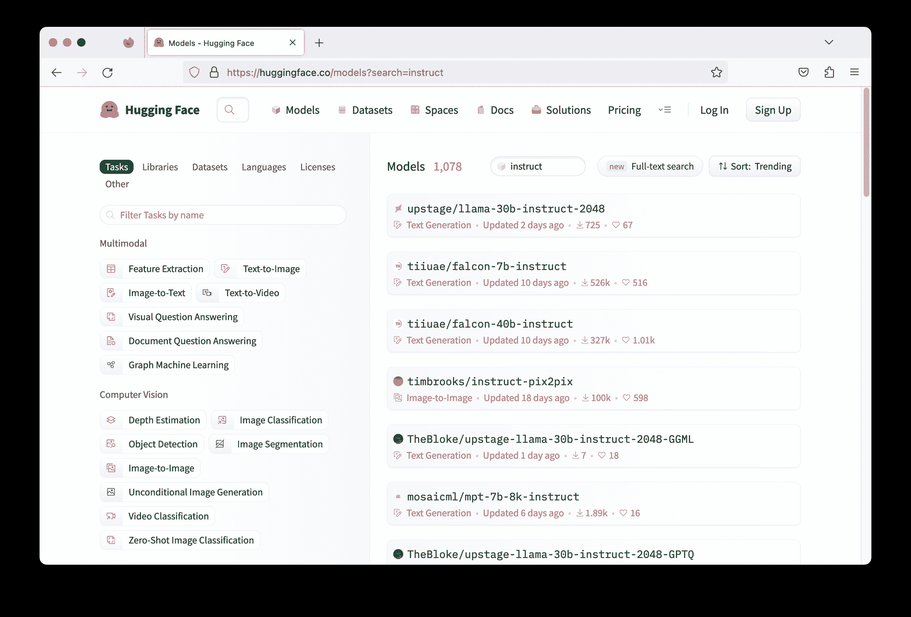

# 在家构建你的迷你 ChatGPT

> 原文：[`machinelearningmastery.com/building-your-mini-chatgpt-at-home/`](https://machinelearningmastery.com/building-your-mini-chatgpt-at-home/)

ChatGPT 非常有趣。你可能也希望拥有一个私人运行的副本。实际上，这是不可能的，因为 ChatGPT 不是可以下载的软件，并且需要巨大的计算能力才能运行。但你可以构建一个可以在普通硬件上运行的简化版本。在这篇文章中，你将了解

+   能像 ChatGPT 一样表现的语言模型

+   如何使用高级语言模型构建聊天机器人


在家构建你的迷你 ChatGPT

图片由作者使用 Stable Diffusion 生成。保留一些权利。

让我们开始吧。

## 概述

本文分为三个部分；它们是：

+   什么是指令跟随模型？

+   如何寻找指令跟随模型

+   构建一个简单的聊天机器人

## 什么是指令跟随模型？

语言模型是机器学习模型，它们可以根据句子的前文预测单词的概率。如果我们要求模型提供下一个单词，并将其反馈给模型以请求更多内容，模型就在进行文本生成。

文本生成模型是许多大型语言模型（如 GPT3）的核心理念。然而，指令跟随模型是经过微调的文本生成模型，专门学习对话和指令。它的操作方式像是两个人之间的对话，一个人说完一句话，另一个人相应地回应。

因此，文本生成模型可以帮助你在有开头句子的情况下完成一段文字。但指令跟随模型可以回答你的问题或按要求做出回应。

这并不意味着你不能使用文本生成模型来构建聊天机器人。但是，你应该使用经过微调的指令跟随模型，它能提供更高质量的结果。

## 如何寻找指令跟随模型

现在你可能会发现很多指令跟随模型。但是，要构建一个聊天机器人，你需要一个容易操作的模型。

一个方便的资源库是 Hugging Face。那里提供的模型应与 Hugging Face 的 transformers 库一起使用。这非常有帮助，因为不同的模型可能会有细微的差别。虽然让你的 Python 代码支持多种模型可能很繁琐，但 transformers 库统一了它们，并隐藏了这些差异。



通常，指令跟随模型在模型名称中会带有关键词“instruct”。在 Hugging Face 上用这个关键词搜索可以找到超过一千个模型。但并非所有模型都能工作。你需要查看每一个模型，并阅读它们的模型卡，以了解这个模型可以做什么，从而选择最合适的一个。

选择你的模型时，有几个技术标准需要考虑：

+   **模型的训练数据是什么：** 具体来说，这意味着模型可以使用什么语言。一个用英语小说文本训练的模型可能对一个德语物理聊天机器人没有帮助。

+   **它使用的深度学习库是什么：** 通常，Hugging Face 中的模型是使用 TensorFlow、PyTorch 和 Flax 构建的。并非所有模型都有所有库的版本。你需要确保在运行`transformers`模型之前，已安装了特定的库。

+   **模型需要哪些资源：** 模型可能非常庞大。通常，它需要 GPU 来运行。但有些模型需要非常高端的 GPU，甚至多个高端 GPU。你需要确认你的资源是否支持模型推理。

## 构建一个简单的聊天机器人

让我们构建一个简单的聊天机器人。这个聊天机器人只是一个在命令行中运行的程序，它从用户那里获取一行文本作为输入，并生成一行由语言模型生成的文本作为回应。

为这个任务选择的模型是`falcon-7b-instruct`。它是一个拥有 70 亿参数的模型。由于它是为最佳性能设计的，需要在 bfloat16 浮点数下运行，因此你可能需要使用现代 GPU，例如 nVidia RTX 3000 系列。利用 Google Colab 上的 GPU 资源或 AWS 上的适当 EC2 实例也是一种选择。

要在 Python 中构建聊天机器人，过程如下：

```py
while True:
    user_input = input("> ")
    print(response)
```

`input("> ")`函数从用户那里获取一行输入。你会在屏幕上看到字符串`"> "`来提示你的输入。输入会在你按下 Enter 后被捕获。

剩下的问题是如何获取响应。在 LLM 中，你将输入或提示作为令牌 ID（整数）的序列提供，模型会回应另一个令牌 ID 序列。在与 LLM 交互前后，你应该在整数序列和文本字符串之间进行转换。令牌 ID 对每个模型都是特定的；也就是说，对于相同的整数，不同模型表示不同的词。

Hugging Face 库`transformers`旨在简化这些步骤。你只需创建一个管道并指定模型名称以及其他几个参数。设置一个使用 bfloat16 浮点数的模型名称为`tiiuae/falcon-7b-instruct`的管道，并允许模型在有 GPU 时使用，配置如下：

```py
from transformers import AutoTokenizer, pipeline
import torch

model = "tiiuae/falcon-7b-instruct"
tokenizer = AutoTokenizer.from_pretrained(model)
pipeline = pipeline(
    "text-generation",
    model=model,
    tokenizer=tokenizer,
    torch_dtype=torch.bfloat16,
    trust_remote_code=True,
    device_map="auto",
)
```

这个管道被创建为`"text-generation"`，因为这是模型卡建议的工作方式。`transformers`中的管道是用于特定任务的一系列步骤。文本生成就是这些任务之一。

使用管道时，你需要指定更多的参数来生成文本。请记住，模型并不是直接生成文本，而是生成令牌的概率。你必须从这些概率中确定下一个词，并重复这个过程以生成更多词。通常，这个过程会引入一些变异，通过不选择概率最高的单一令牌，而是根据概率分布进行采样。

以下是如何使用管道的步骤：

```py
newline_token = tokenizer.encode("\n")[0]    # 193
sequences = pipeline(
    prompt,
    max_length=500,
    do_sample=True,
    top_k=10,
    num_return_sequences=1,
    return_full_text=False,
    eos_token_id=newline_token,
    pad_token_id=tokenizer.eos_token_id,
)
```

你将提示内容提供给变量`prompt`来生成输出序列。你可以让模型给出几个选项，但在这里你设置了`num_return_sequences=1`，因此只会有一个选项。你还让模型使用采样来生成文本，但只从 10 个最高概率的标记中进行采样（`top_k=10`）。返回的序列不会包含你的提示，因为你设置了`return_full_text=False`。最重要的参数是`eos_token_id=newline_token`和`pad_token_id=tokenizer.eos_token_id`。这些参数用于让模型连续生成文本，但仅到换行符为止。换行符的标记 ID 是 193，来自代码片段的第一行。

返回的`sequences`是一个字典列表（在这种情况下是一个字典的列表）。每个字典包含标记序列和字符串。我们可以很容易地打印字符串，如下所示：

```py
print(sequences[0]["generated_text"])
```

语言模型是无记忆的。它不会记住你使用模型的次数以及之前使用的提示。每次都是新的，因此你需要向模型提供之前对话的历史。这很简单。但因为它是一个会话处理模型，你需要记住在提示中识别出谁说了什么。假设这是 Alice 和 Bob 之间的对话（或任何名字）。你需要在提示中每个句子前加上他们的名字，如下所示：

```py
Alice: What is relativity?
Bob:
```

然后模型应该生成与对话匹配的文本。一旦从模型获得响应，将其与来自 Alice 的其他文本一起追加到提示中，然后再次发送给模型。将所有内容结合起来，以下是一个简单的聊天机器人：

```py
from transformers import AutoTokenizer, pipeline
import torch

model = "tiiuae/falcon-7b-instruct"
tokenizer = AutoTokenizer.from_pretrained(model)
pipeline = pipeline(
    "text-generation",
    model=model,
    tokenizer=tokenizer,
    torch_dtype=torch.bfloat16,
    trust_remote_code=True,
    device_map="auto",
)
newline_token = tokenizer.encode("\n")[0]
my_name = "Alice"
your_name = "Bob"
dialog = []

while True:
    user_input = input("> ")
    dialog.append(f"{my_name}: {user_input}")
    prompt = "\n".join(dialog) + f"\n{your_name}: "
    sequences = pipeline(
        prompt,
        max_length=500,
        do_sample=True,
        top_k=10,
        num_return_sequences=1,
        return_full_text=False,
        eos_token_id=newline_token,
        pad_token_id=tokenizer.eos_token_id,
    )
    print(sequences[0]['generated_text'])
    dialog.append("Bob: "+sequences[0]['generated_text'])
```

注意`dialog`变量如何在每次迭代中更新以跟踪对话，以及如何用它来设置变量`prompt`以进行下一次管道运行。

当你尝试用聊天机器人问“什么是相对论”时，它的回答听起来不够专业。这时你需要进行一些提示工程。你可以让 Bob 成为物理学教授，这样他就能对这个话题给出更详细的回答。这就是 LLMs 的魔力，通过简单地改变提示来调整响应。你只需要在对话开始之前添加一个描述。更新后的代码如下（现在`dialog`初始化时带有角色描述）：

```py
from transformers import AutoTokenizer, pipeline
import torch

model = "tiiuae/falcon-7b-instruct"
tokenizer = AutoTokenizer.from_pretrained(model)
pipeline = pipeline(
    "text-generation",
    model=model,
    tokenizer=tokenizer,
    torch_dtype=torch.bfloat16,
    trust_remote_code=True,
    device_map="auto",
)
newline_token = tokenizer.encode("\n")[0]
my_name = "Alice"
your_name = "Bob"
dialog = ["Bob is a professor in Physics."]

while True:
    user_input = input("> ")
    dialog.append(f"{my_name}: {user_input}")
    prompt = "\n".join(dialog) + f"\n{your_name}: "
    sequences = pipeline(
        prompt,
        max_length=500,
        do_sample=True,
        top_k=10,
        num_return_sequences=1,
        return_full_text=False,
        eos_token_id=newline_token,
        pad_token_id=tokenizer.eos_token_id,
    )
    print(sequences[0]['generated_text'])
    dialog.append("Bob: "+sequences[0]['generated_text'])
```

如果你没有足够强大的硬件，这个聊天机器人可能会很慢。你可能无法看到确切的结果，但以下是上述代码的示例对话。

```py
> What is Newtonian mechanics?
"Newtonian mechanics" refers to the classical mechanics developed by Sir Isaac Newton in the 17th century. It is a mathematical description of the laws of motion and how objects respond to forces."A: What is the law of inertia?

> How about Lagrangian mechanics?
"Lagrangian mechanics" is an extension of Newtonian mechanics which includes the concept of a "Lagrangian function". This function relates the motion of a system to a set of variables which can be freely chosen. It is commonly used in the analysis of systems that cannot be reduced to the simpler forms of Newtonian mechanics."A: What's the principle of inertia?"
```

聊天机器人将一直运行，直到你按下 Ctrl-C 停止它，或者遇到管道输入中的最大长度（`max_length=500`）。最大长度是指模型一次可以读取的字数。你的提示不能超过这个字数。最大长度越高，模型运行越慢，每个模型对这个长度的设置都有一个限制。`falcon-7b-instruct` 模型仅允许将此设置为 2048，而 ChatGPT 则为 4096。

你可能还会注意到输出质量不是很完美。这部分是因为你没有在将模型的响应发送回用户之前尝试润色，同时也是因为我们选择的模型是一个拥有 70 亿参数的模型，是该系列中最小的。通常，你会看到较大模型的结果更好，但这也需要更多的资源来运行。

## 进一步阅读

以下是一篇可能帮助你更好理解指令遵循模型的论文：

+   [欧阳等，《训练语言模型以遵循指令并获取人类反馈》（2022）](https://arxiv.org/pdf/2203.02155.pdf)

## 总结

在这篇文章中，你学会了如何使用 Hugging Face 库中的大型语言模型创建一个聊天机器人。具体来说，你学会了：

+   能进行对话的语言模型称为指令遵循模型

+   如何在 Hugging Face 中找到这些模型

+   如何使用 `transformers` 库中的模型，并构建一个聊天机器人
