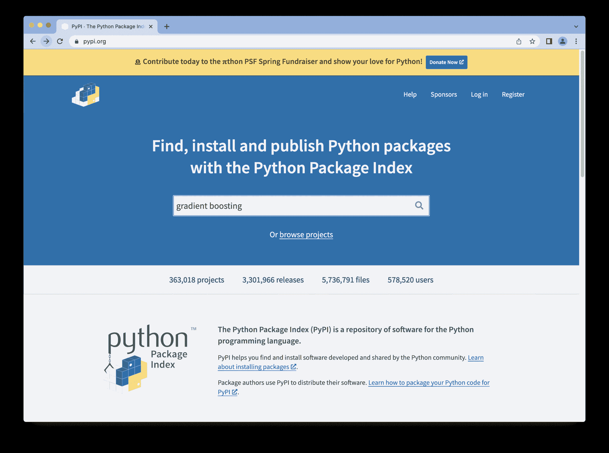
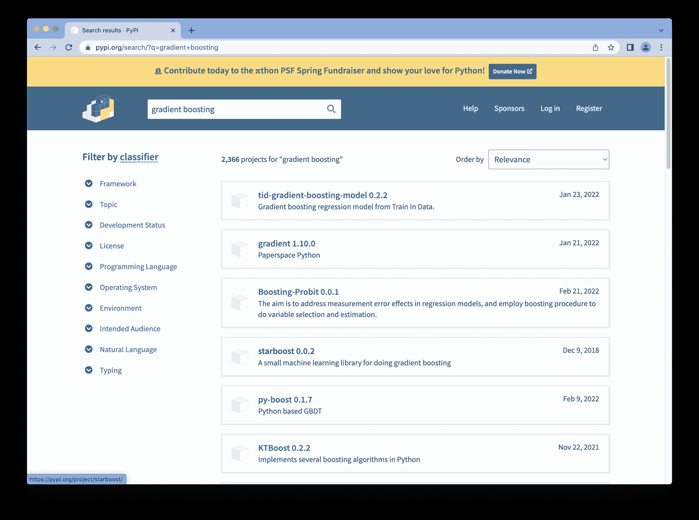

# 探索 Python 生态系统

> 原文：[`machinelearningmastery.com/exploring-the-python-ecosystem/`](https://machinelearningmastery.com/exploring-the-python-ecosystem/)

Python 是一种优雅的编程语言，因为其语法简单、清晰且简洁。但是，Python 如果没有其丰富的第三方库支持，将不会如此成功。Python 因数据科学和机器学习而闻名，因此它已经成为事实上的通用语言，仅仅是因为我们为这些任务提供了如此多的库。如果没有这些库，Python 就不会如此强大。

完成本教程后，您将学到：

+   +   Python 库安装在您的系统中的位置

    +   什么是 PyPI，以及库代码库如何帮助您的项目

    +   如何使用`pip`命令从代码库使用库

用我的新书 [Python 机器学习](https://machinelearningmastery.com/python-for-machine-learning/) **启动您的项目**，包括*逐步教程*和所有示例的*Python 源代码*文件。

让我们开始吧！

探索 Python 生态系统

照片由 [Vinit Srivastava](https://unsplash.com/photos/ETTY3Q_ukmk) 拍摄。部分权利保留。

## 概述

本教程分为五部分，它们是：

+   Python 生态系统

+   Python 库位置

+   `pip` 命令

+   搜索包

+   托管您自己的代码库

## Python 生态系统

在没有互联网的旧时代，语言和库是分开的。当你从教科书学习 C 时，你看不到任何帮助你读取 CSV 文件或打开 PNG 图像的内容。Java 的旧时代也是如此。如果你需要任何官方库中不包括的东西，你需要从各种地方搜索。如何下载或安装库将取决于库的供应商。

如果我们有一个**中央代码库**来托管许多库，并让我们使用统一接口安装库，那会更加方便。这样一来，我们可以不时地检查新版本。更好的是，我们还可以通过关键词在代码库中搜索，以发现可以帮助我们项目的库。CPAN 是 Perl 的库示例。类似地，R 有 CRAN，Ruby 有 RubyGems，Node.js 有 npm，Java 有 Maven。对于 Python，我们有 PyPI（Python 包索引），[`pypi.org/`](https://pypi.org/)。

PyPI 是平台无关的。如果您通过从 python.org 下载安装程序在 Windows 上安装 Python，则可以使用 `pip` 命令访问 PyPI。如果您在 Mac 上使用 homebrew 安装 Python，则同样可以使用 `pip` 命令。即使您使用 Ubuntu Linux 的内置 Python，情况也是相同的。

作为一个仓库，你几乎可以在 PyPI 上找到任何东西。从大型库如 Tensorflow 和 PyTorch 到小型库如 [minimal](https://pypi.org/project/minimal/)。由于 PyPI 上可用的库数量庞大，你可以轻松找到实现你项目中某些重要组件的工具。因此，我们拥有一个强大且不断增长的 Python 库生态系统，使其更加强大。

### 想开始使用 Python 进行机器学习吗？

现在立即领取我的免费 7 天电子邮件速成课程（附示例代码）。

点击注册并同时获取课程的免费 PDF 电子书版本。

## Python 库位置

当我们在 Python 脚本中需要一个库时，我们使用：

```py
import module_name
```

但 Python 如何知道在哪里读取模块的内容并将其加载到我们的脚本中？就像 Linux 的 bash shell 或 Windows 的命令提示符寻找要执行的命令一样，Python 依赖于一系列 **路径** 来定位要加载的模块。随时，我们可以通过打印列表 `sys.path` 来检查路径（在导入 `sys` 模块之后）。例如，在通过 homebrew 安装的 Mac 上的 Python：

```py
import sys
print(sys.path)
```

它打印以下内容：

```py
['',
'/usr/local/Cellar/python@3.9/3.9.9/Frameworks/Python.framework/Versions/3.9/lib/python39.zip',
'/usr/local/Cellar/python@3.9/3.9.9/Frameworks/Python.framework/Versions/3.9/lib/python3.9',
'/usr/local/Cellar/python@3.9/3.9.9/Frameworks/Python.framework/Versions/3.9/lib/python3.9/lib-dynload',
'/usr/local/lib/python3.9/site-packages']
```

这意味着如果你运行 `import my_module`，Python 会首先在与你当前位置相同的目录中查找 `my_module`（第一个元素，空字符串）。如果未找到，Python 将检查第二个元素中 zip 文件内的模块。然后是在第三个元素下的目录中，依此类推。最终路径 `/usr/local/lib/python3.9/site-packages` 通常是你安装第三方库的地方。上面的第二、第三和第四元素是内置标准库的位置。

如果你在其他地方安装了一些额外的库，你可以设置环境变量 `PYTHONPATH` 并指向它。例如，在 Linux 和 Mac 上，我们可以在终端中运行如下命令：

Shell

```py
$ PYTHONPATH="/tmp:/var/tmp" python print_path.py
```

其中 `print_path.py` 是上面的两行代码。运行此命令将打印以下内容：

```py
['', '/tmp', '/var/tmp',
'/usr/local/Cellar/python@3.9/3.9.9/Frameworks/Python.framework/Versions/3.9/lib/python39.zip', 
'/usr/local/Cellar/python@3.9/3.9.9/Frameworks/Python.framework/Versions/3.9/lib/python3.9', 
'/usr/local/Cellar/python@3.9/3.9.9/Frameworks/Python.framework/Versions/3.9/lib/python3.9/lib-dynload',
'/usr/local/lib/python3.9/site-packages']
```

我们看到 Python 会从 `/tmp` 开始搜索，然后是 `/var/tmp`，最后检查内置库和已安装的第三方库。当我们设置 `PYTHONPATH` 环境变量时，我们使用冒号 “`:`” 来分隔多个路径以搜索我们的 `import`。如果你不熟悉终端语法，上面的命令行定义了环境变量并运行 Python 脚本，可以分成两条命令：

Shell

```py
$ export PYTHONPATH="/tmp:/var/tmp"
$ python print_path.py
```

如果你使用的是 Windows，你需要改为这样做：

Shell

```py
C:\> set PYTHONPATH="C:\temp;D:\temp"

C:\> python print_path.py
```

即，我们需要使用分号 “`;`” 来分隔路径。

**注意：** 不推荐这样做，但你可以在 `import` 语句之前修改 `sys.path`。Python 将在之后搜索新的位置，但这意味着将你的脚本绑定到特定路径。换句话说，你的脚本可能无法在另一台计算机上运行。

## Pip 命令

上述`sys.path`中打印的最后一个路径是通常安装第三方库的位置。`pip`命令是从互联网获取库并将其安装到该位置的方法。最简单的语法是：

Shell

```py
pip install scikit-learn pandas
```

这将安装两个包：scikit-learn 和 pandas。稍后，您可能需要在新版本发布时升级包。语法是：

Shell

```py
pip install -U scikit-learn
```

其中`-U`表示升级。要知道哪些包已过时，我们可以使用以下命令：

Shell

```py
pip list --outdated
```

它将打印所有在 PyPI 中比您的系统新的包的列表，例如以下内容：

```py
Package                      Version    Latest   Type
---------------------------- ---------- -------- -----
absl-py                      0.14.0     1.0.0    wheel
anyio                        3.4.0      3.5.0    wheel
...
xgboost                      1.5.1      1.5.2    wheel
yfinance                     0.1.69     0.1.70   wheel
```

不加`--outdated`参数，`pip`命令会显示所有已安装的包及其版本。你可以选择使用`-V`选项显示每个包的安装位置，例如以下内容：

Shell

```py
$ pip list -v
Package                      Version    Location                               Installer
---------------------------- ---------- -------------------------------------- ---------
absl-py                      0.14.0     /usr/local/lib/python3.9/site-packages pip
aiohttp                      3.8.1      /usr/local/lib/python3.9/site-packages pip
aiosignal                    1.2.0      /usr/local/lib/python3.9/site-packages pip
anyio                        3.4.0      /usr/local/lib/python3.9/site-packages pip
...
word2number                  1.1        /usr/local/lib/python3.9/site-packages pip
wrapt                        1.12.1     /usr/local/lib/python3.9/site-packages pip
xgboost                      1.5.1      /usr/local/lib/python3.9/site-packages pip
yfinance                     0.1.69     /usr/local/lib/python3.9/site-packages pip
```

如果您需要检查包的摘要，可以使用`pip show`命令，例如，

Shell

```py
$ pip show pandas
Name: pandas
Version: 1.3.4
Summary: Powerful data structures for data analysis, time series, and statistics
Home-page: https://pandas.pydata.org
Author: The Pandas Development Team
Author-email: pandas-dev@python.org
License: BSD-3-Clause
Location: /usr/local/lib/python3.9/site-packages
Requires: numpy, python-dateutil, pytz
Required-by: bert-score, copulae, datasets, pandas-datareader, seaborn, statsmodels, ta, textattack, yfinance
```

这会为您提供一些信息，例如主页、安装位置以及它依赖的其他包以及依赖它的包。

当您需要移除一个包（例如为了释放磁盘空间），您可以简单地运行：

Shell

```py
pip uninstall tensorflow
```

使用`pip`命令的最后一点提示：pip 有两种类型的包。一种是作为源代码分发的包，另一种是作为二进制分发的包。它们仅在模块的某些部分不是用 Python 编写（例如 C 或 Cython）并且需要在使用前编译时才有所不同。源包将在您的机器上编译，而二进制分发已经编译，特定于平台（例如 64 位 Windows）。通常后者作为`wheel`包分发，您需要先安装`wheel`以享受全部好处：

```py
pip install wheel

```

一个像 Tensorflow 这样的大型包将需要很多小时才能从头编译。因此，建议先安装`wheel`并在可能时使用 wheel 包。

## 搜索包

较新版本的`pip`命令已禁用了搜索功能，因为它给 PyPI 系统带来了太大的工作负担。

我们可以通过 PyPI 网页上的搜索框来查找包。



当您输入关键字，例如“梯度提升”，它将显示包含该关键字的许多包：



您可以点击每个包以获取更多详情（通常包括代码示例），以确定哪一个符合您的需求。

如果您更喜欢命令行，可以安装`pip-search`包：

Shell

```py
pip install pip-search
```

然后可以运行`pip_search`命令来使用关键字搜索：

Shell

```py
pip_search gradient boosting
```

它不会提供 PyPI 上的所有内容，因为那将有数千个。但它会提供最相关的结果。以下是来自 Mac 终端的结果：


## 托管自己的仓库

PyPI 是互联网上的一个仓库。但`pip`命令并不只使用它。如果你有某些原因需要自己的 PyPI 服务器（例如，在你的公司网络内部托管，以便你的`pip`不会超出你的防火墙），你可以尝试`pypiserver`包：

Shell

```py
pip install pypiserver
```

根据包的文档，你可以使用`pypi-server`命令设置你的服务器。然后，你可以上传包并开始提供服务。如何配置和设置自己的服务器的细节在这里描述起来太长了。但它的作用是提供一个`pip`命令可以理解的可用包的索引，并在`pip`请求某个特定包时提供下载。

如果你有自己的服务器，你可以通过以下步骤在`pip`中安装包：

Shell

```py
pip install pandas --index-url https://192.168.0.234:8080
```

这里，`--index-url`后的地址是你自己服务器的主机和端口号。

PyPI 不是唯一的仓库。如果你用 Anaconda 安装了 Python，你还有一个替代系统，`conda`，来安装包。语法类似（几乎总是将`pip`替换为`conda`会按预期工作）。但你应该记住，它们是两个独立工作的不同系统。

## 进一步阅读

本节提供了更多关于该主题的资源，如果你希望深入了解。

+   pip 文档，[`pip.pypa.io/en/stable/`](https://pip.pypa.io/en/stable/)

+   Python 包索引，[`pypi.org/`](https://pypi.org/)

+   pypiserver 包， [`pypi.org/project/pypiserver/`](https://pypi.org/project/pypiserver/)

## 总结

在本教程中，你已经了解了`pip`命令及其如何从 Python 生态系统中为你的项目提供丰富的包。具体来说，你学到了：

+   如何从 PyPI 查找包

+   Python 如何在你的系统中管理其库

+   如何安装、升级和移除系统中的包

+   如何在我们的网络中托管自己的 PyPI 版本
