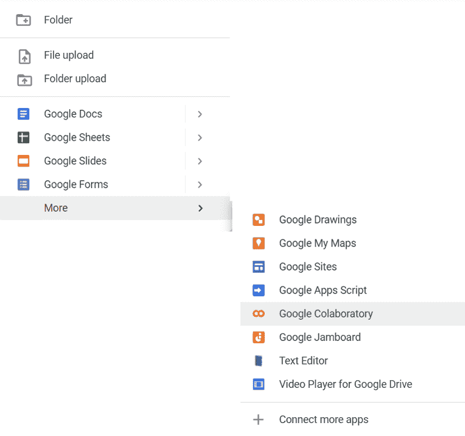

# Google Colab 机器学习项目

> 原文：[`machinelearningmastery.com/google-colab-for-machine-learning-projects/`](https://machinelearningmastery.com/google-colab-for-machine-learning-projects/)

您是否曾想要一个易于配置的交互环境来运行您的机器学习代码，并且可以免费访问 GPU？Google Colab 是您一直在寻找的答案。它是一种方便且易于使用的方式来在云端运行 Jupyter notebooks，其免费版本还提供了一些有限的 GPU 访问权限。

如果您熟悉 Jupyter notebooks，学习 Colab 将会非常简单，我们甚至可以导入 Jupyter notebooks 以在 Google Colab 上运行。但 Colab 还有很多巧妙的功能，我们将在本文中探索。让我们深入了解吧！

完成教程后，您将学习如何：

+   使用 Google Colab 的免费 GPU 额度加速训练

+   使用 Google Colab 的扩展程序保存到 Google Drive，为 pandas DataFrame 提供交互式显示等。

+   在使用 Google Colab 训练时保存模型进度

使用我的新书**Kick-start your project** [《Python 机器学习》](https://machinelearningmastery.com/python-for-machine-learning/)，包括*逐步教程*和所有示例的*Python 源代码*文件。

让我们开始吧！！[](../Images/7fb262d5888a4236460d8e90fea26c52.png)

Google Colab 机器学习项目

由 NASA 拍摄并由 [托马斯·托莫普洛斯](https://photojournal.jpl.nasa.gov/beta/catalog/PIA25015) 处理。保留部分权利。

## 概述

本教程分为五个部分，它们是：

+   什么是 Google Colab？

+   Google Colab 快速入门指南

+   探索您的 Colab 环境

+   实用的 Google Colab 扩展

+   示例：将模型进度保存到 Google Drive

## 什么是 Google Colab？

来自 “[欢迎使用 Colab](https://colab.research.google.com/notebooks/intro.ipynb)” notebook：

> Colab notebooks 允许您在一个文档中结合**可执行代码**和**富文本**，以及图像、HTML、LaTeX 等。当您创建自己的 Colab notebooks 时，它们会存储在您的 Google Drive 帐户中。您可以轻松地与同事或朋友分享您的 Colab notebooks，允许他们对您的 notebooks 进行评论或甚至编辑它们。

我们可以像使用 Jupyter notebooks 一样使用 Google Colabs。它们非常方便，因为 Google Colab 托管它们，所以我们不使用任何自己的计算机资源来运行 notebook。我们还可以分享这些 notebooks，使其他人能够轻松运行我们的代码，所有这些都在标准环境中，因为它不依赖于我们自己的本地机器。然而，在初始化期间，我们可能需要在我们的环境中安装一些库。

### 想要开始使用 Python 进行机器学习？

现在参加我的免费 7 天电子邮件速成课程（附示例代码）。

点击注册并免费获取课程的 PDF 电子书版。

## Google Colab 快速入门指南

要创建你的 Google Colab 文件并开始使用 Google Colab，你可以前往 [Google Drive](https://drive.google.com/) 并创建一个 Google Drive 帐户（如果你还没有）。现在，点击 Google Drive 页面左上角的“新建”按钮，然后点击“更多” ▷ “Google Colaboratory”。



创建一个新的 Google Colab 笔记本

你将进入你的新 Google Colab 文件页面：


新 Google Colab 笔记本

从这里，你可以使用右上角的共享按钮与他人分享你的 Google Colab 文件，或者开始编程！

Colab 上的快捷键与 Jupyter 笔记本上的类似。以下是一些有用的快捷键：

+   运行单元格：Ctrl + Enter

+   运行单元格并在下面添加新单元格：Alt + Enter

+   运行单元格并转到下一个单元格：Shift + Enter

+   增加两格缩进：Ctrl + ]

+   减少两格缩进：Ctrl + 

但还有一个非常有用的功能，可以让你只运行单元格中的特定选定部分代码：

+   运行单元格的选定部分：Ctrl + Shift + Enter

就像 Jupyter 笔记本一样，你也可以使用 Markdown 单元格编写文本。但 Colab 还有一个额外的功能，可以根据你的 Markdown 内容自动生成目录，你还可以根据 Markdown 单元格中的标题隐藏部分代码。

[

Google Colab 使用 Markdown 和目录

如果你在自己的电脑上运行 Jupyter，你只能使用电脑的 CPU。但在 Colab 中，你可以将**运行时**更改为包括 GPU 和 TPU，除了 CPU，因为它是在 Google 的云端执行的。你可以通过访问 Runtime ▷ Change runtime type 来切换到不同的运行时：


更改 Google Colab 的运行时类型

然后你可以从不同的硬件加速器中选择，以装备你的环境。


将 GPU/TPU 添加到 Google Colab 笔记本环境

与自己的电脑不同，Google Colab 不提供终端来输入命令以管理你的 Python 环境。要安装 Python 库和其他程序，我们可以使用 `!` 字符来运行 shell 命令，就像在 Jupyter 笔记本中一样，例如 `!pip install numpy`（但正如我们稍后看到的，Colab 已经预装了很多我们需要的库，例如 NumPy）

现在我们知道如何设置 Colab 环境并开始运行一些代码，让我们来探索一下这个环境吧！

## 探索你的 Colab 环境

由于我们可以使用 `!` 运行一些 shell 命令，`wget` 命令可能是获取数据的最简单方法。例如，运行此命令将把一个 CSV 文件带到 Colab 环境中：

```py
! wget https://raw.githubusercontent.com/jbrownlee/Datasets/master/shampoo.csv
```

要探索你在虚拟机上 Colab 文件的当前工作目录，请点击屏幕左侧的文件图标。默认情况下，Colab 为你提供一个名为 `sample_data` 的目录，其中包含一些文件：


Google Colab 笔记本的文件选项卡

这是我们 Colab 笔记本的当前工作目录。你可以在笔记本中使用类似这样的代码读取其中的一个文件：

```py
file = open("sample_data/mnist_test.csv")
```

稍后我们将探讨如何使用 Colab 扩展将我们的 Google Drive 挂载到这个目录，以便存储和访问我们 Google Drive 帐户中的文件。

通过使用 `!` 运行 shell 命令，我们还可以查看 Colab 环境的硬件配置。要查看 CPU，我们可以使用：

```py
!cat /proc/cpuinfo
```

这给出了我的环境的输出：

```py
processor	: 0
vendor_id	: GenuineIntel
cpu family	: 6
model		: 63
model name	: Intel(R) Xeon(R) CPU @ 2.30GHz
stepping	: 0
microcode	: 0x1
cpu MHz	: 2299.998
cache size	: 46080 KB
…

processor	: 1
vendor_id	: GenuineIntel
cpu family	: 6
model		: 63
model name	: Intel(R) Xeon(R) CPU @ 2.30GHz
stepping	: 0
microcode	: 0x1
cpu MHz	: 2299.998
cache size	: 46080 KB
…
```

我们还可以通过使用以下命令检查是否附加了 GPU：

```py
!nvidia-smi
```

如果你有一个，这将给出输出：

```py
+-----------------------------------------------------------------------------+
| NVIDIA-SMI 460.32.03    Driver Version: 460.32.03    CUDA Version: 11.2     |
|-------------------------------+----------------------+----------------------+
| GPU  Name        Persistence-M| Bus-Id        Disp.A | Volatile Uncorr. ECC |
| Fan  Temp  Perf  Pwr:Usage/Cap|         Memory-Usage | GPU-Util  Compute M. |
|                               |                      |               MIG M. |
|===============================+======================+======================|
|   0  Tesla K80           Off  | 00000000:00:04.0 Off |                    0 |
| N/A   57C    P8    31W / 149W |      0MiB / 11441MiB |      0%      Default |
|                               |                      |                  N/A |
+-------------------------------+----------------------+----------------------+                                                                         

+-----------------------------------------------------------------------------+
| Processes:                                                                  |
|  GPU   GI   CI        PID   Type   Process name                  GPU Memory |
|        ID   ID                                                   Usage      |
|=============================================================================|
|  No running processes found                                                 |
+-----------------------------------------------------------------------------+
```

这些只是一些我们可以用来探索 Colab 环境的 shell 命令示例。还有许多其他命令，如 `!pip list` 用于查看 Colab 环境访问的库，标准的 `!ls` 用于探索工作目录中的文件等。

## 有用的 Colab 扩展

Colab 还配备了许多非常有用的扩展。其中一个扩展允许我们将 Google Drive 挂载到我们的工作目录。我们可以通过以下方式完成这项操作：

```py
import os
from google.colab import drive

MOUNTPOINT = "/content/gdrive"
DATADIR = os.path.join(MOUNTPOINT, "MyDrive")
drive.mount(MOUNTPOINT)
```

然后，Colab 将请求访问你的 Google Drive 文件的权限，你可以在选择要授权的 Google 帐户后完成。授予所需权限后，我们可以在左侧的文件选项卡中看到我们的 Google Drive 已挂载。


Google Drive 挂载到 Google Colab 笔记本的当前工作目录

然后，要将文件写入我们的 Google Drive，我们可以执行以下操作：

```py
...
# writes directly to google drive
with open(f"{DATADIR}/test.txt", "w") as outfile:
    outfile.write("Hello World!")
```

这段代码将 `Hello World!` 写入到 Google Drive 顶层的 `test.txt` 文件中。同样，我们也可以通过使用以下代码从 Google Drive 文件中读取内容：

```py
...
with open(f"{DATADIR}/test.txt", "r") as infile:
    file_data = infile.read()
    print(file_data)
```

这输出：

```py
Hello World!
```

这基于我们之前的示例。

此外，Google Colab 还提供了一些扩展，以创造更好的笔记本体验。如果我们经常使用 pandas DataFrame，有一个扩展可以显示交互式表格。要使用此功能，我们可以使用魔法函数：

```py
%load_ext google.colab.data_table
```

这启用了 DataFrames 的交互式显示，然后当我们运行：

```py
from sklearn.datasets import fetch_openml
X = fetch_openml("diabetes", version=1, as_frame=True, return_X_y=False)["frame"]
X
```

这将把 DataFrame 显示为一个交互式表格，我们可以根据列进行筛选，查看表格中的不同行等。


Google Colab 中 pandas DataFrame 的交互式接口

要稍后禁用此功能，我们可以运行：

```py
%unload_ext google.colab.data_table
```

当我们再次显示相同的 DataFrame `X` 时，我们得到标准的 Pandas DataFrame 接口：


pandas DataFrame 的标准接口

## 示例：在 Google Drive 上保存模型进度

Google Colab 可能是为您的机器学习项目提供强大 GPU 资源的最简单方法。但是在 Colab 的免费版本中，Google 限制了我们每个会话中使用 Colab 笔记本的时间。我们的内核可能会无缘无故终止。我们可以重新启动笔记本并继续工作，但可能会丢失内存中的所有内容。如果我们需要长时间训练模型，这是一个问题。我们的 Colab 实例可能会在训练完成之前终止。

使用 Google Colab 扩展来挂载我们的 Google Drive 和 Keras ModelCheckpoint 回调，我们可以将模型进度保存到 Google Drive。这对于绕过 Colab 超时特别有用。对于付费的 Pro 和 Pro+ 用户，限制较宽松，但始终有可能在随机时间中途终止模型训练。如果我们不想丢失部分训练的模型，这非常有价值。

在这个演示中，我们将使用 LeNet-5 模型对 MNIST 数据集进行训练。

```py
import tensorflow as tf
from tensorflow import keras
from keras.layers import Input, Dense, Conv2D, Flatten, MaxPool2D
from keras.models import Model

class LeNet5(tf.keras.Model):
  def __init__(self):
    super(LeNet5, self).__init__()
    #creating layers in initializer
    self.conv1 = Conv2D(filters=6, kernel_size=(5,5), padding="same", activation="relu")
    self.max_pool2x2 = MaxPool2D(pool_size=(2,2))
    self.conv2 = Conv2D(filters=16, kernel_size=(5,5), padding="same", activation="relu")
    self.flatten = Flatten()
    self.fc1 = Dense(units=120, activation="relu")
    self.fc2 = Dense(units=84, activation="relu")
    self.fc3=Dense(units=10, activation="softmax")
  def call(self, input_tensor):
    conv1 = self.conv1(input_tensor)
    maxpool1 = self.max_pool2x2(conv1)
    conv2 = self.conv2(maxpool1)
    maxpool2 = self.max_pool2x2(conv2)
    flatten = self.flatten(maxpool2)
    fc1 = self.fc1(flatten)
    fc2 = self.fc2(fc1)
    fc3 = self.fc3(fc2)
    return fc3
```

然后，为了在训练期间将模型进度保存到 Google Drive，我们首先需要将 Google Drive 挂载到 Colab 环境中。

```py
import os
from google.colab import drive
MOUNTPOINT = "/content/gdrive"
DATADIR = os.path.join(MOUNTPOINT, "MyDrive")
drive.mount(MOUNTPOINT)
```

之后，我们声明回调以将检查点模型保存到 Google Drive。

```py
import tensorflow as tf

checkpoint_path = DATADIR + "/checkpoints/cp-epoch-{epoch}.ckpt"
cp_callback = tf.keras.callbacks.ModelCheckpoint(filepath=checkpoint_path,
                                                 save_weights_only=True,
                                                 verbose=1)
```

接下来，我们开始在 MNIST 数据集上训练，并使用检查点回调，以确保在 Colab 会话超时时可以从最后一个周期恢复：

```py
import tensorflow as tf
from tensorflow import keras
from keras.layers import Input, Dense, Conv2D, Flatten, MaxPool2D
from keras.models import Model

mnist_digits = keras.datasets.mnist
(train_images, train_labels), (test_images, test_labels) = mnist_digits.load_data()

input_layer = Input(shape=(28,28,1))
model = LeNet5()(input_layer)
model = Model(inputs=input_layer, outputs=model)
model.compile(optimizer="adam", loss=tf.keras.losses.SparseCategoricalCrossentropy(), metrics="acc")
model.fit(x=train_images, y=train_labels, batch_size=256, validation_data = [test_images, test_labels], epochs=5, callbacks=[cp_callback])
```

这将训练我们的模型并给出输出：

```py
Epoch 1/5
235/235 [==============================] - ETA: 0s - loss: 0.9580 - acc: 0.8367
Epoch 1: saving model to /content/gdrive/MyDrive/checkpoints/cp-epoch-1.ckpt
235/235 [==============================] - 11s 7ms/step - loss: 0.9580 - acc: 0.8367 - val_loss: 0.1672 - val_acc: 0.9492
Epoch 2/5
229/235 [============================>.] - ETA: 0s - loss: 0.1303 - acc: 0.9605
Epoch 2: saving model to /content/gdrive/MyDrive/checkpoints/cp-epoch-2.ckpt
235/235 [==============================] - 1s 5ms/step - loss: 0.1298 - acc: 0.9607 - val_loss: 0.0951 - val_acc: 0.9707
Epoch 3/5
234/235 [============================>.] - ETA: 0s - loss: 0.0810 - acc: 0.9746
Epoch 3: saving model to /content/gdrive/MyDrive/checkpoints/cp-epoch-3.ckpt
235/235 [==============================] - 1s 6ms/step - loss: 0.0811 - acc: 0.9746 - val_loss: 0.0800 - val_acc: 0.9749
Epoch 4/5
230/235 [============================>.] - ETA: 0s - loss: 0.0582 - acc: 0.9818
Epoch 4: saving model to /content/gdrive/MyDrive/checkpoints/cp-epoch-4.ckpt
235/235 [==============================] - 1s 6ms/step - loss: 0.0580 - acc: 0.9819 - val_loss: 0.0653 - val_acc: 0.9806
Epoch 5/5
222/235 [===========================>..] - ETA: 0s - loss: 0.0446 - acc: 0.9858
Epoch 5: saving model to /content/gdrive/MyDrive/checkpoints/cp-epoch-5.ckpt
235/235 [==============================] - 1s 6ms/step - loss: 0.0445 - acc: 0.9859 - val_loss: 0.0583 - val_acc: 0.9825
```

从输出中，我们可以看到检查点已经被保存。查看我的 Google Drive 文件夹，我们还可以看到检查点存储在那里。


存储在 Google Drive 的检查点

Colab 实例在 Google 的云环境中运行。运行的机器有一些存储空间，因此我们可以安装软件包或下载一些文件。然而，我们不应将检查点保存到那里，因为我们不能保证会在会话终止后重新获得它。因此，我们在上面将 Google Drive 挂载到实例中，并将检查点保存在 Google Drive 中。这是确保检查点文件可访问的方式。

这里附上模型训练和保存到 Google Drive 的完整代码：

```py
import os
from google.colab import drive
import tensorflow as tf
from tensorflow import keras
from keras.layers import Input, Dense, Conv2D, Flatten, MaxPool2D
from keras.models import Model

MOUNTPOINT = "/content/gdrive"
DATADIR = os.path.join(MOUNTPOINT, "MyDrive")
drive.mount(MOUNTPOINT)

class LeNet5(tf.keras.Model):
  def __init__(self):
    super(LeNet5, self).__init__()
    self.conv1 = Conv2D(filters=6, kernel_size=(5,5), padding="same", activation="relu")
    self.max_pool2x2 = MaxPool2D(pool_size=(2,2))
    self.conv2 = Conv2D(filters=16, kernel_size=(5,5), padding="same", activation="relu")
    self.flatten = Flatten()
    self.fc1 = Dense(units=120, activation="relu")
    self.fc2 = Dense(units=84, activation="relu")
    self.fc3=Dense(units=10, activation="softmax")
  def call(self, input_tensor):
    conv1 = self.conv1(input_tensor)
    maxpool1 = self.max_pool2x2(conv1)
    conv2 = self.conv2(maxpool1)
    maxpool2 = self.max_pool2x2(conv2)
    flatten = self.flatten(maxpool2)
    fc1 = self.fc1(flatten)
    fc2 = self.fc2(fc1)
    fc3 = self.fc3(fc2)
    return fc3

mnist_digits = keras.datasets.mnist
(train_images, train_labels), (test_images, test_labels) = mnist_digits.load_data()

# saving checkpoints
checkpoint_path = DATADIR + "/checkpoints/cp-epoch-{epoch}.ckpt"
cp_callback = tf.keras.callbacks.ModelCheckpoint(filepath=checkpoint_path,
                                                 save_weights_only=True,
                                                 verbose=1)
input_layer = Input(shape=(28,28,1))
model = LeNet5()(input_layer)
model = Model(inputs=input_layer, outputs=model)
model.compile(optimizer="adam", loss=tf.keras.losses.SparseCategoricalCrossentropy(), metrics="acc")

model.fit(x=train_images, y=train_labels, batch_size=256, validation_data = [test_images, test_labels], 
          epochs=5, callbacks=[cp_callback])
```

如果模型训练中途停止，我们只需重新编译模型并加载权重，然后可以继续训练：

```py
checkpoint_path = DATADIR + "/checkpoints/cp-epoch-{epoch}.ckpt"
cp_callback = tf.keras.callbacks.ModelCheckpoint(filepath=checkpoint_path,
                                                 save_weights_only=True,
                                                 verbose=1)

input_layer = Input(shape=(28,28,1))
model = LeNet5()(input_layer)
model = Model(inputs=input_layer, outputs=model)
model.compile(optimizer="adam", loss=tf.keras.losses.SparseCategoricalCrossentropy(), metrics="acc")

# to resume from epoch 5 checkpoints
model.load_weights(DATADIR + "/checkpoints/cp-epoch-5.ckpt")

# continue training
model.fit(x=train_images, y=train_labels, batch_size=256, validation_data = [test_images, test_labels], 
          epochs=5, callbacks=[cp_callback])
```

## 进一步阅读

本节提供了更多关于该主题的资源，如果你想深入了解。

#### 文章

+   “欢迎使用 Colab”笔记本：[`colab.research.google.com/`](https://colab.research.google.com/?utm_source=scs-index)

+   Jupyter Notebook 文档：[`docs.jupyter.org/en/latest/`](https://docs.jupyter.org/en/latest/)

## 总结

在本教程中，你已经了解了 Google Colab 是什么，如何利用 Google Colab 的免费层获得免费的 GPU 访问，如何将 Google Colab 与 Google Drive 帐户配合使用，以及如何将模型保存到 Google Drive 以存储训练过程中的模型进度。

具体而言，你学到了：

+   什么是 Google Colab，以及如何开始使用它

+   如何使用`!`和 bash 命令探索你的 Google Colab 笔记本环境

+   Google Colab 附带的有用扩展

+   在训练过程中将模型进度保存到 Google Drive
