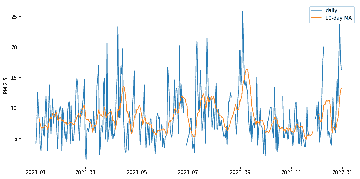

# 使用 Pandas 处理数据

> 原文：[`machinelearningmastery.com/massaging-data-using-pandas/`](https://machinelearningmastery.com/massaging-data-using-pandas/)

当我们谈论数据管理时，看到以表格形式呈现的数据是不可避免的。带有列头，并且有时还会有行名，使得理解数据更容易。事实上，我们经常会看到不同类型的数据混在一起。例如，我们在一个食谱的配料表中，数量是数字，名称是字符串。在 Python 中，我们可以使用 pandas 库来处理表格数据。

完成本教程后，你将学习到：

+   pandas 库提供了什么

+   在 pandas 中什么是 DataFrame 和 Series

+   如何超越平凡的数组操作来操纵 DataFrame 和 Series

**启动你的项目**，请参考我新书[《Python 机器学习》](https://machinelearningmastery.com/python-for-machine-learning/)，包括*逐步教程*和*所有示例的 Python 源代码*文件。

让我们开始吧！！[](../Images/bba3496226ca0851a3b7f37a917dae1b.png)

使用 Pandas 处理数据

照片来源：[Mark de Jong](https://www.pexels.com/photo/a-giant-panda-eating-bamboo-leaves-6939449/)。保留所有权利。

## 概述

本教程分为五部分：

+   DataFrame 和 Series

+   DataFrame 中的基本函数

+   操作 DataFrames 和 Series

+   DataFrames 中的聚合

+   处理 pandas 中的时间序列数据

## DataFrame 和 Series

首先，让我们从一个示例数据集开始。我们将导入 pandas 并读取[美国空气污染物排放数据](https://www.epa.gov/air-emissions-inventories/air-pollutant-emissions-trends-data)到一个 DataFrame 中：

```py
import pandas as pd

URL = "https://www.epa.gov/sites/default/files/2021-03/state_tier1_caps.xlsx"

df = pd.read_excel(URL, sheet_name="State_Trends", header=1)
print(df)
```

```py
      State FIPS State  Tier 1 Code      Tier 1 Description  ... emissions18  emissions19  emissions20  emissions21
0              1    AL            1  FUEL COMB. ELEC. UTIL.  ...   10.050146     8.243679     8.243679     8.243679
1              1    AL            1  FUEL COMB. ELEC. UTIL.  ...    0.455760     0.417551     0.417551     0.417551
2              1    AL            1  FUEL COMB. ELEC. UTIL.  ...   26.233104    19.592480    13.752790    11.162100
3              1    AL            1  FUEL COMB. ELEC. UTIL.  ...    2.601011     2.868642     2.868642     2.868642
4              1    AL            1  FUEL COMB. ELEC. UTIL.  ...    1.941267     2.659792     2.659792     2.659792
...          ...   ...          ...                     ...  ...         ...          ...          ...          ...
5314          56    WY           16        PRESCRIBED FIRES  ...    0.893848     0.374873     0.374873     0.374873
5315          56    WY           16        PRESCRIBED FIRES  ...    7.118097     2.857886     2.857886     2.857886
5316          56    WY           16        PRESCRIBED FIRES  ...    6.032286     2.421937     2.421937     2.421937
5317          56    WY           16        PRESCRIBED FIRES  ...    0.509242     0.208817     0.208817     0.208817
5318          56    WY           16        PRESCRIBED FIRES  ...   16.632343     6.645249     6.645249     6.645249

[5319 rows x 32 columns]
```

这是一张每年的污染物排放表，包含了污染物种类和每年的排放量信息。

这里我们演示了 pandas 的一个有用功能：你可以使用 `read_csv()` 读取 CSV 文件，或使用 `read_excel()` 读取 Excel 文件。文件名可以是你机器上的本地文件或可以从中下载文件的 URL。我们从美国环境保护局的网站了解了这个 URL。我们知道哪个工作表包含数据以及数据从哪个行开始，因此在 `read_excel()` 函数中添加了额外的参数。

上面创建的 pandas 对象是一个 DataFrame，以表格形式呈现。类似于 NumPy，Pandas 中的数据组织在数组中。但 Pandas 将数据类型分配给列，而不是整个数组。这允许不同类型的数据包含在同一个数据结构中。我们可以通过调用 DataFrame 的 `info()` 函数来检查数据类型：

```py
...
df.info() # print info to screen
```

```py
<class 'pandas.core.frame.DataFrame'>
RangeIndex: 5319 entries, 0 to 5318
Data columns (total 32 columns):
 #   Column              Non-Null Count  Dtype  
---  ------              --------------  -----  
 0   State FIPS          5319 non-null   int64  
 1   State               5319 non-null   object 
 2   Tier 1 Code         5319 non-null   int64  
 3   Tier 1 Description  5319 non-null   object 
 4   Pollutant           5319 non-null   object 
 5   emissions90         3926 non-null   float64
 6   emissions96         4163 non-null   float64
 7   emissions97         4163 non-null   float64
...
 29  emissions19         5052 non-null   float64
 30  emissions20         5052 non-null   float64
 31  emissions21         5052 non-null   float64
dtypes: float64(27), int64(2), object(3)
memory usage: 1.3+ MB
```

或者我们也可以获取 pandas Series 类型：

```py
...
coltypes = df.dtypes
print(coltypes)
```

```py
State FIPS              int64
State                  object
Tier 1 Code             int64
Tier 1 Description     object
Pollutant              object
emissions90           float64
emissions96           float64
emissions97           float64
...
emissions19           float64
emissions20           float64
emissions21           float64
dtype: object
```

在 pandas 中，DataFrame 是一个表格，而 Series 是表格中的一列。这一区分很重要，因为 DataFrame 背后的数据是一个二维数组，而 Series 是一个一维数组。

类似于 NumPy 中的 fancy indexing，我们可以从一个 DataFrame 中提取列以创建另一个 DataFrame：

```py
...
cols = ["State", "Pollutant", "emissions19", "emissions20", "emissions21"]
last3years = df[cols]
print(last3years)
```

```py
     State Pollutant  emissions19  emissions20  emissions21
0       AL        CO     8.243679     8.243679     8.243679
1       AL       NH3     0.417551     0.417551     0.417551
2       AL       NOX    19.592480    13.752790    11.162100
3       AL  PM10-PRI     2.868642     2.868642     2.868642
4       AL  PM25-PRI     2.659792     2.659792     2.659792
...    ...       ...          ...          ...          ...
5314    WY       NOX     0.374873     0.374873     0.374873
5315    WY  PM10-PRI     2.857886     2.857886     2.857886
5316    WY  PM25-PRI     2.421937     2.421937     2.421937
5317    WY       SO2     0.208817     0.208817     0.208817
5318    WY       VOC     6.645249     6.645249     6.645249

[5319 rows x 5 columns]
```

或者，如果我们传递的是列名字符串而不是列名列表，我们可以从 DataFrame 中提取一个列作为 Series：

```py
...
data2021 = df["emissions21"]
print(data2021)
```

```py
0        8.243679
1        0.417551
2       11.162100
3        2.868642
4        2.659792
          ...    
5314     0.374873
5315     2.857886
5316     2.421937
5317     0.208817
5318     6.645249
Name: emissions21, Length: 5319, dtype: float64
```

## DataFrame 中的基本函数

Pandas 功能丰富。对表格或列的许多基本操作都作为 DataFrame 或 Series 上的函数提供。例如，我们可以通过以下方式查看上表中覆盖的污染物列表：

```py
...
print(df["Pollutant"].unique())
```

```py
['CO' 'NH3' 'NOX' 'PM10-PRI' 'PM25-PRI' 'SO2' 'VOC']
```

我们还可以找到系列的均值（`mean()`）、标准偏差（`std()`）、最小值（`min()`）和最大值（`max()`）：

```py
...
print(df["emissions21"].mean())
```

但事实上，我们更可能使用`describe()`函数来探索新的 DataFrame。由于本示例中的 DataFrame 列太多，最好是将`describe()`的结果转置为新的 DataFrame：

```py
...
print(df.describe().T)
```

```py
              count       mean         std      min        25%        50%        75%           max
State FIPS   5319.0  29.039481   15.667352  1.00000  16.000000  29.000000  42.000000     56.000000
Tier 1 Code  5319.0   8.213198    4.610970  1.00000   4.000000   8.000000  12.000000     16.000000
emissions90  3926.0  67.885173  373.308888  0.00000   0.474330   4.042665  20.610050  11893.764890
emissions96  4163.0  54.576353  264.951584  0.00001   0.338420   3.351860  16.804540   6890.969060
emissions97  4163.0  51.635867  249.057529  0.00001   0.335830   3.339820  16.679675   6547.791030
...
emissions19  5052.0  19.846244   98.392126  0.00000   0.125881   1.180123   7.906181   4562.151689
emissions20  5052.0  19.507828   97.515187  0.00000   0.125066   1.165284   7.737705   4562.151689
emissions21  5052.0  19.264532   96.702411  0.00000   0.125066   1.151917   7.754584   4562.151689
```

的确，`describe()`生成的 DataFrame 可以帮助我们了解数据。从那里，我们可以了解到有多少缺失数据（通过查看计数），数据如何分布，是否存在异常值等等。

### 想要开始学习 Python 进行机器学习吗？

现在就免费获取我的 7 天电子邮件速成课程（包含示例代码）。

点击注册并获得课程的免费 PDF 电子书版本。

## 操纵 DataFrame 和 Series

类似于 NumPy 中的布尔索引，我们可以从 DataFrame 中提取一部分**行**。例如，以下是如何仅选择一氧化碳排放数据的方法：

```py
...
df_CO = df[df["Pollutant"] == "CO"]
print(df_CO)
```

```py
      State FIPS State  Tier 1 Code             Tier 1 Description  ... emissions18  emissions19  emissions20  emissions21
0              1    AL            1         FUEL COMB. ELEC. UTIL.  ...   10.050146     8.243679     8.243679     8.243679
7              1    AL            2          FUEL COMB. INDUSTRIAL  ...   19.148024    17.291741    17.291741    17.291741
14             1    AL            3               FUEL COMB. OTHER  ...   29.207209    29.201838    29.201838    29.201838
21             1    AL            4  CHEMICAL & ALLIED PRODUCT MFG  ...    2.774257     2.626484     2.626484     2.626484
28             1    AL            5              METALS PROCESSING  ...   12.534726    12.167189    12.167189    12.167189
...          ...   ...          ...                            ...  ...         ...          ...          ...          ...
5284          56    WY           11               HIGHWAY VEHICLES  ...   70.776546    69.268149    64.493724    59.719298
5291          56    WY           12                    OFF-HIGHWAY  ...   31.092228    30.594383    30.603392    30.612400
5298          56    WY           14                  MISCELLANEOUS  ...    3.269705     3.828401     3.828401     3.828401
5305          56    WY           15                      WILDFIRES  ...  302.235376    89.399972    89.399972    89.399972
5312          56    WY           16               PRESCRIBED FIRES  ...   70.578540    28.177445    28.177445    28.177445

[760 rows x 32 columns]
```

正如您可能期望的那样，`==`运算符将从系列`df["Pollutant"]`中比较每个元素，结果是一个布尔值系列。如果长度匹配，DataFrame 会根据布尔值选择行。实际上，我们可以使用位运算符组合布尔值。例如，这就是我们如何选择由高速公路车辆导致的一氧化碳排放行：

```py
...
df_CO_HW = df[(df["Pollutant"] == "CO") & (df["Tier 1 Description"] == "HIGHWAY VEHICLES")]
print(df_CO_HW)
```

```py
      State FIPS State  Tier 1 Code Tier 1 Description  ...  emissions18  emissions19  emissions20  emissions21
70             1    AL           11   HIGHWAY VEHICLES  ...   532.140445   518.259811   492.182583   466.105354
171            2    AK           11   HIGHWAY VEHICLES  ...    70.674008    70.674008    63.883471    57.092934
276            4    AZ           11   HIGHWAY VEHICLES  ...   433.685363   413.347655   398.958109   384.568563
381            5    AR           11   HIGHWAY VEHICLES  ...   228.213685   227.902883   215.937225   203.971567
...
5074          54    WV           11   HIGHWAY VEHICLES  ...   133.628312   126.836047   118.621857   110.407667
5179          55    WI           11   HIGHWAY VEHICLES  ...   344.340392   374.804865   342.392977   309.981089
5284          56    WY           11   HIGHWAY VEHICLES  ...    70.776546    69.268149    64.493724    59.719298

[51 rows x 32 columns]
```

如果您喜欢像 Python 列表一样选择行，可以通过`iloc`接口进行。以下是如何选择行 5 到 10（从零开始索引）或列 1 到 6 以及行 5 到 10 的方法：

```py
...
df_r5 = df.iloc[5:11]
df_c1_r5 = df.iloc[5:11, 1:7]
```

如果您熟悉 Excel，可能知道其令人兴奋的功能之一是“数据透视表”。Pandas 允许您做同样的事情。让我们考虑从数据集中获取 2021 年所有州的一氧化碳污染：

```py
...
df_all_co = df[df["Pollutant"]=="CO"][["State", "Tier 1 Description", "emissions21"]]
print(df_all_co)
```

```py
      State FIPS State  Tier 1 Code             Tier 1 Description  ... emissions18  emissions19  emissions20  emissions21
0              1    AL            1         FUEL COMB. ELEC. UTIL.  ...   10.050146     8.243679     8.243679     8.243679
7              1    AL            2          FUEL COMB. INDUSTRIAL  ...   19.148024    17.291741    17.291741    17.291741
14             1    AL            3               FUEL COMB. OTHER  ...   29.207209    29.201838    29.201838    29.201838
21             1    AL            4  CHEMICAL & ALLIED PRODUCT MFG  ...    2.774257     2.626484     2.626484     2.626484
28             1    AL            5              METALS PROCESSING  ...   12.534726    12.167189    12.167189    12.167189
...          ...   ...          ...                            ...  ...         ...          ...          ...          ...
5284          56    WY           11               HIGHWAY VEHICLES  ...   70.776546    69.268149    64.493724    59.719298
5291          56    WY           12                    OFF-HIGHWAY  ...   31.092228    30.594383    30.603392    30.612400
5298          56    WY           14                  MISCELLANEOUS  ...    3.269705     3.828401     3.828401     3.828401
5305          56    WY           15                      WILDFIRES  ...  302.235376    89.399972    89.399972    89.399972
5312          56    WY           16               PRESCRIBED FIRES  ...   70.578540    28.177445    28.177445    28.177445

[760 rows x 32 columns]
```

通过数据透视表，我们可以将不同的一氧化碳排放方式作为列，不同的州作为行：

```py
...
df_pivot = df_all_co.pivot_table(index="State", columns="Tier 1 Description", values="emissions21")
print(df_pivot)
```

```py
Tier 1 Description  CHEMICAL & ALLIED PRODUCT MFG  FUEL COMB. ELEC. UTIL.  ...  WASTE DISPOSAL & RECYCLING    WILDFIRES
State                                                                      ...
AK                                            NaN                4.679098  ...                    0.146018  4562.151689
AL                                       2.626484                8.243679  ...                   47.241253    38.780562
AR                                       0.307811                5.027354  ...                   26.234267     3.125529
AZ                                       0.000000                4.483514  ...                    6.438484   248.713896
...
WA                                       0.116416                4.831139  ...                    2.334996   160.284327
WI                                       0.023691                7.422521  ...                   35.670128     0.911783
WV                                       0.206324                7.836174  ...                   16.012414     5.086241
WY                                      14.296860               14.617882  ...                    1.952702    89.399972

[51 rows x 15 columns]
```

上述`pivot_table()`函数不要求值在索引和列中唯一。换句话说，如果原始 DataFrame 中某个州有两行“wildfire”，该函数将对这两行进行聚合（默认为取平均值）。要撤销数据透视操作，我们使用`melt()`函数：

```py
...
df_melt = df_pivot.melt(value_name="emissions 2021", var_name="Tier 1 Description", ignore_index=False)
print(df_melt)
```

```py
                  Tier 1 Description  emissions 2021
State
AK     CHEMICAL & ALLIED PRODUCT MFG             NaN
AL     CHEMICAL & ALLIED PRODUCT MFG        2.626484
AR     CHEMICAL & ALLIED PRODUCT MFG        0.307811
AZ     CHEMICAL & ALLIED PRODUCT MFG        0.000000
CA     CHEMICAL & ALLIED PRODUCT MFG        0.876666
...                              ...             ...
VT                         WILDFIRES        0.000000
WA                         WILDFIRES      160.284327
WI                         WILDFIRES        0.911783
WV                         WILDFIRES        5.086241
WY                         WILDFIRES       89.399972

[765 rows x 2 columns]
```

DataFrame 还有更多操作可以进行。例如，我们可以对行进行排序（使用`sort_values()`函数）、重命名列（使用`rename()`函数）、移除冗余行（使用`drop_duplicates()`函数）等等。

在机器学习项目中，我们经常需要在使用数据之前进行一些清理工作。使用 pandas 这一点非常方便。我们刚刚创建的 `df_pivot` DataFrame 中有一些标记为`NaN`的值表示没有可用数据。我们可以用以下任何一种方法将这些值替换为零：

```py
df_pivot.fillna(0)
df_pivot.where(df_pivot.notna(), 0)
df_pivot.mask(df_pivot.isna(), 0)
```

## DataFrame 中的聚合

实际上，pandas 可以提供表格操作，否则只能使用数据库 SQL 语句轻松完成。重用上述示例数据集，表中每种污染物都被分解为不同的来源。如果我们想知道污染物的总排放量，我们只需将所有来源的数据相加即可。类似于 SQL，这是一种“group by”操作。我们可以用以下方式做到：

```py
...
df_sum = df[df["Pollutant"]=="CO"].groupby("State").sum()
print(df_sum)
```

```py
       State FIPS  Tier 1 Code  emissions90  emissions96  ...  emissions18  emissions19  emissions20  emissions21
State                                                     ...
AK             28          115   4502.12238    883.50805  ...  5216.369575  5218.919502  5211.711803  5204.504105
AL             15          123   3404.01163   2440.95216  ...  1574.068371  1350.711872  1324.945132  1299.178392
AR             75          123   1706.69006   1356.08524  ...  1168.110471  1055.635824  1043.724418  1031.813011
AZ             60          123   2563.04249   1876.55422  ...  1000.976184   977.916197   964.504353   951.092509
...
WA            795          123   3604.39515   2852.52146  ...  1703.948955  1286.715920  1266.983767  1247.251614
WI            825          123   2849.49820   2679.75457  ...   922.375165   872.231181   838.232783   804.234385
WV            810          123   1270.81719    941.39753  ...   424.120829   395.720171   387.565561   379.410950
WY            840          123    467.80484   1598.56712  ...   549.270377   306.461296   301.695879   296.930461

[51 rows x 29 columns]
```

`groupby()` 函数的结果将使用分组列作为行索引。它通过将具有相同分组列值的行放入一个组中来运行。然后，作为一个组，应用某些**聚合**函数将多行减少为一行。在上述示例中，我们正在对每列进行求和。Pandas 提供了许多其他聚合函数，例如计算均值或仅计数行数。因为我们在做`sum()`操作，非数值列从输出中被删除，因为它们不适用于该操作。

这使我们能够执行一些有趣的任务。假设，使用上述 DataFrame 中的数据，我们创建了一个表，其中包含 2021 年每个州中一氧化碳（CO）和二氧化硫（SO2）的总排放量。如何实现这一点的推理如下：

1.  按“State”和“Pollutant”分组，然后对每个组进行求和。这是我们获取每个州中每种污染物的总排放量的方法。

1.  仅选择 2021 年的列

1.  运行数据透视表，使州成为行，污染物成为列，总排放量作为值

1.  仅选择 CO 和 SO2 的列

在代码中，可以这样写：

```py
...
df_2021 = ( df.groupby(["State", "Pollutant"])
              .sum()              # get total emissions of each year
              [["emissions21"]]   # select only year 2021
              .reset_index()
              .pivot(index="State", columns="Pollutant", values="emissions21")
              .filter(["CO","SO2"])
          )
print(df_2021)
```

```py
Pollutant           CO         SO2
State
AK         5204.504105   32.748621
AL         1299.178392   52.698696
AR         1031.813011   55.288823
AZ          951.092509   15.281760
...
WA         1247.251614   13.178053
WI          804.234385   21.141688
WV          379.410950   49.159621
WY          296.930461   37.056612
```

在上述代码中，`groupby()` 函数后的每一步都是创建一个新的 DataFrame。由于我们使用的函数在 DataFrame 下定义，因此我们有上述功能链式调用语法。

`sum()`函数将创建一个 DataFrame，其中`State`和`Pollutant`作为索引的分组列。因此，当我们将 DataFrame 切片为只有一列时，我们使用了 `reset_index()` 将索引作为列（即会有三列，`State`、`Pollutant` 和 `emissions21`）。由于我们需要的污染物比我们需要的多，我们使用 `filter()` 从结果 DataFrame 中仅选择 CO 和 SO2 的列。这类似于使用花式索引来选择列。

实际上，我们可以以不同的方式完成同样的操作：

1.  仅选择 CO 的行并计算总排放量；仅选择 2021 年的数据

1.  对 SO2 也是一样

1.  将前两步的结果 DataFrame 结合在一起

在 pandas 中，DataFrame 中有一个 `join()` 函数，可以帮助我们通过匹配索引将列与另一个 DataFrame 结合起来。在代码中，以上步骤如下：

```py
...
df_co = df[df["Pollutant"]=="CO"].groupby("State").sum()[["emissions21"]].rename(columns={"emissions21":"CO"})
df_so2 = df[df["Pollutant"]=="SO2"].groupby("State").sum()[["emissions21"]].rename(columns={"emissions21":"SO2"})
df_joined = df_co.join(df_so2)
```

`join()`函数仅限于索引匹配。如果你熟悉 SQL，pandas 中`JOIN`子句的等效函数是`merge()`。如果我们为 CO 和 SO2 创建的两个 DataFrame 中有一个单独的州列，我们可以按照以下方式进行相同的操作：

```py
df_co = df[df["Pollutant"]=="CO"].groupby("State").sum()[["emissions21"]].rename(columns={"emissions21":"CO"}).reset_index()
df_so2 = df[df["Pollutant"]=="SO2"].groupby("State").sum()[["emissions21"]].rename(columns={"emissions21":"SO2"}).reset_index()
df_merged = df_co.merge(df_so2, on="State", how="outer")
```

pandas 中的`merge()`函数可以执行所有类型的 SQL 连接。我们可以匹配来自不同 DataFrame 的不同列，并可以进行左连接、右连接、内连接和外连接。这在整理项目数据时非常有用。

DataFrame 中的`groupby()`函数非常强大，因为它允许我们灵活地操作 DataFrame，并开启了许多复杂转换的大门。可能在`groupby()`之后没有内置函数可以帮助，但我们总是可以提供自己的函数。例如，以下是如何创建一个函数来操作子 DataFrame（在所有列中，除了分组列）并应用它来找出最小和最大排放年份：

```py
...
def minmaxyear(subdf):
    sum_series = subdf.sum()
    year_indices = [x for x in sum_series if x.startswith("emissions")]
    minyear = sum_series[year_indices].astype(float).idxmin()
    maxyear = sum_series[year_indices].astype(float).idxmax()
    return pd.Series({"min year": minyear[-2:], "max year": maxyear[-2:]})

df_years = df[df["Pollutant"]=="CO"].groupby("State").apply(minmaxyear)
```

`apply()`函数是最后的手段，它为我们提供了最大的灵活性。除了 GroupBy 对象，还有 DataFrames 和 Series 中的`apply()`接口。

以下是演示我们上面介绍的所有操作的完整代码：

```py
import pandas as pd

# Pollutants data from Environmental Protection Agency
URL = "https://www.epa.gov/sites/default/files/2021-03/state_tier1_caps.xlsx"

# Read the Excel file and print
df = pd.read_excel(URL, sheet_name="State_Trends", header=1)
print("US air pollutant emission data:")
print(df)

# Show info
print("\nInformation about the DataFrame:")
df.info()

# print dtyes
coltypes = df.dtypes
print("\nColumn data types of the DataFrame:")
print(coltypes)

# Get last 3 columns
cols = ["State", "Pollutant", "emissions19", "emissions20", "emissions21"]
last3years = df[cols]
print("\nDataFrame of last 3 years data:")
print(last3years)

# Get a series
data2021 = df["emissions21"]
print("\nSeries of 2021 data:")
print(data2021)

# Print unique pollutants
print("\nUnique pollutants:")
print(df["Pollutant"].unique())

# print mean emission
print("\nMean on the 2021 series:")
print(df["emissions21"].mean())

# Describe
print("\nBasic statistics about each column in the DataFrame:")
print(df.describe().T)

# Get CO only
df_CO = df[df["Pollutant"] == "CO"]
print("\nDataFrame of only CO pollutant:")
print(df_CO)

# Get CO and Highway only
df_CO_HW = df[(df["Pollutant"] == "CO") & (df["Tier 1 Description"] == "HIGHWAY VEHICLES")]
print("\nDataFrame of only CO pollutant from Highway vehicles:")
print(df_CO_HW)

# Get DF of all CO
df_all_co = df[df["Pollutant"]=="CO"][["State", "Tier 1 Description", "emissions21"]]
print("\nDataFrame of only CO pollutant, keep only essential columns:")
print(df_all_co)

# Pivot
df_pivot = df_all_co.pivot_table(index="State", columns="Tier 1 Description", values="emissions21")
print("\nPivot table of state vs CO emission source:")
print(df_pivot)

# melt
df_melt = df_pivot.melt(value_name="emissions 2021", var_name="Tier 1 Description", ignore_index=False)
print("\nMelting the pivot table:")
print(df_melt)

# all three are the same
df_filled = df_pivot.fillna(0)
df_filled = df_pivot.where(df_pivot.notna(), 0)
df_filled = df_pivot.mask(df_pivot.isna(), 0)
print("\nFilled missing value as zero:")
print(df_filled)

# aggregation
df_sum = df[df["Pollutant"]=="CO"].groupby("State").sum()
print("\nTotal CO emission by state:")
print(df_sum)

# group by
df_2021 = ( df.groupby(["State", "Pollutant"])
              .sum()              # get total emissions of each year
              [["emissions21"]]   # select only year 2021
              .reset_index()
              .pivot(index="State", columns="Pollutant", values="emissions21")
              .filter(["CO","SO2"])
          )
print("\nComparing CO and SO2 emission:")
print(df_2021)

# join
df_co = df[df["Pollutant"]=="CO"].groupby("State").sum()[["emissions21"]].rename(columns={"emissions21":"CO"})
df_so2 = df[df["Pollutant"]=="SO2"].groupby("State").sum()[["emissions21"]].rename(columns={"emissions21":"SO2"})
df_joined = df_co.join(df_so2)
print("\nComparing CO and SO2 emission:")
print(df_joined)

# merge
df_co = df[df["Pollutant"]=="CO"].groupby("State").sum()[["emissions21"]].rename(columns={"emissions21":"CO"}).reset_index()
df_so2 = df[df["Pollutant"]=="SO2"].groupby("State").sum()[["emissions21"]].rename(columns={"emissions21":"SO2"}).reset_index()
df_merged = df_co.merge(df_so2, on="State", how="outer")
print("\nComparing CO and SO2 emission:")
print(df_merged)

def minmaxyear(subdf):
    sum_series = subdf.sum()
    year_indices = [x for x in sum_series if x.startswith("emissions")]
    minyear = sum_series[year_indices].astype(float).idxmin()
    maxyear = sum_series[year_indices].astype(float).idxmax()
    return pd.Series({"min year": minyear[-2:], "max year": maxyear[-2:]})

df_years = df[df["Pollutant"]=="CO"].groupby("State").apply(minmaxyear)
print("\nYears of minimum and maximum emissions:")
print(df_years)
```

## 处理 Pandas 中的时间序列数据

如果你处理时间序列数据，你会发现 pandas 还有另一个强大的功能。首先，让我们考虑一些每日的污染数据。我们可以从 EPA 网站选择并下载一些数据：

+   [`www.epa.gov/outdoor-air-quality-data/download-daily-data`](https://www.epa.gov/outdoor-air-quality-data/download-daily-data)

为了演示目的，我们下载了 2021 年德克萨斯州的 PM2.5 数据。我们可以如下导入[下载的 CSV](https://machinelearningmastery.com/wp-content/uploads/2022/04/ad_viz_plotval_data.csv) 文件`ad_viz_plotval_data.csv`：

```py
df = pd.read_csv("ad_viz_plotval_data.csv", parse_dates=[0])
print(df)
```

```py
           Date Source    Site ID  POC  ...  COUNTY_CODE    COUNTY  SITE_LATITUDE SITE_LONGITUDE
0     2021-01-01    AQS  480131090    1  ...           13  Atascosa      29.162997     -98.589158
1     2021-01-02    AQS  480131090    1  ...           13  Atascosa      29.162997     -98.589158
2     2021-01-03    AQS  480131090    1  ...           13  Atascosa      29.162997     -98.589158
3     2021-01-04    AQS  480131090    1  ...           13  Atascosa      29.162997     -98.589158
4     2021-01-05    AQS  480131090    1  ...           13  Atascosa      29.162997     -98.589158
...          ...    ...        ...  ...  ...          ...       ...            ...            ...
19695 2021-12-27    AQS  484790313    1  ...          479      Webb      27.599444     -99.533333
19696 2021-12-28    AQS  484790313    1  ...          479      Webb      27.599444     -99.533333
19697 2021-12-29    AQS  484790313    1  ...          479      Webb      27.599444     -99.533333
19698 2021-12-30    AQS  484790313    1  ...          479      Webb      27.599444     -99.533333
19699 2021-12-31    AQS  484790313    1  ...          479      Webb      27.599444     -99.533333

[19700 rows x 20 columns]
```

pandas 的`read_csv()`函数允许我们指定某些列作为日期，并将其解析为`datetime`对象，而不是字符串。这对于进一步处理时间序列数据至关重要。如我们所知，第一列（从零开始计数）是日期列；我们在上面提供了参数`parse_dates=[0]`。

对于处理时间序列数据，重要的是在 DataFrame 中使用时间作为索引。我们可以通过`set_index()`函数将其中一列设置为索引：

```py
...
df_pm25 = df.set_index("Date")
print(df_pm25)
```

```py
           Source    Site ID  POC  Daily Mean PM2.5 Concentration  ... COUNTY_CODE    COUNTY SITE_LATITUDE  SITE_LONGITUDE
Date                                                               ...
2021-01-01    AQS  480131090    1                             4.6  ...          13  Atascosa     29.162997      -98.589158
2021-01-02    AQS  480131090    1                             3.7  ...          13  Atascosa     29.162997      -98.589158
2021-01-03    AQS  480131090    1                             6.3  ...          13  Atascosa     29.162997      -98.589158
2021-01-04    AQS  480131090    1                             6.4  ...          13  Atascosa     29.162997      -98.589158
2021-01-05    AQS  480131090    1                             7.7  ...          13  Atascosa     29.162997      -98.589158
...           ...        ...  ...                             ...  ...         ...       ...           ...             ...
2021-12-27    AQS  484790313    1                            15.7  ...         479      Webb     27.599444      -99.533333
2021-12-28    AQS  484790313    1                            17.6  ...         479      Webb     27.599444      -99.533333
2021-12-29    AQS  484790313    1                            14.1  ...         479      Webb     27.599444      -99.533333
2021-12-30    AQS  484790313    1                            18.5  ...         479      Webb     27.599444      -99.533333
2021-12-31    AQS  484790313    1                            21.5  ...         479      Webb     27.599444      -99.533333

[19700 rows x 19 columns]
```

如果我们检查这个 DataFrame 的索引，我们会看到以下内容：

```py
...
print(df_pm25.index)
```

```py
DatetimeIndex(['2021-01-01', '2021-01-02', '2021-01-03', '2021-01-04',
               '2021-01-05', '2021-01-06', '2021-01-07', '2021-01-08',
               '2021-01-09', '2021-01-10',
               ...
               '2021-12-22', '2021-12-23', '2021-12-24', '2021-12-25',
               '2021-12-26', '2021-12-27', '2021-12-28', '2021-12-29',
               '2021-12-30', '2021-12-31'],
              dtype='datetime64[ns]', name='Date', length=19700, freq=None)
```

我们知道它的类型是`datetime64`，这是 pandas 中的时间戳对象。

从上面的索引中，我们可以看到每个日期并非唯一。这是因为 PM2.5 浓度是在不同的地点观测到的，每个地点都会向 DataFrame 中添加一行。我们可以筛选 DataFrame，只保留一个地点，以使索引唯一。或者，我们可以使用`pivot_table()`来转换 DataFrame，pivot 操作可以保证结果 DataFrame 的索引是唯一的：

```py
df_2021 = ( df[["Date", "Daily Mean PM2.5 Concentration", "Site Name"]]
            .pivot_table(index="Date",
                         columns="Site Name",
                         values="Daily Mean PM2.5 Concentration")
          )
print(df_2021)
```

```py
Site Name   Amarillo A&M  Ascarate Park SE  Austin North Hills Drive  ...  Von Ormy Highway 16  Waco Mazanec  World Trade Bridge
Date                                                                  ...
2021-01-01           1.7              11.9                       3.0  ...                  4.6           2.7                 4.4
2021-01-02           2.2               7.8                       6.1  ...                  3.7           2.2                 6.1
2021-01-03           2.5               4.2                       4.3  ...                  6.3           4.2                 8.5
2021-01-04           3.7               8.1                       3.7  ...                  6.4           4.2                 5.7
2021-01-05           4.5              10.0                       5.2  ...                  7.7           6.1                 7.1
...                  ...               ...                       ...  ...                  ...           ...                 ...
2021-12-27           1.9               5.8                      11.0  ...                 13.8          10.5                15.7
2021-12-28           1.8               6.6                      14.1  ...                 17.7           9.7                17.6
2021-12-29           NaN               8.1                      21.8  ...                 28.6          12.5                14.1
2021-12-30           4.0               9.5                      13.1  ...                 20.4          13.4                18.5
2021-12-31           3.6               3.7                      16.3  ...                 18.3          11.8                21.5

[365 rows x 53 columns]
```

我们可以通过以下方式检查唯一性：

```py
df_2021.index.is_unique
```

现在，这个数据框中的每一列都是一个**时间序列**。虽然 pandas 没有在时间序列上提供任何预测功能，但它提供了帮助您清洁和转换数据的工具。将 DateTimeIndex 设置为 DataFrame 将对时间序列分析项目非常有用，因为我们可以轻松提取时间间隔的数据，例如上述 DataFrame 中的 3 个月子集提取如下：

```py
df_3month = df_2021["2021-04-01":"2021-07-01"]
```

在时间序列中，常用的一个功能是**重新取样**数据。考虑到这个数据框中的日常数据，我们可以将其转换为每周观察。我们可以指定结果数据以每周星期日为索引。但我们仍然需要告诉它我们希望重新取样后的数据是什么样子的。如果是销售数据，我们可能希望在整个周内求和以得到周收入。在这种情况下，我们可以每周取平均以平滑波动。另一种选择是每个周期取第一个观察值，如下所示：

```py
...
df_resample = df_2021.resample("W-SUN").first()
print(df_resample)
```

```py
Site Name   Amarillo A&M  Ascarate Park SE  Austin North Hills Drive  ...  Von Ormy Highway 16  Waco Mazanec  World Trade Bridge
Date                                                                  ...
2021-01-03           1.7              11.9                       3.0  ...                  4.6           2.7                 4.4
2021-01-10           3.7               8.1                       3.7  ...                  6.4           4.2                 5.7
2021-01-17           5.8               5.3                       7.0  ...                  5.4           6.9                 4.8
...
2021-12-19           3.6              13.0                       6.3  ...                  6.9           5.9                 5.5
2021-12-26           5.3              10.4                       5.7  ...                  5.5           5.4                 3.9
2022-01-02           1.9               5.8                      11.0  ...                 13.8          10.5                15.7

[53 rows x 53 columns]
```

字符串“`W-SUN`”表示每周日进行平均。这被称为“偏移别名”。您可以在以下找到所有偏移别名的列表：

+   [`pandas.pydata.org/pandas-docs/stable/user_guide/timeseries.html#offset-aliases`](https://pandas.pydata.org/pandas-docs/stable/user_guide/timeseries.html#offset-aliases)

在金融市场数据中，重新取样尤其有用。想象一下，如果我们有市场价格数据，其中原始数据不以常规间隔出现。我们仍然可以使用重新取样将数据转换为常规间隔。由于它非常常用，pandas 甚至为您提供了开-高-低-收盘（称为 OHLC，即周期内的第一个、最大、最小和最后观测值）的重新取样。我们以下演示如何在一个观察站上获取一周的 OHLC：

```py
df_ohlc = df_2021["San Antonio Interstate 35"].resample("W-SUN").ohlc()
print(df_ohlc)
```

```py
            open  high   low  close
Date
2021-01-03   4.2  12.6   4.2   12.6
2021-01-10   9.7   9.7   3.0    5.7
2021-01-17   5.4  13.8   3.0   13.8
2021-01-24   9.5  11.5   5.7    9.0
...
2021-12-12   5.7  20.0   5.7   20.0
2021-12-19   9.7   9.7   3.9    3.9
2021-12-26   6.1  14.7   6.0   14.7
2022-01-02  10.9  23.7  10.9   16.3
```

特别是，如果我们将时间序列从粗粒度频率重新取样为细粒度频率，则称为**上采样**。Pandas 通常在上采样时插入`NaN`值，因为原始时间序列在中间时间实例时没有数据。避免在上采样时出现这些`NaN`值的一种方法是要求 pandas 前向填充（从较早的时间传递值）或后向填充（使用较晚时间的值）数据。例如，以下是将每日 PM2.5 观测值向前填充到每小时的操作：

```py
...
series_ffill = df_2021["San Antonio Interstate 35"].resample("H").ffill()
print(series_ffill)
```

```py
Date
2021-01-01 00:00:00     4.2
2021-01-01 01:00:00     4.2
2021-01-01 02:00:00     4.2
2021-01-01 03:00:00     4.2
2021-01-01 04:00:00     4.2
                       ...
2021-12-30 20:00:00    18.2
2021-12-30 21:00:00    18.2
2021-12-30 22:00:00    18.2
2021-12-30 23:00:00    18.2
2021-12-31 00:00:00    16.3
Freq: H, Name: San Antonio Interstate 35, Length: 8737, dtype: float64
```

除了重新取样，我们还可以使用滑动窗口来转换数据。例如，以下是如何从时间序列中制作一个 10 天的移动平均值。这不是重新取样，因为结果数据仍然是每日的。但对于每个数据点，它是过去 10 天的平均值。类似地，我们可以通过将不同函数应用于滚动对象来找到 10 天的标准偏差或 10 天的最大值。

```py
...
df_mean = df_2021["San Antonio Interstate 35"].rolling(10).mean()
print(df_mean)
```

```py
Date
2021-01-01      NaN
2021-01-02      NaN
2021-01-03      NaN
2021-01-04      NaN
2021-01-05      NaN
              ...
2021-12-27     8.30
2021-12-28     9.59
2021-12-29    11.57
2021-12-30    12.78
2021-12-31    13.24
Name: San Antonio Interstate 35, Length: 365, dtype: float64
```

为了展示原始数据和滚动平均时间序列的区别，下面展示了该图。我们向 `rolling()` 函数中添加了参数 `min_periods=5`，因为原始数据在某些天有缺失数据。这在每日数据中产生了间隙，但我们要求即使在过去 10 天的窗口中只有 5 个数据点，均值仍然被计算。

```py
...
import matplotlib.pyplot as plt

fig = plt.figure(figsize=(12,6))
plt.plot(df_2021["San Antonio Interstate 35"], label="daily")
plt.plot(df_2021["San Antonio Interstate 35"].rolling(10, min_periods=5).mean(), label="10-day MA")
plt.legend()
plt.ylabel("PM 2.5")
plt.show()
```



以下是演示上述时间序列操作的完整代码：

```py
import pandas as pd
import matplotlib.pyplot as plt

# Load time series
df = pd.read_csv("ad_viz_plotval_data.csv", parse_dates=[0])
print("Input data:")
print(df)

# Set date index
df_pm25 = df.set_index("Date")
print("\nUsing date index:")
print(df_pm25)
print(df_pm25.index)

# 2021 daily
df_2021 = ( df[["Date", "Daily Mean PM2.5 Concentration", "Site Name"]]
            .pivot_table(index="Date",
                         columns="Site Name",
                         values="Daily Mean PM2.5 Concentration")
          )
print("\nUsing date index:")
print(df_2021)
print(df_2021.index.is_unique)

# Time interval
df_3mon = df_2021["2021-04-01":"2021-07-01"]
print("\nInterval selection:")
print(df_3mon)

# Resample
print("\nResampling dataframe:")
df_resample = df_2021.resample("W-SUN").first()
print(df_resample)
print("\nResampling series for OHLC:")
df_ohlc = df_2021["San Antonio Interstate 35"].resample("W-SUN").ohlc()
print(df_ohlc)
print("\nResampling series with forward fill:")
series_ffill = df_2021["San Antonio Interstate 35"].resample("H").ffill()
print(series_ffill)

# rolling
print("\nRolling mean:")
df_mean = df_2021["San Antonio Interstate 35"].rolling(10).mean()
print(df_mean)

# Plot moving average
fig = plt.figure(figsize=(12,6))
plt.plot(df_2021["San Antonio Interstate 35"], label="daily")
plt.plot(df_2021["San Antonio Interstate 35"].rolling(10, min_periods=5).mean(), label="10-day MA")
plt.legend()
plt.ylabel("PM 2.5")
plt.show()
```

## 进一步阅读

Pandas 是一个功能丰富的库，包含的细节远超我们上面所涵盖的内容。以下是一些资源，帮助你更深入地学习：

#### API 文档

+   [pandas 用户指南](https://pandas.pydata.org/docs/user_guide/index.html#user-guide)

+   [pandas API 参考](https://pandas.pydata.org/docs/reference/index.html#api)

#### 书籍

+   [《Python 数据分析》](https://www.amazon.com/dp/1491957662/)，第二版，作者**韦斯·麦金尼**

## **总结**

在本教程中，你了解了 pandas 提供的函数的简要概述。

具体来说，你学到了：

+   如何使用 pandas 的 DataFrames 和 Series

+   如何以类似于关系数据库中表操作的方式操作 DataFrames

+   如何利用 pandas 来帮助操作时间序列数据
