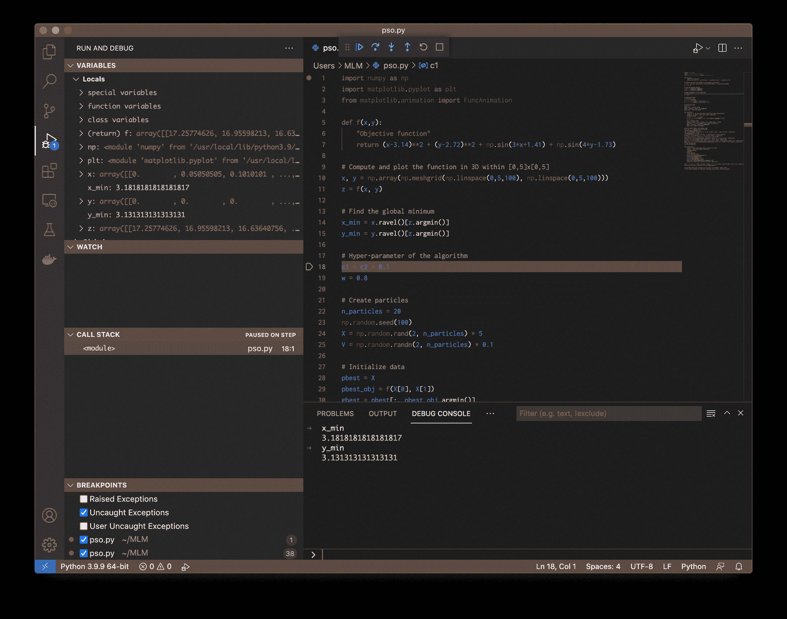

# Python 调试工具

> 原文：[`machinelearningmastery.com/python-debugging-tools/`](https://machinelearningmastery.com/python-debugging-tools/)

在所有编程练习中，没有一个方便的调试器是很难深入进行的。Python 内置的调试器 `pdb` 是一个成熟且强大的工具，如果你知道如何使用它，它能为我们提供很大帮助。在本教程中，我们将了解 `pdb` 能为你做什么以及一些替代工具。

在本教程中，你将学习：

+   调试器能做什么

+   如何控制调试器

+   Python 的 pdb 及其替代方案的局限性

**启动你的项目**，请查看我的新书[《机器学习 Python》](https://machinelearningmastery.com/python-for-machine-learning/)，包括*逐步教程*和*所有示例的 Python 源代码*文件。

让我们开始吧！[](../Images/65633c08afe79c993b2b94e190c42481.png)

Python 调试工具

图片由[托马斯·帕克](https://unsplash.com/photos/AF2k44m22-I)提供。保留所有权利。

## 教程概述

本教程分为 4 部分；它们是

+   调试器的运行概念

+   使用调试器的演练

+   Visual Studio Code 中的调试器

+   在运行中的 Python 程序上使用 GDB

## 调试器的运行概念

调试器的目的是为你提供一个慢动作按钮来控制程序的流程。它还允许你在某个时间点冻结程序并检查状态。

在调试器下，最简单的操作是**逐步执行**代码。即一次运行一行代码，等待你的确认后再继续下一行。我们希望以这种停停走走的方式运行程序，是为了检查逻辑和数值或验证算法。

对于较大的程序，我们可能不想从头开始逐步执行代码，因为这可能需要很长时间才能到达我们感兴趣的行。因此，调试器还提供了一个**断点**功能，当达到特定代码行时它会触发。从那时起，我们可以逐行执行代码。

## 使用调试器的演练

让我们看看如何使用调试器，通过一个例子来演示。以下是用于显示[粒子群优化](https://machinelearningmastery.com/a-gentle-introduction-to-particle-swarm-optimization/)动画的 Python 代码：

```py
import numpy as np
import matplotlib.pyplot as plt
from matplotlib.animation import FuncAnimation

def f(x,y):
    "Objective function"
    return (x-3.14)**2 + (y-2.72)**2 + np.sin(3*x+1.41) + np.sin(4*y-1.73)

# Compute and plot the function in 3D within [0,5]x[0,5]
x, y = np.array(np.meshgrid(np.linspace(0,5,100), np.linspace(0,5,100)))
z = f(x, y)

# Find the global minimum
x_min = x.ravel()[z.argmin()]
y_min = y.ravel()[z.argmin()]

# Hyper-parameter of the algorithm
c1 = c2 = 0.1
w = 0.8

# Create particles
n_particles = 20
np.random.seed(100)
X = np.random.rand(2, n_particles) * 5
V = np.random.randn(2, n_particles) * 0.1

# Initialize data
pbest = X
pbest_obj = f(X[0], X[1])
gbest = pbest[:, pbest_obj.argmin()]
gbest_obj = pbest_obj.min()

def update():
    "Function to do one iteration of particle swarm optimization"
    global V, X, pbest, pbest_obj, gbest, gbest_obj
    # Update params
    r1, r2 = np.random.rand(2)
    V = w * V + c1*r1*(pbest - X) + c2*r2*(gbest.reshape(-1,1)-X)
    X = X + V
    obj = f(X[0], X[1])
    pbest[:, (pbest_obj >= obj)] = X[:, (pbest_obj >= obj)]
    pbest_obj = np.array([pbest_obj, obj]).min(axis=0)
    gbest = pbest[:, pbest_obj.argmin()]
    gbest_obj = pbest_obj.min()

# Set up base figure: The contour map
fig, ax = plt.subplots(figsize=(8,6))
fig.set_tight_layout(True)
img = ax.imshow(z, extent=[0, 5, 0, 5], origin='lower', cmap='viridis', alpha=0.5)
fig.colorbar(img, ax=ax)
ax.plot([x_min], [y_min], marker='x', markersize=5, color="white")
contours = ax.contour(x, y, z, 10, colors='black', alpha=0.4)
ax.clabel(contours, inline=True, fontsize=8, fmt="%.0f")
pbest_plot = ax.scatter(pbest[0], pbest[1], marker='o', color='black', alpha=0.5)
p_plot = ax.scatter(X[0], X[1], marker='o', color='blue', alpha=0.5)
p_arrow = ax.quiver(X[0], X[1], V[0], V[1], color='blue', width=0.005, angles='xy', scale_units='xy', scale=1)
gbest_plot = plt.scatter([gbest[0]], [gbest[1]], marker='*', s=100, color='black', alpha=0.4)
ax.set_xlim([0,5])
ax.set_ylim([0,5])

def animate(i):
    "Steps of PSO: algorithm update and show in plot"
    title = 'Iteration {:02d}'.format(i)
    # Update params
    update()
    # Set picture
    ax.set_title(title)
    pbest_plot.set_offsets(pbest.T)
    p_plot.set_offsets(X.T)
    p_arrow.set_offsets(X.T)
    p_arrow.set_UVC(V[0], V[1])
    gbest_plot.set_offsets(gbest.reshape(1,-1))
    return ax, pbest_plot, p_plot, p_arrow, gbest_plot

anim = FuncAnimation(fig, animate, frames=list(range(1,50)), interval=500, blit=False, repeat=True)
anim.save("PSO.gif", dpi=120, writer="imagemagick")

print("PSO found best solution at f({})={}".format(gbest, gbest_obj))
print("Global optimal at f({})={}".format([x_min,y_min], f(x_min,y_min)))
```

粒子群优化通过执行 `update()` 函数若干次来完成。每次运行时，我们距离目标函数的最优解越来越近。我们使用 matplotlib 的 `FuncAnimation()` 函数来代替循环执行 `update()`，以便我们可以捕捉每次迭代中粒子的位置。

假设这个程序保存为 `pso.py`。要在命令行中运行这个程序，只需输入：

```py
python pso.py
```

结果将被打印到屏幕上，动画将保存为 `PSO.gif`。但如果我们想使用 Python 调试器运行它，我们需要在命令行中输入以下内容：

```py
python -m pdb pso.py
```

`-m pdb`部分将加载`pdb`模块并让该模块为你执行文件`pso.py`。当你运行此命令时，你将看到如下的`pdb`提示符：

```py
> /Users/mlm/pso.py(1)<module>()
-> import numpy as np
(Pdb)
```

在提示符下，你可以输入调试器命令。要显示支持的命令列表，我们可以使用`h`。要显示特定命令的详细信息（例如`list`），我们可以使用`h list`：

```py
> /Users/mlm/pso.py(1)<module>()
-> import numpy as np
(Pdb) h

Documented commands (type help <topic>):
========================================
EOF    c          d        h         list      q        rv       undisplay
a      cl         debug    help      ll        quit     s        unt
alias  clear      disable  ignore    longlist  r        source   until
args   commands   display  interact  n         restart  step     up
b      condition  down     j         next      return   tbreak   w
break  cont       enable   jump      p         retval   u        whatis
bt     continue   exit     l         pp        run      unalias  where

Miscellaneous help topics:
==========================
exec  pdb

(Pdb)
```

在调试会话开始时，我们从程序的第一行开始。通常，Python 程序会以几行`import`开头。我们可以使用`n`移动到下一行，或使用`s`进入函数：

```py
> /Users/mlm/pso.py(1)<module>()
-> import numpy as np
(Pdb) n
> /Users/mlm/pso.py(2)<module>()
-> import matplotlib.pyplot as plt
(Pdb) n
> /Users/mlm/pso.py(3)<module>()
-> from matplotlib.animation import FuncAnimation
(Pdb) n
> /Users/mlm/pso.py(5)<module>()
-> def f(x,y):
(Pdb) n
> /Users/mlm/pso.py(10)<module>()
-> x, y = np.array(np.meshgrid(np.linspace(0,5,100), np.linspace(0,5,100)))
(Pdb) n
> /Users/mlm/pso.py(11)<module>()
-> z = f(x, y)
(Pdb) s
--Call--
> /Users/mlm/pso.py(5)f()
-> def f(x,y):
(Pdb) s
> /Users/mlm/pso.py(7)f()
-> return (x-3.14)**2 + (y-2.72)**2 + np.sin(3*x+1.41) + np.sin(4*y-1.73)
(Pdb) s
--Return--
> /Users/mlm/pso.py(7)f()->array([[17.25... 7.46457344]])
-> return (x-3.14)**2 + (y-2.72)**2 + np.sin(3*x+1.41) + np.sin(4*y-1.73)
(Pdb) s
> /Users/mlm/pso.py(14)<module>()
-> x_min = x.ravel()[z.argmin()]
(Pdb)
```

在`pdb`中，代码行会在提示符之前打印出来。通常，我们更倾向于使用`n`命令，因为它会执行那一行代码并在**相同级别**上移动流程，而不会进一步深入。当我们处于调用函数的行（例如上述程序中的第 11 行，运行`z = f(x, y)`）时，我们可以使用`s`来**进入**函数。

在上述示例中，我们首先进入了`f()`函数，然后执行计算，再将返回值从函数中收集出来并返回到调用函数的行。我们发现即使是像一行这样的简单函数，也需要多个`s`命令，因为从语句中找到函数、调用函数和返回函数各需一步。我们还看到，在函数体内，我们像调用函数一样调用了`np.sin()`，但调试器的`s`命令没有进入它。这是因为`np.sin()`函数不是用 Python 实现的，而是用 C 实现的。`pdb`不支持编译代码。

如果程序很长，多次使用`n`命令移动到我们感兴趣的地方会非常无聊。我们可以使用`until`命令和行号，让调试器运行程序直到到达那一行：

```py
> /Users/mlm/pso.py(1)<module>()
-> import numpy as np
(Pdb) until 11
> /Users/mlm/pso.py(11)<module>()
-> z = f(x, y)
(Pdb) s
--Call--
> /Users/mlm/pso.py(5)f()
-> def f(x,y):
(Pdb) s
> /Users/mlm/pso.py(7)f()
-> return (x-3.14)**2 + (y-2.72)**2 + np.sin(3*x+1.41) + np.sin(4*y-1.73)
(Pdb) s
--Return--
> /Users/mlm/pso.py(7)f()->array([[17.25... 7.46457344]])
-> return (x-3.14)**2 + (y-2.72)**2 + np.sin(3*x+1.41) + np.sin(4*y-1.73)
(Pdb) s
> /Users/mlm/pso.py(14)<module>()
-> x_min = x.ravel()[z.argmin()]
(Pdb)
```

类似于`until`的命令是`return`，它将执行当前函数直到即将返回的点。你可以将其视为`until`，行号等于当前函数的最后一行。`until`命令是一次性的，意味着它只会将你带到那一行。如果你希望每次程序运行到特定行时**停下来**，我们可以在该行设置**断点**。例如，如果我们对优化算法每次迭代如何移动解感兴趣，可以在应用更新后立即设置一个断点：

```py
> /Users/mlm/pso.py(1)<module>()
-> import numpy as np
(Pdb) b 40
Breakpoint 1 at /Users/mlm/pso.py:40
(Pdb) c
> /Users/mlm/pso.py(40)update()
-> obj = f(X[0], X[1])
(Pdb) bt
  /usr/local/Cellar/python@3.9/3.9.9/Frameworks/Python.framework/Versions/3.9/lib/python3.9/bdb.py(580)run()
-> exec(cmd, globals, locals)
  <string>(1)<module>()
  /Users/mlm/pso.py(76)<module>()
-> anim.save("PSO.gif", dpi=120, writer="imagemagick")
  /usr/local/lib/python3.9/site-packages/matplotlib/animation.py(1078)save()
-> anim._init_draw()  # Clear the initial frame
  /usr/local/lib/python3.9/site-packages/matplotlib/animation.py(1698)_init_draw()
-> self._draw_frame(frame_data)
  /usr/local/lib/python3.9/site-packages/matplotlib/animation.py(1720)_draw_frame()
-> self._drawn_artists = self._func(framedata, *self._args)
  /Users/mlm/pso.py(65)animate()
-> update()
> /Users/mlm/pso.py(40)update()
-> obj = f(X[0], X[1])
(Pdb) p r1
0.8054505373292797
(Pdb) p r2
0.7543489945823536
(Pdb) p X
array([[2.77550474, 1.60073607, 2.14133019, 4.11466522, 0.2445649 ,
        0.65149396, 3.24520628, 4.08804798, 0.89696478, 2.82703884,
        4.42055413, 1.03681404, 0.95318658, 0.60737118, 1.17702652,
        4.67551174, 3.95781321, 0.95077669, 4.08220292, 1.33330594],
       [2.07985611, 4.53702225, 3.81359193, 1.83427181, 0.87867832,
        1.8423856 , 0.11392109, 1.2635162 , 3.84974582, 0.27397365,
        2.86219806, 3.05406841, 0.64253831, 1.85730719, 0.26090638,
        4.28053621, 4.71648133, 0.44101305, 4.14882396, 2.74620598]])
(Pdb) n
> /Users/mlm/pso.py(41)update()
-> pbest[:, (pbest_obj >= obj)] = X[:, (pbest_obj >= obj)]
(Pdb) n
> /Users/mlm/pso.py(42)update()
-> pbest_obj = np.array([pbest_obj, obj]).min(axis=0)
(Pdb) n
> /Users/mlm/pso.py(43)update()
-> gbest = pbest[:, pbest_obj.argmin()]
(Pdb) n
> /Users/mlm/pso.py(44)update()
-> gbest_obj = pbest_obj.min()
(Pdb)
```

在我们使用`b`命令设置断点后，可以让调试器运行程序直到断点被触发。`c`命令表示**继续**执行，直到遇到触发条件。任何时候，我们都可以使用`bt`命令显示 traceback 来检查我们是如何到达当前点的。我们也可以使用`p`命令打印变量（或表达式）来检查它们保存的值。

确实，我们可以设置带条件的断点，以便只有在满足条件时才会停下。下面的条件是第一个随机数（`r1`）大于 0.5：

```py
(Pdb) b 40, r1 > 0.5
Breakpoint 1 at /Users/mlm/pso.py:40
(Pdb) c
> /Users/mlm/pso.py(40)update()
-> obj = f(X[0], X[1])
(Pdb) p r1, r2
(0.8054505373292797, 0.7543489945823536)
(Pdb) c
> /Users/mlm/pso.py(40)update()
-> obj = f(X[0], X[1])
(Pdb) p r1, r2
(0.5404045753007164, 0.2967937508800147)
(Pdb)
```

确实，我们还可以尝试在调试过程中操作变量。

```py
(Pdb) l
 35  	    global V, X, pbest, pbest_obj, gbest, gbest_obj
 36  	    # Update params
 37  	    r1, r2 = np.random.rand(2)
 38  	    V = w * V + c1*r1*(pbest - X) + c2*r2*(gbest.reshape(-1,1)-X)
 39  	    X = X + V
 40 B->	    obj = f(X[0], X[1])
 41  	    pbest[:, (pbest_obj >= obj)] = X[:, (pbest_obj >= obj)]
 42  	    pbest_obj = np.array([pbest_obj, obj]).min(axis=0)
 43  	    gbest = pbest[:, pbest_obj.argmin()]
 44  	    gbest_obj = pbest_obj.min()
 45
(Pdb) p V
array([[ 0.03742722,  0.20930531,  0.06273426, -0.1710678 ,  0.33629384,
         0.19506555, -0.10238065, -0.12707257,  0.28042122, -0.03250191,
        -0.14004886,  0.13224399,  0.16083673,  0.21198813,  0.17530208,
        -0.27665503, -0.15344393,  0.20079061, -0.10057509,  0.09128536],
       [-0.05034548, -0.27986224, -0.30725954,  0.11214169,  0.0934514 ,
         0.00335978,  0.20517519,  0.06308483, -0.22007053,  0.26176423,
        -0.12617228, -0.05676629,  0.18296986, -0.01669114,  0.18934933,
        -0.27623121, -0.32482898,  0.213894  , -0.34427909, -0.12058168]])
(Pdb) p r1, r2
(0.5404045753007164, 0.2967937508800147)
(Pdb) r1 = 0.2
(Pdb) p r1, r2
(0.2, 0.2967937508800147)
(Pdb) j 38
> /Users/mlm/pso.py(38)update()
-> V = w * V + c1*r1*(pbest - X) + c2*r2*(gbest.reshape(-1,1)-X)
(Pdb) n
> /Users/mlm/pso.py(39)update()
-> X = X + V
(Pdb) p V
array([[ 0.02680837,  0.16594979,  0.06350735, -0.15577623,  0.30737655,
         0.19911613, -0.08242418, -0.12513798,  0.24939995, -0.02217463,
        -0.13474876,  0.14466204,  0.16661846,  0.21194543,  0.16952298,
        -0.24462505, -0.138997  ,  0.19377154, -0.10699911,  0.10631063],
       [-0.03606147, -0.25128615, -0.26362411,  0.08163408,  0.09842085,
         0.00765688,  0.19771385,  0.06597805, -0.20564599,  0.23113388,
        -0.0956787 , -0.07044121,  0.16637064, -0.00639259,  0.18245734,
        -0.25698717, -0.30336147,  0.19354112, -0.29904698, -0.08810355]])
(Pdb)
```

在上述内容中，我们使用 `l` 命令列出当前语句周围的代码（由箭头 `->` 标识）。在列表中，我们还可以看到断点（用 `B` 标记）设置在第 40 行。我们可以看到 `V` 和 `r1` 的当前值，我们可以将 `r1` 从 0.54 修改为 0.2，然后使用 `j`（跳转）到第 38 行再次运行语句。正如我们所见，使用 `n` 命令执行语句后，`V` 的值发生了变化。

如果我们使用断点并发现了一些意外情况，可能是由于调用堆栈中不同级别的问题导致的。调试器允许你导航到不同的级别：

```py
(Pdb) bt
  /usr/local/Cellar/python@3.9/3.9.9/Frameworks/Python.framework/Versions/3.9/lib/python3.9/bdb.py(580)run()
-> exec(cmd, globals, locals)
  <string>(1)<module>()
  /Users/mlm/pso.py(76)<module>()
-> anim.save("PSO.gif", dpi=120, writer="imagemagick")
  /usr/local/lib/python3.9/site-packages/matplotlib/animation.py(1091)save()
-> anim._draw_next_frame(d, blit=False)
  /usr/local/lib/python3.9/site-packages/matplotlib/animation.py(1126)_draw_next_frame()
-> self._draw_frame(framedata)
  /usr/local/lib/python3.9/site-packages/matplotlib/animation.py(1720)_draw_frame()
-> self._drawn_artists = self._func(framedata, *self._args)
  /Users/mlm/pso.py(65)animate()
-> update()
> /Users/mlm/pso.py(39)update()
-> X = X + V
(Pdb) up
> /Users/mlm/pso.py(65)animate()
-> update()
(Pdb) bt
  /usr/local/Cellar/python@3.9/3.9.9/Frameworks/Python.framework/Versions/3.9/lib/python3.9/bdb.py(580)run()
-> exec(cmd, globals, locals)
  <string>(1)<module>()
  /Users/mlm/pso.py(76)<module>()
-> anim.save("PSO.gif", dpi=120, writer="imagemagick")
  /usr/local/lib/python3.9/site-packages/matplotlib/animation.py(1091)save()
-> anim._draw_next_frame(d, blit=False)
  /usr/local/lib/python3.9/site-packages/matplotlib/animation.py(1126)_draw_next_frame()
-> self._draw_frame(framedata)
  /usr/local/lib/python3.9/site-packages/matplotlib/animation.py(1720)_draw_frame()
-> self._drawn_artists = self._func(framedata, *self._args)
> /Users/mlm/pso.py(65)animate()
-> update()
  /Users/mlm/pso.py(39)update()
-> X = X + V
(Pdb) l
 60
 61     def animate(i):
 62         "Steps of PSO: algorithm update and show in plot"
 63         title = 'Iteration {:02d}'.format(i)
 64         # Update params
 65  ->     update()
 66         # Set picture
 67         ax.set_title(title)
 68         pbest_plot.set_offsets(pbest.T)
 69         p_plot.set_offsets(X.T)
 70         p_arrow.set_offsets(X.T)
(Pdb) p title
'Iteration 02'
(Pdb)
```

在上述内容中，第一个 `bt` 命令在我们处于底部帧时给出调用堆栈，即调用堆栈的最深处。我们可以看到我们即将执行语句 `X = X + V`。然后 `up` 命令将我们的焦点移动到调用堆栈上一级，即运行 `update()` 函数的行（如我们在前面带有 `>` 的行中看到的）。由于我们的焦点发生了变化，列表命令 `l` 将打印出不同的代码片段，而 `p` 命令可以检查不同作用域中的变量。

上述内容涵盖了调试器中大部分有用的命令。如果我们想终止调试器（也会终止程序），可以使用 `q` 命令退出，或者如果终端支持的话按 Ctrl-D。

### 想开始使用 Python 进行机器学习吗？

立即参加我的免费 7 天邮件速成课程（包含示例代码）。

点击注册并获得免费 PDF 电子书版本的课程。

## Visual Studio Code 中的调试器

如果你在命令行中运行调试器不是很舒适，可以依赖 IDE 中的调试器。几乎所有情况下，IDE 都会提供一些调试功能。例如，在 Visual Studio Code 中，你可以在“运行”菜单中启动调试器。

下面的屏幕显示了在调试会话期间的 Visual Studio Code。中心顶部的按钮分别对应 `pdb` 命令 `continue`、`next`、`step`、`return`、`restart` 和 `quit`。通过点击行号可以创建一个断点，并且会出现一个红点来标识它。使用 IDE 的好处是可以在每一步调试中立即显示变量。我们还可以查看表达式并显示调用堆栈。这些功能位于下面屏幕的左侧。



## 在运行中的 Python 程序中使用 GDB

Python 的 `pdb` 仅适用于从头开始运行的程序。如果我们有一个已经运行但卡住的程序，则不能使用 pdb 来 **hook into** 它以检查发生了什么。然而，GDB 的 Python 扩展可以做到这一点。

举个例子，让我们考虑一个 GUI 应用程序。它会等待用户操作后才会结束。因此，它是一个完美的例子，说明我们如何使用 `gdb` 挂钩到正在运行的进程中。下面的代码是一个使用 PyQt5 的“hello world”程序，它只是创建一个空窗口并等待用户关闭它：

```py
import sys
from PyQt5.QtWidgets import QApplication, QWidget, QMainWindow

class Frame(QMainWindow):
        def __init__(self):
                super().__init__()
                self.initUI()
        def initUI(self):
                self.setWindowTitle("Simple title")
                self.resize(800,600)

def main():
        app = QApplication(sys.argv)
        frame = Frame()
        frame.show()
        sys.exit(app.exec_())

if __name__ == '__main__':
        main()
```

让我们将此程序保存为 `simpleqt.py` 并在 Linux 下的 X 窗口环境中使用以下命令运行：

```py
python simpleqt.py &
```

最终的 `&` 将使其在后台运行。现在我们可以使用 `ps` 命令检查其进程 ID：

```py
ps a | grep python
```

```py
...
   3997 pts/1    Sl     0:00 python simpleqt.py
...
```

`ps` 命令将告诉你第一列中的进程 ID。如果你安装了带有 Python 扩展的 `gdb`，我们可以运行：

```py
gdb python 3997
```

它将带你进入 GDB 的提示符：

```py
GNU gdb (Debian 10.1-1.7) 10.1.90.20210103-git
Copyright (C) 2021 Free Software Foundation, Inc.
License GPLv3+: GNU GPL version 3 or later <http://gnu.org/licenses/gpl.html>
This is free software: you are free to change and redistribute it.
There is NO WARRANTY, to the extent permitted by law.
Type "show copying" and "show warranty" for details.
This GDB was configured as "x86_64-linux-gnu".
Type "show configuration" for configuration details.
For bug reporting instructions, please see:
<https://www.gnu.org/software/gdb/bugs/>.
Find the GDB manual and other documentation resources online at:
    <http://www.gnu.org/software/gdb/documentation/>.

For help, type "help".
Type "apropos word" to search for commands related to "word"...
Reading symbols from python...
Reading symbols from /usr/lib/debug/.build-id/f9/02f8a561c3abdb9c8d8c859d4243bd8c3f928f.debug...
Attaching to program: /usr/local/bin/python, process 3997
[New LWP 3998]
[New LWP 3999]
[New LWP 4001]
[New LWP 4002]
[New LWP 4003]
[New LWP 4004]
[Thread debugging using libthread_db enabled]
Using host libthread_db library "/lib/x86_64-linux-gnu/libthread_db.so.1".
0x00007fb11b1c93ff in __GI___poll (fds=0x7fb110007220, nfds=3, timeout=-1) at ../sysdeps/unix/sysv/linux/poll.c:29
29      ../sysdeps/unix/sysv/linux/poll.c: No such file or directory.
(gdb) py-bt
Traceback (most recent call first):
  <built-in method exec_ of QApplication object at remote 0x7fb115f64c10>
  File "/mnt/data/simpleqt.py", line 16, in main
    sys.exit(app.exec_())
  File "/mnt/data/simpleqt.py", line 19, in <module>
    main()
(gdb) py-list
  11    
  12    def main():
  13            app = QApplication(sys.argv)
  14            frame = Frame()
  15            frame.show()
 >16            sys.exit(app.exec_())
  17    
  18    if __name__ == '__main__':
  19            main()
(gdb)
```

GDB 应该是一个用于编译程序（通常是 C 或 C++）的调试器。Python 扩展允许你检查由 Python 解释器（用 C 编写）运行的代码（用 Python 编写）。在处理 Python 代码方面，它的功能不如 Python 的`PDB`丰富，但当你需要将其挂钩到正在运行的进程中时，它非常有价值。

GDB 支持的命令有 `py-list`、`py-bt`、`py-up`、`py-down` 和 `py-print`。它们与 `pdb` 中相同的命令类似，只是没有 `py-` 前缀。

如果你的 Python 代码使用了从 C 编译的库（如 numpy），并且你想调查它的运行情况，GDB 很有用。它也有助于通过检查运行时的调用栈来了解程序为何被冻结。然而，使用 GDB 调试你的机器学习项目可能比较少见。

## 进一步阅读

Python `pdb` 模块的文档在

+   [`docs.python.org/3/library/pdb.html`](https://docs.python.org/3/library/pdb.html)

但 `pdb` 不是唯一的调试器。一些第三方工具列在：

+   [Python 调试工具维基页面](https://wiki.python.org/moin/PythonDebuggingTools)

对于带有 Python 扩展的 GDB，最佳使用环境是 Linux。有关其使用的更多细节，请参见以下内容：

+   [更简单的 Python 调试](https://fedoraproject.org/wiki/Features/EasierPythonDebugging)

+   [使用 GDB 调试](https://wiki.python.org/moin/DebuggingWithGdb)

`pdb` 的命令接口受到 GDB 的影响。因此，我们可以从后者学习调试程序的一般技术。一个很好的调试器使用入门书籍是：

+   [使用 GDB、DDD 和 Eclipse 调试的艺术](https://www.amazon.com/dp/B00HQ1L78K)，作者 Norman Matloff（2008）

## 总结

在本教程中，你发现了 Python 的 `pdb` 的功能。

具体来说，你学到了：

+   `pdb` 能做什么以及如何使用它

+   `pdb` 的限制和替代方案

在下一篇文章中，我们将看到 `pdb` 也是一个可以在 Python 程序内部调用的 Python 函数。
