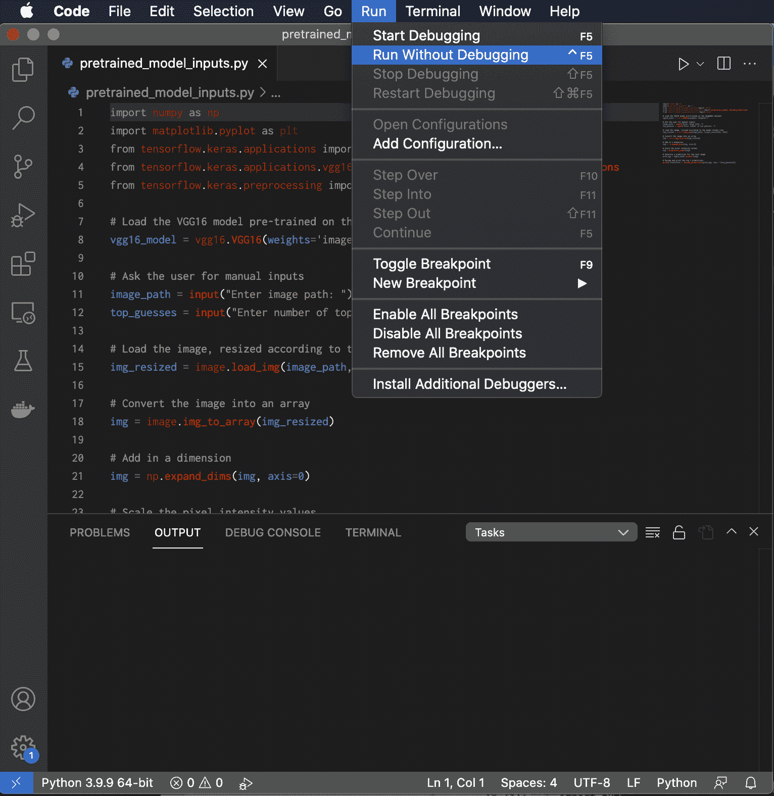

# 运行和传递信息给 Python 脚本

> 原文：[`machinelearningmastery.com/running-and-passing-information-to-a-python-script/`](https://machinelearningmastery.com/running-and-passing-information-to-a-python-script/)

运行 Python 脚本是开发过程中的一个重要步骤，因为通过这种方式你可以确定你的代码是否按预期工作。同时，我们通常需要将信息传递给 Python 脚本，以使其正常工作。

在本教程中，你将发现多种运行和传递信息给 Python 脚本的方法。

完成本教程后，你将了解到：

+   如何使用命令行界面、Jupyter Notebook 或集成开发环境（IDE）运行 Python 脚本

+   如何使用 sys.argv 命令将信息传递给 Python 脚本，方法是通过硬编码输入变量到 Jupyter Notebook 中或通过交互式使用 input() 函数。

**用我的新书《Python 机器学习》**启动你的项目，[Python for Machine Learning](https://machinelearningmastery.com/python-for-machine-learning/)，包括*逐步教程*和*Python 源代码*文件。

让我们开始吧。

运行和传递信息给 Python 脚本

图片来源 [Andrea Leopardi](https://unsplash.com/photos/QVD3Xht9txA)，部分权利保留。

## **教程概述**

本教程分为两部分；它们是：

+   运行 Python 脚本

    +   使用命令行界面

    +   使用 Jupyter Notebook

    +   使用集成开发环境（IDE）

+   Python 输入

## **运行 Python 脚本：**

### **使用命令行界面**

命令行界面广泛用于运行 Python 代码。

首先，根据你使用的操作系统，打开一个命令提示符或终端窗口，测试一些命令。

在命令行界面中输入 python 命令将启动一个 Python 交互式会话。你将看到一条消息，告知你所使用的 Python 版本。

Python

```py
Python 3.7.4 (default, Aug 13 2019, 15:17:50)&nbsp;
[Clang 4.0.1 (tags/RELEASE_401/final)] :: Anaconda, Inc. on darwin
Type "help", "copyright", "credits" or "license" for more information.
```

在交互式会话中，你在命令行界面中输入的任何语句都会立即执行。例如，输入 2 + 3 会返回 5：

Python

```py
2 + 3
```

Python

```py
5
```

以这种方式进行交互式会话有其优势，因为你可以轻松快速地测试 Python 代码的各行。然而，如果我们更关注编写较长的程序（如开发机器学习算法），这不是理想的选择。代码还会在交互式会话结束后消失。

另一种选择是运行 Python 脚本。我们先从一个简单的例子开始。

在文本编辑器（例如[Notepad++](https://notepad-plus-plus.org/)，[Visual Studio Code](https://code.visualstudio.com/)或[Sublime Text](https://www.sublimetext.com/)）中，键入语句 `print("Hello World!")` 并将文件保存为*test_script.py*或任何其他名称，只要包含*.py*扩展名。

现在，返回到您的命令行界面，键入`python`命令，后跟您的脚本文件名。在执行此操作之前，您可能需要更改路径，以指向包含脚本文件的目录。运行脚本文件应该会产生以下输出：

Python

```py
python test_script.py
```

Python

```py
Hello World!
```

现在让我们编写一个脚本文件，加载预训练的 Keras 模型，并输出对[此](https://unsplash.com/photos/2l0CWTpcChI)狗图像的预测。通常情况下，我们还需要通过命令行*参数*向 Python 脚本传递信息。为此，我们将使用`sys.argv`命令将图像路径和要返回的前几个猜测的数量传递给脚本。如果代码需要，我们可以有尽可能多的输入参数，此时我们将继续从参数列表中读取输入。

现在我们将要运行的脚本文件包含以下代码：

Python

```py
import sys
import numpy as np
from tensorflow.keras.applications import vgg16
from tensorflow.keras.applications.vgg16 import preprocess_input, decode_predictions
from tensorflow.keras.preprocessing import image

# Load the VGG16 model pre-trained on the ImageNet dataset
vgg16_model = vgg16.VGG16(weights='imagenet')

# Read the command-line argument passed to the interpreter when invoking the script
image_path = sys.argv[1]
top_guesses = sys.argv[2]

# Load the image, resized according to the model target size
img_resized = image.load_img(image_path, target_size=(224, 224))

# Convert the image into an array
img = image.img_to_array(img_resized) 

# Add in a dimension
img = np.expand_dims(img, axis=0) 

# Scale the pixel intensity values
img = preprocess_input(img) 

# Generate a prediction for the test image
pred_vgg = vgg16_model.predict(img)

# Decode and print the top 3 predictions
print('Prediction:', decode_predictions(pred_vgg, top=int(top_guesses)))
```

在上述代码中，我们使用`sys.argv[1]`和`sys.argv[2]`读取命令行参数的前两个参数。我们可以通过使用`python`命令后跟脚本文件名来运行脚本，并进一步传递图像路径（在图像保存到磁盘后）和我们想要预测的前几个猜测的数量：

Python

```py
python pretrained_model.py dog.jpg 3
```

在这里，*pretrained_model.py*是脚本文件的名称，*dog.jpg*图像已保存在同一个目录中，该目录还包含 Python 脚本。

生成的前三个猜测如下：

Python

```py
Prediction: [[('n02088364', 'beagle', 0.6751468), ('n02089867', 'Walker_hound', 0.1394801), ('n02089973', 'English_foxhound', 0.057901423)]]
```

但在命令行中可能还有更多内容。例如，以下命令行将以“优化”模式运行脚本，在此模式下，调试变量`__debug__`被设置为`False`，并且跳过`assert`语句。

Python

```py
python -O test_script.py
```

以下是使用 Python 模块（例如调试器）启动脚本的方法：

Python

```py
python -m pdb test_script.py
```

我们将在另一篇文章中讨论调试器和分析器的使用。

## **使用 Jupyter Notebook**

从命令行界面运行 Python 脚本是一个直接的选择，如果您的代码生成字符串输出而不是其他内容。

然而，当我们处理图像时，通常希望生成可视化输出。我们可能会检查输入图像上应用的任何预处理的正确性，然后将其馈送到神经网络中，或者可视化神经网络产生的结果。Jupyter Notebook 提供了一个交互式计算环境，可以帮助我们实现这一目标。

通过 Jupyter Notebook 界面运行 Python 脚本的一种方法是简单地将代码添加到笔记本中的一个“单元格”中。但这意味着您的代码仅留在 Jupyter 笔记本中，无法像使用上述命令行那样在其他地方访问。另一种方法是使用以%字符为前缀的运行魔术命令。尝试在 Jupyter Notebook 的一个单元格中输入以下代码：

Python

```py
%run pretrained_model.py dog.jpg 3
```

在这里，我们再次指定 Python 脚本文件名为*pretrained_model.py*，接着是图像路径和顶部猜测的数量作为输入参数。您将看到前三个预测结果打印在生成此结果的单元格下方。

现在，假设我们想要显示输入图像，以检查它是否已按照模型目标大小加载。为此，我们将稍微修改代码如下，并保存到一个新的 Python 脚本*pretrained_model_image.py*中：

Python

```py
import sys
import numpy as np
import matplotlib.pyplot as plt
from tensorflow.keras.applications import vgg16
from tensorflow.keras.applications.vgg16 import preprocess_input, decode_predictions
from tensorflow.keras.preprocessing import image

# Load the VGG16 model pre-trained on the ImageNet dataset
vgg16_model = vgg16.VGG16(weights='imagenet')

# Read the arguments passed to the interpreter when invoking the script
image_path = sys.argv[1]
top_guesses = sys.argv[2]

# Load the image, resized according to the model target size
img_resized = image.load_img(image_path, target_size=(224, 224))

# Convert the image into an array
img = image.img_to_array(img_resized)

# Display the image to check that it has been correctly resized
plt.imshow(img.astype(np.uint8))

# Add in a dimension
img = np.expand_dims(img, axis=0) 

# Scale the pixel intensity values
img = preprocess_input(img) 

# Generate a prediction for the test image
pred_vgg = vgg16_model.predict(img)

# Decode and print the top 3 predictions
print('Prediction:', decode_predictions(pred_vgg, top=int(top_guesses)))
```

通过 Jupyter Notebook 界面运行新保存的 Python 脚本现在显示了调整大小为$224 \times 224$像素的图像，并打印了前三个预测结果：

Python

```py
%run pretrained_model_image.py dog.jpg 3
```


在 Jupyter Notebook 中运行 Python 脚本

或者，我们可以将代码简化为以下内容（并将其保存到另一个 Python 脚本*pretrained_model_inputs.py*中）：

Python

```py
# Load the VGG16 model pre-trained on the ImageNet dataset
vgg16_model = vgg16.VGG16(weights='imagenet')

# Load the image, resized according to the model target size
img_resized = image.load_img(image_path, target_size=(224, 224))

# Convert the image into an array
img = image.img_to_array(img_resized) 

# Display the image to check that it has been correctly resized
plt.imshow(img.astype(np.uint8))

# Add in a dimension
img = np.expand_dims(img, axis=0) 

# Scale the pixel intensity values
img = preprocess_input(img) 

# Generate a prediction for the test image
pred_vgg = vgg16_model.predict(img)

# Decode and print the top 3 predictions
print('Prediction:', decode_predictions(pred_vgg, top=top_guesses))
```

并在 Jupyter Notebook 的一个单元格中定义输入变量。以这种方式运行 Python 脚本需要在%run 魔术之后使用-i 选项：

Python

```py
%run -i pretrained_model_inputs.py
```


在 Jupyter Notebook 中运行 Python 脚本

这样做的优点是更轻松地访问可以交互定义的 Python 脚本内的变量。

随着您的代码增长，结合文本编辑器与 Jupyter Notebook 可能会提供一种便捷的方法：文本编辑器可用于创建 Python 脚本，存储可重用的代码，而 Jupyter Notebook 则提供了交互式计算环境，便于数据探索。

### 想要开始使用 Python 进行机器学习吗？

现在立即获取我的免费 7 天电子邮件快速课程（附有示例代码）。

点击注册并获得课程的免费 PDF 电子书版本。

## **使用集成开发环境（IDE）**

另一种选择是从集成开发环境（IDE）运行 Python 脚本。这需要首先创建一个项目，并将带有*.py*扩展名的 Python 脚本添加到其中。

如果我们选择 PyCharm 或 Visual Studio Code 作为 IDE，这将要求我们创建一个新项目，然后选择我们想使用的 Python 解释器版本。在将 Python 脚本添加到新创建的项目后，可以运行它以生成输出。以下是 macOS 上运行 Visual Studio Code 的屏幕截图。根据 IDE 的不同，应该有一个选项来选择是否使用调试器运行代码。



## **Python 输入**

到目前为止，我们考虑了使用 sys.argv 命令或在运行脚本前在 Jupyter Notebook 中硬编码输入变量的选项，以将信息传递给 Python 脚本。

另一种选择是通过 input() 函数从用户那里获取输入。

考虑以下代码：

Python

```py
import numpy as np
import matplotlib.pyplot as plt
from tensorflow.keras.applications import vgg16
from tensorflow.keras.applications.vgg16 import preprocess_input, decode_predictions
from tensorflow.keras.preprocessing import image

# Load the VGG16 model pre-trained on the ImageNet dataset
vgg16_model = vgg16.VGG16(weights='imagenet')

# Ask the user for manual inputs
image_path = input("Enter image path: ")
top_guesses = input("Enter number of top guesses: ")

# Load the image, resized according to the model target size
img_resized = image.load_img(image_path, target_size=(224, 224))

# Convert the image into an array
img = image.img_to_array(img_resized)

# Add in a dimension
img = np.expand_dims(img, axis=0) 

# Scale the pixel intensity values
img = preprocess_input(img) 

# Generate a prediction for the test image
pred_vgg = vgg16_model.predict(img)

# Decode and print the top 3 predictions
print('Prediction:', decode_predictions(pred_vgg, top=int(top_guesses)))
```

在这里，系统会提示用户手动输入图像路径（图像已保存到包含 Python 脚本的同一目录中，因此只需指定图像名称即可）和要生成的 top guesses 数量。两个输入值都是字符串类型的；然而，top guesses 的数量在使用时会被转换为整数。

无论代码是在命令行界面、Jupyter Notebook 还是 Python IDE 中运行，它都会提示用户输入所需的输入值，并随后生成用户要求的预测数量。

## **进一步阅读**

本节提供了更多相关资源，如果你希望深入了解这个话题。

### **书籍**

+   [Python 基础知识](https://www.amazon.com/Python-Fundamentals-practical-learning-real-world-ebook/dp/B07K4CVYND/ref=sr_1_1?keywords=python+fundamentals+ebook&qid=1638986660&sr=8-1)，2018。

+   [Python 机器学习蓝图](https://www.amazon.com/Python-Machine-Learning-Blueprints-developing-ebook/dp/B07JLMHWRG)，2019。

## **总结**

在本教程中，你了解了运行 Python 脚本和传递信息的各种方式。

具体来说，你学到了：

+   如何使用命令行界面、Jupyter Notebook 或集成开发环境（IDE）运行 Python 脚本

+   如何通过在 Jupyter Notebook 中硬编码输入变量或使用 input() 函数的交互方式，将信息传递给 Python 脚本，使用 sys.argv 命令

你有任何问题吗？

在下方评论中提出你的问题，我会尽力回答。
