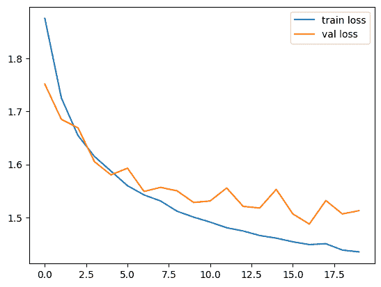
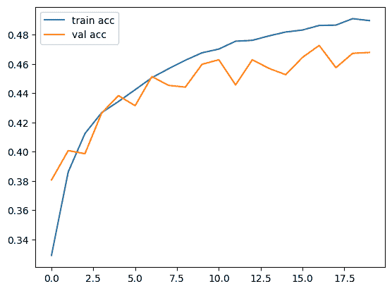

# 在 PyTorch 中使用单层神经网络构建图像分类器

> [`machinelearningmastery.com/building-an-image-classifier-with-a-single-layer-neural-network-in-pytorch/`](https://machinelearningmastery.com/building-an-image-classifier-with-a-single-layer-neural-network-in-pytorch/)

单层神经网络，也称为单层感知器，是最简单的神经网络类型。它仅由一层神经元组成，这些神经元连接到输入层和输出层。在图像分类器的情况下，输入层是图像，输出层是类别标签。

要在 PyTorch 中使用单层神经网络构建图像分类器，首先需要准备数据。这通常包括将图像和标签加载到 PyTorch 数据加载器中，然后将数据拆分为训练集和验证集。一旦数据准备好了，你就可以定义你的神经网络。

接下来，你可以使用 PyTorch 的内置函数在你的训练数据上训练网络，并在验证数据上评估其性能。你还需要选择一个优化器，如随机梯度下降（SGD），以及一个损失函数，如交叉熵损失。

注意，单层神经网络可能并不适合所有任务，但作为简单的分类器，它可以很好地发挥作用，并且有助于你理解神经网络的内部工作原理，并能够调试它。

所以，让我们构建我们的图像分类器。在这个过程中你将学习到：

+   如何在 PyTorch 中使用和预处理内置数据集。

+   如何在 PyTorch 中构建和训练自定义神经网络。

+   如何在 PyTorch 中一步步构建图像分类器。

+   如何使用训练好的模型在 PyTorch 中进行预测。

我们开始吧。


在 PyTorch 中使用单层神经网络构建图像分类器。

图片由 [Alex Fung](https://unsplash.com/photos/sKnJ84lF0gY) 提供。保留所有权利。

## 概述

本教程分为三个部分；它们是

+   准备数据集

+   构建模型架构

+   训练模型

## 准备数据集

在本教程中，你将使用 CIFAR-10 数据集。这个数据集用于图像分类，由 60,000 张 32×32 像素的彩色图像组成，分为 10 个类别，每个类别有 6,000 张图像。数据集包括 50,000 张训练图像和 10,000 张测试图像。类别包括飞机、汽车、鸟类、猫、鹿、狗、青蛙、马、船和卡车。CIFAR-10 是一个广泛使用的数据集，适用于机器学习和计算机视觉研究，因为它相对较小且简单，但足够具有挑战性，需要使用深度学习方法。这个数据集可以很方便地导入到 PyTorch 库中。

下面是操作方法。

```py
import torch
import torchvision
import torchvision.transforms as transforms

# import the CIFAR-10 dataset
train_set = torchvision.datasets.CIFAR10(root='./data', train=True, download=True, transform=transforms.ToTensor())
test_set = torchvision.datasets.CIFAR10(root='./data', train=False, download=True, transform=transforms.ToTensor())
```

如果你以前从未下载过数据集，你可能会看到这段代码显示了图像下载的来源：

```py
Downloading https://www.cs.toronto.edu/~kriz/cifar-10-python.tar.gz to ./data/cifar-10-python.tar.gz
  0%|          | 0/170498071 [00:00<!--?, ?it/s]
Extracting ./data/cifar-10-python.tar.gz to ./data
Files already downloaded and verified
```

你指定了数据集应下载的 `root` 目录，并设置 `train=True` 以导入训练集，设置 `train=False` 以导入测试集。`download=True` 参数将在指定的 `root` 目录中如果数据集尚未存在时进行下载。

## 构建神经网络模型

定义一个简单的神经网络 `SimpleNet`，它继承自 `torch.nn.Module`。该网络有两个全连接（fc）层，`fc1` 和 `fc2`，在 `__init__` 方法中定义。第一个全连接层 `fc1` 以图像作为输入，并具有 100 个隐藏神经元。类似地，第二个全连接层 `fc2` 具有 100 个输入神经元和 `num_classes` 个输出神经元。`num_classes` 参数默认为 10，因为有 10 个类别。

此外，`forward` 方法定义了网络的前向传播，其中输入 `x` 通过在 `__init__` 方法中定义的层进行处理。该方法首先使用 `view` 方法将输入张量 `x` 重新调整为所需的形状。然后，输入通过全连接层及其激活函数，最后返回一个输出张量。

**用我的书 [深度学习与 PyTorch](https://machinelearningmastery.com/deep-learning-with-pytorch/) 为你的项目打个好开始**。它提供了 **自学教程** 和 **工作代码**。

这里是上述所有内容的代码。

```py
# Create the Data object
dataset = Data()
```

编写一个函数来可视化这些数据，这在你以后训练模型时也会很有用。

```py
import torch.nn as nn

class SimpleNet(nn.Module):
    def __init__(self, num_classes=10):
        super(SimpleNet, self).__init__()
        self.fc1 = nn.Linear(32*32*3, 100) # Fully connected layer with 100 hidden neurons
        self.fc2 = nn.Linear(100, num_classes) # Fully connected layer with num_classes outputs

    def forward(self, x):
        x = x.view(-1, 32*32*3) # reshape the input tensor
        x = self.fc1(x)
        x = torch.relu(x)
        x = self.fc2(x)
        return x
```

现在，让我们实例化模型对象。

```py
# Instantiate the model
model = SimpleNet()
```

### 想要开始使用 PyTorch 进行深度学习吗？

立即获取我的免费电子邮件速成课程（附样本代码）。

点击注册，还可以获得课程的免费 PDF 电子书版本。

## 训练模型

你将创建两个 PyTorch `DataLoader` 类的实例，分别用于训练和测试。在 `train_loader` 中，你将批次大小设置为 64，并通过设置 `shuffle=True` 随机打乱训练数据。

然后，你将定义交叉熵损失函数和 Adam 优化器以训练模型。你将优化器的学习率设置为 0.001。

对于 `test_loader` 来说类似，只不过我们不需要进行洗牌。

```py
# Load the data into PyTorch DataLoader
train_loader = torch.utils.data.DataLoader(train_set, batch_size=64, shuffle=True)
test_loader = torch.utils.data.DataLoader(test_set, batch_size=64, shuffle=False)

# Define the loss function and optimizer
criterion = nn.CrossEntropyLoss()
optimizer = torch.optim.Adam(model.parameters(), lr=0.001)
```

最后，让我们设置一个训练循环，以训练我们的模型几个周期。你将定义一些空列表来存储损失和准确率指标的值。

```py
# train the model
num_epochs = 20
train_loss_history = []
train_acc_history = []
val_loss_history = []
val_acc_history = []

# Loop through the number of epochs
for epoch in range(num_epochs):
    train_loss = 0.0
    train_acc = 0.0
    val_loss = 0.0
    val_acc = 0.0

    # set model to train mode
    model.train()
    # iterate over the training data
    for inputs, labels in train_loader:
        optimizer.zero_grad()
        outputs = model(inputs)
        #compute the loss
        loss = criterion(outputs, labels)
        loss.backward()
        optimizer.step()
        # increment the running loss and accuracy
        train_loss += loss.item()
        train_acc += (outputs.argmax(1) == labels).sum().item()

    # calculate the average training loss and accuracy
    train_loss /= len(train_loader)
    train_loss_history.append(train_loss)
    train_acc /= len(train_loader.dataset)
    train_acc_history.append(train_acc)

    # set the model to evaluation mode
    model.eval()
    with torch.no_grad():
        for inputs, labels in test_loader:
            outputs = model(inputs)
            loss = criterion(outputs, labels)
            val_loss += loss.item()
            val_acc += (outputs.argmax(1) == labels).sum().item()

    # calculate the average validation loss and accuracy
    val_loss /= len(test_loader)
    val_loss_history.append(val_loss)
    val_acc /= len(test_loader.dataset)
    val_acc_history.append(val_acc)

    print(f'Epoch {epoch+1}/{num_epochs}, train loss: {train_loss:.4f}, train acc: {train_acc:.4f}, val loss: {val_loss:.4f}, val acc: {val_acc:.4f}')
```

运行此循环将打印以下内容：

```py
Epoch 1/20, train loss: 1.8757, train acc: 0.3292, val loss: 1.7515, val acc: 0.3807
Epoch 2/20, train loss: 1.7254, train acc: 0.3862, val loss: 1.6850, val acc: 0.4008
Epoch 3/20, train loss: 1.6548, train acc: 0.4124, val loss: 1.6692, val acc: 0.3987
Epoch 4/20, train loss: 1.6150, train acc: 0.4268, val loss: 1.6052, val acc: 0.4265
Epoch 5/20, train loss: 1.5874, train acc: 0.4343, val loss: 1.5803, val acc: 0.4384
Epoch 6/20, train loss: 1.5598, train acc: 0.4424, val loss: 1.5928, val acc: 0.4315
Epoch 7/20, train loss: 1.5424, train acc: 0.4506, val loss: 1.5489, val acc: 0.4514
Epoch 8/20, train loss: 1.5310, train acc: 0.4568, val loss: 1.5566, val acc: 0.4454
Epoch 9/20, train loss: 1.5116, train acc: 0.4626, val loss: 1.5501, val acc: 0.4442
Epoch 10/20, train loss: 1.5005, train acc: 0.4677, val loss: 1.5282, val acc: 0.4598
Epoch 11/20, train loss: 1.4911, train acc: 0.4702, val loss: 1.5310, val acc: 0.4629
Epoch 12/20, train loss: 1.4804, train acc: 0.4756, val loss: 1.5555, val acc: 0.4457
Epoch 13/20, train loss: 1.4743, train acc: 0.4762, val loss: 1.5207, val acc: 0.4629
Epoch 14/20, train loss: 1.4658, train acc: 0.4792, val loss: 1.5177, val acc: 0.4570
Epoch 15/20, train loss: 1.4608, train acc: 0.4819, val loss: 1.5529, val acc: 0.4527
Epoch 16/20, train loss: 1.4539, train acc: 0.4832, val loss: 1.5066, val acc: 0.4645
Epoch 17/20, train loss: 1.4486, train acc: 0.4863, val loss: 1.4874, val acc: 0.4727
Epoch 18/20, train loss: 1.4503, train acc: 0.4866, val loss: 1.5318, val acc: 0.4575
Epoch 19/20, train loss: 1.4383, train acc: 0.4910, val loss: 1.5065, val acc: 0.4673
Epoch 20/20, train loss: 1.4348, train acc: 0.4897, val loss: 1.5127, val acc: 0.4679
```

如你所见，这个单层分类器只训练了 20 个周期，并达到了大约 47% 的验证准确率。训练更多周期，你可能会获得一个不错的准确率。同样，我们的模型只有一个层，且有 100 个隐藏神经元。如果你添加更多层，准确率可能会显著提高。

现在，让我们绘制损失和准确率矩阵来查看它们的样子。

```py
import matplotlib.pyplot as plt

# Plot the training and validation loss
plt.plot(train_loss_history, label='train loss')
plt.plot(val_loss_history, label='val loss')
plt.legend()
plt.show()

# Plot the training and validation accuracy
plt.plot(train_acc_history, label='train acc')
plt.plot(val_acc_history, label='val acc')
plt.legend()
plt.show()
```

损失图如下所示：准确率图如下所示：

这里是您如何查看模型对真实标签的预测。

```py
import numpy as np

# get some validation data
for inputs, labels in test_loader:
    break  # this line stops the loop after the first iteration

# make predictions
outputs = model(inputs)
_, predicted = torch.max(outputs, 1)

# display the images and their labels
img_grid = torchvision.utils.make_grid(inputs)
img_grid = img_grid / 2 + 0.5     # unnormalize
npimg = img_grid.numpy()
plt.imshow(np.transpose(npimg, (1, 2, 0)))

print('True Labels: ', labels)
print('Predicted Labels: ', predicted)
```

打印的标签如下：

```py
True Labels:  tensor([3, 8, 8, 0, 6, 6, 1, 6, 3, 1, 0, 9, 5, 7, 9, 8, 5, 7, 8, 6, 7, 0, 4, 9,
        5, 2, 4, 0, 9, 6, 6, 5, 4, 5, 9, 2, 4, 1, 9, 5, 4, 6, 5, 6, 0, 9, 3, 9,
        7, 6, 9, 8, 0, 3, 8, 8, 7, 7, 4, 6, 7, 3, 6, 3])
Predicted Labels:  tensor([3, 9, 8, 8, 4, 6, 3, 6, 2, 1, 8, 9, 6, 7, 1, 8, 5, 3, 8, 6, 9, 2, 0, 9,
        4, 6, 6, 2, 9, 6, 6, 4, 3, 3, 9, 1, 6, 9, 9, 5, 0, 6, 7, 6, 0, 9, 3, 8,
        4, 6, 9, 4, 6, 3, 8, 8, 5, 8, 8, 2, 7, 3, 6, 9])
```

这些标签对应以下图片：


## 概要

在本教程中，您学习了如何仅使用单层神经网络构建图像分类器。具体来说，您学到了：

+   如何使用和预处理 PyTorch 中的内置数据集。

+   如何在 PyTorch 中构建和训练自定义神经网络。

+   如何在 PyTorch 中逐步构建图像分类器。

+   如何使用训练好的模型在 PyTorch 中进行预测。
