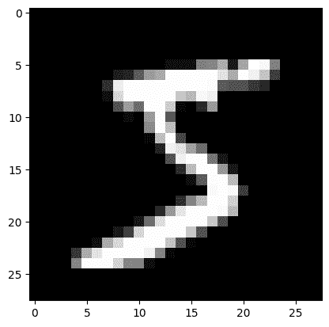
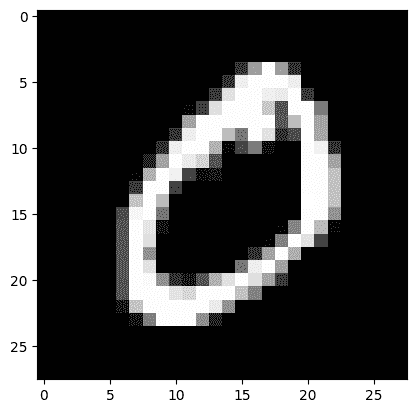
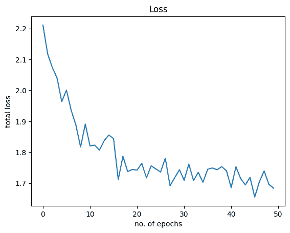
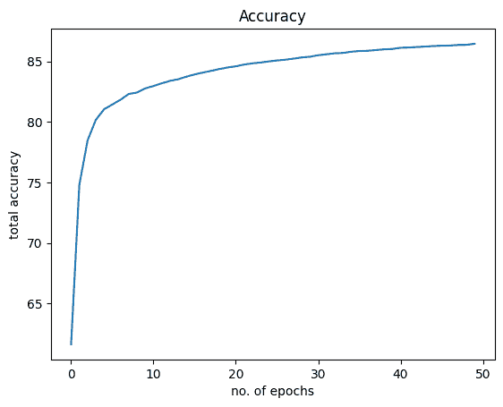

# 在 PyTorch 中构建逻辑回归分类器

> 原文：[`machinelearningmastery.com/building-a-logistic-regression-classifier-in-pytorch/`](https://machinelearningmastery.com/building-a-logistic-regression-classifier-in-pytorch/)

逻辑回归是一种回归类型，用于预测事件的概率。它用于分类问题，并在机器学习、人工智能和数据挖掘领域有许多应用。

逻辑回归的公式是对线性函数的输出应用 sigmoid 函数。本文讨论了如何构建逻辑回归分类器。虽然之前你在处理单变量数据集，但在这里我们将使用一个流行的 MNIST 数据集来训练和测试我们的模型。通过阅读本文，你将学到：

+   如何在 PyTorch 中使用逻辑回归以及它如何应用于实际问题。

+   如何加载和分析 torchvision 数据集。

+   如何在图像数据集上构建和训练逻辑回归分类器。

**启动你的项目**，请参考我的书籍 [《使用 PyTorch 进行深度学习》](https://machinelearningmastery.com/deep-learning-with-pytorch/)。它提供了**自学教程**和**有效代码**。

开始吧！

在 PyTorch 中构建逻辑回归分类器。

图片来自 [Catgirlmutant](https://unsplash.com/photos/hLIetAds3Lw)。保留一些权利。

## 概述

本教程分为四部分；它们是

+   MNIST 数据集

+   将数据集加载到 DataLoader 中

+   使用 `nn.Module` 构建模型

+   训练分类器

## MNIST 数据集

你将使用 MNIST 数据集来训练和测试一个逻辑回归模型。该数据集包含 6000 张用于训练的图像和 10000 张用于测试样本性能的图像。

MNIST 数据集如此流行，以至于它是 PyTorch 的一部分。以下是如何在 PyTorch 中加载 MNIST 数据集的训练和测试样本。

```py
import torch
import torchvision.transforms as transforms
from torchvision import datasets

# loading training data
train_dataset = datasets.MNIST(root='./data', 
                               train=True, 
                               transform=transforms.ToTensor(),
                               download=True)
#loading test data
test_dataset = datasets.MNIST(root='./data', 
                              train=False, 
                              transform=transforms.ToTensor())
```

数据集将被下载并提取到如下目录中。

```py
Downloading http://yann.lecun.com/exdb/mnist/train-images-idx3-ubyte.gz
Downloading http://yann.lecun.com/exdb/mnist/train-images-idx3-ubyte.gz to ./data/MNIST/raw/train-images-idx3-ubyte.gz
  0%|          | 0/9912422 [00:00<?, ?it/s]
Extracting ./data/MNIST/raw/train-images-idx3-ubyte.gz to ./data/MNIST/raw

Downloading http://yann.lecun.com/exdb/mnist/train-labels-idx1-ubyte.gz
Downloading http://yann.lecun.com/exdb/mnist/train-labels-idx1-ubyte.gz to ./data/MNIST/raw/train-labels-idx1-ubyte.gz
  0%|          | 0/28881 [00:00<?, ?it/s]
Extracting ./data/MNIST/raw/train-labels-idx1-ubyte.gz to ./data/MNIST/raw

Downloading http://yann.lecun.com/exdb/mnist/t10k-images-idx3-ubyte.gz
Downloading http://yann.lecun.com/exdb/mnist/t10k-images-idx3-ubyte.gz to ./data/MNIST/raw/t10k-images-idx3-ubyte.gz
  0%|          | 0/1648877 [00:00<?, ?it/s]
Extracting ./data/MNIST/raw/t10k-images-idx3-ubyte.gz to ./data/MNIST/raw

Downloading http://yann.lecun.com/exdb/mnist/t10k-labels-idx1-ubyte.gz
Downloading http://yann.lecun.com/exdb/mnist/t10k-labels-idx1-ubyte.gz to ./data/MNIST/raw/t10k-labels-idx1-ubyte.gz
  0%|          | 0/4542 [00:00<?, ?it/s]
Extracting ./data/MNIST/raw/t10k-labels-idx1-ubyte.gz to ./data/MNIST/raw
```

让我们验证数据集中训练和测试样本的数量。

```py
print("number of training samples: " + str(len(train_dataset)) + "\n" +
      "number of testing samples: " + str(len(test_dataset)))
```

它会打印

```py
number of training samples: 60000
number of testing samples: 10000
```

数据集中每个样本都是图像和标签的配对。要检查训练数据中第一个元素的数据类型和大小，你可以使用 `type()` 和 `size()` 方法。

```py
print("datatype of the 1st training sample: ", train_dataset[0][0].type())
print("size of the 1st training sample: ", train_dataset[0][0].size())
```

这将打印

```py
datatype of the 1st training sample:  torch.FloatTensor
size of the 1st training sample:  torch.Size([1, 28, 28])
```

你可以使用列表索引从数据集中访问样本。数据集中的第一个样本是 `FloatTensor`，它是一个 $28\times 28$ 像素的灰度图像（即一个通道），因此大小为 `[1, 28, 28]`。

现在，让我们检查训练集中的前两个样本的标签。

```py
# check the label of first two training sample
print("label of the first taining sample: ", train_dataset[0][1])
print("label of the second taining sample: ", train_dataset[1][1])
```

这显示了

```py
label of the first taining sample:  5
label of the second taining sample:  0
```

从上述内容可以看出，训练集中的前两张图像分别代表“5”和“0”。让我们展示这两张图像以确认。

```py
img_5 = train_dataset[0][0].numpy().reshape(28, 28)
plt.imshow(img_5, cmap='gray')
plt.show()
img_0 = train_dataset[1][0].numpy().reshape(28, 28)
plt.imshow(img_0, cmap='gray')
plt.show()
```

你应该能看到这两个数字：

## 将数据集加载到 DataLoader 中

通常情况下，你不直接在训练中使用数据集，而是通过一个`DataLoader`类。这使你可以批量读取数据，而不是逐个样本。

在接下来，数据以批量大小为 32 加载到`DataLoader`中。

```py
...
from torch.utils.data import DataLoader

# load train and test data samples into dataloader
batach_size = 32
train_loader = DataLoader(dataset=train_dataset, batch_size=batach_size, shuffle=True) 
test_loader = DataLoader(dataset=test_dataset, batch_size=batach_size, shuffle=False)
```

### 想要开始构建带有注意力的 Transformer 模型吗？

现在就参加我的免费 12 天电子邮件速成课程（附有示例代码）。

点击注册，并免费获取课程的 PDF 电子书版本。

## 使用`nn.Module`构建模型

让我们使用`nn.Module`为我们的逻辑回归模型构建模型类。这个类与以前的帖子中的类似，但是输入和输出的数量是可配置的。

```py
# build custom module for logistic regression
class LogisticRegression(torch.nn.Module):    
    # build the constructor
    def __init__(self, n_inputs, n_outputs):
        super(LogisticRegression, self).__init__()
        self.linear = torch.nn.Linear(n_inputs, n_outputs)
    # make predictions
    def forward(self, x):
        y_pred = torch.sigmoid(self.linear(x))
        return y_pred
```

此模型将以$28\times 28$像素的手写数字图像作为输入，并将它们分类为数字 0 到 9 中的一个输出类。因此，下面是如何实例化模型的方法。

```py
# instantiate the model
n_inputs = 28*28 # makes a 1D vector of 784
n_outputs = 10
log_regr = LogisticRegression(n_inputs, n_outputs)
```

## 训练分类器

你将使用随机梯度下降作为优化器，学习率为 0.001，交叉熵为损失度量来训练此模型。

然后，模型进行了 50 个周期的训练。请注意，你使用了`view()`方法将图像矩阵展平为行，以适应逻辑回归模型输入的形状。

```py
...

# defining the optimizer
optimizer = torch.optim.SGD(log_regr.parameters(), lr=0.001)
# defining Cross-Entropy loss
criterion = torch.nn.CrossEntropyLoss()

epochs = 50
Loss = []
acc = []
for epoch in range(epochs):
    for i, (images, labels) in enumerate(train_loader):
        optimizer.zero_grad()
        outputs = log_regr(images.view(-1, 28*28))
        loss = criterion(outputs, labels)
        # Loss.append(loss.item())
        loss.backward()
        optimizer.step()
    Loss.append(loss.item())
    correct = 0
    for images, labels in test_loader:
        outputs = log_regr(images.view(-1, 28*28))
        _, predicted = torch.max(outputs.data, 1)
        correct += (predicted == labels).sum()
    accuracy = 100 * (correct.item()) / len(test_dataset)
    acc.append(accuracy)
    print('Epoch: {}. Loss: {}. Accuracy: {}'.format(epoch, loss.item(), accuracy))
```

在训练过程中，你应该看到如下的进展：

```py
Epoch: 0\. Loss: 2.211054563522339\. Accuracy: 61.63
Epoch: 1\. Loss: 2.1178536415100098\. Accuracy: 74.81
Epoch: 2\. Loss: 2.0735440254211426\. Accuracy: 78.47
Epoch: 3\. Loss: 2.040225028991699\. Accuracy: 80.17
Epoch: 4\. Loss: 1.9637292623519897\. Accuracy: 81.05
Epoch: 5\. Loss: 2.000900983810425\. Accuracy: 81.44
...
Epoch: 45\. Loss: 1.6549798250198364\. Accuracy: 86.3
Epoch: 46\. Loss: 1.7053509950637817\. Accuracy: 86.31
Epoch: 47\. Loss: 1.7396119832992554\. Accuracy: 86.36
Epoch: 48\. Loss: 1.6963073015213013\. Accuracy: 86.37
Epoch: 49\. Loss: 1.6838685274124146\. Accuracy: 86.46
```

通过仅训练 50 个周期，你已经达到了约 86%的准确率。如果进一步训练模型，准确率可以进一步提高。

让我们看看损失和准确率图表的可视化效果。以下是损失：

```py
plt.plot(Loss)
plt.xlabel("no. of epochs")
plt.ylabel("total loss")
plt.title("Loss")
plt.show()
```



而这是关于准确率的情况：

```py
plt.plot(acc)
plt.xlabel("no. of epochs")
plt.ylabel("total accuracy")
plt.title("Accuracy")
plt.show()
```



将所有内容整合起来，以下是完整的代码：

```py
import torch
import torchvision.transforms as transforms
from torchvision import datasets
from torch.utils.data import DataLoader
import matplotlib.pyplot as plt

# loading training data
train_dataset = datasets.MNIST(root='./data', 
                               train=True, 
                               transform=transforms.ToTensor(),
                               download=True)
# loading test data
test_dataset = datasets.MNIST(root='./data', 
                              train=False, 
                              transform=transforms.ToTensor())

print("number of training samples: " + str(len(train_dataset)) + "\n" +
      "number of testing samples: " + str(len(test_dataset)))
print("datatype of the 1st training sample: ", train_dataset[0][0].type())
print("size of the 1st training sample: ", train_dataset[0][0].size())

# check the label of first two training sample
print("label of the first taining sample: ", train_dataset[0][1])
print("label of the second taining sample: ", train_dataset[1][1])

img_5 = train_dataset[0][0].numpy().reshape(28, 28)
plt.imshow(img_5, cmap='gray')
plt.show()
img_0 = train_dataset[1][0].numpy().reshape(28, 28)
plt.imshow(img_0, cmap='gray')
plt.show()

# load train and test data samples into dataloader
batach_size = 32
train_loader = DataLoader(dataset=train_dataset, batch_size=batach_size, shuffle=True) 
test_loader = DataLoader(dataset=test_dataset, batch_size=batach_size, shuffle=False)

# build custom module for logistic regression
class LogisticRegression(torch.nn.Module):    
    # build the constructor
    def __init__(self, n_inputs, n_outputs):
        super().__init__()
        self.linear = torch.nn.Linear(n_inputs, n_outputs)
    # make predictions
    def forward(self, x):
        y_pred = torch.sigmoid(self.linear(x))
        return y_pred

# instantiate the model
n_inputs = 28*28 # makes a 1D vector of 784
n_outputs = 10
log_regr = LogisticRegression(n_inputs, n_outputs)

# defining the optimizer
optimizer = torch.optim.SGD(log_regr.parameters(), lr=0.001)
# defining Cross-Entropy loss
criterion = torch.nn.CrossEntropyLoss()

epochs = 50
Loss = []
acc = []
for epoch in range(epochs):
    for i, (images, labels) in enumerate(train_loader):
        optimizer.zero_grad()
        outputs = log_regr(images.view(-1, 28*28))
        loss = criterion(outputs, labels)
        # Loss.append(loss.item())
        loss.backward()
        optimizer.step()
    Loss.append(loss.item())
    correct = 0
    for images, labels in test_loader:
        outputs = log_regr(images.view(-1, 28*28))
        _, predicted = torch.max(outputs.data, 1)
        correct += (predicted == labels).sum()
    accuracy = 100 * (correct.item()) / len(test_dataset)
    acc.append(accuracy)
    print('Epoch: {}. Loss: {}. Accuracy: {}'.format(epoch, loss.item(), accuracy))

plt.plot(Loss)
plt.xlabel("no. of epochs")
plt.ylabel("total loss")
plt.title("Loss")
plt.show()

plt.plot(acc)
plt.xlabel("no. of epochs")
plt.ylabel("total accuracy")
plt.title("Accuracy")
plt.show()
```

## 摘要

在本教程中，你学会了如何在 PyTorch 中构建多类逻辑回归分类器。特别是，你学到了。

+   如何在 PyTorch 中使用逻辑回归以及它如何应用于实际问题。

+   如何加载和分析 torchvision 数据集。

+   如何在图像数据集上构建和训练逻辑回归分类器。
