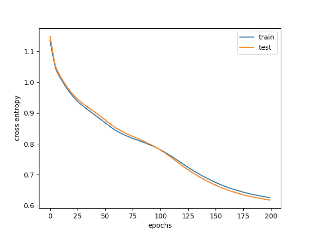
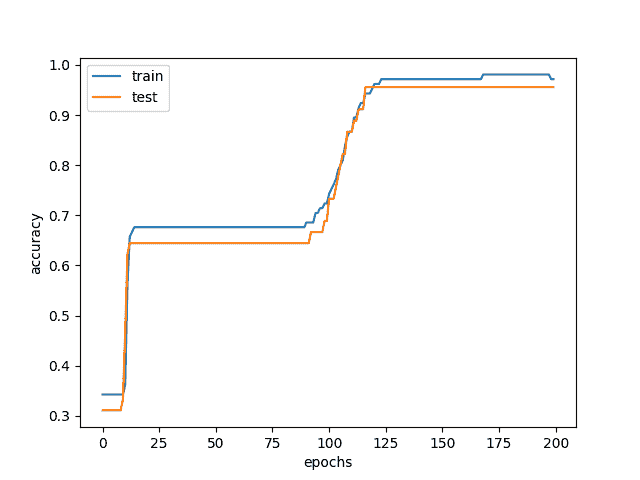

# 在 PyTorch 中构建多类别分类模型

> 原文：[`machinelearningmastery.com/building-a-multiclass-classification-model-in-pytorch/`](https://machinelearningmastery.com/building-a-multiclass-classification-model-in-pytorch/)

PyTorch 库用于深度学习。一些深度学习模型的应用被用来解决回归或分类问题。在本教程中，你将发现如何使用 PyTorch 来开发和评估用于多类别分类问题的神经网络模型。

完成本逐步教程后，你将知道：

+   如何从 CSV 文件加载数据并使其对 PyTorch 可用

+   如何准备多类别分类数据以用于神经网络建模

+   如何使用交叉验证来评估 PyTorch 神经网络模型

**用我的书籍** [Deep Learning with PyTorch](https://machinelearningmastery.com/deep-learning-with-pytorch/) **来启动你的项目**。它提供了**自学教程**和**可运行的代码**。

开始吧！[](../Images/7f27a731fa367f18038cd54aa9457355.png)

在 PyTorch 中构建多类别分类模型

图片由[Cheung Yin](https://unsplash.com/photos/0BoRlSmNmc0)提供。版权所有。

## 问题描述

在本教程中，你将使用一个标准的机器学习数据集，称为鸢尾花数据集。它是一个经过充分研究的数据集，适合用于机器学习练习。它有四个输入变量；这些变量都是数值型的，单位为厘米长度。因此，它们在类似的尺度上。每个数据样本描述了一个观察到的鸢尾花的属性。目标是使用这些测量（输入特征）来分类鸢尾花的种类（输出标签）。

数据集中有三种鸢尾花种类。因此，这是一个多*类别分类问题。多类别分类问题是特殊的，因为它们需要特殊处理来指定类别。

这个数据集来源于现代统计学之父罗纳德·费舍尔（Sir Ronald Fisher）。这是一个最著名的模式识别数据集，你可以在 95%到 97%的范围内达到模型准确率。你可以将这个作为开发深度学习模型的目标。

你可以从 UCI 机器学习库下载[鸢尾花数据集](https://archive.ics.uci.edu/ml/datasets/iris)，并将其放在当前工作目录中，文件名为“`iris.csv`”。你也可以[在这里](https://raw.githubusercontent.com/jbrownlee/Datasets/master/iris.csv)下载数据集。

## 加载数据集

有多种方式来读取 CSV 文件。最简单的方法可能是使用 pandas 库。在读取数据集后，你需要将其拆分为特征和标签，因为在使用前你需要进一步处理标签。与 NumPy 或 PyTorch 张量不同，pandas DataFrame 只能通过`iloc`按索引切片：

```py
import pandas as pd
data = pd.read_csv("iris.csv", header=None)
X = data.iloc[:, 0:4]
y = data.iloc[:, 4:]
```

现在，你已经加载了数据集并将属性（即，输入特征，DataFrame 中的列）分为`X`，将输出变量（即，种类标签）分为单列 DataFrame `y`。

## 编码分类变量

种类标签是字符串，但你希望将它们转换为数字。这是因为数值数据更容易使用。在这个数据集中，三个类别标签是`Iris-setosa`、`Iris-versicolor`和`Iris-virginica`。将这些标签转换为数字（即编码）的一种方法是简单地分配一个整数值，如 0、1 或 2 来替代这些标签。但存在一个问题：你不希望模型认为`Iris-virginica`是`Iris-setosa`和`Iris-versicolor`的总和。实际上，在统计学中，有不同的测量等级：

+   名义数：这些数字实际上是名字。对它们进行操作没有意义。

+   顺序数：它们表示某物的顺序。比较大小有意义，但加法或减法没有意义。

+   区间数：它们是测量值，如今天的年份，因此减法有意义（例如，你多大了），但零值是任意的，并没有特殊含义。

+   比率数：类似于区间数，但零是有意义的，如长度或时间的测量。在这种情况下，减法和除法都有意义，你可以说某物是两倍长。

编码后的标签是名义性的。你不想将其误认为是区间或比率数据，但你的模型不会知道。避免这种错误的一种方法是使用**独热编码**，它将标签从整数转换为**独热向量**。独热向量是一个整数向量，但只有一个值为 1，其余的都是零。在这种情况下，你将标签转换为如下：

```py
Iris-setosa      1   0   0
Iris-versicolor  0   1   0
Iris-virginica   0   0   1
```

上面是一个独热编码的二进制矩阵。你不需要手动创建它。你可以使用 scikit-learn 的`LabelEncoder`类将字符串一致编码为整数，或使用`OneHotEncoder`类将其编码为独热向量：

```py
from sklearn.preprocessing import OneHotEncoder
ohe = OneHotEncoder(handle_unknown='ignore', sparse_output=False).fit(y)
print(ohe.categories_)

y = ohe.transform(y)
print(y)
```

从这些，你可以看到`OneHotEncoder`学会了这三种类别：

```py
[array(['Iris-setosa', 'Iris-versicolor', 'Iris-virginica'], dtype=object)]
```

然后，字符串标签被转换为如下的独热向量：

```py
[[1\. 0\. 0.]
 [1\. 0\. 0.]
 [1\. 0\. 0.]
...
 [0\. 0\. 1.]
 [0\. 0\. 1.]
 [0\. 0\. 1.]]
```

### 想要开始使用 PyTorch 进行深度学习吗？

现在就接受我的免费电子邮件速成课程（包含示例代码）。

点击注册，还可以获得课程的免费 PDF 电子书版。

## 定义神经网络模型

现在你需要一个模型，能够接收输入并预测输出，理想情况下是以独热编码向量的形式。设计一个完美的神经网络模型没有科学依据。但要知道一点——它必须接收一个 4 特征的向量，并输出一个 3 值的向量。4 个特征对应于你在数据集中拥有的内容。3 值输出是因为我们知道独热向量有 3 个元素。中间可以有任何东西，称为“隐藏层”，因为它们既不是输入也不是输出。

最简单的情况是只有一个隐藏层。我们可以这样构建一个：

```py
[4 inputs] -> [8 hidden neurons] -> [3 outputs]
```

这样的设计称为网络拓扑。你应该在输出层使用“softmax”激活函数。在公式中，这意味着：

$$

\sigma(z_i) = \dfrac{e^{z_i}}{\sum_{j=1}³ e^{z_j}}

$$

这将对值($z_1,z_2,z_3$)进行归一化，并应用非线性函数，使所有三个输出的总和为 1，并且每个值都在 0 到 1 的范围内。这使得输出看起来像一个概率向量。在输出层使用 softmax 函数是多类分类模型的标志。但在 PyTorch 中，如果你将其与适当的损失函数结合使用，可以跳过这一过程。

在 PyTorch 中，你可以按如下方式构建这样的模型：

```py
import torch
import torch.nn as nn

class Multiclass(nn.Module):
    def __init__(self):
        super().__init__()
        self.hidden = nn.Linear(4, 8)
        self.act = nn.ReLU()
        self.output = nn.Linear(8, 3)

    def forward(self, x):
        x = self.act(self.hidden(x))
        x = self.output(x)
        return x

model = Multiclass()
```

该模型的输出是三个类别的“权重”。理想情况下，模型输出将使得只有一个元素是正无穷大，其余的是负无穷大，从而对输入特征属于哪个类别形成极端对比。在不完美的情况下，正如常常发生的那样，你可以期望一个好的模型告诉你其中一个值非常大，而其他值非常小。或者如果你使用 sigmoid 函数或 softmax 函数转换这些值，一个非常接近 1，其他的非常接近 0。

在这种情况下，输出的损失度量可以简单地通过测量输出与从标签转换得到的 one-hot 向量的接近程度来计算。但通常在多类分类中，你使用分类交叉熵作为损失度量。在公式中，它是：

$$

H(p,q) = -\sum_x p(x) \log q(x)

$$

这意味着，给定真实概率向量$p(x)$和预测概率向量$q(x)$，相似度是每个元素$x$的$p(x)$与$\log q(x)$的乘积之和。one-hot 向量被视为概率向量$p(x)$，而模型输出是$q(x)$。由于它是 one-hot 向量，因此只有实际类别的$p(x)=1$，其他类别的$p(x)=0$。上面的总和本质上是实际类别$x$的$-\log q(x)$。当$q(x)=1$时，值将为 0，而当$q(x)$接近 0（softmax 能产生的最小值）时，$-\log q(x)$接近无穷大。

以下是如何定义损失度量的方法。PyTorch 中的`CrossEntropyLoss`函数将 softmax 函数与交叉熵计算结合在一起，因此你不需要在模型的输出层使用任何激活函数。你还需要一个优化器，下面选择了 Adam。

```py
import torch.optim as optim

loss_fn = nn.<span class="sig-name descname"><span class="pre">CrossEntropyLoss</span></span>()
optimizer = optim.Adam(model.parameters(), lr=0.001)
```

请注意，当你定义优化器时，你还需要告诉它模型参数，因为这些是优化器将要更新的内容。

现在你需要运行训练循环来训练你的模型。最基本的，你需要在循环中包含三个步骤：前向传播、反向传播和权重更新。前向传播将输入提供给模型并获得输出。反向传播从基于模型输出的损失指标开始，并将梯度传播回输入。权重更新则基于梯度来更新权重。

最简单的训练循环可以使用 for 循环实现。但你可以利用`tqdm`来创建进度条可视化：

```py
import tqdm

# convert pandas DataFrame (X) and numpy array (y) into PyTorch tensors
X = torch.tensor(X.values, dtype=torch.float32)
y = torch.tensor(y, dtype=torch.float32)

# training parameters
n_epochs = 200
batch_size = 5
batches_per_epoch = len(X) // batch_size

for epoch in range(n_epochs):
    with tqdm.trange(batches_per_epoch, unit="batch", mininterval=0) as bar:
        bar.set_description(f"Epoch {epoch}")
        for i in bar:
            # take a batch
            start = i * batch_size
            X_batch = X[start:start+batch_size]
            y_batch = y[start:start+batch_size]
            # forward pass
            y_pred = model(X_batch)
            loss = loss_fn(y_pred, y_batch)
            # backward pass
            optimizer.zero_grad()
            loss.backward()
            # update weights
            optimizer.step()
```

## 基准测试模型

模型的目标从来不是与数据集本身匹配。你希望构建机器学习模型的原因是为了准备未来你将遇到的数据，这些数据目前尚未见过。你怎么知道模型能做到这一点？你需要一个测试集。它是一个与训练时使用的数据集结构相同但分开的数据集。因此，它就像是训练过程中的未见数据，你可以将其作为基准。这种评估模型的技术被称为**交叉验证**。

通常，你不会添加测试集，而是将获得的数据集拆分为训练集和测试集。然后，你使用测试集在最后对模型进行评估。这样的基准测试还有另一个目的：你不希望你的模型过拟合。这意味着模型对训练集学习过多，未能进行泛化。如果发生这种情况，你会发现模型在测试集上表现不好。

使用 scikit-learn 可以轻松地将数据拆分为训练集和测试集。从加载数据到进行独热编码和拆分的工作流程如下：

```py
import pandas as pd
from sklearn.model_selection import train_test_split
from sklearn.preprocessing import OneHotEncoder

# read data and apply one-hot encoding
data = pd.read_csv("iris.csv", header=None)
X = data.iloc[:, 0:4]
y = data.iloc[:, 4:]
ohe = OneHotEncoder(handle_unknown='ignore', sparse_output=False).fit(y)
y = ohe.transform(y)

# convert pandas DataFrame (X) and numpy array (y) into PyTorch tensors
X = torch.tensor(X.values, dtype=torch.float32)
y = torch.tensor(y, dtype=torch.float32)

# split
X_train, X_test, y_train, y_test = train_test_split(X, y, train_size=0.7, shuffle=True)
```

参数`train_size=0.7`和`shuffle=True`表示随机选择数据集中 70%的样本用于训练集，而其余部分将成为测试集。

一旦完成这一操作，你需要修改训练循环，以在训练中使用训练集，并在每个训练周期结束时使用测试集进行基准测试：

```py
n_epochs = 200
batch_size = 5
batches_per_epoch = len(X_train) // batch_size

for epoch in range(n_epochs):
    with tqdm.trange(batches_per_epoch, unit="batch", mininterval=0) as bar:
        bar.set_description(f"Epoch {epoch}")
        for i in bar:
            # take a batch
            start = i * batch_size
            X_batch = X_train[start:start+batch_size]
            y_batch = y_train[start:start+batch_size]
            # forward pass
            y_pred = model(X_batch)
            loss = loss_fn(y_pred, y_batch)
            # backward pass
            optimizer.zero_grad()
            loss.backward()
            # update weights
            optimizer.step()
    y_pred = model(X_test)
    ce = loss_fn(y_pred, y_test)
    acc = (torch.argmax(y_pred, 1) == torch.argmax(y_test, 1)).float().mean()
    print(f"Epoch {epoch} validation: Cross-entropy={float(ce)}, Accuracy={float(acc)}")
```

这就是你完成 PyTorch 深度学习模型所需的几乎所有内容。但你可能还想做更多的事情：首先，在所有训练周期结束后，你可能希望将模型回滚到你曾经达到的最佳状态，而不是最后的状态。其次，你可能希望生成一个图表，以可视化交叉熵和准确率的进展。

这并不难做。在训练循环中，你需要跟踪测试集上的准确率，并在准确率更高时保留模型的副本。同时，记得将计算的指标保存在一个列表中。然后在训练循环结束时，你恢复你见过的最佳模型，并将指标绘制为时间序列图。

在代码中，训练循环的修改如下：

```py
import copy
import tqdm
import numpy as np

n_epochs = 200
batch_size = 5
batches_per_epoch = len(X_train) // batch_size

best_acc = - np.inf   # init to negative infinity
best_weights = None
train_loss_hist = []
train_acc_hist = []
test_loss_hist = []
test_acc_hist = []

for epoch in range(n_epochs):
    epoch_loss = []
    epoch_acc = []
    # set model in training mode and run through each batch
    model.train()
    with tqdm.trange(batches_per_epoch, unit="batch", mininterval=0) as bar:
        bar.set_description(f"Epoch {epoch}")
        for i in bar:
            # take a batch
            start = i * batch_size
            X_batch = X_train[start:start+batch_size]
            y_batch = y_train[start:start+batch_size]
            # forward pass
            y_pred = model(X_batch)
            loss = loss_fn(y_pred, y_batch)
            # backward pass
            optimizer.zero_grad()
            loss.backward()
            # update weights
            optimizer.step()
            # compute and store metrics
            acc = (torch.argmax(y_pred, 1) == torch.argmax(y_batch, 1)).float().mean()
            epoch_loss.append(float(loss))
            epoch_acc.append(float(acc))
            bar.set_postfix(
                loss=float(loss),
                acc=float(acc)
            )
    # set model in evaluation mode and run through the test set
    model.eval()
    y_pred = model(X_test)
    ce = loss_fn(y_pred, y_test)
    acc = (torch.argmax(y_pred, 1) == torch.argmax(y_test, 1)).float().mean()
    ce = float(ce)
    acc = float(acc)
    train_loss_hist.append(np.mean(epoch_loss))
    train_acc_hist.append(np.mean(epoch_acc))
    test_loss_hist.append(ce)
    test_acc_hist.append(acc)
    if acc > best_acc:
        best_acc = acc
        best_weights = copy.deepcopy(model.state_dict())
    print(f"Epoch {epoch} validation: Cross-entropy={ce}, Accuracy={acc}")

model.load_state_dict(best_weights)
```

当你运行它时，你会看到类似于这样的信息，其中显示了每个周期的准确率和交叉熵损失：

```py
Epoch 0: 100%|█████████████████████| 21/21 [00:00<00:00, 850.82batch/s, acc=0.4, loss=1.23]
Epoch 0 validation: Cross-entropy=1.10, Accuracy=60.0%
Epoch 1: 100%|████████████████████| 21/21 [00:00<00:00, 3155.53batch/s, acc=0.4, loss=1.24]
Epoch 1 validation: Cross-entropy=1.08, Accuracy=57.8%
Epoch 2: 100%|████████████████████| 21/21 [00:00<00:00, 3489.58batch/s, acc=0.4, loss=1.24]
Epoch 2 validation: Cross-entropy=1.07, Accuracy=60.0%
Epoch 3: 100%|████████████████████| 21/21 [00:00<00:00, 3312.79batch/s, acc=0.4, loss=1.22]
Epoch 3 validation: Cross-entropy=1.06, Accuracy=62.2%
...
Epoch 197: 100%|███████████████████| 21/21 [00:00<00:00, 3529.57batch/s, acc=1, loss=0.563]
Epoch 197 validation: Cross-entropy=0.61, Accuracy=97.8%
Epoch 198: 100%|███████████████████| 21/21 [00:00<00:00, 3479.10batch/s, acc=1, loss=0.563]
Epoch 198 validation: Cross-entropy=0.61, Accuracy=97.8%
Epoch 199: 100%|███████████████████| 21/21 [00:00<00:00, 3337.52batch/s, acc=1, loss=0.563]
Epoch 199 validation: Cross-entropy=0.61, Accuracy=97.8%
```

你在训练循环中添加了更多的行，但这是有充分理由的。在你在训练集和测试集之间切换时，切换模型的训练模式和评估模式是一种好的实践。在这个特定的模型中，没有任何变化。但对于其他一些模型，这将影响模型的行为。

你在 Python 列表中收集了度量指标。你需要小心将 PyTorch 张量（即使是标量值）转换为 Python 浮点数。这样做的目的是为了复制这个数字，以便 PyTorch 不会悄悄地更改它（例如，通过优化器）。

每个 epoch 之后，你根据测试集计算准确率，并在看到准确率更高时保存模型权重。然而，当你提取模型权重时，你应该进行深度复制；否则，当模型在下一个 epoch 中更改权重时，你将丢失它们。

最后，你可以使用 matplotlib 绘制每个 epoch 的损失和准确率，如下所示：

```py
import matplotlib.pyplot as plt

plt.plot(train_loss_hist, label="train")
plt.plot(test_loss_hist, label="test")
plt.xlabel("epochs")
plt.ylabel("cross entropy")
plt.legend()
plt.show()

plt.plot(train_acc_hist, label="train")
plt.plot(test_acc_hist, label="test")
plt.xlabel("epochs")
plt.ylabel("accuracy")
plt.legend()
plt.show()
```

一个典型的结果如下：



训练和验证损失



训练和验证准确率

从图中可以看到，刚开始时，训练准确率和测试准确率都很低。这是因为你的模型出现了欠拟合，表现很差。随着你继续训练模型，准确率会提高，交叉熵损失会降低。但在某一点，训练准确率高于测试准确率，实际上，即使训练准确率提高，测试准确率也可能会平稳或下降。这是模型出现了过拟合，你不希望使用这样的模型。这就是为什么你要跟踪测试准确率，并根据测试集将模型权重恢复到最佳结果。

## 完整示例

将所有内容整合在一起，以下是完整代码：

```py
import copy

import matplotlib.pyplot as plt
import numpy as np
import pandas as pd
import torch
import torch.nn as nn
import torch.optim as optim
import tqdm
from sklearn.model_selection import train_test_split
from sklearn.preprocessing import OneHotEncoder

# read data and apply one-hot encoding
data = pd.read_csv("iris.csv", header=None)
X = data.iloc[:, 0:4]
y = data.iloc[:, 4:]
ohe = OneHotEncoder(handle_unknown='ignore', sparse_output=False).fit(y)
y = ohe.transform(y)

# convert pandas DataFrame (X) and numpy array (y) into PyTorch tensors
X = torch.tensor(X.values, dtype=torch.float32)
y = torch.tensor(y, dtype=torch.float32)

# split
X_train, X_test, y_train, y_test = train_test_split(X, y, train_size=0.7, shuffle=True)

class Multiclass(nn.Module):
    def __init__(self):
        super().__init__()
        self.hidden = nn.Linear(4, 8)
        self.act = nn.ReLU()
        self.output = nn.Linear(8, 3)

    def forward(self, x):
        x = self.act(self.hidden(x))
        x = self.output(x)
        return x

# loss metric and optimizer
model = Multiclass()
loss_fn = nn.CrossEntropyLoss()
optimizer = optim.Adam(model.parameters(), lr=0.001)

# prepare model and training parameters
n_epochs = 200
batch_size = 5
batches_per_epoch = len(X_train) // batch_size

best_acc = - np.inf   # init to negative infinity
best_weights = None
train_loss_hist = []
train_acc_hist = []
test_loss_hist = []
test_acc_hist = []

# training loop
for epoch in range(n_epochs):
    epoch_loss = []
    epoch_acc = []
    # set model in training mode and run through each batch
    model.train()
    with tqdm.trange(batches_per_epoch, unit="batch", mininterval=0) as bar:
        bar.set_description(f"Epoch {epoch}")
        for i in bar:
            # take a batch
            start = i * batch_size
            X_batch = X_train[start:start+batch_size]
            y_batch = y_train[start:start+batch_size]
            # forward pass
            y_pred = model(X_batch)
            loss = loss_fn(y_pred, y_batch)
            # backward pass
            optimizer.zero_grad()
            loss.backward()
            # update weights
            optimizer.step()
            # compute and store metrics
            acc = (torch.argmax(y_pred, 1) == torch.argmax(y_batch, 1)).float().mean()
            epoch_loss.append(float(loss))
            epoch_acc.append(float(acc))
            bar.set_postfix(
                loss=float(loss),
                acc=float(acc)
            )
    # set model in evaluation mode and run through the test set
    model.eval()
    y_pred = model(X_test)
    ce = loss_fn(y_pred, y_test)
    acc = (torch.argmax(y_pred, 1) == torch.argmax(y_test, 1)).float().mean()
    ce = float(ce)
    acc = float(acc)
    train_loss_hist.append(np.mean(epoch_loss))
    train_acc_hist.append(np.mean(epoch_acc))
    test_loss_hist.append(ce)
    test_acc_hist.append(acc)
    if acc > best_acc:
        best_acc = acc
        best_weights = copy.deepcopy(model.state_dict())
    print(f"Epoch {epoch} validation: Cross-entropy={ce:.2f}, Accuracy={acc*100:.1f}%")

# Restore best model
model.load_state_dict(best_weights)

# Plot the loss and accuracy
plt.plot(train_loss_hist, label="train")
plt.plot(test_loss_hist, label="test")
plt.xlabel("epochs")
plt.ylabel("cross entropy")
plt.legend()
plt.show()

plt.plot(train_acc_hist, label="train")
plt.plot(test_acc_hist, label="test")
plt.xlabel("epochs")
plt.ylabel("accuracy")
plt.legend()
plt.show()
```

## 总结

在这篇文章中，你了解了如何使用 PyTorch 开发和评估用于多类分类的神经网络。

完成本教程后，你学到了：

+   如何加载数据并将其转换为 PyTorch 张量

+   如何使用独热编码准备多类分类数据以进行建模

+   如何使用 PyTorch 定义一个用于多类分类的深度学习模型

+   如何衡量模型输出与多类分类预期结果的相似度

+   如何在 PyTorch 模型上运行训练循环并收集评估指标
