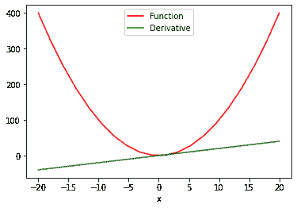

# 在 PyTorch 中计算导数

> 原文：[`machinelearningmastery.com/calculating-derivatives-in-pytorch/`](https://machinelearningmastery.com/calculating-derivatives-in-pytorch/)

导数是微积分中最基本的概念之一，描述了变量输入的变化如何影响函数输出。本文旨在为那些新手提供一个关于在 PyTorch 中计算导数的高级介绍。PyTorch 提供了一个方便的方式来计算用户定义函数的导数。

当我们在神经网络中始终需要处理反向传播（这是优化参数以最小化误差以实现更高分类精度的算法）时，本文中学到的概念将在后续关于图像处理和其他计算机视觉问题的深度学习文章中使用。

通过本教程，您将学到：

+   如何在 PyTorch 中计算导数。

+   如何在 PyTorch 中使用 autograd 对张量进行自动求导。

+   关于涉及不同节点和叶子的计算图，使您能够以最简单的方式计算梯度（使用链式法则）。

+   如何在 PyTorch 中计算偏导数。

+   如何实现针对多个值的函数的导数。

**启动你的项目**，使用我的书籍 [Deep Learning with PyTorch](https://machinelearningmastery.com/deep-learning-with-pytorch/)。它提供了具有**工作代码**的**自学教程**。

让我们开始吧！[](../Images/ad88d3f66693834ec70e4a5d9f09c4e2.png)

在 PyTorch 中计算导数

照片由 [Jossuha Théophile](https://unsplash.com/photos/H-CZjCQfsFw) 拍摄。部分权利保留。

## **Autograd 中的求导**

PyTorch 中的自动求导模块 - autograd - 用于计算神经网络中的导数并优化参数。它主要用于梯度计算。

在我们开始之前，让我们加载一些在本教程中将要使用的必要库。

```py
import matplotlib.pyplot as plt
import torch
```

现在，让我们使用一个简单的张量，并将 `requires_grad` 参数设置为 true。这样我们就可以进行自动求导，并让 PyTorch 使用给定值（本例中为 3.0）来计算导数。

```py
x = torch.tensor(3.0, requires_grad = True)
print("creating a tensor x: ", x)
```

```py
creating a tensor x:  tensor(3., requires_grad=True)
```

我们将使用一个简单的方程 $y=3x²$ 作为示例，并针对变量 `x` 求导。因此，让我们根据给定的方程创建另一个张量。此外，我们将在变量 `y` 上应用一个 `.backward` 方法，它形成一个存储计算历史的无环图，并使用 `.grad` 来评估给定值的结果。

```py
y = 3 * x ** 2
print("Result of the equation is: ", y)
y.backward()
print("Dervative of the equation at x = 3 is: ", x.grad)
```

```py
Result of the equation is:  tensor(27., grad_fn=<MulBackward0>)
Dervative of the equation at x = 3 is:  tensor(18.)
```

正如你所见，我们获得了一个正确的值 18。

## **计算图**

PyTorch 在后台构建反向图来生成导数，张量和反向函数是图的节点。在图中，PyTorch 根据张量是否为叶节点来计算其导数。

如果张量的 leaf 属性设置为 True，PyTorch 将不会计算其导数。我们不会详细讨论反向图是如何创建和利用的，因为这里的目标是让您对 PyTorch 如何利用图来计算导数有一个高层次的了解。

因此，让我们来看看张量`x`和`y`在创建后的内部情况。对于`x`而言：

```py
print('data attribute of the tensor:',x.data)
print('grad attribute of the tensor::',x.grad)
print('grad_fn attribute of the tensor::',x.grad_fn)
print("is_leaf attribute of the tensor::",x.is_leaf)
print("requires_grad attribute of the tensor::",x.requires_grad)
```

```py
data attribute of the tensor: tensor(3.)
grad attribute of the tensor:: tensor(18.)
grad_fn attribute of the tensor:: None
is_leaf attribute of the tensor:: True
requires_grad attribute of the tensor:: True
```

以及对于`y`：

```py
print('data attribute of the tensor:',y.data)
print('grad attribute of the tensor:',y.grad)
print('grad_fn attribute of the tensor:',y.grad_fn)
print("is_leaf attribute of the tensor:",y.is_leaf)
print("requires_grad attribute of the tensor:",y.requires_grad)
```

```py
print('data attribute of the tensor:',y.data)
print('grad attribute of the tensor:',y.grad)
print('grad_fn attribute of the tensor:',y.grad_fn)
print("is_leaf attribute of the tensor:",y.is_leaf)
print("requires_grad attribute of the tensor:",y.requires_grad)
```

正如你所见，每个张量都被分配了一组特定的属性。

`data`属性存储张量的数据，而`grad_fn`属性告诉有关图中节点的信息。同样，`.grad`属性保存导数的结果。现在您已经学习了有关 autograd 和 PyTorch 计算图的一些基础知识，让我们看一看稍微复杂的方程$y=6x²+2x+4$并计算其导数。方程的导数如下所示：

$$\frac{dy}{dx} = 12x+2$$

在$x=3$处评估导数，

$$\left.\frac{dy}{dx}\right\vert_{x=3} = 12\times 3+2 = 38$$

现在，让我们看一看 PyTorch 是如何做到的，

```py
x = torch.tensor(3.0, requires_grad = True)
y = 6 * x ** 2 + 2 * x + 4
print("Result of the equation is: ", y)
y.backward()
print("Derivative of the equation at x = 3 is: ", x.grad)
```

```py
Result of the equation is:  tensor(64., grad_fn=<AddBackward0>)
Derivative of the equation at x = 3 is:  tensor(38.)
```

方程的导数为 38，这是正确的。

### 想要开始使用 PyTorch 进行深度学习吗？

现在就参加我的免费电子邮件速成课程（附有示例代码）。

点击注册并获得免费的课程 PDF 电子书版本。

## **实现函数的偏导数**

PyTorch 还允许我们计算函数的偏导数。例如，如果我们需要对以下函数应用偏导数，

$$f(u,v) = u³+v²+4uv$$

其关于$u$的导数为，

$$\frac{\partial f}{\partial u} = 3u² + 4v$$

同样地，关于$v$的导数如下，

$$\frac{\partial f}{\partial v} = 2v + 4u$$

现在，让我们以 PyTorch 的方式来做，其中$u = 3$ 且 $v = 4$。

我们将创建`u`、`v`和`f`张量，并在`f`上应用`.backward`属性来计算导数。最后，我们将使用`.grad`相对于`u`和`v`的值来评估导数。

```py
u = torch.tensor(3., requires_grad=True)
v = torch.tensor(4., requires_grad=True)

f = u**3 + v**2 + 4*u*v

print(u)
print(v)
print(f)

f.backward()
print("Partial derivative with respect to u: ", u.grad)
print("Partial derivative with respect to v: ", v.grad)
```

```py
tensor(3., requires_grad=True)
tensor(4., requires_grad=True)
tensor(91., grad_fn=<AddBackward0>)
Partial derivative with respect to u:  tensor(43.)
Partial derivative with respect to v:  tensor(20.)
```

## **具有多个值的函数的导数**

如果我们有一个具有多个值的函数，并且需要计算其关于多个值的导数怎么办？为此，我们将利用 sum 属性来 (1) 生成一个标量值函数，然后 (2) 求导。这就是我们可以看到‘函数 vs. 导数’图的方式：

```py
# compute the derivative of the function with multiple values
x = torch.linspace(-20, 20, 20, requires_grad = True)
Y = x ** 2
y = torch.sum(Y)
y.backward()

# ploting the function and derivative
function_line, = plt.plot(x.detach().numpy(), Y.detach().numpy(), label = 'Function')
function_line.set_color("red")
derivative_line, = plt.plot(x.detach().numpy(), x.grad.detach().numpy(), label = 'Derivative')
derivative_line.set_color("green")
plt.xlabel('x')
plt.legend()
plt.show()
```



在上述的两个`plot()`函数中，我们从 PyTorch 张量中提取值以便进行可视化。`.detach`方法不允许图进一步跟踪操作。这使得我们可以轻松地将张量转换为 numpy 数组。

## **总结**

在本教程中，您学习了如何在 PyTorch 中实现各种函数的导数。

特别是，您学到了：

+   如何在 PyTorch 中计算导数。

+   如何在 PyTorch 中使用 autograd 对张量执行自动微分。

+   有关涉及不同节点和叶子的计算图，使您能够以可能的最简单方式计算梯度（使用链式法则）。

+   如何在 PyTorch 中计算偏导数。

+   如何实现对多个值的函数的导数。
