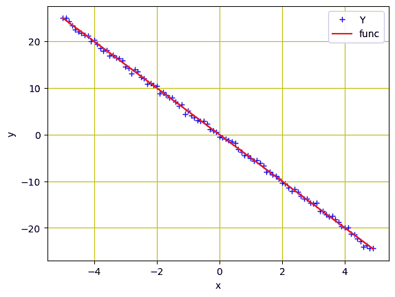
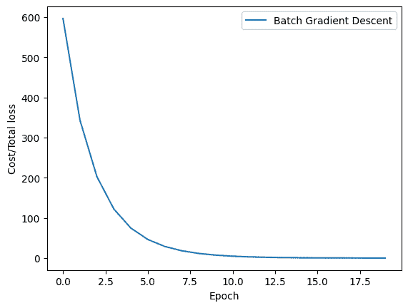
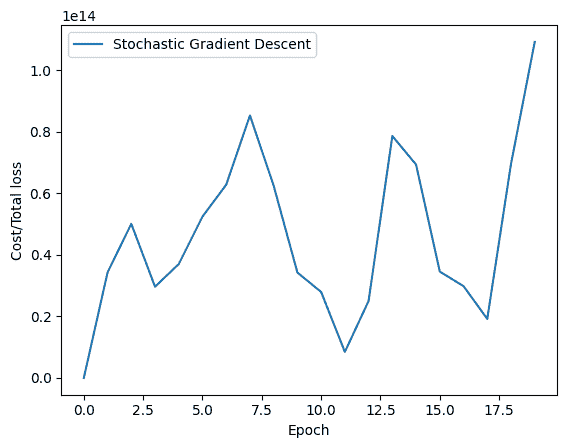

# 在 PyTorch 中实现梯度下降

> 原文：[`machinelearningmastery.com/implementing-gradient-descent-in-pytorch/`](https://machinelearningmastery.com/implementing-gradient-descent-in-pytorch/)

梯度下降算法是训练深度神经网络的最流行技术之一。它在计算机视觉、语音识别和自然语言处理等领域有许多应用。尽管梯度下降的思想已经存在了几十年，但它最近才被应用于与深度学习相关的应用中。

梯度下降是一种迭代优化方法，通过在每一步中迭代更新值来寻找目标函数的最小值。每次迭代时，它都会朝着期望的方向迈出小步，直到收敛或满足停止准则。

在本教程中，你将训练一个具有两个可训练参数的简单线性回归模型，并探索梯度下降的工作原理以及如何在 PyTorch 中实现它。特别地，你将学习：

+   梯度下降算法及其在 PyTorch 中的实现

+   批量梯度下降及其在 PyTorch 中的实现

+   随机梯度下降及其在 PyTorch 中的实现

+   批量梯度下降（Batch Gradient Descent）和随机梯度下降（Stochastic Gradient Descent）之间的区别

+   批量梯度下降和随机梯度下降在训练过程中损失如何下降

**通过我的书** [《用 PyTorch 进行深度学习》](https://machinelearningmastery.com/deep-learning-with-pytorch/) **启动你的项目**。它提供了**自学教程**和**可运行的代码**。

那么，让我们开始吧！[](../Images/45ac7903b28ab4040d742d5544c770df.png)

在 PyTorch 中实现梯度下降。

图片由 [Michael Behrens](https://unsplash.com/photos/DA-iYgv8kjE) 提供。保留部分权利。

## 概述

本教程分为四部分；它们是

+   准备数据

+   批量梯度下降

+   随机梯度下降

+   绘制比较图

## 准备数据

为了简化模型以便说明，我们将使用与上一个教程相同的线性回归问题。数据是合成的，生成方式如下：

```py
import torch
import numpy as np
import matplotlib.pyplot as plt

# Creating a function f(X) with a slope of -5
X = torch.arange(-5, 5, 0.1).view(-1, 1)
func = -5 * X

# Adding Gaussian noise to the function f(X) and saving it in Y
Y = func + 0.4 * torch.randn(X.size())
```

与之前的教程相同，我们初始化了一个变量 `X`，其值范围从 $-5$ 到 $5$，并创建了一个斜率为 $-5$ 的线性函数。然后，添加高斯噪声来生成变量 `Y`。

我们可以使用 matplotlib 绘制数据以可视化模式：

```py
...
# Plot and visualizing the data points in blue
plt.plot(X.numpy(), Y.numpy(), 'b+', label='Y')
plt.plot(X.numpy(), func.numpy(), 'r', label='func')
plt.xlabel('x')
plt.ylabel('y')
plt.legend()
plt.grid('True', color='y')
plt.show()
```



回归模型的数据点

### 想开始使用 PyTorch 进行深度学习吗？

立即获取我的免费电子邮件速成课程（附样例代码）。

点击注册，并获得课程的免费 PDF 电子书版本。

## 批量梯度下降

现在我们已经为模型创建了数据，接下来我们将基于一个简单的线性回归方程构建前向函数。我们将训练模型以优化两个参数（$w$ 和 $b$）。我们还需要一个损失标准函数。由于这是一个对连续值的回归问题，MSE 损失是合适的。

```py
...
# defining the function for forward pass for prediction
def forward(x):
    return w * x + b

# evaluating data points with Mean Square Error (MSE)
def criterion(y_pred, y):
    return torch.mean((y_pred - y) ** 2)
```

在我们训练模型之前，让我们先了解一下**批量梯度下降**。在批量梯度下降中，所有训练数据中的样本都在单步中考虑。参数通过所有训练样本的平均梯度来更新。换句话说，每个 epoch 中只有一步梯度下降。

虽然批量梯度下降在平滑误差流形上是最佳选择，但它相对较慢且计算复杂，特别是当你有更大的训练数据集时。

### 使用批量梯度下降进行训练

让我们随机初始化可训练参数$w$和$b$，定义一些训练参数如学习率或步长，一个空列表来存储损失，以及训练的 epoch 数量。

```py
w = torch.tensor(-10.0, requires_grad=True)
b = torch.tensor(-20.0, requires_grad=True)

step_size = 0.1
loss_BGD = []
n_iter = 20
```

我们将使用下面的代码行训练我们的模型 20 个 epochs。在这里，`forward()`函数生成预测，而`criterion()`函数测量损失以存储在`loss`变量中。`backward()`方法执行梯度计算，更新后的参数存储在`w.data`和`b.data`中。

```py
for i in range (n_iter):
    # making predictions with forward pass
    Y_pred = forward(X)
    # calculating the loss between original and predicted data points
    loss = criterion(Y_pred, Y)
    # storing the calculated loss in a list
    loss_BGD.append(loss.item())
    # backward pass for computing the gradients of the loss w.r.t to learnable parameters
    loss.backward()
    # updateing the parameters after each iteration
    w.data = w.data - step_size * w.grad.data
    b.data = b.data - step_size * b.grad.data
    # zeroing gradients after each iteration
    w.grad.data.zero_()
    b.grad.data.zero_()
    # priting the values for understanding
    print('{}, \t{}, \t{}, \t{}'.format(i, loss.item(), w.item(), b.item()))
```

下面是输出的样子，以及在应用批量梯度下降时每个 epoch 后更新的参数。

```py
0, 	596.7191162109375, 	-1.8527469635009766, 	-16.062074661254883
1, 	343.426513671875, 	-7.247585773468018, 	-12.83026123046875
2, 	202.7098388671875, 	-3.616910219192505, 	-10.298759460449219
3, 	122.16651153564453, 	-6.0132551193237305, 	-8.237251281738281
4, 	74.85094451904297, 	-4.394278526306152, 	-6.6120076179504395
5, 	46.450958251953125, 	-5.457883358001709, 	-5.295622825622559
6, 	29.111614227294922, 	-4.735295295715332, 	-4.2531514167785645
7, 	18.386211395263672, 	-5.206836700439453, 	-3.4119482040405273
8, 	11.687058448791504, 	-4.883906364440918, 	-2.7437009811401367
9, 	7.4728569984436035, 	-5.092618465423584, 	-2.205873966217041
10, 	4.808231830596924, 	-4.948029518127441, 	-1.777699589729309
11, 	3.1172332763671875, 	-5.040188312530518, 	-1.4337140321731567
12, 	2.0413269996643066, 	-4.975278854370117, 	-1.159447193145752
13, 	1.355530858039856, 	-5.0158305168151855, 	-0.9393846988677979
14, 	0.9178376793861389, 	-4.986582279205322, 	-0.7637402415275574
15, 	0.6382412910461426, 	-5.004333972930908, 	-0.6229321360588074
16, 	0.45952412486076355, 	-4.991086006164551, 	-0.5104631781578064
17, 	0.34523946046829224, 	-4.998797416687012, 	-0.42035552859306335
18, 	0.27213525772094727, 	-4.992753028869629, 	-0.3483465909957886
19, 	0.22536347806453705, 	-4.996064186096191, 	-0.2906789183616638
```

将所有内容放在一起，以下是完整的代码

```py
import torch
import numpy as np
import matplotlib.pyplot as plt

X = torch.arange(-5, 5, 0.1).view(-1, 1)
func = -5 * X
Y = func + 0.4 * torch.randn(X.size())

# defining the function for forward pass for prediction
def forward(x):
    return w * x + b

# evaluating data points with Mean Square Error (MSE)
def criterion(y_pred, y):
    return torch.mean((y_pred - y) ** 2)

w = torch.tensor(-10.0, requires_grad=True)
b = torch.tensor(-20.0, requires_grad=True)

step_size = 0.1
loss_BGD = []
n_iter = 20

for i in range (n_iter):
    # making predictions with forward pass
    Y_pred = forward(X)
    # calculating the loss between original and predicted data points
    loss = criterion(Y_pred, Y)
    # storing the calculated loss in a list
    loss_BGD.append(loss.item())
    # backward pass for computing the gradients of the loss w.r.t to learnable parameters
    loss.backward()
    # updateing the parameters after each iteration
    w.data = w.data - step_size * w.grad.data
    b.data = b.data - step_size * b.grad.data
    # zeroing gradients after each iteration
    w.grad.data.zero_()
    b.grad.data.zero_()
    # priting the values for understanding
    print('{}, \t{}, \t{}, \t{}'.format(i, loss.item(), w.item(), b.item()))
```

上面的 for 循环每个 epoch 打印一行，如下所示：

```py
0, 	596.7191162109375, 	-1.8527469635009766, 	-16.062074661254883
1, 	343.426513671875, 	-7.247585773468018, 	-12.83026123046875
2, 	202.7098388671875, 	-3.616910219192505, 	-10.298759460449219
3, 	122.16651153564453, 	-6.0132551193237305, 	-8.237251281738281
4, 	74.85094451904297, 	-4.394278526306152, 	-6.6120076179504395
5, 	46.450958251953125, 	-5.457883358001709, 	-5.295622825622559
6, 	29.111614227294922, 	-4.735295295715332, 	-4.2531514167785645
7, 	18.386211395263672, 	-5.206836700439453, 	-3.4119482040405273
8, 	11.687058448791504, 	-4.883906364440918, 	-2.7437009811401367
9, 	7.4728569984436035, 	-5.092618465423584, 	-2.205873966217041
10, 	4.808231830596924, 	-4.948029518127441, 	-1.777699589729309
11, 	3.1172332763671875, 	-5.040188312530518, 	-1.4337140321731567
12, 	2.0413269996643066, 	-4.975278854370117, 	-1.159447193145752
13, 	1.355530858039856, 	-5.0158305168151855, 	-0.9393846988677979
14, 	0.9178376793861389, 	-4.986582279205322, 	-0.7637402415275574
15, 	0.6382412910461426, 	-5.004333972930908, 	-0.6229321360588074
16, 	0.45952412486076355, 	-4.991086006164551, 	-0.5104631781578064
17, 	0.34523946046829224, 	-4.998797416687012, 	-0.42035552859306335
18, 	0.27213525772094727, 	-4.992753028869629, 	-0.3483465909957886
19, 	0.22536347806453705, 	-4.996064186096191, 	-0.2906789183616638
```

## 随机梯度下降

正如我们所了解的，当涉及到大量训练数据时，批量梯度下降并不是一个合适的选择。然而，深度学习算法对数据有很强的需求，通常需要大量数据进行训练。例如，一个包含数百万训练样本的数据集需要模型在单步中计算所有数据的梯度，如果我们使用批量梯度下降。

这似乎不是一种高效的方式，替代方法是**随机梯度下降**（SGD）。随机梯度下降每次只考虑训练数据中的单个样本，计算梯度并更新权重。因此，如果训练数据中有$N$个样本，每个 epoch 将有$N$步。

### 使用随机梯度下降进行训练

要使用随机梯度下降训练我们的模型，我们将像上面批量梯度下降一样随机初始化可训练参数$w$和$b$。在这里，我们将定义一个空列表来存储随机梯度下降的损失，并训练模型 20 个 epochs。以下是从先前示例修改而来的完整代码：

```py
import torch
import numpy as np
import matplotlib.pyplot as plt

X = torch.arange(-5, 5, 0.1).view(-1, 1)
func = -5 * X
Y = func + 0.4 * torch.randn(X.size())

# defining the function for forward pass for prediction
def forward(x):
    return w * x + b

# evaluating data points with Mean Square Error (MSE)
def criterion(y_pred, y):
    return torch.mean((y_pred - y) ** 2)

w = torch.tensor(-10.0, requires_grad=True)
b = torch.tensor(-20.0, requires_grad=True)

step_size = 0.1
loss_SGD = []
n_iter = 20

for i in range (n_iter):    
    # calculating true loss and storing it
    Y_pred = forward(X)
    # store the loss in the list
    loss_SGD.append(criterion(Y_pred, Y).tolist())

    for x, y in zip(X, Y):
      # making a pridiction in forward pass
      y_hat = forward(x)
      # calculating the loss between original and predicted data points
      loss = criterion(y_hat, y)
      # backward pass for computing the gradients of the loss w.r.t to learnable parameters
      loss.backward()
      # updateing the parameters after each iteration
      w.data = w.data - step_size * w.grad.data
      b.data = b.data - step_size * b.grad.data
      # zeroing gradients after each iteration
      w.grad.data.zero_()
      b.grad.data.zero_()
      # priting the values for understanding
      print('{}, \t{}, \t{}, \t{}'.format(i, loss.item(), w.item(), b.item()))
```

这将打印如下长长的数值列表

```py
0, 	24.73763084411621, 	-5.02630615234375, 	-20.994739532470703
0, 	455.0946960449219, 	-25.93259620666504, 	-16.7281494140625
0, 	6968.82666015625, 	54.207733154296875, 	-33.424049377441406
0, 	97112.9140625, 	-238.72393798828125, 	28.901844024658203
....
19, 	8858971136.0, 	-1976796.625, 	8770213.0
19, 	271135948800.0, 	-1487331.875, 	8874354.0
19, 	3010866446336.0, 	-3153109.5, 	8527317.0
19, 	47926483091456.0, 	3631328.0, 	9911896.0
```

## 绘制比较图表

现在我们已经使用批量梯度下降和随机梯度下降训练了我们的模型，让我们来看看在模型训练期间这两种方法的损失如何减少。因此，批量梯度下降的图表如下所示。

```py
...
plt.plot(loss_BGD, label="Batch Gradient Descent")
plt.xlabel('Epoch')
plt.ylabel('Cost/Total loss')
plt.legend()
plt.show()
```



批量梯度下降的损失历史

类似地，这是随机梯度下降的图表。

```py
plt.plot(loss_SGD,label="Stochastic Gradient Descent")
plt.xlabel('Epoch')
plt.ylabel('Cost/Total loss')
plt.legend()
plt.show()
```



随机梯度下降的损失历史

正如你所见，批量梯度下降的损失平稳下降。另一方面，你会在随机梯度下降的图中观察到波动。前面提到过，原因很简单。在批量梯度下降中，损失在处理完所有训练样本后更新，而随机梯度下降则在每个训练样本处理后更新损失。

综合考虑，下面是完整的代码：

```py
import torch
import numpy as np
import matplotlib.pyplot as plt

# Creating a function f(X) with a slope of -5
X = torch.arange(-5, 5, 0.1).view(-1, 1)
func = -5 * X

# Adding Gaussian noise to the function f(X) and saving it in Y
Y = func + 0.4 * torch.randn(X.size())

# Plot and visualizing the data points in blue
plt.plot(X.numpy(), Y.numpy(), 'b+', label='Y')
plt.plot(X.numpy(), func.numpy(), 'r', label='func')
plt.xlabel('x')
plt.ylabel('y')
plt.legend()
plt.grid('True', color='y')
plt.show()

# defining the function for forward pass for prediction
def forward(x):
    return w * x + b

# evaluating data points with Mean Square Error (MSE)
def criterion(y_pred, y):
    return torch.mean((y_pred - y) ** 2)

# Batch gradient descent
w = torch.tensor(-10.0, requires_grad=True)
b = torch.tensor(-20.0, requires_grad=True)
step_size = 0.1
loss_BGD = []
n_iter = 20

for i in range (n_iter):
    # making predictions with forward pass
    Y_pred = forward(X)
    # calculating the loss between original and predicted data points
    loss = criterion(Y_pred, Y)
    # storing the calculated loss in a list
    loss_BGD.append(loss.item())
    # backward pass for computing the gradients of the loss w.r.t to learnable parameters
    loss.backward()
    # updateing the parameters after each iteration
    w.data = w.data - step_size * w.grad.data
    b.data = b.data - step_size * b.grad.data
    # zeroing gradients after each iteration
    w.grad.data.zero_()
    b.grad.data.zero_()
    # priting the values for understanding
    print('{}, \t{}, \t{}, \t{}'.format(i, loss.item(), w.item(), b.item()))

# Stochastic gradient descent
w = torch.tensor(-10.0, requires_grad=True)
b = torch.tensor(-20.0, requires_grad=True)
step_size = 0.1
loss_SGD = []
n_iter = 20

for i in range(n_iter):  
    # calculating true loss and storing it
    Y_pred = forward(X)
    # store the loss in the list
    loss_SGD.append(criterion(Y_pred, Y).tolist())

    for x, y in zip(X, Y):
      # making a pridiction in forward pass
      y_hat = forward(x)
      # calculating the loss between original and predicted data points
      loss = criterion(y_hat, y)
      # backward pass for computing the gradients of the loss w.r.t to learnable parameters
      loss.backward()
      # updateing the parameters after each iteration
      w.data = w.data - step_size * w.grad.data
      b.data = b.data - step_size * b.grad.data
      # zeroing gradients after each iteration
      w.grad.data.zero_()
      b.grad.data.zero_()
      # priting the values for understanding
      print('{}, \t{}, \t{}, \t{}'.format(i, loss.item(), w.item(), b.item()))

# Plot graphs
plt.plot(loss_BGD, label="Batch Gradient Descent")
plt.xlabel('Epoch')
plt.ylabel('Cost/Total loss')
plt.legend()
plt.show()

plt.plot(loss_SGD,label="Stochastic Gradient Descent")
plt.xlabel('Epoch')
plt.ylabel('Cost/Total loss')
plt.legend()
plt.show()
```

## 总结

在本教程中，你了解了梯度下降法及其一些变体，并学习了如何在 PyTorch 中实现它们。特别是，你了解了：

+   梯度下降算法及其在 PyTorch 中的实现

+   批量梯度下降及其在 PyTorch 中的实现

+   随机梯度下降及其在 PyTorch 中的实现

+   批量梯度下降和随机梯度下降的区别

+   批量梯度下降和随机梯度下降在训练过程中损失的变化
