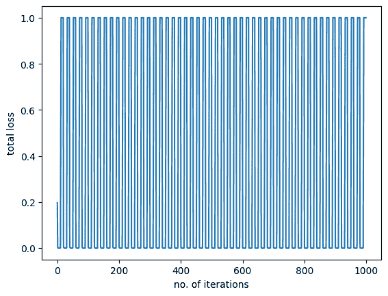

# 深度学习模型的权重初始化

> 原文：[`machinelearningmastery.com/initializing-weights-for-deep-learning-models/`](https://machinelearningmastery.com/initializing-weights-for-deep-learning-models/)

为了构建一个准确分类数据样本并在测试数据上表现良好的分类器，你需要以一种使模型良好收敛的方式初始化权重。通常我们会随机初始化权重。但是，当我们使用均方误差（MSE）作为训练逻辑回归模型的损失函数时，有时可能会遇到一些问题。在进一步细节之前，请注意，这里使用的方法也适用于除逻辑回归之外的分类模型，并将在接下来的教程中使用。

如果权重在一个适当的区域初始化，我们的模型可以良好收敛。然而，如果我们将模型权重初始化在一个不利的区域，我们可能会发现模型难以收敛或收敛非常缓慢。在本教程中，你将学习使用 MSE 损失函数且模型权重初始化不当时会发生什么。特别地，你将学习：

+   不良初始化如何影响逻辑回归模型的训练。

+   如何用 PyTorch 训练一个逻辑回归模型。

+   如何不良的初始化权重和 MSE 损失函数会显著降低模型的准确性。

+   那么，让我们开始吧。

**通过我的书籍** [《深度学习与 PyTorch》](https://machinelearningmastery.com/deep-learning-with-pytorch/) **快速启动你的项目**。它提供了**自学教程**和**有效代码**。

让我们开始吧。

深度学习模型的权重初始化。

图片来自 [Priscilla Serneo](https://unsplash.com/photos/kvCTQkcbWAc)。保留部分权利。

## 概述

本教程分为三个部分；它们是

+   准备数据和构建模型

+   模型权重初始值的影响

+   适当的权重初始化

## 准备数据和构建模型

首先，让我们准备一些合成数据来训练和评估模型。

数据将基于单一变量预测 0 或 1 的值。

```py
import torch
from torch.utils.data import Dataset

class Data(Dataset):
    def __init__(self):
        self.x = torch.arange(-2, 2, 0.1).view(-1, 1)
        self.y = torch.zeros(self.x.shape[0], 1)
        self.y[self.x[:, 0] > 0.2] = 1
        self.len = self.x.shape[0]

    def __getitem__(self, idx):
        return self.x[idx], self.y[idx] 

    def __len__(self):
        "get data length"
        return self.len
```

使用这个 `Dataset` 类，我们可以创建一个数据集对象。

```py
# Creating dataset object
data_set = Data()
```

现在，让我们使用 `nn.Module` 为我们的逻辑回归模型构建一个自定义模块。如我们之前的教程中所述，你将使用 `nn.Module` 包中的方法和属性来构建自定义模块。

```py
# build custom module for logistic regression
class LogisticRegression(torch.nn.Module):    
    # build the constructor
    def __init__(self, n_inputs):
        super().__init__()
        self.linear = torch.nn.Linear(n_inputs, 1)
    # make predictions
    def forward(self, x):
        y_pred = torch.sigmoid(self.linear(x))
        return y_pred
```

你将创建一个用于逻辑回归的模型对象，如下所示。

```py
log_regr = LogisticRegression(1)
```

### 想要开始使用 PyTorch 进行深度学习？

立即参加我的免费电子邮件速成课程（附样例代码）。

点击注册，还能免费获得课程的 PDF 电子书版本。

## 模型权重初始值的影响

为了证明这一点，让我们用其他值（或预定的不良值）替换随机初始化的模型权重，这样模型将无法收敛。

```py
# replace the randomly initialized weights with our own values
log_regr.state_dict() ['linear.weight'].data[0] = torch.tensor([[-5]])
log_regr.state_dict() ['linear.bias'].data[0] = torch.tensor([[-10]])
print("checking weights: ", log_regr.state_dict())
```

它会打印：

```py
checking weights:  OrderedDict([('linear.weight', tensor([[-5.]])), ('linear.bias', tensor([-10.]))])
```

如你所见，随机初始化的参数已经被替换。

你将使用随机梯度下降训练这个模型，并将学习率设置为 2。由于你需要检查初始化值不佳和 MSE 损失对模型性能的影响，你将设置这个标准来检查模型损失。在训练过程中，数据由数据加载器提供，批量大小为 2。

```py
...
from torch.utils.data import DataLoader

# defining the optimizer and loss
optimizer = torch.optim.SGD(log_regr.parameters(), lr=2)
criterion = torch.nn.MSELoss()
# Creating the dataloader
train_loader = DataLoader(dataset=data_set, batch_size=2)
```

现在，让我们训练模型 50 个周期。

```py
...
# Train the model
Loss = []
epochs = 50
for epoch in range(epochs):
    for x,y in train_loader:
        y_pred = log_regr(x)
        loss = criterion(y_pred, y)
        Loss.append(loss.item())
        optimizer.zero_grad()
        loss.backward()
        optimizer.step()   
    print(f"epoch = {epoch}, loss = {loss}")
print("Done!")
```

在模型训练期间，你将看到每个周期的进展：

```py
[Parameter containing:
tensor([[0.7645]], requires_grad=True), Parameter containing:
tensor([0.8300], requires_grad=True)]
```

如你所见，训练过程中的损失保持不变，没有任何改进。这表明模型没有学习，并且在测试数据上表现不好。

让我们还可视化模型训练的图表。

```py
import matplotlib.pyplot as plt

plt.plot(Loss)
plt.xlabel("no. of iterations")
plt.ylabel("total loss")
plt.show()
```

你将看到如下图：图表也告诉我们同样的故事，即训练过程中模型损失没有任何变化或减少。

虽然我们的模型在训练过程中表现不佳，但让我们获取测试数据的预测结果，并测量模型的整体准确率。

```py
# get the model predictions on test data
y_pred = log_regr(data_set.x)
label = y_pred > 0.5  # setting the threshold for classification
print("model accuracy on test data: ",
      torch.mean((label == data_set.y.type(torch.ByteTensor)).type(torch.float)))
```

这给出

```py
model accuracy on test data:  tensor(0.5750)
```

模型的准确率仅为 57%，这不是你期望的结果。这表明初始化权重不佳以及使用 MSE 损失可能会对模型准确性产生很大影响。为了减少这种误差，我们应用最大似然估计和交叉熵损失，这将在下一个教程中讲解。

综合考虑，以下是完整的代码：

```py
import matplotlib.pyplot as plt 
import torch
from torch.utils.data import Dataset, DataLoader
torch.manual_seed(0)

class Data(Dataset):
    def __init__(self):
        self.x = torch.arange(-2, 2, 0.1).view(-1, 1)
        self.y = torch.zeros(self.x.shape[0], 1)
        self.y[self.x[:, 0] > 0.2] = 1
        self.len = self.x.shape[0]

    def __getitem__(self, idx):
        return self.x[idx], self.y[idx] 

    def __len__(self):
        "get data length"
        return self.len

# Creating dataset object
data_set = Data()

# build custom module for logistic regression
class LogisticRegression(torch.nn.Module):    
    # build the constructor
    def __init__(self, n_inputs):
        super().__init__()
        self.linear = torch.nn.Linear(n_inputs, 1)
    # make predictions
    def forward(self, x):
        y_pred = torch.sigmoid(self.linear(x))
        return y_pred

log_regr = LogisticRegression(1)

# replace the randomly initialized weights with our own values
log_regr.state_dict() ['linear.weight'].data[0] = torch.tensor([[-5]])
log_regr.state_dict() ['linear.bias'].data[0] = torch.tensor([[-10]])
print("checking weights: ", log_regr.state_dict())

# defining the optimizer and loss
optimizer = torch.optim.SGD(log_regr.parameters(), lr=2)
criterion = torch.nn.MSELoss()

# Creating the dataloader
train_loader = DataLoader(dataset=data_set, batch_size=2)

# Train the model
Loss = []
epochs = 50
for epoch in range(epochs):
    for x,y in train_loader:
        y_pred = log_regr(x)
        loss = criterion(y_pred, y)
        Loss.append(loss.item())
        optimizer.zero_grad()
        loss.backward()
        optimizer.step()   
    print(f"epoch = {epoch}, loss = {loss}")
print("Done!")

plt.plot(Loss)
plt.xlabel("no. of iterations")
plt.ylabel("total loss")
plt.show()

# get the model predictions on test data
y_pred = log_regr(data_set.x)
label = y_pred > 0.5 # setting the threshold between zero and one.
print("model accuracy on test data: ",
      torch.mean((label == data_set.y.type(torch.ByteTensor)).type(torch.float)))
```

## 适当的权重初始化

默认情况下，从 PyTorch 初始化的权重应该能给你正确的模型。如果你修改上述代码，将训练前覆盖模型权重的两行注释掉，并重新运行，你应该会看到结果相当不错。之所以之前效果很差，是因为权重离最佳权重太远，以及在逻辑回归问题中使用了均方误差（MSE）作为损失函数。

像随机梯度下降这样的优化算法的性质并不能保证在所有情况下都有效。为了使优化算法找到解决方案，即使模型收敛，最好是将模型权重设置在接近解决方案的位置。当然，在模型收敛之前我们无法知道接近的位置在哪里。但研究发现，我们应该倾向于将权重设置为在一批样本数据中，

+   激活的均值为零。

+   激活的方差与层输入的方差相当。

一种流行的方法是使用 Xavier 初始化来初始化模型权重，即，根据均匀分布 $U[-\frac{1}{\sqrt{n}}, \frac{1}{\sqrt{n}}]$ 随机设置权重，其中 $n$ 是层的输入数量（在我们的例子中是 1）。

另一种方法是标准化 Xavier 初始化，即使用分布 $U[-\sqrt{\frac{6}{n+m}}, \sqrt{\frac{6}{n+m}}]$，其中 $n$ 和 $m$ 是层的输入和输出数量。在我们的例子中，两者都是 1。

如果我们不想使用均匀分布，He 初始化建议使用均值为 0 和方差为 $\sqrt{2/n}$ 的高斯分布。

你可以在这篇文章中查看更多关于权重初始化的内容，[深度学习神经网络的权重初始化](https://machinelearningmastery.com/weight-initialization-for-deep-learning-neural-networks/)。

## 总结

在本教程中，你学习了权重不当如何降低模型性能。特别是，你学到了：

+   初始化不当如何影响逻辑回归模型的训练。

+   如何使用 PyTorch 训练逻辑回归模型。

+   初始化不当的权重值与 MSE 损失如何显著降低模型的准确性。
