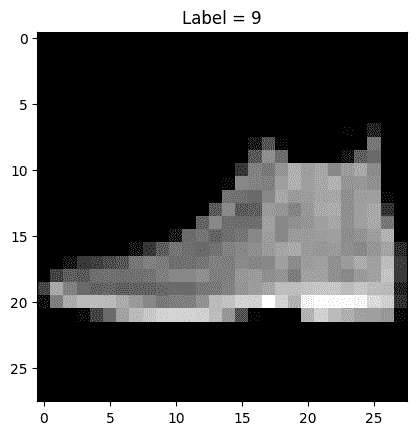
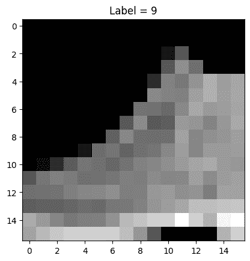

# 加载和提供 PyTorch 中的数据集

> 原文：[`machinelearningmastery.com/loading-and-providing-datasets-in-pytorch/`](https://machinelearningmastery.com/loading-and-providing-datasets-in-pytorch/)

将数据管道结构化，以便轻松地与您的深度学习模型连接是任何基于深度学习的系统的重要方面。PyTorch 将所有内容打包到一个地方，以便做到这一点。

虽然在[上一个教程](https://machinelearningmastery.com/using-dataset-classes-in-pytorch/)中，我们使用了简单的数据集，但在实际场景中，为了充分发挥深度学习和神经网络的潜力，我们需要处理更大的数据集。

在这个教程中，您将学习如何在 PyTorch 中构建自定义数据集。虽然这里的重点仅限于图像数据，但本节学习的概念可以应用于任何形式的数据集，例如文本或表格数据。因此，在这里您将学到：

+   如何在 PyTorch 中处理预加载的图像数据集。

+   如何在预加载的数据集上应用 torchvision 转换。

+   如何在 PyTorch 中构建自定义图像数据集类，并对其应用各种转换。

**启动您的项目**，使用我的书籍[《Deep Learning with PyTorch》](https://machinelearningmastery.com/deep-learning-with-pytorch/)。它提供带有**工作代码**的**自学教程**。

让我们开始吧！

加载和提供 PyTorch 中的数据集

图片由[Uriel SC](https://unsplash.com/photos/11KDtiUWRq4)提供。部分权利保留。

## 概述

本教程分为三部分；它们是：

+   PyTorch 中的预加载数据集

+   在图像数据集上应用 Torchvision 转换

+   构建自定义图像数据集

## PyTorch 中的预加载数据集

在 PyTorch 领域库中有多种预加载数据集，如 CIFAR-10、MNIST、Fashion-MNIST 等。您可以从 torchvision 导入它们并进行实验。此外，您还可以使用这些数据集来评估您的模型。

我们将继续从 torchvision 导入 Fashion-MNIST 数据集。Fashion-MNIST 数据集包含 70,000 个灰度图像，每个图像为 28×28 像素，分为十类，每类包含 7,000 张图像。其中有 60,000 张图像用于训练，10,000 张用于测试。

让我们首先导入本教程中将使用的几个库。

```py
import torch
from torch.utils.data import Dataset
from torchvision import datasets
import torchvision.transforms as transforms
import numpy as np
import matplotlib.pyplot as plt
torch.manual_seed(42)
```

让我们还定义一个辅助函数，使用 matplotlib 显示数据集中的示例元素。

```py
def imshow(sample_element, shape = (28, 28)):
    plt.imshow(sample_element[0].numpy().reshape(shape), cmap='gray')
    plt.title('Label = ' + str(sample_element[1]))
    plt.show()
```

现在，我们将使用`torchvision.datasets`中的`FashionMNIST()`函数加载 Fashion-MNIST 数据集。此函数接受一些参数：

+   `root`：指定我们将存储数据的路径。

+   `train`：指示它是训练数据还是测试数据。我们将其设置为 False，因为我们目前不需要用于训练。

+   `download`：设置为`True`，表示它将从互联网上下载数据。

+   `transform`：允许我们在数据集上应用任何需要的转换。

```py
dataset = datasets.FashionMNIST(
    root='./data',
    train=False,
    download=True,
    transform=transforms.ToTensor()
)
```

让我们检查一下 Fashion-MNIST 数据集中我们拥有的类别名称及其对应标签。

```py
classes = dataset.classes
print(classes)
```

它会打印

```py
['T-shirt/top', 'Trouser', 'Pullover', 'Dress', 'Coat', 'Sandal', 'Shirt', 'Sneaker', 'Bag', 'Ankle boot']
```

类别标签也类似：

```py
print(dataset.class_to_idx)
```

它会打印

```py
{'T-shirt/top': 0, 'Trouser': 1, 'Pullover': 2, 'Dress': 3, 'Coat': 4, 'Sandal': 5, 'Shirt': 6, 'Sneaker': 7, 'Bag': 8, 'Ankle boot': 9}
```

这里是如何使用上述定义的帮助函数来可视化数据集的第一个元素及其对应标签的。

```py
imshow(dataset[0])
```



时尚 MNIST 数据集的第一个元素

### 想要开始使用 PyTorch 进行深度学习吗？

立即参加我的免费电子邮件速成课程（附带示例代码）。

点击注册并获得课程的免费 PDF 电子书版本。

## 在图像数据集上应用 Torchvision 变换

在许多情况下，我们需要在将图像输入神经网络之前应用几个变换。例如，我们经常需要对图像进行 `RandomCrop` 以进行数据增强。

如下所示，PyTorch 允许我们选择各种变换。

```py
print(dir(transforms))
```

这显示了所有可用的变换函数：

```py
['AugMix', 'AutoAugment', 'AutoAugmentPolicy', 'CenterCrop', 'ColorJitter',
 'Compose', 'ConvertImageDtype', 'ElasticTransform', 'FiveCrop', 'GaussianBlur',
'Grayscale', 'InterpolationMode', 'Lambda', 'LinearTransformation',
'Normalize', 'PILToTensor', 'Pad', 'RandAugment', 'RandomAdjustSharpness',
'RandomAffine', 'RandomApply', 'RandomAutocontrast', 'RandomChoice', 'RandomCrop',
'RandomEqualize', 'RandomErasing', 'RandomGrayscale', 'RandomHorizontalFlip',
'RandomInvert', 'RandomOrder', 'RandomPerspective', 'RandomPosterize',
'RandomResizedCrop', 'RandomRotation', 'RandomSolarize', 'RandomVerticalFlip',
'Resize', 'TenCrop', 'ToPILImage', 'ToTensor', 'TrivialAugmentWide',
...]
```

作为示例，让我们对 Fashion-MNIST 图像应用 `RandomCrop` 变换并将其转换为张量。我们可以使用 `transform.Compose` 来组合多个变换，正如我们从之前的教程中学到的那样。

```py
randomcrop_totensor_transform = transforms.Compose([transforms.CenterCrop(16),
                                                    transforms.ToTensor()])
dataset = datasets.FashionMNIST(root='./data',
                                train=False, download=True,
                                transform=randomcrop_totensor_transform)
print("shape of the first data sample: ", dataset[0][0].shape)
```

这会打印

```py
shape of the first data sample:  torch.Size([1, 16, 16])
```

如你所见，图像现在已被裁剪为 $16\times 16$ 像素。现在，让我们绘制数据集的第一个元素，以查看它们是如何被随机裁剪的。

```py
imshow(dataset[0], shape=(16, 16))
```

这显示了以下图像



从 Fashion MNIST 数据集中裁剪的图像

综合所有内容，完整代码如下：

```py
import torch
from torch.utils.data import Dataset
from torchvision import datasets
import torchvision.transforms as transforms
import numpy as np
import matplotlib.pyplot as plt
torch.manual_seed(42)

def imshow(sample_element, shape = (28, 28)):
    plt.imshow(sample_element[0].numpy().reshape(shape), cmap='gray')
    plt.title('Label = ' + str(sample_element[1]))
    plt.show()

dataset = datasets.FashionMNIST(
    root='./data',
    train=False,
    download=True,
    transform=transforms.ToTensor()
)

classes = dataset.classes
print(classes)
print(dataset.class_to_idx)

imshow(dataset[0])

randomcrop_totensor_transform = transforms.Compose([transforms.CenterCrop(16),
                                                    transforms.ToTensor()])
dataset = datasets.FashionMNIST(
    root='./data',
    train=False,
    download=True,
    transform=randomcrop_totensor_transform)
)

print("shape of the first data sample: ", dataset[0][0].shape)
imshow(dataset[0], shape=(16, 16))
```

## 构建自定义图像数据集

到目前为止，我们一直在讨论 PyTorch 中的预构建数据集，但如果我们需要为我们的图像数据集构建一个自定义数据集类呢？虽然在 [之前的教程](https://machinelearningmastery.com/using-dataset-classes-in-pytorch/) 中我们只是简单了解了 `Dataset` 类的组件，但在这里我们将从头开始构建一个自定义图像数据集类。

首先，在构造函数中我们定义了类的参数。`__init__` 函数在类中实例化了 `Dataset` 对象。存储图像和注释的目录被初始化，同时如果我们希望稍后在数据集上应用变换，这些变换也会被初始化。这里我们假设我们在一个如下的目录结构中有一些图像：

```py
attface/
|-- imagedata.csv
|-- s1/
|   |-- 1.png
|   |-- 2.png
|   |-- 3.png
|   ...
|-- s2/
|   |-- 1.png
|   |-- 2.png
|   |-- 3.png
|   ...
...
```

注释是如下的 CSV 文件，位于图像根目录下（即上面的“attface”）：

```py
s1/1.png,1
s1/2.png,1
s1/3.png,1
...
s12/1.png,12
s12/2.png,12
s12/3.png,12
```

其中 CSV 数据的第一列是图像的路径，第二列是标签。

类似地，我们在类中定义了 `__len__` 函数，它返回我们图像数据集中样本的总数，而 `__getitem__` 方法从数据集中读取并返回给定索引处的一个数据元素。

```py
import os
import pandas as pd
import numpy as np
from torchvision.io import read_image

# creating object for our image dataset
class CustomDatasetForImages(Dataset):
    # defining constructor
    def __init__(self, annotations, directory, transform=None):
        # directory containing the images
        self.directory = directory
        annotations_file_dir = os.path.join(self.directory, annotations)
        # loading the csv with info about images
        self.labels = pd.read_csv(annotations_file_dir)
        # transform to be applied on images
        self.transform = transform

        # Number of images in dataset
        self.len = self.labels.shape[0]

    # getting the length
    def __len__(self):
        return len(self.labels)

    # getting the data items
    def __getitem__(self, idx):
        # defining the image path
        image_path = os.path.join(self.directory, self.labels.iloc[idx, 0])
        # reading the images
        image = read_image(image_path)
        # corresponding class labels of the images 
        label = self.labels.iloc[idx, 1]

        # apply the transform if not set to None
        if self.transform:
            image = self.transform(image)

        # returning the image and label
        return image, label
```

现在，我们可以创建我们的数据集对象并对其应用变换。我们假设图像数据位于名为“attface”的目录下，注释 CSV 文件位于“attface/imagedata.csv”下。然后，数据集的创建如下：

```py
directory = "attface"
annotations = "imagedata.csv"
custom_dataset = CustomDatasetForImages(annotations=annotations,
                                        directory=directory)
```

可选地，你还可以将变换函数添加到数据集中：

```py
randomcrop_totensor_transform = transforms.RandomCrop(16)
dataset = CustomDatasetForImages(annotations=annotations,
                                 directory=directory,
                                 transform=randomcrop_totensor_transform)
```

你可以将这个自定义图像数据集类用于存储在目录中的任何数据集，并根据需要应用变换。

## 总结

在本教程中，你学习了如何在 PyTorch 中处理图像数据集和变换。特别地，你学习了：

+   如何在 PyTorch 中处理预加载的图像数据集。

+   如何对预加载的数据集应用 torchvision 变换。

+   如何在 PyTorch 中构建自定义图像数据集类并对其应用各种变换。
