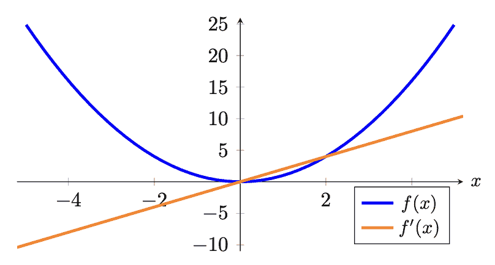
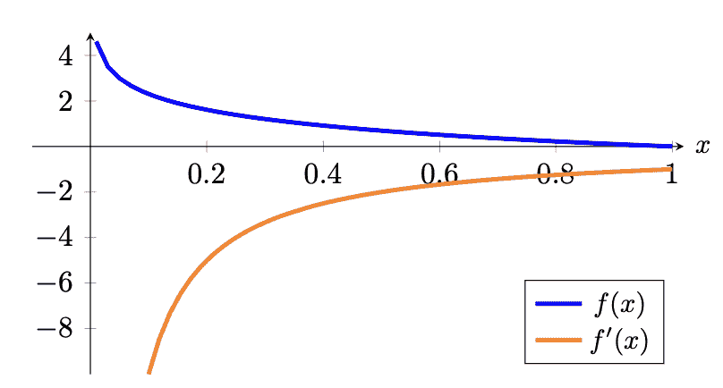

# PyTorch 模型中的损失函数

> 原文：[`machinelearningmastery.com/loss-functions-in-pytorch-models/`](https://machinelearningmastery.com/loss-functions-in-pytorch-models/)

损失指标对神经网络非常重要。由于所有机器学习模型都是一种优化问题，损失函数就是要最小化的目标函数。在神经网络中，优化是通过梯度下降和反向传播来完成的。但是什么是损失函数，它们又如何影响您的神经网络？

在这一章中，您将了解什么是损失函数，并深入了解一些常用的损失函数以及如何将它们应用于您的神经网络中。阅读完本章后，您将学到：

+   什么是损失函数，以及它们在训练神经网络模型中的作用

+   回归和分类问题的常见损失函数

+   如何在您的 PyTorch 模型中使用损失函数

**用我的书[《深度学习与 PyTorch》](https://machinelearningmastery.com/deep-learning-with-pytorch/)启动你的项目**。它提供了**自学教程**和**可运行的代码**。

让我们开始吧!

PyTorch 模型中的损失函数。

照片由[Hans Vivek](https://unsplash.com/photos/_aXtuc7tB00)拍摄。部分权利保留。

## 简介

本文分为四个部分；它们是：

+   什么是损失函数？

+   回归的损失函数

+   分类问题的损失函数

+   PyTorch 中的自定义损失函数

## 什么是损失函数？

在神经网络中，损失函数有助于优化模型的性能。它们通常用于衡量模型在预测中所产生的一些惩罚，例如预测与真实标签之间的偏差。损失函数通常在其定义域上是可微的（但允许在非常特定的点上梯度未定义，例如$x=0$，实际上在实践中被忽略）。在训练循环中，损失函数相对于参数进行微分，并且这些梯度用于您的反向传播和梯度下降步骤，以优化训练集上的模型。

损失函数也略有不同于度量标准。虽然损失函数可以告诉您我们模型的性能，但可能并不直接吸引或易于人类解释。这就是度量标准的作用。例如准确度对于人类来理解神经网络的性能要更有用，尽管它们可能不是损失函数的好选择，因为它们可能不可微分。

接下来，让我们探讨一些常见的损失函数，用于回归问题和分类问题。

### 想要开始使用 PyTorch 进行深度学习吗？

现在就来参加我的免费电子邮件崩溃课程（附有示例代码）。

点击注册，还可以获得课程的免费 PDF 电子书版本。

## 回归的损失函数

在回归问题中，模型的目标是预测一个连续范围内的值。你的模型能一直准确预测到具体值几乎是不现实的，但如果预测值足够接近就已经很好了。因此，你需要一个损失函数来衡量其接近程度。距离准确值越远，预测的损失就越大。

一个简单的函数就是测量预测值与目标值之间的差异。在计算差异时，你不在乎值是否大于或小于目标值。因此，在数学上，我们找到$\dfrac{1}{m}\sum_{i=1}^m \vert \hat{y}_i – y_i\vert$，其中$m$是训练样本的数量，而$y_i$和$\hat{y}_i$分别是目标值和预测值，对所有训练样本取平均。这就是平均绝对误差（MAE）。

平均绝对误差（MAE）永远不会为负，仅当预测值与实际值完全匹配时才为零。它是一个直观的损失函数，也可以作为你的一个指标，特别是在回归问题中，因为你希望最小化预测中的误差。

然而，绝对值在 0 处不可导。这并不是一个大问题，因为你很少会碰到这个值。但有时候，人们更倾向于使用均方误差（MSE）来代替。MSE 等于$\dfrac{1}{m}\sum_{i=1}^m (\hat{y}_i – y_i)²$，它类似于 MAE，但使用平方函数代替绝对值。

它也衡量了预测值与目标值的偏差。然而，MSE 对这种差异进行平方处理（始终为非负，因为实数的平方始终为非负），这赋予了它略微不同的特性。一个特性是，均方误差更倾向于大量小误差而不是少量大误差，这导致了具有较少离群值或至少比用 MAE 训练的模型离群值较少的模型。这是因为大误差对误差和误差梯度的影响会显著大于小误差。

让我们看看平均绝对误差和均方误差损失函数在图形上的表现：


平均绝对误差损失函数（蓝色）和梯度（橙色）



均方误差损失函数（蓝色）和梯度（橙色）

类似于激活函数，您可能也对损失函数的梯度感兴趣，因为稍后您将使用梯度来进行反向传播来训练模型的参数。您应该看到，在 MSE 中，较大的错误会导致梯度的幅度更大和更大的损失。因此，例如，两个训练示例与其地面真实值相差 1 单位将导致损失为 2，而单个训练示例与其地面真实值相差 2 单位将导致损失为 4，因此产生更大的影响。在 MAE 中并非如此。

在 PyTorch 中，您可以使用 `nn.L1Loss()` 和 `nn.MSELoss()` 创建 MAE 和 MSE 作为损失函数。它之所以称为 L1，是因为在数学上计算 MAE 也被称为 L1-范数。以下是计算两个向量之间的 MAE 和 MSE 的示例：

```py
import torch
import torch.nn as nn

mae = nn.L1Loss()
mse = nn.MSELoss()

predict = torch.tensor([0., 3.])
target = torch.tensor([1., 0.])

print("MAE: %.3f" % mae(predict, target))
print("MSE: %.3f" % mse(predict, target))
```

您应该得到

```py
MAE: 2.000
MSE: 5.000
```

MAE 是 2.0，因为 $\frac{1}{2}[\vert 0-1\vert + \vert 3-0\vert]=\frac{1}{2}(1+3)=2$ 而 MSE 是 5.0，因为 $\frac{1}{2}[(0-1)² + (3-0)²]=\frac{1}{2}(1+9)=5$。注意，在 MSE 中，第二个预测值为 3，实际值为 0 的示例在均方误差下贡献了 90% 的错误，而在平均绝对误差下为 75%。

有时，您可能会看到人们使用均方根误差（RMSE）作为度量标准。这将取 MSE 的平方根。从损失函数的角度来看，MSE 和 RMSE 是等价的。但从值的角度来看，RMSE 与预测值在同一单位中。如果您的预测是美元金额，MAE 和 RMSE 都会告诉您预测值与真实值的平均偏差是多少美元。但 MSE 的单位是平方美元，其物理含义不直观。

## 分类的损失函数

对于分类问题，输出可能取的值是一个小的离散集合。此外，用于标签编码类别的数字是任意的，没有语义含义（例如，使用标签 0 表示猫，1 表示狗，2 表示马，并不表示狗是猫和马的一半）。因此，这不应对模型的性能产生影响。

在分类问题中，模型的输出通常是每个类别的概率向量。通常，这个向量被期望是“logits”，即实数，通过 softmax 函数转换为概率，或者是 softmax 激活函数的输出。

两个概率分布之间的交叉熵是衡量两个概率分布之间差异的度量。准确地说，它是 $−\sum_i P(X=x_i)\log Q(X=x_i)$，其中 $P$ 和 $Q$ 是概率。在机器学习中，我们通常有训练数据提供的概率 $P$ 和模型预测的概率 $Q$，其中 $P$ 对于正确的类别为 1，对于其他所有类别为 0。然而，预测的概率 $Q$ 通常是介于 0 和 1 之间的浮点值。因此，当用于机器学习中的分类问题时，这个公式可以简化为：

$$\text{categorical cross-entropy} = − \log p_{\text{target}}$$

其中 $p_{\text{target}}$ 是模型预测的该样本的真实类别的概率。

交叉熵度量有一个负号，因为 $\log(x)$ 当 $x$ 趋近于零时趋向于负无穷。我们希望在概率接近 0 时损失更高，而在概率接近 1 时损失更低。图形上，



分类交叉熵损失函数（蓝色）和梯度（橙色）

注意，如果真实类别的概率为 1，则损失恰好为 0，这符合预期。此外，当真实类别的概率趋近于 0 时，损失也趋向于正无穷，从而显著惩罚不良预测。你可能会认识到这个损失函数用于逻辑回归，逻辑回归损失类似，不过逻辑回归损失特定于二分类情况。

从梯度来看，你可以看到梯度通常是负的，这也是预期的，因为为了减少这个损失，你会希望真实类别的概率尽可能高。回忆一下，梯度下降是朝着梯度的反方向进行的。

在 PyTorch 中，交叉熵函数由 `nn.CrossEntropyLoss()` 提供。它接收预测的 logits 和目标作为参数，并计算分类交叉熵。请注意，在 `CrossEntropyLoss()` 函数内部，softmax 将被应用于 logits，因此你不应该在输出层使用 softmax 激活函数。使用 PyTorch 交叉熵损失函数的示例如下：

```py
import torch
import torch.nn as nn

ce = nn.CrossEntropyLoss()

logits = torch.tensor([[-1.90, -0.29, -2.30], [-0.29, -1.90, -2.30]])
target = torch.tensor([[0., 1., 0.], [1., 0., 0.]])
print("Cross entropy: %.3f" % ce(logits, target))
```

它打印：

```py
Cross entropy: 0.288
```

注意交叉熵损失函数的第一个参数是 logit，而不是概率。因此，每一行的和不等于 1。第二个参数是一个包含概率行的张量。如果你将上面的 `logits` 张量通过 softmax 函数转换为概率，它将是：

```py
probs = torch.tensor([[0.15, 0.75, 0.1], [0.75, 0.15, 0.1]])
```

每一行的和为 1.0。这个张量也揭示了为什么上面计算的交叉熵为 0.288，即 $-\log(0.75)$。

在 PyTorch 中计算交叉熵的另一种方法是使用整数索引标签，而不是在目标中使用独热编码：

```py
import torch
import torch.nn as nn

ce = nn.CrossEntropyLoss()

logits = torch.tensor([[-1.90, -0.29, -2.30], [-0.29, -1.90, -2.30]])
indices = torch.tensor([1, 0])
print("Cross entropy: %.3f" % ce(logits, indices))
```

这给出了相同的 0.288 的交叉熵。注意，

```py
import torch

target = torch.tensor([[0., 1., 0.], [1., 0., 0.]])
indices = torch.argmax(target, dim=1)
print(indices)
```

给你：

```py
tensor([1, 0])
```

这是 PyTorch 解释目标张量的方式。在其他库中，它也称为“稀疏交叉熵”函数，以区分它不期望一个独热向量。

注意，在 PyTorch 中，您可以使用 `nn.LogSoftmax()` 作为激活函数。它是在层的输出上应用 softmax，然后对每个元素取对数。如果这是您的输出层，您应该使用 `nn.NLLLoss()`（负对数似然）作为损失函数。数学上，这两者与交叉熵损失相同。您可以通过检查下面的代码确认这一点：

```py
import torch
import torch.nn as nn

ce = nn.NLLLoss()

# softmax to apply on dimension 1, i.e. per row
logsoftmax = nn.LogSoftmax(dim=1)

logits = torch.tensor([[-1.90, -0.29, -2.30], [-0.29, -1.90, -2.30]])
pred = logsoftmax(logits)
indices = torch.tensor([1, 0])
print("Cross entropy: %.3f" % ce(pred, indices))
```

对于仅有两类的分类问题，它变成了二元分类。这很特殊，因为模型现在是一个逻辑回归模型，其中只能有一个输出，而不是一个包含两个值的向量。您仍然可以将二元分类实现为多类分类，并使用相同的交叉熵函数。但如果您将 $x$ 输出作为“正类”的概率（介于 0 和 1 之间），则已知“负类”的概率必须是 $1-x$。

在 PyTorch 中，您有 `nn.BCELoss()` 用于二元交叉熵。它专门用于二分类情况。例如：

```py
import torch
import torch.nn as nn

bce = nn.BCELoss()

pred = torch.tensor([0.75, 0.25])
target = torch.tensor([1., 0.])
print("Binary cross entropy: %.3f" % bce(pred, target))
```

这给出了：

```py
Binary cross entropy: 0.288
```

这是因为：

$$\frac{1}{2}[-\log(0.75) + (-\log(1-0.25))] = -\log(0.75) = 0.288$$

注意在 PyTorch 中，目标标签 1 被视为“正类”，标签 0 被视为“负类”。目标张量中不应包含其他值。

## 在 PyTorch 中自定义损失函数

注意上面，损失度量是使用 `torch.nn` 模块中的对象计算的。计算的损失度量是一个 PyTorch 张量，因此您可以对其进行求导并开始反向传播。因此，只要您能基于模型的输出计算张量，就没有什么可以阻止您创建自己的损失函数。

PyTorch 不会提供所有可能的损失度量。例如，平均绝对百分比误差未包含在内。它类似于 MAE，定义如下：

$$\text{MAPE} = \frac{1}{m} \sum_{i=1}^m \lvert\frac{\hat{y}_i – y_i}{y_i}\rvert$$

有时您可能更喜欢使用 MAPE。回想一下对加利福尼亚住房数据集的回归示例，预测是房价。考虑到百分比差异而不是美元差异可能更合理。您可以定义自己的 MAPE 函数，只需记住使用 PyTorch 函数计算，并返回一个 PyTorch 张量。

查看下面的完整示例：

```py
import copy

import matplotlib.pyplot as plt
import numpy as np
import pandas as pd
import torch
import torch.nn as nn
import torch.optim as optim
import tqdm
from sklearn.model_selection import train_test_split
from sklearn.datasets import fetch_california_housing
from sklearn.preprocessing import StandardScaler

# Read data
data = fetch_california_housing()
X, y = data.data, data.target

# train-test split for model evaluation
X_train_raw, X_test_raw, y_train, y_test = train_test_split(X, y, train_size=0.7, shuffle=True)

# Standardizing data
scaler = StandardScaler()
scaler.fit(X_train_raw)
X_train = scaler.transform(X_train_raw)
X_test = scaler.transform(X_test_raw)

# Convert to 2D PyTorch tensors
X_train = torch.tensor(X_train, dtype=torch.float32)
y_train = torch.tensor(y_train, dtype=torch.float32).reshape(-1, 1)
X_test = torch.tensor(X_test, dtype=torch.float32)
y_test = torch.tensor(y_test, dtype=torch.float32).reshape(-1, 1)

# Define the model
model = nn.Sequential(
    nn.Linear(8, 24),
    nn.ReLU(),
    nn.Linear(24, 12),
    nn.ReLU(),
    nn.Linear(12, 6),
    nn.ReLU(),
    nn.Linear(6, 1)
)

# loss function and optimizer
def loss_fn(output, target):
    # MAPE loss
    return torch.mean(torch.abs((target - output) / target))
optimizer = optim.Adam(model.parameters(), lr=0.0001)

n_epochs = 100   # number of epochs to run
batch_size = 10  # size of each batch
batch_start = torch.arange(0, len(X_train), batch_size)

# Hold the best model
best_mape = np.inf   # init to infinity
best_weights = None

for epoch in range(n_epochs):
    model.train()
    for start in batch_start:
        # take a batch
        X_batch = X_train[start:start+batch_size]
        y_batch = y_train[start:start+batch_size]
        # forward pass
        y_pred = model(X_batch)
        loss = loss_fn(y_pred, y_batch)
        # backward pass
        optimizer.zero_grad()
        loss.backward()
        # update weights
        optimizer.step()
    # evaluate accuracy at end of each epoch
    model.eval()
    y_pred = model(X_test)
    mape = float(loss_fn(y_pred, y_test))
    if mape < best_mape:
        best_mape = mape
        best_weights = copy.deepcopy(model.state_dict())

# restore model and return best accuracy
model.load_state_dict(best_weights)
print("MAPE: %.2f" % best_mape)

model.eval()
with torch.no_grad():
    # Test out inference with 5 samples
    for i in range(5):
        X_sample = X_test_raw[i: i+1]
        X_sample = scaler.transform(X_sample)
        X_sample = torch.tensor(X_sample, dtype=torch.float32)
        y_pred = model(X_sample)
        print(f"{X_test_raw[i]} -> {y_pred[0].numpy()} (expected {y_test[i].numpy()})")
```

与其他帖子中的示例相比，您可以看到 `loss_fn` 现在被定义为一个自定义函数。否则，一切都是完全相同的。

## 进一步阅读

下面是 PyTorch 提供的文档，详细介绍了各种损失函数的实现：

+   [nn.L1Loss](https://pytorch.org/docs/stable/generated/torch.nn.L1Loss.html) 来自 PyTorch

+   [nn.MSELoss](https://pytorch.org/docs/stable/generated/torch.nn.MSELoss.html) 来自 PyTorch

+   [nn.CrossEntropyLoss](https://pytorch.org/docs/stable/generated/torch.nn.CrossEntropyLoss.html) 来自 PyTorch

+   [nn.BCELoss](https://pytorch.org/docs/stable/generated/torch.nn.BCELoss.html) 来自 PyTorch

+   [nn.NLLLoss](https://pytorch.org/docs/stable/generated/torch.nn.NLLLoss.html) 来自 PyTorch

## 摘要

在这篇文章中，你了解了损失函数及其在神经网络中的作用。你还了解了一些在回归和分类模型中使用的流行损失函数，以及如何为你的 PyTorch 模型实现自己的损失函数。具体来说，你学到了：

+   什么是损失函数，它们在训练中的重要性

+   用于回归和分类问题的常见损失函数

+   如何在 PyTorch 模型中使用损失函数
