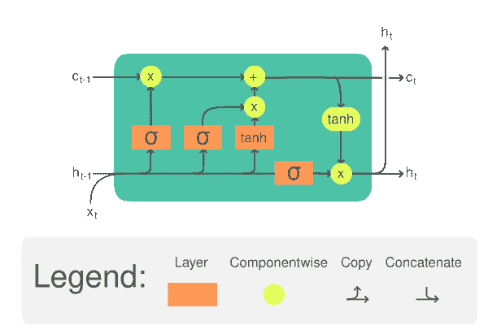
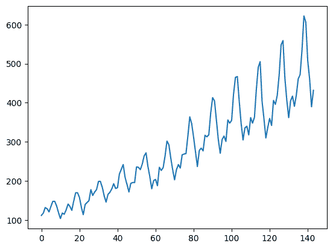
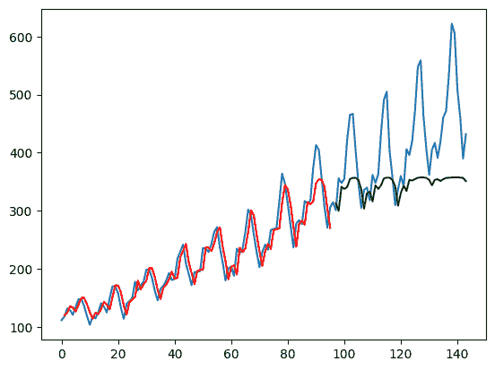
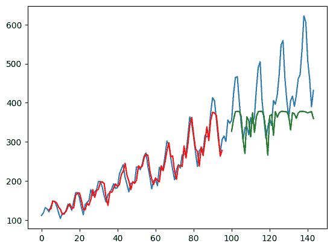

# PyTorch 中的时间序列预测 LSTM

> 原文：[`machinelearningmastery.com/lstm-for-time-series-prediction-in-pytorch/`](https://machinelearningmastery.com/lstm-for-time-series-prediction-in-pytorch/)

长短期记忆（LSTM）是一种可以在神经网络中使用的结构。它是一种递归神经网络（RNN），期望输入为特征序列。它对时间序列或文本串等数据非常有用。在本文中，您将了解 LSTM 网络。特别是，

+   什么是 LSTM 及其不同之处

+   如何开发用于时间序列预测的 LSTM 网络

+   如何训练 LSTM 网络

**快速启动您的项目**，请参考我的书 [深度学习与 PyTorch](https://machinelearningmastery.com/deep-learning-with-pytorch/)。它提供了**自学教程**和**可运行的代码**。

让我们开始吧。


PyTorch 中的时间序列预测 LSTM

图片由 [Carry Kung](https://unsplash.com/photos/5W5Fb6bHOQc) 提供。保留所有权利。

## 概述

本文分为三部分；它们是

+   LSTM 网络概述

+   时间序列预测的 LSTM

+   训练和验证您的 LSTM 网络

## LSTM 网络概述

LSTM 单元是您可以用来构建更大神经网络的构建块。虽然常见的构建块如全连接层仅仅是权重张量与输入的矩阵乘法以产生输出张量，但 LSTM 模块要复杂得多。

典型的 LSTM 单元如图所示



LSTM 单元。插图来自维基百科。

它接收一个时间步的输入张量 $x$ 以及一个单元记忆 $c$ 和一个隐藏状态 $h$。单元记忆和隐藏状态可以在开始时初始化为零。然后在 LSTM 单元内，$x$、$c$ 和 $h$ 将分别与不同的权重张量相乘，并通过一些激活函数处理几次。结果是更新后的单元记忆和隐藏状态。这些更新后的 $c$ 和 $h$ 将用于输入张量的**下一个时间步**。直到最后一个时间步结束，LSTM 单元的输出将是其单元记忆和隐藏状态。

具体而言，一个 LSTM 单元的方程如下：

$$

\begin{aligned}

f_t &= \sigma_g(W_{f} x_t + U_{f} h_{t-1} + b_f) \\

i_t &= \sigma_g(W_{i} x_t + U_{i} h_{t-1} + b_i) \\

o_t &= \sigma_g(W_{o} x_t + U_{o} h_{t-1} + b_o) \\

\tilde{c}_t &= \sigma_c(W_{c} x_t + U_{c} h_{t-1} + b_c) \\

c_t &= f_t \odot c_{t-1} + i_t \odot \tilde{c}_t \\

h_t &= o_t \odot \sigma_h(c_t)

\end{aligned}

$$

其中 $W$、$U$、$b$ 是 LSTM 单元的可训练参数。每个方程是针对每个时间步计算的，因此带有下标 $t$。这些可训练参数在所有时间步中**重复使用**。这种共享参数的特性赋予了 LSTM 记忆的能力。

请注意，上述只是 LSTM 的一种设计。文献中存在多种变体。

由于 LSTM 单元期望输入$x$为多个时间步的形式，每个输入样本应为 2D 张量：一个维度表示时间，另一个维度表示特征。LSTM 单元的强大依赖于隐藏状态或单元内存的大小，通常这个维度大于输入特征的数量。

### 想开始使用 PyTorch 进行深度学习？

现在立即参加我的免费电子邮件速成课程（附带示例代码）。

点击注册并获得课程的免费 PDF 电子书版本。

## LSTM 用于时间序列预测

让我们看看如何使用 LSTM 构建一个时间序列预测神经网络的示例。

本文中讨论的问题是国际航空乘客预测问题。这是一个给定年份和月份后，预测以 1,000 为单位的国际航空乘客数量的问题。数据范围从 1949 年 1 月到 1960 年 12 月，共 12 年，包含 144 个观测值。

这是一个回归问题。即，给定最近几个月的乘客数量（以 1,000 为单位），预测下个月的乘客数量。数据集只有一个特征：乘客数量。

让我们从读取数据开始。数据可以[在这里](https://raw.githubusercontent.com/jbrownlee/Datasets/master/airline-passengers.csv)下载。

将此文件保存为`airline-passengers.csv`，以便在本地目录中使用。

以下是文件前几行的样本：

```py
"Month","Passengers"
"1949-01",112
"1949-02",118
"1949-03",132
"1949-04",129
```

数据有两列：月份和乘客数量。由于数据按时间顺序排列，你可以只取乘客数量来构建一个单特征时间序列。下面你将使用 pandas 库读取 CSV 文件，并将其转换为 2D numpy 数组，然后使用 matplotlib 绘制：

```py
import matplotlib.pyplot as plt
import pandas as pd

df = pd.read_csv('airline-passengers.csv')
timeseries = df[["Passengers"]].values.astype('float32')

plt.plot(timeseries)
plt.show()
```



这个时间序列有 144 个时间步。你可以从图中看到上升的趋势。数据集中还有一些周期性现象，对应于北半球的暑假。通常时间序列应该被“去趋势化”以去除线性趋势成分，并在处理前进行标准化。为了简便，这些步骤在本项目中被省略。

为了展示我们模型的预测能力，时间序列被分割为训练集和测试集。与其他数据集不同，时间序列数据通常是分割而不打乱的。即，训练集是时间序列的前半部分，其余部分用作测试集。这可以很容易地在 numpy 数组上完成：

```py
# train-test split for time series
train_size = int(len(timeseries) * 0.67)
test_size = len(timeseries) - train_size
train, test = timeseries[:train_size], timeseries[train_size:]
```

更复杂的问题是你希望网络如何预测时间序列。通常，时间序列预测是在一个窗口上进行的。也就是说，给定从时间$t-w$到时间$t$的数据，你需要预测时间$t+1$（或更远的未来）。窗口大小$w$决定了你在做出预测时可以查看多少数据。这也称为**回顾期**。

在足够长的时间序列上，可以创建多个重叠窗口。创建一个函数以从时间序列生成固定窗口的数据集很方便。由于数据将用于 PyTorch 模型，因此输出数据集应为 PyTorch 张量：

```py
import torch

def create_dataset(dataset, lookback):
    """Transform a time series into a prediction dataset

    Args:
        dataset: A numpy array of time series, first dimension is the time steps
        lookback: Size of window for prediction
    """
    X, y = [], []
    for i in range(len(dataset)-lookback):
        feature = dataset[i:i+lookback]
        target = dataset[i+1:i+lookback+1]
        X.append(feature)
        y.append(target)
    return torch.tensor(X), torch.tensor(y)
```

此函数旨在对时间序列应用窗口。它假定预测未来一个时间步长。它设计成将时间序列转换为维度为 (窗口样本数, 时间步长, 特征) 的张量。一个包含 $L$ 个时间步长的时间序列大约可以生成 $L$ 个窗口（因为窗口可以从任何时间步开始，只要窗口不超出时间序列的边界）。在一个窗口内，有多个连续的时间步长值。在每个时间步长中，可以有多个特征。在此数据集中，只有一个特征。

故意生成“特征”和“目标”具有相同的形状：对于三个时间步长的窗口，从 $t$ 到 $t+2$ 的“特征”是时间序列，从 $t+1$ 到 $t+3$ 的“目标”。我们感兴趣的是 $t+3$，但 $t+1$ 到 $t+2$ 的信息在训练中是有用的。

请注意，输入时间序列是一个二维数组，而 `create_dataset()` 函数的输出将是一个三维张量。让我们尝试 `lookback=1`。您可以验证输出张量的形状如下：

```py
lookback = 1
X_train, y_train = create_dataset(train, lookback=lookback)
X_test, y_test = create_dataset(test, lookback=lookback)
print(X_train.shape, y_train.shape)
print(X_test.shape, y_test.shape)
```

您应该看到：

```py
torch.Size([95, 1, 1]) torch.Size([95, 1, 1])
torch.Size([47, 1, 1]) torch.Size([47, 1, 1])
```

现在您可以构建 LSTM 模型来预测时间序列。使用 `lookback=1`，准确性可能不太好，因为线索太少。但这是一个很好的例子，可以展示 LSTM 模型的结构。

模型被创建为一个类，其中包括一个 LSTM 层和一个全连接层。

```py
...
import torch.nn as nn

class AirModel(nn.Module):
    def __init__(self):
        super().__init__()
        self.lstm = nn.LSTM(input_size=1, hidden_size=50, num_layers=1, batch_first=True)
        self.linear = nn.Linear(50, 1)
    def forward(self, x):
        x, _ = self.lstm(x)
        x = self.linear(x)
        return x
```

`nn.LSTM()` 的输出是一个元组。第一个元素是生成的隐藏状态，每个时间步的输入都有一个。第二个元素是 LSTM 单元的记忆和隐藏状态，这里没有使用。

LSTM 层使用选项 `batch_first=True` 创建，因为您准备的张量的维度为 (窗口样本数, 时间步长, 特征)，其中批次通过对第一个维度进行采样创建。

隐藏状态的输出经过一个全连接层进一步处理，以生成单个回归结果。由于 LSTM 的输出是每个输入时间步长的一个，您可以选择仅选择最后一个时间步长的输出，您应该有：

```py
x, _ = self.lstm(x)
# extract only the last time step
x = x[:, -1, :]
x = self.linear(x)
```

模型的输出将是下一个时间步的预测。但在这里，全连接层应用于每个时间步。在此设计中，应从模型输出中仅提取最后一个时间步作为预测值。然而，在此情况下，窗口为 1，这两种方法没有区别。

## 训练和验证您的 LSTM 网络

因为这是一个回归问题，所以选择了均方误差（MSE）作为损失函数，通过 Adam 优化器进行最小化。在下面的代码中，PyTorch 张量通过 `torch.utils.data.TensorDataset()` 组合成数据集，并通过 `DataLoader` 提供批量训练数据。模型性能每 100 个周期评估一次，包括训练集和测试集：

```py
import numpy as np
import torch.optim as optim
import torch.utils.data as data

model = AirModel()
optimizer = optim.Adam(model.parameters())
loss_fn = nn.MSELoss()
loader = data.DataLoader(data.TensorDataset(X_train, y_train), shuffle=True, batch_size=8)

n_epochs = 2000
for epoch in range(n_epochs):
    model.train()
    for X_batch, y_batch in loader:
        y_pred = model(X_batch)
        loss = loss_fn(y_pred, y_batch)
        optimizer.zero_grad()
        loss.backward()
        optimizer.step()
    # Validation
    if epoch % 100 != 0:
        continue
    model.eval()
    with torch.no_grad():
        y_pred = model(X_train)
        train_rmse = np.sqrt(loss_fn(y_pred, y_train))
        y_pred = model(X_test)
        test_rmse = np.sqrt(loss_fn(y_pred, y_test))
    print("Epoch %d: train RMSE %.4f, test RMSE %.4f" % (epoch, train_rmse, test_rmse))
```

由于数据集较小，模型应训练足够长的时间以学习模式。在这 2000 个训练周期中，你应该看到训练集和测试集的 RMSE 逐渐降低：

```py
Epoch 0: train RMSE 225.7571, test RMSE 422.1521
Epoch 100: train RMSE 186.7353, test RMSE 381.3285
Epoch 200: train RMSE 153.3157, test RMSE 345.3290
Epoch 300: train RMSE 124.7137, test RMSE 312.8820
Epoch 400: train RMSE 101.3789, test RMSE 283.7040
Epoch 500: train RMSE 83.0900, test RMSE 257.5325
Epoch 600: train RMSE 66.6143, test RMSE 232.3288
Epoch 700: train RMSE 53.8428, test RMSE 209.1579
Epoch 800: train RMSE 44.4156, test RMSE 188.3802
Epoch 900: train RMSE 37.1839, test RMSE 170.3186
Epoch 1000: train RMSE 32.0921, test RMSE 154.4092
Epoch 1100: train RMSE 29.0402, test RMSE 141.6920
Epoch 1200: train RMSE 26.9721, test RMSE 131.0108
Epoch 1300: train RMSE 25.7398, test RMSE 123.2518
Epoch 1400: train RMSE 24.8011, test RMSE 116.7029
Epoch 1500: train RMSE 24.7705, test RMSE 112.1551
Epoch 1600: train RMSE 24.4654, test RMSE 108.1879
Epoch 1700: train RMSE 25.1378, test RMSE 105.8224
Epoch 1800: train RMSE 24.1940, test RMSE 101.4219
Epoch 1900: train RMSE 23.4605, test RMSE 100.1780
```

预计测试集的 RMSE 会大一个数量级。RMSE 为 100 意味着预测值与实际目标值的平均偏差为 100（即，该数据集中 100,000 名乘客）。

为了更好地理解预测质量，你确实可以使用 matplotlib 绘制输出，如下所示：

```py
with torch.no_grad():
    # shift train predictions for plotting
    train_plot = np.ones_like(timeseries) * np.nan
    y_pred = model(X_train)
    y_pred = y_pred[:, -1, :]
    train_plot[lookback:train_size] = model(X_train)[:, -1, :]
    # shift test predictions for plotting
    test_plot = np.ones_like(timeseries) * np.nan
    test_plot[train_size+lookback:len(timeseries)] = model(X_test)[:, -1, :]
# plot
plt.plot(timeseries, c='b')
plt.plot(train_plot, c='r')
plt.plot(test_plot, c='g')
plt.show()
```



从上图，你将模型的输出作为 `y_pred`，但只提取最后一个时间步的数据作为 `y_pred[:, -1, :]`。这就是图表上绘制的内容。

训练集用红色绘制，而测试集用绿色绘制。蓝色曲线表示实际数据的样子。你可以看到模型对训练集拟合良好，但对测试集的效果不是很好。

综合来看，以下是完整代码，除了参数 `lookback` 本次设置为 4：

```py
import matplotlib.pyplot as plt
import numpy as np
import pandas as pd
import torch
import torch.nn as nn
import torch.optim as optim
import torch.utils.data as data

df = pd.read_csv('airline-passengers.csv')
timeseries = df[["Passengers"]].values.astype('float32')

# train-test split for time series
train_size = int(len(timeseries) * 0.67)
test_size = len(timeseries) - train_size
train, test = timeseries[:train_size], timeseries[train_size:]

def create_dataset(dataset, lookback):
    """Transform a time series into a prediction dataset

    Args:
        dataset: A numpy array of time series, first dimension is the time steps
        lookback: Size of window for prediction
    """
    X, y = [], []
    for i in range(len(dataset)-lookback):
        feature = dataset[i:i+lookback]
        target = dataset[i+1:i+lookback+1]
        X.append(feature)
        y.append(target)
    return torch.tensor(X), torch.tensor(y)

lookback = 4
X_train, y_train = create_dataset(train, lookback=lookback)
X_test, y_test = create_dataset(test, lookback=lookback)

class AirModel(nn.Module):
    def __init__(self):
        super().__init__()
        self.lstm = nn.LSTM(input_size=1, hidden_size=50, num_layers=1, batch_first=True)
        self.linear = nn.Linear(50, 1)
    def forward(self, x):
        x, _ = self.lstm(x)
        x = self.linear(x)
        return x

model = AirModel()
optimizer = optim.Adam(model.parameters())
loss_fn = nn.MSELoss()
loader = data.DataLoader(data.TensorDataset(X_train, y_train), shuffle=True, batch_size=8)

n_epochs = 2000
for epoch in range(n_epochs):
    model.train()
    for X_batch, y_batch in loader:
        y_pred = model(X_batch)
        loss = loss_fn(y_pred, y_batch)
        optimizer.zero_grad()
        loss.backward()
        optimizer.step()
    # Validation
    if epoch % 100 != 0:
        continue
    model.eval()
    with torch.no_grad():
        y_pred = model(X_train)
        train_rmse = np.sqrt(loss_fn(y_pred, y_train))
        y_pred = model(X_test)
        test_rmse = np.sqrt(loss_fn(y_pred, y_test))
    print("Epoch %d: train RMSE %.4f, test RMSE %.4f" % (epoch, train_rmse, test_rmse))

with torch.no_grad():
    # shift train predictions for plotting
    train_plot = np.ones_like(timeseries) * np.nan
    y_pred = model(X_train)
    y_pred = y_pred[:, -1, :]
    train_plot[lookback:train_size] = model(X_train)[:, -1, :]
    # shift test predictions for plotting
    test_plot = np.ones_like(timeseries) * np.nan
    test_plot[train_size+lookback:len(timeseries)] = model(X_test)[:, -1, :]
# plot
plt.plot(timeseries)
plt.plot(train_plot, c='r')
plt.plot(test_plot, c='g')
plt.show()
```



运行上述代码将产生下面的图表。从打印出的 RMSE 度量和图表中，你可以注意到模型现在在测试集上的表现有所改善。

这也是为什么 `create_dataset()` 函数是这样设计的原因：当模型接收到时间序列从时间 $t$ 到 $t+3$（如 `lookback=4`），其输出是对 $t+1$ 到 $t+4$ 的预测。然而，$t+1$ 到 $t+3$ 也从输入中得知。通过在损失函数中使用这些数据，模型实际上获得了更多的线索进行训练。这种设计并不总是适用，但你可以看到在这个特定的例子中是有帮助的。

## 进一步阅读

本节提供了更多关于该主题的资源，如果你想深入了解。

+   [`nn.LSTM()`来自 PyTorch 文档](https://pytorch.org/docs/stable/generated/torch.nn.LSTM.html)

+   [`torch.utils.data` API 来自 PyTorch](https://pytorch.org/docs/stable/data.html)

## 总结

在这篇文章中，你发现了什么是 LSTM 以及如何在 PyTorch 中使用它进行时间序列预测。具体来说，你学到了：

+   什么是国际航空乘客时间序列预测数据集

+   什么是 LSTM 单元

+   如何创建用于时间序列预测的 LSTM 网络
