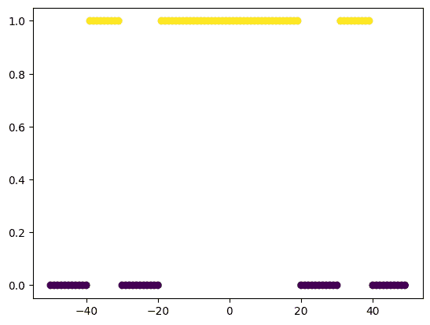
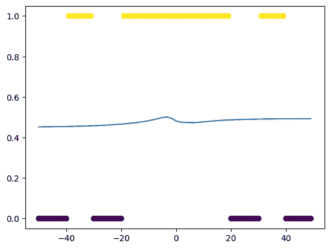
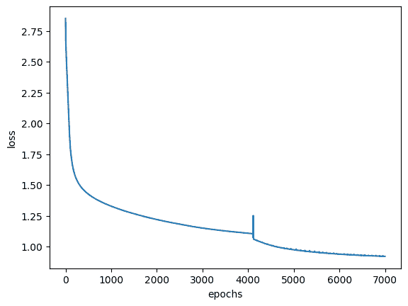

# 使用更多隐藏神经元的神经网络

> 原文：[`machinelearningmastery.com/neural-network-with-more-hidden-neurons/`](https://machinelearningmastery.com/neural-network-with-more-hidden-neurons/)

传统的神经网络模型称为多层感知器。它们通常由一系列相互连接的层组成。输入层是数据进入网络的地方，输出层是网络输出结果的地方。

输入层通常连接到一个或多个隐藏层，这些层在数据到达输出层之前修改和处理数据。隐藏层是神经网络如此强大的原因：它们可以学习对程序员来说可能难以在代码中指定的复杂函数。

在上一个教程中，我们构建了一个只有几个隐藏神经元的神经网络。在这里，您将通过添加更多隐藏神经元来实现一个神经网络。这将为我们估计更复杂的函数以适应数据。

在实现过程中，您将学到：

+   如何在 PyTorch 中构建一个使用更多隐藏神经元的神经网络。

+   如何通过在网络中添加更多隐藏神经元来估计复杂函数。

+   如何在 PyTorch 中训练一个神经网络。

**启动您的项目**，使用我的书籍[PyTorch 深度学习](https://machinelearningmastery.com/deep-learning-with-pytorch/)。它提供了带有**实际代码**的**自学教程**。

让我们开始吧！[](../Images/0a0df0be009ba84b451a0c0758afb706.png)

使用更多隐藏神经元的神经网络。

图片由[Kdwk Leung](https://unsplash.com/photos/Lu2NgRt7p_g)拍摄。部分权利保留。

## 概述

本教程分为三个部分，它们是：

+   准备数据

+   构建模型架构

+   训练模型

## 准备数据

让我们构建一个扩展自 PyTorch 的`Dataset`类的`Data`类。您可以使用它来创建一个包含 100 个从$-50$到$50$范围内的合成值的数据集。`x`张量存储指定范围内的值，而`y`张量是一个形状与`x`相同的零张量。

接下来，您可以使用 for 循环根据`x`中的值设置`x`和`y`张量的值。如果`x`中的值介于$-20$和$20$之间，则将`y`中对应的值设置为 1；如果`x`中的值介于$-30$和$-20$之间或者介于$20$和$30$之间，则将`y`中对应的值设置为 0。类似地，如果`x`中的值介于$-40$和$-30$之间或者介于$30$和$40$之间，则将`y`中对应的值设置为 1。否则，将`y`中对应的值设置为 0。

在`Data`类中，`__getitem__()`方法被用来获取数据集中指定索引处的`x`和`y`值。`__len__()`方法返回数据集的长度。有了这些，您可以使用`data[i]`获取数据集中的样本，并使用`len(data)`告知数据集的大小。此类可用于创建数据对象，该对象可传递给 PyTorch 数据加载器以训练机器学习模型。

请注意，您正在构建此复杂的数据对象以查看我们具有更多隐藏神经元的神经网络估计函数的情况。以下是数据对象代码的外观。

```py
import torch
from torch.utils.data import Dataset, DataLoader

class Data(Dataset):
    def __init__(self):
        # Create tensor of 100 values from -50 to 50
        self.x = torch.zeros(100, 1)

        # Create tensor of zeros with the same shape as x
        self.y = torch.zeros(self.x.shape)

        # Set the values in x and y using a for loop
        for i in range(100):
            self.x[i] = -50 + i
            if self.x[i,0] > -20 and self.x[i,0] < 20:
                self.y[i] = 1
            elif (self.x[i,0] > -30 and self.x[i,0] < -20) or (self.x[i,0] > 20 and self.x[i,0] < 30):
                self.y[i] = 0
            elif (self.x[i,0] > -40 and self.x[i,0] < -30) or (self.x[i,0] > 30 and self.x[i,0] < 40):
                self.y[i] = 1
            else:
                self.y[i] = 0

        # Store the length of the dataset
        self.len = self.x.shape[0]

    def __getitem__(self, index):
        # Return the x and y values at the specified index
        return self.x[index], self.y[index]

    def __len__(self):
        # Return the length of the dataset
        return self.len
```

让我们实例化一个数据对象。

```py
# Create the Data object
dataset = Data()
```

并编写一个函数来可视化这些数据，在以后训练模型时也会很有用。

```py
import pandas as pd
import matplotlib.pyplot as plt

def plot_data(X, Y, model=None, leg=False):
    # Get the x and y values from the Data object
    x = dataset.x
    y = dataset.y

    # Convert the x and y values to a Pandas series with an index
    x = pd.Series(x[:, 0], index=range(len(x)))
    y = pd.Series(y[:, 0], index=range(len(y)))

    # Scatter plot of the x and y values, coloring the points by their labels
    plt.scatter(x, y, c=y)

    if model!=None:
        plt.plot(X.numpy(), model(X).detach().numpy(), label='Neural Net')

    # Show the plot
    plt.show()
```

如果您运行此函数，您将看到数据看起来像下面这样：

```py
plot_data(dataset.x, dataset.y, leg=False)
```



### 想要开始使用 PyTorch 进行深度学习吗？

现在开始我的免费电子邮件崩溃课程（带有示例代码）。

单击注册，还可以获得课程的免费 PDF 电子书版本。

## 建立模型架构

下面，您将定义一个`NeuralNetwork`类，使用 PyTorch 中的`nn.Module`来构建自定义模型架构。该类表示一个简单的神经网络，包含一个输入层、一个隐藏层和一个输出层。

`__init__()`方法用于初始化神经网络，定义网络中的各层。`forward`方法用于定义网络的前向传播。在本例中，sigmoid 激活函数应用于输入层和输出层的输出。这意味着网络的输出将是一个介于 0 和 1 之间的值。

最后，您将创建`NeuralNetwork`类的一个实例，并将其存储在`model`变量中。该模型初始化为具有 1 个输入神经元的输入层，15 个隐藏神经元的隐藏层和 1 个输出神经元的输出层。现在，该模型已准备好在某些数据上进行训练。

```py
import torch.nn as nn

# Define the Neural Network
class NeuralNetwork(nn.Module):
    def __init__(self, input_size, hidden_size, output_size):
        super().__init__()
        # Define the layers in the neural network
        self.input_layer = nn.Linear(input_size, hidden_size)
        self.output_layer = nn.Linear(hidden_size, output_size)

    def forward(self, x):
        # Define the forward pass through the network
        x = torch.sigmoid(self.input_layer(x))
        x = torch.sigmoid(self.output_layer(x))
        return x

# Initialize the Neural Network
model = NeuralNetwork(input_size=1, hidden_size=20, output_size=1)
```

## 训练模型

让我们定义准则、优化器和数据加载器。由于数据集是一个具有两类的分类问题，应使用二元交叉熵损失函数。使用 Adam 优化器，批量大小为 32。学习率设置为 0.01，决定了训练过程中模型权重的更新方式。损失函数用于评估模型性能，优化器更新权重，数据加载器将数据分成批次以进行高效处理。

```py
learning_rate = 0.01
criterion = nn.BCELoss()
optimizer = torch.optim.Adam(model.parameters(), lr=learning_rate)
data_loader = DataLoader(dataset=dataset, batch_size=32)
```

现在，让我们构建一个包含 7000 个 epoch 的训练循环，并在训练过程中可视化结果。您将看到随着训练的进行，我们的模型如何估计数据点的情况。

```py
n_epochs = 7000 # number of epochs to train the model
LOSS = [] # list to store the loss values after each epoch

# train the model for n_epochs
for epoch in range(n_epochs):
    total = 0 # variable to store the total loss for this epoch   
    # iterate over the data in the data loader
    for x, y in data_loader:
        # zero the gradients of the model
        optimizer.zero_grad()
        # make a prediction using the model
        yhat = model(x)
        # compute the loss between the predicted and true values
        loss = criterion(yhat, y)        
        # compute the gradients of the model with respect to the loss
        loss.backward()        
        # update the model parameters
        optimizer.step()        
        # add the loss value to the total loss for this epoch
        total += loss.item()        
    # after each epoch, check if the epoch number is divisible by 200
    if epoch % 1000 == 0:
        # if it is, plot the current data and model using the PlotData function
        plot_data(dataset.x, dataset.y, model)
        # print the current loss
        print(f"Epochs Done: {epoch+1}/{n_epochs}, Loss: {loss.item():.4f}")    
    # add the total loss for this epoch to the LOSS list
    LOSS.append(total)
```

当您运行此循环时，您将看到在第一个 epoch 中，神经网络对数据集建模较差，如下所示：

但随着训练的进行，准确性得到了改善。训练循环完成后，我们可以看到神经网络对数据的建模结果如下：

```py
# plot after training loop ended
plot_data(dataset.x, dataset.y, model)
```


并且对应的损失指标历史可以如下绘制：

```py
# create a plot of the loss over epochs
plt.figure()
plt.plot(LOSS)
plt.xlabel('epochs')
plt.ylabel('loss')
# show the plot
plt.show()
```



正如您所看到的，我们的模型相当好地估计了函数，但并非完美。例如，20 到 40 的输入范围并没有得到正确的预测。您可以尝试扩展网络以添加一个额外的层，例如以下内容，并查看是否会有所不同。

```py
# Define the Neural Network
class NeuralNetwork(nn.Module):
    def __init__(self, input_size, hidden1_size, hidden2_size, output_size):
        super(NeuralNetwork, self).__init__()

        # Define the layers in the neural network
        self.layer1 = nn.Linear(input_size, hidden1_size)
        self.layer2 = nn.Linear(hidden1_size, hidden2_size)
        self.output_layer = nn.Linear(hidden2_size, output_size)

    def forward(self, x):
        # Define the forward pass through the network
        x = torch.sigmoid(self.layer1(x))
        x = torch.sigmoid(self.layer2(x))
        x = torch.sigmoid(self.output_layer(x))
        return x

# Initialize the Neural Network
model = NeuralNetwork(input_size=1, hidden1_size=10, hidden2_size=10, output_size=1)
```

将所有内容整合在一起，以下是完整的代码：

```py
import torch.nn as nn
import pandas as pd
import matplotlib.pyplot as plt
import torch
from torch.utils.data import Dataset, DataLoader

class Data(Dataset):
    def __init__(self):
        # Create tensor of 100 values from -50 to 50
        self.x = torch.zeros(100, 1)

        # Create tensor of zeros with the same shape as x
        self.y = torch.zeros(self.x.shape)

        # Set the values in x and y using a for loop
        for i in range(100):
            self.x[i] = -50 + i
            if self.x[i,0] > -20 and self.x[i,0] < 20:
                self.y[i] = 1
            elif (self.x[i,0] > -30 and self.x[i,0] < -20) or (self.x[i,0] > 20 and self.x[i,0] < 30):
                self.y[i] = 0
            elif (self.x[i,0] > -40 and self.x[i,0] < -30) or (self.x[i,0] > 30 and self.x[i,0] < 40):
                self.y[i] = 1
            else:
                self.y[i] = 0

        # Store the length of the dataset
        self.len = self.x.shape[0]

    def __getitem__(self, index):
        # Return the x and y values at the specified index
        return self.x[index], self.y[index]

    def __len__(self):
        # Return the length of the dataset
        return self.len

# Create the Data object
dataset = Data()

def plot_data(X, Y, model=None, leg=False):
    # Get the x and y values from the Data object
    x = dataset.x
    y = dataset.y

    # Convert the x and y values to a Pandas series with an index
    x = pd.Series(x[:, 0], index=range(len(x)))
    y = pd.Series(y[:, 0], index=range(len(y)))

    # Scatter plot of the x and y values, coloring the points by their labels
    plt.scatter(x, y, c=y)

    if model!=None:
        plt.plot(X.numpy(), model(X).detach().numpy(), label='Neural Net')

    # Show the plot
    plt.show()

# Define the Neural Network
class NeuralNetwork(nn.Module):
    def __init__(self, input_size, hidden_size, output_size):
        super().__init__()
        # Define the layers in the neural network
        self.input_layer = nn.Linear(input_size, hidden_size)
        self.output_layer = nn.Linear(hidden_size, output_size)

    def forward(self, x):
        # Define the forward pass through the network
        x = torch.sigmoid(self.input_layer(x))
        x = torch.sigmoid(self.output_layer(x))
        return x

# Initialize the Neural Network
model = NeuralNetwork(input_size=1, hidden_size=20, output_size=1)

learning_rate = 0.01
criterion = nn.BCELoss()
optimizer = torch.optim.Adam(model.parameters(), lr=learning_rate)
data_loader = DataLoader(dataset=dataset, batch_size=32)

n_epochs = 7000 # number of epochs to train the model
LOSS = [] # list to store the loss values after each epoch

# train the model for n_epochs
for epoch in range(n_epochs):
    total = 0 # variable to store the total loss for this epoch   
    # iterate over the data in the data loader
    for x, y in data_loader:
        # zero the gradients of the model
        optimizer.zero_grad()
        # make a prediction using the model
        yhat = model(x)
        # compute the loss between the predicted and true values
        loss = criterion(yhat, y)        
        # compute the gradients of the model with respect to the loss
        loss.backward()        
        # update the model parameters
        optimizer.step()        
        # add the loss value to the total loss for this epoch
        total += loss.item()        
    # after each epoch, check if the epoch number is divisible by 200
    if epoch % 1000 == 0:
        # if it is, plot the current data and model using the PlotData function
        plot_data(dataset.x, dataset.y, model)
        # print the current loss
        print(f"Epochs Done: {epoch+1}/{n_epochs}, Loss: {loss.item():.4f}")    
    # add the total loss for this epoch to the LOSS list
    LOSS.append(total)

plot_data(dataset.x, dataset.y, model)

# create a plot of the loss over epochs
plt.figure()
plt.plot(LOSS)
plt.xlabel('epochs')
plt.ylabel('loss')
# show the plot
plt.show()
```

## 总结

在本教程中，你学习了如何通过向神经网络中引入更多的神经元来估计复杂函数。特别地，你学习了：

+   如何在 PyTorch 中构建一个具有更多隐藏神经元的神经网络。

+   如何通过向网络中添加更多隐藏神经元来估计复杂函数。

+   如何在 PyTorch 中训练神经网络。
