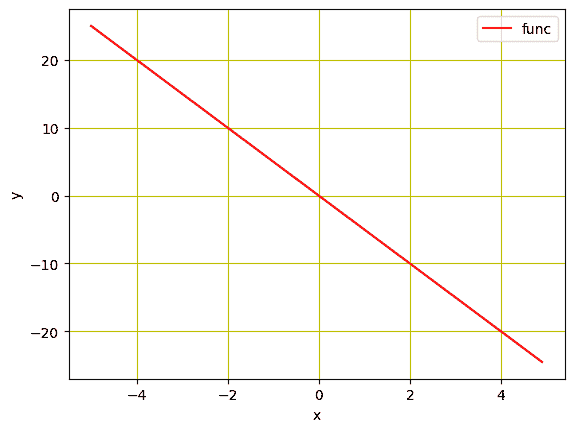
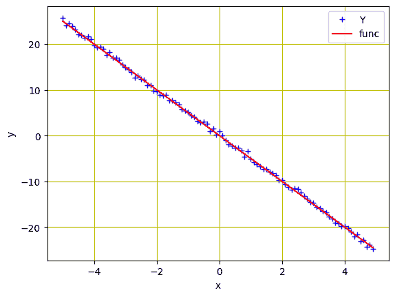
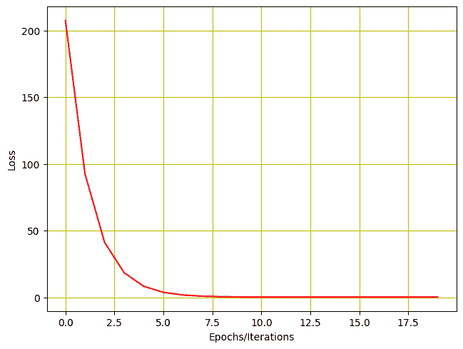
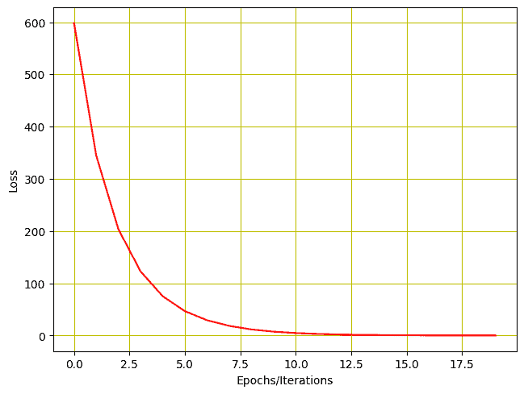

# 在 PyTorch 中训练线性回归模型

> 原文：[`machinelearningmastery.com/training-a-linear-regression-model-in-pytorch/`](https://machinelearningmastery.com/training-a-linear-regression-model-in-pytorch/)

线性回归是一种简单而强大的技术，用于基于其他变量预测变量的值。它通常用于建模两个或更多连续变量之间的关系，例如收入与年龄之间的关系，或体重与身高之间的关系。同样，线性回归也可以用于预测诸如价格或需求量等连续结果，这些结果是基于已知会影响这些结果的其他变量。

为了训练线性回归模型，我们需要定义一个成本函数和一个优化器。成本函数用于衡量模型与数据的拟合程度，而优化器决定了如何移动以改善这种拟合。

在上一个教程中，你学习了如何仅通过线性回归前向传播进行简单预测，在这里你将训练一个线性回归模型，并使用 PyTorch 更新其学习参数。特别地，你将学习：

+   如何从头开始在 PyTorch 中构建一个简单的线性回归模型。

+   如何在数据集上应用简单线性回归模型。

+   如何在单个可学习参数上训练简单线性回归模型。

+   如何在两个可学习参数上训练简单线性回归模型。

**启动你的项目**，参考我的书籍 [Deep Learning with PyTorch](https://machinelearningmastery.com/deep-learning-with-pytorch/)。它提供了**自学教程**和**可运行的代码**。

那么，让我们开始吧！[](../Images/36c11f7d580464fc02a1045f012399aa.png)

在 PyTorch 中训练线性回归模型。

图片由 [Ryan Tasto](https://unsplash.com/photos/chbXE4o0ryU) 提供。一些权利保留。

## 概述

本教程分为四部分；它们是

+   准备数据

+   构建模型和损失函数

+   为单个参数训练模型

+   为两个参数训练模型

## 准备数据

让我们导入一些将在本教程中使用的库，并制作一些实验数据。

```py
import torch
import numpy as np
import matplotlib.pyplot as plt
```

我们将使用合成数据来训练线性回归模型。我们将初始化一个变量 `X`，其值从 $-5$ 到 $5$，并创建一个斜率为 $-5$ 的线性函数。请注意，这个函数稍后将由我们训练的模型进行估计。

```py
...
# Creating a function f(X) with a slope of -5
X = torch.arange(-5, 5, 0.1).view(-1, 1)
func = -5 * X
```

此外，我们将使用 matplotlib 查看数据在折线图中的表现。

```py
...
# Plot the line in red with grids
plt.plot(X.numpy(), func.numpy(), 'r', label='func')
plt.xlabel('x')
plt.ylabel('y')
plt.legend()
plt.grid('True', color='y')
plt.show()
```



线性函数的图示

由于我们需要模拟刚刚创建的真实数据，我们将向其中添加一些高斯噪声，以生成与 $X$ 同样大小的噪声数据，标准差保持在 0.4。这将通过使用 `torch.randn(X.size())` 来完成。

```py
...
# Adding Gaussian noise to the function f(X) and saving it in Y
Y = func + 0.4 * torch.randn(X.size())
```

现在，让我们使用下面的代码行来可视化这些数据点。

```py
# Plot and visualizing the data points in blue
plt.plot(X.numpy(), Y.numpy(), 'b+', label='Y')
plt.plot(X.numpy(), func.numpy(), 'r', label='func')
plt.xlabel('x')
plt.ylabel('y')
plt.legend()
plt.grid('True', color='y')
plt.show()
```



数据点和线性函数

综合起来，以下是完整的代码。

```py
import torch
import numpy as np
import matplotlib.pyplot as plt

# Creating a function f(X) with a slope of -5
X = torch.arange(-5, 5, 0.1).view(-1, 1)
func = -5 * X

# Adding Gaussian noise to the function f(X) and saving it in Y
Y = func + 0.4 * torch.randn(X.size())

# Plot and visualizing the data points in blue
plt.plot(X.numpy(), Y.numpy(), 'b+', label='Y')
plt.plot(X.numpy(), func.numpy(), 'r', label='func')
plt.xlabel('x')
plt.ylabel('y')
plt.legend()
plt.grid('True', color='y')
plt.show()
```

## 构建模型和损失函数

我们创建了用于输入模型的数据，接下来我们将基于一个简单的线性回归方程构建一个前向函数。注意，我们将在这里构建一个只训练单一参数（$w$）的模型。稍后，在教程的下一部分，我们将添加偏差并对两个参数（$w$和$b$）进行训练。模型前向传递的函数定义如下：

```py
# defining the function for forward pass for prediction
def forward(x):
    return w * x
```

在训练步骤中，我们需要一个标准来衡量原始数据点和预测数据点之间的损失。这些信息对模型的梯度下降优化操作至关重要，并且在每次迭代后更新以计算梯度并最小化损失。通常，线性回归用于连续数据，其中均方误差（MSE）有效地计算模型损失。因此，MSE 度量是我们在这里使用的标准函数。

```py
# evaluating data points with Mean Square Error.
def criterion(y_pred, y):
    return torch.mean((y_pred - y) ** 2)
```

### 想要开始使用 PyTorch 进行深度学习吗？

现在就接受我的免费电子邮件速成课程吧（附样例代码）。

点击注册并获取免费的 PDF 电子书版本课程。

## 对单一参数训练模型

经过这些准备后，我们准备开始模型训练。首先，参数$w$需要随机初始化，例如设置为$-10$。

```py
w = torch.tensor(-10.0, requires_grad=True)
```

接下来，我们将定义学习率或步长，一个空列表以存储每次迭代后的损失，以及我们希望模型训练的迭代次数。步长设置为 0.1，我们对模型进行 20 次迭代每个纪元。

```py
step_size = 0.1
loss_list = []
iter = 20
```

当执行以下代码时，`forward()`函数接受输入并生成预测。`criterian()`函数计算损失并将其存储在`loss`变量中。根据模型损失，`backward()`方法计算梯度，`w.data`存储更新后的参数。

```py
for i in range (iter):
    # making predictions with forward pass
    Y_pred = forward(X)
    # calculating the loss between original and predicted data points
    loss = criterion(Y_pred, Y)
    # storing the calculated loss in a list
    loss_list.append(loss.item())
    # backward pass for computing the gradients of the loss w.r.t to learnable parameters
    loss.backward()
    # updateing the parameters after each iteration
    w.data = w.data - step_size * w.grad.data
    # zeroing gradients after each iteration
    w.grad.data.zero_()
    # priting the values for understanding
    print('{},\t{},\t{}'.format(i, loss.item(), w.item()))
```

模型训练的输出如下所示。如你所见，模型损失在每次迭代后减少，训练参数（在本例中是$w$）得到更新。

```py
0,	207.40255737304688,	-1.6875505447387695
1,	92.3563003540039,	-7.231954097747803
2,	41.173553466796875,	-3.5338361263275146
3,	18.402894973754883,	-6.000481128692627
4,	8.272472381591797,	-4.355228900909424
5,	3.7655599117279053,	-5.452612400054932
6,	1.7604843378067017,	-4.7206573486328125
7,	0.8684477210044861,	-5.208871364593506
8,	0.471589595079422,	-4.883232593536377
9,	0.2950323224067688,	-5.100433826446533
10,	0.21648380160331726,	-4.955560684204102
11,	0.1815381944179535,	-5.052190780639648
12,	0.16599132120609283,	-4.987738609313965
13,	0.15907476842403412,	-5.030728340148926
14,	0.15599775314331055,	-5.002054214477539
15,	0.15462875366210938,	-5.021179676055908
16,	0.15401971340179443,	-5.008423328399658
17,	0.15374873578548431,	-5.016931533813477
18,	0.15362821519374847,	-5.011256694793701
19,	0.15357455611228943,	-5.015041828155518
```

我们还可以通过图示来查看损失如何减少。

```py
# Plotting the loss after each iteration
plt.plot(loss_list, 'r')
plt.tight_layout()
plt.grid('True', color='y')
plt.xlabel("Epochs/Iterations")
plt.ylabel("Loss")
plt.show()
```



训练损失与迭代次数的关系

综合起来，以下是完整的代码：

```py
import torch
import numpy as np
import matplotlib.pyplot as plt

X = torch.arange(-5, 5, 0.1).view(-1, 1)
func = -5 * X
Y = func + 0.4 * torch.randn(X.size())

# defining the function for forward pass for prediction
def forward(x):
    return w * x

# evaluating data points with Mean Square Error
def criterion(y_pred, y):
    return torch.mean((y_pred - y) ** 2)

w = torch.tensor(-10.0, requires_grad=True)

step_size = 0.1
loss_list = []
iter = 20

for i in range (iter):
    # making predictions with forward pass
    Y_pred = forward(X)
    # calculating the loss between original and predicted data points
    loss = criterion(Y_pred, Y)
    # storing the calculated loss in a list
    loss_list.append(loss.item())
    # backward pass for computing the gradients of the loss w.r.t to learnable parameters
    loss.backward()
    # updateing the parameters after each iteration
    w.data = w.data - step_size * w.grad.data
    # zeroing gradients after each iteration
    w.grad.data.zero_()
    # priting the values for understanding
    print('{},\t{},\t{}'.format(i, loss.item(), w.item()))

# Plotting the loss after each iteration
plt.plot(loss_list, 'r')
plt.tight_layout()
plt.grid('True', color='y')
plt.xlabel("Epochs/Iterations")
plt.ylabel("Loss")
plt.show()
```

## 对两个参数训练模型

我们还需要将偏差$b$添加到我们的模型中，并对两个参数进行训练。首先，我们需要将前向函数更改如下。

```py
# defining the function for forward pass for prediction
def forward(x):
    return w * x + b
```

由于我们有两个参数$w$和$b$，我们需要将两者都初始化为一些随机值，如下所示。

```py
w = torch.tensor(-10.0, requires_grad = True)
b = torch.tensor(-20.0, requires_grad = True)
```

虽然训练的所有其他代码保持不变，我们只需对两个可学习参数进行一些更改。

将学习率保持在 0.1，训练我们的模型两个参数 20 次迭代/纪元。

```py
step_size = 0.1
loss_list = []
iter = 20

for i in range (iter):    
    # making predictions with forward pass
    Y_pred = forward(X)
    # calculating the loss between original and predicted data points
    loss = criterion(Y_pred, Y)
    # storing the calculated loss in a list
    loss_list.append(loss.item())
    # backward pass for computing the gradients of the loss w.r.t to learnable parameters
    loss.backward()
    # updateing the parameters after each iteration
    w.data = w.data - step_size * w.grad.data
    b.data = b.data - step_size * b.grad.data
    # zeroing gradients after each iteration
    w.grad.data.zero_()
    b.grad.data.zero_()
    # priting the values for understanding
    print('{}, \t{}, \t{}, \t{}'.format(i, loss.item(), w.item(), b.item()))
```

这是我们得到的输出结果。

```py
0, 	598.0744018554688, 	-1.8875503540039062, 	-16.046640396118164
1, 	344.6290283203125, 	-7.2590203285217285, 	-12.802828788757324
2, 	203.6309051513672, 	-3.6438119411468506, 	-10.261493682861328
3, 	122.82559204101562, 	-6.029742240905762, 	-8.19227409362793
4, 	75.30597686767578, 	-4.4176344871521, 	-6.560757637023926
5, 	46.759193420410156, 	-5.476595401763916, 	-5.2394232749938965
6, 	29.318675994873047, 	-4.757054805755615, 	-4.19294548034668
7, 	18.525297164916992, 	-5.2265238761901855, 	-3.3485677242279053
8, 	11.781207084655762, 	-4.90494441986084, 	-2.677760124206543
9, 	7.537606239318848, 	-5.112729549407959, 	-2.1378984451293945
10, 	4.853880405426025, 	-4.968738555908203, 	-1.7080869674682617
11, 	3.1505300998687744, 	-5.060482025146484, 	-1.3627978563308716
12, 	2.0666630268096924, 	-4.99583625793457, 	-1.0874838829040527
13, 	1.3757448196411133, 	-5.0362019538879395, 	-0.8665863275527954
14, 	0.9347621202468872, 	-5.007069110870361, 	-0.6902718544006348
15, 	0.6530535817146301, 	-5.024737358093262, 	-0.5489290356636047
16, 	0.4729837477207184, 	-5.011539459228516, 	-0.43603143095970154
17, 	0.3578317165374756, 	-5.0192131996154785, 	-0.34558138251304626
18, 	0.28417202830314636, 	-5.013190746307373, 	-0.27329811453819275
19, 	0.23704445362091064, 	-5.01648473739624, 	-0.2154112160205841
```

同样，我们可以绘制损失历史。

```py
# Plotting the loss after each iteration
plt.plot(loss_list, 'r')
plt.tight_layout()
plt.grid('True', color='y')
plt.xlabel("Epochs/Iterations")
plt.ylabel("Loss")
plt.show()
```

这是损失的图示效果。



训练具有两个参数的损失历史

将所有内容整合起来，这是完整的代码。

```py
import torch
import numpy as np
import matplotlib.pyplot as plt

X = torch.arange(-5, 5, 0.1).view(-1, 1)
func = -5 * X
Y = func + 0.4 * torch.randn(X.size())

# defining the function for forward pass for prediction
def forward(x):
    return w * x + b

# evaluating data points with Mean Square Error.
def criterion(y_pred, y):
    return torch.mean((y_pred - y) ** 2)

w = torch.tensor(-10.0, requires_grad=True)
b = torch.tensor(-20.0, requires_grad=True)

step_size = 0.1
loss_list = []
iter = 20

for i in range (iter):    
    # making predictions with forward pass
    Y_pred = forward(X)
    # calculating the loss between original and predicted data points
    loss = criterion(Y_pred, Y)
    # storing the calculated loss in a list
    loss_list.append(loss.item())
    # backward pass for computing the gradients of the loss w.r.t to learnable parameters
    loss.backward()
    # updateing the parameters after each iteration
    w.data = w.data - step_size * w.grad.data
    b.data = b.data - step_size * b.grad.data
    # zeroing gradients after each iteration
    w.grad.data.zero_()
    b.grad.data.zero_()
    # priting the values for understanding
    print('{}, \t{}, \t{}, \t{}'.format(i, loss.item(), w.item(), b.item()))

# Plotting the loss after each iteration
plt.plot(loss_list, 'r')
plt.tight_layout()
plt.grid('True', color='y')
plt.xlabel("Epochs/Iterations")
plt.ylabel("Loss")
plt.show()
```

## 总结

在本教程中，您学习了如何在 PyTorch 中构建和训练一个简单的线性回归模型。特别是，您学到了：

+   如何在 PyTorch 中从头开始构建一个简单的线性回归模型。

+   如何在数据集上应用一个简单的线性回归模型。

+   如何训练一个具有单个可学习参数的简单线性回归模型。

+   如何训练一个具有两个可学习参数的简单线性回归模型。
