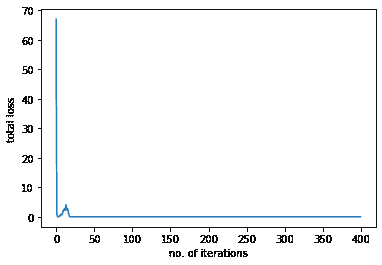

# 在 PyTorch 中训练多目标多重线性回归模型

> 原文：[`machinelearningmastery.com/training-a-multi-target-multilinear-regression-model-in-pytorch/`](https://machinelearningmastery.com/training-a-multi-target-multilinear-regression-model-in-pytorch/)

多目标多重线性回归模型是一种机器学习模型，它以单个或多个特征作为输入，以进行多个预测。在我们之前的文章中，我们讨论了如何使用多重线性回归进行简单预测并生成多个输出。在这里，我们将构建我们的模型并在数据集上进行训练。

在这篇文章中，我们将生成一个数据集，并定义我们的模型，包括优化器和损失函数。然后，我们将训练我们的模型并可视化训练过程的结果。特别是，我们将解释：

+   如何在 PyTorch 中训练多目标多重线性回归模型。

+   如何生成简单的数据集并将其输入到模型中。

+   如何使用 PyTorch 中的内置包构建模型。

+   如何使用小批量梯度下降法训练模型并可视化结果。

**启动你的项目**，请阅读我的书 [Deep Learning with PyTorch](https://machinelearningmastery.com/deep-learning-with-pytorch/)。它提供了**自学教程**和**可运行的代码**。

让我们开始吧！[](../Images/20dd0b8f625749a1ba6b7e6c17770e84.png)

在 PyTorch 中训练多目标多重线性回归模型。

图片来自 [drown_in_city](https://unsplash.com/photos/vQsjbfODtak)。保留所有权利。

## 概述

本教程分为四个部分，它们是

+   创建数据类

+   使用 `nn.Module` 构建模型

+   使用小批量梯度下降法进行训练

+   绘制进度图

## 创建数据类

我们需要数据来训练我们的模型。在 PyTorch 中，我们可以使用 `Dataset` 类。首先，我们将创建一个数据类，其中包括数据构造函数、返回数据样本的 `__getitem__()` 方法和允许我们检查数据长度的 `__len__()` 方法。我们在构造函数中基于线性模型生成数据。请注意，`torch.mm()` 用于**矩阵**乘法，张量的形状应设置为允许乘法。

```py
import torch
from torch.utils.data import Dataset, DataLoader
torch.manual_seed(42)

# Creating the dataset class
class Data(Dataset):
    # Constructor
    def __init__(self):
        self.x = torch.zeros(40, 2)
        self.x[:, 0] = torch.arange(-2, 2, 0.1)
        self.x[:, 1] = torch.arange(-2, 2, 0.1)
        w = torch.tensor([[1.0, 2.0], [2.0, 4.0]])
        b = 1
        func = torch.mm(self.x, w) + b    
        self.y = func + 0.2 * torch.randn((self.x.shape[0],1))
        self.len = self.x.shape[0]
    # Getter
    def __getitem__(self, idx):          
        return self.x[idx], self.y[idx] 
    # getting data length
    def __len__(self):
        return self.len
```

然后，我们可以创建用于训练的数据集对象。

```py
# Creating dataset object
data_set = Data()
```

### 想要开始使用 PyTorch 进行深度学习吗？

立即参加我的免费电子邮件速成课程（附带示例代码）。

点击注册并获得课程的免费 PDF 电子书版本。

## 使用 `nn.Module` 构建模型

PyTorch 的 `nn.Module` 包含了构建我们多重线性回归模型所需的所有方法和属性。这个包将帮助我们在系列的后续教程中构建更复杂的神经网络架构。

我们将使我们的模型类成为 `nn.Module` 包的子类，以便继承所有的功能。我们的模型将包括一个构造函数和一个 `forward()` 函数用于进行预测。

```py
...
# Creating a custom Multiple Linear Regression Model
class MultipleLinearRegression(torch.nn.Module):
    # Constructor
    def __init__(self, input_dim, output_dim):
        super(MultipleLinearRegression, self).__init__()
        self.linear = torch.nn.Linear(input_dim, output_dim)
    # Prediction
    def forward(self, x):
        y_pred = self.linear(x)
        return y_pred
```

由于我们需要处理多个输出，让我们创建一个具有两个输入和两个输出的模型对象。我们还将列出模型参数。

这是参数的样子，权重最初是随机化的。

```py
...
# Creating the model object
MLR_model = MultipleLinearRegression(2,2)
print("The parameters: ", list(MLR_model.parameters()))
```

以下是输出的样子。

```py
The parameters:  [Parameter containing:
tensor([[ 0.2236, -0.0123],
        [ 0.5534, -0.5024]], requires_grad=True), Parameter containing:
tensor([ 0.0445, -0.4826], requires_grad=True)]
```

我们将使用随机梯度下降来训练模型，学习率保持在 0.1。为了测量模型损失，我们将使用均方误差。

```py
# defining the model optimizer
optimizer = torch.optim.SGD(MLR_model.parameters(), lr=0.1)
# defining the loss criterion
criterion = torch.nn.MSELoss()
```

PyTorch 有一个 `DataLoader` 类，可以让我们将数据输入到模型中。这不仅允许我们加载数据，还可以实时应用各种转换。在开始训练之前，让我们定义我们的 dataloader 对象并定义批量大小。

```py
# Creating the dataloader
train_loader = DataLoader(dataset=data_set, batch_size=2)
```

**用我的书** [《深度学习与 PyTorch》](https://machinelearningmastery.com/deep-learning-with-pytorch/) **启动你的项目**。它提供了**自学教程**和**可运行的代码**。

## 使用小批量梯度下降训练

一切准备就绪后，我们可以创建训练循环来训练模型。我们创建一个空列表来存储模型损失，并训练模型 20 个轮次。

```py
# Train the model
losses = []
epochs = 20
for epoch in range(epochs):
    for x,y in train_loader:
        y_pred = MLR_model(x)
        loss = criterion(y_pred, y)
        losses.append(loss.item())
        optimizer.zero_grad()
        loss.backward()
        optimizer.step()   
    print(f"epoch = {epoch}, loss = {loss}")
print("Done training!")
```

如果你运行这个，你应该会看到类似以下的输出：

```py
epoch = 0, loss = 0.052659016102552414
epoch = 1, loss = 0.13005244731903076
epoch = 2, loss = 0.13508380949497223
epoch = 3, loss = 0.1353638768196106
epoch = 4, loss = 0.13537931442260742
epoch = 5, loss = 0.13537974655628204
epoch = 6, loss = 0.13537967205047607
epoch = 7, loss = 0.13538001477718353
epoch = 8, loss = 0.13537967205047607
epoch = 9, loss = 0.13537967205047607
epoch = 10, loss = 0.13538001477718353
epoch = 11, loss = 0.13537967205047607
epoch = 12, loss = 0.13537967205047607
epoch = 13, loss = 0.13538001477718353
epoch = 14, loss = 0.13537967205047607
epoch = 15, loss = 0.13537967205047607
epoch = 16, loss = 0.13538001477718353
epoch = 17, loss = 0.13537967205047607
epoch = 18, loss = 0.13537967205047607
epoch = 19, loss = 0.13538001477718353
Done training!
```

## 绘制进度

由于这是一个线性回归模型，训练应该很快。我们可以可视化模型损失在每个训练轮次后是如何减少的。

```py
import matplotlib.pyplot as plt

plt.plot(losses)
plt.xlabel("no. of iterations")
plt.ylabel("total loss")
plt.show()
```



将所有内容整合在一起，以下是完整的代码。

```py
import matplotlib.pyplot as plt
import torch
from torch.utils.data import Dataset, DataLoader
torch.manual_seed(42)

# Creating the dataset class
class Data(Dataset):
    # Constructor
    def __init__(self):
        self.x = torch.zeros(40, 2)
        self.x[:, 0] = torch.arange(-2, 2, 0.1)
        self.x[:, 1] = torch.arange(-2, 2, 0.1)
        w = torch.tensor([[1.0, 2.0], [2.0, 4.0]])
        b = 1
        func = torch.mm(self.x, w) + b    
        self.y = func + 0.2 * torch.randn((self.x.shape[0],1))
        self.len = self.x.shape[0]
    # Getter
    def __getitem__(self, idx):          
        return self.x[idx], self.y[idx] 
    # getting data length
    def __len__(self):
        return self.len

# Creating dataset object
data_set = Data()

# Creating a custom Multiple Linear Regression Model
class MultipleLinearRegression(torch.nn.Module):
    # Constructor
    def __init__(self, input_dim, output_dim):
        super(MultipleLinearRegression, self).__init__()
        self.linear = torch.nn.Linear(input_dim, output_dim)
    # Prediction
    def forward(self, x):
        y_pred = self.linear(x)
        return y_pred

# Creating the model object
MLR_model = MultipleLinearRegression(2,2)
print("The parameters: ", list(MLR_model.parameters()))

# defining the model optimizer
optimizer = torch.optim.SGD(MLR_model.parameters(), lr=0.1)
# defining the loss criterion
criterion = torch.nn.MSELoss()

# Creating the dataloader
train_loader = DataLoader(dataset=data_set, batch_size=2)

# Train the model
losses = []
epochs = 20
for epoch in range(epochs):
    for x,y in train_loader:
        y_pred = MLR_model(x)
        loss = criterion(y_pred, y)
        losses.append(loss.item())
        optimizer.zero_grad()
        loss.backward()
        optimizer.step()   
    print(f"epoch = {epoch}, loss = {loss}")
print("Done training!")

# Plot the losses
plt.plot(losses)
plt.xlabel("no. of iterations")
plt.ylabel("total loss")
plt.show()
```

## 总结

在本教程中，你学习了在 PyTorch 中训练多目标多线性回归模型所需的步骤。特别是，你学到了：

+   如何在 PyTorch 中训练多目标多线性回归模型。

+   如何生成一个简单的数据集并将其输入模型。

+   如何使用 PyTorch 内置的包构建模型。

+   如何使用小批量梯度下降训练模型并可视化结果。
