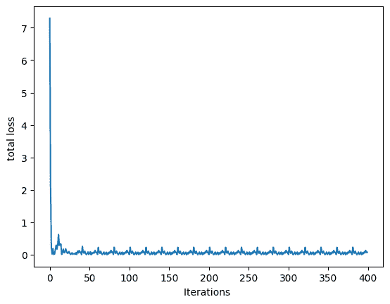

# 在 PyTorch 中训练单输出多元线性回归模型

> 原文：[`machinelearningmastery.com/training-a-single-output-multilinear-regression-model-in-pytorch/`](https://machinelearningmastery.com/training-a-single-output-multilinear-regression-model-in-pytorch/)

神经网络架构由数百个神经元构成，其中每个神经元接受多个输入，执行多元线性回归操作以进行预测。在之前的教程中，我们建立了一个单输出的多元线性回归模型，仅使用前向函数进行预测。

在本教程中，我们将向我们的单输出多元线性回归模型添加优化器，并执行反向传播以减少模型的损失。特别是，我们将演示：

+   如何在 PyTorch 中构建单输出多元线性回归模型。

+   如何利用 PyTorch 内置包创建复杂模型。

+   如何在 PyTorch 中使用小批量梯度下降训练单输出多元线性回归模型。

**启动你的项目**，请参阅我的书籍[《深度学习与 PyTorch》](https://machinelearningmastery.com/deep-learning-with-pytorch/)。它提供了**自学教程**和**实用代码**。

让我们开始吧。

在 PyTorch 中训练单输出多元线性回归模型。

图片由[布鲁诺·纳西门托](https://unsplash.com/photos/PHIgYUGQPvU)提供。版权所有。

## 概述

本教程分为三个部分，它们是

+   为预测准备数据

+   使用 `Linear` 类进行多元线性回归

+   可视化结果

## 构建数据集类

和之前的教程一样，我们将创建一个样本数据集来进行实验。我们的数据类包括一个数据集构造函数、一个获取数据样本的`__getitem__()`方法，以及一个获取创建数据长度的`__len__()`函数。它的样子如下。

```py
import torch
from torch.utils.data import Dataset

# Creating the dataset class
class Data(Dataset):
    # Constructor
    def __init__(self):
        self.x = torch.zeros(40, 2)
        self.x[:, 0] = torch.arange(-2, 2, 0.1)
        self.x[:, 1] = torch.arange(-2, 2, 0.1)
        self.w = torch.tensor([[1.0], [1.0]])
        self.b = 1
        self.func = torch.mm(self.x, self.w) + self.b    
        self.y = self.func + 0.2 * torch.randn((self.x.shape[0],1))
        self.len = self.x.shape[0]
    # Getter
    def __getitem__(self, index):          
        return self.x[index], self.y[index] 
    # getting data length
    def __len__(self):
        return self.len
```

有了这个，我们可以轻松创建数据集对象。

```py
# Creating dataset object
data_set = Data()
```

### 想要开始使用 PyTorch 进行深度学习？

现在就参加我的免费电子邮件速成课程（附样例代码）。

点击注册并获得免费的 PDF 电子书版本。

## 构建模型类

现在我们有了数据集，让我们构建一个自定义的多元线性回归模型类。如在之前的教程中所讨论的，我们定义一个类并将其作为 `nn.Module` 的子类。因此，该类继承了所有方法和属性。

```py
...
# Creating a custom Multiple Linear Regression Model
class MultipleLinearRegression(torch.nn.Module):
    # Constructor
    def __init__(self, input_dim, output_dim):
        super().__init__()
        self.linear = torch.nn.Linear(input_dim, output_dim)
    # Prediction
    def forward(self, x):
        y_pred = self.linear(x)
        return y_pred
```

我们将创建一个输入大小为 2 和输出大小为 1 的模型对象。此外，我们可以使用`parameters()`方法打印出所有模型参数。

```py
...
# Creating the model object
MLR_model = MultipleLinearRegression(2,1)
print("The parameters: ", list(MLR_model.parameters()))
```

这是输出的样子。

```py
The parameters:  [Parameter containing:
tensor([[ 0.2236, -0.0123]], requires_grad=True), Parameter containing:
tensor([0.5534], requires_grad=True)]
```

为了训练我们的多元线性回归模型，我们还需要定义优化器和损失标准。我们将使用随机梯度下降优化器和均方误差损失。学习率保持在 0.1。

```py
# defining the model optimizer
optimizer = torch.optim.SGD(MLR_model.parameters(), lr=0.1)
# defining the loss criterion
criterion = torch.nn.MSELoss()
```

## 使用小批量梯度下降训练模型

在开始训练过程之前，让我们将数据加载到`DataLoader`中，并定义训练的批次大小。

```py
from torch.utils.data import DataLoader

# Creating the dataloader
train_loader = DataLoader(dataset=data_set, batch_size=2)
```

我们将开始训练，并让过程持续 20 个周期，使用与我们之前教程相同的`for-loop`。

```py
# Train the model
Loss = []
epochs = 20
for epoch in range(epochs):
    for x,y in train_loader:
        y_pred = MLR_model(x)
        loss = criterion(y_pred, y)
        Loss.append(loss.item())
        optimizer.zero_grad()
        loss.backward()
        optimizer.step()   
    print(f"epoch = {epoch}, loss = {loss}")
print("Done training!")
```

在上面的训练循环中，每个周期都会报告损失。你应该会看到类似以下的输出：

```py
epoch = 0, loss = 0.06849382817745209
epoch = 1, loss = 0.07729718089103699
epoch = 2, loss = 0.0755983218550682
epoch = 3, loss = 0.07591515779495239
epoch = 4, loss = 0.07585576921701431
epoch = 5, loss = 0.07586675882339478
epoch = 6, loss = 0.07586495578289032
epoch = 7, loss = 0.07586520910263062
epoch = 8, loss = 0.07586534321308136
epoch = 9, loss = 0.07586508244276047
epoch = 10, loss = 0.07586508244276047
epoch = 11, loss = 0.07586508244276047
epoch = 12, loss = 0.07586508244276047
epoch = 13, loss = 0.07586508244276047
epoch = 14, loss = 0.07586508244276047
epoch = 15, loss = 0.07586508244276047
epoch = 16, loss = 0.07586508244276047
epoch = 17, loss = 0.07586508244276047
epoch = 18, loss = 0.07586508244276047
epoch = 19, loss = 0.07586508244276047
Done training!
```

这个训练循环在 PyTorch 中很典型。你将在未来的项目中频繁使用它。

## 绘制图表

最后，让我们绘制图表来可视化损失在训练过程中如何减少并收敛到某一点。

```py
...
import matplotlib.pyplot as plt

# Plot the graph for epochs and loss
plt.plot(Loss)
plt.xlabel("Iterations ")
plt.ylabel("total loss ")
plt.show()
```



训练过程中的损失

将所有内容汇总，以下是完整的代码。

```py
# Importing libraries and packages
import numpy as np
import torch
import matplotlib.pyplot as plt
from torch.utils.data import Dataset, DataLoader

torch.manual_seed(42)

# Creating the dataset class
class Data(Dataset):
    # Constructor
    def __init__(self):
        self.x = torch.zeros(40, 2)
        self.x[:, 0] = torch.arange(-2, 2, 0.1)
        self.x[:, 1] = torch.arange(-2, 2, 0.1)
        self.w = torch.tensor([[1.0], [1.0]])
        self.b = 1
        self.func = torch.mm(self.x, self.w) + self.b    
        self.y = self.func + 0.2 * torch.randn((self.x.shape[0],1))
        self.len = self.x.shape[0]
    # Getter
    def __getitem__(self, index):          
        return self.x[index], self.y[index] 
    # getting data length
    def __len__(self):
        return self.len

# Creating dataset object
data_set = Data()

# Creating a custom Multiple Linear Regression Model
class MultipleLinearRegression(torch.nn.Module):
    # Constructor
    def __init__(self, input_dim, output_dim):
        super().__init__()
        self.linear = torch.nn.Linear(input_dim, output_dim)
    # Prediction
    def forward(self, x):
        y_pred = self.linear(x)
        return y_pred

# Creating the model object
MLR_model = MultipleLinearRegression(2,1)
# defining the model optimizer
optimizer = torch.optim.SGD(MLR_model.parameters(), lr=0.1)
# defining the loss criterion
criterion = torch.nn.MSELoss()
# Creating the dataloader
train_loader = DataLoader(dataset=data_set, batch_size=2)

# Train the model
Loss = []
epochs = 20
for epoch in range(epochs):
    for x,y in train_loader:
        y_pred = MLR_model(x)
        loss = criterion(y_pred, y)
        Loss.append(loss.item())
        optimizer.zero_grad()
        loss.backward()
        optimizer.step()   
    print(f"epoch = {epoch}, loss = {loss}")
print("Done training!")

# Plot the graph for epochs and loss
plt.plot(Loss)
plt.xlabel("Iterations ")
plt.ylabel("total loss ")
plt.show()
```

## 总结

在本教程中，你学会了如何在 PyTorch 中构建一个单输出的多元线性回归模型。特别是，你学到了：

+   如何在 PyTorch 中构建一个单输出的多元线性回归模型。

+   如何使用 PyTorch 内置的包来创建复杂的模型。

+   如何使用迷你批量梯度下降在 PyTorch 中训练单输出的多元线性回归模型。
