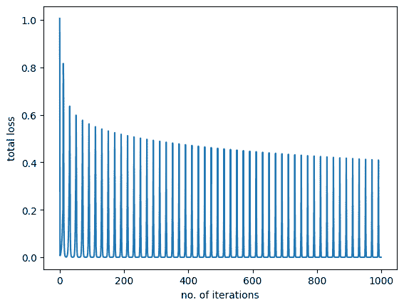

# 在 PyTorch 中使用交叉熵损失训练逻辑回归

> 原文：[`machinelearningmastery.com/training-logistic-regression-with-cross-entropy-loss-in-pytorch/`](https://machinelearningmastery.com/training-logistic-regression-with-cross-entropy-loss-in-pytorch/)

在我们 PyTorch 系列的上一节中，我们演示了初始化不良的权重如何影响分类模型的准确性，尤其是当使用均方误差（MSE）损失时。我们注意到模型在训练过程中没有收敛，其准确性也显著下降。

接下来，你将看到如果随机初始化权重并使用交叉熵作为模型训练的损失函数会发生什么。这个损失函数更适合逻辑回归和其他分类问题。因此，今天大多数分类问题都使用交叉熵损失。

在本教程中，你将使用交叉熵损失训练逻辑回归模型，并对测试数据进行预测。特别地，你将学习：

+   如何在 PyTorch 中使用交叉熵损失训练逻辑回归模型。

+   交叉熵损失如何影响模型准确性。

**通过我的书籍[《用 PyTorch 进行深度学习》](https://machinelearningmastery.com/deep-learning-with-pytorch/)来** **启动你的项目**。这本书提供了**自学教程**和**示例代码**。

开始吧。

在 PyTorch 中使用交叉熵损失训练逻辑回归。

图片来源：[Y K](https://unsplash.com/photos/qD2BYEkp3ns)。保留部分权利。

## 概述

本教程分为三个部分；它们是：

+   数据准备与模型构建

+   使用交叉熵的模型训练

+   使用测试数据验证

## 数据准备与模型

就像之前的教程一样，你将构建一个类来获取数据集以进行实验。这个数据集将被拆分成训练样本和测试样本。测试样本是用于测量训练模型性能的未见数据。

首先，我们创建一个`Dataset`类：

```py
import torch
from torch.utils.data import Dataset

# Creating the dataset class
class Data(Dataset):
    # Constructor
    def __init__(self):
        self.x = torch.arange(-2, 2, 0.1).view(-1, 1)
        self.y = torch.zeros(self.x.shape[0], 1)
        self.y[self.x[:, 0] > 0.2] = 1
        self.len = self.x.shape[0]
    # Getter
    def __getitem__(self, idx):          
        return self.x[idx], self.y[idx] 
    # getting data length
    def __len__(self):
        return self.len
```

然后，实例化数据集对象。

```py
# Creating dataset object
data_set = Data()
```

接下来，你将为我们的逻辑回归模型构建一个自定义模块。它将基于 PyTorch 的`nn.Module`中的属性和方法。这个包允许我们为深度学习模型构建复杂的自定义模块，并使整个过程变得更简单。

该模块只包含一个线性层，如下所示：

```py
# build custom module for logistic regression
class LogisticRegression(torch.nn.Module):    
    # build the constructor
    def __init__(self, n_inputs):
        super().__init__()
        self.linear = torch.nn.Linear(n_inputs, 1)
    # make predictions
    def forward(self, x):
        y_pred = torch.sigmoid(self.linear(x))
        return y_pred
```

让我们创建模型对象。

```py
log_regr = LogisticRegression(1)
```

该模型应具有随机初始化的权重。你可以通过打印其状态来检查这一点：

```py
print("checking parameters: ", log_regr.state_dict())
```

你可能会看到：

```py
checking parameters:  OrderedDict([('linear.weight', tensor([[-0.0075]])), ('linear.bias', tensor([0.5364]))])
```

### 想开始使用 PyTorch 进行深度学习吗？

现在就参加我的免费电子邮件速成课程（包含示例代码）。

点击注册并获得课程的免费 PDF 电子书版。

## 使用交叉熵的模型训练

回想一下，当你在上一教程中使用这些参数值和 MSE 损失时，这个模型没有收敛。我们来看一下使用交叉熵损失时会发生什么。

由于你正在进行具有一个输出的逻辑回归，这是一个具有两个类别的分类问题。换句话说，这是一个二分类问题，因此我们使用二元交叉熵。你设置优化器和损失函数如下。

```py
...
optimizer = torch.optim.SGD(log_regr.parameters(), lr=2)
# binary cross-entropy
criterion = torch.nn.BCELoss()
```

接下来，我们准备一个`DataLoader`并将模型训练 50 个周期。

```py
# load data into the dataloader
train_loader = DataLoader(dataset=data_set, batch_size=2)
# Train the model
Loss = []
epochs = 50
for epoch in range(epochs):
    for x,y in train_loader:
        y_pred = log_regr(x)
        loss = criterion(y_pred, y)
        Loss.append(loss.item())
        optimizer.zero_grad()
        loss.backward()
        optimizer.step()   
    print(f"epoch = {epoch}, loss = {loss}")
print("Done!")
```

训练期间的输出会像下面这样：

```py
checking weights:  OrderedDict([('linear.weight', tensor([[-5.]])), ('linear.bias', tensor([-10.]))])
```

如你所见，损失在训练过程中减少并收敛到最低值。我们也来绘制一下训练图表。

```py
import matplotlib.pyplot as plt

plt.plot(Loss)
plt.xlabel("no. of iterations")
plt.ylabel("total loss")
plt.show()
```

你将看到以下内容：

## 使用测试数据验证

上述图表显示模型在训练数据上表现良好。最后，让我们检查一下模型在未见数据上的表现。

```py
# get the model predictions on test data
y_pred = log_regr(data_set.x)
label = y_pred > 0.5 # setting the threshold between zero and one.
print("model accuracy on test data: ",
      torch.mean((label == data_set.y.type(torch.ByteTensor)).type(torch.float)))
```

这给出了

```py
model accuracy on test data:  tensor(1.)
```

当模型在均方误差（MSE）损失上训练时，它的表现不佳。之前的准确率大约是 57%。但在这里，我们得到了完美的预测。这部分是因为模型简单，是一个单变量逻辑函数。部分是因为我们正确设置了训练。因此，交叉熵损失显著提高了模型在实验中表现的准确性，相比于 MSE 损失。

将所有内容放在一起，以下是完整的代码：

```py
import matplotlib.pyplot as plt 
import torch
from torch.utils.data import Dataset, DataLoader
torch.manual_seed(0)

# Creating the dataset class
class Data(Dataset):
    def __init__(self):
        self.x = torch.arange(-2, 2, 0.1).view(-1, 1)
        self.y = torch.zeros(self.x.shape[0], 1)
        self.y[self.x[:, 0] > 0.2] = 1
        self.len = self.x.shape[0]

    def __getitem__(self, idx):          
        return self.x[idx], self.y[idx] 

    def __len__(self):
        return self.len

# building dataset object
data_set = Data()

# build custom module for logistic regression
class LogisticRegression(torch.nn.Module):    
    # build the constructor
    def __init__(self, n_inputs):
        super().__init__()
        self.linear = torch.nn.Linear(n_inputs, 1)
    # make predictions
    def forward(self, x):
        y_pred = torch.sigmoid(self.linear(x))
        return y_pred

log_regr = LogisticRegression(1)
print("checking parameters: ", log_regr.state_dict())

optimizer = torch.optim.SGD(log_regr.parameters(), lr=2)
# binary cross-entropy
criterion = torch.nn.BCELoss()

# load data into the dataloader
train_loader = DataLoader(dataset=data_set, batch_size=2)
# Train the model
Loss = []
epochs = 50
for epoch in range(epochs):
    for x,y in train_loader:
        y_pred = log_regr(x)
        loss = criterion(y_pred, y)
        Loss.append(loss.item())
        optimizer.zero_grad()
        loss.backward()
        optimizer.step()   
    print(f"epoch = {epoch}, loss = {loss}")
print("Done!")

plt.plot(Loss)
plt.xlabel("no. of iterations")
plt.ylabel("total loss")
plt.show()

# get the model predictions on test data
y_pred = log_regr(data_set.x)
label = y_pred > 0.5 # setting the threshold between zero and one.
print("model accuracy on test data: ",
      torch.mean((label == data_set.y.type(torch.ByteTensor)).type(torch.float)))
```

## 总结

在本教程中，你了解了交叉熵损失如何影响分类模型的性能。特别是，你学习了：

+   如何在 Pytorch 中使用交叉熵损失训练逻辑回归模型。

+   交叉熵损失如何影响模型准确性。
