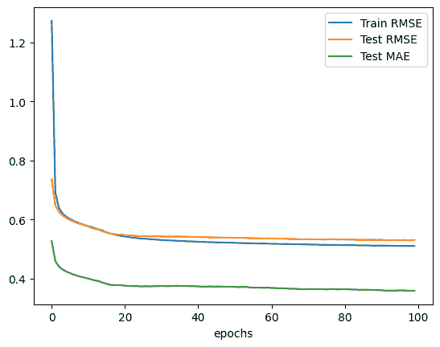

# 通过可视化指标了解训练期间的模型行为

> 原文：[`machinelearningmastery.com/understand-model-behavior-during-training-by-visualizing-metrics/`](https://machinelearningmastery.com/understand-model-behavior-during-training-by-visualizing-metrics/)

通过观察神经网络和深度学习模型在训练期间的性能变化，您可以学到很多。例如，如果您发现训练精度随着训练轮数变差，您就知道优化存在问题。可能是学习率过快。在本文中，您将了解如何在训练过程中查看和可视化 PyTorch 模型的性能。完成本文后，您将了解：

+   在训练期间收集哪些指标

+   如何绘制训练和验证数据集上的指标

+   如何解释图表以了解模型和训练进展

**启动您的项目**，使用我的书籍[《使用 PyTorch 进行深度学习》](https://machinelearningmastery.com/deep-learning-with-pytorch/)。它提供了**自学教程**和**可工作代码**。

让我们开始吧！[](../Images/b2859a3ed041bcffaae754c3450932ce.png)

通过可视化指标了解训练期间的模型行为

照片由[Alison Pang](https://unsplash.com/photos/bnEgE5Aigns)提供。部分权利保留。

## 概述

这一章分为两部分；它们是：

+   从训练循环中收集指标

+   绘制训练历史

## 从训练循环中收集指标

在深度学习中，使用梯度下降算法训练模型意味着进行前向传递，使用模型和损失函数推断输入的损失指标，然后进行反向传递以计算从损失指标得出的梯度，并且更新过程应用梯度以更新模型参数。虽然这些是你必须采取的基本步骤，但你可以在整个过程中做更多事情来收集额外的信息。

正确训练的模型应该期望损失指标减少，因为损失是要优化的目标。应该根据问题使用的损失指标来决定。

对于回归问题，模型预测与实际值越接近越好。因此，您希望跟踪均方误差（MSE）、有时是均方根误差（RMSE）、平均绝对误差（MAE）或平均绝对百分比误差（MAPE）。虽然这些不被用作损失指标，但您可能还对模型产生的最大误差感兴趣。

对于分类问题，通常损失指标是交叉熵。但是交叉熵的值并不直观。因此，您可能还希望跟踪预测准确率、真正例率、精确度、召回率、F1 分数等。

从训练循环中收集这些指标是微不足道的。让我们从使用 PyTorch 和加利福尼亚房屋数据集的基本回归示例开始：

```py
import torch
import torch.nn as nn
import torch.optim as optim
from sklearn.datasets import fetch_california_housing
from sklearn.model_selection import train_test_split
from sklearn.preprocessing import StandardScaler

# Read data
data = fetch_california_housing()
X, y = data.data, data.target

# train-test split for model evaluation
X_train_raw, X_test_raw, y_train, y_test = train_test_split(X, y, train_size=0.7, shuffle=True)

# Standardizing data
scaler = StandardScaler()
scaler.fit(X_train_raw)
X_train = scaler.transform(X_train_raw)
X_test = scaler.transform(X_test_raw)

# Convert to 2D PyTorch tensors
X_train = torch.tensor(X_train, dtype=torch.float32)
y_train = torch.tensor(y_train, dtype=torch.float32).reshape(-1, 1)
X_test = torch.tensor(X_test, dtype=torch.float32)
y_test = torch.tensor(y_test, dtype=torch.float32).reshape(-1, 1)

# Define the model
model = nn.Sequential(
    nn.Linear(8, 24),
    nn.ReLU(),
    nn.Linear(24, 12),
    nn.ReLU(),
    nn.Linear(12, 6),
    nn.ReLU(),
    nn.Linear(6, 1)
)

# loss function and optimizer
loss_fn = nn.MSELoss()  # mean square error
optimizer = optim.Adam(model.parameters(), lr=0.001)

n_epochs = 100   # number of epochs to run
batch_size = 32  # size of each batch
batch_start = torch.arange(0, len(X_train), batch_size)

for epoch in range(n_epochs):
    for start in batch_start:
        # take a batch
        X_batch = X_train[start:start+batch_size]
        y_batch = y_train[start:start+batch_size]
        # forward pass
        y_pred = model(X_batch)
        loss = loss_fn(y_pred, y_batch)
        # backward pass
        optimizer.zero_grad()
        loss.backward()
        # update weights
        optimizer.step()
```

此实现方法虽然原始，但在过程中你得到了每一步的`loss`作为张量，这为优化器提供了改进模型的提示。要了解训练的进展，当然可以在每一步打印这个损失度量。但你也可以保存这个值，这样稍后可以进行可视化。在这样做时，请注意不要保存张量，而只保存它的值。这是因为这里的 PyTorch 张量记得它是如何得到它的值的，所以可以进行自动微分。这些额外的数据占用了内存，但你并不需要它们。

因此，你可以修改训练循环如下：

```py
mse_history = []

for epoch in range(n_epochs):
    for start in batch_start:
        # take a batch
        X_batch = X_train[start:start+batch_size]
        y_batch = y_train[start:start+batch_size]
        # forward pass
        y_pred = model(X_batch)
        loss = loss_fn(y_pred, y_batch)
        mse_history.append(float(loss))
        # backward pass
        optimizer.zero_grad()
        loss.backward()
        # update weights
        optimizer.step()
```

在训练模型时，你应该使用与训练集分离的测试集来评估它。通常在一个时期内进行一次，即在该时期的所有训练步骤之后。测试结果也可以保存以便稍后进行可视化。事实上，如果需要，你可以从测试集获得多个指标。因此，你可以添加到训练循环中如下：

```py
mae_fn = nn.L1Loss()  # create a function to compute MAE
train_mse_history = []
test_mse_history = []
test_mae_history = []

for epoch in range(n_epochs):
    model.train()
    for start in batch_start:
        # take a batch
        X_batch = X_train[start:start+batch_size]
        y_batch = y_train[start:start+batch_size]
        # forward pass
        y_pred = model(X_batch)
        loss = loss_fn(y_pred, y_batch)
        train_mse_history.append(float(loss))
        # backward pass
        optimizer.zero_grad()
        loss.backward()
        # update weights
        optimizer.step()
    # validate model on test set
    model.eval()
    with torch.no_grad():
        y_pred = model(X_test)
        mse = loss_fn(y_pred, y_test)
        mae = mae_fn(y_pred, y_test)
        test_mse_history.append(float(mse))
        test_mae_history.append(float(mae))
```

你可以定义自己的函数来计算指标，或者使用已经在 PyTorch 库中实现的函数。在评估时将模型切换到评估模式是一个好习惯。在`no_grad()`上下文中运行评估也是一个好习惯，这样你明确告诉 PyTorch 你没有打算在张量上运行自动微分。

然而，上述代码存在问题：训练集的 MSE 是基于一个批次计算一次训练步骤，而测试集的指标是基于整个测试集每个时期计算一次。它们不是直接可比较的。事实上，如果你查看训练步骤的 MSE，你会发现它**非常嘈杂**。更好的方法是将同一时期的 MSE 总结为一个数字（例如，它们的平均值），这样你可以与测试集的数据进行比较。

进行这些更改后，以下是完整的代码：

```py
import torch
import torch.nn as nn
import torch.optim as optim
from sklearn.datasets import fetch_california_housing
from sklearn.model_selection import train_test_split
from sklearn.preprocessing import StandardScaler

# Read data
data = fetch_california_housing()
X, y = data.data, data.target

# train-test split for model evaluation
X_train_raw, X_test_raw, y_train, y_test = train_test_split(X, y, train_size=0.7, shuffle=True)

# Standardizing data
scaler = StandardScaler()
scaler.fit(X_train_raw)
X_train = scaler.transform(X_train_raw)
X_test = scaler.transform(X_test_raw)

# Convert to 2D PyTorch tensors
X_train = torch.tensor(X_train, dtype=torch.float32)
y_train = torch.tensor(y_train, dtype=torch.float32).reshape(-1, 1)
X_test = torch.tensor(X_test, dtype=torch.float32)
y_test = torch.tensor(y_test, dtype=torch.float32).reshape(-1, 1)

# Define the model
model = nn.Sequential(
    nn.Linear(8, 24),
    nn.ReLU(),
    nn.Linear(24, 12),
    nn.ReLU(),
    nn.Linear(12, 6),
    nn.ReLU(),
    nn.Linear(6, 1)
)

# loss function, metrics, and optimizer
loss_fn = nn.MSELoss()  # mean square error
mae_fn = nn.L1Loss()  # mean absolute error
optimizer = optim.Adam(model.parameters(), lr=0.001)

n_epochs = 100   # number of epochs to run
batch_size = 32  # size of each batch
batch_start = torch.arange(0, len(X_train), batch_size)

train_mse_history = []
test_mse_history = []
test_mae_history = []

for epoch in range(n_epochs):
    model.train()
    epoch_mse = []
    for start in batch_start:
        # take a batch
        X_batch = X_train[start:start+batch_size]
        y_batch = y_train[start:start+batch_size]
        # forward pass
        y_pred = model(X_batch)
        loss = loss_fn(y_pred, y_batch)
        epoch_mse.append(float(loss))
        # backward pass
        optimizer.zero_grad()
        loss.backward()
        # update weights
        optimizer.step()
    mean_mse = sum(epoch_mse) / len(epoch_mse)
    train_mse_history.append(mean_mse)
    # validate model on test set
    model.eval()
    with torch.no_grad():
        y_pred = model(X_test)
        mse = loss_fn(y_pred, y_test)
        mae = mae_fn(y_pred, y_test)
        test_mse_history.append(float(mse))
        test_mae_history.append(float(mae))
```

### 想要开始使用 PyTorch 进行深度学习吗？

现在就参加我的免费电子邮件速成课程（附带示例代码）。

点击注册并获取课程的免费 PDF 电子书版本。

## 绘制训练历史

在上面的代码中，你在 Python 列表中收集了每个时期的指标。因此，使用 matplotlib 将它们绘制成折线图是很简单的。下面是一个示例：

```py
import matplotlib.pyplot as plt
import numpy as np

plt.plot(np.sqrt(train_mse_history), label="Train RMSE")
plt.plot(np.sqrt(test_mse_history), label="Test RMSE")
plt.plot(test_mae_history, label="Test MAE")
plt.xlabel("epochs")
plt.legend()
plt.show()
```

它绘制了例如以下内容：

这样的图表可以提供关于模型训练的有用信息，例如：

+   它在时期间的收敛速度（斜率）

+   模型是否已经收敛（线的平台期）

+   模型是否在过度学习训练数据（验证线的拐点）

在如上回归示例中，如果模型变得更好，MAE 和 MSE 指标应该都下降。然而，在分类示例中，准确率指标应该增加，而交叉熵损失应该随着更多训练的进行而减少。这是你在图中期望看到的结果。

这些曲线最终应该平稳，意味着你无法根据当前数据集、模型设计和算法进一步改进模型。你希望这一点尽快发生，以便你的模型**收敛**更快，使训练更高效。你还希望指标在高准确率或低损失区域平稳，以便模型在预测中有效。

另一个需要关注的属性是训练和验证的指标差异。在上图中，你看到训练集的 RMSE 在开始时高于测试集的 RMSE，但很快曲线交叉，最后测试集的 RMSE 更高。这是预期的，因为最终模型会更好地拟合训练集，但测试集可以预测模型在未来未见数据上的表现。

你需要谨慎地在微观尺度上解释曲线或指标。在上图中，你会看到训练集的 RMSE 在第 0 轮时与测试集的 RMSE 相比极大。它们的差异可能并不那么显著，但由于你在第一个训练轮次中通过计算每个步骤的 MSE 收集了训练集的 RMSE，你的模型可能在前几个步骤表现不好，但在训练轮次的最后几个步骤表现更好。在所有步骤上取平均可能不是一个公平的比较，因为测试集的 MSE 基于最后一步后的模型。

如果你看到训练集的指标远好于测试集，那么你的模型是**过拟合**的。这可能提示你应该在较早的训练轮次停止训练，或者模型设计需要一些正则化，例如 dropout 层。

在上图中，虽然你收集了回归问题的均方误差（MSE），但你绘制的是均方根误差（RMSE），以便你可以与均值绝对误差（MAE）在相同的尺度上进行比较。你可能还应该收集训练集的 MAE。这两个 MAE 曲线应该与 RMSE 曲线的行为类似。

将所有内容汇总，以下是完整的代码：

```py
import matplotlib.pyplot as plt
import numpy as np
import torch
import torch.nn as nn
import torch.optim as optim
from sklearn.datasets import fetch_california_housing
from sklearn.model_selection import train_test_split
from sklearn.preprocessing import StandardScaler

# Read data
data = fetch_california_housing()
X, y = data.data, data.target

# train-test split for model evaluation
X_train_raw, X_test_raw, y_train, y_test = train_test_split(X, y, train_size=0.7, shuffle=True)

# Standardizing data
scaler = StandardScaler()
scaler.fit(X_train_raw)
X_train = scaler.transform(X_train_raw)
X_test = scaler.transform(X_test_raw)

# Convert to 2D PyTorch tensors
X_train = torch.tensor(X_train, dtype=torch.float32)
y_train = torch.tensor(y_train, dtype=torch.float32).reshape(-1, 1)
X_test = torch.tensor(X_test, dtype=torch.float32)
y_test = torch.tensor(y_test, dtype=torch.float32).reshape(-1, 1)

# Define the model
model = nn.Sequential(
    nn.Linear(8, 24),
    nn.ReLU(),
    nn.Linear(24, 12),
    nn.ReLU(),
    nn.Linear(12, 6),
    nn.ReLU(),
    nn.Linear(6, 1)
)

# loss function, metrics, and optimizer
loss_fn = nn.MSELoss()  # mean square error
mae_fn = nn.L1Loss()  # mean absolute error
optimizer = optim.Adam(model.parameters(), lr=0.001)

n_epochs = 100   # number of epochs to run
batch_size = 32  # size of each batch
batch_start = torch.arange(0, len(X_train), batch_size)

train_mse_history = []
test_mse_history = []
test_mae_history = []

for epoch in range(n_epochs):
    model.train()
    epoch_mse = []
    for start in batch_start:
        # take a batch
        X_batch = X_train[start:start+batch_size]
        y_batch = y_train[start:start+batch_size]
        # forward pass
        y_pred = model(X_batch)
        loss = loss_fn(y_pred, y_batch)
        epoch_mse.append(float(loss))
        # backward pass
        optimizer.zero_grad()
        loss.backward()
        # update weights
        optimizer.step()
    mean_mse = sum(epoch_mse) / len(epoch_mse)
    train_mse_history.append(mean_mse)
    # validate model on test set
    model.eval()
    with torch.no_grad():
        y_pred = model(X_test)
        mse = loss_fn(y_pred, y_test)
        mae = mae_fn(y_pred, y_test)
        test_mse_history.append(float(mse))
        test_mae_history.append(float(mae))

plt.plot(np.sqrt(train_mse_history), label="Train RMSE")
plt.plot(np.sqrt(test_mse_history), label="Test RMSE")
plt.plot(test_mae_history, label="Test MAE")
plt.xlabel("epochs")
plt.legend()
plt.show()
```

## 进一步阅读

本节提供了更多资源，供你深入了解该主题。

### APIs

+   [nn.L1Loss](https://pytorch.org/docs/stable/generated/torch.nn.L1Loss.html) 来自 PyTorch 文档

+   [nn.MSELoss](https://pytorch.org/docs/stable/generated/torch.nn.MSELoss.html) 来自 PyTorch 文档

## 总结

在本章中，你发现了在训练深度学习模型时收集和审查指标的重要性。你学到了：

+   模型训练过程中应关注哪些指标

+   如何在 PyTorch 训练循环中计算和收集指标

+   如何从训练循环中可视化指标

+   如何解读指标以推断有关训练经验的详细信息
