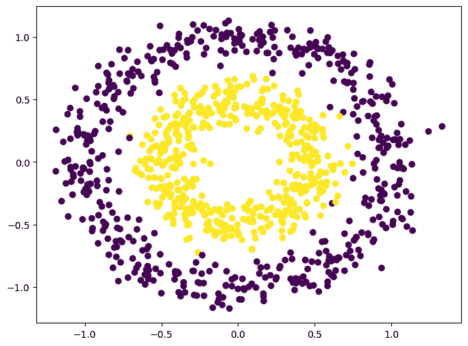
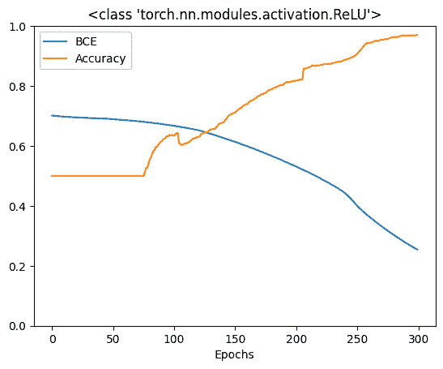
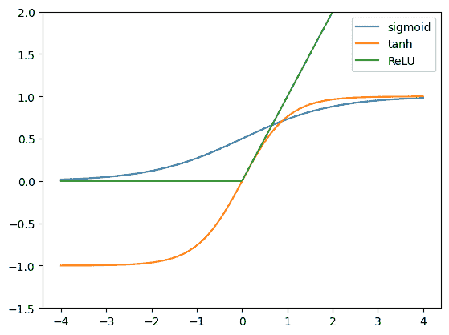
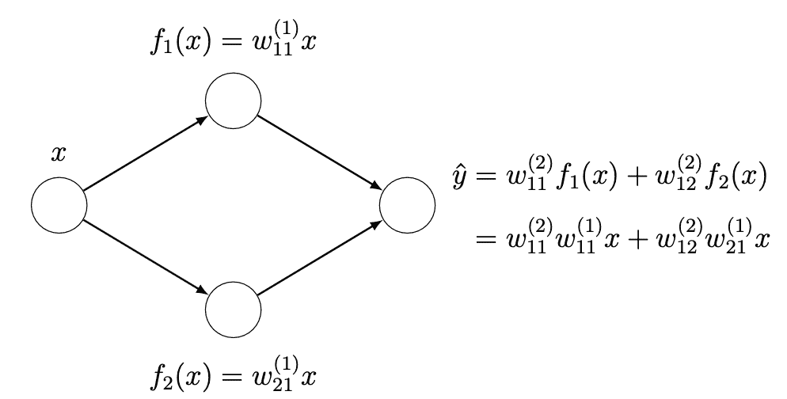
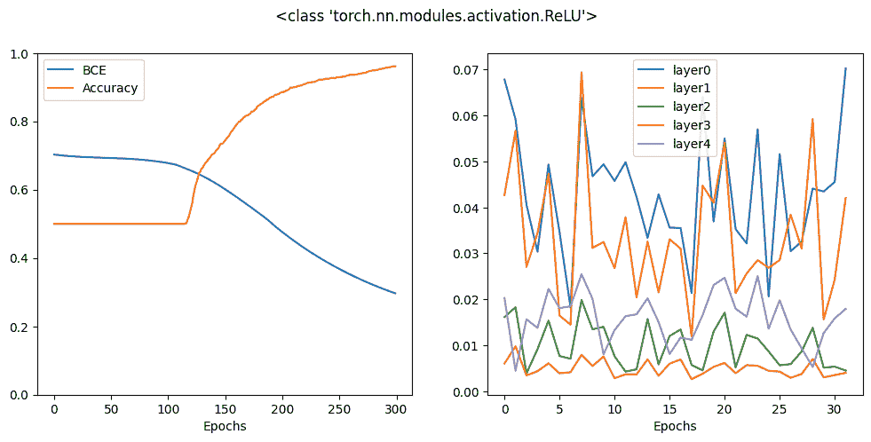
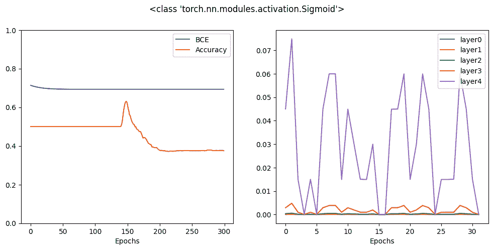
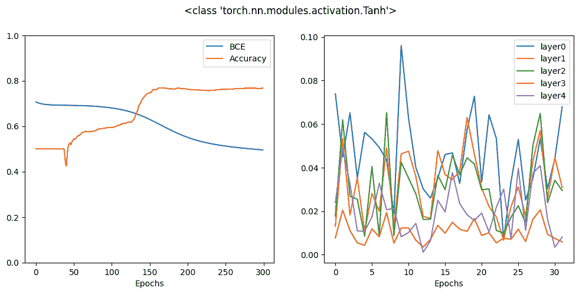
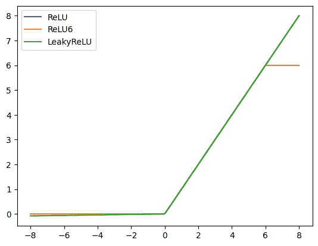
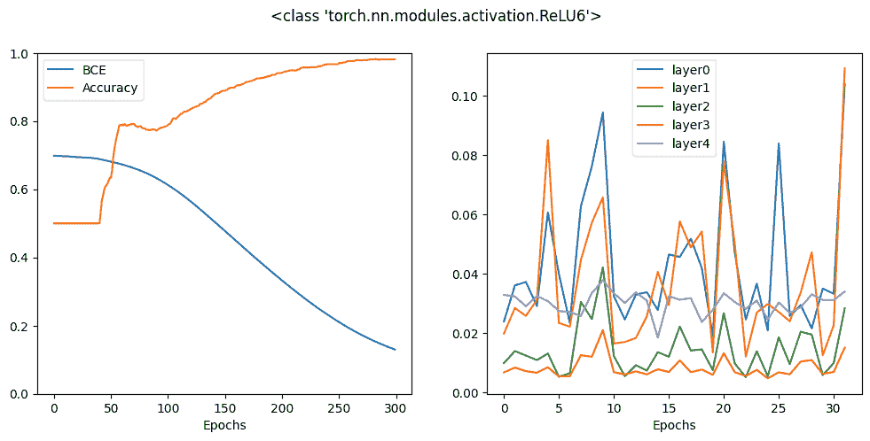
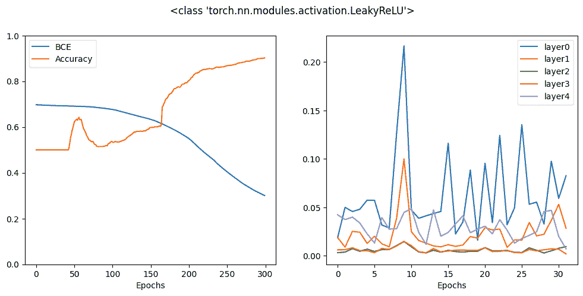

# 在深度学习模型中使用激活函数

> 原文：[`machinelearningmastery.com/using-activation-functions-in-deep-learning-models/`](https://machinelearningmastery.com/using-activation-functions-in-deep-learning-models/)

最简单形式的深度学习模型是层叠的感知机。如果没有激活函数，它们只是矩阵乘法，无论有多少层，其功能都很有限。激活函数的神奇之处在于神经网络能够近似各种非线性函数。在 PyTorch 中，有许多激活函数可以用于你的深度学习模型。在这篇文章中，你将看到激活函数的选择如何影响模型。具体来说，

+   常见的激活函数有哪些

+   激活函数的性质是什么

+   不同激活函数对学习率的影响

+   激活函数的选择如何解决梯度消失问题

**通过我的书** [《深度学习与 PyTorch》](https://machinelearningmastery.com/deep-learning-with-pytorch/) **启动你的项目**。它提供了 **自学教程** 和 **有效代码**。

让我们开始吧！

在深度学习模型中使用激活函数

图片由 [SHUJA OFFICIAL](https://unsplash.com/photos/JVCozvGeKNs) 提供。保留所有权利。

## 概述

本文分为三个部分；它们是

+   二元分类的玩具模型

+   为什么需要非线性函数？

+   激活函数的作用

## 二元分类的玩具模型

让我们从一个简单的二元分类示例开始。这里你将使用 `make_circle()` 函数从 scikit-learn 创建一个用于二元分类的合成数据集。该数据集有两个特征：点的 x 和 y 坐标。每个点属于两个类别之一。你可以生成 1000 个数据点并将其可视化如下：

```py
from sklearn.datasets import make_circles
import matplotlib.pyplot as plt
import torch
import torch.nn as nn
import torch.optim as optim

# Make data: Two circles on x-y plane as a classification problem
X, y = make_circles(n_samples=1000, factor=0.5, noise=0.1)
X = torch.tensor(X, dtype=torch.float32)
y = torch.tensor(y.reshape(-1, 1), dtype=torch.float32)

plt.figure(figsize=(8,6))
plt.scatter(X[:,0], X[:,1], c=y)
plt.show()
```

数据集的可视化如下：

这个数据集很特别，因为它简单但不可线性分离：不可能找到一条直线来分隔两个类别。如何让你的神经网络识别出两个类别之间的圆形边界是一个挑战。

让我们为这个问题创建一个深度学习模型。为了简化起见，你不进行交叉验证。你可能会发现神经网络对数据过拟合，但这不会影响下面的讨论。该模型有 4 个隐藏层，输出层为二元分类提供一个 sigmoid 值（0 到 1）。模型在构造函数中接受一个参数来指定在隐藏层中使用的激活函数。你将训练循环实现为一个函数，因为你会运行这个函数多次。

实现如下：

```py
class Model(nn.Module):
    def __init__(self, activation=nn.ReLU):
        super().__init__()
        self.layer0 = nn.Linear(2,5)
        self.act0 = activation()
        self.layer1 = nn.Linear(5,5)
        self.act1 = activation()
        self.layer2 = nn.Linear(5,5)
        self.act2 = activation()
        self.layer3 = nn.Linear(5,5)
        self.act3 = activation()
        self.layer4 = nn.Linear(5,1)
        self.act4 = nn.Sigmoid()

    def forward(self, x):
        x = self.act0(self.layer0(x))
        x = self.act1(self.layer1(x))
        x = self.act2(self.layer2(x))
        x = self.act3(self.layer3(x))
        x = self.act4(self.layer4(x))
        return x

def train_loop(model, X, y, n_epochs=300, batch_size=32):
    loss_fn = nn.BCELoss()
    optimizer = optim.Adam(model.parameters(), lr=0.0001)
    batch_start = torch.arange(0, len(X), batch_size)

    bce_hist = []
    acc_hist = []

    for epoch in range(n_epochs):
        # train model with optimizer
        model.train()
        for start in batch_start:
            X_batch = X[start:start+batch_size]
            y_batch = y[start:start+batch_size]
            y_pred = model(X_batch)
            loss = loss_fn(y_pred, y_batch)
            optimizer.zero_grad()
            loss.backward()
            optimizer.step()
        # evaluate BCE and accuracy at end of each epoch
        model.eval()
        with torch.no_grad():
            y_pred = model(X)
            bce = float(loss_fn(y_pred, y))
            acc = float((y_pred.round() == y).float().mean())
        bce_hist.append(bce)
        acc_hist.append(acc)
        # print metrics every 10 epochs
        if (epoch+1) % 10 == 0:
            print("Before epoch %d: BCE=%.4f, Accuracy=%.2f%%" % (epoch+1, bce, acc*100))
    return bce_hist, acc_hist
```

在每次训练周期结束时，你会使用整个数据集来评估模型。训练完成后会返回评估结果。接下来，你将创建一个模型，训练它，并绘制训练历史。你使用的激活函数是**修正线性单元**或 ReLU，这是目前最常见的激活函数：

```py
activation = nn.ReLU
model = Model(activation=activation)
bce_hist, acc_hist = train_loop(model, X, y)
plt.plot(bce_hist, label="BCE")
plt.plot(acc_hist, label="Accuracy")
plt.xlabel("Epochs")
plt.ylim(0, 1)
plt.title(str(activation))
plt.legend()
plt.show()
```

运行这个会给你以下结果：

```py
Before epoch 10: BCE=0.7025, Accuracy=50.00%
Before epoch 20: BCE=0.6990, Accuracy=50.00%
Before epoch 30: BCE=0.6959, Accuracy=50.00%
...
Before epoch 280: BCE=0.3051, Accuracy=96.30%
Before epoch 290: BCE=0.2785, Accuracy=96.90%
Before epoch 300: BCE=0.2543, Accuracy=97.00%
```

以及这个图：

这个模型表现很好。经过 300 个周期后，它可以达到 90% 的准确率。然而，ReLU 并不是唯一的激活函数。从历史上看，sigmoid 函数和双曲正切函数在神经网络文献中很常见。如果你感兴趣，下面是如何使用 matplotlib 比较这三种激活函数：

```py
x = torch.linspace(-4, 4, 200)
relu = nn.ReLU()(x)
tanh = nn.Tanh()(x)
sigmoid = nn.Sigmoid()(x)

plt.plot(x, sigmoid, label="sigmoid")
plt.plot(x, tanh, label="tanh")
plt.plot(x, relu, label="ReLU")
plt.ylim(-1.5, 2)
plt.legend()
plt.show()
```



ReLU 被称为修正线性单元，因为它在正数 $x$ 时是线性函数 $y=x$，而在 $x$ 为负数时保持为零。从数学上讲，它是 $y=\max(0, x)$。双曲正切函数 ($y=\tanh(x)=\dfrac{e^x – e^{-x}}{e^x+e^{-x}}$) 平滑地从 -1 过渡到 +1，而 sigmoid 函数 ($y=\sigma(x)=\dfrac{1}{1+e^{-x}}$) 从 0 过渡到 +1。

如果你尝试对这些函数进行微分，你会发现 ReLU 是最简单的：正区域的梯度是 1，其余为 0。双曲正切函数的斜率更陡，因此它的梯度大于 sigmoid 函数的梯度。

所有这些函数都是递增的。因此，它们的梯度永远不会为负数。这是激活函数在神经网络中适用的标准之一。

### 想开始使用 PyTorch 深度学习吗？

立即获取我的免费电子邮件速成课程（附示例代码）。

点击注册并获得课程的免费 PDF 电子书版本。

## 为什么选择非线性函数？

你可能会想，为什么对非线性激活函数如此 hype？或者，为什么我们不能在前一层的加权线性组合后直接使用一个恒等函数？使用多个线性层基本上与使用单个线性层是一样的。通过一个简单的例子可以看出。假设你有一个隐藏层神经网络，每层有两个隐藏神经元。

如果你使用线性隐藏层，你可以将输出层重写为原始输入变量的线性组合。如果有更多的神经元和权重，方程式会更长，包含更多嵌套和层间权重的乘法。然而，基本思想仍然相同：你可以将整个网络表示为一个线性层。为了使网络能够表示更复杂的函数，你需要非线性激活函数。

## 激活函数的效果

为了说明激活函数对模型的影响，让我们修改训练循环函数以捕获更多数据：每个训练步骤中的梯度。你的模型有四个隐藏层和一个输出层。在每一步中，反向传播计算每一层权重的梯度，优化器根据反向传播的结果更新权重。你应该观察训练进展中梯度的变化。因此，训练循环函数被修改为收集每一步每一层的平均绝对值，如下所示：

```py
def train_loop(model, X, y, n_epochs=300, batch_size=32):
    loss_fn = nn.BCELoss()
    optimizer = optim.Adam(model.parameters(), lr=0.0001)
    batch_start = torch.arange(0, len(X), batch_size)

    bce_hist = []
    acc_hist = []
    grad_hist = [[],[],[],[],[]]

    for epoch in range(n_epochs):
        # train model with optimizer
        model.train()
        layer_grad = [[],[],[],[],[]]
        for start in batch_start:
            X_batch = X[start:start+batch_size]
            y_batch = y[start:start+batch_size]
            y_pred = model(X_batch)
            loss = loss_fn(y_pred, y_batch)
            optimizer.zero_grad()
            loss.backward()
            optimizer.step()
            # collect mean absolute value of gradients
            layers = [model.layer0, model.layer1, model.layer2, model.layer3, model.layer4]
            for n,layer in enumerate(layers):
                mean_grad = float(layer.weight.grad.abs().mean())
                layer_grad[n].append(mean_grad)
        # evaluate BCE and accuracy at end of each epoch
        model.eval()
        with torch.no_grad():
            y_pred = model(X)
            bce = float(loss_fn(y_pred, y))
            acc = float((y_pred.round() == y).float().mean())
        bce_hist.append(bce)
        acc_hist.append(acc)
        for n, grads in enumerate(layer_grad):
            grad_hist[n].append(sum(grads)/len(grads))
        # print metrics every 10 epochs
        if epoch % 10 == 9:
            print("Epoch %d: BCE=%.4f, Accuracy=%.2f%%" % (epoch, bce, acc*100))
    return bce_hist, acc_hist, layer_grad
```

在内层 for 循环结束时，通过先前的反向过程计算层权重的梯度，你可以通过`model.layer0.weight.grad`访问梯度。像权重一样，梯度也是张量。你取每个元素的绝对值，然后计算所有元素的均值。这个值依赖于批次，可能会非常嘈杂。因此，你总结所有这样的均值绝对值，并在同一周期结束时进行汇总。

请注意，你的神经网络中有五层（包括隐藏层和输出层）。因此，如果你可视化它们，你可以看到每层梯度在周期中的模式。下面，你运行与之前相同的训练循环，并绘制交叉熵、准确率以及每层的平均绝对梯度：

```py
activation = nn.ReLU
model = Model(activation=activation)
bce_hist, acc_hist, grad_hist = train_loop(model, X, y)

fig, ax = plt.subplots(1, 2, figsize=(12, 5))
ax[0].plot(bce_hist, label="BCE")
ax[0].plot(acc_hist, label="Accuracy")
ax[0].set_xlabel("Epochs")
ax[0].set_ylim(0, 1)
for n, grads in enumerate(grad_hist):
    ax[1].plot(grads, label="layer"+str(n))
ax[1].set_xlabel("Epochs")
fig.suptitle(str(activation))
ax[0].legend()
ax[1].legend()
plt.show()
```

运行上述代码会产生以下图表：



在上图中，你可以看到准确率如何提高以及交叉熵损失如何减少。同时，你可以看到每一层的梯度在类似范围内波动，特别是你应该关注与第一层和最后一层对应的线。这种行为是理想的。

让我们用 sigmoid 激活函数重复同样的操作：

```py
activation = nn.Sigmoid
model = Model(activation=activation)
bce_hist, acc_hist, grad_hist = train_loop(model, X, y)

fig, ax = plt.subplots(1, 2, figsize=(12, 5))
ax[0].plot(bce_hist, label="BCE")
ax[0].plot(acc_hist, label="Accuracy")
ax[0].set_xlabel("Epochs")
ax[0].set_ylim(0, 1)
for n, grads in enumerate(grad_hist):
    ax[1].plot(grads, label="layer"+str(n))
ax[1].set_xlabel("Epochs")
fig.suptitle(str(activation))
ax[0].legend()
ax[1].legend()
plt.show()
```

其图表如下：

你可以看到，经过 300 个周期后，最终结果比 ReLU 激活函数差得多。实际上，你可能需要更多的周期才能使这个模型收敛。原因可以在右侧的图表中很容易找到，你可以看到梯度仅对输出层显著，而所有隐藏层的梯度几乎为零。这就是**梯度消失效应**，这是许多使用 sigmoid 激活函数的神经网络模型的问题。

双曲正切函数的形状类似于 sigmoid 函数，但其曲线更陡。让我们看看它的表现：

```py
activation = nn.Tanh
model = Model(activation=activation)
bce_hist, acc_hist, grad_hist = train_loop(model, X, y)

fig, ax = plt.subplots(1, 2, figsize=(12, 5))
ax[0].plot(bce_hist, label="BCE")
ax[0].plot(acc_hist, label="Accuracy")
ax[0].set_xlabel("Epochs")
ax[0].set_ylim(0, 1)
for n, grads in enumerate(grad_hist):
    ax[1].plot(grads, label="layer"+str(n))
ax[1].set_xlabel("Epochs")
fig.suptitle(str(activation))
ax[0].legend()
ax[1].legend()
plt.show()
```

这是：

结果看起来比 sigmoid 激活函数要好，但仍然不如 ReLU。实际上，从梯度图表中，你可以注意到隐藏层的梯度是显著的，但第一个隐藏层的梯度明显比输出层的梯度低一个数量级。因此，反向传播在将梯度传播到输入层时不是很有效。

这就是你今天在每个神经网络模型中都看到 ReLU 激活的原因。不仅因为 ReLU 更简单且其导数计算比其他激活函数要快，而且还因为它可以使模型收敛更快。

实际上，有时你可以做得比 ReLU 更好。在 PyTorch 中，你有多个 ReLU 变体。让我们看两个变体。你可以如下比较这三种 ReLU 变体：

```py
x = torch.linspace(-8, 8, 200)
relu = nn.ReLU()(x)
relu6 = nn.ReLU6()(x)
leaky = nn.LeakyReLU()(x)

plt.plot(x, relu, label="ReLU")
plt.plot(x, relu6, label="ReLU6")
plt.plot(x, leaky, label="LeakyReLU")
plt.legend()
plt.show()
```

 首先是 ReLU6，它是 ReLU，但如果函数的输入超过 6.0，则将函数限制在 6.0：

```py
activation = nn.ReLU6
model = Model(activation=activation)
bce_hist, acc_hist, grad_hist = train_loop(model, X, y)

fig, ax = plt.subplots(1, 2, figsize=(12, 5))
ax[0].plot(bce_hist, label="BCE")
ax[0].plot(acc_hist, label="Accuracy")
ax[0].set_xlabel("Epochs")
ax[0].set_ylim(0, 1)
for n, grads in enumerate(grad_hist):
    ax[1].plot(grads, label="layer"+str(n))
ax[1].set_xlabel("Epochs")
fig.suptitle(str(activation))
ax[0].legend()
ax[1].legend()
plt.show()
```

 接下来是 leaky ReLU，其负半轴不再是平坦的，而是一个轻微倾斜的线。这背后的理由是为了在该区域保持一个小的正梯度。

```py
activation = nn.LeakyReLU
model = Model(activation=activation)
bce_hist, acc_hist, grad_hist = train_loop(model, X, y)

fig, ax = plt.subplots(1, 2, figsize=(12, 5))
ax[0].plot(bce_hist, label="BCE")
ax[0].plot(acc_hist, label="Accuracy")
ax[0].set_xlabel("Epochs")
ax[0].set_ylim(0, 1)
for n, grads in enumerate(grad_hist):
    ax[1].plot(grads, label="layer"+str(n))
ax[1].set_xlabel("Epochs")
fig.suptitle(str(activation))
ax[0].legend()
ax[1].legend()
plt.show()
```



你可以看到，所有这些变体在 300 个 epoch 后都能提供类似的准确性，但从历史曲线中，你会发现有些变体比其他变体更快达到高准确性。这是由于激活函数的梯度与优化器之间的相互作用。没有单一激活函数最适合的黄金规则，但设计的帮助是：

+   在反向传播中，从输出层传递损失度量到输入层

+   在特定条件下保持稳定的梯度计算，例如，限制浮点数精度

+   提供足够的对比，以便反向传递可以对参数进行准确的调整

以下是生成上述所有图表的完整代码：

```py
from sklearn.datasets import make_circles
import matplotlib.pyplot as plt
import torch
import torch.nn as nn
import torch.optim as optim

# Make data: Two circles on x-y plane as a classification problem
X, y = make_circles(n_samples=1000, factor=0.5, noise=0.1)
X = torch.tensor(X, dtype=torch.float32)
y = torch.tensor(y.reshape(-1, 1), dtype=torch.float32)

# Binary classification model
class Model(nn.Module):
    def __init__(self, activation=nn.ReLU):
        super().__init__()
        self.layer0 = nn.Linear(2,5)
        self.act0 = activation()
        self.layer1 = nn.Linear(5,5)
        self.act1 = activation()
        self.layer2 = nn.Linear(5,5)
        self.act2 = activation()
        self.layer3 = nn.Linear(5,5)
        self.act3 = activation()
        self.layer4 = nn.Linear(5,1)
        self.act4 = nn.Sigmoid()

    def forward(self, x):
        x = self.act0(self.layer0(x))
        x = self.act1(self.layer1(x))
        x = self.act2(self.layer2(x))
        x = self.act3(self.layer3(x))
        x = self.act4(self.layer4(x))
        return x

# train the model and produce history
def train_loop(model, X, y, n_epochs=300, batch_size=32):
    loss_fn = nn.BCELoss()
    optimizer = optim.Adam(model.parameters(), lr=0.0001)
    batch_start = torch.arange(0, len(X), batch_size)

    bce_hist = []
    acc_hist = []
    grad_hist = [[],[],[],[],[]]

    for epoch in range(n_epochs):
        # train model with optimizer
        model.train()
        layer_grad = [[],[],[],[],[]]
        for start in batch_start:
            X_batch = X[start:start+batch_size]
            y_batch = y[start:start+batch_size]
            y_pred = model(X_batch)
            loss = loss_fn(y_pred, y_batch)
            optimizer.zero_grad()
            loss.backward()
            optimizer.step()
            # collect mean absolute value of gradients
            layers = [model.layer0, model.layer1, model.layer2, model.layer3, model.layer4]
            for n,layer in enumerate(layers):
                mean_grad = float(layer.weight.grad.abs().mean())
                layer_grad[n].append(mean_grad)
        # evaluate BCE and accuracy at end of each epoch
        model.eval()
        with torch.no_grad():
            y_pred = model(X)
            bce = float(loss_fn(y_pred, y))
            acc = float((y_pred.round() == y).float().mean())
        bce_hist.append(bce)
        acc_hist.append(acc)
        for n, grads in enumerate(layer_grad):
            grad_hist[n].append(sum(grads)/len(grads))
        # print metrics every 10 epochs
        if epoch % 10 == 9:
            print("Epoch %d: BCE=%.4f, Accuracy=%.2f%%" % (epoch, bce, acc*100))
    return bce_hist, acc_hist, layer_grad

# pick different activation functions and compare the result visually
for activation in [nn.Sigmoid, nn.Tanh, nn.ReLU, nn.ReLU6, nn.LeakyReLU]:
    model = Model(activation=activation)
    bce_hist, acc_hist, grad_hist = train_loop(model, X, y)

    fig, ax = plt.subplots(1, 2, figsize=(12, 5))
    ax[0].plot(bce_hist, label="BCE")
    ax[0].plot(acc_hist, label="Accuracy")
    ax[0].set_xlabel("Epochs")
    ax[0].set_ylim(0, 1)
    for n, grads in enumerate(grad_hist):
        ax[1].plot(grads, label="layer"+str(n))
    ax[1].set_xlabel("Epochs")
    fig.suptitle(str(activation))
    ax[0].legend()
    ax[1].legend()
    plt.show()
```

## 进一步阅读

本节提供了更多资源，如果你想深入了解这个主题。

+   [nn.Sigmoid](https://pytorch.org/docs/stable/generated/torch.nn.Sigmoid.html) 来自 PyTorch 文档

+   [nn.Tanh](https://pytorch.org/docs/stable/generated/torch.nn.Tanh.html) 来自 PyTorch 文档

+   [nn.ReLU](https://pytorch.org/docs/stable/generated/torch.nn.ReLU.html) 来自 PyTorch 文档

+   [nn.ReLU6](https://pytorch.org/docs/stable/generated/torch.nn.ReLU6.html) 来自 PyTorch 文档

+   [nn.LeakyReLU](https://pytorch.org/docs/stable/generated/torch.nn.LeakyReLU.html) 来自 PyTorch 文档

+   [梯度消失问题](https://en.wikipedia.org/wiki/Vanishing_gradient_problem)，维基百科

## 摘要

在这一章中，你了解到如何为你的 PyTorch 模型选择激活函数。你学到了：

+   常见的激活函数是什么，它们的表现如何

+   如何在你的 PyTorch 模型中使用激活函数

+   什么是梯度消失问题

+   激活函数对模型性能的影响
