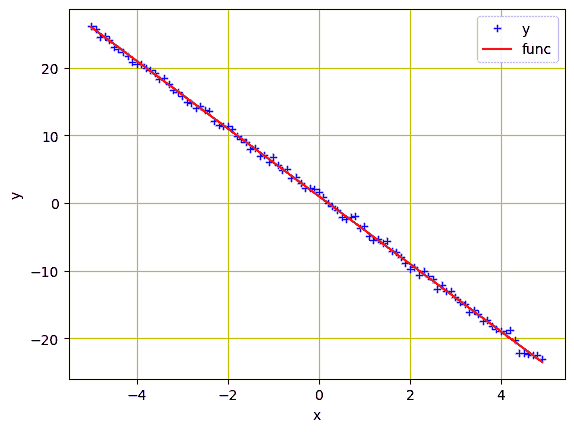
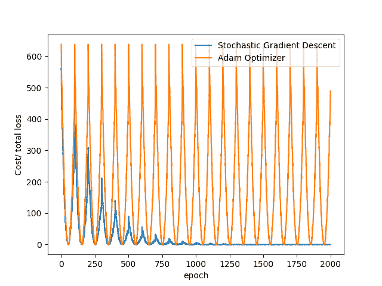

# 使用 PyTorch 中的优化器

> 原文：[`machinelearningmastery.com/using-optimizers-from-pytorch/`](https://machinelearningmastery.com/using-optimizers-from-pytorch/)

优化是一个过程，我们试图为深度学习模型找到最佳的参数集。优化器生成新的参数值，并使用某些标准评估它们，以确定最佳选项。作为神经网络架构的重要组成部分，优化器有助于确定最佳的权重、偏置或其他超参数，以达到期望的输出。

在 PyTorch 中有许多种优化器，每种优化器都有其自身的优缺点。这些包括 Adagrad、Adam、RMSProp 等等。

在之前的教程中，我们实现了优化器的所有必要步骤，以在训练过程中更新权重和偏置。在这里，您将学习一些 PyTorch 包，这些包使优化器的实现更加简单。特别是，您将学习：

+   如何使用 PyTorch 中的一些包实现优化器。

+   如何从 PyTorch 的 'nn' 包中导入线性类和损失函数。

+   如何使用 PyTorch 的 'optim' 包实现随机梯度下降和 Adam（最常用的优化器）。

+   如何自定义模型的权重和偏置。

注意，我们将在我们 PyTorch 系列的后续教程中使用相同的实现步骤。

**用我的书 [使用 PyTorch 进行深度学习](https://machinelearningmastery.com/deep-learning-with-pytorch/) 开始你的项目**。它提供了**自学教程**和**可工作的代码**。

让我们开始吧！

使用 PyTorch 中的优化器。

图片由 [Jean-Daniel Calame](https://unsplash.com/photos/vK8a67HU7To) 提供。部分权利保留。

## 概述

此教程分为五个部分；它们是

+   数据准备

+   构建模型和损失函数

+   使用随机梯度下降法训练模型

+   使用 Adam 优化器训练模型

+   绘制图表

## 数据准备

让我们从导入我们将在本教程中使用的库开始。

```py
import matplotlib.pyplot as plt
import numpy as np
import torch
from torch.utils.data import Dataset, DataLoader
```

我们将使用一个自定义的数据类。数据是一条线，值从$-5$到$5$，斜率和偏置分别为$-5$和$1$。此外，我们将添加与 `x` 相同值的噪声，并训练我们的模型来估计这条线。

```py
# Creating our dataset class
class Build_Data(Dataset):    
    # Constructor
    def __init__(self):
        self.x = torch.arange(-5, 5, 0.1).view(-1, 1)
        self.func = -5 * self.x + 1
        self.y = self.func + 0.4 * torch.randn(self.x.size())
        self.len = self.x.shape[0]        
    # Getting the data
    def __getitem__(self, index):    
        return self.x[index], self.y[index]    
    # Getting length of the data
    def __len__(self):
        return self.len
```

现在让我们使用它来创建我们的数据集对象并绘制数据。

```py
# Create dataset object
data_set = Build_Data()

# Plot and visualizing the data points
plt.plot(data_set.x.numpy(), data_set.y.numpy(), 'b+', label = 'y')
plt.plot(data_set.x.numpy(), data_set.func.numpy(), 'r', label = 'func')
plt.xlabel('x')
plt.ylabel('y')
plt.legend()
plt.grid('True', color='y')
plt.show()
```



自定数据集对象的数据

将所有东西放在一起，以下是创建图表的完整代码：

```py
import matplotlib.pyplot as plt
import numpy as np
import torch
from torch.utils.data import Dataset, DataLoader

# Creating our dataset class
class Build_Data(Dataset):    
    # Constructor
    def __init__(self):
        self.x = torch.arange(-5, 5, 0.1).view(-1, 1)
        self.func = -5 * self.x + 1
        self.y = self.func + 0.4 * torch.randn(self.x.size())
        self.len = self.x.shape[0]        
    # Getting the data
    def __getitem__(self, index):    
        return self.x[index], self.y[index]    
    # Getting length of the data
    def __len__(self):
        return self.len

# Create dataset object
data_set = Build_Data()

# Plot and visualizing the data points
plt.plot(data_set.x.numpy(), data_set.y.numpy(), 'b+', label = 'y')
plt.plot(data_set.x.numpy(), data_set.func.numpy(), 'r', label = 'func')
plt.xlabel('x')
plt.ylabel('y')
plt.legend()
plt.grid('True', color='y')
plt.show()
```

## 构建模型和损失函数

在之前的教程中，我们为线性回归模型和损失函数创建了一些函数。PyTorch 允许我们仅用几行代码就能做到这一点。这是我们如何从 PyTorch 的 `nn` 包中导入我们内置的线性回归模型及其损失标准。

```py
model = torch.nn.Linear(1, 1)
criterion = torch.nn.MSELoss()
```

模型参数在创建时是随机的。我们可以通过以下方式验证这一点：

```py
...
print(list(model.parameters()))
```

打印

```py
[Parameter containing:
tensor([[-5.2178]], requires_grad=True), Parameter containing:
tensor([-5.5367], requires_grad=True)]
```

虽然 PyTorch 会随机初始化模型参数，我们也可以自定义它们以使用自己的参数。我们可以按如下方式设置权重和偏差。注意，在实际应用中我们很少需要这样做。

```py
...
model.state_dict()['weight'][0] = -10
model.state_dict()['bias'][0] = -20
```

在开始训练之前，让我们创建一个 `DataLoader` 对象，将数据集加载到管道中。

```py
...
# Creating Dataloader object
trainloader = DataLoader(dataset = data_set, batch_size=1)
```

### 想开始使用 PyTorch 进行深度学习吗？

现在就参加我的免费电子邮件速成课程（包含示例代码）。

点击注册并获取免费 PDF 电子书版本的课程。

## 使用随机梯度下降训练模型

要使用我们选择的优化器，我们可以从 PyTorch 中导入 `optim` 包。它包含了几个最先进的参数优化算法，只需一行代码即可实现。作为示例，随机梯度下降 (SGD) 如下所示。

```py
...
# define optimizer
optimizer = torch.optim.SGD(model.parameters(), lr=0.01)
```

作为输入，我们提供了 `model.parameters()` 给构造函数以表示要优化的内容。我们还定义了步长或学习率 (`lr`)。

为了帮助可视化优化器的进展，我们创建了一个空列表来存储损失，并让模型训练 20 个周期。

```py
...
loss_SGD = []
n_iter = 20

for i in range(n_iter):
    for x, y in trainloader:
        # making a pridiction in forward pass
        y_hat = model(x)
        # calculating the loss between original and predicted data points
        loss = criterion(y_hat, y)
        # store loss into list
        loss_SGD.append(loss.item())
        # zeroing gradients after each iteration
        optimizer.zero_grad()
        # backward pass for computing the gradients of the loss w.r.t to learnable parameters
        loss.backward()
        # updateing the parameters after each iteration
        optimizer.step()
```

在上述过程中，我们将数据样本输入模型进行预测，并计算损失。在反向传播过程中计算梯度，并优化参数。虽然在之前的会话中我们使用了一些额外的代码来更新参数和清零梯度，但 PyTorch 的 `zero_grad()` 和 `step()` 方法使这个过程更加简洁。

你可以增加上述 `DataLoader` 对象中的 `batch_size` 参数来进行小批量梯度下降。

综合来看，完整的代码如下：

```py
import matplotlib.pyplot as plt
import numpy as np
import torch
from torch.utils.data import Dataset, DataLoader

# Creating our dataset class
class Build_Data(Dataset):    
    # Constructor
    def __init__(self):
        self.x = torch.arange(-5, 5, 0.1).view(-1, 1)
        self.func = -5 * self.x + 1
        self.y = self.func + 0.4 * torch.randn(self.x.size())
        self.len = self.x.shape[0]        
    # Getting the data
    def __getitem__(self, index):    
        return self.x[index], self.y[index]    
    # Getting length of the data
    def __len__(self):
        return self.len

# Create dataset object
data_set = Build_Data()

model = torch.nn.Linear(1, 1)
criterion = torch.nn.MSELoss()

# Creating Dataloader object
trainloader = DataLoader(dataset = data_set, batch_size=1)

# define optimizer
optimizer = torch.optim.SGD(model.parameters(), lr=0.01)

loss_SGD = []
n_iter = 20

for i in range(n_iter):
    for x, y in trainloader:
        # making a pridiction in forward pass
        y_hat = model(x)
        # calculating the loss between original and predicted data points
        loss = criterion(y_hat, y)
        # store loss into list
        loss_SGD.append(loss.item())
        # zeroing gradients after each iteration
        optimizer.zero_grad()
        # backward pass for computing the gradients of the loss w.r.t to learnable parameters
        loss.backward()
        # updateing the parameters after each iteration
        optimizer.step()
```

## 使用 Adam 优化器训练模型

Adam 是用于训练深度学习模型的最常用优化器之一。当你有大量训练数据时，它速度快且效率高。Adam 是一种带有**动量**的优化器，在模型复杂时（如大多数深度学习情况）比 SGD 更具优势。

在 PyTorch 中，将上述 SGD 优化器替换为 Adam 优化器非常简单。虽然所有其他步骤都是相同的，但我们只需将 `SGD()` 方法替换为 `Adam()` 即可实现该算法。

```py
...
# define optimizer
optimizer = torch.optim.Adam(model.parameters(), lr=0.01)
```

类似地，我们将定义迭代次数和一个空列表来存储模型损失。然后我们可以运行训练。

```py
...
loss_Adam = []
n_iter = 20

for i in range(n_iter):
    for x, y in trainloader:
        # making a pridiction in forward pass
        y_hat = model(x)
        # calculating the loss between original and predicted data points
        loss = criterion(y_hat, y)
        # store loss into list
        loss_Adam.append(loss.item())
        # zeroing gradients after each iteration
        optimizer.zero_grad()
        # backward pass for computing the gradients of the loss w.r.t to learnable parameters
        loss.backward()
        # updateing the parameters after each iteration
        optimizer.step()
```

综合所有内容，以下是完整的代码。

```py
import matplotlib.pyplot as plt
import numpy as np
import torch
from torch.utils.data import Dataset, DataLoader

# Creating our dataset class
class Build_Data(Dataset):
    # Constructor
    def __init__(self):
        self.x = torch.arange(-5, 5, 0.1).view(-1, 1)
        self.func = -5 * self.x + 1
        self.y = self.func + 0.4 * torch.randn(self.x.size())
        self.len = self.x.shape[0]        
    # Getting the data
    def __getitem__(self, index):    
        return self.x[index], self.y[index]    
    # Getting length of the data
    def __len__(self):
        return self.len

# Create dataset object
data_set = Build_Data()

model = torch.nn.Linear(1, 1)
criterion = torch.nn.MSELoss()

# Creating Dataloader object
trainloader = DataLoader(dataset = data_set, batch_size=1)

# define optimizer
optimizer = torch.optim.Adam(model.parameters(), lr=0.01)

loss_Adam = []
n_iter = 20

for i in range(n_iter):
    for x, y in trainloader:
        # making a pridiction in forward pass
        y_hat = model(x)
        # calculating the loss between original and predicted data points
        loss = criterion(y_hat, y)
        # store loss into list
        loss_Adam.append(loss.item())
        # zeroing gradients after each iteration
        optimizer.zero_grad()
        # backward pass for computing the gradients of the loss w.r.t to learnable parameters
        loss.backward()
        # updateing the parameters after each iteration
        optimizer.step()
```

## 绘制图表

我们成功实现了 SGD 和 Adam 优化器用于模型训练。让我们可视化在训练过程中这两种算法中模型损失的减少情况，这些损失存储在 `loss_SGD` 和 `loss_Adam` 列表中：

```py
...
plt.plot(loss_SGD,label = "Stochastic Gradient Descent")
plt.plot(loss_Adam,label = "Adam Optimizer")
plt.xlabel('epoch')
plt.ylabel('Cost/ total loss')
plt.legend()
plt.show()
```



你可以看到在上述示例中，SGD 收敛速度快于 Adam。这是因为我们训练的是线性回归模型，而 Adam 提供的算法过于复杂。

综合所有内容，以下是完整的代码。

```py
import matplotlib.pyplot as plt
import numpy as np
import torch
from torch.utils.data import Dataset, DataLoader

# Creating our dataset class
class Build_Data(Dataset):
    # Constructor
    def __init__(self):
        self.x = torch.arange(-5, 5, 0.1).view(-1, 1)
        self.func = -5 * self.x + 1
        self.y = self.func + 0.4 * torch.randn(self.x.size())
        self.len = self.x.shape[0]
    # Getting the data
    def __getitem__(self, index):
        return self.x[index], self.y[index]
    # Getting length of the data
    def __len__(self):
        return self.len

# Create dataset object
data_set = Build_Data()

model = torch.nn.Linear(1, 1)
criterion = torch.nn.MSELoss()

# Creating Dataloader object
trainloader = DataLoader(dataset = data_set, batch_size=1)

# define optimizer
optimizer = torch.optim.Adam(model.parameters(), lr=0.01)

loss_SGD = []
n_iter = 20

for i in range(n_iter):
    for x, y in trainloader:
        # making a prediction in forward pass
        y_hat = model(x)
        # calculating the loss between original and predicted data points
        loss = criterion(y_hat, y)
        # store loss into list
        loss_SGD.append(loss.item())
        # zeroing gradients after each iteration
        optimizer.zero_grad()
        # backward pass for computing the gradients of the loss w.r.t to learnable parameters
        loss.backward()
        # updating the parameters after each iteration
        optimizer.step()

model = torch.nn.Linear(1, 1)
loss_Adam = []
for i in range(n_iter):
    for x, y in trainloader:
        # making a prediction in forward pass
        y_hat = model(x)
        # calculating the loss between original and predicted data points
        loss = criterion(y_hat, y)
        # store loss into list
        loss_Adam.append(loss.item())
        # zeroing gradients after each iteration
        optimizer.zero_grad()
        # backward pass for computing the gradients of the loss w.r.t to learnable parameters
        loss.backward()
        # updating the parameters after each iteration
        optimizer.step()

plt.plot(loss_SGD,label = "Stochastic Gradient Descent")
plt.plot(loss_Adam,label = "Adam Optimizer")
plt.xlabel('epoch')
plt.ylabel('Cost/ total loss')
plt.legend()
plt.show()
```

## 总结

在本教程中，您使用了 PyTorch 中的一些内置包实现了优化算法。特别是，您学会了：

+   如何使用 PyTorch 中的一些包实现优化器。

+   如何从 PyTorch 的`nn`包中导入线性类和损失函数。

+   如何使用 PyTorch 的`optim`包实现随机梯度下降和 Adam（最常用的优化器）。

+   如何自定义模型的权重和偏置。
