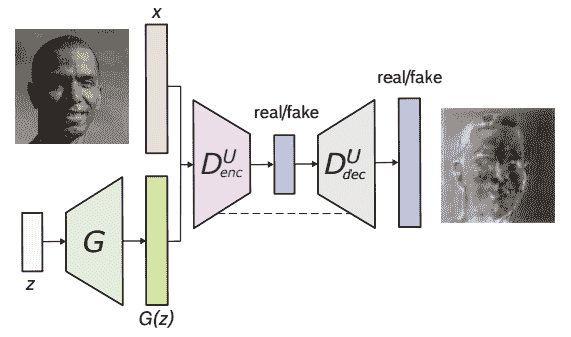
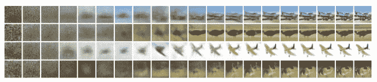
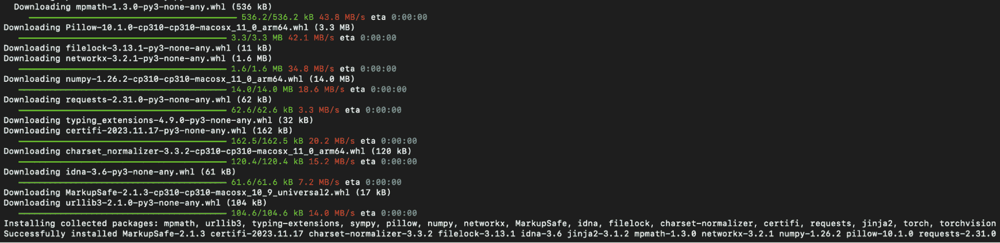
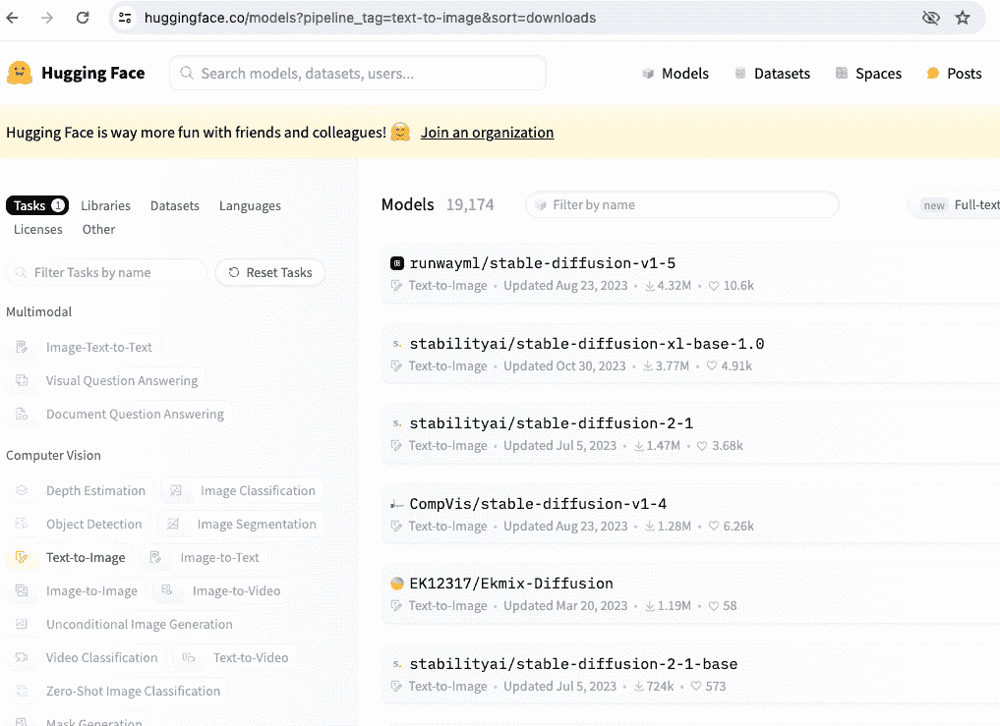

# 稳定扩散的技术介绍

> 原文：[`machinelearningmastery.com/a-technical-introduction-to-stable-diffusion/`](https://machinelearningmastery.com/a-technical-introduction-to-stable-diffusion/)

GPT-3 的出现，特别是其聊天机器人形式，即 ChatGPT，已被证明是 AI 领域的一个重要时刻，标志着生成性 AI（GenAI）革命的开始。尽管在图像生成领域之前已经存在模型，但正是 GenAI 浪潮引起了所有人的关注。

稳定扩散是用于图像生成的 GenAI 家族的一员。它因其定制可能性、自由可在自己的硬件上运行和积极改进而闻名。它并不是唯一的。例如，OpenAI 发布了 DALLE-3，作为其 ChatGPTPlus 订阅的一部分，用于图像生成。但是，稳定扩散在从文本以及其他现有图像生成图像方面表现出了显著的成功。最近将视频生成能力集成到扩散模型中的发展，为研究这一前沿技术提供了令人信服的案例。

在这篇文章中，你将学习一些关于稳定扩散的技术细节以及如何在自己的硬件上进行设置。

**启动你的项目**，请参考我的书籍[《掌握稳定扩散的数字艺术》](https://machinelearningmastery.com/mastering-digital-art-with-stable-diffusion/)。它提供了**自学教程**和**有效代码**。

让我们开始吧。


稳定扩散的技术介绍

照片由[Denis Oliveira](https://unsplash.com/photos/lighted-incense-_12PwFpWZZ0)提供。版权所有。

## 概述

本文分为四部分；它们是：

+   扩散模型如何工作

+   扩散模型的数学

+   为什么稳定扩散特别

+   如何安装稳定扩散 WebUI

## 扩散模型如何工作

为了理解扩散模型，我们首先回顾一下在稳定扩散或其今天的同类出现之前，图像生成是如何通过机器进行的。一切始于 GANs（生成对抗网络），其中两个神经网络通过竞争和合作的学习过程进行交互。

第一个是生成器网络，它制造合成数据，在这种情况下，是无法与真实数据区分的图像。它生成随机噪声，并通过多个层逐步精炼，从而生成越来越逼真的图像。

第二个网络，即判别器网络，作为对手，审查生成的图像，以区分真实和合成图像。其目标是准确地将图像分类为真实或虚假。



U-Net GAN 架构。来自 Schonfeld 等（2020）

扩散模型假设噪声图像或纯噪声是将噪声（或高斯噪声）重复叠加在原始图像上的结果。这一噪声叠加过程称为正向扩散。与此完全相反的是反向扩散，它涉及从噪声图像一步步转变为较少噪声的图像。

以下是从右到左的正向扩散过程的示意图，即从清晰到噪声图像。



扩散过程。图源自 Ho 等人（2020 年）

## 扩散模型的数学

正向和反向扩散过程都遵循马尔可夫链，这意味着在任何时间步$t$，图像中的像素值或噪声仅依赖于前一个图像。

### 正向扩散

从数学上讲，正向扩散过程中的每一步可以使用以下方程表示：

$$q(\mathbf{x}_t\mid \mathbf{x}_{t-1}) = \mathcal{N}(\mathbf{x}_t;\mu_t = \sqrt{1-\beta_t}\mathbf{x}_{t-1}, \Sigma_t = \beta_t \mathbb{I})$$

其中$q(x_t\mid x_{t-1})$是均值为$\mu_t = \sqrt{1-\beta_t}x_{t-1}$、方差为$\Sigma_t = \beta_t \mathbb{I}$的正态分布，$\mathbf{I}$是单位矩阵，每一步的图像（作为潜在变量）$\mathbf{x}_t$是一个向量，均值和方差由标量值$\beta_t$参数化。


正向扩散$q(\mathbf{x}_t\mid\mathbf{x}_{t-1})$和反向扩散$p_\theta(\mathbf{x}_{t-1}\mid\mathbf{x}_t)$。图源自 Ho 等人（2020 年）

因此，正向扩散过程中的所有步骤的后验概率定义如下：

$$q(\mathbf{x}_{1:T}\mid \mathbf{x}_0) = \prod_{t=1}^T q(\mathbf{x}_t\mid\mathbf{x}_{t-1})$$

在这里，我们从时间步 1 应用到$T$。

### 反向扩散

反向扩散，即正向扩散过程的相反过程，工作原理类似。正向过程根据先验概率映射后验概率，而反向过程则相反，即根据后验概率映射先验概率。

$$p_\theta(\mathbf{x}_{t-1}\mid\mathbf{x}_t) = \mathcal{N}(\mathbf{x}_{t-1};\mu_\theta(\mathbf{x}_t,t),\Sigma_\theta(\mathbf{x}_t,t))$$

其中$p_\theta$应用反向扩散，也称为轨迹。

当时间步$t$趋近于无穷大时，潜在变量$\mathbf{x}_T$趋向于几乎各向同性的高斯分布（即纯噪声没有图像内容）。目标是学习$q(\mathbf{x}_{t-1}\mid \mathbf{x}_t)$，其中过程从称为$\mathbf{x}_T$的$\mathcal{N}(0,\mathbf{I})$样本开始。我们逐步执行完整的反向过程，逐步达到从$q(\mathbf{x}_0)$中提取样本，即从实际数据分布中生成的数据。通俗地说，反向扩散就是通过许多小步骤从随机噪声中创建图像。

## 为什么稳定扩散特别？

稳定扩散不直接将扩散过程应用于高维输入，而是使用编码器网络将输入投影到降维的潜在空间中（这是扩散过程发生的地方）。采用这种方法的理由是通过在较低维空间内处理输入来减少训练扩散模型所涉及的计算负载。随后，使用传统的扩散模型（如 U-Net）生成新数据，并使用解码器网络进行上采样。

## 如何安装稳定扩散 WebUI？

您可以通过订阅将稳定扩散作为服务使用，也可以将其下载并在您的计算机上运行。在计算机上使用它有两种主要方式：WebUI 和 CompfyUI。这里将向您展示如何安装 WebUI。

**注意：** 稳定扩散需要大量计算资源。为了获得合理的性能，您可能需要一台配备支持的 GPU 的良好硬件。

Python 编程语言的稳定扩散 WebUI 软件包可从其 GitHub [页面](https://github.com/AUTOMATIC1111/stable-diffusion-webui) 免费下载和使用。以下是在 Apple Silicon 芯片上安装该库的步骤，其他平台大部分也是相同的：

1.  1.  **先决条件。** 完成此过程的先决条件之一是设置能够运行 WebUI 的环境。这是一个基于 Python 的 Web 服务器，其 UI 使用 Gradio 构建。设置大多是自动完成的，但您应确保某些基本组件可用，如 `git` 和 `wget`。运行 WebUI 时，将创建一个 Python 虚拟环境。

        在 macOS 中，您可能希望使用 Homebrew 安装 Python 系统，因为某些依赖项可能需要比 macOS 默认提供的版本更新的 Python 版本。参见 [Homebrew 安装指南](https://brew.sh/)。然后，您可以使用以下命令在 Homebrew 中安装 Python：

        ```py
        brew install cmake protobuf rust python@3.10 git wget
        ```

    1.  **下载。** WebUI 是 GitHub 上的一个存储库。要将 WebUI 的副本复制到您的计算机上，可以运行以下命令：

        ```py
        git clone https://github.com/AUTOMATIC1111/stable-diffusion-webui
        ```

        这将创建一个名为 `stable-diffusion-webui` 的文件夹，接下来的步骤应在此文件夹中进行。

    1.  **检查点。** WebUI 用于运行流程，但稳定的扩散模型未包含在内。您需要下载模型（也称为检查点），并且有多个版本可供选择。这些可以从各种来源下载，最常见的是从 [HuggingFace](https://huggingface.co/)。接下来的部分将详细介绍这一步骤。所有稳定的扩散模型/检查点应放置在目录 `stable-diffusion-webui/models/Stable-diffusion` 中。

    1.  **首次运行。** 使用命令行导航到 `stable-diffusion-webui` 目录，并运行 `./webui.sh` 来启动 Web UI。此操作将使用 `venv` 创建并激活 Python 虚拟环境，自动获取和安装任何剩余的必需依赖项。

        首次运行 WebUI 时安装的 Python 模块

    1.  **后续运行。** 要访问 Web UI，请在 WebUI 目录中重新运行 `./webui.sh`。请注意，WebUI 不会自动更新；要更新它，您必须在运行命令之前执行 `git pull` 以确保使用最新版本。`webui.sh` 脚本的作用是启动一个 web 服务器，您可以通过浏览器访问稳定扩散。所有交互都应通过浏览器进行，您可以通过关闭 web 服务器（例如，按下运行 `webui.sh` 的终端上的 Control-C）来关闭 WebUI。

对于其他操作系统，[官方自述文件](https://github.com/AUTOMATIC1111/stable-diffusion-webui/blob/master/README.md)提供了最佳指导。

## 如何下载模型？

您可以通过 [Hugging Face](https://huggingface.co/models?pipeline_tag=text-to-image&sort=downloads) 下载稳定扩散模型，选择感兴趣的模型并进入“Files and versions”部分。查找以“`.ckpt`”或“`.safetensors`”扩展名标记的文件，并点击文件大小旁边的右箭头以开始下载。SafeTensor 是 Python 的 pickle 序列化库的替代格式；它们的区别由 WebUI 自动处理，因此您可以将它们视为等效。



如果您通过模型名称“stable-diffusion”在 Hugging Face 上搜索，会有几个模型。

我们可能会在接下来的章节中使用几个官方的稳定扩散模型，包括：

+   稳定扩散 1.4 (`sd-v1-4.ckpt`)

+   稳定扩散 1.5 (`v1-5-pruned-emaonly.ckpt`)

+   稳定扩散 1.5 修复 (`sd-v1-5-inpainting.ckpt`)

对于稳定扩散版本 2.0 和 2.1，模型和配置文件是必需的。此外，在生成图像时，请确保图像的宽度和高度设置为 768 或更高：

+   稳定扩散 2.0 (`768-v-ema.ckpt`)

+   稳定扩散 2.1 (`v2-1_768-ema-pruned.ckpt`)

配置文件可以在 GitHub 的以下位置找到：

+   [`raw.githubusercontent.com/Stability-AI/stablediffusion/main/configs/stable-diffusion/v2-inference-v.yaml`](https://raw.githubusercontent.com/Stability-AI/stablediffusion/main/configs/stable-diffusion/v2-inference-v.yaml)

下载了上述的 `v2-inference-v.yaml` 后，您应将其放置在与模型文件名匹配的同一文件夹中（例如，如果您下载了 `768-v-ema.ckpt` 模型，则应将此配置文件重命名为 `768-v-ema.yaml` 并与模型一起存储在 `stable-diffusion-webui/models/Stable-diffusion` 文件夹中）。

也有一个稳定扩散 2.0 深度模型 (`512-depth-ema.ckpt`)。在这种情况下，您应从以下地址下载 `v2-midas-inference.yaml` 配置文件：

+   [`raw.githubusercontent.com/Stability-AI/stablediffusion/main/configs/stable-diffusion/v2-midas-inference.yaml`](https://raw.githubusercontent.com/Stability-AI/stablediffusion/main/configs/stable-diffusion/v2-midas-inference.yaml)

并将其保存到模型文件夹中，命名为`stable-diffusion-webui/models/Stable-diffusion/512-depth-ema.yaml`。该模型在 512 像素宽/高或更高的图像尺寸下能够实现最佳功能。

另一个可以找到 Stable Diffusion 模型检查点的位置是[`civitai.com/`](https://civitai.com/)，您也可以在这里查看样本。

## 进一步阅读

以下是上述引用的几篇论文：

+   “[基于 U-Net 的生成对抗网络鉴别器](https://openaccess.thecvf.com/content_CVPR_2020/html/Schonfeld_A_U-Net_Based_Discriminator_for_Generative_Adversarial_Networks_CVPR_2020_paper.html)”，作者为 Schonfeld，Schiele 和 Khoreva。在 CVPR 2020 年会议论文中，第 8207-8216 页。

+   “去噪扩散概率模型”，作者为 Ho，Jain 和 Abbeel（2020 年）。[arXiv 2006.11239](https://arxiv.org/abs/2006.11239)

## 概要

在本文中，我们学习了扩散模型的基础知识及其在各个领域的广泛应用。除了详细阐述它们在图像和视频生成上的最新成功案例之外，我们还讨论了前向和反向扩散过程以及建模后验概率。

Stable Diffusion 的独特方法涉及将高维输入投影到降维的潜在空间中，通过编码器和解码器网络减少计算需求。

接下来，我们将学习使用 Stable Diffusion WebUI 生成图像的实际方面。我们的探索将涵盖模型下载和利用 Web 界面进行图像生成。
