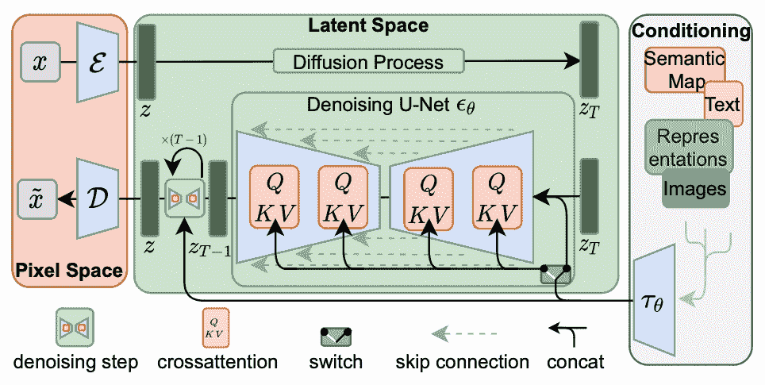
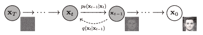
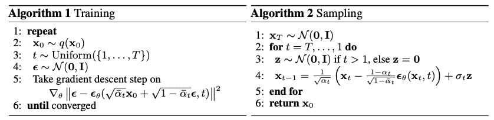

# 图像生成扩散模型简介

> 原文：[`machinelearningmastery.com/brief-introduction-to-diffusion-models-for-image-generation/`](https://machinelearningmastery.com/brief-introduction-to-diffusion-models-for-image-generation/)

生成式机器学习模型的进步使得计算机能够进行创造性工作。在绘画范围内，有几个显著的模型允许您将文本描述转换为像素数组。如今最强大的模型之一属于扩散模型家族。在本文中，您将了解这种模型的工作原理以及如何控制其输出。

使用我的书[《稳定扩散的数字艺术》](https://machinelearningmastery.com/mastering-digital-art-with-stable-diffusion/)，**启动您的项目**。它提供了带有**工作代码**的**自学教程**。

让我们开始吧。

图像生成扩散模型简介

图片由[Dhruvin Pandya](https://unsplash.com/photos/a-mountain-covered-in-snow-under-a-cloudy-sky-IXSnNQZ8ufY)提供。部分权利保留。

## 概述

本文分为三部分，它们是：

+   扩散模型工作流程

+   输出的变化

+   它是如何训练的

## 扩散模型工作流程

考虑将图片描述文本转换为像素数组的目标，机器学习模型的输出应该是一组 RGB 值。但是您应该如何向模型提供文本输入，以及如何进行转换呢？

由于文本输入描述了输出，模型需要**理解**文本的含义。对这种描述理解得越好，您的模型生成输出就越精确。因此，将文本视为字符串的琐碎解决方案效果不佳。您需要一个能理解自然语言的模块，而当今的最先进解决方案是将输入表示为嵌入向量。

嵌入表示的输入文本不仅允许您提取文本的**含义**，还提供了输入的统一形状，因为可以将各种长度的文本转换为张量的标准大小。

有多种方法可以将嵌入表示的张量转换为像素。回想一下生成对抗网络（GAN）的工作原理；您应该注意到这是类似的结构，即输入（文本）被转换为潜在结构（嵌入），然后转换为输出（像素）。

扩散模型是一类神经网络模型，考虑到嵌入是从随机像素恢复图片的**提示**。下面是来自 Rombach 等人论文的图示，以说明这一工作流程：

稳定扩散架构。Rombach 等人（2021）的图。

在这个图中，工作流程是从右到左。左侧的输出是将张量转换为像素空间，使用标记为 $\mathcal{D}$ 的 **解码器** 网络。右侧的输入转换为嵌入 $\tau_\theta$，用于作为 **条件张量**。关键结构位于中间的潜在空间。生成部分位于绿色框的下半部分，它使用 **去噪网络** $\epsilon_\theta$ 将 $z_T$ 转换为 $z_{T-1}$。

去噪网络接受输入张量 $z_T$ 和嵌入 $\tau_\theta$，输出张量 $z_{T-1}$。输出的张量在某种意义上“比”输入更好，因为它与嵌入的匹配度更高。在最简单的形式下，解码器 $\mathcal{D}$ 只是简单地从潜在空间复制输出。去噪网络的输入和输出张量 $z_T$ 和 $z_{T-1}$ 是 RGB 像素的数组，网络使其 **减少噪声**。

它被称为去噪网络，因为它假设嵌入可以完美描述输出，但输入和输出不同，因为一些像素被随机值替代。网络模型旨在去除这些随机值并恢复原始像素。这是一个困难的任务，但模型假设噪声像素是均匀添加的，噪声遵循高斯模型。因此，该模型可以多次重复使用，每次都能改善输入。以下是 Ho 等人论文中的一个概念插图：

去噪图像。图来自 Ho 等人（2020）

因为这种结构，去噪网络假设输入 $z_T$ 和输出 $z_{T-1}$ 具有相同的形状，使得网络可以重复使用，直到生成最终输出 $z$。前面的图中的去噪 U-net 块保持输入和输出的形状相同。去噪块在概念上是执行以下操作：

$$

\begin{aligned}

w_t &= \textrm{NoisePredictor}(z_t, \tau_\theta, t) \\

z_{t-1} &= z_t – w_t

\end{aligned}

$$

即，噪声成分 $w_t$ 从噪声图像 $z_t$、条件张量 $\tau_\theta$ 和步骤计数 $t$ 中预测。噪声预测器根据 $t$ 来估计 $z_t$ 中的噪声水平，这一水平以最终图像 $z=z_0$ 应该是什么由张量 $\tau_\theta$ 描述。$t$ 的值对预测器有帮助，因为值越大，$z_t$ 中的噪声越多。

从 $z_t$ 中减去噪声将得到去噪图像 $z_{t-1}$，可以再次输入去噪网络，直到生成 $z=z_0$。网络处理张量的次数 $T$ 是整个扩散模型的设计参数。因为在这个模型中，噪声被建模为高斯噪声，解码器 $\mathcal{D}$ 的一部分是将潜在空间张量 $z$ 转换为三通道张量，并将浮点值量化为 RGB。

## 输出的变化

一旦神经网络训练完成，每一层的权重将固定，只要输入是确定的，输出也是确定的。然而，在这个扩散模型工作流程中，输入是将被转换为嵌入向量的文本。去噪模型需要额外的输入，即潜在空间中的初始$z_T$张量。这通常是随机生成的，例如通过采样高斯分布并填充去噪网络预期形状的张量。不同的起始张量会产生不同的输出。这就是如何通过相同的输入文本生成不同的输出。

确实，现实要复杂得多。请记住，去噪网络在多个步骤中运行，每一步旨在改善输出，直到产生完美的最终输出。网络可以获得额外的提示，指示它处于哪个步骤（例如，总共 10 步中的第 5 步）。高斯噪声由其均值和方差参数化，你可以提供一个函数来计算。你能够更好地建模每一步预期的噪声，去噪网络就能更好地去除噪声。在**稳定扩散**模型中，去噪网络需要一个反映该步骤噪声强度的随机噪声样本，以预测来自加噪图像的噪声部分。下图中的算法 2 显示了这一点，这种随机性被引入为$\sigma_t\mathbf{z}$。你可以选择**采样器**来实现这一目的。一些采样器比其他的收敛更快（即，你使用的步骤更少）。你还可以将潜在空间模型视为**变分自编码器**，其中引入的变异也会影响输出。

## 训练过程

以稳定扩散模型为例，你可以看到工作流程中最重要的组件是潜在空间中的去噪模型。确实，输入模型并未经过训练，而是采用现有的文本嵌入模型，例如 BERT 或 T5。输出模型也可以是现成的模型，例如将 256×256 像素图像转换为 512×512 像素图像的超分辨率模型。

对去噪网络模型的概念性训练过程如下：你选择一张图像并添加一些噪声。然后，你创建一个由三部分组成的元组：图像、噪声和加噪图像。网络随后被训练以估计加噪图像中的噪声部分。噪声部分可以通过不同的像素噪声权重以及生成噪声的高斯参数来变化。训练算法如算法 1 所示：

训练和采样算法。图自 Ho 等人（2020）

由于去噪网络假设噪声是**附加的**，可以从输入中减去预测的噪声以产生输出。如上所述，去噪网络不仅以图像作为输入，还以反映文本输入的嵌入作为输入。嵌入在于，用于检测的噪声被条件化于嵌入中，这意味着输出应该与嵌入相关，而检测的噪声应适合条件概率分布。技术上讲，图像和嵌入在潜在模型中通过交叉注意力机制相互遇到，这在上述算法的骨架中未显示。

描述图片的词汇很多，想象一下让网络模型学习如何将一个词与图片相关联并不容易。例如，报道称，稳定扩散模型是通过 23 亿张图片进行训练的，并消耗了 15 万个 GPU 小时，使用了[LAION-5B 数据集](https://laion.ai/blog/laion-5b/)（该数据集拥有 58.5 亿张带文本描述的图片）。然而，一旦模型训练完成，您可以在像您的笔记本电脑这样的商品计算机上使用它。

## 进一步阅读

下面是几篇创建了今天我们所知的扩散模型图像生成的论文：

+   “高分辨率图像合成与潜在扩散模型” by Rombach, Blattmann, Lorenz, Esser, and Ommer (2021)

    [arXiv 2112.10752](https://arxiv.org/abs/2112.10752)

+   “去噪扩散概率模型” by Ho, Jain, and Abbeel (2020)

    [arXiv 2006.11239](https://arxiv.org/abs/2006.11239)

+   “扩散模型在图像合成上击败了 GANs” by Dhariwal and Nichol (2021)

    [arXiv 2105.05233](https://arxiv.org/abs/2105.05233)

+   “改进的去噪扩散概率模型” by Nichol and Dhariwal (2021)

    [arXiv 2102.09672](https://arxiv.org/abs/2102.09672)

## 总结

在本文中，您看到了扩散模型如何工作的概述。特别是，您学到了

+   图像生成工作流程具有多个步骤，扩散模型在潜在空间中作为去噪神经网络工作。

+   图像生成是通过从噪声图像开始实现的，这是一个由随机生成的像素数组组成的图像。

+   在潜在空间的每个步骤中，去噪网络消除一些噪声，条件是最终图像的输入文本描述的嵌入向量形式。

+   输出图像通过解码从潜在空间输出来获取。
