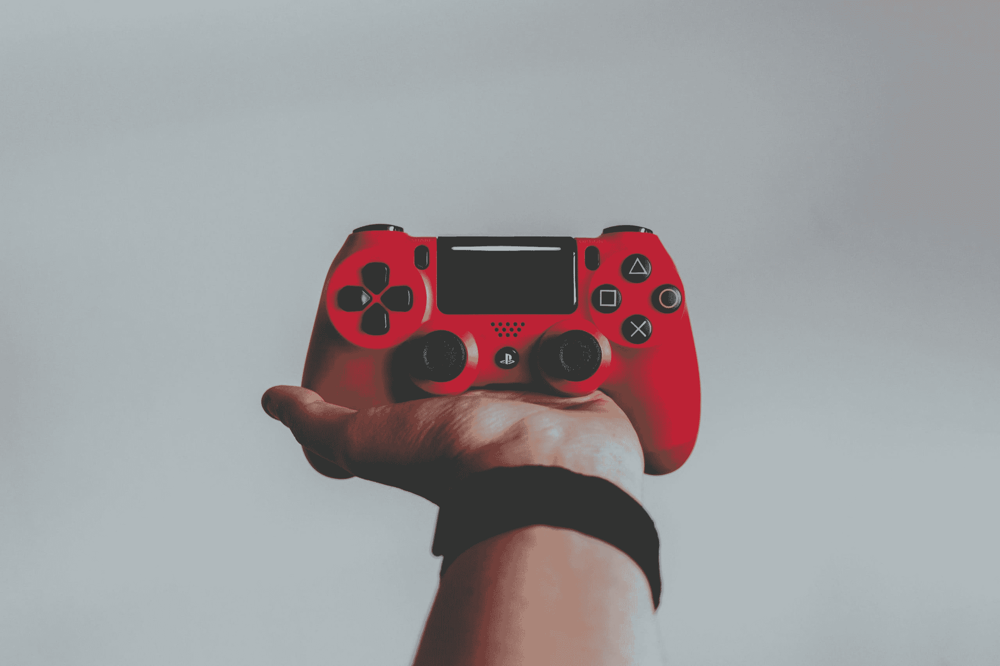
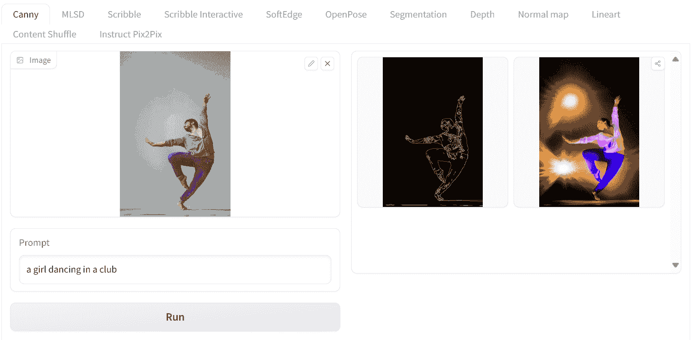
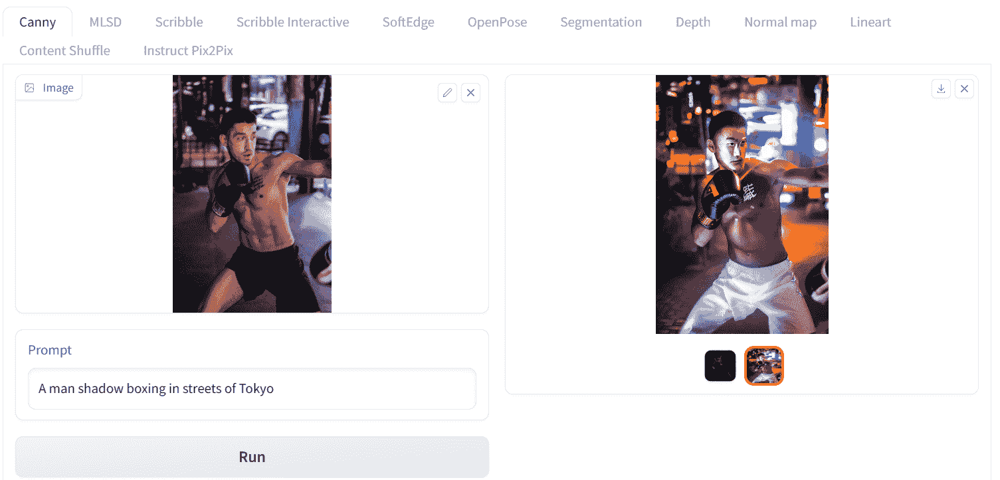
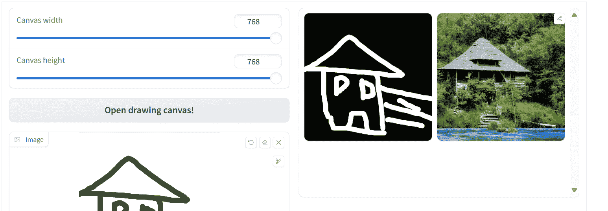
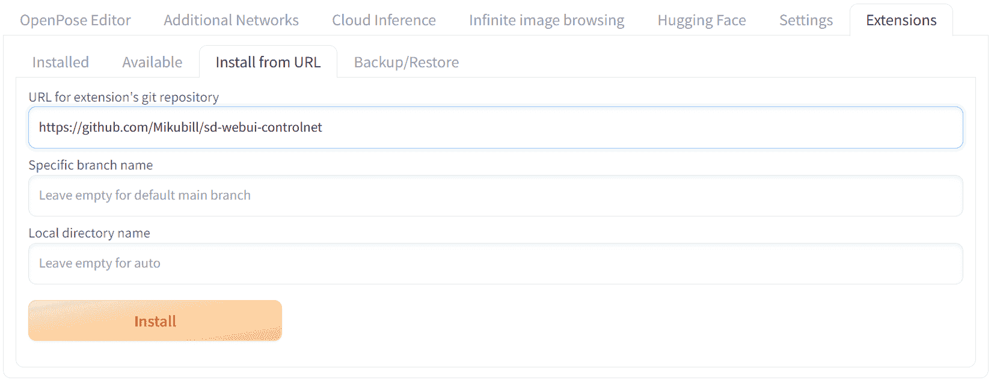
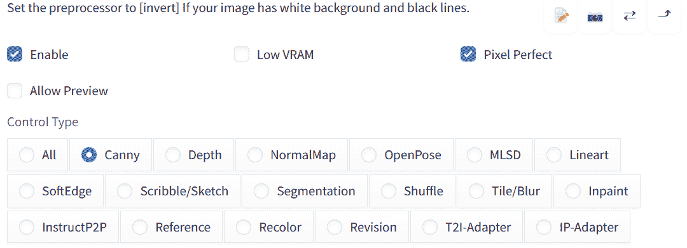
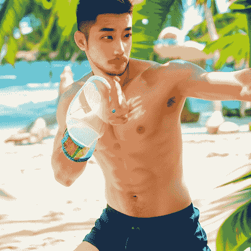

# 使用 ControlNet 与 Stable Diffusion

> 原文：[`machinelearningmastery.com/control-net-with-stable-diffusion/`](https://machinelearningmastery.com/control-net-with-stable-diffusion/)

ControlNet 是一个神经网络，通过添加额外条件来改善 Stable Diffusion 中的图像生成。这使用户可以更好地控制生成的图像。与其尝试不同的提示，ControlNet 模型使用户能够通过仅一个提示生成一致的图像。

在这篇文章中，你将学习如何通过 ControlNet 精确控制由 Stable Diffusion 生成的图像。具体而言，我们将涵盖：

+   什么是 ControlNet，以及它是如何工作的

+   如何在 Hugging Face Spaces 中使用 ControlNet

+   使用 ControlNet 与 Stable Diffusion WebUI

**通过我的书籍** [《掌握 Stable Diffusion 的数字艺术》](https://machinelearningmastery.com/mastering-digital-art-with-stable-diffusion/) **启动你的项目**。它提供了**自学教程**和**可用代码**。

让我们开始吧。

使用 ControlNet 与 Stable Diffusion

照片由 [Nadine Shaabana](https://unsplash.com/photos/red-sony-ps-dualshock-4-YsPnamiHdmI) 拍摄。保留所有权利。

## 概述

本文分为四部分，它们是：

+   什么是 ControlNet？

+   Hugging Face Space 中的 ControlNet

+   Scribble Interactive

+   Stable Diffusion Web UI 中的 ControlNet

## 什么是 ControlNet？

[ControlNet](https://github.com/lllyasviel/ControlNet) 是一种神经网络架构，可用于控制扩散模型。除了通常提供的生成输出图像的提示外，它还通过将额外的**条件**与输入图像作为附加约束来指导扩散过程。

有许多类型的条件输入（如 Canny 边缘、用户草图、人体姿势、深度等），可以为扩散模型提供更多的图像生成控制。

ControlNet 如何控制扩散模型的一些示例：

+   通过提供特定的人体姿势，生成模仿相同姿势的图像。

+   使输出遵循另一图像的风格。

+   将涂鸦转换为高质量图像。

+   使用参考图像生成类似的图像。

+   修补图像的缺失部分。

ControlNet 修改扩散过程的框图。图来自 Zhang 等人 (2023)

ControlNet 通过将权重从原始扩散模型复制到两个集合中来工作：

+   一个“锁定”的集合，保留原始模型

+   一个“可训练”的集合，学习新的条件。

ControlNet 模型本质上在潜在空间中生成一个差异向量，这个向量修改了扩散模型本应生成的图像。用公式表示，如果原始模型通过函数 $y=F(x;\Theta)$ 从提示 $x$ 生成输出图像 $y$，在 ControlNet 的情况下则为

$$y_c = F(x;\Theta) + Z(F(x+Z(c;\Theta_{z1}); \Theta_c); \Theta_{z2})$$

其中函数 $Z(\cdot;\Theta_z)$ 是零卷积层，参数 $\Theta_c, \Theta_{z1}, \Theta_{z2}$ 是来自 ControlNet 模型的参数。零卷积层的权重和偏置初始化为零，因此初始时不会造成扭曲。随着训练的进行，这些层学会满足条件约束。这种结构允许在小型设备上训练 ControlNet。请注意，相同的扩散架构（例如 Stable Diffusion 1.x）被使用两次，但使用不同的模型参数 $\Theta$ 和 $\Theta_c$。现在，您需要提供两个输入，$x$ 和 $c$，以创建输出 $y$。

将 ControlNet 和原始扩散模型分开设计允许在小数据集上进行精细调整，而不破坏原始扩散模型。它还允许相同的 ControlNet 与不同的扩散模型一起使用，只要架构兼容。ControlNet 的模块化和快速适应性使其成为一种灵活的方法，可以更精确地控制图像生成，而无需进行大量的重新训练。

## Hugging Face Spaces 中的 ControlNet

让我们看看 ControlNet 如何在扩散模型中发挥魔力。在这一部分，我们将使用 Hugging Face Spaces 上可用的在线 ControlNet 演示生成使用 ControlNet Canny 模型的人体姿势图像。

+   **URL:** [`hf.co/spaces/hysts/ControlNet-v1-1`](https://hf.co/spaces/hysts/ControlNet-v1-1)

我们将从 Pexels.com 上传[Yogendra Singh 的](https://www.pexels.com/photo/dancing-man-wearing-pants-and-long-sleeved-shirt-1701194/)照片到 ControlNet Spaces，并添加一个简单的提示。我们将生成一个在夜总会跳舞的女性图像，而不是男孩。让我们使用标签“Canny”。将提示设置为：

> 一个在夜总会跳舞的女孩

点击运行，你将看到以下输出：

在 Hugging Face Space 上运行 ControlNet

这太神奇了！“Canny”是一种图像处理算法，用于检测边缘。因此，您可以将您上传的图像的边缘作为轮廓草图提供。然后，将其作为附加输入 $c$ 与您提供的文本提示 $x$ 一起提供给 ControlNet，您将获得输出图像 $y$。简言之，您可以使用原始图像上的 Canny 边缘生成类似姿势的图像。

让我们看另一个例子。我们将上传[Gleb Krasnoborov 的](https://www.pexels.com/photo/man-wearing-boxing-gloves-2628207/)照片，并应用一个新的提示，该提示将改变拳击手的背景、效果和族裔为亚洲人。我们使用的提示是：

> 一个男人在东京街头进行影子拳击。

这是输出结果：

在 ControlNet 中使用 Canny 模型的另一个示例

再次，结果非常出色。我们生成了一个拳击手在东京街头以类似姿势进行影子拳击的图像。

## Scribble Interactive

ControlNet 的架构可以接受多种不同类型的输入。使用 Canny 边缘作为轮廓仅是 ControlNet 的一个模型。还有许多其他模型，每个模型都经过不同的图像扩散条件训练。

在同一个 Hugging Face Spaces 页面上，可以通过顶部标签访问 ControlNet 的不同版本。让我们看看使用 Scribbles 模型的另一个例子。为了使用 Scribbles 生成图像，只需转到 Scribble Interactive 选项卡，用鼠标画一个涂鸦，并写一个简单的提示生成图像，例如

> 河边的房子

如下所示：

使用 Scribble ControlNet：绘制一幅房子并提供文本提示

然后，通过设置其他参数并按“运行”按钮，您可能会获得如下输出：

Scribble ControlNet 的输出

生成的图像看起来不错，但可以更好。您可以再次尝试，加入更多细节的涂鸦和文本提示，以获得改进的结果。

使用涂鸦和文本提示生成图像是一种生成图像的简单方法，特别是当您无法想出非常准确的图像描述时。下面是使用涂鸦创建热气球图片的另一个例子。

使用涂鸦创建热气球图片。

## 稳定扩散 Web UI 中的 ControlNet

如您在之前的帖子中学习过使用稳定扩散 Web UI，您可以预期 ControlNet 也可以在 Web UI 上使用。这是一个扩展。如果您尚未安装，您需要启动稳定扩散 Web UI。然后，转到“扩展”选项卡，点击“从 URL 安装”，输入 ControlNet 存储库的链接：https://github.com/Mikubill/sd-webui-controlnet 来安装。

在稳定扩散 Web UI 上安装 ControlNet 扩展

您安装的扩展仅包含代码。例如，在使用 ControlNet Canny 版本之前，您必须下载并设置 Canny 模型。

1.  前往[`hf.co/lllyasviel/ControlNet-v1-1/tree/main`](https://hf.co/lllyasviel/ControlNet-v1-1/tree/main)

1.  下载[control_v11p_sd15_canny.pth](https://huggingface.co/lllyasviel/ControlNet-v1-1/blob/main/control_v11p_sd15_canny.pth)

1.  将模型文件放置在`stable-diffusion-webui/extensions/sd-webui-controlnet/models`或`stable-diffusion-webui/models/ControlNet`目录中

**注意**: 您可以使用`git clone`命令从上述存储库下载所有模型（注意每个模型的大小均为数 GB）。此外，该存储库收集了更多 ControlNet 模型，[`hf.co/lllyasviel/sd_control_collection`](https://hf.co/lllyasviel/sd_control_collection)

现在，您已经准备好使用该模型了。

让我们尝试使用 Canny ControlNet。你进入“txt2img”标签页，向下滚动找到 ControlNet 部分以打开它。然后，按照以下步骤操作：

1.  更改控制类型为 Canny。

    在 Web UI 中从 ControlNet 框中选择“Canny”。

1.  上传参考图像。

    在 Web UI 中将图像上传到 ControlNet 小部件

1.  处理 txt2img 标签中的其他部分：编写正面提示，负面提示，并更改其他高级设置。例如，

    > **正面提示：** “详细，杰作，最佳质量，令人惊叹，迷人，夺目，男人，自然光，海滩，海滩背景，阳光明媚，丛林，背景中的植物，海滩背景，海滩，热带海滩，水，清晰的皮肤，完美的光线，完美的阴影”
    > 
    > **负面提示：** “最差质量，低质量，低分辨率，单色，灰度，多视角，漫画，素描，糟糕的解剖学，变形，毁容，水印，多视角，变异手，水印”

    以及生成参数：

    +   **采样步骤：** 30

    +   **采样器：** DDIM

    +   **CFG 比例：** 7

输出可能是：

使用 ControlNet 在 Web UI 中生成图像的输出

如你所见，我们获得了高质量且相似的图像。我们可以通过使用不同的 ControlNet 模型和应用各种提示工程技术来改进照片，但这已是我们目前得到的最佳效果。

这是使用 Canny 版本的 ControlNet 生成的完整图像。

使用 ControlNet 和图像扩散模型生成的图像

## 进一步阅读

本节提供了更多关于此主题的资源，适合你深入了解。

+   [将条件控制添加到文本到图像扩散模型](https://arxiv.org/abs/2302.05543)，作者 Zhang 等（2023）

+   [ControlNet](https://github.com/lllyasviel/ControlNet) 在 GitHub 上

+   [ControlNet v1.1](https://github.com/lllyasviel/ControlNet-v1-1-nightly) 在 GitHub 上

+   [模型下载](https://github.com/Mikubill/sd-webui-controlnet/wiki/Model-download) 从 ControlNet Wiki

## 总结

在这篇文章中，我们了解了 ControlNet，它是如何工作的，以及如何使用它生成用户选择的精确控制图像。具体来说，我们涵盖了：

+   在 Hugging Face 上的 ControlNet 在线演示，使用各种参考图像生成图像。

+   使用不同版本的 ControlNet 并通过涂鸦生成图像。

+   在 Stable Diffusion WebUI 上设置 ControlNet 并使用它生成高质量的拳击手图像。
