# 在 Stable Diffusion 中生成逼真的人脸

> 原文：[`machinelearningmastery.com/generate-realistic-faces/`](https://machinelearningmastery.com/generate-realistic-faces/)

Stable Diffusion 最新模型在生成超现实图像方面表现优异，但在准确生成人脸时可能会遇到困难。我们可以尝试不同的提示，但要获得无缝、逼真的人脸效果，可能需要尝试新的方法和模型。

在这篇文章中，我们将探讨使用 Stable Diffusion 生成高度逼真的人脸的各种技术和模型。具体来说，我们将学习如何：

+   使用 WebUI 和高级设置生成真实图像。

+   使用 Stable Diffusion XL 以获得逼真的效果。

+   下载并使用在高质量图像上训练的微调模型。

**开启你的项目**，阅读我的书 [《精通数字艺术与 Stable Diffusion》](https://machinelearningmastery.com/mastering-digital-art-with-stable-diffusion/)。它提供了**自学教程**和**有效的代码**。

让我们开始吧。

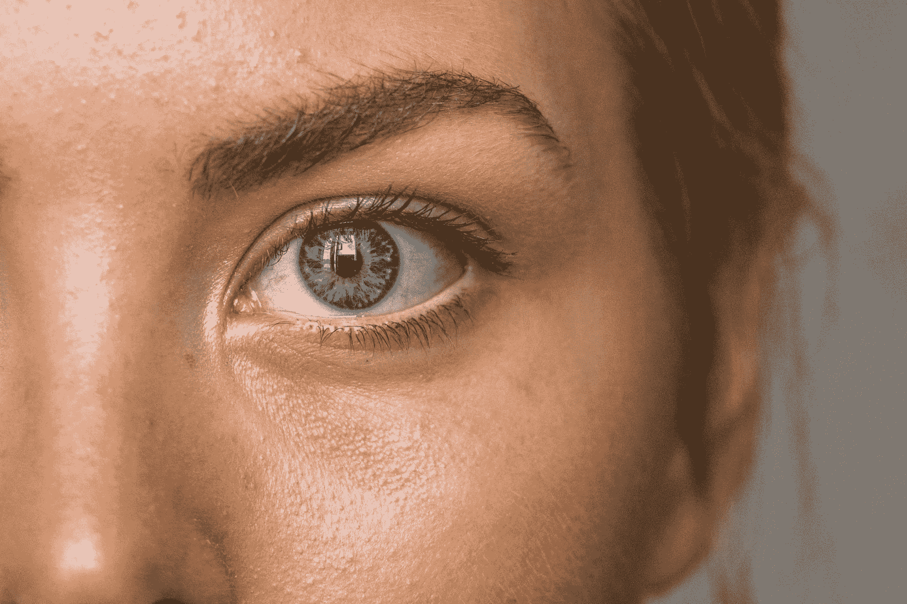

在 Stable Diffusion 中生成逼真的人脸

图片由 [Amanda Dalbjörn](https://unsplash.com/photos/close-up-photo-of-persons-eye-fvInY-Gh7sc) 提供。部分权利保留。

## 概述

本文分为三个部分；它们是：

+   使用 Web UI 创建肖像

+   使用 Stable Diffusion XL 创建肖像

+   使用 CivitAI 模型检查点

## 使用 Web UI 创建肖像

让我们从简单的提示工程开始，使用本地的 Stable Diffusion WebUI 进行 Stable Diffusion 1.5。你需要在积极提示、负面提示和高级设置上进行工作，以获得更好的结果。例如，

+   积极提示：“年轻女性的照片，突出头发，坐在餐厅外，穿着裙子，边缘光照，工作室灯光，注视镜头，近距离，完美的眼睛”

+   负面提示：“畸形、丑陋、差劲、不成熟、卡通、动漫、3d、绘画、黑白、双重图像”

+   采样器：DPM++ 2M Karras

+   步骤：30

+   CFG 比例：7

+   尺寸：912×512（宽）

创建负面提示时，你需要专注于描述“畸形面孔”和“看到双重图像”。这在 Stable Diffusion 1.5 模型中尤其重要。如果你注意到反复出现的模式，例如眼睛不对齐，可以添加额外的关键词，例如“完美的眼睛”到你的积极提示中，以及“畸形的眼睛”到你的负面提示中。

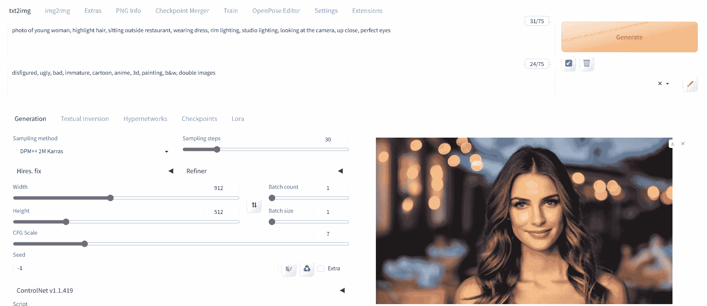

使用 Stable Diffusion 1.5 模型创建的肖像

如我们所见，第一次尝试时得到了非常好的结果。如果出现扭曲或双重图像，请尝试重新生成图像。这个模型并不完美，偶尔可能会生成不正确的图像。如果发生这种情况，只需生成新的图像。你也可以尝试调整参数，如采样方法、步骤和随机种子。作为最终的解决方案，改变模型检查点也有帮助。

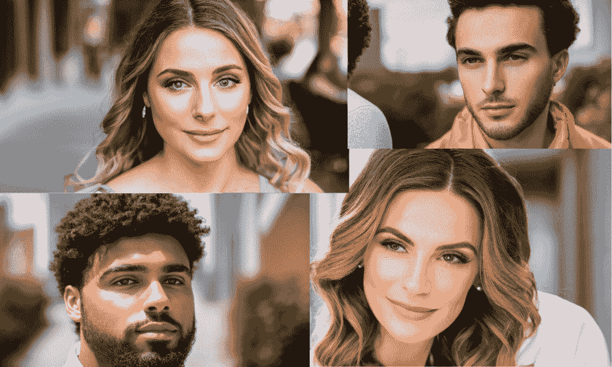

通过调整 Stable Diffusion 的输入生成的不同肖像

在修改各种关键词以生成多样化的逼真图像后，我们即使使用基础模型也取得了令人满意的结果。

## 使用 Stable Diffusion XL 创建肖像

最常见的 Stable Diffusion 模型是 2022 年 10 月发布的 1.5 版本。接着是 2022 年 11 月发布的 2.0 版本，它是一种类似的架构，但从头重新训练。2023 年 7 月发布的 Stable Diffusion XL (SDXL)是一个不同的架构，规模更大。这三个版本有不同的传承，并对你的提示做出不同的反应。普遍认为 SDXL 生成的图片更好。

让我们使用最新的模型 Stable Diffusion XL (SDXL)来获得更好的图像生成结果。这可以简单到下载模型检查点文件并将其保存到你的`stable-diffusion-webui/models/Stable-diffusion`文件夹中，重启 Web UI，然后重复上一部分的步骤。运行完整模型在本地可能需要大量的 GPU 内存。如果你无法满足其技术要求，使用 Hugging Face Spaces 上提供的免费在线演示是一个不错的选择。

你可以访问这些应用程序，通过访问 [`hf.co/spaces`](https://hf.co/spaces) 并搜索“SDXL”。

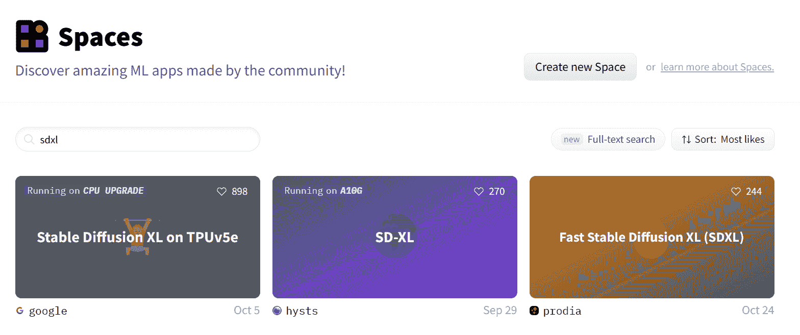

在 Hugging Face 空间中搜索“SDXL”

### 谷歌的 Stable Diffusion XL

我们将首先尝试运行在 TPU 版本 5e 上的最快演示以获取结果，位于：

+   [`hf.co/spaces/google/sdxl`](https://hf.co/spaces/google/sdxl)

为了确保我们的图像生成准确，重要的是通过进入高级设置，将负面提示和图像风格设置为“摄影”。

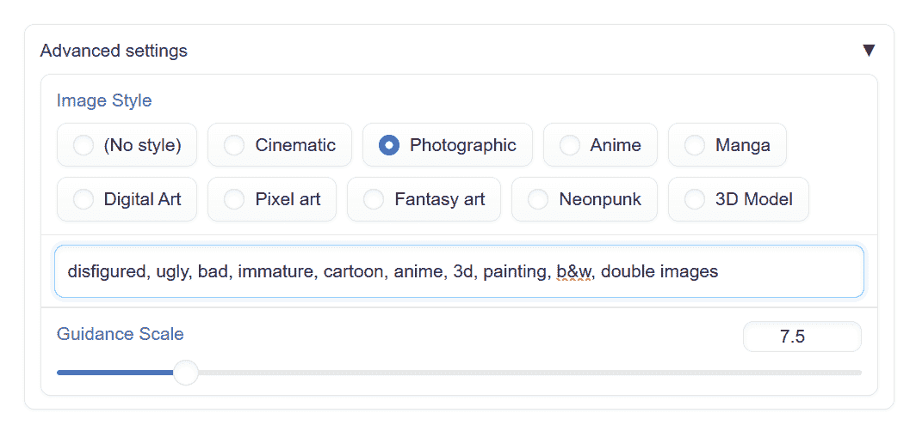

在高级设置中将“摄影”设置为生成图像的风格

我们将使用相同的提示生成年轻女孩坐在餐馆外面的逼真图像：

> 年轻女性的照片，突出头发，坐在餐馆外面，穿着裙子，边缘光，工作室照明，凝视镜头，特写，完美的眼睛

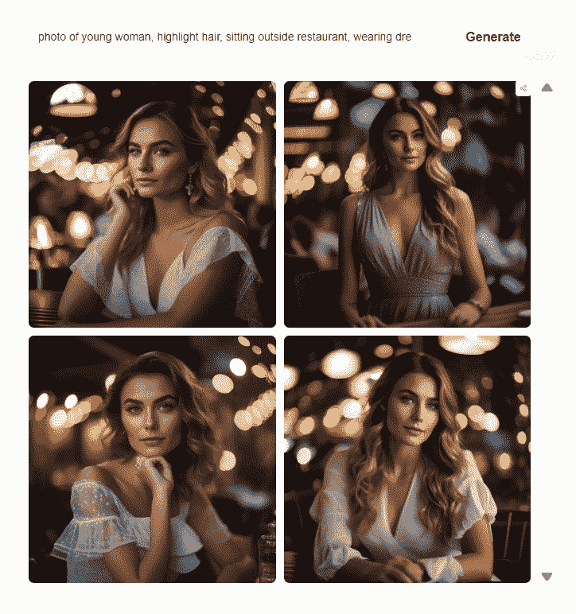

使用 SDXL 生成图片

结果令人印象深刻。眼睛、鼻子、嘴唇、阴影和颜色的渲染看起来非常逼真。通过将这里生成的结果与上一部分进行比较，可以明显看到 SDXL 与其旧版本之间的区别。

### Prodia 的快速 Stable Diffusion XL

Hugging Face Space 中有多个 SDXL。如果你习惯了 Stable Diffusion WebUI 用户界面，那么“快速 Stable Diffusion XL”空间适合你：

+   [`hf.co/spaces/prodia/sdx`](https://hf.co/spaces/prodia/sdx)

我们将编写相同的正面和负面提示以生成结果。

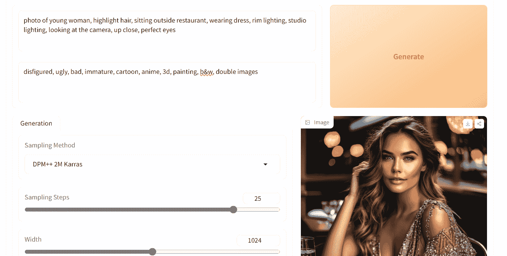

Hugging Face Space 上的 Prodia 快速 Stable Diffusion XL

我们在这方面获得了更好的阴影和清晰度。让我们尝试生成更多图像，以便对我们的结果做出结论。

让我们修改提示，生成一张男人和一张女人的图片。

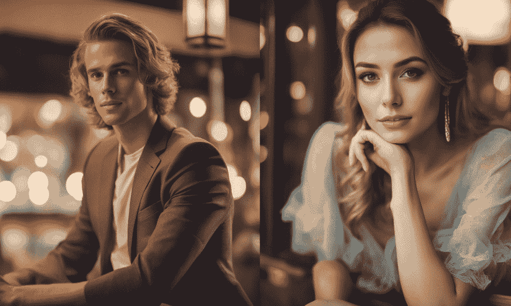

使用 SDXL 生成的一对男女的肖像

生成男女性角色的结果异常出色。为了测试模型的偏见，我们将生成印度血统的角色，并将设置更改为医院，在这里两个角色将作为医生。

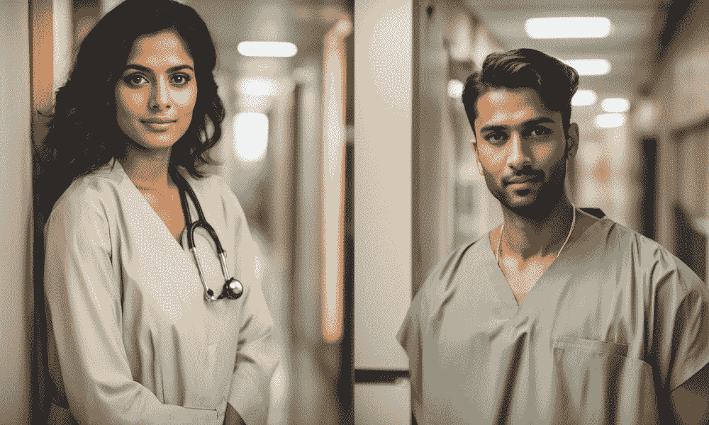

一对身着医生服装的女人和男人的图像，由 SDXL 生成

SDXL 生成了不错的结果，但图像看起来过于平滑，就像应用了 Instagram 滤镜一样。逼真的图像具有 SDXL 缺少的粉刺、痕迹、粗糙度和锐度。如果您切换到另一个检查点，这可能很难在原始 SDXL 模型中实现，但可以解决。

## 使用 CivitAI 模型检查点

在这一节中，我们将向前迈进，使用[CivitAI.com](https://civitai.com/)生成比 SDXL 更逼真的面孔。它是一个模型托管平台，允许用户上传和下载 Stable Diffusion 模型的专业版本。它也是一个用户可以发布 AI 生成图片作品的画廊。

在我们的情况下，我们对最佳逼真模型感兴趣。为了下载，我们将搜索关键词“**photorealistic**”。会有很多结果。最受欢迎的可能是最好的。因此，请确保您已设置过滤器，以按所有时间下载次数排序列出列表。

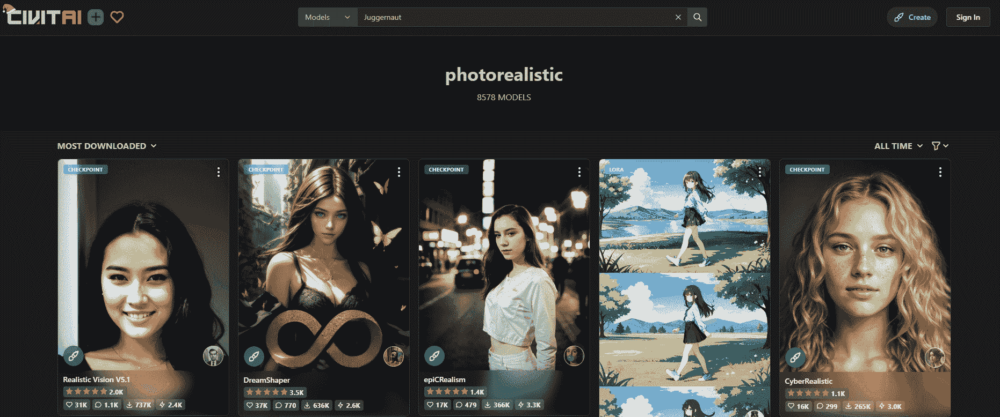

在 CivitAI.com 上搜索模型，将结果排序为“最多下载”和“所有时间”有助于找到高质量的模型。

选择最流行的模型，并按照显示的方式下载完整版本（在本例中命名为“Realisic Vision V5.1”）。

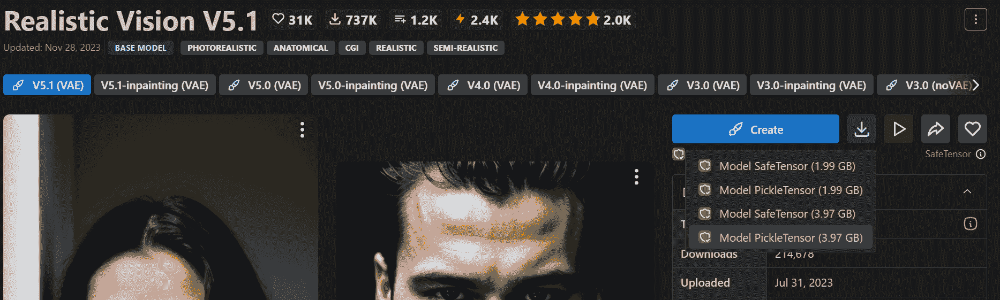

从 Civitai.com 下载模型检查点“Realistic Vision V5.1”（注意不是修复版本）。

然后，将下载的模型移动到 Stable Diffusion WebUI 模型目录 `stable-diffusion-webui/models/Stable-diffusion`。要在 Web UI 上激活模型，请点击刷新按钮，并通过单击下拉面板选择新模型，或者简单地重新启动 Web UI。

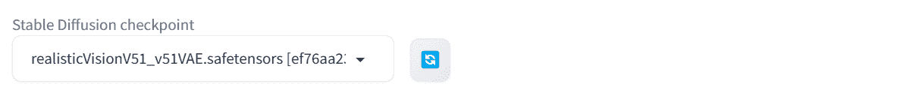

在 Web UI 的左上角选择模型检查点。

所有关于正向提示、负向提示和高级设置的信息都在模型页面上。因此，我们将使用这些信息，并修改以生成一个年轻女性的图像。

+   正向提示：“RAW 照片，美丽的 24 岁女性面部肖像照片，丰满的嘴唇，棕色的眼睛，眼镜，硬阴影，8k 超高清，单反相机，柔和的光照，高质量，胶片颗粒，富士胶片 XT3”

+   负面提示：“变形的虹膜，变形的瞳孔，半现实主义，CGI，3D，渲染，素描，卡通，绘画，动漫，突变的手和手指，变形，扭曲，毁容，画得不好，解剖结构差，错误的解剖结构，多余的肢体，缺失的肢体，漂浮的肢体，断开的肢体，突变，变异，丑陋，恶心，截肢”

+   采样器：DPM++ SDE Karras

+   步骤：25

+   CFG scale: 7

+   尺寸：912×512

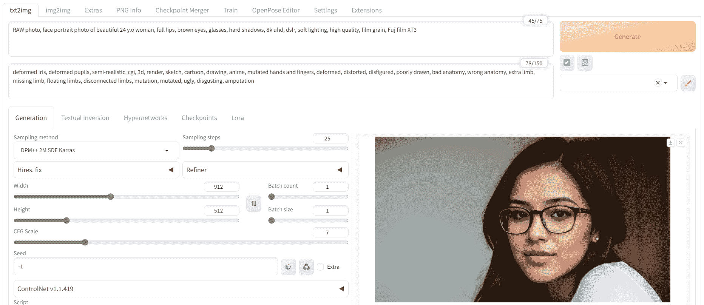

使用 Realistic Vision 检查点在 Web UI 上生成的肖像

我们得到了清晰准确的脸部图像。让我们尝试不同的提示生成更加逼真的面孔。

我们将从一张没有戴眼镜的男女图片开始。

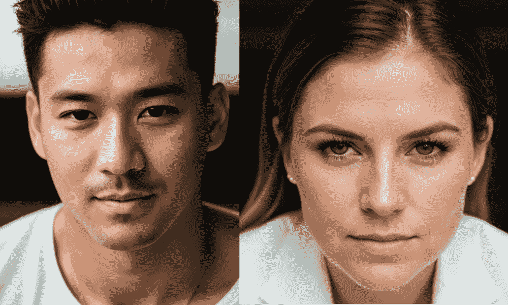

没有戴眼镜的男女。使用 Realistic Vision 模型检查点生成的图像。

然后，我们将修改提示生成印度男性和女性。

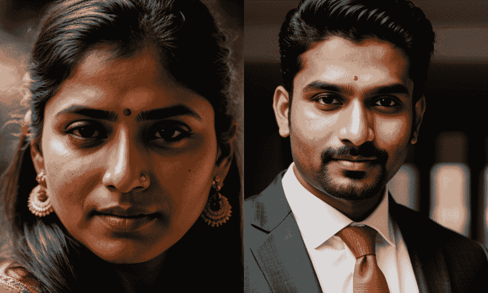

印度男性和女性。使用 Realistic Vision 模型检查点生成的图像。

你没看到区别吗？我们取得了很好的效果。脸部的纹理很好，皮肤标记自然，细节清晰。

## 进一步阅读

你可以通过以下资源深入了解这个话题：

+   [稳定扩散 1 与 2 – 你需要知道的](https://www.assemblyai.com/blog/stable-diffusion-1-vs-2-what-you-need-to-know/)

+   [最佳 AI 扩散模型：全面比较与指南](https://www.ikomia.ai/blog/best-ai-diffusion-models-comparison-guide)

## 总结

在这篇文章中，我们探索了使用 Stable Diffusion 生成超逼真和一致面孔的各种方法。我们从简单的技术开始，逐步进展到更高级的方法，以生成高度真实的图像。具体来说，我们涵盖了：

+   如何使用带有负面提示和高级设置的 Stable Diffusion 1.5 生成逼真的面孔。

+   如何使用 Hugging Face Spaces 的免费演示创建逼真的照片。

+   使用一个在高质量图像上微调的专业模型，以获取具有皮肤纹理和面部清晰度的完美照片。
