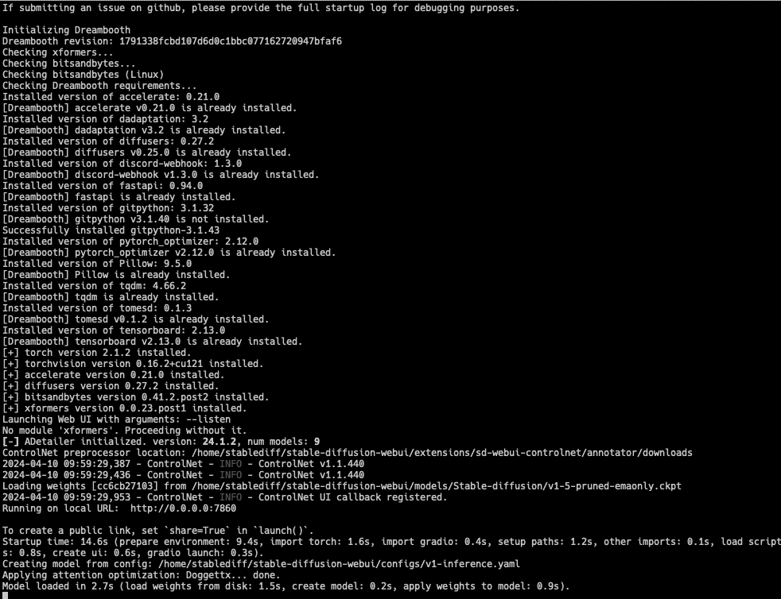
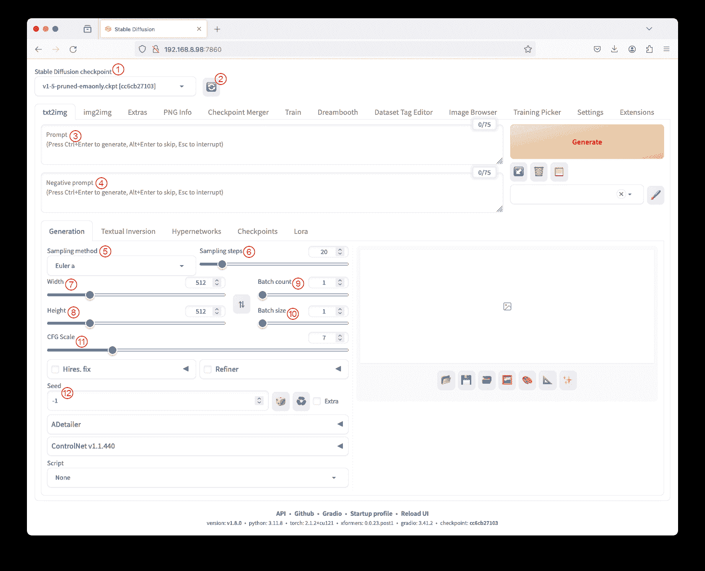
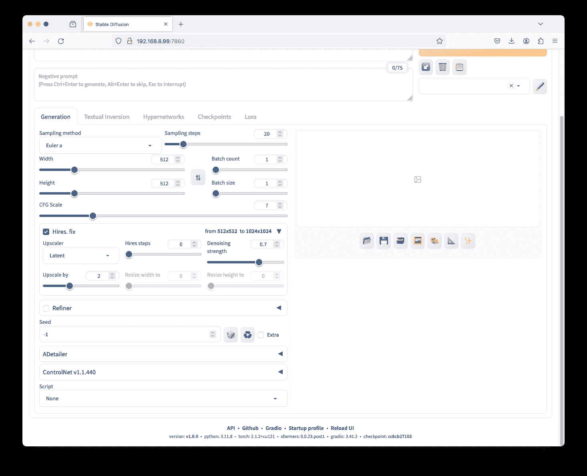
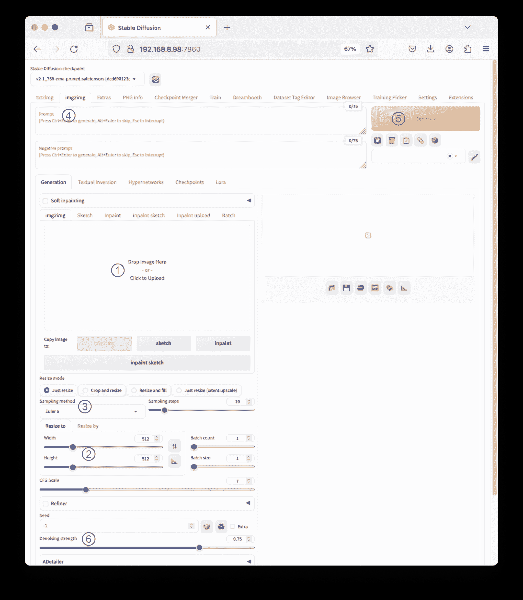
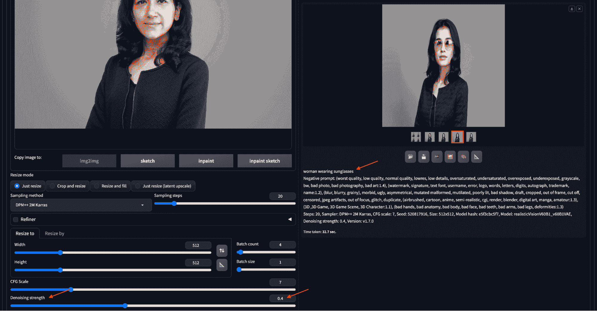
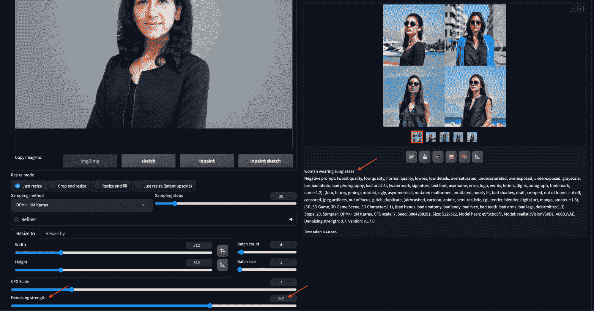
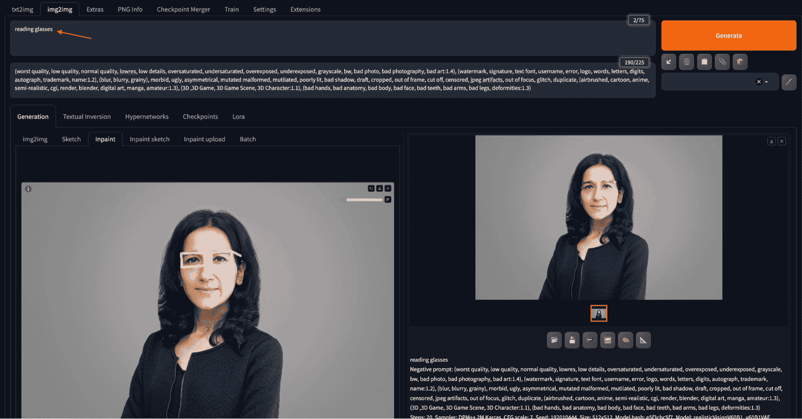
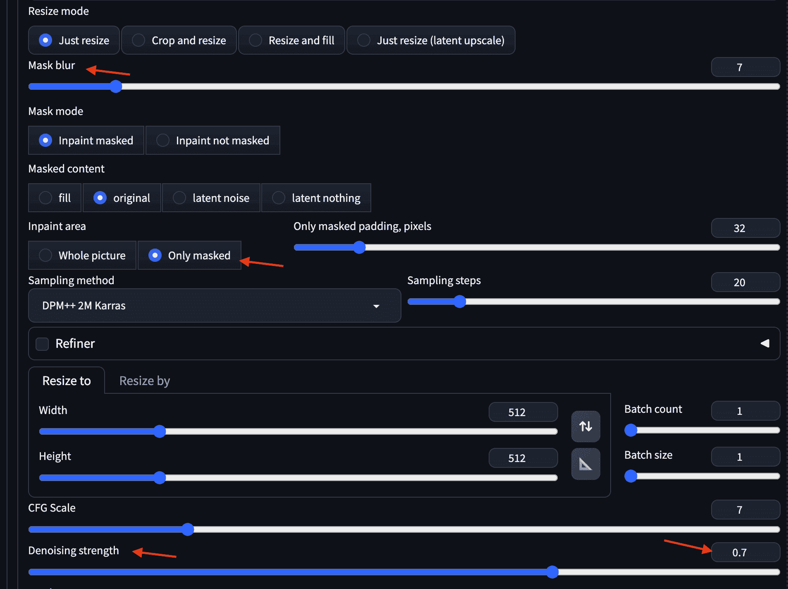
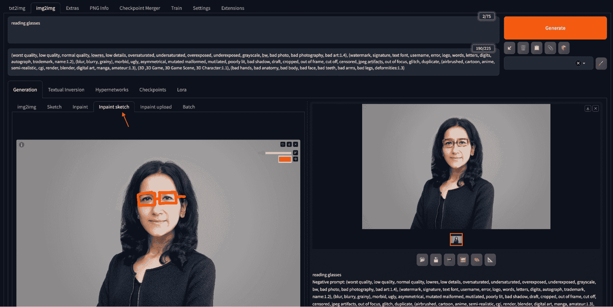

# 如何使用稳定扩散 Web UI 创建图像

> 原文：[`machinelearningmastery.com/how-to-create-images-using-stable-diffusion-web-ui/`](https://machinelearningmastery.com/how-to-create-images-using-stable-diffusion-web-ui/)

启动稳定扩散 Web UI 可以通过一个命令完成。之后，你可以通过浏览器控制图像生成管道。管道有很多活动部分，它们都以不同的方式重要。要有效指挥稳定扩散生成图像，你需要识别浏览器中的部件并了解它们的功能。在这篇文章中，你将学习稳定扩散 Web UI 中的许多组件及其如何影响你创建的图像。

**通过我的书籍** [《掌握稳定扩散的数字艺术》](https://machinelearningmastery.com/mastering-digital-art-with-stable-diffusion/) **快速启动你的项目**。它提供了**自学教程**和**有效的代码**。

让我们开始吧。


如何使用稳定扩散 Web UI 创建图像

图片来源：[Kelly Sikkema](https://unsplash.com/photos/yellow-click-pen-on-white-printer-paper-gcHFXsdcmJE)。保留所有权利。

## 概述

本文分为四部分，它们是：

+   启动 Web UI

+   txt2img 标签

+   img2img 标签

+   其他功能

## 启动 Web UI

在你准备好 Python 环境、下载了 Web UI 代码并将模型检查点存储在适当的目录中之后，你可以使用以下命令启动 Web UI：

```py
./webui.sh
```

Web UI 可以通过编辑 `webui-user.sh` 中的变量进行自定义。一个例子是允许 Web UI 服务器在一台计算机上运行，而你可以在另一台计算机上启动浏览器，这时你需要在 `webui-user.sh` 中添加以下行，以允许通过网络访问服务器：

```py
export COMMANDLINE_ARGS="--listen"
```



运行 `./webui.sh` 将启动一个稳定扩散的服务器

默认情况下，命令 `./webui.sh` 会在端口 7860 启动一个服务器，你可以通过浏览器访问它。如果你在桌面上运行它，可以使用 URL `http://127.0.0.1:7860`；但如果是在另一台计算机上，你需要使用该计算机的 IP 地址代替 `127.0.0.1`。你的浏览器应该显示如下的 UI：



稳定扩散 Web UI

在左上角，你可以看到一个下拉框用于选择检查点。检查点提供不同风格的绘图，例如更像照片的真实风格或更像卡通的风格。你可以在模型目录中存储多个检查点，但在管道中只能使用一个。下拉框下方有多个“标签”，你可以通过不同方式生成图像。每个标签都有不同的部件。大多数部件用于为生成管道提供参数。

让我们了解一下有哪些旋钮和参数可用于生成所需的图像。这些参数共同作用，帮助将算法引导到正确的方向。

## txt2img 标签页

UI 的启动页面显示了 txt2img 标签页——这是将文本提示转换为图像的 Stable Diffusion 的基本功能。顾名思义，这允许我们将希望或不希望的图像描述为**文本**提供给算法，然后算法将其转换为嵌入向量以生成图像。请参阅上面的截图，您可以看到解释的部件。

+   **检查点**由①标记。这个下拉菜单让我们选择模型。确保模型文件放在正确的文件夹中，如模型安装指南（在上一章中介绍）中详细说明。可以在[`civitai.com/`](https://civitai.com/)找到各种检查点和安全张量。

+   **刷新按钮**由②标记。位于检查点下拉菜单旁边，这个按钮更新可用模型的列表。如果您在检查点文件夹中添加了新模型但不想重新启动 web UI 服务器，可以使用它来刷新列表。

+   **提示文本框**由③标记。这是描述预期图像的地方。提供详细且具体的提示（将在下篇文章中详细介绍），以及关键词，有助于提高生成过程。

+   **负面提示文本框**由④标记。在使用 v2 模型时是可选但重要的，负面提示有助于指定图像中不应该包含的内容。通常，我们不想要的内容较不具体，可以用于许多使用场景。

+   **采样方法**和**步骤**由⑤和⑥标记。第一个扩散算法需要超过一百步来创建图像，但我们找到了加速的方法。这些参数决定了去噪过程算法和采样步骤的数量。采样方法的选择影响速度与质量的平衡。

    为了平衡速度、质量和良好的收敛性，DPM++ 2M Karras 使用 20-30 步或 UniPC 使用 20-30 步是一些不错的选择。另一方面，DPM++ SDE Karras 使用 10-15 步或 DDIM 使用 10-15 步提供了最佳的图像质量，但收敛较慢。

+   **宽度**和**高度**由⑦和⑧标记。它们指定输出图像的大小，确保与所选择的模型兼容。根据使用的是 v1 还是 v2 模型，建议进行调整。通常，您保持默认的 512×512 像素，只有在需要不同的宽高比时才进行更改。

+   **批次数量**和**大小**由⑨和⑩标记。这些设置控制图像生成管道运行的次数和每次运行生成的图像数量。批次大小是指一次生成中生成的图像数量。批次数量是生成的次数。

    推荐使用较高批次数量的单一批次，以最小化峰值资源的消耗来生成多个高分辨率图像。这种方法较慢，但图像质量远高于仅运行 512×512 图像的批次。

    由于图像生成是一个随机过程，将多个图像批量生成可以让你从多个结果中选择最佳的。

+   **无分类器指导尺度**如⑪标记所示。无分类器指导（CFG）尺度参数允许我们控制模型应多大程度上遵循提示，范围从主要忽略（值为 1）到严格遵循（值为 30）。谈到极端情况，CFG 评分非常低的值意味着提示大多被忽略，生成的图像是随机的。这可能无法实现使用 txt2img 的目的。另一方面，高 CFG 值迫使系统严格遵循提示，但可能会扭曲图像本身。这类似于对提示的过度拟合。

+   **随机种子**如⑫标记所示。种子值影响潜在空间中的初始随机张量，控制图像的内容。固定种子对于在调整提示时保持可重复性很有用。

你可以通过在提示框中描述你想生成的内容来尝试它（使用普通英语，除非你替换了默认的嵌入模型）。一旦设置好这些，点击右上角的“生成”按钮，你可以看到 Stable Diffusion 模型逐渐为你创建图像。下面是提示“外星人在丛林中探险”的一个示例，其他参数保持默认。


如上所述，生成的图像是按照宽度和高度参数指定的大小生成的。如果你需要比这更大的图像，你可以勾选“高分辨率修复”框，并点击三角形以展开更多选项：



“高分辨率修复”下的参数

这应用了**超分辨率**深度学习模型来处理 Stable Diffusion 的输出。它解决了 Stable Diffusion 的原始分辨率限制，为以较小尺寸生成的图像提供了放大功能。我们可以从各种放大和调整参数中进行选择，例如“放大倍数”（图像的宽度和高度的倍数），以实现所需的结果。

通常建议从批量中选择最佳图像，然后从 img2img 标签页进行调整以放大分辨率，而不是直接要求 Stable Diffusion 模型生成巨大的输出。

## img2img 标签页

在 txt2img 标签页旁边，img2img 标签页是用户利用图像到图像功能的地方。常见的用例包括**修复**、**素描**和将一张图像转换成另一张图像。

虽然你仍然可以看到提示和负提示文本框，但 img2img 标签页允许用户执行图像到图像的转换。一个典型的过程包括：

1.  将基础图像拖放到“生成”部分下的 img2img 子标签页中

1.  调整宽度或高度以保持新图像的纵横比。

1.  设置采样方法、采样步骤和批量大小。

1.  为新图像编写提示。

1.  按下生成按钮以创建图像，并调整去噪强度。

1.  img2img 选项卡中的其他参数包括调整模式和去噪强度，控制图像在转换过程中变化的程度。



img2img 的典型工作流程

最重要的设置之一是**去噪强度**。它表示模型对输入图像的艺术自由度。该参数的低值意味着图像的风格必须保留，而较高的值意味着在风格、颜色等方面的限制最少。

让我们通过以下两个相同输入提示“戴太阳镜的女人”的示例更好地理解这一点：



使用 img2img 制作带有太阳镜的头像。

在第一个示例中，将图像上传到 img2img 子选项卡，将去噪强度设置为 0.4，输入提示，然后点击“生成”。生成的图像将显示在右侧。生成的图像保留了几乎所有内容，除了面部，包括输入图像的颜色和风格。它准确反映了提示上的指示：戴太阳镜。

第二个例子的去噪强度值为 0.7，因此允许算法生成更多随机图像。我们还将批量计数设置为 4，以生成更多的输出。右侧的四个候选图像在颜色、姿势和风格上都不同，如下所示：



增加去噪强度将生成与输入图像偏离更多的图像。

### 草图和修复

除了上传图片外，用户还可以使用颜色草图工具绘制初始图片，进行创意修改或完全新的构图。草图功能允许用户输入背景图片，用颜色进行草图绘制，并根据草图和附带的提示生成图像。

在 img2img 选项卡中，一个广泛使用的功能是**修复**，它解决生成图像中的小缺陷。除了上传图像外，你还可以将从 txt2img 选项卡生成的图像发送到 img2img 选项卡进行修复。之后，你可以在图像上绘制以创建一个掩码。调整去噪强度、掩码内容和批量大小也会影响修复过程。以下是一个示例：



通过修复来给肖像添加一个阅读眼镜

你在输入图像上绘制遮罩以标出眼镜的位置。当你绘制时，可以使用键盘快捷键进行缩放和移动，以提高在较小区域工作时的精确度。键盘快捷键包括用于缩放的 Alt+Wheel（在 macOS 中为 Option+Wheel），用于调整画笔大小的 Ctrl+Wheel，重置缩放的“R”，进入/退出全屏的“S”，以及在移动光标时按住“F”来平移。完成遮罩绘制后，你在提示文本框中输入“眼镜”，然后点击“生成”。

如果你觉得在浏览器上绘制遮罩太困难，可以使用其他绘图工具，如 Photoshop，来创建遮罩图像。然后在“修复上传”选项卡中分别上传图像和遮罩。

你还可以设置批处理大小，一次创建多个图像，所有图像都基于相同的提示和输入。这允许你从大量变体中选择最佳输出。

上述示例保留了原始图像，但通过在图像的遮罩区域粗略绘制眼镜的结构，使用修复功能添加了眼镜。修复的一些显著设置包括遮罩模糊（遮罩外部的像素可以被改变的范围）、修复区域（遮罩是否意味着保持或更改）和去噪强度，表示产生变化的周围区域。



一些有用的修复参数

更高级的修复版本是**修复素描**。在修复过程中，你创建一个遮罩，只有被遮罩的部分会根据提示重新生成。在修复素描中，你用彩色铅笔在图像上绘制，这样你绘制的内容与提示一起控制输出。例如，相同的眼镜提示生成了一副红色框架的眼镜，因为素描是红色的：



红色框架眼镜是通过修复素描创建的

## 其他功能

正如你已经注意到的，网页 UI 不仅有 txt2img 和 img2img。实际上，你可以通过安装**扩展**来为网页 UI 添加更多功能。以下是一些顶级选项卡：

+   **附加选项卡**：它允许你提供一张图像进行重新调整大小。从技术上讲，你只是调用了管道的超分辨率步骤。

+   **PNG 信息**：如果你生成了一张图像并将其保存为 PNG 文件，图像生成的详细信息会存储在图像的 EXIF 数据中。这个工具帮助从你上传的生成图像中检索参数值，如提示和设置。

+   **设置选项卡**：在这个选项卡中可以调整许多设置，包括模型和输出的目录。其中最有用的设置之一是“面部恢复”。这个功能应用了一个额外的模型，专门用于修复面部的缺陷。用户可以在设置选项卡中选择一个面部恢复模型，并将其应用于 txt2img 选项卡中的每个生成图像。通过调整 CodeFormer 权重参数可以微调修复效果。


使用 CodeFormer 模型进行面部恢复设置。

## 进一步阅读

关于 Web UI 最好的学习资源是 GitHub 工具的 wiki 页面。

+   [稳定扩散 WebUI 维基](https://github.com/AUTOMATIC1111/stable-diffusion-webui/wiki)

## 总结

在本文中，您学习了如何从浏览器中调用稳定扩散 Web UI。

虽然稳定扩散是一种强大的工具，但它仍然在输出的某些属性上缺乏精确控制。在某些情况下，它面临着图像质量下降和颜色不准确的问题。当你使用它时，应该牢记它的局限性。人工智能生成图像的世界每天都在变得更好，速度比以往任何时候都快。在下一篇文章中，让我们了解一些强大的提示技术，以拓展生成图像的极限。
